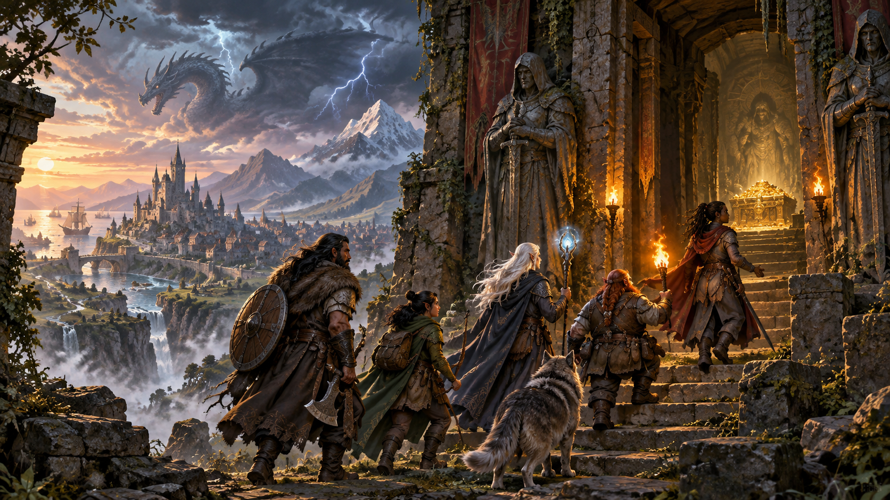
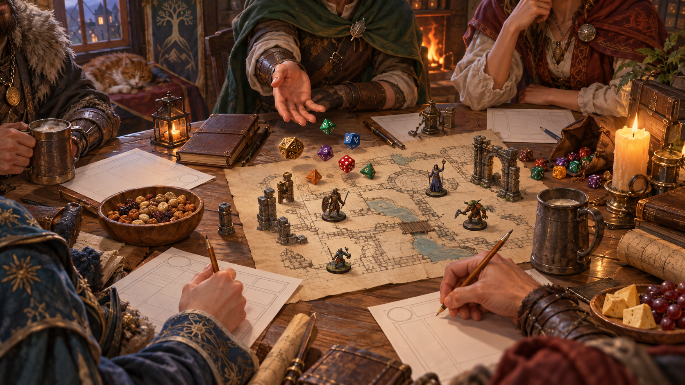
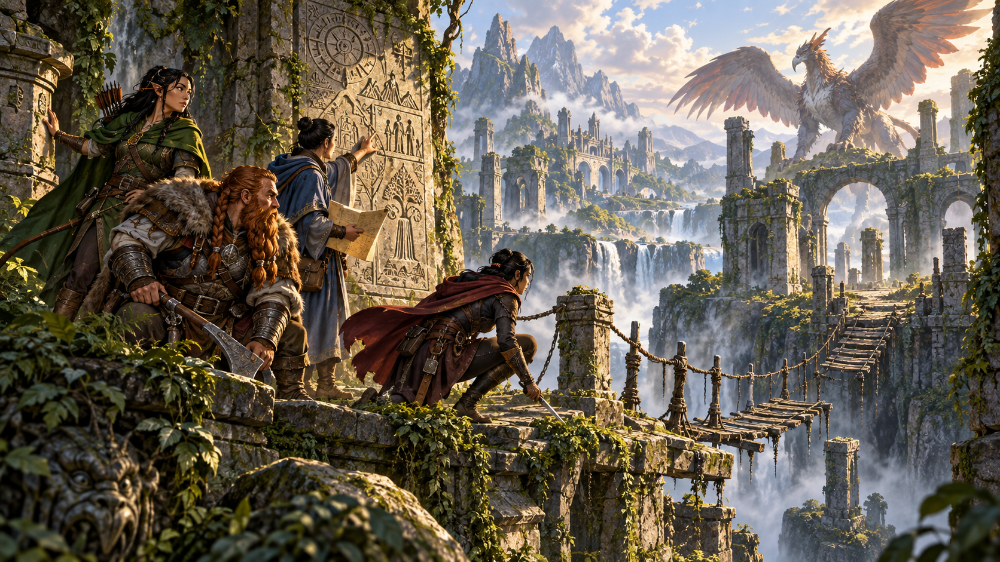
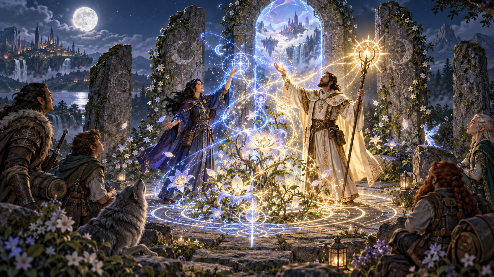

# Giới thiệu

Nguồn: *D&D Basic Rules (Version 1.0), 2018*, trang 3-6.

[Mục lục](00-index.md) · [Chương tiếp theo](02-chapter-01-character-creation.md)

Trò chơi nhập vai **Dungeons & Dragons** xoay quanh việc kể chuyện trong những thế giới của kiếm và phép thuật. Trò chơi có nhiều nét tương đồng với những trò giả tưởng thời thơ ấu. Cũng như những trò chơi ấy, D&D được dẫn dắt bởi trí tưởng tượng: bạn hình dung một tòa lâu đài cao vút dưới bầu trời đêm giông bão, rồi tưởng tượng một nhà phiêu lưu trong thế giới kỳ ảo sẽ phản ứng thế nào trước những thử thách mà khung cảnh ấy đặt ra.

*Trò chơi mở ra một thế giới của trí tưởng tượng, hợp tác, khám phá và những lựa chọn táo bạo. Minh họa nguyên bản tạo bằng OpenAI ImageGen cho bản dịch này.*

> **Quản trò (Dungeon Master, DM):** Sau khi đi qua những đỉnh núi lởm chởm, con đường đột ngột rẽ về phía đông, và lâu đài Ravenloft sừng sững hiện ra trước mắt các bạn. Những tháp đá đổ nát lặng lẽ canh chừng lối đến lâu đài. Chúng trông như những chốt gác bị bỏ hoang. Phía sau là một vực sâu rộng ngoác, chìm khuất trong màn sương dày bên dưới. Một cây cầu kéo đang hạ xuống bắc qua vực, dẫn tới lối vào hình vòm của sân lâu đài. Xích cầu kẽo kẹt trong gió; những mắt xích sắt bị gỉ ăn mòn căng ra dưới sức nặng. Trên những bức tường cao và vững chắc, các tượng quỷ đá nhìn các bạn bằng những hốc mắt rỗng, nhe nụ cười ghê rợn. Một cửa song nâng bằng gỗ mục, phủ đầy mảng xanh, treo trong đường hầm dẫn vào. Phía sau nó, cửa chính của lâu đài Ravenloft mở rộng, để ánh sáng ấm áp, rực rỡ tràn ra sân.
>
> **Phillip (đóng vai Gareth):** Tôi muốn nhìn kỹ những tượng quỷ đá. Tôi có cảm giác chúng không chỉ là tượng.
>
> **Amy (đóng vai Riva):** Cây cầu kéo trông có vẻ không chắc chắn à? Tôi muốn kiểm tra độ vững của nó. Tôi nghĩ chúng ta có thể qua được không, hay nó sẽ sập dưới sức nặng của cả nhóm?

Khác với một trò giả tưởng tự do, D&D tạo cấu trúc cho câu chuyện và cung cấp cách xác định hậu quả từ hành động của các nhà phiêu lưu. Người chơi tung xúc xắc để biết đòn tấn công trúng hay trượt, nhân vật có leo được vách đá hay không, có lăn tránh được một tia sét ma thuật hay không, hoặc có thực hiện được một việc nguy hiểm nào khác hay không. Mọi chuyện đều có thể xảy ra, nhưng xúc xắc khiến một số kết quả có khả năng xảy ra cao hơn những kết quả khác.

> **DM:** Được rồi, từng người một nhé. Phillip, bạn đang quan sát những tượng quỷ đá phải không?
>
> **Phillip:** Đúng. Có dấu hiệu nào cho thấy chúng là sinh vật chứ không phải vật trang trí không?
>
> **DM:** Hãy thực hiện một phép kiểm tra Trí tuệ (Intelligence).
>
> **Phillip:** Tôi có được dùng kỹ năng Điều tra (Investigation) không?
>
> **DM:** Được chứ!
>
> **Phillip (tung d20):** Ôi. Bảy.
>
> **DM:** Theo bạn thấy, chúng là vật trang trí. Còn Amy, Riva đang kiểm tra cây cầu kéo phải không?

Trong Dungeons & Dragons, mỗi người chơi tạo ra một nhà phiêu lưu, còn gọi là **nhân vật (character)**, và lập nhóm với những nhà phiêu lưu khác do bạn bè điều khiển. Cùng nhau, cả nhóm có thể khám phá một hầm ngục tối tăm, một thành phố đổ nát, một lâu đài bị ma ám, một ngôi đền thất lạc sâu trong rừng rậm, hoặc một hang động đầy dung nham bên dưới ngọn núi bí ẩn. Các nhà phiêu lưu có thể giải câu đố, trò chuyện với nhân vật khác, chiến đấu với quái vật kỳ ảo, và tìm được những vật phẩm ma thuật tuyệt vời cùng nhiều kho báu khác.

Tuy nhiên, một người chơi đảm nhiệm vai trò **Quản trò (Dungeon Master, DM)**, người kể chuyện chính và trọng tài của trò chơi. DM tạo ra các cuộc phiêu lưu cho nhân vật; nhân vật vượt qua hiểm nguy và quyết định khám phá những con đường nào. DM có thể mô tả lối vào lâu đài Ravenloft, rồi người chơi quyết định muốn nhân vật của mình làm gì. Họ sẽ đi qua cây cầu kéo đã xuống cấp nguy hiểm? Buộc mình với nhau bằng dây để giảm nguy cơ có người rơi xuống nếu cầu sập? Hay thi triển một phép đưa cả nhóm vượt qua vực?

Sau đó, DM xác định kết quả hành động của các nhà phiêu lưu và kể lại những gì họ trải nghiệm. Vì DM có thể ứng biến để phản hồi bất cứ điều gì người chơi thử làm, D&D vô cùng linh hoạt, và mỗi cuộc phiêu lưu đều có thể trở nên hấp dẫn, đầy bất ngờ.

Trò chơi không có điểm kết thúc thực sự. Khi một câu chuyện hay nhiệm vụ khép lại, một câu chuyện khác có thể bắt đầu, tạo thành một câu chuyện liên tục gọi là **chiến dịch (campaign)**. Nhiều người duy trì chiến dịch suốt nhiều tháng hoặc nhiều năm, gặp bạn bè mỗi tuần hoặc với tần suất tương tự để tiếp tục câu chuyện từ chỗ đã dừng. Các nhà phiêu lưu trở nên mạnh hơn khi chiến dịch tiếp diễn. Mỗi quái vật bị đánh bại, mỗi cuộc phiêu lưu hoàn thành và mỗi kho báu thu hồi được không chỉ bổ sung vào câu chuyện, mà còn mang lại những năng lực mới cho các nhà phiêu lưu. Sự gia tăng sức mạnh này được thể hiện qua **cấp độ (level)** của nhân vật.

Trong Dungeons & Dragons không có thắng và thua, ít nhất là theo nghĩa thông thường của hai từ ấy. DM và người chơi cùng tạo nên một câu chuyện hấp dẫn về những nhà phiêu lưu gan dạ đối mặt với hiểm nguy chết người. Đôi khi một nhân vật có thể chết thảm, bị quái vật hung dữ xé xác hoặc bị một kẻ phản diện độc ác sát hại. Dù vậy, những nhà phiêu lưu còn lại có thể tìm phép thuật mạnh mẽ để hồi sinh đồng đội đã ngã xuống, hoặc người chơi có thể tạo nhân vật mới để tiếp tục. Nhóm có thể không hoàn thành cuộc phiêu lưu, nhưng nếu mọi người đều vui vẻ và tạo được một câu chuyện đáng nhớ, tất cả đều chiến thắng.

## Những thế giới phiêu lưu (Worlds of Adventure)

Những thế giới của Dungeons & Dragons là nơi có phép thuật và quái vật, những chiến binh dũng cảm và các cuộc phiêu lưu ngoạn mục. Chúng khởi đầu từ nền tảng kỳ ảo thời trung cổ, rồi bổ sung những sinh vật, địa điểm và phép thuật khiến từng thế giới trở nên độc đáo.

*Mỗi thế giới phiêu lưu chứa những vùng đất, nền văn hóa và bí ẩn đang chờ được khám phá. Minh họa nguyên bản tạo bằng OpenAI ImageGen cho bản dịch này.*

Các thế giới ấy tồn tại trong một vũ trụ rộng lớn gọi là **đa vũ trụ (multiverse)**. Chúng kết nối với nhau theo những cách kỳ lạ, bí ẩn, đồng thời nối với các **cõi tồn tại (planes of existence)** khác, chẳng hạn Cõi Nguyên tố Lửa (Elemental Plane of Fire) và Những Tầng Sâu Vô Tận của Abyss (Infinite Depths of the Abyss). Đa vũ trụ chứa vô số thế giới đa dạng. Nhiều thế giới đã được xuất bản làm bối cảnh chính thức cho D&D. Các truyền thuyết của những bối cảnh Forgotten Realms, Dragonlance, Greyhawk, Dark Sun, Mystara và Eberron đan xen trong kết cấu của đa vũ trụ. Bên cạnh đó còn có hàng trăm nghìn thế giới do nhiều thế hệ người chơi D&D tạo ra cho trò chơi của riêng mình. Giữa sự phong phú ấy, bạn cũng có thể tạo một thế giới của riêng bạn.

Các thế giới có những đặc điểm chung, nhưng mỗi thế giới nổi bật nhờ lịch sử và văn hóa riêng, những quái vật và chủng tộc đặc trưng, địa lý kỳ ảo, hầm ngục cổ xưa cùng các phản diện đầy mưu mô. Một số chủng tộc có đặc điểm khác thường tùy thế giới. Chẳng hạn, halfling trong bối cảnh Dark Sun là những kẻ ăn thịt người sống trong rừng rậm, còn elf là dân du mục sa mạc. Một số thế giới có những chủng tộc không xuất hiện ở bối cảnh khác, như **warforged** của Eberron: các binh sĩ được chế tạo và ban sự sống để chiến đấu trong Cuộc Chiến Cuối Cùng (Last War). Một số thế giới xoay quanh một câu chuyện lớn, như Cuộc Chiến Ngọn Thương (War of the Lance), giữ vai trò trung tâm trong Dragonlance. Tuy nhiên, tất cả đều là thế giới D&D, và bạn có thể dùng luật trong tài liệu này để tạo nhân vật và chơi trong bất kỳ thế giới nào.

DM có thể đặt chiến dịch trong một thế giới kể trên hoặc trong thế giới tự tạo. Vì các thế giới D&D rất đa dạng, bạn nên hỏi DM về những **luật riêng của nhóm (house rules)** có ảnh hưởng đến cách chơi. Cuối cùng, Quản trò là người có quyền quyết định về chiến dịch và bối cảnh của nó, ngay cả khi dùng một thế giới đã được xuất bản.

## Sử dụng tài liệu này (Using These Rules)

Tài liệu Luật cơ bản D&D có bốn phần chính.

**Phần 1** nói về việc tạo nhân vật, cung cấp các quy tắc và hướng dẫn cần thiết để xây dựng nhân vật bạn sẽ điều khiển. Phần này có thông tin về những chủng tộc, lớp nhân vật, xuất thân, trang bị và các lựa chọn tùy chỉnh khác. Nhiều quy tắc trong phần 1 dựa vào nội dung của phần 2 và phần 3.

**Phần 2** trình bày chi tiết cách chơi, mở rộng những kiến thức cơ bản trong phần giới thiệu. Phần này đề cập các kiểu tung xúc xắc dùng để xác định thành công hay thất bại khi nhân vật thử làm một việc, đồng thời mô tả ba nhóm hoạt động lớn trong trò chơi: khám phá, tương tác và chiến đấu.

**Phần 3** dành cho phép thuật, bao gồm bản chất của phép thuật trong các thế giới D&D, quy tắc thi triển phép và một số phép tiêu biểu mà nhân vật, cũng như quái vật có khả năng dùng phép, có thể sử dụng.

**Phần 4** đặc biệt dành cho Quản trò. Phần này hướng dẫn cách thử thách nhân vật người chơi bằng những đối thủ phù hợp để kiểm nghiệm năng lực của họ, kèm hàng chục mô tả quái vật có thể dùng ngay. Phần này cũng giới thiệu một số vật phẩm ma thuật mà nhân vật có thể nhận làm phần thưởng khi đánh bại những quái vật ấy.

Cuối tài liệu là nội dung bổ sung. **Phụ lục A** tập hợp định nghĩa các trạng thái có thể ảnh hưởng đến nhân vật và quái vật. **Phụ lục B** giới thiệu ngắn gọn các vị thần trong trò chơi, đặc biệt là ở Forgotten Realms. **Phụ lục C** mô tả năm phe phái ở Forgotten Realms mà nhân vật có thể tham gia. Cuối cùng, **phiếu nhân vật ba trang** cung cấp một cách thống nhất để ghi và theo dõi năng lực, tài sản của nhân vật.

## Cách chơi (How to Play)

Dungeons & Dragons diễn ra theo trình tự cơ bản sau.

1. **DM mô tả môi trường.** DM cho người chơi biết nhân vật đang ở đâu và có gì xung quanh, trình bày những lựa chọn cơ bản trước mắt: có bao nhiêu cửa ra khỏi phòng, trên bàn có gì, trong quán rượu có những ai, v.v.
2. **Người chơi mô tả việc mình muốn làm.** Đôi khi một người nói thay cả **nhóm phiêu lưu (party)**, chẳng hạn: “Chúng tôi sẽ đi qua cửa phía đông.” Lúc khác, mỗi nhân vật làm một việc: một người khám xét rương kho báu, người thứ hai xem xét ký hiệu bí truyền khắc trên tường, còn người thứ ba canh chừng quái vật. Người chơi không cần lần lượt hành động, nhưng DM lắng nghe từng người và quyết định cách giải quyết các hành động đó.

   Đôi khi việc xác định kết quả rất đơn giản. Nếu nhân vật muốn đi qua phòng và mở cửa, DM có thể chỉ nói cửa mở rồi mô tả phía bên kia. Nhưng cửa có thể bị khóa, dưới sàn có thể giấu bẫy chết người, hoặc hoàn cảnh nào khác khiến việc ấy trở nên khó khăn. Khi đó, DM quyết định điều gì xảy ra, thường dựa vào một lần tung xúc xắc để xác định kết quả.

3. **DM kể lại kết quả hành động của các nhà phiêu lưu.** Việc mô tả kết quả thường dẫn tới một quyết định mới, đưa diễn biến trò chơi trở lại bước 1.

Trình tự này áp dụng dù các nhà phiêu lưu đang thận trọng khám phá phế tích, trò chuyện với một hoàng tử xảo quyệt hay giao chiến sống còn với một con rồng hùng mạnh. Trong một số tình huống, đặc biệt là chiến đấu, hành động có cấu trúc chặt chẽ hơn, và người chơi cùng DM lần lượt lựa chọn, giải quyết hành động. Nhưng phần lớn thời gian, trò chơi diễn ra linh hoạt, thích ứng với hoàn cảnh của cuộc phiêu lưu.

Diễn biến cuộc phiêu lưu thường diễn ra trong trí tưởng tượng của người chơi và DM, dựa vào lời mô tả của DM để dựng bối cảnh. Một số DM dùng âm nhạc, tranh ảnh hoặc hiệu ứng âm thanh thu sẵn để tạo không khí. Nhiều người chơi và DM dùng những giọng nói khác nhau cho các nhà phiêu lưu, quái vật và nhân vật họ thể hiện. Đôi khi DM trải bản đồ, dùng quân đánh dấu hoặc mô hình nhỏ để biểu diễn từng sinh vật trong cảnh, giúp người chơi theo dõi vị trí của mọi người.

### Xúc xắc trong trò chơi (Game Dice)

Trò chơi sử dụng xúc xắc đa diện với nhiều số mặt khác nhau. Bạn có thể tìm chúng tại cửa hàng trò chơi và nhiều hiệu sách.

*Xúc xắc giúp xác định kết quả khi hành động có thể thành công hoặc thất bại. Minh họa nguyên bản tạo bằng OpenAI ImageGen cho bản dịch này.*

Trong tài liệu này, mỗi loại xúc xắc được ký hiệu bằng chữ **d** theo sau bởi số mặt: **d4, d6, d8, d10, d12 và d20**. Chẳng hạn, d6 là xúc xắc sáu mặt, dạng khối lập phương thường thấy trong nhiều trò chơi.

Xúc xắc phần trăm, hay **d100**, hoạt động hơi khác. Bạn tạo một số từ 1 đến 100 bằng cách tung hai xúc xắc mười mặt khác nhau, mỗi viên đánh số từ 0 đến 9. Một viên, được chỉ định trước khi tung, cho chữ số hàng chục; viên còn lại cho hàng đơn vị. Nếu tung được 7 và 1, kết quả là 71. Hai số 0 biểu thị 100. Một số xúc xắc mười mặt ghi số theo hàng chục (00, 10, 20, v.v.), giúp phân biệt hàng chục và hàng đơn vị. Khi đó, 70 và 1 cho kết quả 71; 00 và 0 cho kết quả 100.

Khi cần tung xúc xắc, luật cho biết phải tung bao nhiêu viên, loại nào và cộng những **hệ số điều chỉnh (modifiers)** nào. Chẳng hạn, **3d8 + 5** nghĩa là tung ba xúc xắc tám mặt, cộng kết quả của chúng rồi cộng thêm 5.

Ký hiệu d cũng xuất hiện trong **1d3** và **1d2**. Để mô phỏng 1d3, tung d6 rồi chia kết quả cho 2, **làm tròn lên**. Để mô phỏng 1d2, tung bất kỳ xúc xắc nào rồi gán kết quả là 1 nếu số tung được là lẻ, hoặc 2 nếu là chẵn. Cách khác: nếu kết quả lớn hơn một nửa số mặt của xúc xắc thì lấy 2; nếu không thì lấy 1.

### Xúc xắc d20 (The D20)

Nhát kiếm của một nhà phiêu lưu có làm rồng bị thương hay chỉ bật khỏi lớp vảy cứng như sắt? Một con ogre có tin lời bịp bợm khó tin không? Nhân vật có bơi qua được dòng sông cuồn cuộn? Nhân vật có tránh được phần lớn vụ nổ của một quả cầu lửa hay phải chịu toàn bộ sát thương từ ngọn lửa? Khi kết quả hành động chưa chắc chắn, Dungeons & Dragons dùng xúc xắc hai mươi mặt, **d20**, để xác định thành công hay thất bại.

Mỗi nhân vật và quái vật có năng lực được xác định bằng sáu **điểm thuộc tính (ability scores)**: **Sức mạnh (Strength), Khéo léo (Dexterity), Thể chất (Constitution), Trí tuệ (Intelligence), Minh triết (Wisdom) và Sức hút (Charisma)**. Với phần lớn nhà phiêu lưu, các điểm này thường nằm trong khoảng 3 đến 18. Quái vật có thể có điểm thấp tới 1 hoặc cao tới 30. Các điểm thuộc tính và **hệ số thuộc tính (ability modifiers)** tính từ chúng là cơ sở cho gần như mọi lần tung d20 mà người chơi thực hiện cho nhân vật hoặc quái vật.

**Phép kiểm tra thuộc tính (ability check), lần tung tấn công (attack roll) và lần tung cứu nguy (saving throw)** là ba kiểu tung d20 chính, tạo thành cốt lõi của luật chơi. Cả ba đều theo các bước đơn giản sau.

1. **Tung xúc xắc và cộng hệ số.** Tung d20 và cộng hệ số thích hợp. Thông thường đó là hệ số tính từ một trong sáu điểm thuộc tính; đôi khi còn cộng **thưởng thành thạo (proficiency bonus)** để thể hiện kỹ năng cụ thể của nhân vật. Xem chương 1 để biết thêm về từng thuộc tính và cách tính hệ số.
2. **Áp dụng thưởng và phạt theo hoàn cảnh.** Đặc tính lớp nhân vật, một phép, hoàn cảnh cụ thể hoặc hiệu ứng khác có thể cho thêm thưởng hay phạt vào phép kiểm tra.
3. **So sánh tổng với một giá trị mục tiêu.** Nếu tổng bằng hoặc lớn hơn giá trị mục tiêu, phép kiểm tra thuộc tính, lần tung tấn công hoặc lần tung cứu nguy thành công. Nếu thấp hơn thì thất bại. DM thường là người xác định giá trị mục tiêu và cho người chơi biết kết quả thành công hay thất bại.

Giá trị mục tiêu của phép kiểm tra thuộc tính hoặc lần tung cứu nguy gọi là **Độ khó (Difficulty Class, DC)**. Giá trị mục tiêu của lần tung tấn công gọi là **Chỉ số giáp (Armor Class, AC)**.

Quy tắc đơn giản này quyết định kết quả của phần lớn công việc trong D&D. Chương 7 cung cấp quy tắc chi tiết hơn về cách sử dụng d20.

### Lợi thế và bất lợi (Advantage and Disadvantage)

Đôi khi phép kiểm tra thuộc tính, lần tung tấn công hoặc lần tung cứu nguy chịu ảnh hưởng của những tình huống đặc biệt gọi là **lợi thế (advantage)** và **bất lợi (disadvantage)**. Lợi thế thể hiện hoàn cảnh thuận lợi cho lần tung d20; bất lợi thể hiện điều ngược lại. Khi có lợi thế hoặc bất lợi, bạn tung thêm một d20. Dùng **kết quả cao hơn** nếu có lợi thế, và **kết quả thấp hơn** nếu có bất lợi. Ví dụ, nếu có bất lợi và tung được 17 cùng 5, bạn dùng 5. Nếu có lợi thế với hai kết quả đó, bạn dùng 17.

Chương 7 trình bày quy tắc chi tiết hơn về lợi thế và bất lợi.

### Quy tắc cụ thể ưu tiên hơn quy tắc chung (Specific Beats General)

Tài liệu này, đặc biệt là phần 2 và phần 3, chứa những quy tắc chi phối cách trò chơi vận hành. Tuy nhiên, nhiều đặc điểm chủng tộc, đặc tính lớp nhân vật, phép, vật phẩm ma thuật, năng lực quái vật và yếu tố khác phá vỡ một phần quy tắc chung, tạo ra ngoại lệ. Hãy nhớ: **Nếu một quy tắc cụ thể mâu thuẫn với quy tắc chung, quy tắc cụ thể được ưu tiên.**

Ngoại lệ thường nhỏ. Chẳng hạn, nhiều nhà phiêu lưu không thành thạo cung dài (longbow), nhưng mọi elf rừng (wood elf) đều thành thạo nhờ đặc điểm chủng tộc. Đó là một ngoại lệ nhỏ. Những ngoại lệ khác rõ rệt hơn: bình thường nhân vật không thể đi xuyên tường, nhưng một số phép cho phép làm điều đó. Phép thuật tạo ra phần lớn các ngoại lệ lớn.

### Làm tròn xuống (Round Down)

Còn một quy tắc chung cần biết ngay từ đầu: bất cứ khi nào chia một số trong trò chơi, nếu kết quả có phần lẻ thì **làm tròn xuống**, ngay cả khi phần lẻ bằng hoặc lớn hơn một nửa.

## Các cuộc phiêu lưu (Adventures)

Dungeons & Dragons gồm một nhóm nhân vật lên đường thực hiện cuộc phiêu lưu do Quản trò đưa ra. Mỗi nhân vật đóng góp những năng lực riêng qua điểm thuộc tính, kỹ năng, đặc tính lớp, đặc điểm chủng tộc, trang bị và vật phẩm ma thuật. Nhân vật nào cũng khác nhau, với điểm mạnh và điểm yếu riêng; vì vậy nhóm tốt nhất là nhóm mà các thành viên bổ trợ nhau và bù đắp nhược điểm của đồng đội. Các nhà phiêu lưu phải hợp tác để hoàn thành cuộc phiêu lưu.

*Cuộc phiêu lưu kết hợp khám phá, tương tác xã hội và chiến đấu thành một câu chuyện chung. Minh họa nguyên bản tạo bằng OpenAI ImageGen cho bản dịch này.*

Cuộc phiêu lưu là trung tâm của trò chơi: một câu chuyện có mở đầu, diễn biến và kết thúc. DM có thể tự tạo hoặc mua một cuộc phiêu lưu có sẵn, rồi chỉnh sửa cho phù hợp với nhu cầu và mong muốn của mình. Dù theo cách nào, cuộc phiêu lưu cũng có một bối cảnh kỳ ảo, như hầm ngục dưới lòng đất, lâu đài đổ nát, vùng hoang dã hoặc thành phố náo nhiệt. Nó có dàn nhân vật phong phú: các nhà phiêu lưu do người chơi khác tại bàn tạo và điều khiển, cùng những **nhân vật không do người chơi điều khiển (nonplayer characters, NPC)**. NPC có thể là người bảo trợ, đồng minh, kẻ thù, người được thuê hoặc chỉ là nhân vật phụ làm nền. Thường một NPC là phản diện, và mục đích của kẻ đó thúc đẩy phần lớn diễn biến cuộc phiêu lưu.

Trong hành trình, nhân vật đối mặt với nhiều sinh vật, đồ vật và tình huống cần xử lý. Đôi khi các nhà phiêu lưu và sinh vật khác cố giết hoặc bắt nhau trong chiến đấu. Lúc khác, họ trò chuyện với một sinh vật, thậm chí một đồ vật ma thuật, để đạt một mục đích. Họ cũng thường dành thời gian giải câu đố, vượt chướng ngại, tìm thứ bị giấu hoặc làm sáng tỏ tình hình. Đồng thời, họ khám phá thế giới, quyết định đi hướng nào và sẽ thử làm gì tiếp theo.

Các cuộc phiêu lưu có độ dài và độ phức tạp khác nhau. Một cuộc phiêu lưu ngắn có thể chỉ có vài thử thách và kết thúc trong một buổi chơi. Một cuộc phiêu lưu dài có thể bao gồm hàng trăm trận chiến, cuộc tương tác và thử thách khác, cần hàng chục buổi chơi trải qua nhiều tuần hay nhiều tháng ngoài đời. Thông thường, cuộc phiêu lưu kết thúc khi các nhà phiêu lưu trở về nơi có người sinh sống để nghỉ ngơi và tận hưởng thành quả.

Nhưng câu chuyện chưa kết thúc. Bạn có thể hình dung một cuộc phiêu lưu như một tập phim truyền hình, gồm nhiều cảnh hấp dẫn. Chiến dịch là cả loạt phim: một chuỗi cuộc phiêu lưu nối tiếp nhau, với cùng một nhóm nhân vật theo câu chuyện từ đầu đến cuối.

### Ba trụ cột của phiêu lưu (The Three Pillars of Adventure)

Các nhà phiêu lưu có thể thử bất cứ điều gì người chơi tưởng tượng được, nhưng có thể chia hoạt động thành ba nhóm lớn: **khám phá, tương tác xã hội và chiến đấu**.

**Khám phá (exploration)** bao gồm việc di chuyển qua thế giới và tương tác với đồ vật, tình huống cần chú ý. Đây là quá trình trao đổi: người chơi mô tả việc muốn nhân vật làm, rồi DM kể lại kết quả. Ở quy mô lớn, đó có thể là dành một ngày băng qua đồng bằng nhấp nhô hoặc một giờ đi qua hang động dưới đất. Ở quy mô nhỏ nhất, đó có thể chỉ là kéo cần gạt trong một căn phòng hầm ngục để xem chuyện gì xảy ra.

**Tương tác xã hội (social interaction)** là trò chuyện với một người hay một thứ khác. Đó có thể là buộc tên trinh sát bị bắt khai ra lối vào bí mật của hang goblin, lấy thông tin từ tù nhân vừa được cứu, cầu xin một thủ lĩnh orc tha mạng hoặc thuyết phục chiếc gương ma thuật thích nói chuyện cho nhóm thấy một nơi xa xôi.

Quy tắc trong chương 7 và chương 8 hỗ trợ khám phá và tương tác xã hội, cũng như nhiều đặc tính lớp ở chương 3 và đặc điểm tính cách ở chương 4.

**Chiến đấu (combat)**, trọng tâm của chương 9, gồm việc nhân vật và sinh vật khác vung vũ khí, thi triển phép, di chuyển giành vị trí, v.v., nhằm đánh bại đối phương: giết tất cả kẻ địch, bắt tù binh hoặc buộc chúng tháo chạy. Chiến đấu là phần có cấu trúc chặt chẽ nhất trong một buổi D&D; các sinh vật lần lượt hành động để ai cũng có cơ hội. Ngay giữa trận chiến ác liệt vẫn có nhiều cơ hội thực hiện những trò táo bạo như trượt xuống cầu thang trên một chiếc khiên, xem xét môi trường, chẳng hạn kéo một cần gạt bí ẩn, và tương tác với các sinh vật khác, bao gồm đồng minh, kẻ địch và bên trung lập.

### Những điều kỳ diệu của phép thuật (The Wonders of Magic)

Hiếm có cuộc phiêu lưu D&D nào kết thúc mà không xảy ra điều gì mang tính ma thuật. Dù giúp ích hay gây hại, phép thuật thường xuyên xuất hiện trong đời sống của nhà phiêu lưu và là trọng tâm của chương 10 và chương 11.

*Phép thuật khiến điều không thể trở nên hữu hình và là nguồn gốc của nhiều kỳ quan trong trò chơi. Minh họa nguyên bản tạo bằng OpenAI ImageGen cho bản dịch này.*

Trong các thế giới Dungeons & Dragons, người sử dụng phép thuật rất hiếm; tài năng phi thường khiến họ khác biệt với số đông. Người bình thường có thể thường xuyên nhìn thấy dấu vết của phép thuật, nhưng thường chỉ là những biểu hiện nhỏ: một quái vật kỳ ảo, một lời cầu nguyện được đáp lại rõ ràng, hay một pháp sư đi trên phố với một vệ binh khiên (shield guardian) được ban khả năng hoạt động làm hộ vệ.

Tuy nhiên, đối với các nhà phiêu lưu, phép thuật là chìa khóa để sống sót. Nếu thiếu phép chữa lành của giáo sĩ (cleric) và thánh kỵ sĩ (paladin), họ sẽ nhanh chóng gục ngã vì vết thương. Nếu thiếu phép hỗ trợ nâng cao tinh thần của thi sĩ (bard) và giáo sĩ, chiến binh có thể bị kẻ thù mạnh áp đảo. Nếu thiếu sức mạnh cùng tính linh hoạt của phép thuật từ pháp sư (wizard) và tu sĩ tự nhiên (druid), mọi mối đe dọa sẽ tăng lên gấp mười.

Phép thuật cũng là công cụ ưa thích của phản diện. Nhiều cuộc phiêu lưu bắt nguồn từ âm mưu của những kẻ thi triển phép quyết dùng ma thuật vào mục đích xấu. Một thủ lĩnh giáo phái tìm cách đánh thức vị thần ngủ dưới biển; một mụ phù thủy quái vật (hag) bắt cóc người trẻ để dùng phép hút sinh lực; một pháp sư điên cuồng cố ban một dạng sự sống mô phỏng cho đội quân máy tự động; một con rồng bắt đầu nghi thức huyền bí để trở thành thần hủy diệt. Đó chỉ là vài hiểm họa ma thuật mà các nhà phiêu lưu có thể gặp. Với phép thuật của chính mình, dưới dạng các phép và vật phẩm ma thuật, họ có thể chiến thắng!

*Minh họa trong bản gốc, trang 6: Richard Whitters.*

---

*D&D Basic Rules (Version 1.0). Không được bán lại. Được phép in và sao chụp tài liệu này chỉ để sử dụng cá nhân.*
