**Phần 1: Tạo nhân vật**

Nguồn: *D&D Basic Rules (Version 1.0), 2018*, trang 8-12.

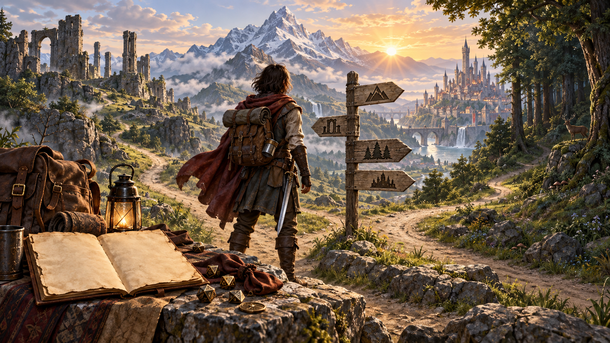

*Tạo nhân vật là bước đầu tiên để biến ý tưởng thành một [nhà phiêu lưu](99-glossary.md#adventurer). Minh họa nguyên bản tạo bằng OpenAI ImageGen cho bản dịch này.*

Bước đầu tiên để đóng vai một nhà phiêu lưu trong [Dungeons & Dragons](99-glossary.md#dungeons-and-dragons) là hình dung và tạo nhân vật của riêng bạn. Nhân vật kết hợp các chỉ số trò chơi, những yếu tố gợi mở để nhập vai và trí tưởng tượng của bạn. Bạn chọn một **[chủng tộc](99-glossary.md#race) (race)**, chẳng hạn [con người](99-glossary.md#human) hoặc [halfling](99-glossary.md#halfling), và một **[lớp nhân vật](99-glossary.md#class) (class)**, chẳng hạn [chiến binh](99-glossary.md#fighter) hoặc [pháp sư](99-glossary.md#wizard). Bạn cũng sáng tạo tính cách, ngoại hình và câu chuyện quá khứ của nhân vật. Sau khi hoàn thành, nhân vật trở thành người đại diện của bạn trong trò chơi, hiện thân của bạn trong thế giới Dungeons & Dragons.

Trước khi bắt đầu bước 1, hãy nghĩ về kiểu nhà phiêu lưu muốn điều khiển. Đó có thể là chiến binh can đảm, [đạo tặc](99-glossary.md#rogue) lén lút, [giáo sĩ](99-glossary.md#cleric) nhiệt thành hoặc pháp sư thích phô trương. Bạn cũng có thể hứng thú hơn với một nhân vật khác thường, như đạo tặc lực lưỡng thích đánh giáp lá cà, hoặc xạ thủ hạ kẻ địch từ xa. Bạn thích truyện kỳ ảo về [người lùn](99-glossary.md#dwarf) hay [elf](99-glossary.md#elf)? Hãy thử tạo nhân vật thuộc một trong những chủng tộc ấy. Bạn muốn nhân vật là nhà phiêu lưu bền bỉ nhất tại bàn? Hãy cân nhắc lớp chiến binh. Nếu chưa biết bắt đầu từ đâu, xem tranh minh họa trong tài liệu để tìm điều thu hút bạn.

Khi đã có ý tưởng, hãy thực hiện các bước theo thứ tự, đưa ra lựa chọn phù hợp với nhân vật mong muốn. Hình dung của bạn có thể thay đổi theo từng lựa chọn. Điều quan trọng là đến bàn chơi với một nhân vật khiến bạn hào hứng nhập vai.

Trong chương này, **[phiếu nhân vật](99-glossary.md#character-sheet) (character sheet)** chỉ bất cứ thứ gì dùng để theo dõi nhân vật: phiếu chính thức như mẫu cuối tài liệu, hồ sơ điện tử hoặc một trang giấy vở. Phiếu nhân vật D&D chính thức là điểm khởi đầu hữu ích cho đến khi bạn biết cần những thông tin gì và dùng chúng thế nào trong trò chơi.

## Tạo Bruenor (Building Bruenor)

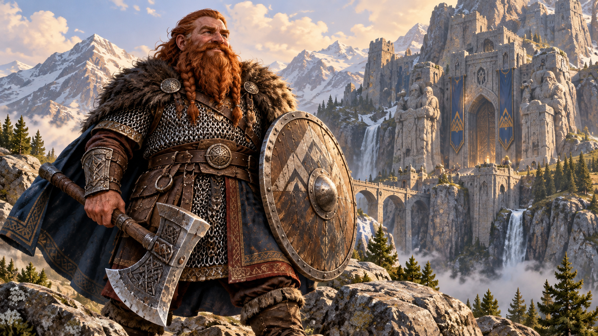

*Bruenor là nhân vật mẫu được xây dựng lần lượt qua sáu bước. Minh họa nguyên bản tạo bằng OpenAI ImageGen cho bản dịch này.*

Mỗi bước tạo nhân vật đều có ví dụ: người chơi tên Bob xây dựng nhân vật người lùn của mình, Bruenor.

## 1. Chọn chủng tộc (Choose a Race)

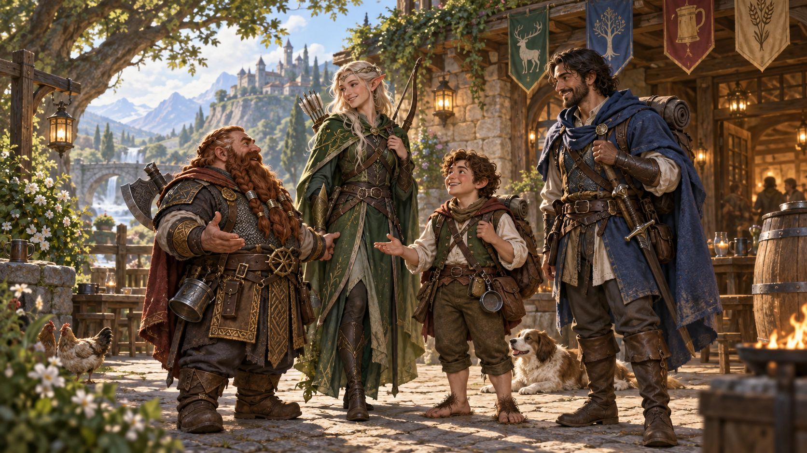

*Chủng tộc định hình nhiều đặc điểm thể chất, văn hóa và góc nhìn của nhân vật. Minh họa nguyên bản tạo bằng OpenAI ImageGen cho bản dịch này.*

Mỗi nhân vật thuộc một chủng tộc, một trong nhiều loài thông minh có hình dạng giống người trong thế giới D&D. Những chủng tộc [nhân vật người chơi](99-glossary.md#player-character) phổ biến nhất là **người lùn (dwarf), elf, halfling và con người (human)**. Một số chủng tộc còn có **[phân chủng](99-glossary.md#subrace) (subraces)**, như người lùn núi (mountain dwarf) hoặc elf rừng (wood elf). Chương 2 cung cấp thêm thông tin.

Chủng tộc góp phần quan trọng vào bản sắc nhân vật, xác định ngoại hình tổng quát và những năng lực tự nhiên có từ văn hóa, tổ tiên. Chủng tộc cho nhân vật những **đặc điểm chủng tộc (racial traits)** cụ thể: giác quan đặc biệt, [sự thành thạo](99-glossary.md#proficiency) với một số vũ khí hoặc công cụ, sự thành thạo một hay nhiều kỹ năng, hoặc khả năng sử dụng những phép nhỏ. Đôi khi các đặc điểm ấy kết hợp rất tốt với năng lực của một số lớp nhân vật, được chọn ở bước 2. Chẳng hạn, halfling chân nhẹ (lightfoot halfling) có đặc điểm giúp họ trở thành đạo tặc xuất sắc; elf bậc cao (high elf) thường là pháp sư mạnh. Tuy nhiên, chơi trái với hình mẫu quen thuộc cũng có thể thú vị. Thánh kỵ sĩ halfling hay pháp sư người lùn núi có thể khác thường nhưng đáng nhớ.

Chủng tộc còn tăng một hoặc nhiều [điểm thuộc tính](99-glossary.md#ability-score) mà bạn sẽ xác định ở bước 3. Ghi lại các mức tăng và nhớ áp dụng sau đó.

Ghi các đặc điểm chủng tộc lên phiếu nhân vật. Nhớ ghi cả ngôn ngữ khởi đầu và tốc độ cơ bản.

### Tạo Bruenor, bước 1

Bob bắt đầu tạo nhân vật. Anh quyết định một người lùn núi cộc cằn phù hợp với vai muốn thể hiện. Anh ghi mọi đặc điểm chủng tộc người lùn lên phiếu, bao gồm tốc độ **7,5 m (25 [feet](99-glossary.md#feet))** và các ngôn ngữ biết nói: **Tiếng Chung (Common)** và **tiếng Người lùn (Dwarvish)**.

## 2. Chọn lớp nhân vật (Choose a Class)

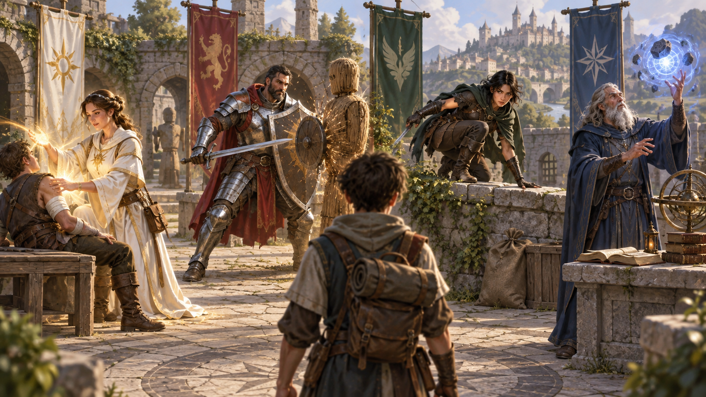

*Lớp nhân vật quyết định những năng lực chính và vai trò của nhân vật trong [cuộc phiêu lưu](99-glossary.md#adventure). Minh họa nguyên bản tạo bằng OpenAI ImageGen cho bản dịch này.*

Mỗi nhà phiêu lưu thuộc một lớp nhân vật. Lớp mô tả khái quát nghề nghiệp, tài năng đặc biệt và những chiến thuật nhân vật có khả năng sử dụng khi khám phá hầm ngục, chiến đấu với [quái vật](99-glossary.md#monster) hoặc tham gia cuộc thương lượng căng thẳng. Chương 3 mô tả các lớp nhân vật.

Lớp bạn chọn mang lại một số lợi ích. Nhiều lợi ích là **[đặc tính lớp](99-glossary.md#class-feature) (class features)**: những năng lực, bao gồm [thi triển phép](99-glossary.md#spellcasting), khiến nhân vật khác biệt với thành viên lớp khác. Bạn cũng có được một số **sự thành thạo (proficiencies)** với giáp, vũ khí, kỹ năng, các lần [tung cứu nguy](99-glossary.md#saving-throw) và đôi khi cả công cụ. Chúng xác định nhiều việc nhân vật làm đặc biệt tốt, từ sử dụng một số vũ khí đến nói dối thuyết phục.

Ghi mọi đặc tính mà lớp mang lại ở cấp 1 lên phiếu nhân vật.

### Cấp độ (Level)

*Cấp độ thể hiện kinh nghiệm và sự trưởng thành của nhân vật. Minh họa nguyên bản tạo bằng OpenAI ImageGen cho bản dịch này.*

Thông thường, nhân vật bắt đầu ở cấp 1 và tăng cấp bằng cách phiêu lưu, nhận **[điểm kinh nghiệm](99-glossary.md#experience-points) (experience points, XP)**. Nhân vật cấp 1 chưa có nhiều kinh nghiệm phiêu lưu, dù trước đó có thể từng là binh sĩ hoặc hải tặc và làm những việc nguy hiểm.

Bắt đầu ở cấp 1 đánh dấu thời điểm nhân vật bước vào đời sống phiêu lưu. Nếu đã quen trò chơi hoặc tham gia một [chiến dịch](99-glossary.md#campaign) D&D đang diễn ra, DM có thể cho bạn bắt đầu ở cấp cao hơn, với giả định nhân vật đã sống sót qua vài cuộc phiêu lưu đáng sợ.

Ghi cấp độ lên phiếu. Nếu bắt đầu ở cấp cao hơn, ghi cả các yếu tố bổ sung mà lớp mang lại ở những cấp sau cấp 1. Đồng thời ghi XP. Nhân vật cấp 1 có **0 XP**. Nhân vật cấp cao hơn thường bắt đầu với lượng XP tối thiểu cần để đạt cấp đó; xem mục “Sau cấp 1” ở cuối chương.

### Điểm sinh lực và [xúc xắc sinh lực](99-glossary.md#hit-dice) (Hit Points and Hit Dice)

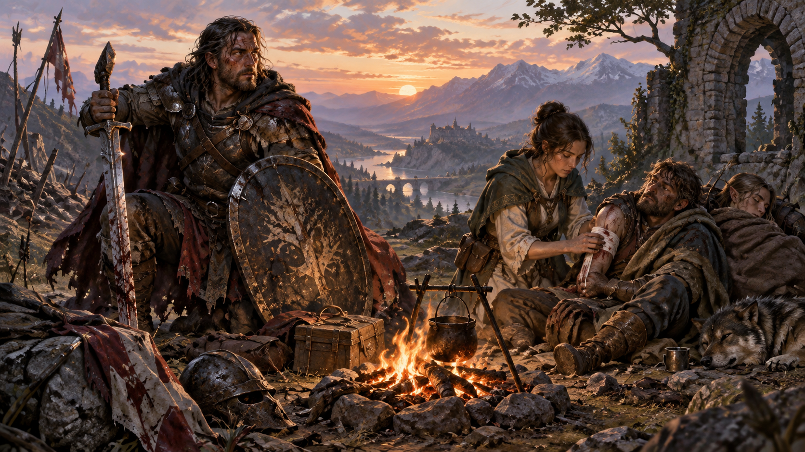

*Điểm sinh lực và Xúc xắc Sinh lực biểu thị khả năng chịu đựng và hồi phục. Minh họa nguyên bản tạo bằng OpenAI ImageGen cho bản dịch này.*

**Điểm sinh lực (hit points, [HP](99-glossary.md#hit-points))** xác định độ bền bỉ của nhân vật trong chiến đấu và tình huống nguy hiểm khác. HP được xác định từ **xúc xắc sinh lực (Hit Dice)**, tên rút gọn của Hit Point Dice.

Ở cấp 1, nhân vật có **1 xúc xắc sinh lực**; lớp quyết định loại xúc xắc. HP khởi đầu bằng kết quả lớn nhất của loại xúc xắc ấy, như ghi trong mô tả lớp. Bạn còn cộng hệ số [Thể chất](99-glossary.md#constitution), sẽ xác định ở bước 3. Đây cũng là **HP tối đa (hit point maximum)** của nhân vật.

Ghi HP, loại xúc xắc sinh lực và số xúc xắc sinh lực lên phiếu. Sau khi nghỉ, bạn có thể tiêu hao xúc xắc sinh lực để hồi HP; xem mục “Nghỉ ngơi” trong chương 8.

### Thưởng thành thạo (Proficiency Bonus)

Bảng trong mô tả lớp cho biết thưởng thành thạo; với nhân vật cấp 1, giá trị này là **+2**. Thưởng thành thạo áp dụng cho nhiều giá trị cần ghi lên phiếu:

- Lần [tung tấn công](99-glossary.md#attack-roll) bằng vũ khí bạn thành thạo.
- Lần tung tấn công bằng phép bạn thi triển.
- Phép kiểm tra thuộc tính sử dụng kỹ năng bạn thành thạo.
- Phép kiểm tra thuộc tính sử dụng công cụ bạn thành thạo.
- Lần tung cứu nguy bạn thành thạo.
- [DC](99-glossary.md#difficulty-class) cứu nguy của phép bạn thi triển, được giải thích trong từng lớp có khả năng dùng phép.

Lớp xác định các vũ khí và lần tung cứu nguy bạn thành thạo, cùng một phần kỹ năng và công cụ. Kỹ năng được mô tả ở chương 7, công cụ ở chương 5. Xuất thân cho thêm sự thành thạo kỹ năng và công cụ; một số chủng tộc cũng cho thêm sự thành thạo. Nhớ ghi tất cả, cùng thưởng thành thạo, lên phiếu.

Không được cộng thưởng thành thạo vào cùng một lần tung xúc xắc hoặc giá trị khác nhiều hơn một lần. Đôi khi thưởng thành thạo được điều chỉnh, chẳng hạn nhân đôi hoặc chia đôi, trước khi áp dụng. Nếu hoàn cảnh có vẻ cho phép áp dụng nhiều lần vào cùng lần tung, hoặc nhân nó nhiều lần, bạn vẫn chỉ cộng một lần, nhân một lần và chia đôi một lần.

### Tạo Bruenor, bước 2

Bob hình dung Bruenor lao vào trận với một chiếc rìu, chiếc mũ trụ có một bên sừng bị gãy. Anh chọn lớp **chiến binh (fighter)**, ghi sự thành thạo và đặc tính cấp 1 lên phiếu.

Là chiến binh cấp 1, Bruenor có 1 xúc xắc sinh lực, loại **d10**, và bắt đầu với HP bằng **10 + hệ số Thể chất**. Bob ghi công thức này và sẽ điền kết quả cuối sau khi xác định điểm Thể chất ở bước 3. Anh cũng ghi thưởng thành thạo của nhân vật cấp 1 là **+2**.

> **Tạo nhanh (Quick Build):** Mỗi mô tả lớp trong chương 3 có một mục gợi ý cách tạo nhanh nhân vật của lớp đó, bao gồm cách phân bổ điểm thuộc tính cao nhất, [xuất thân](99-glossary.md#background) phù hợp và các phép khởi đầu.

## 3. Xác định điểm thuộc tính (Determine Ability Scores)

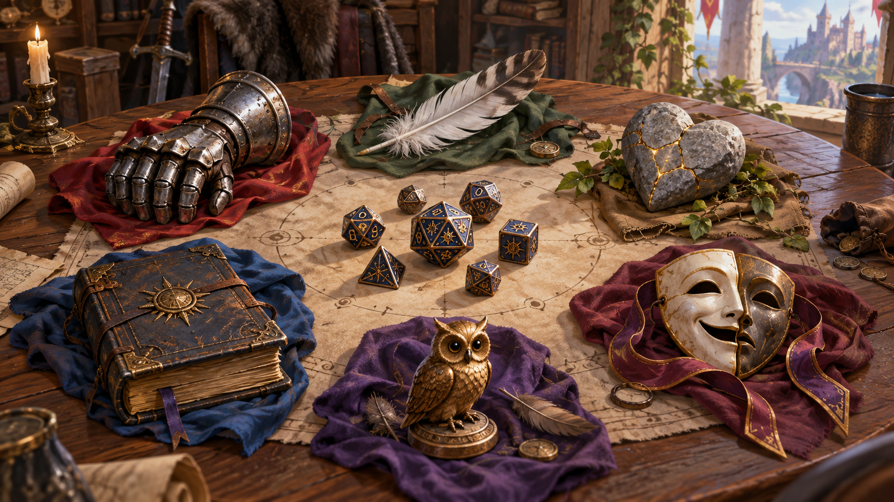

*Sáu điểm thuộc tính mô tả những năng lực thể chất và tinh thần cốt lõi. Minh họa nguyên bản tạo bằng OpenAI ImageGen cho bản dịch này.*

Phần lớn việc nhân vật làm phụ thuộc vào sáu thuộc tính: **[Sức mạnh](99-glossary.md#strength), [Khéo léo](99-glossary.md#dexterity), Thể chất, [Trí tuệ](99-glossary.md#intelligence), [Minh triết](99-glossary.md#wisdom) và [Sức hút](99-glossary.md#charisma)**. Mỗi thuộc tính có một điểm số để ghi lên phiếu.

Chương 7 mô tả sáu thuộc tính và cách sử dụng. Bảng “Tóm tắt điểm thuộc tính” dưới đây cho biết nhanh mỗi thuộc tính đo lường phẩm chất nào, chủng tộc nào tăng điểm ấy và lớp nào coi thuộc tính ấy là đặc biệt quan trọng.

Bạn có thể tạo ngẫu nhiên sáu điểm thuộc tính. Tung **bốn xúc xắc sáu mặt**, cộng kết quả của **ba viên cao nhất**, rồi ghi tổng lên giấy nháp. Lặp lại thêm năm lần để có sáu số. Nếu muốn tiết kiệm thời gian hoặc không thích xác định điểm ngẫu nhiên, dùng bộ điểm: **15, 14, 13, 12, 10, 8**.

Lấy sáu số ấy và gán mỗi số cho một trong sáu thuộc tính. Sau đó điều chỉnh điểm theo chủng tộc đã chọn.

Sau khi phân bổ, xác định **[hệ số thuộc tính](99-glossary.md#modifier)** bằng bảng “Điểm thuộc tính và hệ số”. Không cần tra bảng cũng có thể tính: lấy điểm thuộc tính trừ 10, chia kết quả cho 2 rồi **làm tròn xuống**. Ghi hệ số cạnh từng điểm.

### Điểm thuộc tính và hệ số (Ability Scores and Modifiers)

| Điểm | Hệ số |
| --- | --- |
| 1 | -5 |
| 2-3 | -4 |
| 4-5 | -3 |
| 6-7 | -2 |
| 8-9 | -1 |
| 10-11 | +0 |
| 12-13 | +1 |
| 14-15 | +2 |
| 16-17 | +3 |
| 18-19 | +4 |
| 20-21 | +5 |
| 22-23 | +6 |
| 24-25 | +7 |
| 26-27 | +8 |
| 28-29 | +9 |
| 30 | +10 |

### Tạo Bruenor, bước 3

Bob dùng bộ điểm tiêu chuẩn **15, 14, 13, 12, 10, 8**. Vì Bruenor là chiến binh, anh đặt điểm cao nhất, 15, vào Sức mạnh; điểm cao thứ hai, 14, vào Thể chất. Bruenor có thể nóng nảy, nhưng Bob muốn nhân vật là một người lùn lớn tuổi, khôn ngoan hơn và lãnh đạo tốt, nên dành điểm khá cho Minh triết và Sức hút. Sau khi áp dụng lợi ích chủng tộc, tăng Thể chất thêm 2 và Sức mạnh thêm 2, kết quả là:

| Thuộc tính | Điểm | Hệ số |
| --- | --- | --- |
| Sức mạnh | 17 | +3 |
| Khéo léo | 10 | +0 |
| Thể chất | 16 | +3 |
| Trí tuệ | 8 | -1 |
| Minh triết | 13 | +1 |
| Sức hút | 12 | +1 |

Bob điền HP cuối cùng: **10 + 3 = 13 HP**.

### Biến thể: Tùy chỉnh điểm thuộc tính (Variant: Customizing Ability Scores)

Nếu DM cho phép, bạn có thể dùng biến thể này để xác định điểm thuộc tính. Phương pháp cho phép tự chọn riêng từng điểm.

Bạn có **27 điểm mua** để phân bổ. Chi phí của từng điểm thuộc tính ghi trong bảng dưới. Chẳng hạn, điểm thuộc tính 14 tốn 7 điểm mua. Theo cách này, trước khi cộng mức tăng chủng tộc, điểm thuộc tính cao nhất có thể đạt là **15**, và không thể thấp hơn **8**.

Phương pháp cho phép tạo bộ ba điểm cao và ba điểm thấp **15, 15, 15, 8, 8, 8**, bộ điểm khá đồng đều và trên trung bình **13, 13, 13, 12, 12, 12**, hoặc bất kỳ bộ nào nằm giữa hai cực ấy.

### Chi phí mua điểm thuộc tính (Ability Score Point Cost)

| Điểm thuộc tính | Chi phí |
| --- | --- |
| 8 | 0 |
| 9 | 1 |
| 10 | 2 |
| 11 | 3 |
| 12 | 4 |
| 13 | 5 |
| 14 | 7 |
| 15 | 9 |

### Tóm tắt điểm thuộc tính (Ability Score Summary)

| Thuộc tính | Đo lường | Quan trọng với | Mức tăng từ chủng tộc |
| --- | --- | --- | --- |
| Sức mạnh (Strength) | Năng lực vận động tự nhiên, sức mạnh cơ thể | Chiến binh | Người lùn núi +2; con người +1 |
| Khéo léo (Dexterity) | Sự nhanh nhẹn, phản xạ, thăng bằng, khả năng kiểm soát tư thế | Đạo tặc | Elf +2; halfling +2; con người +1 |
| Thể chất (Constitution) | Sức khỏe, sức bền, sinh lực | Mọi nhân vật | Người lùn +2; halfling vạm vỡ +1; con người +1 |
| Trí tuệ (Intelligence) | Độ nhạy bén trí óc, khả năng nhớ thông tin, kỹ năng phân tích | Pháp sư | Elf bậc cao +1; con người +1 |
| Minh triết (Wisdom) | Nhận thức, trực giác, sự thấu hiểu | Giáo sĩ | Người lùn đồi +1; elf rừng +1; con người +1 |
| Sức hút (Charisma) | Sự tự tin, tài ăn nói, khả năng lãnh đạo | Người lãnh đạo và nhân vật thiên về ngoại giao | Halfling chân nhẹ +1; con người +1 |

## 4. Mô tả nhân vật (Describe Your Character)

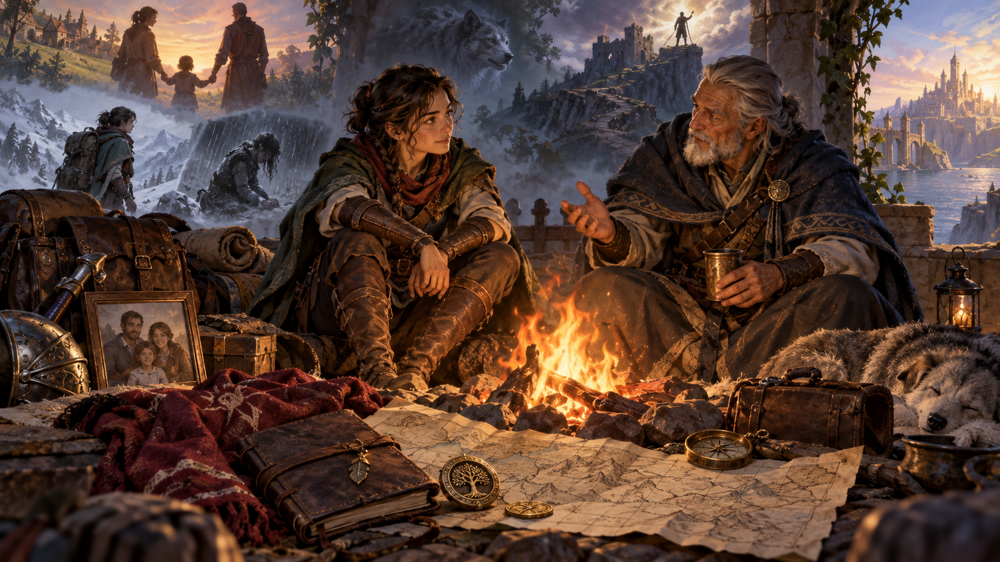

*Tính cách, lý tưởng, mối liên kết, khuyết điểm và quá khứ tạo nên bản sắc nhân vật. Minh họa nguyên bản tạo bằng OpenAI ImageGen cho bản dịch này.*

Khi đã biết những khía cạnh cơ bản của nhân vật theo luật chơi, hãy phát triển nhân vật thành một con người cụ thể. Nhân vật cần một cái tên. Dành vài phút nghĩ về ngoại hình và cách ứng xử nói chung.

Dùng thông tin chương 4 để xây dựng ngoại hình và đặc điểm tính cách. Chọn **[khuynh hướng đạo đức](99-glossary.md#alignment) (alignment)**, tức kim chỉ nam đạo đức dẫn dắt quyết định, và **lý tưởng (ideals)**. Chương 4 cũng giúp xác định những điều nhân vật trân trọng nhất, gọi là **mối gắn bó (bonds)**, cùng những **khuyết điểm (flaws)** một ngày nào đó có thể làm nhân vật suy sụp.

**Xuất thân (background)** mô tả nhân vật đến từ đâu, nghề nghiệp ban đầu và vị trí của nhân vật trong thế giới D&D. DM có thể đề xuất xuất thân ngoài các lựa chọn ở chương 4, hoặc cùng bạn xây dựng một xuất thân phù hợp hơn với ý tưởng nhân vật.

Xuất thân cho một **đặc tính xuất thân (background feature)**, tức một lợi ích chung, và sự thành thạo hai kỹ năng. Nó cũng có thể cho thêm ngôn ngữ hoặc sự thành thạo một số công cụ. Ghi những thông tin này cùng tính cách đã xây dựng lên phiếu.

### Những thuộc tính của nhân vật (Your Character’s Abilities)

Khi xây dựng ngoại hình và tính cách, cân nhắc điểm thuộc tính cùng chủng tộc. Nhân vật rất khỏe nhưng Trí tuệ thấp có thể suy nghĩ, ứng xử rất khác nhân vật thông minh nhưng Sức mạnh thấp.

**Sức mạnh cao** thường đi cùng thân hình lực lưỡng hoặc rắn chắc, trong khi nhân vật Sức mạnh thấp có thể gầy gò hoặc mũm mĩm.

**Khéo léo cao** thường đi cùng cơ thể mềm dẻo, thanh mảnh; Khéo léo thấp có thể thể hiện qua dáng cao lêu nghêu, vụng về hoặc cơ thể nặng nề, ngón tay thô.

**Thể chất cao** thường khiến nhân vật trông khỏe mạnh, mắt sáng và tràn đầy năng lượng. Thể chất thấp có thể khiến nhân vật hay đau ốm hoặc yếu ớt.

**Trí tuệ cao** có thể đi cùng tính tò mò, ham học. Trí tuệ thấp có thể thể hiện qua lời nói đơn giản hoặc hay quên chi tiết.

**Minh triết cao** cho khả năng phán đoán tốt, sự đồng cảm và nhận thức về những gì đang xảy ra. Minh triết thấp có thể khiến nhân vật đãng trí, liều lĩnh hoặc thiếu chú ý.

**Sức hút cao** toát ra sự tự tin, thường cùng phong thái duyên dáng hoặc uy hiếp. Sức hút thấp có thể khiến nhân vật tạo cảm giác khó chịu, diễn đạt kém hoặc rụt rè.

### Tạo Bruenor, bước 4

Bob ghi những chi tiết cơ bản: tên, giới tính nam, chiều cao, cân nặng và khuynh hướng **thiện, trọng luật (lawful good)**. Sức mạnh và Thể chất cao gợi ra một cơ thể khỏe mạnh, rắn chắc; Trí tuệ thấp gợi ra tính hay quên.

Bob quyết định Bruenor xuất thân từ một dòng dõi quý tộc, nhưng thị tộc bị đuổi khỏi quê hương khi Bruenor còn rất nhỏ. Anh lớn lên và làm thợ rèn tại những ngôi làng hẻo lánh ở Icewind Dale. Tuy nhiên, Bruenor mang số phận anh hùng: giành lại quê hương. Vì vậy Bob chọn xuất thân **anh hùng dân gian (folk hero)** và ghi sự thành thạo cùng đặc tính đặc biệt mà xuất thân mang lại.

Bob đã hình dung rõ tính cách nên bỏ qua các gợi ý của xuất thân anh hùng dân gian. Anh ghi Bruenor là một người lùn biết quan tâm, nhạy cảm, thật lòng yêu quý bạn bè và đồng minh, nhưng che giấu trái tim mềm yếu sau vẻ ngoài cộc cằn, hay gầm gừ. Anh chọn lý tưởng **công bằng (fairness)** từ danh sách của xuất thân, ghi rằng Bruenor tin không ai đứng trên luật pháp.

Với quá khứ ấy, mối gắn bó của Bruenor rất rõ: một ngày giành lại **Mithral Hall**, quê hương của mình, từ con [rồng](99-glossary.md#dragon) bóng tối đã đuổi người lùn đi. Khuyết điểm gắn với bản tính quan tâm, nhạy cảm: anh dễ mềm lòng trước trẻ mồ côi và những người lạc lối, nên có thể tỏ lòng thương ngay cả khi không đáng.

## 5. Chọn trang bị (Choose Equipment)

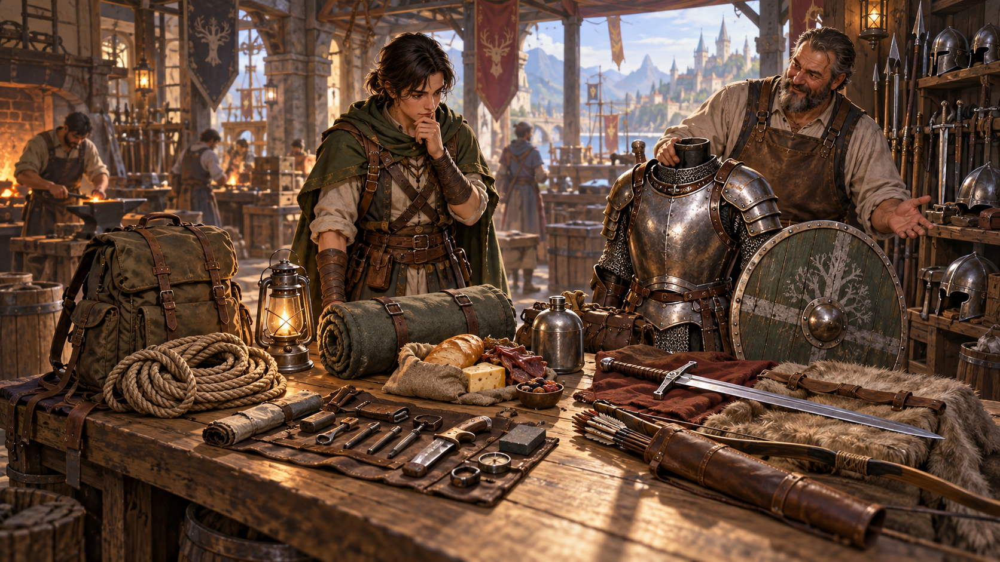

*Trang bị chuẩn bị cho nhân vật đối mặt với hành trình và hiểm nguy phía trước. Minh họa nguyên bản tạo bằng OpenAI ImageGen cho bản dịch này.*

Lớp và xuất thân quyết định **trang bị khởi đầu (starting equipment)**, gồm vũ khí, giáp và đồ dùng phiêu lưu khác. Ghi trang bị lên phiếu. Chương 5, “Trang bị”, mô tả chi tiết các món này.

Thay vì nhận trang bị từ lớp và xuất thân, bạn có thể mua trang bị khởi đầu. Lớp cho một lượng **[đồng vàng](99-glossary.md#gold-piece) (gold pieces, gp)** để chi tiêu, như ghi ở chương 5. Chương ấy cũng có danh sách trang bị và giá. Nếu muốn, bạn có thể nhận thêm một **đồ lặt vặt (trinket)** miễn phí; xem bảng ở cuối chương 5.

Điểm Sức mạnh giới hạn lượng trang bị mang được. Cố tránh mua trang bị có tổng khối lượng vượt quá **6,75 kg × điểm Sức mạnh (15 pound × điểm Sức mạnh)**. Chương 7 có thêm thông tin về sức mang.

### [Chỉ số giáp](99-glossary.md#armor-class) (Armor Class)

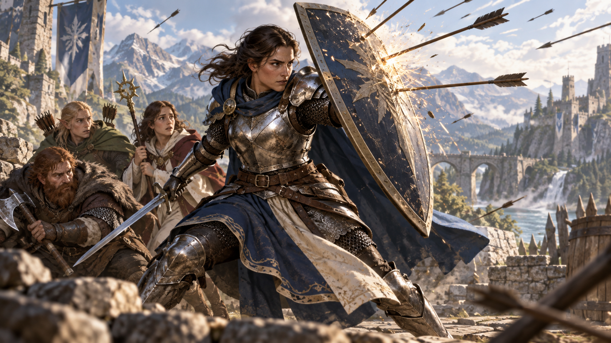

*Chỉ số Giáp biểu thị khả năng tránh hoặc đỡ một đòn tấn công. Minh họa nguyên bản tạo bằng OpenAI ImageGen cho bản dịch này.*

**Chỉ số giáp (Armor Class, AC)** thể hiện khả năng tránh bị thương trong chiến đấu. Những yếu tố góp vào AC gồm giáp đang mặc, [khiên](99-glossary.md#shield) đang mang và hệ số Khéo léo. Tuy nhiên, không phải nhân vật nào cũng mặc giáp hoặc dùng khiên.

Khi không mặc giáp và không dùng khiên, **AC = 10 + hệ số Khéo léo**. Nếu mặc giáp, dùng khiên hoặc cả hai, tính AC theo chương 5. Ghi AC lên phiếu.

Nhân vật phải thành thạo giáp và khiên để sử dụng hiệu quả; lớp xác định sự thành thạo này. Mặc giáp hoặc dùng khiên khi không thành thạo sẽ gây bất lợi theo quy tắc chương 5.

Một số phép và đặc tính lớp cho cách tính AC khác. Nếu có nhiều đặc tính cho những cách tính AC khác nhau, chọn một cách để dùng.

### Vũ khí (Weapons)

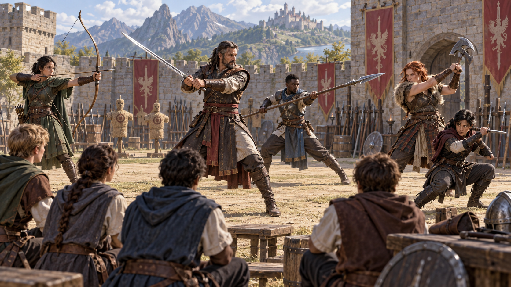

*Mỗi loại vũ khí đem lại cách tiếp cận chiến đấu khác nhau. Minh họa nguyên bản tạo bằng OpenAI ImageGen cho bản dịch này.*

Với mỗi vũ khí nhân vật sử dụng, tính hệ số khi tấn công và sát thương gây ra khi đánh trúng.

Khi tấn công bằng vũ khí, tung **[d20](99-glossary.md#dice-notation)**, cộng **thưởng thành thạo** nếu thành thạo vũ khí ấy, rồi cộng **hệ số thuộc tính thích hợp**.

- **Vũ khí cận chiến:** dùng hệ số Sức mạnh cho lần tung tấn công và sát thương. Vũ khí có tính chất **[Tinh xảo](99-glossary.md#finesse) (finesse)**, như kiếm [rapier](99-glossary.md#rapier), có thể dùng hệ số Khéo léo thay thế.
- **Vũ khí tầm xa:** dùng hệ số Khéo léo cho lần tung tấn công và sát thương. Vũ khí cận chiến có tính chất **ném (thrown)**, như rìu tay (handaxe), có thể dùng hệ số Sức mạnh thay thế.

### Tạo Bruenor, bước 5

Bob ghi trang bị khởi đầu từ lớp chiến binh và xuất thân anh hùng dân gian. Trang bị gồm **[giáp xích](99-glossary.md#chain-mail) (chain mail)** và **khiên (shield)**, kết hợp cho Bruenor **AC 18**.

Bob chọn **rìu chiến (battleaxe)** và hai **rìu tay (handaxes)**. Rìu chiến là [vũ khí cận chiến](99-glossary.md#melee-ranged), nên Bruenor dùng hệ số Sức mạnh cho tấn công và sát thương. Thưởng tấn công là **+3** từ Sức mạnh cộng **+2** thưởng thành thạo, tổng **+5**. Rìu chiến gây **1d8 [sát thương chém](99-glossary.md#damage-types) (slashing damage)**; khi trúng, cộng hệ số Sức mạnh để thành **1d8 + 3 sát thương chém**. Khi ném rìu tay, Bruenor có cùng thưởng tấn công, vì loại vũ khí ném này dùng Sức mạnh cho tấn công và sát thương; một đòn trúng gây **1d6 + 3 sát thương chém**.

## 6. Tập hợp nhóm (Come Together)

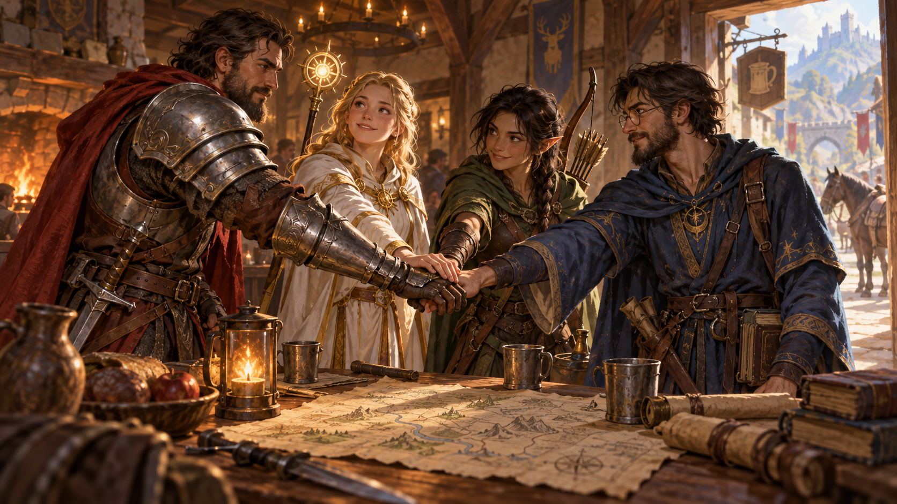

*Một nhóm hiệu quả kết hợp thế mạnh và mục tiêu của từng thành viên. Minh họa nguyên bản tạo bằng OpenAI ImageGen cho bản dịch này.*

Phần lớn nhân vật D&D không hoạt động một mình. Mỗi nhân vật có một vai trò trong **[nhóm phiêu lưu](99-glossary.md#party) (party)**, một nhóm nhà phiêu lưu hợp tác vì mục đích chung. Làm việc nhóm và hợp tác giúp tăng đáng kể khả năng sống sót trước những hiểm nguy trong thế giới Dungeons & Dragons. Trao đổi với người chơi khác và DM để quyết định nhân vật có quen nhau hay không, gặp nhau thế nào và có thể cùng thực hiện những loại nhiệm vụ gì.

## Sau cấp 1 (Beyond 1st Level)

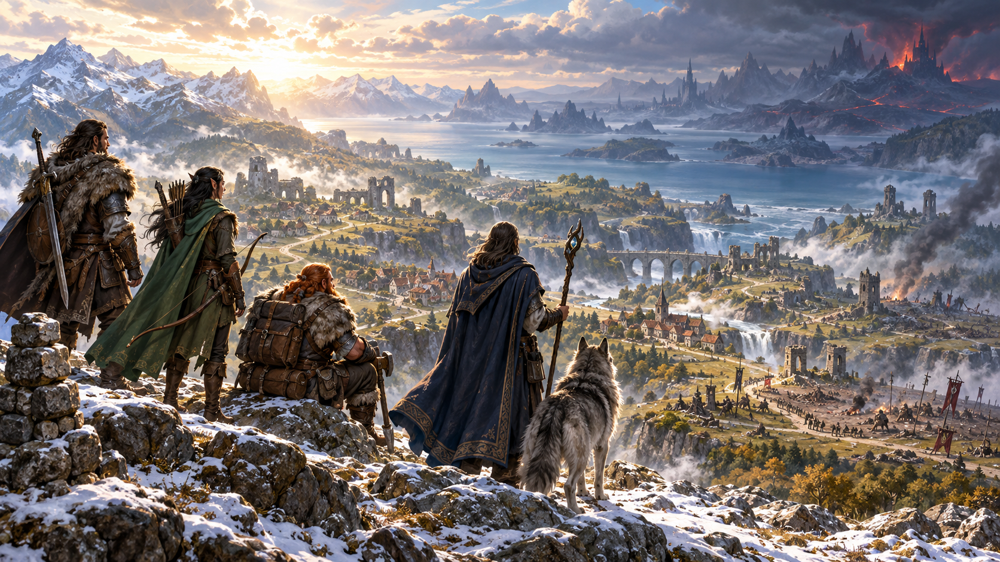

*Sau cấp 1, các nhà phiêu lưu tiếp tục tích lũy kinh nghiệm và đối mặt hiểm nguy lớn hơn. Minh họa nguyên bản tạo bằng OpenAI ImageGen cho bản dịch này.*

Khi nhân vật phiêu lưu và vượt thử thách, họ nhận kinh nghiệm, thể hiện bằng XP. Khi đạt tổng XP quy định, nhân vật phát triển năng lực. Đó gọi là **tăng cấp (gaining a level)**.

Khi tăng cấp, lớp thường cho thêm đặc tính, như mô tả của lớp. Một số đặc tính cho tăng điểm thuộc tính: tăng hai thuộc tính mỗi thuộc tính 1 điểm, hoặc tăng một thuộc tính 2 điểm. Bạn không thể tăng một điểm thuộc tính vượt quá **20** theo cách này. Ngoài ra, thưởng thành thạo của mọi nhân vật tăng ở một số cấp nhất định.

Mỗi lần tăng cấp, bạn nhận thêm **1 xúc xắc sinh lực**. Tung xúc xắc đó, cộng hệ số Thể chất, rồi cộng tổng, **tối thiểu 1**, vào HP tối đa. Bạn cũng có thể dùng giá trị cố định ghi trong mô tả lớp thay vì tung; giá trị này là kết quả trung bình của xúc xắc, **làm tròn lên**.

Khi hệ số Thể chất tăng thêm 1, HP tối đa tăng thêm 1 cho mỗi cấp đã đạt. Ví dụ, khi Bruenor đạt chiến binh cấp 8, anh tăng Thể chất từ 17 lên 18, khiến hệ số tăng từ +3 lên +4. HP tối đa vì vậy tăng thêm **8**.

Bảng “Phát triển nhân vật” tóm tắt XP cần để đạt các cấp từ 1 đến 20 và thưởng thành thạo tương ứng. Xem mô tả lớp để biết các cải thiện khác ở từng cấp.

### Các bậc chơi (Tiers of Play)

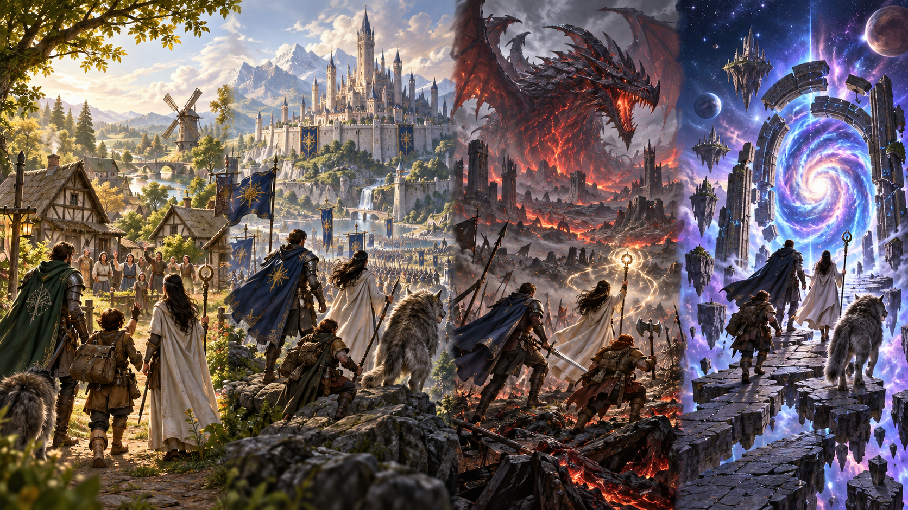

*Các bậc chơi mở rộng quy mô câu chuyện từ anh hùng địa phương đến huyền thoại [đa vũ trụ](99-glossary.md#multiverse). Minh họa nguyên bản tạo bằng OpenAI ImageGen cho bản dịch này.*

Phần tô màu trong bảng phát triển nhân vật của bản gốc chỉ bốn bậc chơi. Các bậc không có quy tắc riêng; chúng mô tả khái quát trải nghiệm chơi thay đổi thế nào khi nhân vật tăng cấp.

Ở **bậc thứ nhất, cấp 1-4**, nhân vật về cơ bản là nhà phiêu lưu tập sự. Họ đang học các đặc tính định hình lớp, bao gồm những lựa chọn quan trọng tạo nét riêng khi phát triển, như Truyền thống Huyền thuật (Arcane Tradition) của pháp sư hoặc Hình mẫu Võ thuật (Martial Archetype) của chiến binh. Những hiểm họa họ đối mặt tương đối nhỏ, thường đe dọa các nông trại hoặc làng trong vùng.

Ở **bậc thứ hai, cấp 5-10**, nhân vật thực sự khẳng định năng lực. Nhiều người thi triển phép có phép bậc 3 ngay đầu bậc chơi này, vượt một ngưỡng sức mạnh mới với những phép như **quả cầu lửa (fireball)** và **tia sét (lightning bolt)**. Nhiều lớp dùng vũ khí có khả năng tấn công nhiều lần trong một vòng. Nhân vật đã trở nên quan trọng, đối mặt với hiểm họa đe dọa thành phố và vương quốc.

Ở **bậc thứ ba, cấp 11-16**, sức mạnh nhân vật vượt xa dân thường, và họ nổi bật ngay cả giữa các nhà phiêu lưu. Ở cấp 11, nhiều người thi triển phép có phép bậc 6; một số phép tạo hiệu ứng trước đó nhân vật người chơi chưa thể thực hiện. Những nhân vật khác có đặc tính cho phép tấn công nhiều hơn hoặc làm những điều ấn tượng hơn bằng đòn tấn công. Các nhà phiêu lưu hùng mạnh ấy thường đối mặt với hiểm họa đe dọa cả vùng rộng lớn và lục địa.

Ở **bậc thứ tư, cấp 17-20**, nhân vật đạt đỉnh cao của đặc tính lớp, trở thành những hình mẫu anh hùng hoặc phản diện. Trong các cuộc phiêu lưu của họ, số phận thế giới, thậm chí trật tự nền tảng của đa vũ trụ, có thể bị đặt lên bàn cân.

### Phát triển nhân vật (Character Advancement)

| Điểm kinh nghiệm (XP) | Cấp | Thưởng thành thạo |
| --- | --- | --- |
| 0 | 1 | +2 |
| 300 | 2 | +2 |
| 900 | 3 | +2 |
| 2,700 | 4 | +2 |
| 6,500 | 5 | +3 |
| 14,000 | 6 | +3 |
| 23,000 | 7 | +3 |
| 34,000 | 8 | +3 |
| 48,000 | 9 | +4 |
| 64,000 | 10 | +4 |
| 85,000 | 11 | +4 |
| 100,000 | 12 | +4 |
| 120,000 | 13 | +5 |
| 140,000 | 14 | +5 |
| 165,000 | 15 | +5 |
| 195,000 | 16 | +5 |
| 225,000 | 17 | +6 |
| 265,000 | 18 | +6 |
| 305,000 | 19 | +6 |
| 355,000 | 20 | +6 |

*Minh họa trong bản gốc, trang 12: Richard Whitters.*

---

*D&D Basic Rules (Version 1.0). Không được bán lại. Được phép in và sao chụp tài liệu này chỉ để sử dụng cá nhân.*
