Nguồn: *D&D Basic Rules (Version 1.0), 2018*, trang 13-21.

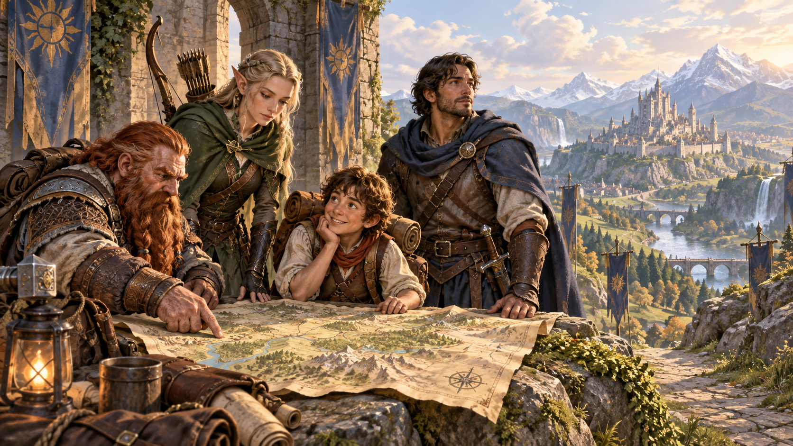

*Các dân tộc khác nhau cùng bước vào một thế giới phiêu lưu. Minh họa nguyên bản tạo bằng OpenAI ImageGen cho bản dịch này.*

Một chuyến thăm những thành phố lớn của thế giới [Dungeons & Dragons](99-glossary.md#dungeons-and-dragons), như Waterdeep, Thành phố Tự do Greyhawk, hay thậm chí Sigil kỳ lạ, Thành phố của Những Cánh Cửa, sẽ khiến các giác quan choáng ngợp. Tiếng trò chuyện vang lên bằng vô số ngôn ngữ. Mùi thức ăn của hàng chục nền ẩm thực hòa với mùi đường phố đông đúc và điều kiện vệ sinh kém. Những công trình mang muôn vàn phong cách kiến trúc thể hiện nguồn gốc đa dạng của cư dân.

Và chính cư dân, với đủ kích thước, hình dáng, màu da, khoác trang phục rực rỡ về kiểu cách và màu sắc, đại diện cho nhiều [chủng tộc](99-glossary.md#race): từ [halfling](99-glossary.md#halfling) nhỏ bé, [người lùn](99-glossary.md#dwarf) vạm vỡ đến [elf](99-glossary.md#elf) đẹp uy nghi, hòa lẫn với nhiều sắc dân [con người](99-glossary.md#human).

Xen giữa những chủng tộc phổ biến ấy là những người thực sự khác lạ: một [dragonborn](99-glossary.md#dragonborn) đồ sộ chen qua đám đông, một [tiefling](99-glossary.md#tiefling) ranh mãnh nấp trong bóng tối với ánh mắt tinh nghịch. Một nhóm [gnome](99-glossary.md#gnome) cười khi một người kích hoạt món đồ chơi gỗ khéo léo có thể tự chuyển động. Người lai elf ([half-elf](99-glossary.md#half-elf)) và [người lai orc](99-glossary.md#half-orc) (half-[orc](99-glossary.md#orc)) sống, làm việc bên cạnh con người, nhưng không hoàn toàn thuộc về chủng tộc của cha hoặc mẹ. Và ở kia, tránh xa ánh mặt trời, là một drow đơn độc, kẻ chạy trốn khỏi vùng ngầm rộng lớn Underdark, cố tìm chỗ đứng trong một thế giới sợ hãi đồng loại của mình. *Player’s Handbook* cung cấp thêm thông tin về các chủng tộc khác thường này.

## Chọn chủng tộc (Choosing a Race)

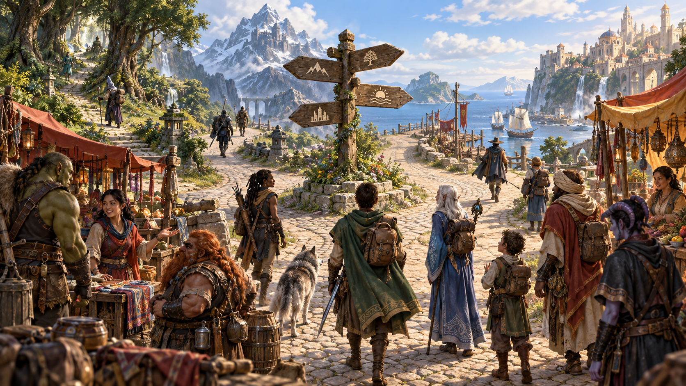

*Chủng tộc góp phần định hình bản sắc, văn hóa và góc nhìn của nhân vật. Minh họa nguyên bản tạo bằng OpenAI ImageGen cho bản dịch này.*

Con người là cư dân phổ biến nhất trong các thế giới D&D, nhưng họ sống, làm việc bên cạnh người lùn, elf, halfling và vô số loài kỳ ảo khác. Nhân vật của bạn thuộc một trong những dân tộc ấy.

Không phải mọi chủng tộc thông minh của [đa vũ trụ](99-glossary.md#multiverse) đều phù hợp làm [nhà phiêu lưu](99-glossary.md#adventurer) do người chơi điều khiển. Người lùn, elf, halfling và con người là những chủng tộc phổ biến nhất sinh ra kiểu nhà phiêu lưu thường thấy trong các nhóm. Những chủng tộc và [phân chủng](99-glossary.md#subrace) khác ít xuất hiện hơn trong vai trò này.

Lựa chọn chủng tộc ảnh hưởng đến nhiều khía cạnh của nhân vật, xác định những phẩm chất nền tảng tồn tại suốt sự nghiệp phiêu lưu. Khi chọn, nhớ đến kiểu nhân vật muốn chơi. Chẳng hạn, halfling phù hợp với [đạo tặc](99-glossary.md#rogue) lén lút, người lùn có thể thành [chiến binh](99-glossary.md#fighter) bền bỉ, còn elf có thể làm bậc thầy [huyền thuật](99-glossary.md#arcane-divine).

Chủng tộc không chỉ ảnh hưởng [điểm thuộc tính](99-glossary.md#ability-score) và đặc điểm, mà còn gợi ý để xây dựng câu chuyện nhân vật. Mỗi mô tả trong chương cung cấp thông tin giúp nhập vai, gồm tính cách, ngoại hình, đặc điểm xã hội và xu hướng đạo đức. Đây là gợi ý để suy nghĩ về nhân vật; các nhà phiêu lưu có thể khác rất xa chuẩn mực chủng tộc. Cân nhắc vì sao nhân vật khác biệt sẽ giúp xây dựng [xuất thân](99-glossary.md#background) và tính cách.

## Đặc điểm chủng tộc (Racial Traits)

Mỗi mô tả gồm những đặc điểm chung của thành viên chủng tộc. Các mục sau xuất hiện trong đặc điểm của phần lớn chủng tộc.

### Tăng điểm thuộc tính (Ability Score Increase)

Mỗi chủng tộc tăng một hoặc nhiều điểm thuộc tính của nhân vật.

### Tuổi (Age)

Mục này ghi tuổi được coi là trưởng thành và tuổi thọ dự kiến. Thông tin giúp chọn tuổi khi bắt đầu trò chơi. Bạn có thể chọn bất kỳ tuổi nào; tuổi có thể giải thích một số điểm thuộc tính. Chẳng hạn, nhân vật rất trẻ hoặc rất già có thể vì vậy mà [Sức mạnh](99-glossary.md#strength) hay [Thể chất](99-glossary.md#constitution) thấp, trong khi tuổi cao có thể giải thích [Trí tuệ](99-glossary.md#intelligence) hoặc [Minh triết](99-glossary.md#wisdom) cao.

### Khuynh hướng đạo đức (Alignment)

Phần lớn chủng tộc thiên về một số khuynh hướng được mô tả tại đây. Chúng không bắt buộc với [nhân vật người chơi](99-glossary.md#player-character). Tuy nhiên, suy nghĩ vì sao người lùn của bạn thiên về hỗn loạn, trái với xã hội người lùn trọng luật, có thể giúp định hình nhân vật rõ hơn.

### Kích cỡ (Size)

Phần lớn chủng tộc có kích cỡ **Trung bình (Medium)**, nhóm gồm những sinh vật cao khoảng **1,2–2,4 m (4–8 [feet](99-glossary.md#feet))**. Một vài chủng tộc có kích cỡ **Nhỏ (Small)**, cao **0,6–1,2 m (2–4 feet)**, nên chịu tác động khác của một số quy tắc. Quan trọng nhất là nhân vật Nhỏ gặp khó khi dùng vũ khí nặng, như giải thích ở chương 5.

### Tốc độ (Speed)

Tốc độ quyết định quãng đường có thể di chuyển khi đi lại (chương 8) và chiến đấu (chương 9).

### Ngôn ngữ (Languages)

Chủng tộc cho nhân vật khả năng nói, đọc và viết một số ngôn ngữ. Chương 4 liệt kê các ngôn ngữ phổ biến nhất của đa vũ trụ D&D.

### Phân chủng (Subraces)

Một số chủng tộc có phân chủng. Thành viên phân chủng có đặc điểm của chủng tộc gốc **cộng thêm** các đặc điểm riêng. Quan hệ giữa phân chủng thay đổi đáng kể tùy chủng tộc và thế giới. Chẳng hạn, ở Dragonlance, người lùn núi và người lùn đồi sống cùng nhau như các thị tộc khác nhau của cùng một dân tộc. Ở [Forgotten Realms](99-glossary.md#forgotten-realms), họ sống xa nhau trong những vương quốc riêng, lần lượt tự gọi là người lùn [khiên](99-glossary.md#shield) (shield dwarf) và người lùn vàng (gold dwarf).

## Người lùn (Dwarf)

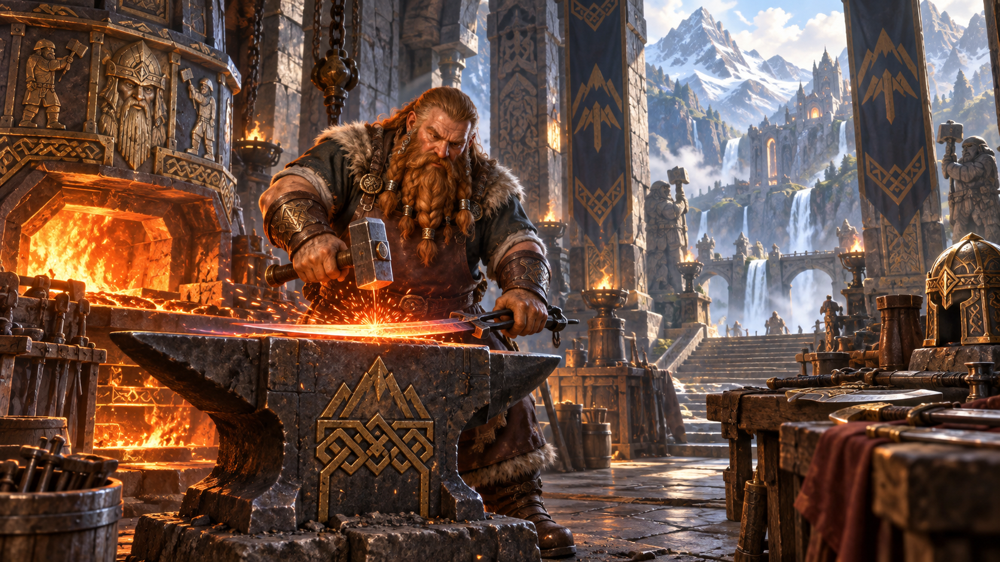

*Người lùn nổi tiếng với sức bền, thị tộc lâu đời và tài nghệ thủ công. Minh họa nguyên bản tạo bằng OpenAI ImageGen cho bản dịch này.*

> “Ngươi muộn rồi, elf!” Giọng nói quen thuộc vang lên cộc cằn. Bruenor Battlehammer bước lên lưng kẻ thù đã chết, mặc kệ con [quái vật](99-glossary.md#monster) nặng nề đang đè trên người bạn elf. Dù càng thêm khó chịu, Drizzt vẫn vui mừng nhìn thấy chiếc mũi dài, nhọn, từng gãy nhiều lần và bộ râu đỏ rực vẫn còn cháy màu lửa dù đã lẫn sợi bạc. “Biết ngay là ra tìm ngươi thì sẽ thấy ngươi đang gặp rắc rối mà!”
>
> — R. A. Salvatore, *The Crystal Shard*

Những vương quốc mang vẻ tráng lệ cổ xưa, đại sảnh đục vào gốc núi, tiếng cuốc và búa vang trong mỏ sâu cùng lò rèn rực lửa, lòng gắn bó với thị tộc và truyền thống, sự căm ghét cháy bỏng đối với [goblin](99-glossary.md#goblin) và orc: những nét chung ấy gắn kết mọi người lùn.

### Thấp và vạm vỡ (Short and Stout)

Gan dạ và bền bỉ, người lùn nổi tiếng là chiến binh, thợ mỏ, thợ đá và thợ kim loại tài giỏi. Dù chiều cao thấp hơn nhiều so với 1,5 m (5 feet), cơ thể họ rộng và chắc đến mức có thể nặng bằng một người cao hơn gần 0,6 m (2 feet). Lòng can đảm và sức chịu đựng cũng dễ dàng sánh với các dân tộc cao lớn hơn.

Da người lùn từ nâu sẫm đến nhạt pha đỏ, nhưng phổ biến nhất là nâu nhạt hoặc nâu rám đậm, giống những sắc đất. Tóc thường đen, xám hoặc nâu, để dài nhưng theo kiểu đơn giản; người lùn da nhạt thường có tóc đỏ. Nam giới rất coi trọng bộ râu và chăm chút cẩn thận.

### Nhớ lâu, thù dai (Long Memory, Long Grudges)

Người lùn có thể sống hơn 400 năm, nên những người già nhất thường nhớ một thế giới rất khác. Chẳng hạn, một số người lùn già nhất ở thành Felbarr trong Forgotten Realms vẫn nhớ ngày hơn ba thế kỷ trước, khi orc chiếm pháo đài và đẩy họ vào cuộc lưu đày kéo dài hơn 250 năm. Tuổi thọ cho họ góc nhìn mà những chủng tộc sống ngắn như con người và halfling không có.

Người lùn vững vàng, bền lâu như những ngọn núi họ yêu quý, trải qua hàng thế kỷ với sức chịu đựng kiên cường và ít thay đổi. Họ tôn trọng truyền thống thị tộc, truy tổ tiên về tận thời các thành trì cổ nhất được lập khi thế giới còn trẻ, và không dễ từ bỏ truyền thống. Một phần truyền thống là sùng kính các vị thần người lùn, những vị bảo vệ lý tưởng lao động cần mẫn, tài chiến đấu và sự tận tâm với lò rèn.

Mỗi người lùn kiên định, trung thành, giữ lời và quyết đoán, đôi khi đến mức cứng đầu. Nhiều người có ý thức công lý mạnh và khó quên bất công đã chịu. Làm hại một người lùn là làm hại cả thị tộc; cuộc báo thù cá nhân vì vậy có thể trở thành mối thù giữa các thị tộc.

### Thị tộc và vương quốc (Clans and Kingdoms)

Vương quốc người lùn vươn sâu dưới núi, nơi họ khai thác đá quý, kim loại quý và rèn nên những món đồ kỳ diệu. Họ yêu vẻ đẹp và nghệ thuật của kim loại quý, trang sức tinh xảo; ở một số người, tình yêu ấy biến thành tham lam. Của cải không tìm được trong núi thì họ có được nhờ buôn bán. Họ không thích thuyền, nên con người và halfling tháo vát thường lo việc vận chuyển hàng hóa người lùn bằng đường thủy. Thành viên đáng tin của chủng tộc khác được chào đón trong khu định cư, dù ngay cả họ cũng không được vào một số khu vực.

Đơn vị chính của xã hội là **thị tộc (clan)**, và địa vị xã hội được coi trọng. Ngay cả người sống xa vương quốc vẫn trân trọng bản sắc, quan hệ thị tộc, nhận ra người cùng huyết thống và viện tên tổ tiên trong lời thề, lời nguyền. Không còn thị tộc là số phận tồi tệ nhất đối với người lùn.

Người lùn ở vùng đất khác thường là thợ thủ công, đặc biệt thợ rèn vũ khí, thợ giáp và thợ trang sức. Một số làm lính đánh thuê hoặc hộ vệ, rất được săn đón nhờ can đảm và trung thành.

### Thần linh, vàng và thị tộc (Gods, Gold, and Clan)

Người lùn phiêu lưu có thể vì muốn kho báu: vì chính kho báu, vì mục đích cụ thể hoặc vì lòng vị tha muốn giúp người khác. Người khác được thúc đẩy bởi mệnh lệnh hay cảm hứng từ thần linh, lời kêu gọi trực tiếp hoặc mong muốn đem vinh quang cho một vị thần người lùn. Thị tộc và tổ tiên cũng là động lực quan trọng. Một người có thể muốn phục hồi danh dự đã mất của thị tộc, báo thù bất công cổ xưa hoặc giành lại vị trí sau khi bị lưu đày. Họ cũng có thể tìm chiếc rìu từng được tổ tiên hùng mạnh sử dụng, thất lạc trên chiến trường nhiều thế kỷ trước.

> **Khó trao lòng tin (Slow to Trust)**
>
> Người lùn [hòa hợp](99-glossary.md#attunement) tương đối với phần lớn chủng tộc. “Khoảng cách giữa người quen và bạn bè là chừng một trăm năm”, câu nói có thể phóng đại nhưng thể hiện rõ người thuộc chủng tộc sống ngắn như con người khó giành lòng tin của họ đến mức nào.
>
> **Elf:** “Dựa vào elf chẳng khôn ngoan đâu. Không biết tiếp theo họ sẽ làm gì; khi búa đập vào đầu orc, họ có khi cất tiếng hát thay vì rút kiếm. Họ thất thường, phù phiếm. Nhưng cũng phải nói hai điều tốt: họ không có nhiều thợ rèn, song những người có thì làm rất giỏi. Và khi orc hay goblin tràn xuống từ núi, có một elf bảo vệ phía sau cũng tốt. Có lẽ không bằng người lùn, nhưng chắc chắn họ ghét orc chẳng kém chúng ta.”
>
> **Halfling:** “Ừ, họ dễ mến. Nhưng hãy chỉ cho ta một anh hùng halfling. Một đế quốc, một đạo quân chiến thắng. Ngay cả một kho báu lưu danh muôn đời do tay halfling làm ra. Chẳng có gì. Làm sao coi trọng họ được?”
>
> **Con người:** “Ngươi dành thời gian tìm hiểu một con người, rồi đến lúc đó cô ấy đã nằm trên giường hấp hối. Nếu may, cô ấy có người thân, có lẽ con gái hoặc cháu gái, cũng khéo tay và tốt bụng như mình. Khi ấy ngươi mới kết bạn được với con người. Và xem họ tiến lên kìa! Một khi đã quyết tâm, họ sẽ đạt được, dù là kho báu [rồng](99-glossary.md#dragon) hay ngai vàng đế quốc. Phải ngưỡng mộ quyết tâm ấy, dù nó thường khiến họ gặp rắc rối.”

### Tên người lùn (Dwarf Names)

Tên do một bậc trưởng lão thị tộc ban theo truyền thống. Mọi tên người lùn đúng lệ đều đã được dùng đi dùng lại qua các thế hệ. Tên thuộc thị tộc, không thuộc cá nhân. Người dùng sai hoặc làm ô danh tên thị tộc sẽ bị tước tên và pháp luật cấm dùng bất kỳ tên người lùn nào khác để thay thế.

**Tên nam:** Adrik, Alberich, Baern, Barendd, Brottor, Bruenor, Dain, Darrak, Delg, Eberk, Einkil, Fargrim, Flint, Gardain, Harbek, Kildrak, Morgran, Orsik, Oskar, Rangrim, Rurik, Taklinn, Thoradin, Thorin, Tordek, Traubon, Travok, Ulfgar, Veit, Vondal.

**Tên nữ:** Amber, Artin, Audhild, Bardryn, Dagnal, Diesa, Eldeth, Falkrunn, Finellen, Gunnloda, Gurdis, Helja, Hlin, Kathra, Kristryd, Ilde, Liftrasa, Mardred, Riswynn, Sannl, Torbera, Torgga, Vistra.

**Tên thị tộc:** Balderk, Battlehammer, Brawnanvil, Dankil, Fireforge, Frostbeard, Gorunn, Holderhek, Ironfist, Loderr, Lutgehr, Rumnaheim, Strakeln, Torunn, Ungart.

### Đặc điểm người lùn (Dwarf Traits)

Nhân vật người lùn có các năng lực bẩm sinh sau, vốn là một phần bản chất người lùn.

- **Tăng điểm thuộc tính:** Thể chất tăng **2**.
- **Tuổi:** Trưởng thành về cơ thể cùng tốc độ với con người, nhưng vẫn được coi là trẻ cho đến **50 tuổi**. Tuổi thọ trung bình khoảng **350 năm**.
- **Khuynh hướng đạo đức:** Phần lớn trọng luật, tin vào lợi ích của xã hội có trật tự. Họ cũng thiên về thiện, có tinh thần công bằng mạnh và tin mọi người xứng đáng chia sẻ lợi ích của trật tự công chính.
- **Kích cỡ:** Cao **1,2–1,5 m (4–5 feet)**, nặng trung bình khoảng **67,5 kg (150 pounds)**. Kích cỡ **Trung bình (Medium)**.
- **Tốc độ:** Tốc độ đi bộ cơ bản **7,5 m (25 feet)**. Mặc giáp nặng không làm giảm tốc độ của bạn.
- **[Thị giác bóng tối](99-glossary.md#darkvision) (Darkvision):** Quen sống dưới đất, bạn nhìn tốt trong điều kiện tối và ánh sáng yếu. Trong phạm vi **18 m (60 feet)**, bạn nhìn trong ánh sáng yếu như ánh sáng rõ, và trong bóng tối như ánh sáng yếu. Trong bóng tối chỉ thấy các sắc xám, không phân biệt màu.
- **Sức chịu đựng người lùn (Dwarven Resilience):** Có **[lợi thế](99-glossary.md#advantage)** khi [tung cứu nguy](99-glossary.md#saving-throw) chống độc, và có **[kháng sát thương](99-glossary.md#resistance-immunity) độc (resistance to poison damage)**; xem chương 9.
- **Huấn luyện chiến đấu người lùn (Dwarven Combat Training):** Thành thạo **rìu chiến, rìu tay, búa nhẹ (light hammer) và búa chiến (warhammer)**.
- **Thành thạo công cụ (Tool Proficiency):** Chọn thành thạo một bộ công cụ thủ công: **dụng cụ thợ rèn (smith’s tools), dụng cụ nấu bia (brewer’s supplies)** hoặc **dụng cụ thợ xây đá (mason’s tools)**.
- **Am hiểu đá (Stonecunning):** Khi thực hiện phép kiểm tra **Trí tuệ (Lịch sử)**, tức Intelligence (History), liên quan đến nguồn gốc công trình chế tác đá, bạn được coi là thành thạo kỹ năng Lịch sử và cộng **gấp đôi [thưởng thành thạo](99-glossary.md#proficiency)**, thay cho thưởng thông thường.
- **Ngôn ngữ:** Nói, đọc và viết **Tiếng Chung** và **tiếng Người lùn**. Tiếng Người lùn có nhiều phụ âm cứng và âm cổ họng; những nét này cũng ảnh hưởng đến ngôn ngữ khác người lùn nói.
- **Phân chủng:** Chọn **người lùn đồi** hoặc **người lùn núi**, hai phân chủng chính trong các thế giới D&D.

#### Người lùn đồi (Hill Dwarf)

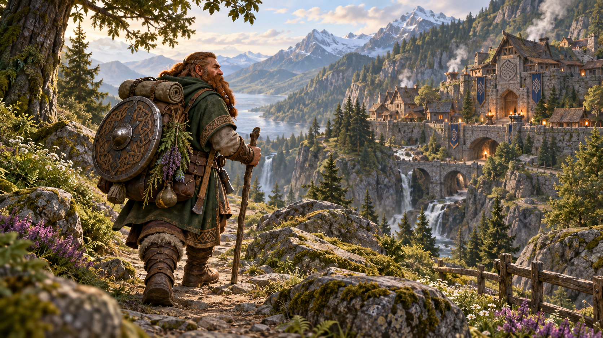

*Người lùn đồi kết hợp trực giác nhạy bén với sức chịu đựng đáng kể. Minh họa nguyên bản tạo bằng OpenAI ImageGen cho bản dịch này.*

Bạn có giác quan nhạy, trực giác sâu sắc và sức chịu đựng đáng kể. Người lùn vàng của Faerûn trong vương quốc hùng mạnh phương nam là người lùn đồi; các Neidar bị lưu đày và Klar sa sút của Krynn trong Dragonlance cũng vậy.

- **Tăng điểm thuộc tính:** Minh triết tăng **1**.
- **Sự cứng cỏi người lùn (Dwarven Toughness):** [HP](99-glossary.md#hit-points) tối đa tăng **1**, và tăng thêm **1 mỗi lần tăng cấp**.

#### Người lùn núi (Mountain Dwarf)

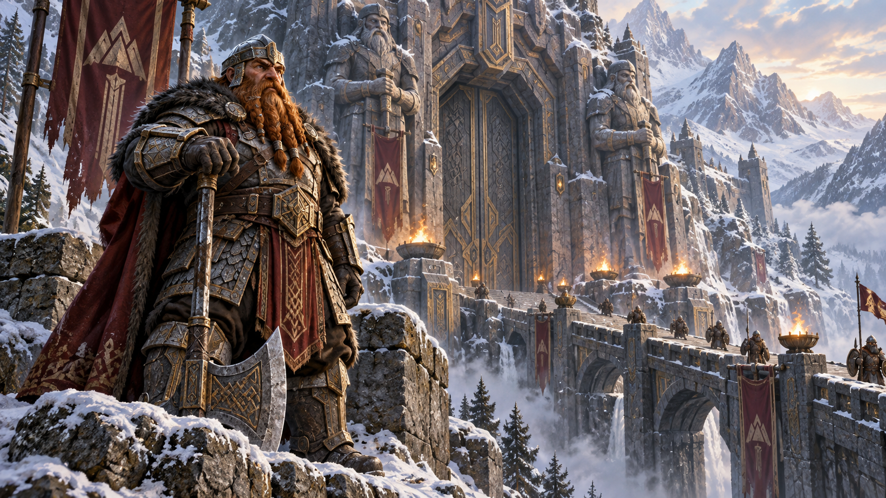

*Người lùn núi mạnh mẽ, bền bỉ và quen với địa hình hiểm trở. Minh họa nguyên bản tạo bằng OpenAI ImageGen cho bản dịch này.*

Bạn mạnh mẽ, bền bỉ, quen cuộc sống khó khăn trên địa hình hiểm trở. Bạn có lẽ khá cao so với người lùn và thường có màu da, tóc nhạt hơn. Người lùn khiên ở bắc Faerûn, thị tộc Hylar cầm quyền và thị tộc Daewar quý tộc của Dragonlance đều là người lùn núi.

- **Tăng điểm thuộc tính:** Sức mạnh tăng **2**.
- **Huấn luyện giáp người lùn (Dwarven Armor Training):** Thành thạo **[giáp nhẹ](99-glossary.md#armor) và giáp trung bình**.

> **Duergar**
>
> Duergar, hay người lùn xám (gray dwarf), sống trong các thành phố sâu ở Underdark. Những kẻ buôn nô lệ độc ác, lén lút này đột kích mặt đất để bắt người rồi bán cho các chủng tộc khác của Underdark. Họ có phép thuật bẩm sinh để tàng hình và tạm thời lớn thành kích thước khổng lồ.

## Elf

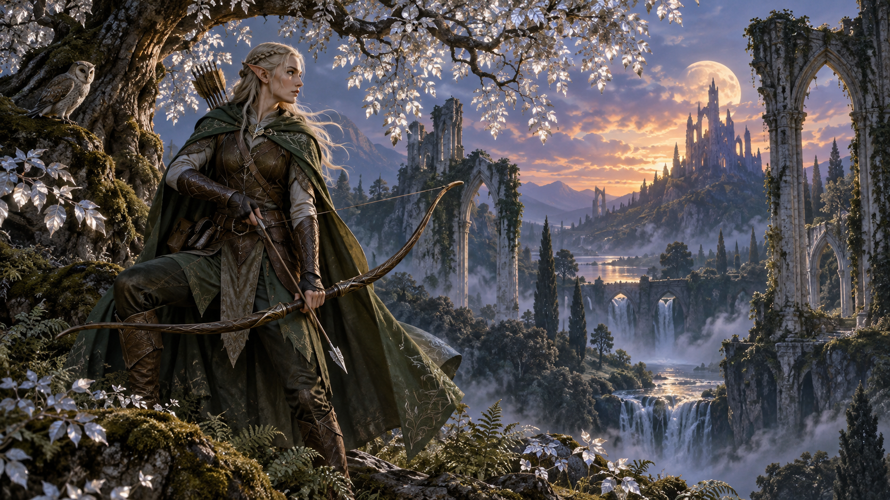

*Elf mang vẻ duyên dáng, giác quan sắc bén và góc nhìn vượt thời gian. Minh họa nguyên bản tạo bằng OpenAI ImageGen cho bản dịch này.*

> “Tôi chưa từng tưởng tượng có vẻ đẹp như thế”, Goldmoon khẽ nói. Cuộc hành quân trong ngày đầy gian nan, nhưng phần thưởng cuối đường vượt xa giấc mơ của họ. Các bạn đồng hành đứng trên vách đá cao nhìn xuống thành phố Qualinost huyền thoại.
>
> Bốn ngọn tháp mảnh vươn lên từ bốn góc thành phố như những trục quay lấp lánh, đá trắng rực rỡ điểm vân bạc sáng. Những vòm duyên dáng cong từ tháp này sang tháp kia, vươn qua không trung. Do thợ kim loại người lùn thời cổ chế tác, chúng đủ chắc để chịu sức nặng cả đạo quân, nhưng trông mong manh đến mức một con chim đậu xuống cũng có thể làm mất thăng bằng. Những vòm lấp lánh là ranh giới duy nhất của thành phố; Qualinost không có tường bao. Thành phố elf yêu thương mở rộng vòng tay với thiên nhiên hoang dã.
>
> — Margaret Weis và Tracy Hickman, *Dragons of Autumn Twilight*

Elf là dân tộc mang phép thuật và vẻ thanh nhã siêu phàm, sống trong thế giới nhưng không hoàn toàn thuộc về nó. Họ sống ở những nơi đẹp huyền ảo, giữa rừng cổ hoặc những tháp bạc lấp lánh ánh sáng thần tiên, nơi nhạc dịu trôi trong không khí và hương thơm nhẹ theo gió. Elf yêu thiên nhiên, phép thuật, nghệ thuật, tài nghệ, âm nhạc, thơ ca và những điều tốt đẹp của thế giới.

### Thanh mảnh và duyên dáng (Slender and Graceful)

Với vẻ thanh nhã siêu phàm và đường nét tinh tế, elf đẹp đến ám ảnh trong mắt con người và nhiều chủng tộc. Trung bình họ thấp hơn con người một chút, cao từ thấp hơn nhiều so với **1,5 m (5 feet)** đến nhỉnh hơn **1,8 m (6 feet)**. Họ thanh mảnh hơn, chỉ nặng **45–65,25 kg (100–145 pound)**. Nam và nữ cao gần như nhau; nam chỉ nặng hơn chút ít.

Màu da, tóc, mắt của elf bao gồm phạm vi thường thấy ở con người, thêm da màu đồng đỏ, đồng thiếc hoặc trắng gần ngả xanh, tóc xanh lá hay xanh dương, mắt như những hồ vàng hoặc bạc lỏng. Họ không có râu và ít lông cơ thể. Họ thích trang phục thanh lịch, màu tươi, và trang sức đơn giản nhưng đẹp.

### Góc nhìn vượt thời gian (A Timeless Perspective)

Elf có thể sống hơn **700 năm**, cho họ góc nhìn rộng về những sự kiện có thể làm chủng tộc sống ngắn lo lắng sâu sắc. Họ thường thấy thú vị hơn là phấn khích, tò mò hơn là tham lam. Họ có xu hướng giữ khoảng cách và không dao động trước sự việc vụn vặt. Tuy nhiên, khi theo đuổi mục tiêu, dù thực hiện nhiệm vụ phiêu lưu hay học kỹ năng, nghệ thuật mới, họ có thể tập trung và không ngừng nỗ lực. Họ chậm kết bạn, chậm gây thù, còn chậm quên hơn nữa. Với xúc phạm nhỏ, họ đáp bằng khinh miệt; với xúc phạm nghiêm trọng, bằng báo thù.

Như cành cây non, elf linh hoạt trước nguy hiểm. Họ tin vào ngoại giao và thỏa hiệp để giải quyết khác biệt trước khi thành bạo lực. Họ có thể rút lui khi kẻ khác xâm nhập quê nhà trong rừng, tin rằng chỉ cần chờ lâu hơn quân xâm lược. Nhưng khi cần, họ bộc lộ mặt võ dũng nghiêm khắc, thể hiện tài kiếm, cung và chiến lược.

### Những lãnh địa ẩn trong rừng (Hidden Woodland Realms)

Phần lớn elf sống tại làng nhỏ ẩn giữa cây rừng. Họ săn, hái lượm và trồng rau; kỹ năng cùng phép thuật giúp tự nuôi sống mà không cần phát quang hay cày đất. Họ là thợ thủ công tài năng, làm quần áo và tác phẩm nghệ thuật tinh xảo. Tiếp xúc với người ngoài thường hạn chế, nhưng một số sống tốt nhờ đổi đồ thủ công lấy kim loại, thứ họ không hứng thú khai thác.

Elf gặp ngoài quê hương thường là nghệ sĩ hát rong, nghệ sĩ hoặc hiền giả đang du hành. Quý tộc con người tranh nhau thuê thầy elf dạy kiếm thuật hoặc phép cho con.

### Khám phá và phiêu lưu (Exploration and Adventure)

Elf phiêu lưu vì khát khao ngao du. Với tuổi thọ dài, họ có thể tận hưởng hàng thế kỷ khám phá. Họ không thích nhịp xã hội con người, vốn ràng buộc từng ngày nhưng liên tục thay đổi qua các thập kỷ, nên tìm công việc cho phép tự do đi lại và tự đặt nhịp sống. Elf cũng thích rèn tài chiến đấu hoặc tăng sức mạnh phép thuật; phiêu lưu cho họ cơ hội ấy. Một số tham gia lực lượng nổi dậy chống áp bức, số khác trở thành người bảo vệ chính nghĩa.

> **Kiêu hãnh nhưng nhã nhặn (Haughty but Gracious)**
>
> Dù có thể kiêu ngạo, elf thường vẫn nhã nhặn với những người không đạt kỳ vọng cao của mình, tức phần lớn người không phải elf. Họ vẫn tìm thấy điểm tốt ở hầu như bất kỳ ai.
>
> **Người lùn:** “Người lùn là những gã thô kệch, vụng về, tẻ nhạt. Nhưng họ bù sự thiếu hài hước, tinh tế và lễ độ bằng lòng dũng cảm. Và tôi phải thừa nhận, thợ rèn giỏi nhất của họ tạo nghệ thuật gần đạt chất lượng elf.”
>
> **Halfling:** “Halfling thích những niềm vui đơn giản, và đó không phải điều đáng khinh. Họ tốt bụng, quan tâm nhau, chăm vườn; khi cần, họ đã chứng tỏ mình cứng cỏi hơn vẻ ngoài.”
>
> **Con người:** “Sự vội vã, tham vọng và thôi thúc hoàn thành việc gì đó trước khi đời ngắn ngủi trôi qua; đôi khi nỗ lực của con người có vẻ vô ích. Nhưng rồi nhìn những gì họ đã làm, phải trân trọng thành tựu của họ. Giá họ chậm lại và học thêm sự tinh tế.”

### Tên elf (Elf Names)

Elf được coi là trẻ cho đến khi tự tuyên bố trưởng thành, vào một thời điểm sau sinh nhật thứ một trăm. Trước đó họ dùng tên thời nhỏ.

Khi tuyên bố trưởng thành, elf chọn tên người lớn; những người quen từ bé có thể vẫn dùng tên cũ. Mỗi tên trưởng thành là sáng tạo riêng, dù có thể phản ánh tên người được kính trọng hoặc thành viên gia đình. Ít có khác biệt giữa tên nam và nữ; cách phân nhóm dưới đây chỉ thể hiện xu hướng chung. Mỗi elf còn có họ, thường ghép từ những từ tiếng Elf. Một số du hành giữa con người dịch họ sang Tiếng Chung; số khác giữ nguyên tiếng Elf.

**Tên thời nhỏ:** Ara, Bryn, Del, Eryn, Faen, Innil, Lael, Mella, Naill, Naeris, Phann, Rael, Rinn, Sai, Syllin, Thia, Vall.

**Tên trưởng thành nam:** Adran, Aelar, Aramil, Arannis, Aust, Beiro, Berrian, Carric, Enialis, Erdan, Erevan, Galinndan, Hadarai, Heian, Himo, Immeral, Ivellios, Laucian, Mindartis, Paelias, Peren, Quarion, Riardon, Rolen, Soveliss, Thamior, Tharivol, Theren, Varis.

**Tên trưởng thành nữ:** Adrie, Althaea, Anastrianna, Andraste, Antinua, Bethrynna, Birel, Caelynn, Drusilia, Enna, Felosial, Ielenia, Jelenneth, Keyleth, Leshanna, Lia, Meriele, Mialee, Naivara, Quelenna, Quillathe, Sariel, Shanairra, Shava, Silaqui, Theirastra, Thia, Vadania, Valanthe, Xanaphia.

**Họ, kèm nghĩa dịch sang Tiếng Chung:** Amakiir (Hoa Đá Quý / Gemflower), Amastacia (Hoa Sao / Starflower), Galanodel (Lời Thì Thầm Của Trăng / Moonwhisper), Holimion (Sương Kim Cương / Diamonddew), Ilphelkiir (Đóa Hoa Đá Quý / Gemblossom), Liadon (Lá Bạc / Silverfrond), Meliamne (Gót Sồi / Oakenheel), Naïlo (Gió Đêm / Nightbreeze), Siannodel (Suối Trăng / Moonbrook), Xiloscient (Cánh Hoa Vàng / Goldpetal).

### Đặc điểm elf (Elf Traits)

Nhân vật elf có các năng lực tự nhiên, kết quả của hàng nghìn năm phát triển tinh tế.

- **Tăng điểm thuộc tính:** [Khéo léo](99-glossary.md#dexterity) tăng **2**.
- **Tuổi:** Trưởng thành về thể chất gần cùng tuổi với con người, nhưng khái niệm trưởng thành của elf còn gồm kinh nghiệm sống. Elf thường tự nhận trưởng thành, chọn tên người lớn vào khoảng **100 tuổi**, và có thể sống tới **750 tuổi**.
- **Khuynh hướng đạo đức:** Yêu tự do, đa dạng và tự thể hiện nên thiên mạnh về khía cạnh ôn hòa của hỗn loạn. Họ coi trọng, bảo vệ tự do người khác như của mình và thường thiên thiện.
- **Kích cỡ:** Cao từ dưới **5** đến trên **1,8 m (6 feet)**, thân hình mảnh. Kích cỡ **Trung bình**.
- **Tốc độ:** Tốc độ đi bộ cơ bản **9 m (30 feet)**.
- **Thị giác bóng tối (Darkvision):** Quen rừng chạng vạng và trời đêm, bạn nhìn tốt trong bóng tối, ánh sáng yếu. Trong **18 m (60 feet)**, nhìn ánh sáng yếu như ánh sáng rõ, bóng tối như ánh sáng yếu. Trong bóng tối chỉ thấy sắc xám, không phân biệt màu.
- **Giác quan nhạy bén (Keen Senses):** Thành thạo kỹ năng **Tri giác (Perception)**.
- **Dòng dõi [Fey](99-glossary.md#fey) (Fey Ancestry):** Có **lợi thế** khi tung cứu nguy chống bị **mê hoặc (charmed)**; phép thuật không thể làm bạn ngủ.
- **Thiền định (Trance):** Elf không cần ngủ. Thay vào đó, họ thiền sâu, vẫn giữ một phần ý thức, **4 giờ mỗi ngày**. Tiếng Chung gọi cách thiền này là “trance”. Khi thiền, bạn có thể mơ theo một cách riêng; thực chất đó là bài tập tinh thần đã thành phản xạ sau nhiều năm luyện tập. Nghỉ như vậy cho lợi ích tương đương **8 giờ ngủ của con người**.
- **Ngôn ngữ:** Nói, đọc, viết **Tiếng Chung** và **tiếng Elf (Elvish)**. Tiếng Elf uyển chuyển, ngữ điệu tinh tế, ngữ pháp phức tạp. Văn học phong phú, đa dạng; bài hát, thơ nổi tiếng giữa các chủng tộc. Nhiều [thi sĩ](99-glossary.md#bard) học ngôn ngữ để thêm những bản ballad tiếng Elf vào vốn biểu diễn.
- **Phân chủng:** Những chia rẽ cổ xưa tạo ba phân chủng chính: **elf bậc cao, elf rừng và elf bóng tối (dark elf)**, thường gọi **drow**. Tài liệu này cho chọn hai phân chủng đầu. Một số thế giới chia nhỏ hơn, như elf mặt trời và elf mặt trăng của Forgotten Realms; nếu muốn, bạn có thể chọn nhóm cụ thể hơn.

#### Elf bậc cao (High Elf)

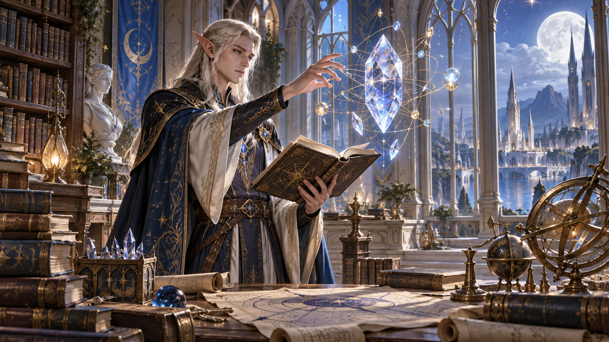

*Elf bậc cao có trí óc sắc bén và nền tảng phép thuật. Minh họa nguyên bản tạo bằng OpenAI ImageGen cho bản dịch này.*

Bạn có trí óc sắc bén và ít nhất nắm vững nền tảng phép thuật. Trong nhiều thế giới D&D có hai kiểu elf bậc cao. Kiểu thứ nhất, gồm elf xám và elf thung lũng của Greyhawk, Silvanesti của Dragonlance, elf mặt trời của Forgotten Realms, kiêu hãnh và sống biệt lập, tin mình hơn những người không phải elf và cả elf khác. Kiểu thứ hai, gồm elf bậc cao của Greyhawk, Qualinesti của Dragonlance, elf mặt trăng của Forgotten Realms, phổ biến, thân thiện hơn và thường gặp giữa con người, các chủng tộc khác.

Elf mặt trời của Faerûn, còn gọi elf vàng hoặc elf bình minh, có da màu đồng thiếc, tóc màu đồng đỏ, đen hoặc vàng óng. Mắt vàng, bạc hoặc đen. Elf mặt trăng, còn gọi elf bạc hoặc elf xám, có da nhạt hơn nhiều, trắng thạch cao đôi khi pha xanh. Tóc thường trắng bạc, đen hoặc xanh dương, nhưng các sắc vàng, nâu, đỏ không hiếm. Mắt xanh dương hoặc xanh lá, điểm đốm vàng.

- **Tăng điểm thuộc tính:** Trí tuệ tăng **1**.
- **Huấn luyện vũ khí elf (Elf Weapon Training):** Thành thạo **kiếm dài (longsword), kiếm ngắn (shortsword), cung ngắn (shortbow) và cung dài (longbow)**.
- **Phép sơ cấp (Cantrip):** Biết **một [phép sơ cấp](99-glossary.md#cantrip) tùy chọn** từ danh sách phép [pháp sư](99-glossary.md#wizard). **Trí tuệ** là thuộc tính [thi triển phép](99-glossary.md#spellcasting) đó.
- **Ngôn ngữ bổ sung (Extra Language):** Nói, đọc, viết **một ngôn ngữ bổ sung tùy chọn**.

#### Elf rừng (Wood Elf)

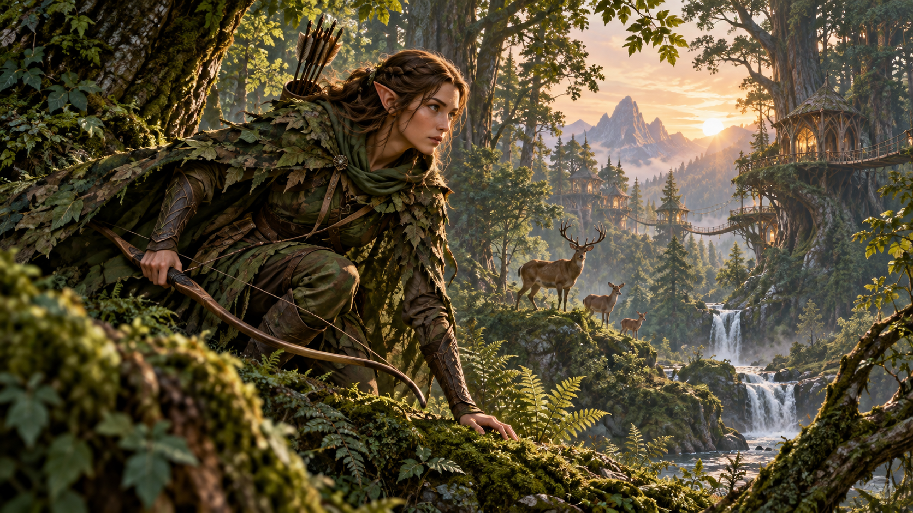

*Elf rừng nhanh nhẹn, kín đáo và hòa hợp với thiên nhiên. Minh họa nguyên bản tạo bằng OpenAI ImageGen cho bản dịch này.*

Bạn có giác quan, trực giác nhạy; đôi chân nhanh đưa bạn đi mau và lặng lẽ qua rừng quê nhà. Nhóm này gồm elf hoang dã (grugach) của Greyhawk, Kagonesti của Dragonlance và những chủng tộc gọi là elf rừng ở Greyhawk, Forgotten Realms. Tại Faerûn, elf rừng, còn gọi elf hoang dã, elf xanh hoặc elf của rừng, sống biệt lập và không tin người không phải elf.

Da thường màu đồng đỏ, đôi khi pha xanh lá. Tóc thường nâu, đen, thỉnh thoảng vàng hoặc màu đồng đỏ. Mắt xanh lá, nâu hoặc nâu lục.

- **Tăng điểm thuộc tính:** Minh triết tăng **1**.
- **Huấn luyện vũ khí elf:** Thành thạo **kiếm dài, kiếm ngắn, cung ngắn và cung dài**.
- **Chân nhanh (Fleet of Foot):** Tốc độ đi bộ cơ bản tăng thành **10,5 m (35 feet)**.
- **Ẩn mình trong thiên nhiên (Mask of the Wild):** Có thể thử ẩn nấp ngay cả khi chỉ bị **che khuất nhẹ (lightly obscured)** bởi tán lá, mưa lớn, tuyết rơi, sương mù hoặc hiện tượng tự nhiên khác.

> **Bóng tối của drow (The Darkness of the Drow)**
>
> Nếu không có một ngoại lệ nổi tiếng, chủng tộc drow hẳn bị khinh ghét khắp nơi. Xã hội sa đọa của họ luôn tìm sự ưu ái của nữ thần nhện Lolth, vị thần chấp thuận giết chóc và tiêu diệt cả gia đình khi các gia tộc quý tộc tranh địa vị. Drow lớn lên với niềm tin rằng các chủng tộc mặt đất vô giá trị, trừ khi làm nô lệ.
>
> Nhưng ít nhất một drow đã vượt khuôn mẫu. Trong Forgotten Realms, **Drizzt Do’Urden**, [kiểm lâm](99-glossary.md#ranger) phương Bắc (ranger of the North), đã chứng minh phẩm chất bằng việc nhân hậu bảo vệ người yếu và vô tội.

## Halfling

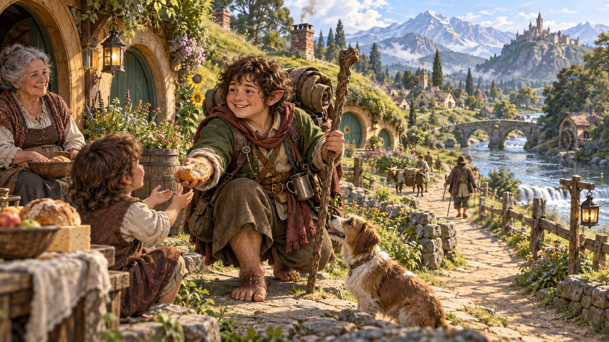

*Halfling trân trọng mái ấm, lòng tốt và cơ hội khám phá. Minh họa nguyên bản tạo bằng OpenAI ImageGen cho bản dịch này.*

> Regis, halfling duy nhất trong phạm vi hàng trăm dặm mọi hướng, đan ngón tay sau đầu, ngả lưng vào lớp rêu phủ thân cây. Regis thấp ngay cả theo chuẩn chủng tộc nhỏ bé của mình; mái tóc nâu xoăn bông chỉ vừa chạm mốc 0,9 m (3 feet). Nhưng bụng anh khá đầy đặn vì thích một bữa ngon, hoặc nhiều bữa khi có dịp. Chiếc que cong dùng làm cần câu vươn phía trên, kẹp giữa hai ngón chân, chìa ra mặt hồ yên lặng và được phản chiếu hoàn hảo trên mặt nước như gương của Maer Dualdon.
>
> — R. A. Salvatore, *The Crystal Shard*

Sự ấm cúng của mái nhà là mục tiêu đời sống của phần lớn halfling: nơi ở yên bình, tĩnh lặng, xa quái vật cướp phá và quân đội giao chiến; lửa rực và bữa ăn thịnh soạn; đồ uống ngon cùng chuyện trò thú vị. Một số sống cả đời trong cộng đồng nông nghiệp hẻo lánh, số khác lập đoàn du mục không ngừng đi lại, bị con đường rộng mở và chân trời bao la cuốn hút tìm điều kỳ diệu của đất mới, dân tộc mới. Nhưng ngay cả người lang thang cũng yêu hòa bình, thức ăn, bếp lửa, mái nhà, dù nhà là xe ngựa xóc trên đường đất hay bè trôi xuôi sông.

### Nhỏ bé và thực tế (Small and Practical)

Halfling sống sót giữa thế giới đầy sinh vật lớn bằng cách tránh bị chú ý, hoặc nếu không được thì tránh gây mất lòng. Cao khoảng **0,9 m (3 feet)**, họ có vẻ vô hại nên tồn tại nhiều thế kỷ trong bóng các đế quốc, bên rìa chiến tranh và xung đột chính trị. Họ thường đẫy đà, nặng **18–20,25 kg (40–45 pound)**.

Da từ rám nắng đến nhạt pha hồng; tóc thường nâu hoặc nâu cát, gợn sóng. Mắt nâu hoặc nâu lục. Nam thường có tóc mai dài, nhưng râu hiếm, ria còn hiếm hơn. Họ thích quần áo đơn giản, thoải mái, thực dụng, ưu tiên màu tươi.

Tính thực tế không chỉ thể hiện ở quần áo. Họ quan tâm nhu cầu cơ bản và niềm vui đơn giản, không cần phô trương. Ngay cả người giàu nhất cũng khóa kho báu dưới hầm thay vì trưng cho mọi người. Họ có tài tìm giải pháp thẳng nhất và ít kiên nhẫn với do dự.

### Tốt bụng và tò mò (Kind and Curious)

Halfling thân thiện, vui vẻ. Họ trân trọng quan hệ gia đình, bạn bè, sự ấm áp của bếp lửa và mái nhà, ít mơ về vàng hay vinh quang. Ngay cả nhà phiêu lưu thường ra đi vì cộng đồng, bạn bè, khát khao du hành hoặc tò mò. Họ thích khám phá điều mới, kể cả thứ đơn giản như món ăn lạ hoặc kiểu trang phục chưa quen.

Họ dễ động lòng trắc ẩn, ghét thấy sinh vật nào chịu khổ. Họ hào phóng, vui vẻ chia sẻ cả trong lúc thiếu thốn.

### Hòa vào đám đông (Blend into the Crowd)

Halfling giỏi hòa nhập cộng đồng con người, người lùn hoặc elf, trở thành thành viên có ích, được chào đón. Khả năng lén lút bẩm sinh cùng bản tính không phô trương giúp tránh sự chú ý không mong muốn.

Họ sẵn sàng hợp tác và trung thành với bạn, dù là halfling hay chủng tộc khác. Họ có thể hung mãnh đáng ngạc nhiên khi bạn bè, gia đình, cộng đồng bị đe dọa.

### Niềm vui thôn quê (Pastoral Pleasantries)

Phần lớn sống trong cộng đồng nhỏ, yên bình, có nông trại rộng và lùm cây chăm sóc tốt. Họ hiếm lập vương quốc hoặc giữ nhiều đất ngoài những vùng quê yên tĩnh. Thường không công nhận tầng lớp quý tộc hay hoàng gia halfling, mà để người cao tuổi trong gia đình dẫn dắt. Gia đình giữ truyền thống bất chấp đế quốc hưng vong.

Nhiều người sống giữa chủng tộc khác, nơi sự chăm chỉ, trung thành mang lại phần thưởng dồi dào và tiện nghi. Một số cộng đồng chọn du hành làm lối sống, đi xe ngựa hoặc thuyền từ nơi này sang nơi khác, không có nhà cố định.

### Khám phá cơ hội (Exploring Opportunities)

Halfling thường lên đường để bảo vệ cộng đồng, hỗ trợ bạn bè hoặc khám phá thế giới rộng đầy điều kỳ diệu. Với họ, phiêu lưu ít là nghề nghiệp mà thường là cơ hội, đôi khi là điều bắt buộc.

> **Thân thiện và tích cực (Affable and Positive)**
>
> Halfling cố hòa hợp với mọi người và không thích khái quát hóa về cả một nhóm, đặc biệt theo hướng tiêu cực.
>
> **Người lùn:** “Người lùn là bạn trung thành, có thể tin họ giữ lời. Nhưng thỉnh thoảng cười một chút có hại gì đâu?”
>
> **Elf:** “Họ đẹp quá! Khuôn mặt, âm nhạc, vẻ duyên dáng, tất cả. Như bước ra từ giấc mơ tuyệt vời. Nhưng chẳng biết đằng sau nụ cười đang nghĩ gì; chắc chắn nhiều hơn những gì họ để lộ.”
>
> **Con người:** “Thật ra con người khá giống chúng ta, ít nhất một số. Rời lâu đài, thành trì, nói chuyện với nông dân và người chăn nuôi, sẽ thấy những người tốt, đáng tin. Không phải nam tước hay binh sĩ có gì sai; phải ngưỡng mộ niềm tin của họ. Khi bảo vệ đất mình, họ cũng bảo vệ chúng ta.”

### Tên halfling (Halfling Names)

Một halfling có tên, họ và có thể biệt danh. Họ thường bắt nguồn từ biệt danh bám chặt đến mức truyền qua nhiều thế hệ.

**Tên nam:** Alton, Ander, Cade, Corrin, Eldon, Errich, Finnan, Garret, Lindal, Lyle, Merric, Milo, Osborn, Perrin, Reed, Roscoe, Wellby.

**Tên nữ:** Andry, Bree, Callie, Cora, Euphemia, Jillian, Kithri, Lavinia, Lidda, Merla, Nedda, Paela, Portia, Seraphina, Shaena, Trym, Vani, Verna.

**Họ:** Brushgather, Goodbarrel, Greenbottle, High-hill, Hilltopple, Leagallow, Tealeaf, Thorngage, Tosscobble, Underbough.

### Đặc điểm halfling (Halfling Traits)

Nhân vật của bạn có các đặc điểm chung của halfling.

- **Tăng điểm thuộc tính:** Khéo léo tăng **2**.
- **Tuổi:** Trưởng thành ở **20 tuổi**, thường sống đến khoảng giữa thế kỷ thứ hai của đời mình.
- **Khuynh hướng đạo đức:** Phần lớn **thiện, trọng luật**. Thường nhân hậu, tốt bụng, ghét thấy người khác đau khổ và không dung thứ áp bức. Họ cũng có trật tự, giữ truyền thống, dựa nhiều vào hỗ trợ cộng đồng và sự an tâm từ nếp sống cũ.
- **Kích cỡ:** Cao trung bình **0,9 m (3 feet)**, nặng khoảng **18 kg (40 pounds)**. Kích cỡ **Nhỏ (Small)**.
- **Tốc độ:** Tốc độ đi bộ cơ bản **7,5 m (25 feet)**.
- **May mắn (Lucky):** Khi tung [d20](99-glossary.md#dice-notation) ra **1** cho tấn công, kiểm tra thuộc tính hoặc cứu nguy, bạn có thể **tung lại viên đó và phải dùng kết quả mới**.
- **Can đảm (Brave):** Có **lợi thế** khi tung cứu nguy chống bị **hoảng sợ (frightened)**.
- **Sự lanh lẹ halfling (Halfling Nimbleness):** Có thể đi xuyên qua không gian của bất kỳ sinh vật nào có kích cỡ lớn hơn mình.
- **Ngôn ngữ:** Nói, đọc, viết **Tiếng Chung** và **tiếng Halfling**. Tiếng Halfling không bí mật, nhưng họ không muốn chia sẻ với người ngoài. Họ viết ít nên không có kho văn học phong phú, nhưng truyền thống truyền miệng rất mạnh. Gần như mọi halfling nói Tiếng Chung để trò chuyện với cư dân nơi sống hoặc đi qua.
- **Phân chủng:** Hai nhóm chính, **chân nhẹ (lightfoot)** và **vạm vỡ (stout)**, giống các gia đình họ hàng gần hơn phân chủng thực sự. Chọn một nhóm.

#### Halfling chân nhẹ (Lightfoot)

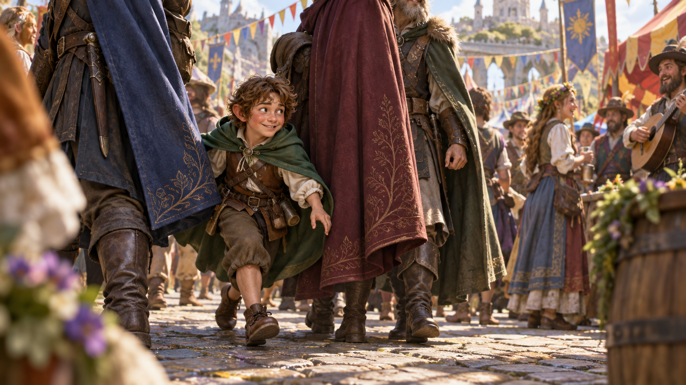

*Halfling chân nhẹ thân thiện và có thể dễ dàng ẩn mình giữa những người lớn hơn. Minh họa nguyên bản tạo bằng OpenAI ImageGen cho bản dịch này.*

Bạn dễ ẩn mình, thậm chí dùng người khác làm vật che. Bạn thường thân thiện, hòa hợp tốt. Trong Forgotten Realms, nhóm chân nhẹ phân bố rộng nhất nên phổ biến nhất.

Họ thích du hành hơn halfling khác, thường sống bên chủng tộc khác hoặc theo đời du mục. Trong Greyhawk, những halfling này được gọi **hairfeet** hoặc **tallfellows**.

- **Tăng điểm thuộc tính:** [Sức hút](99-glossary.md#charisma) tăng **1**.
- **Lén lút tự nhiên (Naturally Stealthy):** Có thể thử ẩn nấp ngay cả khi chỉ được che bởi **một sinh vật lớn hơn mình ít nhất một bậc kích cỡ**.

#### Halfling vạm vỡ (Stout)

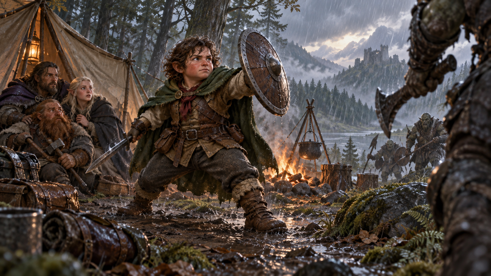

*Halfling vạm vỡ nổi bật bởi lòng can đảm và sức chịu đựng. Minh họa nguyên bản tạo bằng OpenAI ImageGen cho bản dịch này.*

Bạn bền bỉ hơn mức trung bình và có khả năng chống độc. Có người nói nhóm vạm vỡ mang máu người lùn. Trong Forgotten Realms họ gọi **stronghearts**, phổ biến nhất ở phương nam.

- **Tăng điểm thuộc tính:** Thể chất tăng **1**.
- **Sức chịu đựng vạm vỡ (Stout Resilience):** Có **lợi thế** khi tung cứu nguy chống độc và **kháng sát thương độc**.

## Con người (Human)

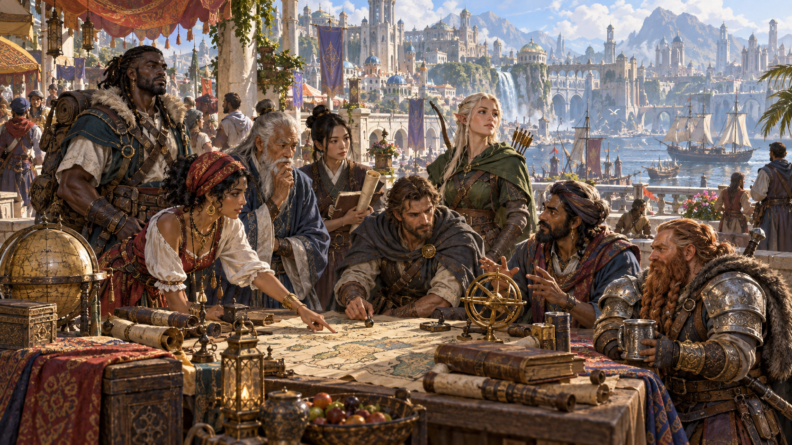

*Con người đa dạng về diện mạo, tài năng, văn hóa và tham vọng. Minh họa nguyên bản tạo bằng OpenAI ImageGen cho bản dịch này.*

> Đó là những câu chuyện về một dân tộc không chịu yên, từ xa xưa đã ra biển, lên sông bằng thuyền dài, ban đầu cướp bóc và gieo kinh hoàng, rồi định cư. Nhưng mỗi trang đều vang lên năng lượng và tình yêu phiêu lưu. Liriel đọc đến khuya, thắp hết cây nến quý này đến cây khác.
>
> Cô chưa từng nghĩ nhiều về con người, nhưng các câu chuyện mê hoặc cô. Những trang giấy ngả vàng kể về anh hùng gan dạ, thú lạ dữ dằn, thần linh nguyên sơ hùng mạnh và phép thuật dệt thành một phần vùng đất xa xôi ấy.
>
> — Elaine Cunningham, *Daughter of the Drow*

Theo cách tính của phần lớn thế giới, con người là chủng tộc trẻ nhất trong các chủng tộc phổ biến, xuất hiện muộn và sống ngắn so với người lùn, elf, rồng. Có lẽ vì đời ngắn, họ cố đạt nhiều nhất trong những năm được ban. Hoặc họ cảm thấy cần chứng tỏ với chủng tộc lâu đời, nên xây đế quốc hùng mạnh bằng chinh phục, thương mại. Dù động lực nào, con người là người đổi mới, người lập thành tựu và người tiên phong của các thế giới.

### Một phổ rộng (A Broad Spectrum)

Vì thích di cư, chinh phục, con người đa dạng về thể chất hơn các chủng tộc phổ biến khác. Không có hình mẫu con người điển hình. Một người có thể cao **5 đến nhỉnh hơn 1,8 m (6 feet)**, nặng **56,25–112,5 kg (125–250 pound)**. Da từ gần đen đến rất nhạt, tóc từ đen đến vàng, xoăn lọn, xoăn tít hoặc thẳng; nam có thể có râu thưa hay rậm. Nhiều người mang chút huyết thống phi nhân, để lộ nét elf, orc hoặc dòng dõi khác. Họ trưởng thành vào cuối tuổi thiếu niên, hiếm sống tới một thế kỷ.

### Đa dạng trong mọi thứ (Variety in All Things)

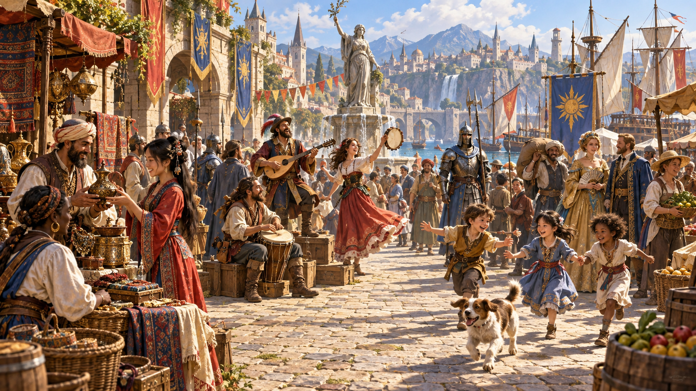

*Con người thích nghi với nhiều lối sống, nghề nghiệp và truyền thống. Minh họa nguyên bản tạo bằng OpenAI ImageGen cho bản dịch này.*

Con người thích nghi tốt nhất và tham vọng nhất trong các chủng tộc phổ biến. Sở thích, đạo đức, phong tục khác biệt lớn giữa các vùng định cư. Nhưng khi định cư, họ ở lại: xây thành phố để trường tồn, vương quốc lớn tồn tại hàng thế kỷ. Cá nhân sống tương đối ngắn, nhưng quốc gia, văn hóa giữ truyền thống có nguồn gốc xa ngoài ký ức của một người. Họ sống trọn hiện tại nên phù hợp đời phiêu lưu, đồng thời hoạch định tương lai, cố để lại di sản lâu dài. Cá nhân hay tập thể đều biết thích nghi, nắm cơ hội và chú ý biến chuyển chính trị, xã hội.

### Những thể chế bền lâu (Lasting Institutions)

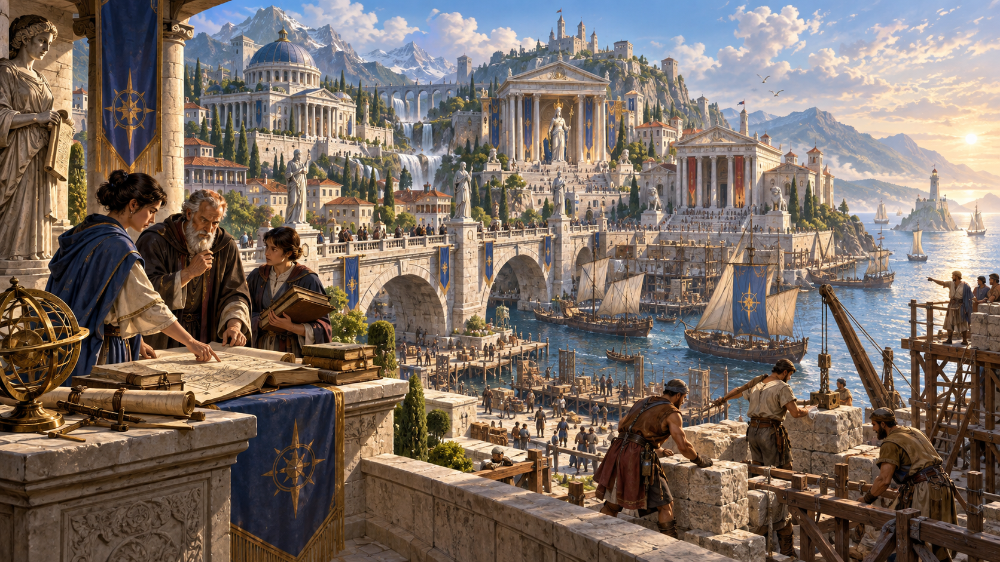

*Các thể chế giúp con người lưu giữ tri thức và di sản qua nhiều thế hệ. Minh họa nguyên bản tạo bằng OpenAI ImageGen cho bản dịch này.*

Trong khi một elf hoặc người lùn có thể tự đảm trách bảo vệ nơi đặc biệt hay bí mật mạnh mẽ, con người lập hội thiêng và thể chế để làm việc ấy. Trong khi thị tộc người lùn và trưởng lão halfling truyền truyền thống cổ cho từng thế hệ, đền thờ, chính quyền, thư viện, bộ luật con người khắc truyền thống vào nền tảng lịch sử. Con người mơ bất tử, nhưng trừ số ít tìm [trạng thái](99-glossary.md#condition) bất tử [xác sống](99-glossary.md#undead) (undeath) hoặc thăng lên thần để thoát chết, họ đạt điều ấy bằng cách bảo đảm được nhớ sau khi mất.

Dù một số người bài ngoại, nhìn chung xã hội con người bao dung. Vùng đất con người đón nhiều người phi nhân hơn so với tỷ lệ con người sống ở đất phi nhân.

### Hình mẫu tham vọng (Exemplars of Ambition)

Những người tìm phiêu lưu là thành viên táo bạo, tham vọng nhất của một chủng tộc vốn táo bạo, tham vọng. Họ muốn được người đồng loại tôn vinh bằng cách tích lũy quyền lực, giàu có, danh tiếng. Hơn các dân tộc khác, con người đứng lên vì lý tưởng hơn là vì lãnh thổ hoặc nhóm người.

> **Người bạn thân thứ hai của mọi người (Everyone’s Second-Best Friends)**
>
> Con người hòa lẫn với các chủng tộc khác dễ như hòa lẫn với nhau. Họ hợp với hầu hết mọi người, dù có thể không thân nhiều người. Họ làm đại sứ, nhà ngoại giao, quan tòa, thương nhân và đủ loại viên chức.
>
> **Người lùn:** “Họ vạm vỡ, là bạn kiên định, giữ lời. Nhưng lòng tham vàng là điểm khiến họ suy sụp.”
>
> **Elf:** “Tốt nhất đừng đi lang thang vào rừng elf. Họ không thích kẻ xâm nhập; ngươi có thể bị bỏ bùa hoặc bị tên bắn đầy người. Tuy nhiên, nếu một elf vượt được lòng kiêu hãnh chủng tộc chết tiệt và thật sự coi ngươi ngang hàng, ngươi học được nhiều điều từ họ.”
>
> **Halfling:** “Khó có gì hơn bữa ăn trong nhà halfling, miễn ngươi không đập đầu vào trần: thức ăn ngon, chuyện hay trước lửa ấm. Nếu họ có chút tham vọng, họ có thể làm nên điều gì đáng kể.”

### Tên và sắc dân con người (Human Names and Ethnicities)

Đa dạng hơn nhiều nền văn hóa khác, con người nói chung không có tên điển hình. Một số cha mẹ đặt tên con từ ngôn ngữ khác, như tiếng Người lùn hoặc tiếng Elf, phát âm ít nhiều đúng. Phần lớn đặt tên gắn với văn hóa vùng hoặc truyền thống tổ tiên.

Văn hóa vật chất và đặc điểm cơ thể thay đổi mạnh giữa các vùng. Chẳng hạn, trong Forgotten Realms, trang phục, kiến trúc, ẩm thực, âm nhạc, văn học ở Silver Marches phía tây bắc khác Turmish hay Impiltur xa phía đông, và càng khác Kara-Tur xa xôi. Tuy nhiên, đặc điểm cơ thể biến đổi theo các cuộc di cư cổ của những người đầu tiên; con người Silver Marches vì vậy có đủ mọi màu da, tóc, mắt và đường nét.

Forgotten Realms thường công nhận **chín sắc dân con người**, dù hơn một tá nhóm khác có ở những vùng nhỏ hơn của Faerûn. Bạn có thể lấy cảm hứng từ các nhóm và tên điển hình sau, bất kể nhân vật sống trong thế giới nào.

#### Calishite

Thấp, thanh hơn phần lớn con người khác, người Calishite có da nâu sẫm, tóc và mắt nâu sẫm. Chủ yếu sống ở tây nam Faerûn.

**Tên nam:** Aseir, Bardeid, Haseid, Khemed, Mehmen, Sudeiman, Zasheir.

**Tên nữ:** Atala, Ceidil, Hama, Jasmal, Meilil, Seipora, Yasheira, Zasheida.

**Họ:** Basha, Dumein, Jassan, Khalid, Mostana, Pashar, Rein.

#### Chondathan

Thanh mảnh, da nâu vàng, tóc nâu từ gần vàng đến gần đen. Phần lớn cao, mắt xanh lá hoặc nâu, nhưng không phải ai cũng thế. Người gốc Chondathan chiếm đa số ở miền trung Faerûn quanh Biển Nội Địa (Inner Sea).

**Tên nam:** Darvin, Dorn, Evendur, Gorstag, Grim, Helm, Malark, Morn, Randal, Stedd.

**Tên nữ:** Arveene, Esvele, Jhessail, Kerri, Lureene, Miri, Rowan, Shandri, Tessele.

**Họ:** Amblecrown, Buckman, Dundragon, Evenwood, Greycastle, Tallstag.

#### Damaran

Chủ yếu ở tây bắc Faerûn, chiều cao, vóc dáng trung bình, da từ nâu vàng đến sáng. Tóc thường nâu hoặc đen; mắt nhiều màu, phổ biến nhất nâu.

**Tên nam:** Bor, Fodel, Glar, Grigor, Igan, Ivor, Kosef, Mival, Orel, Pavel, Sergor.

**Tên nữ:** Alethra, Kara, Katernin, Mara, Natali, Olma, Tana, Zora.

**Họ:** Bersk, Chernin, Dotsk, Kulenov, Marsk, Nemetsk, Shemov, Starag.

#### Illuskan

Cao, da sáng, mắt xanh dương hoặc xám thép. Phần lớn tóc đen như quạ, nhưng người ở cực tây bắc có tóc vàng, đỏ hoặc nâu nhạt.

**Tên nam:** Ander, Blath, Bran, Frath, Geth, Lander, Luth, Malcer, Stor, Taman, Urth.

**Tên nữ:** Amafrey, Betha, Cefrey, Kethra, Mara, Olga, Silifrey, Westra.

**Họ:** Brightwood, Helder, Hornraven, Lackman, Stormwind, Windrivver.

#### Mulan

Chiếm đa số ở bờ đông, đông nam Biển Nội Địa, người Mulan thường cao, mảnh, da màu hổ phách, mắt nâu lục hoặc nâu. Tóc từ đen đến nâu sẫm, nhưng ở những vùng Mulan nổi bật nhất, quý tộc và nhiều người khác cạo hết tóc.

**Tên nam:** Aoth, Bareris, Ehput-Ki, Kethoth, Mumed, Ramas, So-Kehur, Thazar-De, Urhur.

**Tên nữ:** Arizima, Chathi, Nephis, Nulara, Murithi, Sefris, Thola, Umara, Zolis.

**Họ:** Ankhalab, Anskuld, Fezim, Hahpet, Nathandem, Sepret, Uuthrakt.

#### Rashemi

Thường gặp phía đông Biển Nội Địa và sống xen với Mulan. Họ thường thấp, vạm vỡ, nhiều cơ, da sẫm, mắt tối, tóc đen dày.

**Tên nam:** Borivik, Faurgar, Jandar, Kanithar, Madislak, Ralmevik, Shaumar, Vladislak.

**Tên nữ:** Fyevarra, Hulmarra, Immith, Imzel, Navarra, Shevarra, Tammith, Yuldra.

**Họ:** Chergoba, Dyernina, Iltazyara, Murnyethara, Stayanoga, Ulmokina.

#### Shou

Sắc dân đông và mạnh nhất Kara-Tur, xa phía đông Faerûn. Da màu đồng thiếc ngả vàng, tóc đen, mắt tối. Họ thường đặt họ trước tên.

**Tên nam:** An, Chen, Chi, Fai, Jiang, Jun, Lian, Long, Meng, On, Shan, Shui, Wen.

**Tên nữ:** Bai, Chao, Jia, Lei, Mei, Qiao, Shui, Tai.

**Họ:** Chien, Huang, Kao, Kung, Lao, Ling, Mei, Pin, Shin, Sum, Tan, Wan.

#### Tethyrian

Phân bố khắp Sword Coast ở rìa tây Faerûn, chiều cao, vóc dáng trung bình, da sẫm nhưng có xu hướng sáng hơn càng sống về bắc. Tóc, mắt đa dạng, thường nhất tóc nâu, mắt xanh dương. Chủ yếu dùng tên Chondathan.

#### Turami

Cư dân bản địa bờ nam Biển Nội Địa, thường cao, nhiều cơ, da màu nâu đỏ gỗ gụ sẫm, tóc đen xoăn, mắt tối.

**Tên nam:** Anton, Diero, Marcon, Pieron, Rimardo, Romero, Salazar, Umbero.

**Tên nữ:** Balama, Dona, Faila, Jalana, Luisa, Marta, Quara, Selise, Vonda.

**Họ:** Agosto, Astorio, Calabra, Domine, Falone, Marivaldi, Pisacar, Ramondo.

### Đặc điểm con người (Human Traits)

Khó khái quát về con người, nhưng nhân vật của bạn có những đặc điểm sau.

- **Tăng điểm thuộc tính:** **Mỗi điểm trong sáu thuộc tính tăng 1**.
- **Tuổi:** Trưởng thành vào cuối tuổi thiếu niên, sống dưới một thế kỷ.
- **Khuynh hướng đạo đức:** Không thiên về khuynh hướng cụ thể. Có cả người tốt nhất và xấu nhất.
- **Kích cỡ:** Chiều cao, vóc dáng đa dạng, từ vừa **1,5 m (5 feet)** đến hơn nhiều so với **1,8 m (6 feet)**. Bất kể nằm ở đâu trong khoảng này, kích cỡ là **Trung bình**.
- **Tốc độ:** Tốc độ đi bộ cơ bản **9 m (30 feet)**.
- **Ngôn ngữ:** Nói, đọc, viết **Tiếng Chung** và **một ngôn ngữ bổ sung tùy chọn**. Con người thường học tiếng các dân tộc giao tiếp cùng, kể cả phương ngữ ít biết. Họ thích xen từ mượn: lời chửi tiếng Orc, cách diễn đạt âm nhạc tiếng Elf, cụm quân sự tiếng Người lùn, v.v.

> **Biến thể đặc điểm con người (Variant Human Traits)**
>
> Nếu [chiến dịch](99-glossary.md#campaign) dùng quy tắc tùy chọn về **[kỳ tài](99-glossary.md#feat) (feats)** trong **chương 6 của Player’s Handbook**, DM có thể cho dùng các đặc điểm biến thể dưới đây. Tất cả chúng thay thế đặc điểm Tăng điểm thuộc tính thông thường của con người.
>
> - **Tăng điểm thuộc tính:** Chọn **hai thuộc tính khác nhau**, mỗi thuộc tính tăng **1**.
> - **Kỹ năng:** Thành thạo **một kỹ năng tùy chọn**.
> - **Kỳ tài:** Nhận **một kỳ tài tùy chọn**.

*Minh họa trong bản gốc, trang 21: Richard Whitters.*

---

*D&D Basic Rules (Version 1.0). Không được bán lại. Được phép in và sao chụp tài liệu này chỉ để sử dụng cá nhân.*
