# Chương 4: Tính cách và xuất thân

Nguồn: *D&D Basic Rules (Version 1.0), 2018*, trang 35-44.

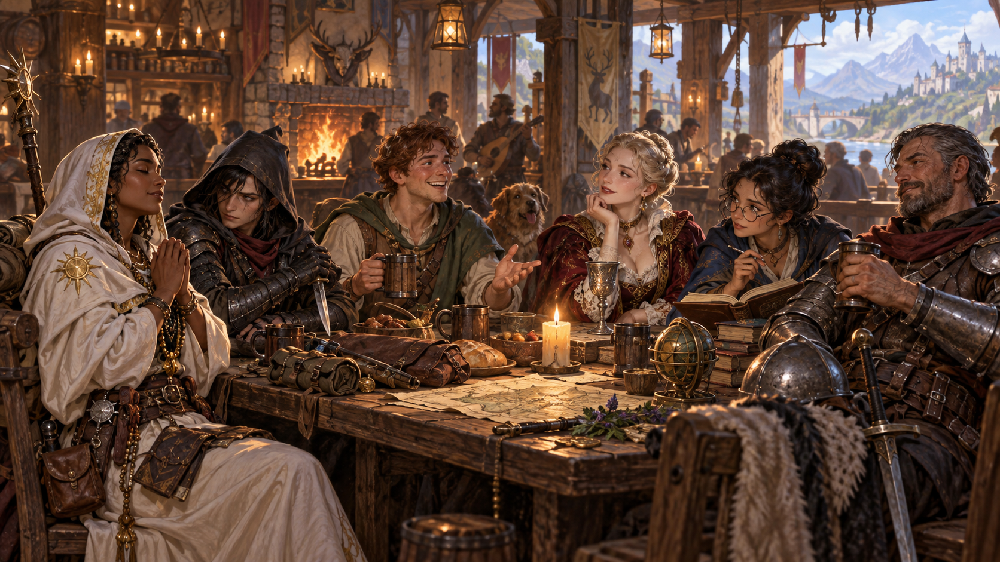

*Tính cách và xuất thân biến các chỉ số thành một con người có lịch sử, động lực và cách ứng xử riêng. Minh họa nguyên bản tạo bằng OpenAI ImageGen cho bản dịch này.*

Nhân vật được định hình bởi nhiều điều hơn chủng tộc và lớp. Họ là những cá nhân có câu chuyện, sở thích, quan hệ và năng lực vượt ngoài những gì lớp và chủng tộc xác định. Chương này trình bày các chi tiết phân biệt nhân vật với nhau: những điều cơ bản như tên, mô tả ngoại hình, quy tắc về xuất thân và ngôn ngữ, cùng các khía cạnh tinh tế hơn của tính cách và khuynh hướng đạo đức.

## Chi tiết nhân vật

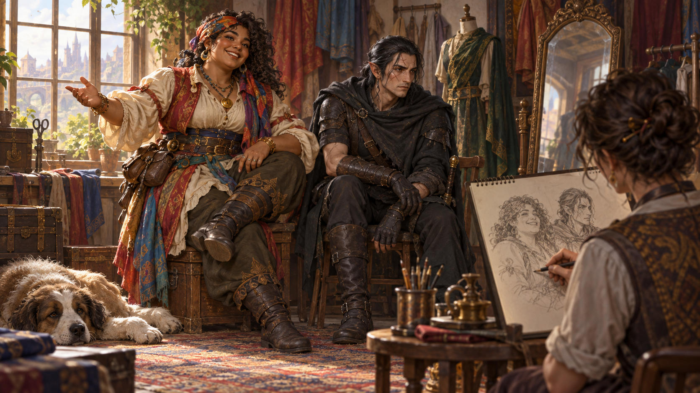

*Tên gọi, diện mạo và những đặc điểm cơ thể giúp người chơi hình dung nhân vật rõ ràng hơn. Minh họa nguyên bản tạo bằng OpenAI ImageGen cho bản dịch này.*

Tên và mô tả ngoại hình có thể là những điều đầu tiên người chơi khác tại bàn biết về nhân vật. Hãy nghĩ xem chúng phản ánh hình dung của bạn thế nào.

### Tên (Name)

Mô tả chủng tộc có các tên mẫu. Hãy suy nghĩ về tên, ngay cả khi chỉ chọn từ danh sách.

### Giới tính (Sex)

Bạn có thể chơi nhân vật nam hoặc nữ mà không nhận lợi ích hay trở ngại đặc biệt. Hãy nghĩ xem nhân vật có tuân theo những kỳ vọng của văn hóa rộng hơn về giới tính, giới và hành vi tình dục không. Chẳng hạn, một giáo sĩ drow nam đi ngược sự phân chia giới truyền thống của xã hội drow; đó có thể là lý do rời xã hội ấy để lên mặt đất.

Bạn không cần giới hạn mình trong khái niệm nhị nguyên về giới tính và giới. Ví dụ, thần elf Corellon Larethian thường mang hình dạng có cả nét nam và nữ, và một số elf trong đa vũ trụ được tạo theo hình ảnh Corellon. Bạn có thể chơi một nhân vật nữ thể hiện mình là nam, một người nam cảm thấy mắc kẹt trong cơ thể nữ, hoặc một người lùn nữ có râu ghét bị nhầm là nam. Tương tự, xu hướng tính dục do bạn quyết định.

### Chiều cao và cân nặng (Height and Weight)

Bạn có thể quyết định chiều cao, cân nặng theo mô tả chủng tộc hoặc bảng ngẫu nhiên. Hãy nghĩ điểm thuộc tính nói gì về cơ thể: một nhân vật yếu nhưng nhanh nhẹn có thể gầy; một người khỏe và bền bỉ có thể cao hoặc chỉ nặng.

Nếu muốn, tung ngẫu nhiên theo bảng. Kết quả cột Hệ số cao xác định số inch cộng vào chiều cao cơ sở. Cùng số ấy nhân kết quả xúc xắc, hoặc số cố định, ở cột Hệ số nặng để xác định số pound cộng vào cân nặng cơ sở.

| Chủng tộc | Cao cơ sở | Hệ số cao | Nặng cơ sở | Hệ số nặng |
| --- | --- | --- | --- | --- |
| Con người | 4'8" | +2d10 | 110 lb. | × 2d4 lb. |
| Người lùn đồi | 3'8" | +2d4 | 115 lb. | × 2d6 lb. |
| Người lùn núi | 4' | +2d4 | 130 lb. | × 2d6 lb. |
| Elf bậc cao | 4'6" | +2d10 | 90 lb. | × 1d4 lb. |
| Elf rừng | 4'6" | +2d10 | 100 lb. | × 1d4 lb. |
| Halfling | 2'7" | +2d4 | 35 lb. | × 1 lb. |

Ví dụ, Tika là con người: tung 2d10 được 12 nên cao 5'8". Tung 2d4 được 3, nên nặng thêm 12 × 3 = 36 lb.; tổng 146 lb.

### Các đặc điểm cơ thể khác (Other Physical Characteristics)

Bạn chọn tuổi, màu tóc, mắt và da. Để thêm nét riêng, có thể cho một đặc điểm cơ thể khác thường hoặc dễ nhớ như sẹo, dáng đi khập khiễng hay hình xăm.

### Tika và Artemis: Hai nhân vật tương phản

Những chi tiết của chương này giúp nhân vật khác biệt với mọi nhân vật khác. Hãy xét hai chiến binh con người sau.

Tika Waylan của Dragonlance là cô gái tuổi thiếu niên nóng nảy, có tuổi thơ gian khó. Là con gái kẻ trộm, cô bỏ nhà và theo nghề cha trên phố Solace. Khi cố trộm chủ quán Inn of the Last Home, cô bị bắt; ông nhận giúp đỡ, cho cô việc phục vụ quán rượu. Khi quân đoàn rồng tàn phá Solace và phá quán trọ, hoàn cảnh buộc Tika phiêu lưu cùng những người bạn từ nhỏ. Tài chiến đấu, với chiếc chảo vẫn là vũ khí ưa thích, kết hợp quá khứ đường phố cho cô kỹ năng vô giá trong sự nghiệp phiêu lưu.

Artemis Entreri lớn lên trên phố Calimport, Forgotten Realms. Anh dùng trí khôn, sức mạnh và nhanh nhẹn giành lãnh địa riêng trong một khu ổ chuột của hàng trăm khu trong thành. Sau vài năm, một công hội trộm mạnh nhất chú ý; anh nhanh chóng thăng tiến dù trẻ. Anh thành sát thủ được một pasha ưa dùng, được gửi đến Icewind Dale xa xôi lấy lại đá quý bị trộm. Anh là sát thủ chuyên nghiệp, luôn thử thách mình cải thiện kỹ năng.

Cả hai đều là con người, chiến binh có chút kinh nghiệm đạo tặc, với Sức mạnh và Khéo léo cao tương tự; nhưng điểm giống nhau chỉ đến đó.

## Khuynh hướng đạo đức (Alignment)

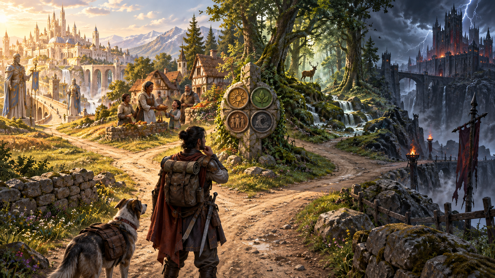

*Khuynh hướng mô tả xu hướng đạo đức và thái độ của nhân vật trước trật tự, tự do và trách nhiệm. Minh họa nguyên bản tạo bằng OpenAI ImageGen cho bản dịch này.*

Khuynh hướng mô tả khái quát thái độ đạo đức và cá nhân. Một trục mô tả đạo đức (thiện, ác hoặc trung lập); trục kia mô tả thái độ đối với xã hội và trật tự (trọng luật, hỗn loạn hoặc trung lập). Kết hợp hai trục tạo thành chín lựa chọn:

| Khuynh hướng | Mô tả |
| --- | --- |
| Thiện, trọng luật (LG) | Làm điều đúng theo mong đợi xã hội; ví dụ rồng vàng, thánh kỵ sĩ, phần lớn người lùn. |
| Thiện, trung lập (NG) | Giúp người khác tốt nhất có thể theo nhu cầu; nhiều thiên thể, một số khổng lồ mây, phần lớn gnome. |
| Thiện, hỗn loạn (CG) | Làm theo lương tâm, ít để ý mong đợi người khác; rồng đồng đỏ, nhiều elf, kỳ lân. |
| Trung lập, trọng luật (LN) | Hành động theo luật, truyền thống hoặc quy tắc cá nhân; nhiều tu sĩ và một số pháp sư. |
| Trung lập (N) | Tránh câu hỏi đạo đức, không đứng phe, làm điều có vẻ tốt nhất lúc đó; người thằn lằn, đa số druid, nhiều người. |
| Trung lập, hỗn loạn (CN) | Theo ý thích, đặt tự do cá nhân lên trên hết; nhiều man di, đạo tặc, một số thi sĩ. |
| Ác, trọng luật (LE) | Có phương pháp lấy điều muốn trong giới hạn quy tắc truyền thống, trung thành, trật tự; quỷ devils, rồng xanh, hobgoblin. |
| Ác, trung lập (NE) | Làm mọi thứ có thể thoát tội, không trắc ẩn hay do dự; nhiều drow, một số khổng lồ mây, yugoloth. |
| Ác, hỗn loạn (CE) | Bạo lực tùy tiện vì tham lam, thù ghét hoặc khát máu; demon, rồng đỏ, orc. |

Các mô tả trên là hành vi điển hình. Cá nhân có thể khác đáng kể, và ít người luôn tuân thủ hoàn hảo các nguyên tắc của khuynh hướng mình.

### Khuynh hướng trong đa vũ trụ

Với nhiều sinh vật có tư duy, khuynh hướng là lựa chọn đạo đức. Con người, người lùn, elf và các chủng tộc hình người khác có thể chọn thiện hay ác, trọng luật hay hỗn loạn. Theo thần thoại, các thần thiện tạo ra họ đã cho ý chí tự do để chọn con đường đạo đức, biết rằng điều thiện không có ý chí tự do là nô lệ.

Nhưng những thần ác tạo ra các chủng tộc khác để phục vụ mình. Những chủng tộc ấy có xu hướng bẩm sinh mạnh phù hợp bản chất thần. Đa số orc có bản tính bạo lực, hoang dã của thần Gruumsh, nên thiên ác. Ngay cả orc chọn thiện cũng đấu tranh với xu hướng ấy cả đời. Ngay cả half-orc cảm thấy sức kéo còn lại của ảnh hưởng thần orc.

Khuynh hướng là phần thiết yếu của bản chất thiên thể và fiend. Devil không chọn hoặc thiên về ác trọng luật, mà bản chất chính là ác trọng luật. Nếu bằng cách nào không còn như vậy, nó không còn là devil.

Đa số sinh vật không đủ khả năng tư duy lý trí không có khuynh hướng, gọi là **không khuynh hướng (unaligned)**. Chúng không thể chọn đạo đức và hành động theo bản năng thú. Cá mập là loài săn mồi dữ dằn nhưng không ác; chúng không có khuynh hướng.

### Tika và Artemis: Khuynh hướng

Tika Waylan thiện trung lập, bản chất nhân hậu, cố giúp người khác khi có thể. Artemis ác trọng luật, không quan tâm giá trị sự sống có tri giác, nhưng ít nhất chuyên nghiệp trong giết người.

Là nhân vật ác, Artemis không phải nhà phiêu lưu lý tưởng. Anh bắt đầu là phản diện, chỉ hợp tác với anh hùng khi phải làm và khi có lợi nhất cho mình. Trong đa số trò chơi, nhà phiêu lưu ác gây vấn đề khi cùng nhóm với người không chung lợi ích, mục tiêu. Nhìn chung, khuynh hướng ác dành cho phản diện và quái vật.

## Ngôn ngữ

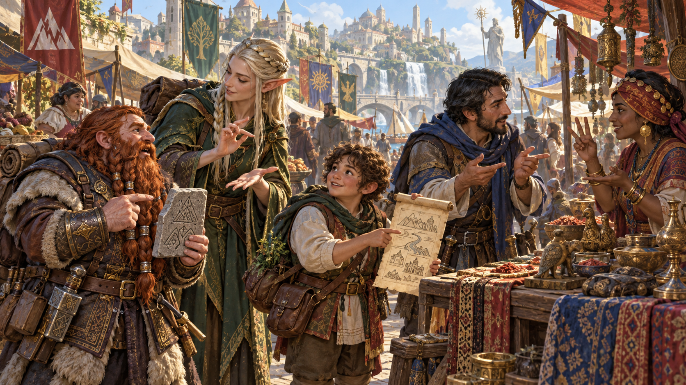

*Ngôn ngữ kết nối nhân vật với các dân tộc, nền văn hóa và bí mật của thế giới. Minh họa nguyên bản tạo bằng OpenAI ImageGen cho bản dịch này.*

Chủng tộc cho biết các ngôn ngữ nhân vật nói theo mặc định, và xuất thân có thể cho thêm một hoặc nhiều ngôn ngữ tùy chọn. Ghi các ngôn ngữ này vào phiếu nhân vật. Chọn ngôn ngữ trong bảng chuẩn hoặc một ngôn ngữ thông dụng trong chiến dịch. Với sự cho phép của DM, bạn có thể chọn bảng ngoại lai hay ngôn ngữ bí mật như tiếng lóng kẻ trộm hoặc tiếng druid.

Một số ngôn ngữ thực chất là những họ ngôn ngữ có nhiều phương ngữ. Ví dụ, Primordial gồm Auran, Aquan, Ignan và Terran, mỗi phương ngữ tương ứng với một trong bốn cõi nguyên tố. Những sinh vật nói các phương ngữ khác nhau của cùng một ngôn ngữ vẫn có thể giao tiếp với nhau.

| Ngôn ngữ chuẩn | Người nói điển hình | Chữ viết |
| --- | --- | --- |
| Tiếng Chung | Con người | Chung |
| Người lùn | Người lùn | Người lùn |
| Elf | Elf | Elf |
| Khổng lồ | Ogre, khổng lồ | Người lùn |
| Gnome | Gnome | Người lùn |
| Goblin | Goblinoid | Người lùn |
| Halfling | Halfling | Chung |
| Orc | Orc | Người lùn |

| Ngôn ngữ ngoại lai | Người nói điển hình | Chữ viết |
| --- | --- | --- |
| Abyssal | Demon | Infernal |
| Celestial | Thiên thể | Celestial |
| Deep Speech | Mind flayer, beholder | - |
| Draconic | Rồng, dragonborn | Draconic |
| Infernal | Devil | Infernal |
| Primordial | Nguyên tố | Người lùn |
| Sylvan | Fey | Elf |
| Undercommon | Thương nhân Underdark | Elf |

## Đặc điểm cá nhân (Personal Characteristics)

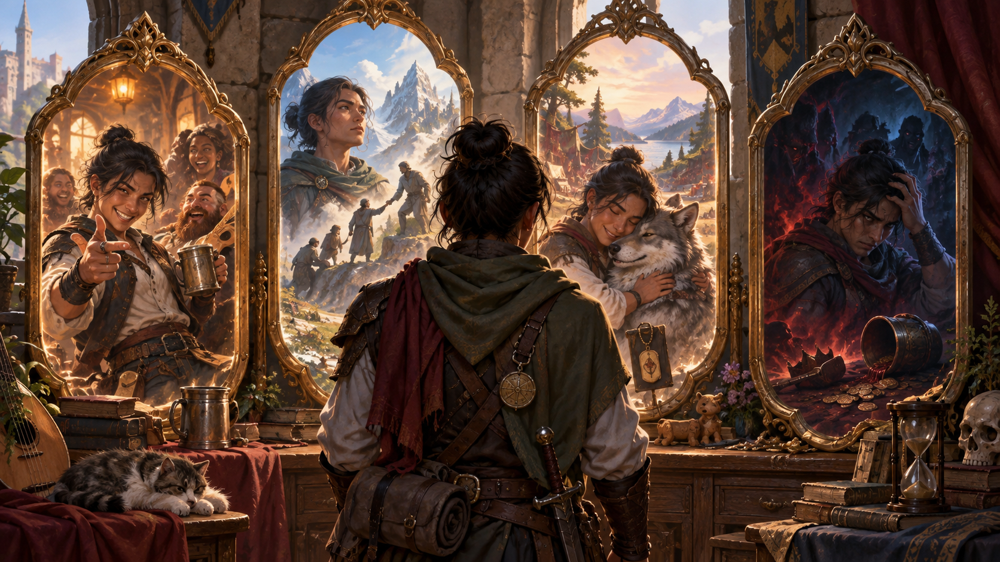

*Đặc điểm tính cách, lý tưởng, mối gắn bó và khuyết điểm định hướng cách nhân vật hành động. Minh họa nguyên bản tạo bằng OpenAI ImageGen cho bản dịch này.*

Xây dựng tính cách, gồm những nét riêng, phong thái, thói quen, niềm tin và khuyết điểm tạo bản sắc, giúp nhân vật sống động khi chơi. Có bốn nhóm: đặc điểm tính cách, lý tưởng, mối gắn bó, khuyết điểm. Ngoài chúng, hãy nghĩ về từ hay câu ưa dùng, cử chỉ quen, tật xấu, điều nhỏ khiến bực mình và bất cứ gì khác có thể tưởng tượng.

Mỗi xuất thân phía sau có đặc điểm gợi ý khơi trí tưởng tượng. Bạn không buộc theo chúng, nhưng đó là điểm khởi đầu tốt.

### Đặc điểm tính cách (Personality Traits)

Cho nhân vật hai đặc điểm tính cách. Chúng là nét nhỏ, đơn giản phân biệt bạn với nhân vật khác, nói điều thú vị, vui về nhân vật. Lời tự mô tả phải cụ thể: “Tôi thông minh” không tốt vì hợp nhiều người; “Tôi đã đọc mọi sách ở Candlekeep” nói rõ sở thích và thiên hướng.

Chúng có thể mô tả điều thích, thành tựu quá khứ, điều ghét hoặc sợ, thái độ về bản thân, phong thái hay ảnh hưởng điểm thuộc tính. Điểm khởi đầu hữu ích là nhìn thuộc tính cao nhất, thấp nhất và đặt một nét liên quan mỗi điểm. Có thể tích cực hoặc tiêu cực: cố vượt điểm thấp hoặc tự phụ về điểm cao.

### Lý tưởng (Ideals)

Mô tả một lý tưởng thúc đẩy nhân vật: điều tin mạnh nhất, nguyên tắc đạo đức nền tảng khiến bạn hành động. Nó bao gồm mục tiêu đời sống và hệ niềm tin cốt lõi.

Bạn không bao giờ phản bội nguyên tắc nào? Điều gì khiến hy sinh? Điều gì thúc đẩy hành động, dẫn mục tiêu, tham vọng? Điều quan trọng nhất bạn theo đuổi là gì?

Có thể chọn lý tưởng bất kỳ, nhưng khuynh hướng là điểm khởi đầu tốt. Mỗi xuất thân có sáu lý tưởng gợi ý; năm liên quan trọng luật, hỗn loạn, thiện, ác, trung lập, còn lý tưởng cuối liên quan xuất thân hơn đạo đức.

### Mối gắn bó (Bonds)

Tạo một mối gắn bó: quan hệ với người, nơi chốn, sự kiện trong thế giới và điều thuộc xuất thân. Chúng có thể truyền cảm hứng hành động anh hùng hoặc khiến làm trái lợi ích khi bị đe dọa; như lý tưởng, chúng dẫn động lực và mục tiêu.

Bạn quan tâm ai nhất? Có kết nối đặc biệt với nơi nào? Tài sản quý nhất là gì? Gắn bó có thể liên quan lớp, xuất thân, chủng tộc, lịch sử hoặc tính cách; có thể có thêm gắn bó mới trong phiêu lưu.

### Khuyết điểm (Flaws)

Chọn một khuyết điểm: tật xấu, sự thôi thúc, sợ hãi hoặc yếu đuối mà người khác có thể lợi dụng để hủy hoại bạn hoặc khiến hành động trái lợi ích. Nó quan trọng hơn nét tính cách tiêu cực. Điều gì làm bạn nổi giận? Người, ý niệm, sự kiện nào khiến kinh sợ? Tật xấu là gì?

### Tika và Artemis: Chi tiết nhân vật

Tên Tika Waylan và Artemis Entreri phân biệt họ, phản ánh tính cách. Tika là cô gái quyết chứng minh không còn trẻ con; tên nghe trẻ, bình thường. Artemis từ xứ lạ, tên bí ẩn hơn.

Tika bắt đầu phiêu lưu ở tuổi 19, tóc nâu đỏ, mắt xanh lá, da sáng có tàn nhang, nốt ruồi trên hông phải. Artemis nhỏ người, chắc và đầy cơ gân; nét góc cạnh, gò má cao, luôn có vẻ cần cạo râu. Tóc đen quạ dày, nhưng mắt xám vô hồn thể hiện sự trống rỗng của đời và linh hồn.

## Cảm hứng (Inspiration)

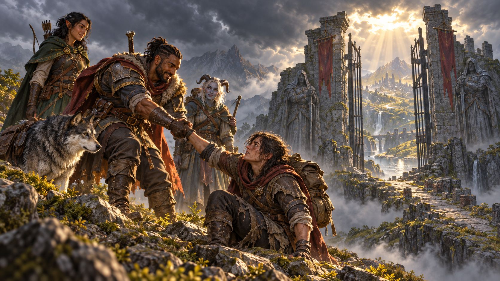

*Cảm hứng tưởng thưởng việc nhập vai nhất quán và những khoảnh khắc thể hiện rõ bản chất nhân vật. Minh họa nguyên bản tạo bằng OpenAI ImageGen cho bản dịch này.*

Cảm hứng là quy tắc DM dùng để thưởng nhập vai đúng đặc điểm, lý tưởng, gắn bó, khuyết điểm. Bạn có thể dựa lòng thương người bị áp bức để giành lợi thế thương lượng với Hoàng tử Ăn mày, hoặc dựa gắn bó bảo vệ làng để vượt hiệu ứng phép đang chịu.

### Nhận Cảm hứng

DM có thể trao vì nhiều lý do; thường khi thể hiện tính cách, chấp nhận bất lợi từ khuyết điểm hay gắn bó và thể hiện nhân vật hấp dẫn. DM sẽ cho biết cách nhận trong trò chơi. Bạn có hoặc không có Cảm hứng; không thể tích nhiều lần để dùng sau.

### Dùng Cảm hứng

Nếu có, tiêu Cảm hứng khi tung tấn công, cứu nguy, kiểm tra thuộc tính để nhận lợi thế. Bạn cũng có thể thưởng người chơi khác vì nhập vai tốt, suy nghĩ thông minh hoặc làm việc hấp dẫn. Khi nhân vật khác đóng góp thú vị cho câu chuyện, bạn từ bỏ Cảm hứng của mình để trao cho họ.

## Xuất thân (Backgrounds)

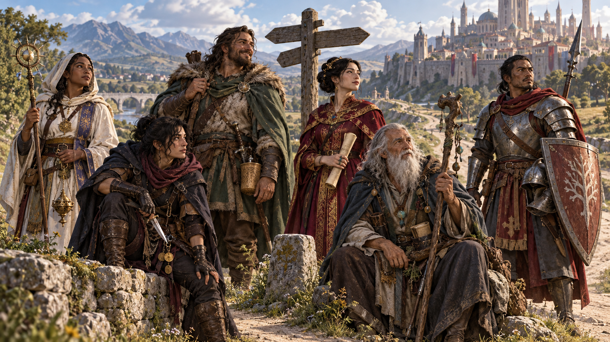

*Xuất thân cho biết nhân vật từng sống thế nào trước khi bước vào đời phiêu lưu. Minh họa nguyên bản tạo bằng OpenAI ImageGen cho bản dịch này.*

Mọi câu chuyện có mở đầu. Xuất thân cho biết bạn từ đâu, trở thành nhà phiêu lưu thế nào và vị trí trong thế giới. Chiến binh có thể từng là hiệp sĩ can đảm hoặc lính dày dạn; pháp sư từng là hiền giả hay thợ thủ công; đạo tặc từng sống bằng trộm trong công hội hoặc thu hút khán giả như người pha trò.

Xuất thân cho gợi ý quan trọng về bản sắc. Câu hỏi quan trọng nhất: **Điều gì đã thay đổi?** Vì sao ngừng đời cũ để phiêu lưu? Tiền mua trang bị từ đâu; nếu xuất thân giàu thì vì sao không có thêm tiền? Học kỹ năng lớp thế nào? Điều gì phân biệt bạn với người thường cùng xuất thân? Các mẫu cho lợi ích cụ thể, gồm đặc tính, thành thạo, ngôn ngữ, và gợi ý nhập vai.

### Sự thành thạo (Proficiencies)

Mỗi xuất thân cho nhân vật thành thạo hai kỹ năng. Kỹ năng được mô tả ở Chương 7. Ngoài ra, phần lớn xuất thân cho thành thạo một hoặc nhiều công cụ; công cụ và sự thành thạo công cụ được trình bày chi tiết ở Chương 5. Nếu nhân vật nhận cùng một sự thành thạo từ hai nguồn khác nhau, có thể chọn một sự thành thạo khác cùng loại (kỹ năng hoặc công cụ) để thay thế.

### Ngôn ngữ của xuất thân (Languages)

Một số xuất thân cho nhân vật học thêm ngôn ngữ ngoài những ngôn ngữ do chủng tộc cung cấp. Xem mục Ngôn ngữ ở phần trước chương này.

### Trang bị của xuất thân (Equipment)

Mỗi xuất thân cho một gói trang bị khởi đầu. Nếu dùng quy tắc tùy chọn ở Chương 5 để tiêu tiền mua đồ, bạn không nhận trang bị khởi đầu từ xuất thân.

### Đặc điểm gợi ý của xuất thân (Suggested Characteristics)

Xuất thân có những đặc điểm cá nhân gợi ý dựa trên xuất thân ấy. Bạn có thể chọn, tung xúc xắc để xác định ngẫu nhiên, hoặc dùng chúng làm cảm hứng để tự tạo đặc điểm của mình.

### Tùy chỉnh xuất thân

Bạn có thể chỉnh xuất thân cho hợp nhân vật hoặc bối cảnh. Thay một đặc tính bằng đặc tính khác, chọn bất kỳ hai kỹ năng và tổng hai thành thạo công cụ/ngôn ngữ từ mẫu. Có thể dùng gói trang bị hoặc mua theo chương 5; nếu mua, không đồng thời nhận gói của lớp. Cuối cùng chọn hai nét tính cách, một lý tưởng, gắn bó, khuyết điểm. Nếu không có đặc tính phù hợp, cùng DM tạo.

### Tika và Artemis: Đặc điểm cá nhân

Tika không thích khoác lác và sợ độ cao do từng ngã khi làm kẻ trộm. Artemis luôn chuẩn bị điều tệ nhất, di chuyển với sự tự tin nhanh, chính xác.

Tika ngây thơ, gần như trẻ con, tin giá trị sự sống và việc trân trọng mọi người. Thiện trung lập, cô giữ lý tưởng sự sống, tôn trọng. Artemis không để cảm xúc làm chủ, không ngừng thử thách mình cải thiện. Ác trọng luật cho anh lý tưởng vô tư và khát quyền lực.

Tika gắn bó Inn of the Last Home: chủ quán cho cơ hội sống mới, tình bạn với đồng đội được hình thành khi làm ở đó. Quân đoàn rồng phá quán cho lý do cá nhân để căm ghét cháy bỏng: “Tôi sẽ làm mọi thứ để trừng phạt quân đoàn rồng vì phá Inn of the Last Home.”

Artemis gắn bó kỳ lạ, gần nghịch lý với Drizzt Do’Urden, người ngang tài kiếm và quyết tâm. Trong trận đầu, anh nhận thấy nét bản thân ở đối thủ, như thể đời khác có thể khiến mình giống drow anh hùng ấy. Từ đó anh hơn một sát thủ tội phạm: một phản anh hùng được thúc đẩy bởi cạnh tranh. “Tôi không nghỉ đến khi chứng minh giỏi hơn Drizzt Do’Urden.”

Tika có khuyết điểm ngây thơ, dễ tổn thương cảm xúc, trẻ hơn đồng đội và bực họ vẫn coi là đứa trẻ cũ. Cô có thể bị cám dỗ làm trái nguyên tắc nếu tin thành tựu chứng minh trưởng thành. Artemis hoàn toàn đóng kín trước quan hệ cá nhân, chỉ muốn được để yên.

### Tika và Artemis: Xuất thân

Cả hai từng là trẻ đường phố. Nghề phục vụ quán sau này không thực sự đổi Tika, nên cô có thể chọn xuất thân trẻ đường phố (urchin), thành thạo Khéo tay, Lén lút và dụng cụ trộm. Artemis được định hình bởi xuất thân tội phạm, cho Lừa dối, Lén lút, cùng thành thạo dụng cụ trộm và độc.

### Trợ tế (Acolyte)

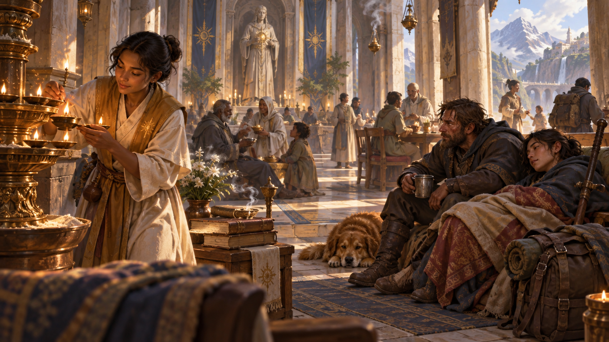

*Trợ tế phục vụ một tín ngưỡng và có thể tìm nơi nương náu giữa cộng đồng tín đồ. Minh họa nguyên bản tạo bằng OpenAI ImageGen cho bản dịch này.*

Bạn đã dành cả đời phụng sự một ngôi đền thờ một vị thần cụ thể hoặc một điện thần. Bạn làm trung gian giữa cõi thiêng và thế giới phàm tục, thực hiện các nghi thức thiêng liêng và dâng lễ hiến tế để dẫn tín đồ đến trước sự hiện diện của thần linh. Bạn không nhất thiết là giáo sĩ: thực hiện nghi thức thiêng liêng không đồng nghĩa với việc dẫn truyền quyền năng thần thánh.

Chọn một vị thần, một điện thần hoặc một thực thể gần với thần linh khác, rồi cùng DM xác định chi tiết công việc phụng sự tôn giáo của bạn. Phụ lục B có một điện thần mẫu từ bối cảnh Forgotten Realms. Bạn từng là người phục vụ cấp thấp trong đền, được nuôi dạy từ nhỏ để giúp các tư tế thực hiện nghi thức thiêng liêng? Hay bạn là một đại tư tế đột nhiên nhận được lời kêu gọi phụng sự vị thần của mình theo cách khác? Có lẽ bạn từng lãnh đạo một giáo phái nhỏ nằm ngoài hệ thống đền thờ chính thức, hoặc thậm chí một hội huyền bí phụng sự một chủ nhân quỷ dữ mà giờ đây bạn chối bỏ.

- **Kỹ năng:** Thấu hiểu, Tôn giáo. **Ngôn ngữ:** hai tùy chọn.
- **Trang bị:** thánh vật được tặng khi vào chức, sách cầu nguyện hoặc luân kinh (prayer wheel), 5 que hương, lễ phục, quần áo thường, túi 15 gp.

#### Đặc tính: Nơi nương náu của tín đồ (Shelter of the Faithful)

Là trợ tế, bạn được những người cùng đức tin kính trọng và có thể thực hiện các nghi lễ tôn giáo của vị thần mình phụng sự. Bạn và những người bạn đồng hành phiêu lưu có thể trông đợi được chữa trị và chăm sóc miễn phí tại đền, điện thờ hoặc nơi hiện diện chính thức khác của đức tin ấy; tuy nhiên, bạn phải cung cấp mọi thành phần vật chất cần thiết cho các phép. Những người cùng tôn giáo sẽ hỗ trợ bạn, nhưng chỉ riêng bạn, duy trì mức sống khiêm tốn.

Bạn cũng có thể gắn bó với một ngôi đền cụ thể thờ vị thần hoặc điện thần đã chọn và có chỗ cư trú tại đó. Đó có thể là ngôi đền bạn từng phụng sự, nếu vẫn giữ quan hệ tốt, hoặc một ngôi đền đã trở thành mái nhà mới. Khi ở gần đền của mình, bạn có thể nhờ các tư tế giúp đỡ, miễn là sự giúp đỡ bạn yêu cầu không nguy hiểm và bạn vẫn được đền tín nhiệm.

#### Đặc điểm gợi ý (Suggested Characteristics)

Trải nghiệm tại đền thờ hoặc những cộng đồng tôn giáo khác định hình các trợ tế. Việc nghiên cứu lịch sử và giáo lý của đức tin, cùng quan hệ với các đền, điện thờ hoặc hệ thống chức sắc, ảnh hưởng đến phong thái và lý tưởng của họ. Khuyết điểm của họ có thể là sự đạo đức giả bị che giấu, một ý tưởng dị giáo, hoặc một lý tưởng hay mối gắn bó bị đẩy đến cực đoan.

| d8 | Đặc điểm tính cách |
| --- | --- |
| 1 | Tôi sùng bái một anh hùng cụ thể của đức tin và luôn nhắc công tích, tấm gương của người ấy. |
| 2 | Tôi tìm được điểm chung giữa những kẻ thù dữ dội nhất, đồng cảm với họ và luôn hướng tới hòa bình. |
| 3 | Tôi thấy điềm báo trong mọi sự kiện và hành động. Các vị thần cố nói với chúng ta, chỉ cần lắng nghe. |
| 4 | Không gì lay chuyển được thái độ lạc quan của tôi. |
| 5 | Gần như mọi tình huống, tôi đều trích, hoặc trích sai, kinh sách và châm ngôn thiêng. |
| 6 | Tôi khoan dung, hoặc không khoan dung, với đức tin khác; tôn trọng, hoặc lên án, việc thờ thần khác. |
| 7 | Tôi từng thưởng thức thức ăn, đồ uống ngon và xã hội thượng lưu giữa giới tinh hoa đền thờ. Đời sống khắc khổ làm tôi khó chịu. |
| 8 | Tôi ở đền quá lâu nên ít kinh nghiệm thực tế đối phó người ngoài thế giới. |

| d6 | Lý tưởng |
| --- | --- |
| 1 | **Truyền thống.** Truyền thống thờ phụng và hiến tế cổ xưa phải được gìn giữ. (Trọng luật) |
| 2 | **Bác ái.** Tôi luôn giúp người cần giúp, dù phải trả giá cá nhân nào. (Thiện) |
| 3 | **Thay đổi.** Chúng ta phải góp phần tạo những thay đổi thần linh không ngừng thực hiện trong thế giới. (Hỗn loạn) |
| 4 | **Quyền lực.** Tôi hy vọng một ngày vươn lên đỉnh cao hệ thống tôn giáo. (Trọng luật) |
| 5 | **Đức tin.** Tôi tin thần dẫn dắt hành động; nếu chăm chỉ, mọi việc sẽ tốt. (Trọng luật) |
| 6 | **Khát vọng.** Tôi tìm cách chứng tỏ xứng đáng được thần ưu ái bằng hành động theo lời dạy. (Bất kỳ) |

| d6 | Mối gắn bó |
| --- | --- |
| 1 | Tôi sẽ chết để lấy lại thánh tích cổ của đức tin đã mất từ lâu. |
| 2 | Một ngày tôi sẽ báo thù hệ thống đền thờ thối nát đã gán tôi là dị giáo. |
| 3 | Tôi nợ mạng linh mục nhận nuôi khi cha mẹ tôi qua đời. |
| 4 | Mọi điều tôi làm đều vì dân thường. |
| 5 | Tôi sẽ làm bất cứ điều gì để bảo vệ ngôi đền mình từng phục vụ. |
| 6 | Tôi tìm cách bảo tồn kinh sách thiêng mà kẻ thù coi là dị giáo và muốn hủy. |

| d6 | Khuyết điểm |
| --- | --- |
| 1 | Tôi phán xét người khác khắc nghiệt, và bản thân còn khắc nghiệt hơn. |
| 2 | Tôi đặt quá nhiều lòng tin vào kẻ nắm quyền trong hệ thống đền thờ. |
| 3 | Lòng mộ đạo đôi khi khiến tôi mù quáng tin người tuyên xưng đức tin vào thần tôi. |
| 4 | Tôi cứng nhắc trong suy nghĩ. |
| 5 | Tôi nghi ngờ người lạ và mong đợi điều tệ nhất từ họ. |
| 6 | Một khi chọn mục tiêu, tôi ám ảnh nó đến hại mọi thứ khác trong đời. |

### Tội phạm (Criminal)

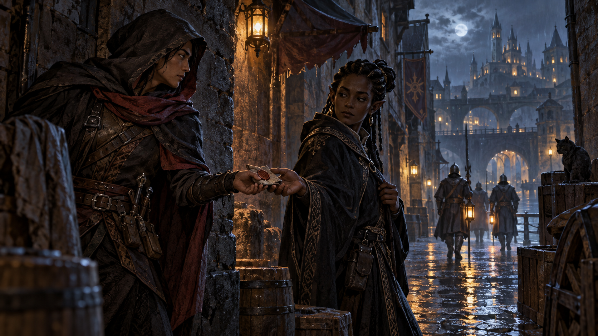

*Tội phạm hiểu mạng lưới bí mật và biết cách liên hệ với thế giới ngầm. Minh họa nguyên bản tạo bằng OpenAI ImageGen cho bản dịch này.*

Bạn là một tội phạm giàu kinh nghiệm, với quá khứ vi phạm pháp luật. Bạn đã sống lâu trong giới tội phạm và vẫn có những mối liên hệ trong thế giới ngầm. Bạn gần gũi hơn phần lớn mọi người với thế giới giết chóc, trộm cắp và bạo lực tràn ngập mặt tối của nền văn minh; bạn sống sót đến lúc này bằng cách bất chấp các quy tắc và luật lệ của xã hội.

- **Kỹ năng:** Lừa dối, Lén lút. **Công cụ:** một bộ trò chơi, dụng cụ kẻ trộm.
- **Trang bị:** xà beng, quần áo thường tối màu có mũ trùm, túi 15 gp.

#### Chuyên môn tội phạm (Criminal Specialty)

Có nhiều loại tội phạm; trong một hội trộm hoặc tổ chức tội phạm tương tự, mỗi thành viên có một chuyên môn riêng. Ngay cả những kẻ hoạt động ngoài các tổ chức ấy cũng có sở thích rõ rệt đối với một số loại tội ác hơn những loại khác. Chọn vai trò bạn từng đảm nhiệm trong đời sống tội phạm, hoặc tung xúc xắc theo bảng dưới đây.

| d8 | Chuyên môn |
| --- | --- |
| 1 | Tống tiền |
| 2 | Trộm đột nhập |
| 3 | Tay sai cưỡng ép |
| 4 | Tiêu thụ đồ trộm |
| 5 | Cướp đường |
| 6 | Sát thủ thuê |
| 7 | Móc túi |
| 8 | Buôn lậu |

#### Đặc tính: Liên hệ tội phạm (Criminal Contact)

Bạn có một đầu mối đáng tin cậy, làm cầu nối giữa bạn và mạng lưới những tội phạm khác. Bạn biết cách gửi và nhận thông điệp qua đầu mối ấy ngay cả ở khoảng cách rất xa; cụ thể, bạn biết những người đưa tin địa phương, những chủ đoàn lữ hành tham nhũng và những thủy thủ mờ ám có thể chuyển thông điệp cho mình.

**Biến thể tội phạm: Gián điệp (Spy).** Tuy năng lực của bạn không khác nhiều so với một kẻ trộm đột nhập hoặc buôn lậu, bạn học và thực hành chúng trong một hoàn cảnh rất khác: làm đặc vụ tình báo. Bạn có thể từng là đặc vụ được hoàng gia chính thức phê chuẩn, hoặc bán những bí mật mình khám phá cho người trả giá cao nhất.

#### Đặc điểm gợi ý (Suggested Characteristics)

Nhìn bề ngoài, tội phạm có thể giống những kẻ phản diện; nhiều người thực sự độc ác đến tận cốt lõi. Nhưng một số có nhiều nét đáng mến, dù chưa đủ để chuộc lỗi. Giữa những kẻ trộm có thể tồn tại danh dự, nhưng tội phạm hiếm khi kính trọng luật pháp hoặc nhà chức trách.

| d8 | Đặc điểm tính cách |
| --- | --- |
| 1 | Tôi luôn có kế hoạch cho lúc mọi việc trục trặc. |
| 2 | Tôi luôn bình tĩnh, không bao giờ lớn tiếng hay để cảm xúc chi phối. |
| 3 | Việc đầu tiên tại nơi mới là ghi vị trí mọi vật quý, hoặc nơi chúng có thể bị giấu. |
| 4 | Tôi thà có bạn mới hơn kẻ thù mới. |
| 5 | Tôi cực kỳ chậm tin người. Người có vẻ tốt đẹp nhất thường giấu nhiều nhất. |
| 6 | Tôi không để ý rủi ro. Đừng bao giờ nói tôi xác suất. |
| 7 | Cách tốt nhất khiến tôi làm gì là bảo tôi không thể làm. |
| 8 | Tôi bùng nổ vì xúc phạm nhỏ nhất. |

| d6 | Lý tưởng |
| --- | --- |
| 1 | **Danh dự.** Tôi không trộm của người cùng nghề. (Trọng luật) |
| 2 | **Tự do.** Xiềng xích phải bị phá, cả kẻ rèn chúng. (Hỗn loạn) |
| 3 | **Bác ái.** Tôi trộm của giàu để giúp người cần. (Thiện) |
| 4 | **Tham lam.** Tôi sẽ làm mọi thứ để giàu. (Ác) |
| 5 | **Con người.** Tôi trung thành với bạn bè mình, không với bất kỳ lý tưởng nào; còn những người khác có xuống dòng sông Styx thì tôi cũng mặc kệ. (Trung lập) |
| 6 | **Chuộc lỗi.** Ai cũng có tia thiện. (Thiện) |

| d6 | Mối gắn bó |
| --- | --- |
| 1 | Tôi đang trả món nợ cũ với ân nhân rộng lượng. |
| 2 | Tiền phi pháp của tôi dùng nuôi gia đình. |
| 3 | Có thứ quan trọng bị lấy khỏi tôi, và tôi sẽ trộm lại. |
| 4 | Tôi sẽ là kẻ trộm vĩ đại nhất từng sống. |
| 5 | Tôi phạm tội khủng khiếp và hy vọng chuộc lại. |
| 6 | Người tôi yêu chết vì lỗi của tôi. Chuyện ấy sẽ không lặp lại. |

| d6 | Khuyết điểm |
| --- | --- |
| 1 | Thấy vật quý, tôi chỉ nghĩ cách trộm. |
| 2 | Phải chọn tiền hoặc bạn, tôi thường chọn tiền. |
| 3 | Có kế hoạch thì tôi quên; không quên thì tôi phớt lờ. |
| 4 | Tôi có dấu hiệu tố cáo khi nói dối. |
| 5 | Tôi quay đầu chạy khi tình thế xấu. |
| 6 | Người vô tội đang tù vì tội tôi phạm. Tôi thấy ổn. |

### Anh hùng dân gian (Folk Hero)

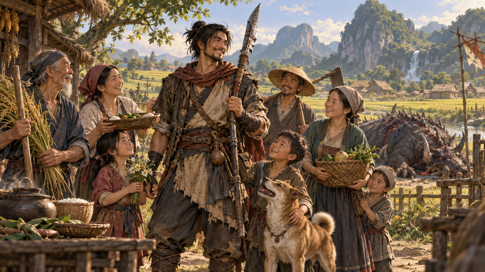

*Anh hùng dân gian xuất thân bình dị nhưng được người thường tin tưởng và che chở. Minh họa nguyên bản tạo bằng OpenAI ImageGen cho bản dịch này.*

Bạn xuất thân từ một tầng lớp xã hội khiêm tốn, nhưng được định sẵn cho những điều lớn lao hơn nhiều. Người dân quê nhà đã xem bạn là người bảo vệ của họ; số phận kêu gọi bạn đứng lên chống những bạo chúa và quái vật đe dọa dân thường ở khắp nơi.

- **Kỹ năng:** Xử lý động vật, Sinh tồn. **Công cụ:** một bộ công cụ thủ công, phương tiện đường bộ.
- **Trang bị:** bộ công cụ thủ công tùy chọn, xẻng, nồi sắt, quần áo thường, túi 10 gp.

#### Sự kiện định mệnh (Defining Event)

Trước đây, bạn theo đuổi một nghề đơn giản trong giới nông dân, có lẽ là nông dân, thợ mỏ, người hầu, người chăn cừu, tiều phu hoặc người đào huyệt. Nhưng một sự kiện đã đưa bạn sang con đường khác và đánh dấu bạn là người dành cho những điều lớn lao. Chọn hoặc xác định ngẫu nhiên một sự kiện đã khiến bạn trở thành anh hùng của dân chúng.

| d10 | Sự kiện định mệnh |
| --- | --- |
| 1 | Tôi đứng lên chống các tay sai của một bạo chúa. |
| 2 | Tôi cứu người trong một thiên tai. |
| 3 | Tôi một mình chống lại một quái vật khủng khiếp. |
| 4 | Tôi trộm của một thương nhân tham nhũng để giúp người nghèo. |
| 5 | Tôi lãnh đạo dân binh đánh đuổi một đạo quân xâm lược. |
| 6 | Tôi đột nhập lâu đài của một bạo chúa, trộm vũ khí để trang bị cho dân chúng. |
| 7 | Tôi huấn luyện nông dân dùng nông cụ làm vũ khí chống binh lính của một bạo chúa. |
| 8 | Một lãnh chúa bãi bỏ sắc lệnh bị dân chúng phản đối sau khi tôi dẫn đầu một hành động phản kháng mang tính biểu tượng. |
| 9 | Một sinh vật thiên giới, tiên giới (fey) hoặc tương tự ban phước cho tôi, hoặc tiết lộ nguồn gốc bí mật của tôi. |
| 10 | Được tuyển vào quân đội của một lãnh chúa, tôi vươn lên vị trí chỉ huy và được khen thưởng vì lòng anh hùng. |

#### Đặc tính: Lòng hiếu khách thôn quê (Rustic Hospitality)

Vì xuất thân từ dân thường, bạn dễ dàng hòa nhập với họ. Bạn có thể tìm nơi ẩn náu, nghỉ ngơi hoặc hồi phục giữa những người dân thường khác, trừ khi từng cho thấy mình là mối nguy đối với họ. Họ sẽ che chở bạn khỏi pháp luật hoặc bất kỳ ai đang tìm kiếm bạn, nhưng sẽ không liều mạng vì bạn.

#### Đặc điểm gợi ý (Suggested Characteristics)

Anh hùng dân gian là một người dân thường, với cả những mặt tốt lẫn mặt xấu của điều đó. Phần lớn xem nguồn gốc khiêm tốn của mình là một phẩm chất tốt, không phải thiếu sót; cộng đồng quê nhà vẫn rất quan trọng đối với họ.

| d8 | Đặc điểm tính cách |
| --- | --- |
| 1 | Tôi đánh giá người qua hành động, không phải lời nói. |
| 2 | Ai gặp rắc rối, tôi luôn sẵn lòng giúp. |
| 3 | Đã quyết điều gì, tôi theo đến cùng bất kể vật cản. |
| 4 | Tôi có ý thức công bằng mạnh và luôn tìm giải pháp công bằng nhất cho tranh cãi. |
| 5 | Tôi tin năng lực bản thân và cố truyền tự tin cho người khác. |
| 6 | Suy nghĩ dành cho người khác. Tôi thích hành động. |
| 7 | Tôi dùng sai từ dài để tỏ ra thông minh. |
| 8 | Tôi dễ chán. Bao giờ mới tiếp tục số phận đây? |

| d6 | Lý tưởng |
| --- | --- |
| 1 | **Tôn trọng.** Mọi người đáng được đối xử phẩm giá, tôn trọng. (Thiện) |
| 2 | **Công bằng.** Không ai được ưu ái trước luật và không ai trên luật. (Trọng luật) |
| 3 | **Tự do.** Không được để bạo chúa áp bức dân. (Hỗn loạn) |
| 4 | **Sức mạnh.** Nếu mạnh, tôi có thể lấy điều muốn, điều đáng được có. (Ác) |
| 5 | **Thành thật.** Giả vờ không phải bản thân không có gì tốt. (Trung lập) |
| 6 | **Số phận.** Không gì, không ai lái tôi khỏi thiên chức cao hơn. (Bất kỳ) |

| d6 | Mối gắn bó |
| --- | --- |
| 1 | Tôi có gia đình nhưng không biết họ ở đâu; một ngày hy vọng gặp lại. |
| 2 | Tôi làm đất, yêu đất và bảo vệ đất. |
| 3 | Quý tộc kiêu ngạo từng đánh tôi tàn nhẫn; tôi sẽ báo thù mọi kẻ bắt nạt. |
| 4 | Công cụ là biểu tượng đời cũ, tôi mang để không quên gốc rễ. |
| 5 | Tôi bảo vệ người không thể tự bảo vệ. |
| 6 | Tôi ước người yêu thuở nhỏ đi cùng theo đuổi số phận. |

| d6 | Khuyết điểm |
| --- | --- |
| 1 | Bạo chúa cai trị quê tôi sẽ làm mọi thứ để giết tôi. |
| 2 | Tôi tin quá mức ý nghĩa số phận, mù quáng trước thiếu sót và nguy cơ thất bại. |
| 3 | Người biết tôi lúc trẻ biết bí mật nhục nhã, nên tôi không thể về nhà. |
| 4 | Tôi yếu trước tệ nạn thành thị, đặc biệt rượu mạnh. |
| 5 | Bí mật, tôi tin mọi thứ tốt hơn nếu tôi là bạo chúa cai trị đất. |
| 6 | Tôi khó tin đồng minh. |

### Quý tộc (Noble)

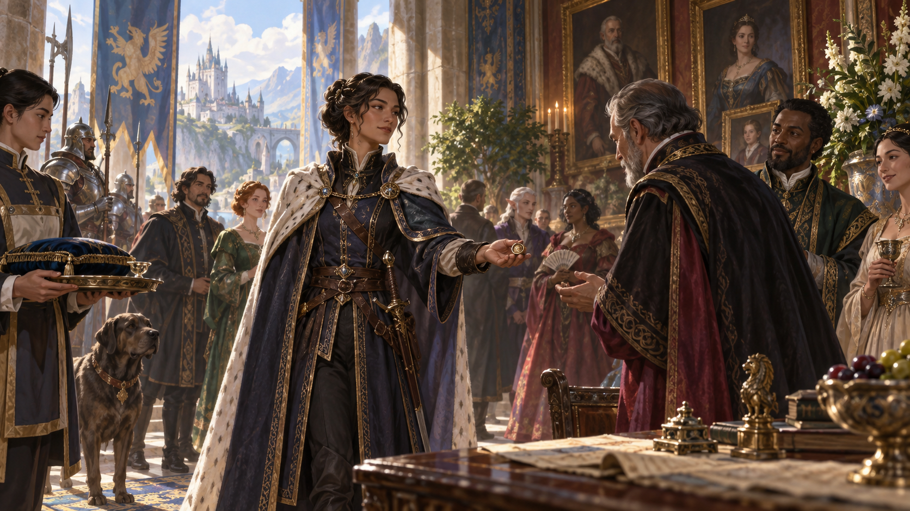

*Quý tộc mang địa vị, đặc quyền và trách nhiệm của một gia đình có thế lực. Minh họa nguyên bản tạo bằng OpenAI ImageGen cho bản dịch này.*

Bạn hiểu sự giàu có, quyền lực và đặc quyền. Bạn mang tước hiệu quý tộc; gia đình bạn sở hữu đất đai, thu thuế và có ảnh hưởng chính trị đáng kể. Bạn có thể là một quý tộc được nuông chiều, không biết đến lao động hoặc sự thiếu tiện nghi; một cựu thương nhân vừa được phong tước; hoặc một kẻ vô lại bị tước quyền thừa kế nhưng vẫn cho rằng mình xứng đáng hưởng vô số đặc quyền. Hoặc bạn là một chủ đất chân chính, chăm chỉ, hết lòng quan tâm đến những người sống và làm việc trên đất của mình, nhận thức sâu sắc trách nhiệm đối với họ.

Cùng DM chọn một tước hiệu phù hợp và xác định quyền lực mà tước hiệu ấy mang lại. Một tước hiệu quý tộc không tồn tại riêng lẻ: nó gắn với cả một gia đình; dù mang tước hiệu nào, bạn cũng sẽ truyền nó cho con mình. Ngoài tước hiệu, bạn nên cùng DM mô tả gia đình và ảnh hưởng của họ đối với bạn.

Gia đình bạn lâu đời và có nền tảng vững chắc, hay tước hiệu mới được ban gần đây? Họ có bao nhiêu ảnh hưởng, và trên vùng nào? Các quý tộc khác trong vùng đánh giá gia đình bạn ra sao? Dân thường nhìn nhận họ thế nào?

Bạn ở vị trí nào trong gia đình? Bạn là người kế vị người đứng đầu gia đình? Bạn đã thừa kế tước hiệu chưa? Bạn cảm thấy thế nào về trách nhiệm ấy? Hay vị trí của bạn trong thứ tự thừa kế thấp đến mức chẳng ai quan tâm bạn làm gì, miễn đừng làm gia đình mất mặt? Người đứng đầu gia đình nghĩ gì về sự nghiệp phiêu lưu của bạn? Bạn vẫn được gia đình quý trọng, hay bị những người còn lại xa lánh?

Gia đình bạn có huy hiệu không? Có biểu tượng mà bạn có thể đeo trên nhẫn ấn? Có những màu sắc riêng mà bạn luôn mặc? Có con vật được xem là biểu tượng của dòng họ, hoặc thậm chí là một thành viên tinh thần của gia đình?

Những chi tiết ấy giúp đặt gia đình và tước hiệu của bạn vào thế giới của chiến dịch.

- **Kỹ năng:** Lịch sử, Thuyết phục. **Công cụ:** một bộ trò chơi. **Ngôn ngữ:** một tùy chọn.
- **Trang bị:** quần áo tốt, nhẫn ấn, cuộn gia phả, túi 25 gp.
- **Địa vị đặc quyền (Position of Privilege):** người có xu hướng nghĩ tốt về bạn; được chào đón trong xã hội thượng lưu và mặc định có quyền hiện diện. Dân thường cố đáp ứng, tránh làm phật ý; quý tộc khác coi bạn cùng tầng lớp. Có thể xin gặp quý tộc địa phương.

#### Đặc điểm gợi ý (Suggested Characteristics)

Quý tộc được sinh ra và nuôi dạy trong một lối sống rất khác với trải nghiệm của phần lớn mọi người; tính cách của họ phản ánh sự giáo dưỡng ấy. Tước hiệu quý tộc đi kèm vô số mối gắn bó: trách nhiệm đối với gia đình, các quý tộc khác (kể cả quân chủ), những người được giao cho gia đình chăm lo, hoặc chính tước hiệu. Nhưng trách nhiệm ấy thường cũng là một cách hữu hiệu để làm suy yếu một quý tộc.

| d8 | Đặc điểm tính cách |
| --- | --- |
| 1 | Lời nịnh hùng biện khiến mọi người tôi nói chuyện thấy mình tuyệt vời, quan trọng nhất đời. |
| 2 | Dân thường yêu tôi vì tử tế, rộng lượng. |
| 3 | Phong thái vương giả đủ chứng minh tôi hơn đám dân thường. |
| 4 | Tôi luôn cố trông đẹp nhất và theo mốt mới. |
| 5 | Tôi ghét bẩn tay và không chịu ở chỗ không phù hợp. |
| 6 | Dù sinh quý tộc, tôi không đặt mình trên người khác. Máu mọi người như nhau. |
| 7 | Ơn huệ của tôi, một khi mất, mất mãi. |
| 8 | Nếu làm tôi tổn thương, tôi sẽ nghiền nát bạn, hủy danh và rắc muối ruộng bạn. |

| d6 | Lý tưởng |
| --- | --- |
| 1 | **Tôn trọng.** Địa vị khiến tôi đáng trọng, nhưng mọi người đều đáng được đối xử phẩm giá. (Thiện) |
| 2 | **Trách nhiệm.** Tôi phải tôn trọng cấp trên như cấp dưới phải tôn trọng tôi. (Trọng luật) |
| 3 | **Độc lập.** Tôi phải chứng minh tự lo được, không cần gia đình nuông chiều. (Hỗn loạn) |
| 4 | **Quyền lực.** Có thêm quyền lực, không ai sai bảo tôi. (Ác) |
| 5 | **Gia đình.** Máu đặc hơn nước. (Bất kỳ) |
| 6 | **Nghĩa vụ quý tộc.** Tôi phải bảo vệ, chăm sóc người dưới mình. (Thiện) |

| d6 | Mối gắn bó |
| --- | --- |
| 1 | Tôi đối mặt mọi thử thách để được gia đình chấp thuận. |
| 2 | Liên minh nhà tôi với nhà quý tộc khác phải duy trì bằng mọi giá. |
| 3 | Không gì quan trọng hơn thành viên gia đình. |
| 4 | Tôi yêu người thừa kế gia đình mà nhà tôi ghét. |
| 5 | Trung thành với quân chủ không lay chuyển. |
| 6 | Dân thường phải coi tôi là anh hùng. |

| d6 | Khuyết điểm |
| --- | --- |
| 1 | Tôi bí mật tin mọi người đều dưới cơ mình. |
| 2 | Tôi giấu bí mật tai tiếng có thể hủy gia đình mãi mãi. |
| 3 | Tôi thường nghe lời xúc phạm, đe dọa ngầm trong mọi lời nói với mình và mau nóng giận. |
| 4 | Tôi ham muốn khoái lạc xác thịt vô độ. |
| 5 | Thực tế, thế giới xoay quanh tôi. |
| 6 | Lời nói, việc làm của tôi thường làm gia đình hổ thẹn. |

### Hiền giả (Sage)

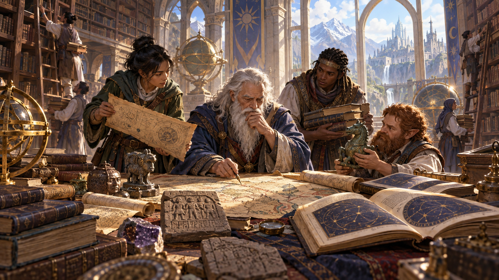

*Hiền giả biết cách tìm kiếm tri thức và lần theo manh mối đến những nguồn thông tin quý giá. Minh họa nguyên bản tạo bằng OpenAI ImageGen cho bản dịch này.*

Bạn đã dành nhiều năm học tri thức của đa vũ trụ. Bạn lục tìm các bản thảo, nghiên cứu cuộn giấy và lắng nghe những chuyên gia giỏi nhất về các chủ đề mình quan tâm. Nỗ lực ấy đã khiến bạn trở thành bậc thầy trong lĩnh vực nghiên cứu của mình.

- **Kỹ năng:** Huyền thuật, Lịch sử. **Ngôn ngữ:** hai tùy chọn.
- **Trang bị:** lọ mực đen, bút lông, dao nhỏ, thư người đồng nghiệp đã chết nêu câu hỏi chưa giải được, quần áo thường, túi 10 gp.
- **Chuyên ngành:** Để xác định tính chất quá trình đào tạo học thuật của bạn, tung d8 hoặc chọn một mục trong bảng sau.

| d8 | Chuyên ngành |
| --- | --- |
| 1 | Giả kim sư |
| 2 | Nhà thiên văn |
| 3 | Học giả bị mất uy tín |
| 4 | Thủ thư |
| 5 | Giáo sư |
| 6 | Nhà nghiên cứu |
| 7 | Học trò pháp sư |
| 8 | Người chép sách |

#### Đặc tính: Nhà nghiên cứu (Researcher)

Khi cố tìm hiểu hoặc nhớ lại một mẩu tri thức mà bản thân không biết, bạn thường biết có thể tìm thông tin ấy ở đâu và từ ai. Thông thường, thông tin đến từ thư viện, phòng chép sách, đại học, một hiền giả hoặc một người hay sinh vật có học thức khác. DM có thể quyết định rằng tri thức bạn tìm bị giấu ở một nơi gần như không thể tiếp cận, hoặc đơn giản là không thể tìm thấy. Khám phá những bí mật sâu kín nhất của đa vũ trụ có thể đòi hỏi một cuộc phiêu lưu, thậm chí cả một chiến dịch.

**Đặc điểm gợi ý:** Hiền giả được định hình bởi quá trình nghiên cứu sâu rộng; các đặc điểm phản ánh đời sống học tập ấy. Tận tâm với việc học thuật, họ coi trọng tri thức, đôi khi vì chính tri thức, đôi khi vì nó là phương tiện hướng tới lý tưởng khác.

| d8 | Đặc điểm tính cách |
| --- | --- |
| 1 | Tôi dùng những từ nhiều âm tiết để tạo ấn tượng rất uyên bác. |
| 2 | Tôi đã đọc mọi cuốn sách trong những thư viện lớn nhất thế giới, hoặc tôi thích khoe rằng mình đã làm vậy. |
| 3 | Tôi quen giúp những người không thông minh bằng mình và kiên nhẫn giải thích mọi điều cho người khác. |
| 4 | Không gì khiến tôi thích hơn một bí ẩn thú vị. |
| 5 | Tôi sẵn lòng nghe mọi phía trong một cuộc tranh luận trước khi đưa ra phán đoán riêng. |
| 6 | Tôi... nói... chậm... khi nói chuyện... với người ngốc,... tức là... gần như... mọi người... so với... tôi. |
| 7 | Tôi cực kỳ, cực kỳ vụng về trong những tình huống xã giao. |
| 8 | Tôi tin chắc mọi người luôn cố đánh cắp bí mật của mình. |

| d6 | Lý tưởng |
| --- | --- |
| 1 | **Tri thức.** Con đường tới quyền lực và tự hoàn thiện là thông qua tri thức. (Trung lập) |
| 2 | **Cái đẹp.** Những gì đẹp hướng chúng ta vượt khỏi chính nó tới những gì chân thật. (Thiện) |
| 3 | **Logic.** Cảm xúc không được làm lu mờ tư duy logic của chúng ta. (Trọng luật) |
| 4 | **Không giới hạn.** Không gì nên trói buộc khả năng vô hạn vốn có trong mọi sự tồn tại. (Hỗn loạn) |
| 5 | **Quyền lực.** Tri thức là con đường tới quyền lực và sự thống trị. (Ác) |
| 6 | **Tự hoàn thiện.** Mục tiêu của một đời học tập là cải thiện bản thân. (Bất kỳ) |

| d6 | Mối gắn bó |
| --- | --- |
| 1 | Tôi có nghĩa vụ bảo vệ học trò của mình. |
| 2 | Tôi có một văn bản cổ chứa những bí mật khủng khiếp, không được rơi vào tay kẻ xấu. |
| 3 | Tôi làm việc để bảo tồn một thư viện, đại học, phòng chép sách hoặc tu viện. |
| 4 | Công trình cả đời tôi là một bộ sách về một lĩnh vực tri thức cụ thể. |
| 5 | Tôi đã dành cả đời tìm câu trả lời cho một câu hỏi nhất định. |
| 6 | Tôi đã bán linh hồn để lấy tri thức. Tôi hy vọng làm những việc lớn lao để giành nó lại. |

| d6 | Khuyết điểm |
| --- | --- |
| 1 | Tôi dễ bị xao nhãng bởi lời hứa cung cấp thông tin. |
| 2 | Đa số người hét lên và chạy khi thấy demon. Tôi dừng lại để ghi chép về giải phẫu của nó. |
| 3 | Giải một bí ẩn cổ xưa đáng để trả giá bằng cả một nền văn minh. |
| 4 | Tôi bỏ qua giải pháp rõ ràng để chọn giải pháp phức tạp. |
| 5 | Tôi nói mà không thực sự suy nghĩ kỹ lời mình, luôn xúc phạm người khác. |
| 6 | Tôi không thể giữ bí mật, dù để cứu mạng mình hay bất kỳ ai khác. |

### Binh sĩ (Soldier)

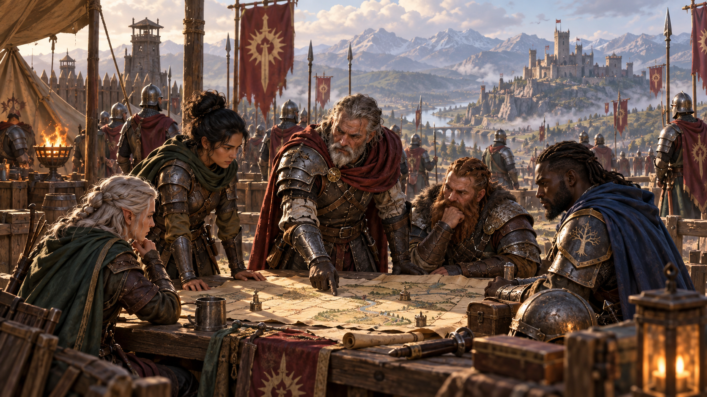

*Binh sĩ mang theo quân hàm, kỷ luật và những mối quan hệ hình thành trong thời gian phục vụ. Minh họa nguyên bản tạo bằng OpenAI ImageGen cho bản dịch này.*

Chiến tranh đã là cuộc đời bạn từ những ngày xa xưa nhất mà bạn còn nhớ. Bạn được huấn luyện khi còn trẻ, học sử dụng vũ khí, giáp và những kỹ thuật sinh tồn cơ bản, bao gồm cách sống sót trên chiến trường. Bạn có thể từng thuộc quân đội thường trực của một quốc gia, một đoàn lính đánh thuê, hoặc dân binh địa phương nổi bật trong cuộc chiến gần đây.

Khi chọn xuất thân này, cùng DM xác định tổ chức quân sự bạn từng phục vụ, cấp bậc đã đạt và trải nghiệm trong sự nghiệp quân ngũ. Đó là quân thường trực, lính gác thị trấn hay dân binh làng? Cũng có thể là quân riêng của một quý tộc hoặc thương nhân, hoặc đoàn lính đánh thuê.

- **Kỹ năng:** Điền kinh, Uy hiếp. **Công cụ:** một bộ trò chơi, phương tiện đường bộ.
- **Trang bị:** phù hiệu cấp bậc, chiến lợi phẩm từ địch chết như dao găm/lưỡi gãy/mảnh cờ, xúc xắc xương hoặc bộ bài, quần áo thường, túi 10 gp.
- **Chuyên môn:** Trong thời gian làm binh sĩ, bạn có vai trò cụ thể trong đơn vị hoặc quân đội. Tung d8 hoặc chọn vai trò sau.

| d8 | Chuyên môn |
| --- | --- |
| 1 | Sĩ quan |
| 2 | Trinh sát |
| 3 | Bộ binh |
| 4 | Kỵ binh |
| 5 | Quân y |
| 6 | Quản nhu |
| 7 | Người cầm cờ |
| 8 | Nhân viên hỗ trợ, như đầu bếp, thợ rèn hoặc nghề tương tự |

#### Đặc tính: Quân hàm (Military Rank)

Bạn có quân hàm từ sự nghiệp binh sĩ của mình. Những người lính trung thành với tổ chức quân sự cũ vẫn công nhận quyền hạn và ảnh hưởng của bạn, và phục tùng bạn nếu cấp bậc của họ thấp hơn. Bạn có thể viện đến quân hàm để gây ảnh hưởng lên những người lính khác và trưng dụng trang bị đơn giản hoặc ngựa để sử dụng tạm thời. Bạn cũng thường được vào những doanh trại và pháo đài thân thiện nơi quân hàm của mình được công nhận.

**Đặc điểm gợi ý:** Nỗi kinh hoàng của chiến tranh kết hợp kỷ luật nghiêm ngặt của quân ngũ để lại dấu ấn trên mọi binh sĩ: định hình lý tưởng, tạo mối gắn bó mạnh mẽ và thường để lại tổn thương khiến họ dễ chịu tác động của sợ hãi, hổ thẹn và thù ghét.

| d8 | Đặc điểm tính cách |
| --- | --- |
| 1 | Tôi luôn lịch sự và tôn trọng người khác. |
| 2 | Ký ức chiến tranh ám ảnh tôi. Tôi không thể gạt hình ảnh bạo lực khỏi đầu. |
| 3 | Tôi đã mất quá nhiều bạn và chậm kết bạn mới. |
| 4 | Tôi có rất nhiều chuyện truyền cảm hứng hoặc cảnh tỉnh từ kinh nghiệm quân ngũ, phù hợp với gần như mọi tình huống chiến đấu. |
| 5 | Tôi có thể nhìn thẳng một chó săn địa ngục mà không nao núng. |
| 6 | Tôi thích mạnh mẽ và thích phá đồ. |
| 7 | Tôi có óc hài hước thô tục. |
| 8 | Tôi đối mặt vấn đề trực diện. Giải pháp đơn giản, trực tiếp là con đường tốt nhất tới thành công. |

| d6 | Lý tưởng |
| --- | --- |
| 1 | **Đại nghĩa.** Số phận của chúng ta là hy sinh mạng sống để bảo vệ người khác. (Thiện) |
| 2 | **Trách nhiệm.** Tôi làm điều phải làm và tuân phục quyền lực công chính. (Trọng luật) |
| 3 | **Độc lập.** Khi mù quáng làm theo mệnh lệnh, người ta chấp nhận một dạng chuyên chế. (Hỗn loạn) |
| 4 | **Sức mạnh.** Trong đời cũng như chiến tranh, lực lượng mạnh hơn chiến thắng. (Ác) |
| 5 | **Sống và để sống.** Lý tưởng không đáng để giết người hoặc gây chiến. (Trung lập) |
| 6 | **Quốc gia.** Thành phố, quốc gia hoặc dân tộc của tôi là tất cả những gì quan trọng. (Bất kỳ) |

| d6 | Mối gắn bó |
| --- | --- |
| 1 | Tôi vẫn sẵn lòng hy sinh mạng sống cho những người từng cùng phục vụ. |
| 2 | Ai đó đã cứu mạng tôi trên chiến trường. Đến nay, tôi sẽ không bao giờ bỏ lại một người bạn. |
| 3 | Danh dự là cuộc đời tôi. |
| 4 | Tôi không bao giờ quên thất bại tan nát của đơn vị mình và những kẻ đã gây ra. |
| 5 | Những người chiến đấu bên tôi đáng để tôi chết vì họ. |
| 6 | Tôi chiến đấu cho những người không thể tự chiến đấu. |

| d6 | Khuyết điểm |
| --- | --- |
| 1 | Kẻ thù quái dị chúng tôi từng đối mặt vẫn khiến tôi run vì sợ. |
| 2 | Tôi ít tôn trọng người chưa chứng tỏ mình là chiến binh. |
| 3 | Tôi phạm sai lầm khủng khiếp trong trận, khiến nhiều người chết; tôi sẽ làm mọi thứ để giữ kín sai lầm ấy. |
| 4 | Lòng thù ghét kẻ địch của tôi mù quáng và vô lý. |
| 5 | Tôi tuân luật, ngay cả khi luật gây khổ. |
| 6 | Tôi thà ăn bộ giáp còn hơn thừa nhận mình sai. |

---

*D&D Basic Rules (Version 1.0). Không được bán lại. Được phép in và sao chụp tài liệu này chỉ để sử dụng cá nhân.*
