# Chương 5: Trang bị

Nguồn: *D&D Basic Rules (Version 1.0), 2018*, trang 45-57.

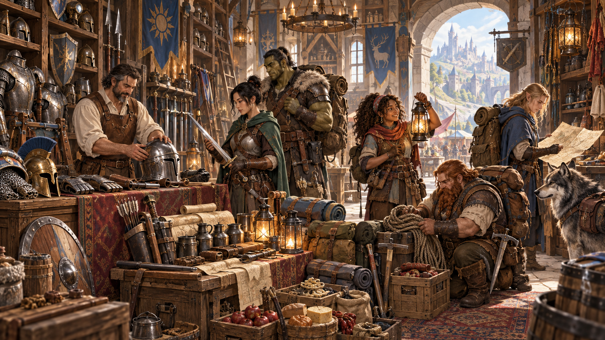

*Trang bị biến kế hoạch thành khả năng thực tế khi nhân vật bước vào hành trình. Minh họa nguyên bản tạo bằng OpenAI ImageGen cho bản dịch này.*

Chợ của một thành phố lớn đông đúc đủ loại người mua và người bán: thợ rèn người lùn, thợ chạm gỗ elf, nông dân halfling, thợ kim hoàn gnome, chưa kể những con người với đủ vóc dáng, kích thước và màu da đến từ nhiều quốc gia và văn hóa. Ở những thành phố lớn nhất, gần như mọi thứ có thể tưởng tượng đều được bán, từ gia vị kỳ lạ và quần áo xa xỉ đến giỏ đan và những thanh kiếm thực dụng.

Đối với nhà phiêu lưu, việc có giáp, vũ khí, ba lô, dây thừng và những hàng hóa tương tự là vô cùng quan trọng, vì trang bị phù hợp có thể quyết định sống chết trong hầm ngục hoặc vùng hoang dã chưa thuần phục. Chương này trình bày những hàng hóa thông thường và kỳ lạ mà nhà phiêu lưu thường thấy hữu ích khi đối mặt các mối đe dọa trong thế giới D&D.

## Trang bị khởi đầu và của cải

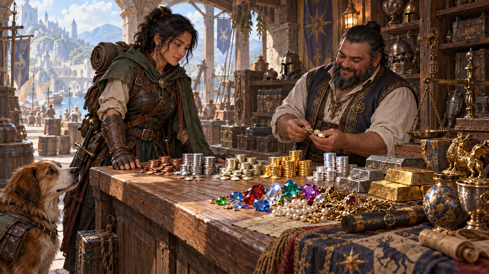

*Tiền xu và kho báu cung cấp phương tiện mua sắm, trao đổi và chuẩn bị cho cuộc phiêu lưu tiếp theo. Minh họa nguyên bản tạo bằng OpenAI ImageGen cho bản dịch này.*

Khi tạo nhân vật, bạn nhận trang bị dựa trên sự kết hợp giữa lớp và xuất thân. Thay vào đó, bạn có thể bắt đầu với số đồng vàng tùy lớp rồi mua các món trong danh sách của chương này. Xem bảng Tiền khởi đầu theo lớp để biết số vàng được tiêu.

Bạn quyết định nhân vật có trang bị khởi đầu bằng cách nào. Chúng có thể là tài sản thừa kế hoặc hàng hóa đã mua trong thời gian trưởng thành. Bạn có thể được cấp vũ khí, giáp và ba lô khi phục vụ quân đội, hoặc thậm chí đã trộm trang bị. Một vũ khí có thể là bảo vật gia đình truyền qua nhiều thế hệ, cho đến khi nhân vật cuối cùng tiếp nhận vai trò và theo bước phiêu lưu của tổ tiên.

| Lớp | Tiền khởi đầu |
| --- | --- |
| Giáo sĩ | 5d4 × 10 gp |
| Chiến binh | 5d4 × 10 gp |
| Đạo tặc | 4d4 × 10 gp |
| Pháp sư | 4d4 × 10 gp |

Của cải có thể là tiền, đá quý, hàng trao đổi, tác phẩm nghệ thuật, động vật, tài sản. Nông dân đổi hàng, đóng thuế bằng ngũ cốc, pho mát; quý tộc giao dịch quyền khai mỏ, cảng, đất canh tác hoặc thỏi vàng. Thương nhân, nhà phiêu lưu, người hành nghề mới thường giao dịch tiền.

### Tiền xu (Coinage)

Tiền xu thông dụng có nhiều mệnh giá tùy giá trị tương đối của kim loại đúc tiền. Ba loại phổ biến nhất là đồng vàng (**gp**), đồng bạc (**sp**) và đồng đồng (**cp**).

Một đồng vàng mua được túi ngủ, 50 feet dây thừng tốt hoặc một con dê. Thợ thủ công lành nghề nhưng không xuất chúng kiếm được một đồng vàng mỗi ngày. Đồng vàng là đơn vị tiêu chuẩn đo của cải, ngay cả khi bản thân tiền vàng không thường được dùng. Khi thương nhân bàn những giao dịch hàng hóa hoặc dịch vụ trị giá hàng trăm hay hàng nghìn đồng vàng, thường không có việc trao từng đồng xu. Vàng là đơn vị đo giá trị; vật được trao thực tế là thỏi vàng, thư tín dụng hoặc hàng hóa có giá.

Một đồng vàng bằng mười đồng bạc, loại tiền phổ biến nhất trong dân thường. Một đồng bạc trả được nửa ngày lao động, một bình dầu đèn hoặc một đêm nghỉ tại quán trọ nghèo.

Một đồng bạc bằng mười đồng đồng, thông dụng trong giới lao động và người ăn xin. Một đồng đồng mua được nến, đuốc hoặc một viên phấn.

Ngoài ra, những loại tiền hiếm bằng kim loại quý khác đôi khi xuất hiện trong kho báu. Đồng electrum (**ep**) và bạch kim (**pp**) bắt nguồn từ những đế chế đã sụp đổ và vương quốc thất lạc; dùng chúng giao dịch đôi khi gây nghi ngờ và hoài nghi. Một đồng electrum bằng năm đồng bạc; một đồng bạch kim bằng mười đồng vàng.

Một đồng xu tiêu chuẩn nặng khoảng một phần ba ounce, nên 50 đồng nặng một pound.

| Đồng | cp | sp | ep | gp | pp |
| --- | --- | --- | --- | --- |
| Đồng (cp) | 1 | 1/10 | 1/50 | 1/100 | 1/1.000 |
| Bạc (sp) | 10 | 1 | 1/5 | 1/10 | 1/100 |
| Electrum (ep) | 50 | 5 | 1 | 1/2 | 1/20 |
| Vàng (gp) | 100 | 10 | 2 | 1 | 1/10 |
| Platinum (pp) | 1.000 | 100 | 20 | 10 | 1 |

### Bán kho báu (Selling Treasure)

Hầm ngục bạn khám phá có nhiều cơ hội tìm kho báu, trang bị, vũ khí, giáp và những thứ khác. Thông thường, khi về thị trấn hoặc khu định cư khác, bạn có thể bán kho báu và đồ lặt vặt, miễn tìm được người mua và thương nhân quan tâm đến chiến lợi phẩm.

**Vũ khí, giáp và trang bị khác.** Theo nguyên tắc chung, vũ khí, giáp và trang bị không hư hại bán ở chợ được nửa giá mua. Vũ khí và giáp do quái vật dùng hiếm khi đủ tốt để bán.

**Vật phẩm ma thuật.** Bán chúng là việc khó. Tìm người mua thuốc hoặc cuộn phép không quá khó, nhưng những món khác nằm ngoài khả năng của hầu hết mọi người, trừ những quý tộc giàu nhất. Tương tự, ngoài một vài vật phẩm ma thuật thông dụng, bạn thường không gặp vật phẩm ma thuật hoặc phép để mua. Giá trị của ma thuật vượt xa tiền vàng đơn thuần và luôn phải được đối xử như vậy.

**Đá quý, trang sức và tác phẩm nghệ thuật.** Những món này giữ nguyên giá trị trên thị trường; bạn có thể đổi lấy tiền hoặc dùng làm tiền trong giao dịch khác. Với kho báu đặc biệt có giá trị, DM có thể yêu cầu trước tiên tìm người mua tại thị trấn lớn hoặc cộng đồng lớn hơn.

**Hàng trao đổi.** Ở vùng biên, nhiều người giao dịch bằng đổi chác. Như đá quý và đồ nghệ thuật, hàng trao đổi — thỏi sắt, túi muối, gia súc, v.v. — giữ nguyên giá trị tại chợ và có thể dùng làm tiền.

## Giáp và khiên

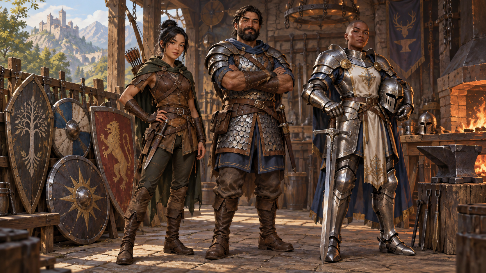

*Các loại giáp và khiên cân bằng khả năng bảo vệ, sự linh hoạt và yêu cầu thể chất. Minh họa nguyên bản tạo bằng OpenAI ImageGen cho bản dịch này.*

Các thế giới D&D là một tấm thảm rộng lớn dệt từ nhiều nền văn hóa, mỗi nền có trình độ công nghệ riêng. Vì vậy, nhà phiêu lưu có nhiều loại giáp, từ giáp da đến giáp xích và giáp tấm đắt tiền, cùng những loại ở giữa. Bảng Giáp tập hợp các loại thường có nhất, chia thành giáp nhẹ, trung bình và nặng. Nhiều chiến binh dùng thêm khiên. Bảng cho biết giá, khối lượng và các thuộc tính khác của những loại giáp thông dụng trong thế giới D&D.

**Thành thạo giáp (Armor Proficiency).** Ai cũng có thể mặc giáp hoặc buộc khiên vào tay, nhưng chỉ người thành thạo mới biết dùng hiệu quả. Lớp của bạn cho thành thạo một số loại giáp. Nếu mặc giáp không thành thạo, bạn có bất lợi đối với mọi kiểm tra thuộc tính, cứu nguy hoặc lần tung tấn công liên quan đến Sức mạnh hoặc Khéo léo, và không thể thi triển phép.

**Lớp Giáp (Armor Class, AC).** Giáp bảo vệ người mặc trước tấn công. Giáp và khiên bạn dùng xác định AC cơ sở.

**Giáp nặng (Heavy Armor).** Giáp nặng cản trở khả năng di chuyển nhanh, lén lút và tự do. Nếu cột Sức mạnh ghi Str 13 hoặc Str 15, giáp giảm tốc độ người mặc 10 feet, trừ khi điểm Sức mạnh ít nhất bằng số ghi trong bảng.

**Lén lút (Stealth).** Nếu cột Lén lút ghi Bất lợi, người mặc có bất lợi khi kiểm tra Khéo léo (Lén lút).

**Khiên (Shields).** Khiên làm bằng gỗ hoặc kim loại, cầm một tay. Dùng khiên tăng AC thêm 2. Bạn chỉ được hưởng lợi từ một khiên tại một thời điểm.

| Giáp | Giá | AC | Str | Lén lút | Nặng |
| --- | --- | --- | --- | --- | --- |
| **Nhẹ** ||||||
| Đệm (padded) | 5 gp | 11 + Dex | - | Bất lợi | 8 lb. |
| Da | 10 gp | 11 + Dex | - | - | 10 lb. |
| Da đinh tán | 45 gp | 12 + Dex | - | - | 13 lb. |
| **Trung bình** ||||||
| Da thú | 10 gp | 12 + Dex, tối đa 2 | - | - | 12 lb. |
| Áo xích | 50 gp | 13 + Dex, tối đa 2 | - | - | 20 lb. |
| Giáp vảy | 50 gp | 14 + Dex, tối đa 2 | - | Bất lợi | 45 lb. |
| Giáp ngực | 400 gp | 14 + Dex, tối đa 2 | - | - | 20 lb. |
| Nửa giáp tấm | 750 gp | 15 + Dex, tối đa 2 | - | Bất lợi | 40 lb. |
| **Nặng** ||||||
| Giáp vòng | 30 gp | 14 | - | Bất lợi | 40 lb. |
| Giáp xích | 75 gp | 16 | 13 | Bất lợi | 55 lb. |
| Giáp mảnh | 200 gp | 17 | 15 | Bất lợi | 60 lb. |
| Giáp tấm | 1.500 gp | 18 | 15 | Bất lợi | 65 lb. |
| Khiên | 10 gp | +2 | - | - | 6 lb. |

### Giáp nhẹ (Light Armor)

Làm từ vật liệu mỏng và mềm dẻo, giáp nhẹ phù hợp với nhà phiêu lưu nhanh nhẹn: bảo vệ phần nào mà không hy sinh khả năng cơ động. Khi mặc giáp nhẹ, cộng hệ số Khéo léo vào AC cơ sở của loại giáp.

**Giáp đệm (Padded).** Gồm các lớp vải và bông độn được chần với nhau.

**Giáp da (Leather).** Tấm ngực và phần bảo vệ vai làm từ da được làm cứng bằng cách đun trong dầu. Phần còn lại dùng vật liệu mềm và linh hoạt hơn.

**Giáp da đinh tán (Studded Leather).** Làm từ da bền nhưng mềm dẻo, được gia cố bằng các đinh tán hoặc gai đặt sát nhau.

### Giáp trung bình (Medium Armor)

Giáp trung bình bảo vệ tốt hơn giáp nhẹ nhưng cản trở di chuyển hơn. Khi mặc, cộng hệ số Khéo léo, tối đa +2, vào AC cơ sở của loại giáp.

**Giáp da thú (Hide).** Loại giáp thô sơ này gồm các lớp lông và da thú dày. Nó thường được các bộ tộc man di, sinh vật dạng người độc ác và những người không có công cụ hoặc vật liệu để làm giáp tốt hơn sử dụng.

**Áo xích (Chain Shirt).** Làm từ những vòng kim loại móc vào nhau, mặc giữa các lớp quần áo hoặc da. Nó bảo vệ vừa phải phần thân trên; lớp ngoài giảm tiếng các vòng cọ vào nhau.

**Giáp vảy (Scale Mail).** Gồm áo và phần che chân (có thể thêm một váy riêng) bằng da phủ những miếng kim loại chồng lên nhau như vảy cá. Bộ giáp có găng giáp.

**Giáp ngực (Breastplate).** Gồm tấm ngực kim loại vừa người, mặc cùng da mềm. Dù tay và chân ít được bảo vệ, nó bảo vệ tốt cơ quan trọng yếu mà vẫn tương đối ít cản trở người mặc.

**Nửa giáp tấm (Half Plate).** Gồm các tấm kim loại tạo hình che phần lớn cơ thể. Nó không bảo vệ chân ngoài những tấm giáp ống chân đơn giản buộc bằng dây da.

### Giáp nặng (Heavy Armor)

Trong các loại giáp, giáp nặng bảo vệ tốt nhất. Nó che toàn thân và được thiết kế để chặn nhiều dạng tấn công. Chỉ chiến binh thành thạo mới xử lý được khối lượng và độ cồng kềnh. Giáp nặng không cho cộng hệ số Khéo léo vào AC, nhưng cũng không phạt nếu hệ số ấy âm.

**Giáp vòng (Ring Mail).** Giáp da có những vòng nặng khâu vào, gia cố trước đòn kiếm và rìu. Nó kém giáp xích và thường chỉ được người không đủ tiền mua giáp tốt hơn dùng.

**Giáp xích (Chain Mail).** Làm từ các vòng kim loại móc vào nhau, có lớp vải chần bên dưới để tránh cọ xát và giảm lực va đập. Bộ giáp có găng giáp.

**Giáp mảnh (Splint).** Gồm những dải kim loại hẹp đặt dọc, tán vào lớp da nền mặc trên đệm vải. Xích mềm bảo vệ các khớp.

**Giáp tấm (Plate).** Gồm các tấm kim loại tạo hình ăn khớp che toàn thân. Bộ giáp có găng giáp, ủng da nặng, mũ giáp có tấm che mặt và các lớp đệm dày bên dưới. Khóa và dây đai phân bố khối lượng khắp cơ thể.

### Mặc và tháo giáp

Thời gian mặc hoặc tháo giáp, khiên được ghi trong bảng. **Mặc:** Bạn chỉ hưởng AC của món ấy nếu dành đủ thời gian mặc. **Tháo:** Đây là thời gian để cởi món ấy; có người giúp tháo giáp thì giảm một nửa thời gian.

| Loại | Mặc | Tháo |
| --- | --- | --- |
| Giáp nhẹ | 1 phút | 1 phút |
| Giáp trung bình | 5 phút | 1 phút |
| Giáp nặng | 10 phút | 5 phút |
| Khiên | 1 hành động | 1 hành động |

### Biến thể: Kích cỡ trang bị

Trong phần lớn chiến dịch, bạn có thể dùng hoặc mặc trang bị tìm thấy khi phiêu lưu, trong giới hạn hợp lý. Ví dụ, một half-orc vạm vỡ không thể mặc giáp da halfling, còn gnome sẽ lọt thỏm trong áo choàng thanh lịch của khổng lồ mây.

DM có thể yêu cầu tính thực tế cao hơn. Ví dụ, giáp tấm làm cho một người có thể không vừa người khác nếu không chỉnh sửa đáng kể; đồng phục lính gác có thể rõ ràng không vừa khi nhà phiêu lưu dùng cải trang.

Theo biến thể này, khi tìm thấy giáp, quần áo và những vật tương tự để mặc, bạn có thể phải đến thợ giáp, thợ may, thợ da hoặc chuyên gia tương tự để sửa cho vừa. Chi phí từ 10 đến 40 phần trăm giá thị trường của món đồ. DM có thể tung 1d4 × 10 để xác định tỷ lệ phần trăm, hoặc quyết định chi phí dựa trên mức chỉnh sửa cần thiết.

## Vũ khí

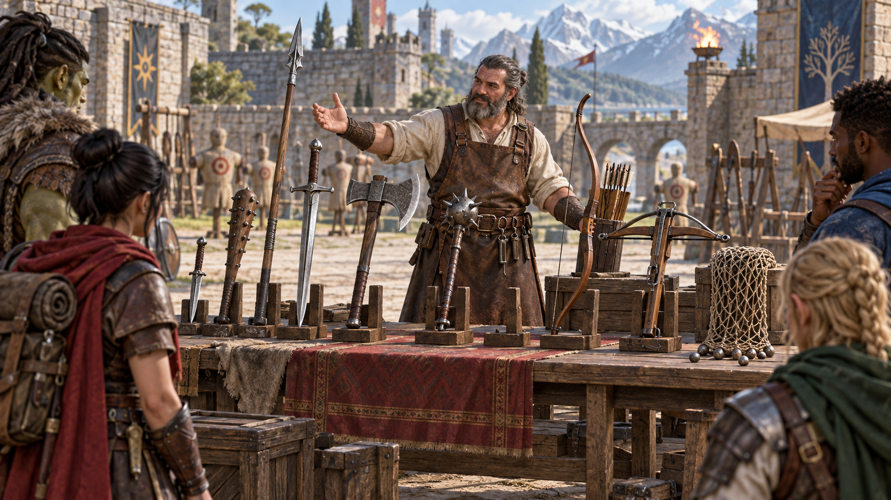

*Vũ khí khác nhau về tầm đánh, sát thương, cách sử dụng và các thuộc tính đặc biệt. Minh họa nguyên bản tạo bằng OpenAI ImageGen cho bản dịch này.*

Lớp của bạn cho thành thạo một số vũ khí, phản ánh trọng tâm của lớp và những công cụ bạn thường dùng nhất. Dù thích kiếm dài hay cung dài, vũ khí cùng khả năng sử dụng hiệu quả có thể quyết định sống chết khi phiêu lưu.

Bảng Vũ khí liệt kê những vũ khí thông dụng nhất trong thế giới D&D, giá, khối lượng, sát thương khi đánh trúng và các thuộc tính đặc biệt. Mọi vũ khí được xếp là cận chiến hoặc tầm xa. Vũ khí cận chiến dùng tấn công mục tiêu trong 5 feet; vũ khí tầm xa dùng tấn công mục tiêu ở xa.

### Thành thạo vũ khí (Weapon Proficiency)

Chủng tộc, lớp và chiến công có thể cho thành thạo một số vũ khí hoặc nhóm vũ khí. Hai nhóm là đơn giản và võ thuật. Phần lớn mọi người có thể dùng thành thạo vũ khí đơn giản, gồm gậy, chùy và các vũ khí thường nằm trong tay dân thường. Vũ khí võ thuật, gồm kiếm, rìu và vũ khí cán dài, cần đào tạo chuyên biệt hơn để dùng hiệu quả. Phần lớn chiến binh dùng chúng vì tận dụng tốt nhất phong cách chiến đấu và quá trình đào tạo.

Thành thạo vũ khí cho phép cộng thưởng thành thạo vào lần tung tấn công của mọi đòn thực hiện bằng nó. Nếu tấn công bằng vũ khí không thành thạo, không cộng thưởng thành thạo vào lần tung tấn công.

| Vũ khí | Giá | Sát thương | Nặng | Thuộc tính |
| --- | --- | --- | --- | --- |
| **Đơn giản, cận chiến** |||||
| Gậy | 1 sp | 1d4 đập | 2 lb. | nhẹ |
| Dao găm | 2 gp | 1d4 đâm | 1 lb. | tinh xảo, nhẹ, ném 20/60 |
| Đại chùy | 2 sp | 1d8 đập | 10 lb. | hai tay |
| Rìu tay | 5 gp | 1d6 chém | 2 lb. | nhẹ, ném 20/60 |
| Lao | 5 sp | 1d6 đâm | 2 lb. | ném 30/120 |
| Búa nhẹ | 2 gp | 1d4 đập | 2 lb. | nhẹ, ném 20/60 |
| Chùy | 5 gp | 1d6 đập | 4 lb. | - |
| Gậy dài | 2 sp | 1d6 đập | 4 lb. | đa dụng (1d8) |
| Liềm | 1 gp | 1d4 chém | 2 lb. | nhẹ |
| Lao dài | 1 gp | 1d6 đâm | 3 lb. | ném 20/60, đa dụng (1d8) |
| **Đơn giản, tầm xa** |||||
| Nỏ nhẹ | 25 gp | 1d8 đâm | 5 lb. | đạn 80/320, nạp, hai tay |
| Phi tiêu | 5 cp | 1d4 đâm | 1/4 lb. | tinh xảo, ném 20/60 |
| Cung ngắn | 25 gp | 1d6 đâm | 2 lb. | đạn 80/320, hai tay |
| Ná | 1 sp | 1d4 đập | - | đạn 30/120 |
| **Võ thuật, cận chiến** |||||
| Rìu chiến | 10 gp | 1d8 chém | 4 lb. | đa dụng (1d10) |
| Chùy xích | 10 gp | 1d8 đập | 2 lb. | - |
| Glaive | 20 gp | 1d10 chém | 6 lb. | nặng, với, hai tay |
| Đại rìu | 30 gp | 1d12 chém | 7 lb. | nặng, hai tay |
| Đại kiếm | 50 gp | 2d6 chém | 6 lb. | nặng, hai tay |
| Halberd | 20 gp | 1d10 chém | 6 lb. | nặng, với, hai tay |
| Thương kỵ | 10 gp | 1d12 đâm | 6 lb. | với, đặc biệt |
| Kiếm dài | 15 gp | 1d8 chém | 3 lb. | đa dụng (1d10) |
| Búa tạ | 10 gp | 2d6 đập | 10 lb. | nặng, hai tay |
| Chùy gai | 15 gp | 1d8 đâm | 4 lb. | - |
| Giáo dài | 5 gp | 1d10 đâm | 18 lb. | nặng, với, hai tay |
| Rapier | 25 gp | 1d8 đâm | 2 lb. | tinh xảo |
| Scimitar | 25 gp | 1d6 chém | 3 lb. | tinh xảo, nhẹ |
| Kiếm ngắn | 10 gp | 1d6 đâm | 2 lb. | tinh xảo, nhẹ |
| Đinh ba | 5 gp | 1d6 đâm | 4 lb. | ném 20/60, đa dụng (1d8) |
| Cuốc chiến | 5 gp | 1d8 đâm | 2 lb. | - |
| Búa chiến | 15 gp | 1d8 đập | 2 lb. | đa dụng (1d10) |
| Roi | 2 gp | 1d4 chém | 3 lb. | tinh xảo, với |
| **Võ thuật, tầm xa** |||||
| Ống thổi | 10 gp | 1 đâm | 1 lb. | đạn 25/100, nạp |
| Nỏ tay | 75 gp | 1d6 đâm | 3 lb. | đạn 30/120, nhẹ, nạp |
| Nỏ nặng | 50 gp | 1d10 đâm | 18 lb. | đạn 100/400, nặng, nạp, hai tay |
| Cung dài | 50 gp | 1d8 đâm | 2 lb. | đạn 150/600, nặng, hai tay |
| Lưới | 1 gp | - | 3 lb. | đặc biệt, ném 5/15 |

### Thuộc tính vũ khí (Weapon Properties)

Nhiều vũ khí có những thuộc tính đặc biệt liên quan đến cách dùng, được ghi trong bảng.

**Đạn dược (Ammunition).** Bạn chỉ dùng vũ khí có thuộc tính này để tấn công tầm xa nếu có đạn để bắn. Mỗi lần tấn công tiêu một viên đạn. Rút đạn từ bao tên, hộp hoặc đồ đựng khác là một phần của đòn tấn công; cần một tay trống để nạp vũ khí một tay. Cuối trận, bạn có thể thu hồi nửa số đạn đã tiêu bằng cách tìm trên chiến trường trong một phút. Nếu dùng vũ khí này để tấn công cận chiến, coi nó là vũ khí ứng biến. Ná phải được nạp đạn mới gây sát thương khi dùng như vậy.

**Tinh xảo (Finesse).** Khi tấn công bằng vũ khí tinh xảo, chọn dùng hệ số Sức mạnh hoặc Khéo léo cho cả lần tung tấn công và sát thương. Phải dùng cùng hệ số cho cả hai.

**Nặng (Heavy).** Sinh vật Nhỏ có bất lợi khi tung tấn công bằng vũ khí nặng. Kích thước và độ cồng kềnh khiến vũ khí quá lớn để sinh vật Nhỏ dùng hiệu quả.

**Nhẹ (Light).** Vũ khí nhẹ nhỏ và dễ xử lý, thích hợp cho chiến đấu bằng hai vũ khí. Xem quy tắc đánh hai vũ khí ở Chương 9.

**Nạp (Loading).** Vì thời gian nạp, bạn chỉ có thể bắn một viên đạn khi dùng hành động, hành động phụ hoặc phản ứng để bắn vũ khí này, bất kể bình thường được tấn công bao nhiêu lần.

**Tầm (Range).** Vũ khí dùng tấn công tầm xa có tầm ghi trong ngoặc sau thuộc tính đạn dược hoặc ném. Số thứ nhất là tầm thường tính bằng feet, số thứ hai là tầm xa. Tấn công mục tiêu ngoài tầm thường có bất lợi khi tung tấn công. Không thể tấn công mục tiêu ngoài tầm xa.

**Tầm với (Reach).** Vũ khí tăng tầm với của bạn thêm 5 feet khi tấn công bằng nó, và khi xác định tầm với cho đòn tấn công cơ hội bằng nó (xem Chương 9).

**Đặc biệt (Special).** Vũ khí có những quy tắc sử dụng khác thường, giải thích trong mô tả của nó ở mục Vũ khí đặc biệt bên dưới.

**Ném (Thrown).** Có thể ném vũ khí để tấn công tầm xa. Nếu là vũ khí cận chiến, dùng cùng hệ số thuộc tính cho tấn công và sát thương như khi tấn công cận chiến bằng nó. Ví dụ, ném rìu tay dùng Sức mạnh; ném dao găm có thể dùng Sức mạnh hoặc Khéo léo vì dao có thuộc tính tinh xảo.

**Hai tay (Two-Handed).** Cần hai tay khi tấn công bằng vũ khí này.

**Đa dụng (Versatile).** Có thể dùng vũ khí bằng một hoặc hai tay. Giá trị sát thương ghi trong ngoặc cùng thuộc tính là sát thương khi dùng hai tay để tấn công cận chiến.

### Vũ khí ứng biến (Improvised Weapons)

Đôi khi nhân vật không có vũ khí và phải tấn công bằng bất cứ thứ gì trong tầm tay. Vũ khí ứng biến gồm bất kỳ vật nào có thể cầm bằng một hoặc hai tay, như kính vỡ, chân bàn, chảo, bánh xe hàng hoặc một goblin đã chết.

Trong nhiều trường hợp, vật ứng biến giống một vũ khí thật và có thể được coi như vũ khí ấy. Ví dụ, chân bàn giống gậy. Theo quyết định của DM, nhân vật thành thạo một vũ khí có thể dùng vật tương tự như vũ khí ấy và cộng thưởng thành thạo.

Vật không giống vũ khí nào gây 1d4 sát thương; DM chọn loại sát thương phù hợp. Dùng vũ khí tầm xa tấn công cận chiến hoặc ném vũ khí cận chiến không có thuộc tính ném cũng gây 1d4 sát thương. Vũ khí ứng biến ném có tầm thường 20 feet, tầm xa 60 feet.

### Vũ khí mạ bạc (Silvered Weapons)

Một số quái vật miễn nhiễm hoặc kháng vũ khí phi ma thuật lại dễ bị vũ khí bạc tác động, nên nhà phiêu lưu thận trọng bỏ thêm tiền mạ bạc vũ khí. Mạ bạc một vũ khí hoặc 10 viên đạn tốn 100 gp. Giá này gồm cả bạc lẫn thời gian và chuyên môn cần thiết để thêm bạc mà không giảm hiệu quả vũ khí.

### Vũ khí đặc biệt (Special Weapons)

Những vũ khí có quy tắc riêng được mô tả ở đây.

**Thương kỵ (Lance).** Bạn có bất lợi khi dùng thương kỵ tấn công mục tiêu trong 5 feet. Khi không cưỡi thú, cần hai tay để sử dụng.

**Lưới (Net).** Sinh vật Lớn hoặc nhỏ hơn bị lưới đánh trúng sẽ bị kiềm chế đến khi được giải thoát. Lưới không tác dụng với sinh vật không có hình dạng hoặc sinh vật Khổng lồ (Huge) trở lên. Sinh vật có thể dùng hành động kiểm tra Sức mạnh DC 10; thành công giải thoát bản thân hoặc sinh vật khác trong tầm với. Gây 5 sát thương chém vào lưới (AC 10) cũng giải thoát sinh vật mà không làm hại nó, chấm dứt hiệu ứng và phá hủy lưới. Khi dùng hành động, hành động phụ hoặc phản ứng để tấn công bằng lưới, bạn chỉ được thực hiện một đòn, bất kể bình thường được tấn công bao nhiêu lần.

## Đồ phiêu lưu (Adventuring Gear)

*Dụng cụ, ánh sáng, lương thực và vật tư thường quyết định một đoàn thám hiểm có thể đi xa đến đâu. Minh họa nguyên bản tạo bằng OpenAI ImageGen cho bản dịch này.*

Giá và khối lượng theo bảng gốc ở trang 50. Dấu — giữ nguyên từ nguồn; khối lượng dùng pound (lb.), chiều dài dùng feet.

| Vật phẩm | Giá | Khối lượng |
| --- | --- | --- |
| Bàn tính (Abacus) | 2 gp | 2 lb. |
| Axit (lọ) | 25 gp | 1 lb. |
| Lửa giả kim (bình) | 50 gp | 1 lb. |
| **Đạn dược** | | |
| Mũi tên (20) | 1 gp | 1 lb. |
| Kim ống thổi (50) | 1 gp | 1 lb. |
| Tên nỏ (20) | 1 gp | 1½ lb. |
| Đạn ná (20) | 4 cp | 1½ lb. |
| Thuốc chống độc (lọ) | 50 gp | — |
| **Vật hội tụ huyền thuật** | | |
| Pha lê | 10 gp | 1 lb. |
| Quả cầu | 20 gp | 3 lb. |
| Đoản trượng (Rod) | 10 gp | 2 lb. |
| Trượng (Staff) | 5 gp | 4 lb. |
| Đũa phép (Wand) | 10 gp | 1 lb. |
| Ba lô | 2 gp | 5 lb. |
| Bi sắt (túi 1.000 viên) | 1 gp | 2 lb. |
| Thùng phuy | 2 gp | 70 lb. |
| Giỏ | 4 sp | 2 lb. |
| Túi ngủ | 1 gp | 7 lb. |
| Chuông | 1 gp | — |
| Chăn | 5 sp | 3 lb. |
| Bộ ròng rọc | 1 gp | 5 lb. |
| Sách | 25 gp | 5 lb. |
| Chai thủy tinh | 2 gp | 2 lb. |
| Xô | 5 cp | 2 lb. |
| Chông sắt (túi 20 chiếc) | 1 gp | 2 lb. |
| Nến | 1 cp | — |
| Hộp đựng tên nỏ | 1 gp | 1 lb. |
| Ống đựng bản đồ hoặc cuộn giấy | 1 gp | 1 lb. |
| Xích (10 feet) | 5 gp | 10 lb. |
| Phấn (1 viên) | 1 cp | — |
| Rương | 5 gp | 25 lb. |
| Bộ dụng cụ leo trèo | 25 gp | 12 lb. |
| Quần áo thường | 5 sp | 3 lb. |
| Trang phục hóa trang | 5 gp | 4 lb. |
| Quần áo sang trọng | 15 gp | 6 lb. |
| Quần áo lữ hành | 2 gp | 4 lb. |
| Túi thành phần phép | 25 gp | 2 lb. |
| Xà beng | 2 gp | 5 lb. |
| **Vật hội tụ druid** | | |
| Nhánh tầm gửi | 1 gp | — |
| Vật tổ | 1 gp | — |
| Trượng gỗ | 5 gp | 4 lb. |
| Đũa phép gỗ thủy tùng | 10 gp | 1 lb. |
| Bộ đồ câu cá | 1 gp | 4 lb. |
| Bình hoặc ca uống | 2 cp | 1 lb. |
| Móc leo | 2 gp | 4 lb. |
| Búa | 1 gp | 3 lb. |
| Búa tạ | 2 gp | 10 lb. |
| Bộ dụng cụ chữa trị | 5 gp | 3 lb. |
| **Thánh biểu** | | |
| Bùa đeo | 5 gp | 1 lb. |
| Biểu tượng | 5 gp | — |
| Hộp thánh tích | 5 gp | 2 lb. |
| Nước thánh (bình) | 25 gp | 1 lb. |
| Đồng hồ cát | 25 gp | 1 lb. |
| Bẫy săn | 5 gp | 25 lb. |
| Mực (chai 1 ounce) | 10 gp | — |
| Bút mực | 2 cp | — |
| Bình hoặc vò rót | 2 cp | 4 lb. |
| Thang (10 feet) | 1 sp | 25 lb. |
| Đèn dầu | 5 sp | 1 lb. |
| Đèn lồng chiếu điểm | 10 gp | 2 lb. |
| Đèn lồng có chụp | 5 gp | 2 lb. |
| Khóa | 10 gp | 1 lb. |
| Kính lúp | 100 gp | — |
| Còng | 2 gp | 6 lb. |
| Bộ đồ ăn | 2 sp | 1 lb. |
| Gương thép | 5 gp | ½ lb. |
| Dầu (bình) | 1 sp | 1 lb. |
| Giấy (1 tờ) | 2 sp | — |
| Giấy da (1 tờ) | 1 sp | — |
| Nước hoa (lọ) | 5 gp | — |
| Cuốc thợ mỏ | 2 gp | 10 lb. |
| Đinh leo núi | 5 cp | ¼ lb. |
| Độc cơ bản (lọ) | 100 gp | — |
| Sào (10 feet) | 5 cp | 7 lb. |
| Nồi sắt | 2 gp | 10 lb. |
| Thuốc chữa lành | 50 gp | ½ lb. |
| Túi nhỏ | 5 sp | 1 lb. |
| Bao tên | 1 gp | 1 lb. |
| Đòn phá cửa di động | 4 gp | 35 lb. |
| Khẩu phần (1 ngày) | 5 sp | 2 lb. |
| Áo choàng dài | 1 gp | 4 lb. |
| Dây thừng gai dầu (50 feet) | 1 gp | 10 lb. |
| Dây thừng lụa (50 feet) | 10 gp | 5 lb. |
| Bao tải | 1 cp | ½ lb. |
| Cân thương nhân | 5 gp | 3 lb. |
| Sáp niêm phong | 5 sp | — |
| Xẻng | 2 gp | 5 lb. |
| Còi hiệu | 5 cp | — |
| Nhẫn ấn | 5 gp | — |
| Xà phòng | 2 cp | — |
| Sách phép | 50 gp | 3 lb. |
| Cọc sắt (10) | 1 gp | 5 lb. |
| Kính viễn vọng | 1.000 gp | 1 lb. |
| Lều hai người | 2 gp | 20 lb. |
| Hộp nhóm lửa | 5 sp | 1 lb. |
| Đuốc | 1 cp | 1 lb. |
| Lọ nhỏ | 1 gp | — |
| Túi da đựng nước | 2 sp | 5 lb. (đầy) |
| Đá mài | 1 cp | 1 lb. |

### Đồ phiêu lưu: quy tắc đặc biệt

- **Axit:** Bằng một hành động, bạn có thể té chất trong lọ lên một sinh vật hoặc đồ vật trong 5 feet, hoặc ném lọ đến tối đa 20 feet để lọ vỡ khi va chạm. Trong cả hai trường hợp, thực hiện một đòn tấn công tầm xa vào sinh vật hoặc đồ vật mục tiêu, coi axit là vũ khí ứng biến. Nếu trúng, mục tiêu chịu 2d6 sát thương axit.
- **Lửa giả kim (Alchemist’s Fire):** Chất lỏng dính này bốc cháy khi tiếp xúc không khí. Bằng một hành động, bạn có thể ném bình tối đa 20 feet; bình vỡ khi va chạm. Thực hiện tấn công tầm xa chống một sinh vật hoặc vật thể, coi lửa giả kim là vũ khí ứng biến. Nếu trúng, mục tiêu chịu 1d4 sát thương lửa vào đầu mỗi lượt của mình. Sinh vật có thể chấm dứt sát thương bằng cách dùng hành động kiểm tra Khéo léo DC 10 để dập lửa.
- **Thuốc chống độc:** uống để có lợi thế cứu nguy chống độc trong 1 giờ; không lợi cho xác sống/cấu thể.
- **Tiêu điểm huyền thuật:** Đây là một vật phẩm đặc biệt — quả cầu, tinh thể, quyền trượng, gậy được chế tạo đặc biệt, vật bằng gỗ dài như đũa phép hoặc vật tương tự — được thiết kế để dẫn truyền quyền năng của phép huyền thuật. Sorcerer, warlock hoặc wizard có thể dùng vật này làm tiêu điểm thi triển phép, như mô tả ở chương 10.
- **Bi kim loại:** Bằng một hành động, bạn có thể đổ những viên bi kim loại nhỏ khỏi túi, phủ một khu vực vuông bằng phẳng có cạnh 10 feet. Sinh vật đi qua khu vực ấy phải thành công cứu nguy Khéo léo DC 10 hoặc ngã sấp. Sinh vật đi qua với nửa tốc độ không cần thực hiện cứu nguy.
- **Bộ ròng rọc:** Gồm các ròng rọc có dây cáp luồn qua và móc để gắn vào vật, bộ này cho phép bạn kéo nâng khối lượng tối đa bằng bốn lần khối lượng bình thường mình nâng được.
- **Sách:** Sách có thể chứa thơ, tường thuật lịch sử, thông tin về một lĩnh vực tri thức, sơ đồ và ghi chú về những máy móc của gnome, hoặc gần như bất kỳ điều gì có thể biểu đạt bằng chữ hay hình. Sách ghi phép là sách phép, được mô tả ở phần sau.
- **Caltrop:** hành động rải một túi phủ ô 5 feet; sinh vật vào phải cứu nguy Dex DC 15, thất bại dừng và chịu 1 đâm. Đến khi hồi ít nhất 1 HP, tốc độ đi bộ giảm 10 feet. Đi nửa tốc độ không cần tung.
- **Nến:** 1 giờ, sáng rõ 5 feet và sáng yếu thêm 5 feet.
- **Hộp đựng tên nỏ:** Hộp gỗ này chứa được tối đa 20 tên nỏ.
- **Ống đựng bản đồ hoặc cuộn giấy:** Ống da hình trụ này chứa được tối đa 10 tờ giấy cuộn hoặc 5 tờ giấy da cuộn.
- **Xích:** 10 HP; kiểm tra Str DC 20 để bứt.
- **Bộ leo núi:** gồm đinh leo núi, đinh gắn giày, găng tay và đai an toàn. Bạn có thể dùng bộ này bằng một hành động để neo bản thân; khi làm vậy, bạn không thể rơi quá 25 feet tính từ điểm neo, và không thể leo ra xa điểm ấy quá 25 feet nếu chưa tháo neo.

### Đồ phiêu lưu: mô tả tiếp theo

**Túi thành phần phép:** Một túi da nhỏ, kín nước, đeo ở thắt lưng, có các ngăn chứa mọi thành phần vật chất và vật phẩm đặc biệt khác cần để thi triển phép, ngoại trừ những thành phần có giá cụ thể được ghi trong mô tả phép.

**Xà beng:** Dùng xà beng cho lợi thế trong các kiểm tra Sức mạnh mà bạn có thể tận dụng sức bẩy của nó.

**Tiêu điểm druid:** Có thể là một nhành tầm gửi hoặc cây nhựa ruồi; đũa hoặc quyền trượng làm từ gỗ thủy tùng (yew) hay một loại gỗ đặc biệt khác; gậy lấy nguyên từ một cây sống; hoặc vật tổ kết hợp lông vũ, lông thú, xương và răng của những động vật linh thiêng. Druid (xem chương 3 của *Player’s Handbook*) có thể dùng vật ấy làm tiêu điểm thi triển phép, như mô tả ở chương 10.

**Bộ câu:** Bộ này gồm cần gỗ, dây tơ, phao bần, lưỡi câu thép, chì chìm, mồi nhung và lưới hẹp.

**Bộ chữa thương:** túi da có băng, thuốc mỡ, nẹp; 10 lần dùng. Dùng một lần bằng hành động để ổn định sinh vật 0 HP, không cần kiểm tra Minh triết (Y học).

**Thánh vật:** Vật đại diện cho một vị thần hoặc điện thần. Nó có thể là bùa mang biểu tượng đại diện cho vị thần, biểu tượng ấy được khắc hoặc khảm cẩn thận làm huy hiệu trên khiên, hoặc một hộp nhỏ chứa mảnh thánh tích. *Player’s Handbook* liệt kê nhiều vị thần trong đa vũ trụ cùng các biểu tượng điển hình của họ. Giáo sĩ hoặc thánh kỵ sĩ có thể dùng thánh vật làm tiêu điểm thi triển phép, như mô tả ở chương 10. Để dùng theo cách này, người thi triển phải cầm nó trong tay, đeo nó ở nơi nhìn thấy rõ, hoặc mang nó trên khiên.

**Nước thánh:** hành động té trong 5 feet hoặc ném 20 feet; tấn công tầm xa như vũ khí ứng biến. Fiend hoặc xác sống bị trúng chịu **2d6 sát thương quang năng**. Giáo sĩ/thánh kỵ sĩ tạo bằng nghi thức 1 giờ, bột bạc giá 25 gp và một ô phép bậc 1.

**Bẫy săn:** Khi bạn dùng một hành động để đặt bẫy, nó tạo thành vòng thép có răng cưa, sập lại khi một sinh vật giẫm lên bàn áp lực ở giữa. Bẫy được buộc bằng xích nặng vào một vật không di chuyển được, như cây hoặc cọc đóng xuống đất. Sinh vật giẫm lên bàn áp lực phải thành công cứu nguy Khéo léo DC 13, nếu không sẽ chịu 1d4 sát thương đâm và ngừng di chuyển. Từ đó đến khi thoát bẫy, di chuyển của nó bị giới hạn bởi chiều dài xích, thường là 3 feet. Một sinh vật có thể dùng hành động để thực hiện kiểm tra Sức mạnh DC 13; nếu thành công, nó giải thoát bản thân hoặc một sinh vật khác trong tầm với. Mỗi lần kiểm tra thất bại gây 1 sát thương đâm cho sinh vật mắc bẫy.

**Đèn dầu:** Đèn chiếu sáng rõ trong bán kính 15 feet và sáng yếu thêm 30 feet. Sau khi thắp, đèn cháy 6 giờ với một lọ dầu (1 pint).

**Đèn chụp:** Đèn chiếu sáng rõ trong bán kính 30 feet và sáng yếu thêm 30 feet. Sau khi thắp, đèn cháy 6 giờ với một lọ dầu (1 pint). Bằng một hành động, bạn có thể hạ chụp, khiến đèn chỉ còn chiếu sáng yếu trong bán kính 5 feet.

**Đèn hội tụ:** Đèn chiếu sáng rõ theo hình nón dài 60 feet và sáng yếu thêm 60 feet. Sau khi thắp, đèn cháy 6 giờ với một lọ dầu (1 pint).

**Khóa:** Khóa đi kèm chìa. Không có chìa, sinh vật thành thạo dụng cụ kẻ trộm có thể mở khóa bằng kiểm tra Khéo léo DC 15 thành công. DM có thể quyết định rằng có các loại khóa tốt hơn với giá cao hơn.

**Kính lúp:** Thấu kính này giúp xem kỹ những vật nhỏ, và có thể thay đá lửa cùng thép khi nhóm lửa. Để nhóm lửa bằng kính lúp, cần ánh sáng mạnh ít nhất bằng ánh nắng để hội tụ, mồi lửa để đốt và khoảng 5 phút. Kính cho lợi thế đối với mọi kiểm tra thuộc tính để định giá hoặc xem xét một vật nhỏ hay có nhiều chi tiết.

**Còng:** Vật trói kim loại này có thể giữ một sinh vật Nhỏ hoặc Trung bình. Thoát còng cần kiểm tra Khéo léo DC 20 thành công; phá còng cần kiểm tra Sức mạnh DC 20 thành công. Mỗi bộ đi kèm một chìa. Không có chìa, sinh vật thành thạo dụng cụ kẻ trộm có thể mở khóa còng bằng kiểm tra Khéo léo DC 15 thành công. Còng có 15 điểm sinh lực.

**Dầu (Oil).** Dầu thường đựng trong bình đất sét chứa một pint. Bằng một hành động, bạn có thể té dầu lên sinh vật trong 5 feet hoặc ném bình tối đa 20 feet; bình vỡ khi va chạm. Thực hiện tấn công tầm xa chống sinh vật hoặc vật thể, coi dầu là vũ khí ứng biến. Nếu trúng, mục tiêu bị phủ dầu. Nếu chịu sát thương lửa trước khi dầu khô sau một phút, mục tiêu chịu thêm 5 sát thương lửa từ dầu cháy. Bạn cũng có thể đổ bình dầu xuống mặt đất để phủ khu vực vuông cạnh 5 feet nếu mặt phẳng bằng. Khi đốt, dầu cháy hai vòng, gây 5 sát thương lửa cho sinh vật vào khu vực hoặc kết thúc lượt tại đó. Mỗi sinh vật chỉ chịu sát thương này một lần mỗi lượt.

**Độc cơ bản (Poison, Basic).** Độc trong lọ phủ được một vũ khí chém hoặc đâm, hoặc tối đa ba viên đạn. Bôi độc cần một hành động. Sinh vật bị vũ khí hoặc đạn tẩm độc đánh trúng phải cứu nguy Thể chất DC 10 hoặc chịu 1d4 sát thương độc. Sau khi bôi, độc còn hiệu lực một phút trước khi khô.

**Thuốc chữa lành (Potion of Healing).** Nhân vật uống chất lỏng ma thuật màu đỏ trong lọ hồi 2d4 + 2 điểm sinh lực. Uống hoặc cho người khác uống cần một hành động.

### Sức chứa đồ đựng (Container Capacity)

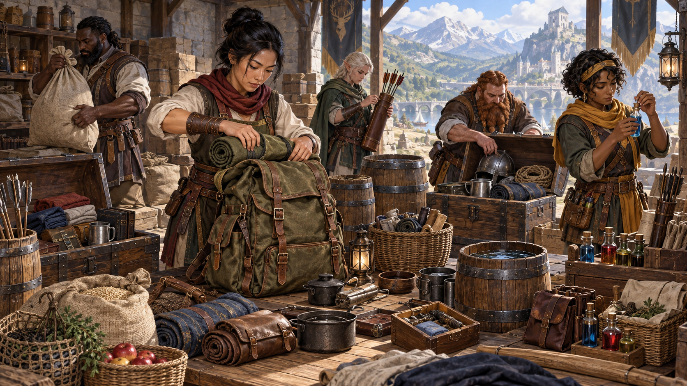

*Mỗi loại đồ đựng có sức chứa phù hợp với những vật phẩm và hoàn cảnh khác nhau. Minh họa nguyên bản tạo bằng OpenAI ImageGen cho bản dịch này.*

| Đồ đựng | Sức chứa |
| --- | --- |
| Ba lô* | 1 foot khối / 30 pound trang bị |
| Thùng phuy | 40 gallon chất lỏng, 4 foot khối chất rắn |
| Giỏ | 2 foot khối / 40 pound trang bị |
| Chai | 1½ pint chất lỏng |
| Xô | 3 gallon chất lỏng, ½ foot khối chất rắn |
| Rương | 12 foot khối / 300 pound trang bị |
| Bình hoặc ca uống | 1 pint chất lỏng |
| Bình hoặc vò rót | 1 gallon chất lỏng |
| Nồi sắt | 1 gallon chất lỏng |
| Túi nhỏ | ⅕ foot khối / 6 pound trang bị |
| Bao tải | 1 foot khối / 30 pound trang bị |
| Lọ nhỏ | 4 ounce chất lỏng |
| Túi da đựng nước | 4 pint chất lỏng |

*Bạn cũng có thể buộc những vật như túi ngủ hoặc cuộn dây thừng vào bên ngoài ba lô.*

**Bộ đồ ăn (Mess Kit).** Hộp thiếc này chứa một chiếc cốc và bộ dao, thìa, nĩa đơn giản. Hai nửa hộp kẹp lại với nhau; một nửa có thể dùng làm chảo nấu ăn, nửa kia làm đĩa hoặc bát nông.

**Túi nhỏ (Pouch).** Túi vải hoặc da có thể đựng, trong số những thứ khác, tối đa 20 viên đạn ná hoặc 50 kim ống thổi. Túi có các ngăn để đựng thành phần phép được gọi là túi thành phần, đã mô tả ở trên.

**Bao tên (Quiver).** Một bao tên đựng được tối đa 20 mũi tên.

**Khẩu phần (Rations).** Khẩu phần gồm những thực phẩm khô thích hợp cho chuyến đi dài, kể cả thịt khô, trái cây khô, bánh quy khô cứng và các loại hạt.

**Cân thương nhân (Scale, Merchant’s).** Một bộ cân gồm đòn cân nhỏ, đĩa cân và một bộ quả cân phù hợp lên đến 2 pound. Nó cho phép đo chính xác khối lượng những vật nhỏ như kim loại quý thô hoặc hàng trao đổi để giúp xác định giá trị.

**Đòn phá cửa di động (Ram, Portable).** Có thể dùng để phá cửa, nhận +4 vào kiểm tra Sức mạnh khi làm vậy. Một nhân vật khác có thể giúp dùng đòn phá cửa, cho bạn lợi thế ở kiểm tra này.

**Dây thừng (Rope).** Dù làm từ gai dầu hay lụa, dây thừng có 2 điểm sinh lực và có thể bị bứt bằng kiểm tra Sức mạnh DC 17 thành công.

**Sách phép (Spellbook).** Vật thiết yếu của pháp sư, là sách bìa da có 100 trang giấy da mịn trống thích hợp để ghi phép.

**Kính viễn vọng (Spyglass).** Vật nhìn qua kính được phóng đại lên gấp đôi kích thước.

**Lều (Tent).** Nơi trú bằng vải bạt đơn giản, di động, đủ cho hai người ngủ.

**Hộp nhóm lửa (Tinderbox).** Hộp nhỏ chứa đá lửa, thép đánh lửa và mồi lửa, thường là vải khô thấm dầu nhẹ. Dùng nó thắp đuốc, hoặc bất kỳ thứ gì có nhiều nhiên liệu lộ ra, cần một hành động. Nhóm bất kỳ loại lửa khác cần một phút.

**Đuốc (Torch).** Đuốc cháy một giờ, cho ánh sáng rõ bán kính 20 feet và ánh sáng yếu thêm 20 feet. Nếu tấn công cận chiến bằng đuốc đang cháy và đánh trúng, gây 1 sát thương lửa.

## Gói trang bị

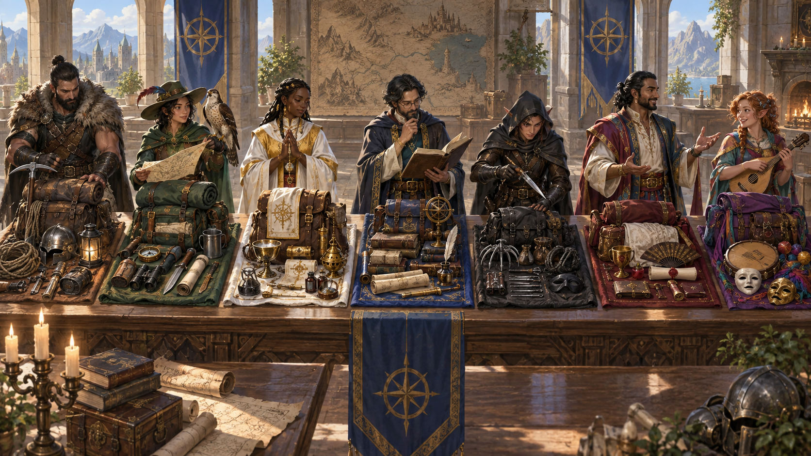

*Gói trang bị gom những vật dụng thường dùng để nhân vật có thể chuẩn bị nhanh chóng. Minh họa nguyên bản tạo bằng OpenAI ImageGen cho bản dịch này.*

Trang bị khởi đầu từ lớp của bạn có một bộ những đồ phiêu lưu hữu ích được gom thành gói. Nội dung các gói được liệt kê dưới đây. Nếu mua trang bị khởi đầu, bạn có thể mua nguyên gói với giá đã ghi; giá này có thể rẻ hơn mua từng món riêng.

| Gói | Giá | Nội dung |
| --- | --- | --- |
| Kẻ trộm | 16 gp | Ba lô, một túi 1.000 bi kim loại, dây 10 feet, chuông, 5 nến, xà beng, búa, 10 piton, đèn chụp, 2 lọ dầu, lương khô cho 5 ngày, hộp đánh lửa, túi nước; thêm dây thừng gai dầu dài 50 feet buộc bên ngoài gói |
| Nhà ngoại giao | 39 gp | Rương, 2 ống đựng bản đồ và cuộn giấy, một bộ quần áo tốt, một lọ mực, bút mực, đèn dầu, 2 lọ dầu, 5 tờ giấy, một lọ nước hoa, sáp niêm và xà phòng |
| Thám hiểm hầm ngục | 12 gp | Ba lô, xà beng, búa, 10 piton, 10 đuốc, hộp đánh lửa, lương khô cho 10 ngày, túi nước; thêm dây thừng gai dầu dài 50 feet buộc bên ngoài gói |
| Nghệ sĩ | 40 gp | Ba lô, chăn cuộn, 2 trang phục, 5 nến, 5 ngày lương khô, túi nước, bộ cải trang |
| Thám hiểm | 10 gp | Ba lô, chăn cuộn, bộ đồ ăn, hộp đánh lửa, 10 đuốc, lương khô cho 10 ngày, túi nước; thêm dây thừng gai dầu dài 50 feet buộc bên ngoài gói |
| Linh mục | 19 gp | Ba lô, chăn, 10 nến, hộp đánh lửa, hộp xin bố thí, 2 khối hương, lư hương, lễ phục, lương khô cho 2 ngày và túi nước |
| Học giả | 40 gp | Ba lô, sách tri thức, một lọ mực, bút mực, 10 tờ giấy da, một túi cát nhỏ và dao nhỏ |

## Công cụ

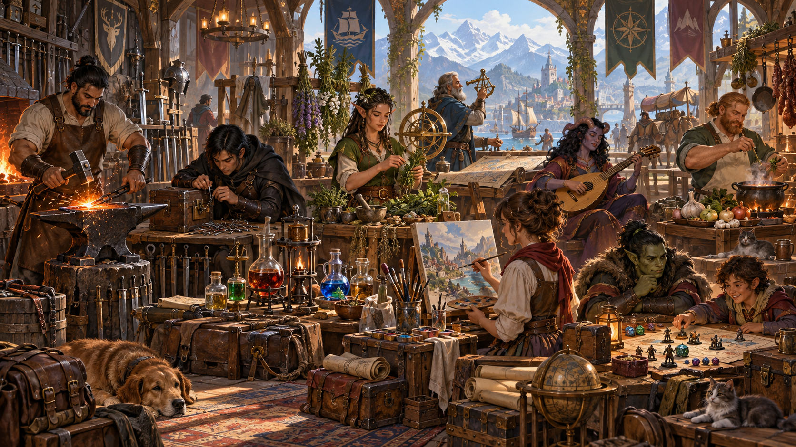

*Công cụ đại diện cho đào tạo chuyên môn trong nghề thủ công, nghệ thuật, điều hướng và nhiều lĩnh vực khác. Minh họa nguyên bản tạo bằng OpenAI ImageGen cho bản dịch này.*

Công cụ giúp bạn làm những việc mà nếu thiếu nó bạn không thể làm, chẳng hạn chế tạo hoặc sửa một vật phẩm, làm giả giấy tờ hoặc mở khóa. Chủng tộc, lớp, xuất thân hoặc chiến công (feat) cho bạn thành thạo một số công cụ. Thành thạo một công cụ cho phép cộng thưởng thành thạo vào mọi kiểm tra thuộc tính bạn thực hiện bằng công cụ ấy. Sử dụng công cụ không gắn với một thuộc tính duy nhất, vì sự thành thạo thể hiện hiểu biết rộng hơn về cách dùng nó. Ví dụ, DM có thể yêu cầu kiểm tra Khéo léo để khắc một chi tiết tinh xảo bằng dụng cụ chạm gỗ, hoặc kiểm tra Sức mạnh để làm một vật từ loại gỗ đặc biệt cứng.

| Vật phẩm | Giá | Khối lượng |
| --- | --- | --- |
| **Công cụ thủ công** | | |
| Bộ đồ giả kim | 50 gp | 8 lb. |
| Bộ đồ nấu bia | 20 gp | 9 lb. |
| Bộ đồ thư pháp | 10 gp | 5 lb. |
| Dụng cụ thợ mộc | 8 gp | 6 lb. |
| Dụng cụ vẽ bản đồ | 15 gp | 6 lb. |
| Dụng cụ thợ giày | 5 gp | 5 lb. |
| Đồ dùng nấu ăn | 1 gp | 8 lb. |
| Dụng cụ thổi thủy tinh | 30 gp | 5 lb. |
| Dụng cụ thợ kim hoàn | 25 gp | 2 lb. |
| Dụng cụ làm đồ da | 5 gp | 5 lb. |
| Dụng cụ thợ xây đá | 10 gp | 8 lb. |
| Bộ đồ hội họa | 10 gp | 5 lb. |
| Dụng cụ làm gốm | 10 gp | 3 lb. |
| Dụng cụ thợ rèn | 20 gp | 8 lb. |
| Dụng cụ sửa đồ (Tinker’s tools) | 50 gp | 10 lb. |
| Dụng cụ dệt | 1 gp | 5 lb. |
| Dụng cụ chạm gỗ | 1 gp | 5 lb. |
| Bộ cải trang | 25 gp | 3 lb. |
| Bộ làm giả giấy tờ | 15 gp | 5 lb. |
| **Bộ trò chơi** | | |
| Bộ xúc xắc | 1 sp | — |
| Bộ cờ rồng (Dragonchess) | 1 gp | ½ lb. |
| Bộ bài | 5 sp | — |
| Bộ Three-Dragon Ante | 1 gp | — |
| Bộ thảo dược | 5 gp | 3 lb. |
| **Nhạc cụ** | | |
| Kèn túi (Bagpipes) | 30 gp | 6 lb. |
| Trống | 6 gp | 3 lb. |
| Đàn dulcimer | 25 gp | 10 lb. |
| Sáo | 2 gp | 1 lb. |
| Đàn lute | 35 gp | 2 lb. |
| Đàn lyre | 30 gp | 2 lb. |
| Tù và | 3 gp | 2 lb. |
| Sáo pan | 12 gp | 2 lb. |
| Kèn shawm | 2 gp | 1 lb. |
| Đàn viol | 30 gp | 1 lb. |
| Dụng cụ hàng hải | 25 gp | 2 lb. |
| Bộ chế độc | 50 gp | 2 lb. |
| Dụng cụ kẻ trộm | 25 gp | 1 lb. |
| Phương tiện (đường bộ hoặc đường thủy) | * | * |

*Xem mục “Thú cưỡi và phương tiện”.*

**Công cụ thủ công (Artisan’s Tools).** Những công cụ chuyên dụng này gồm các vật dụng cần thiết để theo đuổi một nghề thủ công hoặc một nghề nghiệp. Bảng đưa ra những loại phổ biến nhất; mỗi bộ gồm các vật dụng liên quan đến một nghề riêng. Thành thạo một bộ công cụ thủ công cho phép cộng thưởng thành thạo vào mọi kiểm tra thuộc tính bạn thực hiện bằng công cụ trong nghề ấy. Mỗi loại công cụ thủ công đòi hỏi một sự thành thạo riêng.

**Bộ cải trang (Disguise Kit).** Túi mỹ phẩm, thuốc nhuộm tóc và đạo cụ nhỏ này giúp tạo những lớp cải trang thay đổi diện mạo. Thành thạo bộ này cho phép cộng thưởng thành thạo vào mọi kiểm tra thuộc tính để tạo cải trang về ngoại hình.

**Bộ làm giả giấy tờ (Forgery Kit).** Hộp nhỏ này chứa nhiều loại giấy và giấy da, bút và mực, con dấu và sáp niêm phong, lá vàng và bạc, cùng những vật dụng cần thiết khác để tạo bản giả thuyết phục của giấy tờ hữu hình. Thành thạo bộ này cho phép cộng thưởng thành thạo vào mọi kiểm tra thuộc tính để làm giả một văn bản hữu hình.

**Bộ trò chơi (Gaming Set).** Mục này bao gồm nhiều loại quân chơi, kể cả xúc xắc và các bộ bài dùng cho những trò như Three-Dragon Ante. Bảng Công cụ liệt kê vài ví dụ phổ biến, nhưng còn có những loại khác. Nếu thành thạo một bộ trò chơi, bạn có thể cộng thưởng thành thạo vào kiểm tra thuộc tính để chơi bằng bộ ấy. Mỗi loại bộ trò chơi đòi hỏi một sự thành thạo riêng.

**Bộ thảo dược (Herbalism Kit).** Bộ này chứa các dụng cụ như kéo cắt, cối và chày, túi và lọ mà người làm thảo dược dùng để chế thuốc và dược phẩm. Thành thạo bộ này cho phép cộng thưởng thành thạo vào mọi kiểm tra thuộc tính để nhận diện hoặc sử dụng thảo dược. Bạn cũng phải thành thạo bộ này để chế thuốc chống độc và thuốc chữa lành.

**Nhạc cụ (Musical Instrument).** Bảng đưa ra vài loại nhạc cụ thông dụng nhất làm ví dụ. Nếu thành thạo một nhạc cụ, bạn có thể cộng thưởng thành thạo vào mọi kiểm tra thuộc tính để chơi nhạc bằng nó. Mỗi loại nhạc cụ đòi hỏi một sự thành thạo riêng.

**Dụng cụ hàng hải (Navigator’s Tools).** Bộ dụng cụ này được dùng để định hướng trên biển. Thành thạo nó cho phép bạn vạch đường đi của tàu và đi theo hải đồ. Ngoài ra, bạn được cộng thưởng thành thạo vào mọi kiểm tra thuộc tính để tránh bị lạc trên biển.

**Bộ chế độc (Poisoner’s Kit).** Bộ này gồm lọ, hóa chất và những dụng cụ khác cần thiết để chế độc. Thành thạo bộ này cho phép cộng thưởng thành thạo vào mọi kiểm tra thuộc tính để chế tạo hoặc sử dụng độc.

**Dụng cụ kẻ trộm (Thieves’ Tools).** Bộ này gồm một giũa nhỏ, bộ dụng cụ mở khóa, gương nhỏ gắn trên cán kim loại, bộ kéo lưỡi hẹp và một chiếc kìm. Thành thạo bộ này cho phép cộng thưởng thành thạo vào mọi kiểm tra thuộc tính để vô hiệu hóa bẫy hoặc mở khóa.

## Thú cưỡi và phương tiện

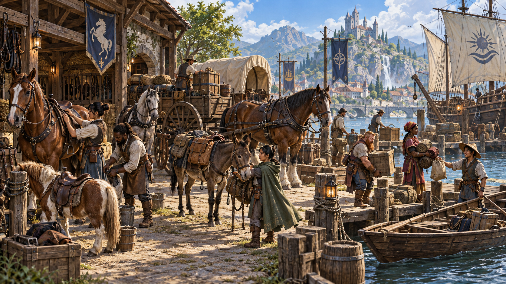

*Thú cưỡi và phương tiện giúp nhân vật vận chuyển người, hàng hóa và trang bị qua những quãng đường dài. Minh họa nguyên bản tạo bằng OpenAI ImageGen cho bản dịch này.*

Một thú cưỡi tốt giúp bạn đi nhanh hơn qua vùng hoang dã, nhưng mục đích chính là chở trang bị vốn sẽ làm bạn chậm lại. Bảng Thú cưỡi và động vật khác cho biết tốc độ và sức mang cơ sở của mỗi con vật.

Động vật kéo xe ngựa, xe kéo, chiến xa, xe trượt hoặc xe hàng có thể kéo khối lượng tối đa bằng năm lần sức mang cơ sở, kể cả khối lượng phương tiện. Nếu nhiều con cùng kéo một phương tiện, cộng sức mang của chúng với nhau.

Các thế giới D&D còn có thú cưỡi ngoài những loại liệt kê ở đây, nhưng chúng hiếm và thường không thể mua. Chúng gồm thú cưỡi bay (pegasus, griffon, hippogriff và những loài tương tự), thậm chí thú cưỡi dưới nước (ví dụ cá ngựa khổng lồ). Để có một con như vậy, bạn thường phải tìm được trứng rồi tự nuôi lớn, thỏa thuận với một thực thể quyền năng, hoặc thương lượng với chính thú cưỡi.

**Giáp thú (Barding).** Đây là giáp thiết kế để bảo vệ đầu, cổ, ngực và thân của động vật. Có thể mua bất kỳ loại giáp nào trong bảng Giáp của chương này dưới dạng giáp thú. Giá gấp bốn lần loại tương đương dành cho sinh vật dạng người, và khối lượng gấp đôi.

**Yên (Saddles).** Yên quân đội nâng đỡ người cưỡi, giúp bạn giữ chỗ ngồi trên thú cưỡi đang hoạt động trong chiến đấu. Nó cho lợi thế đối với mọi kiểm tra để tiếp tục ở trên thú cưỡi. Phải có yên ngoại lai để cưỡi bất kỳ thú cưỡi bay hoặc dưới nước nào.

**Thành thạo phương tiện (Vehicle Proficiency).** Nếu thành thạo một loại phương tiện nhất định (đường bộ hoặc đường thủy), bạn có thể cộng thưởng thành thạo vào mọi kiểm tra để điều khiển loại ấy trong hoàn cảnh khó khăn.

| Động vật | Giá | Tốc độ | Sức mang |
| --- | --- | --- | --- |
| Lạc đà | 50 gp | 50 ft | 480 lb |
| Lừa/la | 8 gp | 40 ft | 420 lb |
| Voi | 200 gp | 40 ft | 1.320 lb |
| Ngựa kéo | 50 gp | 40 ft | 540 lb |
| Ngựa cưỡi | 75 gp | 60 ft | 480 lb |
| Mastiff | 25 gp | 40 ft | 195 lb |
| Pony | 30 gp | 40 ft | 225 lb |
| Ngựa chiến | 400 gp | 60 ft | 540 lb |

| Phương tiện nước | Giá | Tốc độ |
| --- | --- | --- |
| Galley | 30.000 gp | 4 mph |
| Keelboat | 3.000 gp | 1 mph |
| Longship | 10.000 gp | 3 mph |
| Rowboat | 50 gp | 1½ mph |
| Sailing ship | 10.000 gp | 2 mph |
| Warship | 25.000 gp | 2½ mph |

### Đồ cưỡi, bộ kéo và phương tiện kéo

| Vật phẩm | Giá | Khối lượng |
| --- | --- | --- |
| Giáp thú (Barding) | ×4 | ×2 |
| Hàm thiếc và dây cương | 2 gp | 1 lb. |
| Xe ngựa (Carriage) | 100 gp | 600 lb. |
| Xe kéo (Cart) | 15 gp | 200 lb. |
| Chiến xa (Chariot) | 250 gp | 100 lb. |
| Thức ăn thú (mỗi ngày) | 5 cp | 10 lb. |
| **Yên** | | |
| Yên ngoại lai (Exotic) | 60 gp | 40 lb. |
| Yên quân đội | 20 gp | 30 lb. |
| Yên chở hàng | 5 gp | 15 lb. |
| Yên cưỡi | 10 gp | 25 lb. |
| Túi yên | 4 gp | 8 lb. |
| Xe trượt | 20 gp | 300 lb. |
| Thuê chuồng (mỗi ngày) | 5 sp | — |
| Xe hàng (Wagon) | 35 gp | 400 lb. |

**Thuyền chèo (Rowed Vessels).** Thuyền keelboat và thuyền chèo được dùng trên hồ và sông. Nếu xuôi dòng, cộng tốc độ dòng chảy (thường là 3 mile mỗi giờ) vào tốc độ phương tiện. Không thể chèo những thuyền này ngược dòng chảy mạnh đáng kể, nhưng có thể dùng thú kéo trên bờ kéo chúng ngược dòng. Một thuyền chèo nặng 100 pound, trong trường hợp nhà phiêu lưu mang nó qua đường bộ.

## Hàng trao đổi, chi phí, dịch vụ

### Hàng trao đổi (Trade Goods)

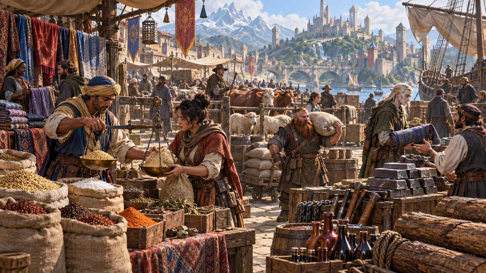

*Hàng trao đổi có giá trị thực dụng và thường được dùng thay tiền xu trong thương mại. Minh họa nguyên bản tạo bằng OpenAI ImageGen cho bản dịch này.*

Phần lớn của cải không tồn tại dưới dạng tiền xu. Nó được đo bằng gia súc, ngũ cốc, đất đai, quyền thu thuế hoặc quyền khai thác tài nguyên (chẳng hạn một mỏ hay khu rừng).

Các hội nghề, quý tộc và hoàng gia điều tiết thương mại. Những công ty được cấp đặc quyền có quyền giao thương theo một số tuyến đường, đưa tàu buôn đến những cảng nhất định, hoặc mua bán những hàng hóa cụ thể. Hội nghề ấn định giá hàng hóa hoặc dịch vụ mình kiểm soát và quyết định ai được hoặc không được cung cấp chúng. Thương nhân thường đổi hàng mà không dùng tiền. Bảng dưới đây cho biết giá trị của những hàng hóa thường được trao đổi.

| Giá | Hàng hóa |
| --- | --- |
| 1 cp | 1 lb. lúa mì |
| 2 cp | 1 lb. bột mì hoặc một con gà |
| 5 cp | 1 lb. muối |
| 1 sp | 1 lb. sắt hoặc 1 yard vuông vải bạt |
| 5 sp | 1 lb. đồng hoặc 1 yard vuông vải cotton |
| 1 gp | 1 lb. gừng hoặc một con dê |
| 2 gp | 1 lb. quế hoặc tiêu, hoặc một con cừu |
| 3 gp | 1 lb. đinh hương hoặc một con lợn |
| 5 gp | 1 lb. bạc hoặc 1 yard vuông vải lanh |
| 10 gp | 1 yard vuông lụa hoặc một con bò |
| 15 gp | 1 lb. nghệ tây hoặc một con bò kéo |
| 50 gp | 1 lb. vàng |
| 500 gp | 1 lb. bạch kim |

### Chi phí (Expenses)

Khi không xuống sâu trong lòng đất, khám phá phế tích để tìm kho báu thất lạc hoặc chiến đấu chống bóng tối đang lan tới, nhà phiêu lưu phải đối mặt với những thực tế đời thường hơn. Ngay cả trong thế giới kỳ ảo, con người vẫn cần những nhu yếu phẩm cơ bản như nơi ở, thức ăn và quần áo. Những thứ ấy tốn tiền, dù một số lối sống đắt hơn những lối sống khác.

### Chi phí lối sống (Lifestyle Expenses)

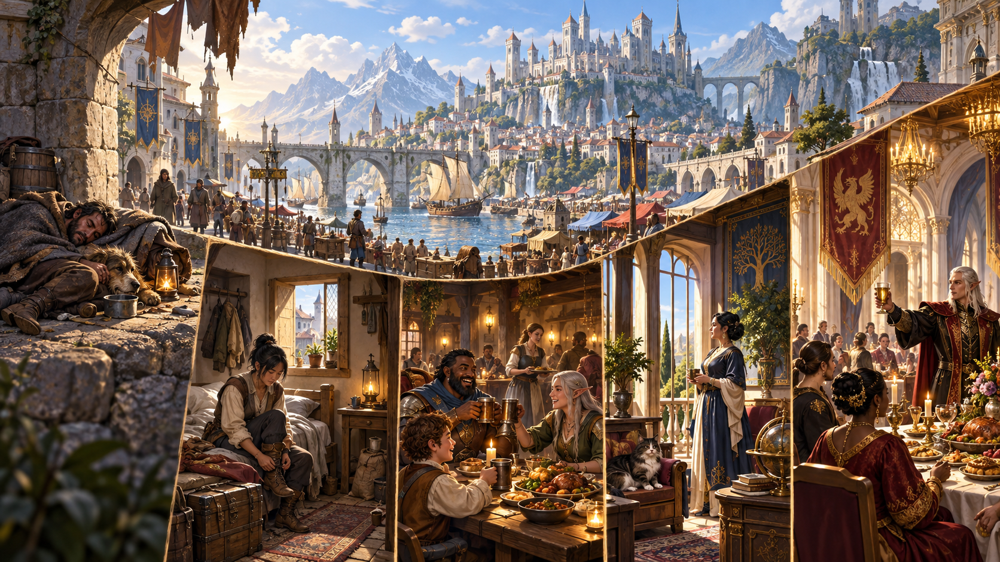

*Chi phí lối sống phản ánh nơi ở, thức ăn, quan hệ xã hội và mức tiện nghi giữa các cuộc phiêu lưu. Minh họa nguyên bản tạo bằng OpenAI ImageGen cho bản dịch này.*

Chi phí lối sống là cách đơn giản để tính chi phí sinh hoạt trong thế giới kỳ ảo. Chúng bao gồm chỗ ở, thức ăn, đồ uống và mọi nhu yếu phẩm khác. Chúng cũng bao gồm chi phí bảo dưỡng trang bị, để bạn sẵn sàng khi cuộc phiêu lưu tiếp theo gọi đến.

Vào đầu mỗi tuần hoặc tháng (tùy bạn chọn), chọn một lối sống từ bảng và trả tiền để duy trì nó. Giá ghi trong bảng là giá mỗi ngày; nếu tính chi phí cho 30 ngày, nhân giá với 30. Bạn có thể đổi lối sống giữa các kỳ tùy số tiền sẵn có, hoặc giữ nguyên trong suốt sự nghiệp của nhân vật.

Lựa chọn này có thể tạo hệ quả. Duy trì lối sống giàu có giúp bạn kết giao người giàu và quyền thế, nhưng cũng có nguy cơ thu hút kẻ trộm. Sống tiết kiệm giúp tránh tội phạm, nhưng khó tạo quan hệ quyền lực.

| Lối sống | Giá/ngày |
| --- | --- |
| Khốn cùng | - |
| Bẩn thỉu | 1 sp |
| Nghèo | 2 sp |
| Vừa phải | 1 gp |
| Thoải mái | 2 gp |
| Giàu có | 4 gp |
| Quý tộc | tối thiểu 10 gp |

**Khốn cùng (Wretched).** Bạn sống trong những điều kiện phi nhân đạo. Không có nơi gọi là nhà, bạn trú ở bất cứ đâu có thể: lẻn vào kho thóc, co ro trong những thùng cũ và trông cậy vào lòng tốt của người khá giả hơn. Lối sống này đầy nguy hiểm. Bạo lực, bệnh tật và đói khát theo bạn khắp nơi. Những người khốn cùng khác thèm muốn giáp, vũ khí và đồ phiêu lưu của bạn, vì với họ chúng là cả một gia tài. Phần lớn mọi người chẳng buồn để ý đến bạn.

**Bẩn thỉu (Squalid).** Bạn sống trong chuồng dột, căn lều nền đất ngay ngoài thị trấn, hoặc nhà trọ đầy sâu bọ ở khu tồi tệ nhất. Bạn có chỗ tránh thời tiết nhưng sống trong môi trường tuyệt vọng, thường xuyên bạo lực, đầy bệnh tật, đói khát và bất hạnh. Phần lớn mọi người chẳng để ý đến bạn, và bạn ít được pháp luật bảo vệ. Hầu hết người sống ở mức này từng gặp một biến cố khủng khiếp; họ có thể mắc vấn đề tâm thần, bị lưu đày hoặc chịu bệnh tật.

**Nghèo (Poor).** Bạn thiếu những tiện nghi của một cộng đồng ổn định. Thức ăn và nơi ở đơn giản, quần áo sờn rách cùng điều kiện bất định tạo nên cuộc sống đủ dùng, nhưng có lẽ khó chịu. Chỗ ở có thể là phòng trong nhà trọ rẻ tiền hoặc phòng chung phía trên quán rượu. Bạn có một số sự bảo vệ pháp lý nhưng vẫn phải đối phó bạo lực, tội phạm và bệnh tật. Người ở mức này thường là lao động không có tay nghề, người bán rau quả, người bán rong, kẻ trộm, lính đánh thuê và những người bị xem là thiếu danh giá khác.

**Vừa phải (Modest).** Lối sống này giúp bạn tránh khu ổ chuột và bảo đảm duy trì được trang bị. Bạn sống trong khu phố cũ, thuê phòng tại nhà trọ, quán trọ hoặc đền thờ. Bạn không đói khát; điều kiện sống sạch sẽ dù đơn giản. Những người thường sống ở mức này gồm binh sĩ có gia đình, người lao động, sinh viên, tư tế, pháp sư bình dân và những người tương tự.

**Thoải mái (Comfortable).** Bạn đủ tiền mua quần áo đẹp hơn và dễ dàng bảo dưỡng trang bị. Bạn sống trong một căn nhà nhỏ ở khu trung lưu hoặc phòng riêng của một quán trọ tốt. Bạn giao thiệp với thương nhân, thợ có tay nghề và sĩ quan.

**Giàu có (Wealthy).** Bạn sống xa hoa, dù có thể chưa đạt địa vị xã hội gắn với của cải lâu đời của quý tộc hoặc hoàng gia. Lối sống của bạn tương đương thương nhân rất thành đạt, người phục vụ được hoàng gia ưu ái hoặc chủ một vài cơ sở kinh doanh nhỏ. Bạn có nơi ở đáng trọng, thường là ngôi nhà rộng trong khu tốt hoặc một dãy phòng tiện nghi ở quán trọ tốt. Có lẽ bạn có một nhóm người hầu nhỏ.

**Quý tộc (Aristocratic).** Bạn sống sung túc và tiện nghi, giao thiệp với những người quyền lực nhất cộng đồng. Bạn có chỗ ở tuyệt vời, có lẽ là nhà phố ở khu đẹp nhất hoặc phòng tại quán trọ sang nhất. Bạn ăn ở nhà hàng tốt nhất, thuê thợ may lành nghề và hợp thời nhất, và có người hầu đáp ứng mọi nhu cầu. Bạn được mời dự những cuộc tụ họp của người giàu và quyền thế, dành buổi tối bên chính khách, người đứng đầu hội nghề, đại tư tế và quý tộc. Bạn cũng phải đối phó sự lừa dối và phản bội ở mức cao nhất. Càng giàu, bạn càng dễ bị kéo vào âm mưu chính trị, với tư cách quân cờ hoặc người tham gia.

### Thức ăn, đồ uống và chỗ trọ

Bảng này cho biết giá từng món ăn và một đêm trọ. Các khoản này đã nằm trong tổng chi phí lối sống của bạn.

| Vật phẩm | Giá |
| --- | --- |
| **Bia** | |
| Một gallon | 2 sp |
| Một cốc | 4 cp |
| Tiệc (mỗi người) | 10 gp |
| Bánh mì (một ổ) | 2 cp |
| Phô mai (một miếng) | 1 sp |
| **Trọ quán (mỗi ngày)** | |
| Bẩn thỉu | 7 cp |
| Nghèo | 1 sp |
| Vừa phải | 5 sp |
| Thoải mái | 8 sp |
| Giàu có | 2 gp |
| Quý tộc | 4 gp |
| **Bữa ăn (mỗi ngày)** | |
| Bẩn thỉu | 3 cp |
| Nghèo | 6 cp |
| Vừa phải | 3 sp |
| Thoải mái | 5 sp |
| Giàu có | 8 sp |
| Quý tộc | 2 gp |
| Thịt (một miếng) | 3 sp |
| **Rượu vang** | |
| Loại thường (bình) | 2 sp |
| Loại ngon (chai) | 10 gp |

### Dịch vụ

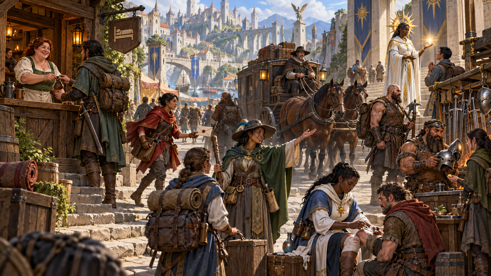

*Các dịch vụ thành thị cung cấp kỹ năng, vận chuyển, chỗ ở và hỗ trợ mà nhà phiêu lưu không tự làm được. Minh họa nguyên bản tạo bằng OpenAI ImageGen cho bản dịch này.*

Nhà phiêu lưu có thể trả tiền để nhân vật không phải người chơi giúp đỡ hoặc hành động thay mình trong nhiều hoàn cảnh. Phần lớn người được thuê có kỹ năng bình thường, nhưng một số là bậc thầy nghề thủ công hoặc nghệ thuật, và vài người có kỹ năng phiêu lưu chuyên biệt.

Bảng liệt kê những loại người làm thuê cơ bản nhất. Những người làm thuê thông dụng khác bao gồm đủ loại cư dân của thị trấn hoặc thành phố điển hình, khi được trả tiền để làm một việc cụ thể. Ví dụ, pháp sư có thể thuê thợ mộc làm một chiếc rương cầu kỳ (và bản sao thu nhỏ) để dùng với phép *Leomund’s secret chest*. Chiến binh có thể đặt thợ rèn làm thanh kiếm đặc biệt. Thi sĩ có thể thuê thợ may làm quần áo tinh xảo cho buổi biểu diễn sắp tới trước công tước.

Những người khác cung cấp dịch vụ chuyên môn cao hoặc nguy hiểm hơn. Lính đánh thuê được trả tiền để giúp nhà phiêu lưu đối đầu quân hobgoblin là người làm thuê, cũng như hiền giả được thuê nghiên cứu tri thức cổ xưa hoặc bí truyền. Nếu nhà phiêu lưu cấp cao lập một cứ điểm, họ có thể thuê cả đội ngũ người hầu và người đại diện vận hành nơi ấy, từ người quản lý lâu đài hoặc quản gia đến lao động dọn chuồng. Những người này thường có hợp đồng dài hạn, trong đó chỗ ở tại cứ điểm là một phần thù lao.

| Dịch vụ | Giá |
| --- | --- |
| Xe thuê giữa thị trấn | 3 cp/mile |
| Xe thuê trong thành phố | 1 cp |
| Người thuê có kỹ năng | 2 gp/ngày |
| Người thuê không kỹ năng | 2 sp/ngày |
| Người đưa thư | 2 cp/mile |
| Phí đường/cổng | 1 cp |
| Vé tàu | 1 sp/mile |

Người làm thuê có kỹ năng là bất kỳ ai được thuê cung cấp dịch vụ cần sự thành thạo (vũ khí, công cụ hoặc kỹ năng), chẳng hạn lính đánh thuê, thợ thủ công hoặc người chép sách. Giá trong bảng là mức tối thiểu; một số chuyên gia đòi cao hơn. Người không có kỹ năng được thuê làm việc tay chân không cần kỹ năng đặc biệt, như lao động, phu khuân vác, người giúp việc và những công việc tương tự.

### Dịch vụ thi triển phép (Spellcasting Services)

Người có khả năng thi triển phép không thuộc loại người làm thuê bình thường. Bạn có thể tìm được người chịu thi triển phép để đổi lấy tiền hoặc ân huệ, nhưng hiếm khi dễ dàng và không có mức thù lao cố định. Thông thường, bậc phép mong muốn càng cao thì người thi triển càng khó tìm và giá càng đắt.

Ở thành phố hoặc thị trấn, thuê người thi triển một phép tương đối phổ biến bậc 1 hoặc 2, như *cure wounds* hoặc *identify*, khá dễ; giá có thể từ 10 đến 50 đồng vàng, cộng chi phí mọi thành phần vật chất đắt tiền. Tìm người có khả năng và sẵn lòng thi triển phép bậc cao hơn có thể đòi hỏi đến một thành phố lớn, có lẽ nơi có đại học hoặc đền nổi tiếng. Khi tìm được, người thi triển có thể yêu cầu một dịch vụ thay tiền: việc chỉ nhà phiêu lưu có thể làm, như lấy một vật hiếm từ địa điểm nguy hiểm hoặc vượt vùng hoang dã đầy quái vật để đưa món quan trọng đến một khu định cư xa xôi.

### Tự túc (Self-Sufficiency)

Chi phí và lối sống trong chương này giả định bạn dành thời gian giữa những cuộc phiêu lưu ở thị trấn và sử dụng những dịch vụ đủ sức chi trả: mua thức ăn và chỗ ở, thuê người mài kiếm, sửa giáp, v.v. Tuy nhiên, một số nhân vật thích sống xa nền văn minh, tự nuôi mình ngoài hoang dã bằng săn bắn, hái lượm và tự sửa trang bị.

Duy trì lối sống ấy không cần tiêu tiền nhưng mất thời gian. Nếu dành thời gian giữa các cuộc phiêu lưu để hành nghề theo Chương 8, bạn có thể xoay xở mức sống tương đương lối sống nghèo. Thành thạo kỹ năng Sinh tồn cho phép sống ở mức tương đương lối sống thoải mái.

## Đồ lặt vặt (Trinkets)

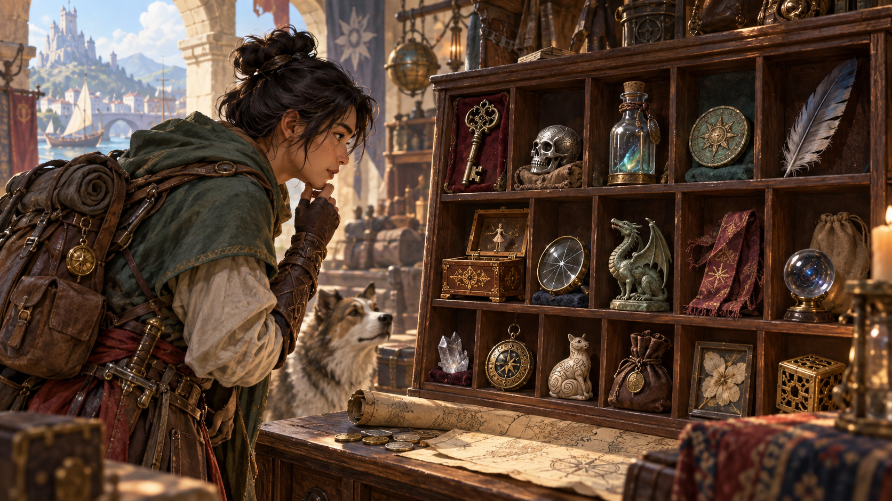

*Đồ lặt vặt là những vật nhỏ kỳ lạ có thể gợi mở ký ức, bí mật hoặc một câu chuyện mới. Minh họa nguyên bản tạo bằng OpenAI ImageGen cho bản dịch này.*

Khi tạo nhân vật, bạn có thể tung d100 một lần trên bảng Đồ lặt vặt để nhận một món đồ đơn giản có chút bí ẩn. DM cũng có thể dùng bảng này để thêm đồ vào một căn phòng trong hầm ngục hoặc túi của một sinh vật.

| d100 | Đồ lặt vặt |
| --- | --- |
| 01 | Bàn tay goblin ướp xác |
| 02 | Mảnh tinh thể phát sáng mờ dưới trăng |
| 03 | Đồng vàng đúc ở xứ không rõ |
| 04 | Nhật ký bằng ngôn ngữ bạn không biết |
| 05 | Vòng đồng không bao giờ xỉn |
| 06 | Quân cờ thủy tinh cũ |
| 07 | Một cặp xúc xắc làm từ xương khớp, mỗi viên có biểu tượng đầu lâu trên mặt thông thường mang sáu chấm |
| 08 | Tượng nhỏ sinh vật ác mộng gây giấc mơ bất an khi ngủ gần |
| 09 | Vòng cổ dây với bốn ngón tay elf ướp xác |
| 10 | Giấy chủ quyền đất ở cõi bạn không biết |
| 11 | Khối 1 ounce bằng vật liệu lạ |
| 12 | Búp bê vải nhỏ bị xiên kim |
| 13 | Răng thú lạ |
| 14 | Vảy khổng lồ, có lẽ của rồng |
| 15 | Lông vũ xanh lá rực rỡ |
| 16 | Lá bài bói cũ có chân dung bạn |
| 17 | Cầu thủy tinh đầy khói chuyển động |
| 18 | Trứng 1 lb vỏ đỏ tươi |
| 19 | Tẩu thổi bong bóng |
| 20 | Hũ thủy tinh có mẩu thịt lạ nổi trong dung dịch ngâm |
| 21 | Hộp nhạc gnome tí hon chơi bài bạn mơ hồ nhớ từ nhỏ |
| 22 | Tượng gỗ halfling tự mãn |
| 23 | Cầu đồng khắc rune lạ |
| 24 | Đĩa đá nhiều màu |
| 25 | Biểu tượng quạ bạc tí hon |
| 26 | Túi chứa 47 chiếc răng của sinh vật dạng người, trong đó một chiếc bị sâu |
| 27 | Mảnh obsidian luôn ấm |
| 28 | Móng vuốt xương rồng trên dây da thường |
| 29 | Đôi tất cũ |
| 30 | Sách trống không giữ mực, phấn, than chì hay dấu nào |
| 31 | Huy hiệu bạc sao năm cánh |
| 32 | Dao thuộc về người thân |
| 33 | Lọ thủy tinh đựng móng tay đã cắt |
| 34 | Thiết bị kim loại hình chữ nhật có hai cốc kim loại nhỏ ở một đầu, phát tia lửa khi bị ướt |
| 35 | Găng tay sequin trắng cỡ người |
| 36 | Áo ghi-lê có một trăm túi nhỏ |
| 37 | Khối đá nhỏ không trọng lượng |
| 38 | Chân dung phác goblin tí hon |
| 39 | Lọ thủy tinh rỗng mở ra có mùi nước hoa |
| 40 | Đá quý trông như cục than với mọi người trừ bạn |
| 41 | Mảnh vải cờ cũ |
| 42 | Phù hiệu cấp bậc của một lính quân đoàn bị thất lạc |
| 43 | Chuông bạc nhỏ không lưỡi |
| 44 | Chim hoàng yến máy trong một chiếc đèn do gnome chế tạo |
| 45 | Rương tí hon chạm như có nhiều chân dưới đáy |
| 46 | Sprite chết trong chai thủy tinh trong |
| 47 | Một lon kim loại không có lỗ mở, nhưng phát âm thanh như chứa đầy chất lỏng, cát, nhện hoặc kính vỡ (bạn chọn) |
| 48 | Quả cầu thủy tinh đầy nước, bên trong có cá vàng chạy bằng cơ cấu lên dây cót đang bơi |
| 49 | Thìa bạc khắc chữ M |
| 50 | Còi gỗ màu vàng kim |
| 51 | Bọ hung chết cỡ bàn tay |
| 52 | Hai lính đồ chơi, một mất đầu |
| 53 | Hộp nhỏ đầy cúc các cỡ |
| 54 | Nến không thể thắp |
| 55 | Lồng tí hon không cửa |
| 56 | Chìa khóa cũ |
| 57 | Bản đồ kho báu không thể giải mã |
| 58 | Chuôi kiếm gãy |
| 59 | Bàn chân thỏ |
| 60 | Mắt thủy tinh |
| 61 | Vật khắc cameo hình người xấu xí |
| 62 | Sọ bạc cỡ đồng xu |
| 63 | Mặt nạ alabaster |
| 64 | Kim tự tháp hương đen dính, mùi rất tệ |
| 65 | Mũ ngủ đội vào có mơ đẹp |
| 66 | Một caltrop bằng xương |
| 67 | Gọng kính một mắt vàng thiếu thấu kính |
| 68 | Một khối lập phương cạnh 1 inch, mỗi mặt được sơn một màu khác nhau |
| 69 | Núm cửa pha lê |
| 70 | Gói nhỏ đầy bụi hồng |
| 71 | Mảnh bài hát đẹp viết nốt nhạc trên hai tờ giấy da |
| 72 | Khuyên giọt lệ bạc làm từ giọt nước mắt thật |
| 73 | Vỏ trứng vẽ cảnh khổ đau con người chi tiết ám ảnh |
| 74 | Quạt mở ra hiện mèo ngủ |
| 75 | Bộ ống sáo xương |
| 76 | Cỏ bốn lá ép trong sách về cách cư xử và lễ nghi |
| 77 | Giấy da vẽ máy cơ khí phức tạp |
| 78 | Vỏ kiếm trang trí không vừa lưỡi nào tìm thấy |
| 79 | Thiệp mời tiệc nơi từng có án mạng |
| 80 | Một phù hiệu ngôi sao năm cánh (pentacle) bằng đồng thanh, khắc đầu chuột ở chính giữa |
| 81 | Khăn tay tím thêu tên archmage mạnh |
| 82 | Nửa sơ đồ sàn đền, lâu đài hoặc công trình |
| 83 | Mảnh vải gấp, mở ra thành mũ thời trang |
| 84 | Biên lai gửi tiền ngân hàng thành phố xa |
| 85 | Nhật ký thiếu bảy trang |
| 86 | Hộp hít thuốc bạc rỗng khắc “giấc mơ” |
| 87 | Thánh vật sắt của thần không rõ |
| 88 | Sách kể anh hùng huyền thoại thăng trầm, thiếu chương cuối |
| 89 | Lọ máu rồng |
| 90 | Mũi tên elf cổ |
| 91 | Kim không bao giờ cong |
| 92 | Trâm cài trang trí kiểu người lùn |
| 93 | Một chai rượu rỗng mang nhãn đẹp ghi “The Wizard of Wines Winery, Red Dragon Crush, 331422-W” (Xưởng rượu Pháp sư Rượu vang, Mẻ ép Rồng Đỏ, 331422-W) |
| 94 | Mảnh khảm phủ men nhiều màu |
| 95 | Chuột hóa đá |
| 96 | Cờ cướp biển đen có sọ rồng, xương chéo |
| 97 | Cua hoặc nhện máy tí hon di chuyển khi không bị quan sát |
| 98 | Hũ thủy tinh chứa mỡ lợn, nhãn ghi “Griffon Grease” (Mỡ Griffon) |
| 99 | Hộp gỗ đáy gốm có giun sống, mỗi đầu thân có một đầu |
| 100 | Bình kim loại đựng tro anh hùng |

---

*D&D Basic Rules (Version 1.0). Không được bán lại. Được phép in và sao chụp tài liệu này chỉ để sử dụng cá nhân.*
