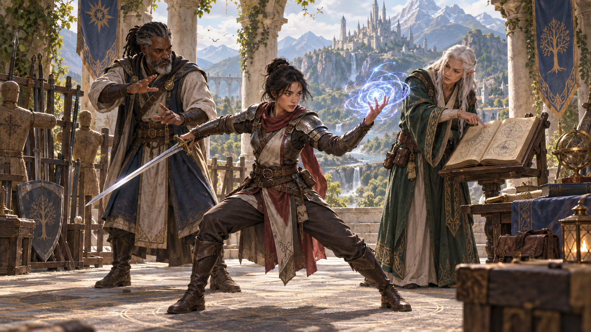
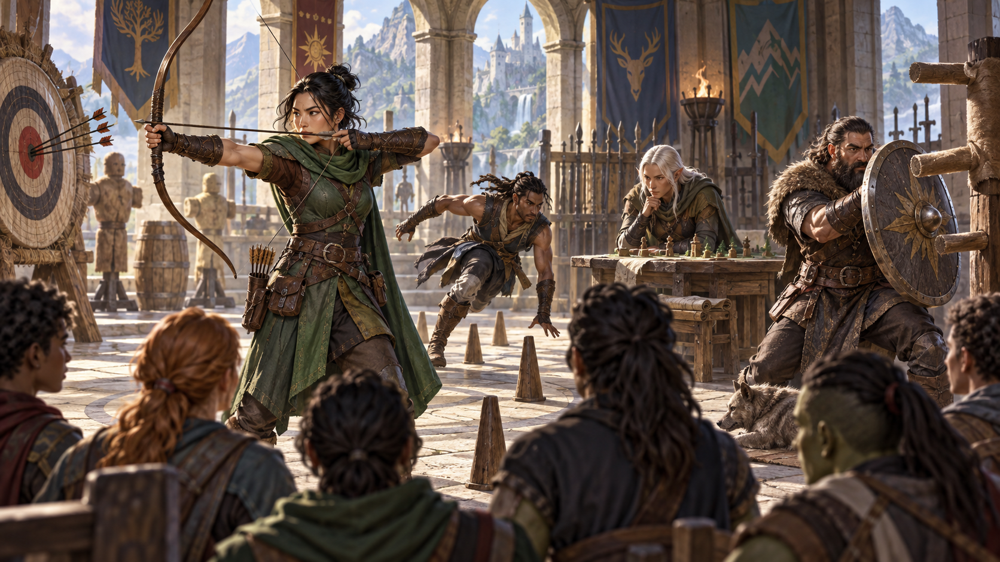

Nguồn: *D&D Basic Rules (Version 1.0), 2018*, trang 58.

*Các lựa chọn tùy chỉnh cho phép nhân vật phát triển theo con đường phù hợp với câu chuyện và lối chơi. Minh họa nguyên bản tạo bằng OpenAI ImageGen cho bản dịch này.*

Sự kết hợp giữa [điểm thuộc tính](99-glossary.md#ability-score), [chủng tộc](99-glossary.md#race), lớp và [xuất thân](99-glossary.md#background) xác định khả năng của nhân vật trong trò chơi; những chi tiết cá nhân bạn tạo phân biệt nhân vật ấy với mọi nhân vật khác. Ngay trong lớp và chủng tộc của mình, bạn vẫn có các lựa chọn để tinh chỉnh những gì nhân vật làm được. Nhưng một số người chơi, với sự cho phép của DM, muốn tiến thêm một bước.

Chương 6 của *Player’s Handbook* quy định hai bộ quy tắc tùy chọn để tùy chỉnh nhân vật: [đa lớp](99-glossary.md#multiclassing) và [kỳ tài](99-glossary.md#feat) (feat). Đa lớp cho phép kết hợp các lớp; kỳ tài là những lựa chọn đặc biệt có thể chọn thay cho tăng điểm thuộc tính khi lên cấp. DM quyết định liệu [chiến dịch](99-glossary.md#campaign) có cho phép các lựa chọn này hay không.

## Đa lớp (Multiclassing)

*Đa lớp kết hợp năng lực của nhiều [lớp nhân vật](99-glossary.md#class), đổi sự chuyên sâu lấy tính linh hoạt. Minh họa nguyên bản tạo bằng OpenAI ImageGen cho bản dịch này.*

Đa lớp cho phép bạn có cấp độ trong nhiều lớp. Nhờ đó, bạn kết hợp khả năng của các lớp để hiện thực hóa ý tưởng nhân vật mà một lớp tiêu chuẩn có thể không thể hiện được.

Theo quy tắc này, mỗi lần lên cấp, bạn có thể nhận một cấp trong lớp mới thay vì tăng cấp lớp hiện tại. Cộng cấp độ trong tất cả các lớp để xác định [cấp nhân vật](99-glossary.md#level). Ví dụ, có ba cấp [pháp sư](99-glossary.md#wizard) và hai cấp [chiến binh](99-glossary.md#fighter) thì bạn là nhân vật cấp 5.

Khi lên cấp, bạn có thể chủ yếu giữ lớp ban đầu và chỉ có vài cấp ở lớp khác, hoặc đổi hẳn hướng đi mà không quay lại lớp đã bỏ. Bạn thậm chí có thể bắt đầu tăng cấp trong lớp thứ ba hoặc thứ tư. So với nhân vật đơn lớp cùng cấp, bạn hy sinh một phần sự chuyên sâu để đổi lấy tính đa năng.

### Điều kiện tiên quyết (Prerequisites)

Để đủ điều kiện vào lớp mới, bạn phải đáp ứng điều kiện điểm thuộc tính của cả lớp hiện tại lẫn lớp mới, được ghi trong bảng Điều kiện tiên quyết đa lớp ở *Player’s Handbook*. Vì không trải qua toàn bộ quá trình đào tạo của nhân vật mới bắt đầu, bạn phải học nhanh trong lớp mới, với năng khiếu tự nhiên thể hiện qua điểm thuộc tính cao hơn trung bình.

### Điểm kinh nghiệm (Experience Points)

Số [điểm kinh nghiệm](99-glossary.md#experience-points) cần để lên cấp luôn dựa trên tổng cấp nhân vật, theo bảng Phát triển nhân vật ở Chương 1 của tài liệu này, chứ không dựa trên cấp của riêng một lớp.

### Điểm sinh lực và Xúc xắc Sinh lực (Hit Points and Hit Dice)

Bạn nhận [điểm sinh lực](99-glossary.md#hit-points) của lớp mới theo quy định dành cho các cấp sau cấp 1. Chỉ nhận điểm sinh lực cấp 1 của một lớp khi bạn là nhân vật cấp 1.

Cộng các Xúc xắc Sinh lực từ tất cả các lớp để tạo nguồn Xúc xắc Sinh lực của bạn. Nếu cùng loại xúc xắc, có thể gộp chung. Nếu các lớp cho các loại xúc xắc khác nhau, theo dõi từng loại riêng.

### Thưởng thành thạo (Proficiency Bonus)

Thưởng thành thạo luôn dựa trên tổng cấp nhân vật, theo bảng Phát triển nhân vật, không dựa trên cấp của riêng một lớp.

### Sự thành thạo (Proficiencies)

Khi nhận cấp trong một lớp khác lớp đầu tiên, bạn chỉ nhận một số [sự thành thạo](99-glossary.md#proficiency) khởi đầu của lớp ấy. Xem Chương 6 của *Player’s Handbook* để biết thêm.

### Đặc tính lớp (Class Features)

Khi nhận cấp mới trong một lớp, bạn nhận các đặc tính dành cho cấp ấy. Tuy nhiên, một số đặc tính có quy tắc bổ sung khi đa lớp. Xem Chương 6 của *Player’s Handbook* để biết thêm.

## Kỳ tài (Feats)

*Kỳ tài thể hiện một năng khiếu hoặc kỹ thuật đặc biệt được nhân vật rèn luyện đến mức nổi bật. Minh họa nguyên bản tạo bằng OpenAI ImageGen cho bản dịch này.*

Kỳ tài thể hiện một tài năng hoặc lĩnh vực chuyên môn đem lại khả năng đặc biệt cho nhân vật. Nó bao hàm đào tạo, kinh nghiệm và khả năng vượt ngoài những gì lớp cung cấp. Xem Chương 6 của *Player’s Handbook* để biết thêm.

Ở một số cấp, lớp cho bạn đặc tính Tăng điểm thuộc tính (Ability Score Improvement). Theo quy tắc kỳ tài tùy chọn, bạn có thể bỏ qua đặc tính đó để chọn một kỳ tài thay thế. Mỗi kỳ tài chỉ được chọn một lần, trừ khi mô tả của nó quy định khác.

Bạn phải đáp ứng mọi điều kiện tiên quyết được ghi trong kỳ tài để chọn nó. Nếu về sau mất một điều kiện tiên quyết, bạn không thể dùng kỳ tài cho đến khi đáp ứng lại điều kiện ấy.

---

*D&D Basic Rules (Version 1.0). Không được bán lại. Được phép in và sao chụp tài liệu này chỉ để sử dụng cá nhân.*
