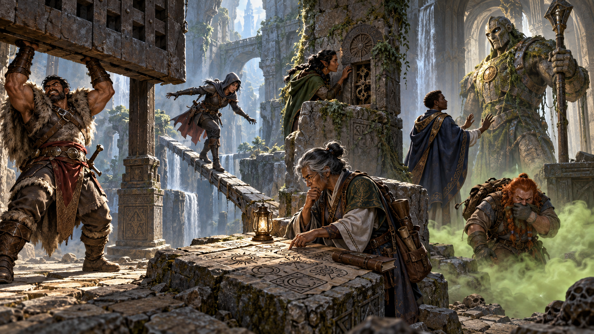
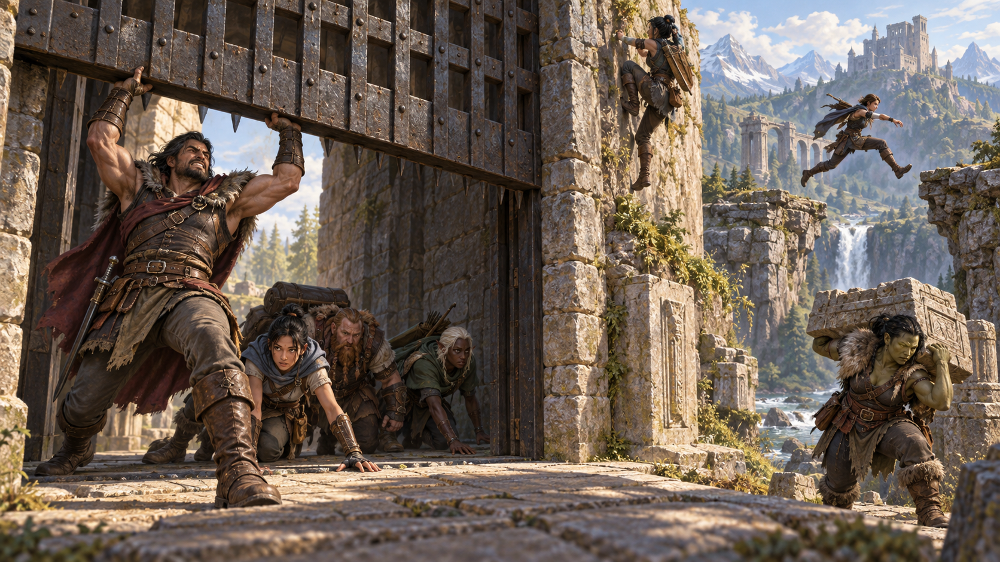
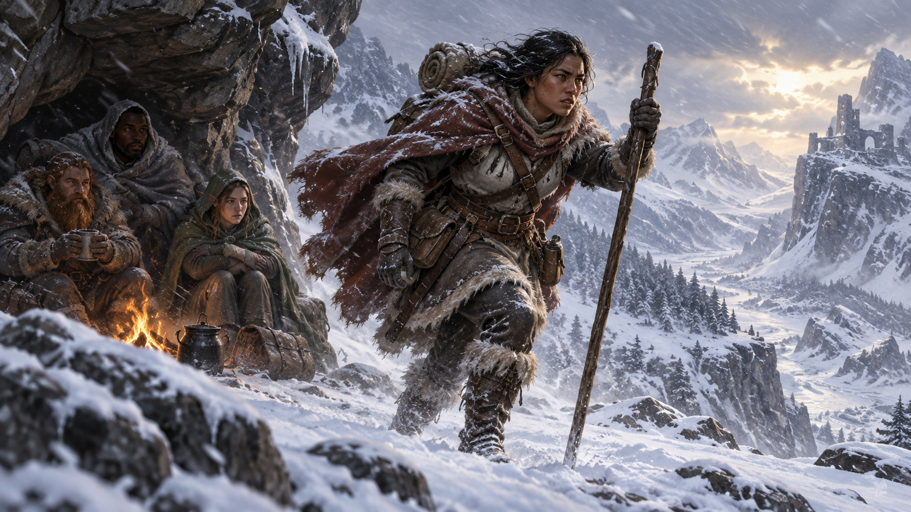
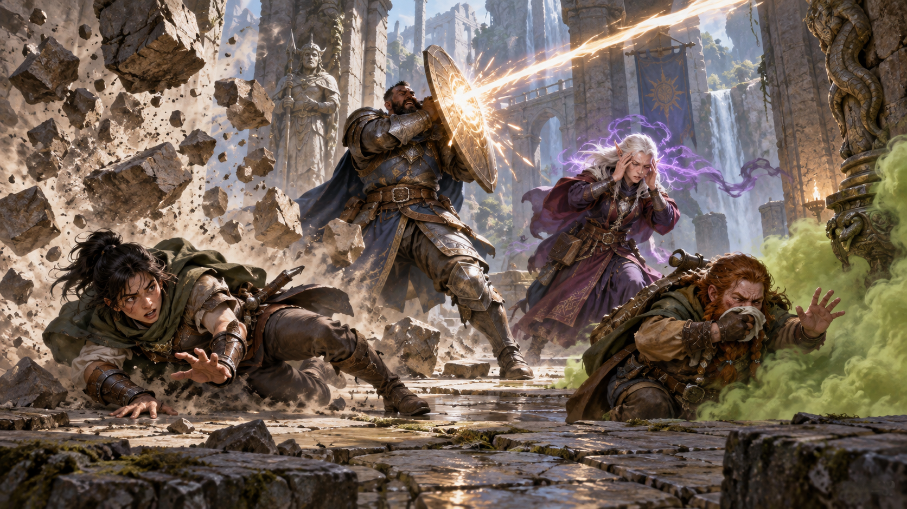

Nguồn: *D&D Basic Rules (Version 1.0), 2018*, trang 60-65.

*Các thuộc tính khác nhau cùng góp phần quyết định cách nhân vật vượt qua thử thách. Minh họa nguyên bản tạo bằng OpenAI ImageGen cho bản dịch này.*

Sáu thuộc tính mô tả ngắn gọn các đặc điểm thể chất và tinh thần của mọi sinh vật:

- **[Sức mạnh](99-glossary.md#strength) (Strength):** đo sức lực thể chất.
- **[Khéo léo](99-glossary.md#dexterity) (Dexterity):** đo sự nhanh nhẹn.
- **[Thể chất](99-glossary.md#constitution) (Constitution):** đo sức bền.
- **[Trí tuệ](99-glossary.md#intelligence) (Intelligence):** đo khả năng suy luận và trí nhớ.
- **[Minh triết](99-glossary.md#wisdom) (Wisdom):** đo khả năng nhận biết và thấu hiểu.
- **[Sức hút](99-glossary.md#charisma) (Charisma):** đo sức mạnh của tính cách.

Nhân vật có cơ bắp cuồn cuộn và sâu sắc không? Thông minh xuất chúng và duyên dáng? Nhanh nhẹn và dẻo dai? Điểm thuộc tính xác định những phẩm chất này: cả thế mạnh lẫn điểm yếu của một sinh vật.

Ba loại lần tung chính trong trò chơi — kiểm tra thuộc tính, [tung cứu nguy](99-glossary.md#saving-throw) và [tung tấn công](99-glossary.md#attack-roll) — đều dựa vào sáu [điểm thuộc tính](99-glossary.md#ability-score). Phần giới thiệu của sách mô tả quy tắc cơ bản của các lần tung này: tung một [d20](99-glossary.md#dice-notation), cộng [hệ số thuộc tính](99-glossary.md#modifier) được xác định từ một trong sáu điểm thuộc tính, rồi so sánh tổng với một con số mục tiêu.

Chương này tập trung vào cách dùng kiểm tra thuộc tính và tung cứu nguy, bao quát những hoạt động cơ bản mà sinh vật thực hiện trong trò chơi. Quy tắc về tung tấn công nằm ở chương 9.

## Điểm thuộc tính và hệ số (Ability Scores and Modifiers)

*Điểm thuộc tính và hệ số biến năng lực tự nhiên của nhân vật thành con số dùng trong luật chơi. Minh họa nguyên bản tạo bằng OpenAI ImageGen cho bản dịch này.*

Mỗi thuộc tính của một sinh vật có một điểm số, tức con số xác định mức độ của thuộc tính ấy. Điểm thuộc tính không chỉ đo khả năng bẩm sinh mà còn bao hàm việc huấn luyện và năng lực của sinh vật trong những hoạt động liên quan đến thuộc tính đó.

Điểm 10 hoặc 11 là mức trung bình thông thường của [con người](99-glossary.md#human), nhưng các [nhà phiêu lưu](99-glossary.md#adventurer) và nhiều [quái vật](99-glossary.md#monster) vượt mức trung bình ở phần lớn thuộc tính. Điểm 18 là mức cao nhất mà một người thường đạt được. Nhà phiêu lưu có thể có điểm cao đến 20, còn quái vật và những thực thể thần thánh có thể có điểm cao đến 30.

Mỗi thuộc tính cũng có một hệ số, được xác định từ điểm số, từ -5 (với điểm thuộc tính 1) đến +10 (với điểm 30). Bảng Điểm thuộc tính và hệ số ghi hệ số tương ứng với toàn bộ phạm vi điểm thuộc tính có thể có, từ 1 đến 30.

### Điểm thuộc tính và hệ số

| Điểm | Hệ số |
| --- | --- |
| 1 | -5 |
| 2-3 | -4 |
| 4-5 | -3 |
| 6-7 | -2 |
| 8-9 | -1 |
| 10-11 | +0 |
| 12-13 | +1 |
| 14-15 | +2 |
| 16-17 | +3 |
| 18-19 | +4 |
| 20-21 | +5 |
| 22-23 | +6 |
| 24-25 | +7 |
| 26-27 | +8 |
| 28-29 | +9 |
| 30 | +10 |

Để xác định hệ số thuộc tính mà không tra bảng, lấy điểm thuộc tính trừ 10, rồi chia kết quả cho 2, làm tròn xuống.

Vì hệ số thuộc tính ảnh hưởng đến gần như mọi lần tung tấn công, kiểm tra thuộc tính và tung cứu nguy, chúng xuất hiện trong lúc chơi thường xuyên hơn điểm thuộc tính tương ứng.

## [Lợi thế và bất lợi](99-glossary.md#advantage) (Advantage and Disadvantage)

*Hoàn cảnh thuận lợi hoặc bất lợi có thể làm thay đổi đáng kể cơ hội thành công. Minh họa nguyên bản tạo bằng OpenAI ImageGen cho bản dịch này.*

Đôi khi một khả năng đặc biệt hoặc phép cho biết bạn có lợi thế hoặc bất lợi trong một kiểm tra thuộc tính, lần tung cứu nguy hoặc lần tung tấn công. Khi đó, bạn tung thêm một d20 khi thực hiện lần tung ấy. Dùng kết quả cao hơn trong hai lần tung nếu có lợi thế, và kết quả thấp hơn nếu có bất lợi. Ví dụ, nếu có bất lợi và tung được 17 cùng 5, bạn dùng 5. Nếu thay vào đó có lợi thế và tung được hai số ấy, bạn dùng 17.

Nếu nhiều tình huống ảnh hưởng đến một lần tung và mỗi tình huống đều cho lợi thế hoặc gây bất lợi, bạn không tung thêm quá một d20. Chẳng hạn, nếu hai tình huống thuận lợi cùng cho lợi thế, bạn vẫn chỉ tung thêm một d20.

Nếu hoàn cảnh khiến một lần tung có cả lợi thế lẫn bất lợi, bạn được coi là không có cả hai và chỉ tung một d20. Điều này vẫn đúng ngay cả khi nhiều hoàn cảnh gây bất lợi nhưng chỉ một hoàn cảnh cho lợi thế, hoặc ngược lại. Trong tình huống như vậy, bạn không có lợi thế cũng không có bất lợi.

Khi bạn có lợi thế hoặc bất lợi và một yếu tố trong trò chơi, như đặc điểm May mắn (Lucky) của [halfling](99-glossary.md#halfling), cho phép tung lại hoặc thay thế d20, bạn chỉ có thể tung lại hoặc thay thế một trong hai xúc xắc. Bạn chọn xúc xắc nào. Ví dụ, nếu một halfling có lợi thế hoặc bất lợi trong kiểm tra thuộc tính và tung được 1 cùng 13, halfling ấy có thể dùng đặc điểm May mắn để tung lại xúc xắc ra 1.

Bạn thường nhận lợi thế hoặc bất lợi thông qua việc dùng khả năng đặc biệt, hành động hoặc phép. [Cảm hứng](99-glossary.md#inspiration) cũng có thể cho nhân vật lợi thế, như giải thích trong chương 4, “Tính cách và [xuất thân](99-glossary.md#background)”. DM cũng có thể quyết định rằng hoàn cảnh tác động thuận lợi hoặc bất lợi đến một lần tung, rồi cho lợi thế hoặc gây bất lợi tương ứng.

## Thưởng thành thạo (Proficiency Bonus)

*Thưởng thành thạo phản ánh kinh nghiệm huấn luyện mà nhân vật áp dụng vào nhiệm vụ phù hợp. Minh họa nguyên bản tạo bằng OpenAI ImageGen cho bản dịch này.*

Nhân vật có [thưởng thành thạo](99-glossary.md#proficiency) được xác định theo cấp, như trình bày chi tiết ở chương 1. Quái vật cũng có thưởng này, được tính sẵn trong [khối thông số](99-glossary.md#stat-block) của chúng. Thưởng này được dùng trong các quy tắc về kiểm tra thuộc tính, tung cứu nguy và tung tấn công.

Không được cộng thưởng thành thạo của bạn nhiều hơn một lần vào cùng một lần tung xúc xắc hoặc một con số khác. Ví dụ, nếu hai quy tắc khác nhau đều cho biết bạn có thể cộng thưởng thành thạo vào một lần tung cứu nguy Minh triết, bạn vẫn chỉ cộng thưởng ấy một lần khi tung cứu nguy.

Đôi khi thưởng thành thạo có thể được nhân hoặc chia trước khi áp dụng, chẳng hạn nhân đôi hoặc chia đôi. Ví dụ, đặc tính Chuyên môn (Expertise) của [đạo tặc](99-glossary.md#rogue) nhân đôi thưởng thành thạo cho một số kiểm tra thuộc tính. Nếu một hoàn cảnh khiến thưởng thành thạo có vẻ được áp dụng nhiều lần cho cùng một lần tung, bạn vẫn chỉ cộng nó một lần và chỉ nhân hoặc chia nó một lần.

Tương tự, nếu một đặc tính hoặc hiệu ứng cho phép nhân thưởng thành thạo khi thực hiện một kiểm tra thuộc tính vốn không được hưởng thưởng thành thạo, bạn vẫn không cộng thưởng ấy vào kiểm tra. Đối với kiểm tra đó, thưởng thành thạo của bạn là 0, bởi nhân 0 với bất kỳ số nào vẫn bằng 0. Ví dụ, nếu bạn không thành thạo kỹ năng Lịch sử, bạn không nhận lợi ích từ đặc tính cho phép nhân đôi thưởng thành thạo khi thực hiện kiểm tra Trí tuệ (Lịch sử).

Thông thường, bạn không nhân thưởng thành thạo cho các lần tung tấn công hoặc cứu nguy. Nếu một đặc tính hoặc hiệu ứng cho phép làm vậy, các quy tắc tương tự ở trên vẫn áp dụng.

## Kiểm tra thuộc tính (Ability Checks)

*Kiểm tra thuộc tính xác định nhân vật có vượt qua một thử thách chưa chắc chắn hay không. Minh họa nguyên bản tạo bằng OpenAI ImageGen cho bản dịch này.*

Kiểm tra thuộc tính kiểm nghiệm tài năng bẩm sinh và sự rèn luyện của nhân vật hoặc quái vật trong nỗ lực vượt qua một thử thách. DM yêu cầu kiểm tra thuộc tính khi nhân vật hoặc quái vật thử thực hiện một hành động, ngoài tấn công, có khả năng thất bại. Khi kết quả chưa chắc chắn, xúc xắc quyết định kết quả.

Với mỗi kiểm tra thuộc tính, DM quyết định thuộc tính nào trong sáu thuộc tính liên quan đến nhiệm vụ trước mắt và độ khó của nhiệm vụ, được biểu thị bằng Độ khó ([Difficulty Class](99-glossary.md#difficulty-class), DC). Nhiệm vụ càng khó, DC càng cao. Bảng Độ khó điển hình cho biết những DC thường gặp nhất.

### Độ khó điển hình (Typical Difficulty Classes)

| Độ khó của nhiệm vụ | DC |
| --- | --- |
| Rất dễ | 5 |
| Dễ | 10 |
| Trung bình | 15 |
| Khó | 20 |
| Rất khó | 25 |
| Gần như bất khả thi | 30 |

Để thực hiện kiểm tra thuộc tính, tung một d20 và cộng hệ số thuộc tính liên quan. Như với các lần tung d20 khác, áp dụng các khoản thưởng và phạt, rồi so sánh tổng với DC. Nếu tổng bằng hoặc vượt DC, kiểm tra thuộc tính thành công: sinh vật vượt qua thử thách trước mắt. Nếu không, kiểm tra thất bại, nghĩa là nhân vật hoặc quái vật không tiến gần hơn đến mục tiêu, hoặc có tiến triển nhưng kèm trở ngại do DM quyết định.

### Đối kháng (Contests)

Đôi khi nỗ lực của một nhân vật hoặc quái vật trực tiếp đối lập với nỗ lực của một nhân vật hoặc quái vật khác. Điều này có thể xảy ra khi cả hai cùng cố làm một việc và chỉ một bên có thể thành công, chẳng hạn giành lấy chiếc nhẫn ma thuật rơi trên sàn. Tình huống này cũng áp dụng khi một bên cố ngăn bên kia đạt mục tiêu, ví dụ khi quái vật cố đẩy mở một cánh cửa mà nhà phiêu lưu đang giữ đóng. Trong những tình huống như vậy, kết quả được xác định bằng một dạng kiểm tra thuộc tính đặc biệt, gọi là đối kháng.

Cả hai bên tham gia đối kháng thực hiện kiểm tra thuộc tính phù hợp với nỗ lực của mình. Họ áp dụng mọi khoản thưởng và phạt thích hợp, nhưng thay vì so sánh tổng với DC, họ so sánh tổng của hai kiểm tra với nhau. Bên có tổng kiểm tra cao hơn thắng đối kháng. Nhân vật hoặc quái vật ấy thực hiện thành công hành động, hoặc ngăn bên kia thành công.

Nếu đối kháng có kết quả hòa, tình trạng giữ nguyên như trước đối kháng. Vì vậy, một bên có thể mặc nhiên thắng đối kháng. Nếu hai nhân vật hòa khi giành chiếc nhẫn trên sàn, không ai lấy được nhẫn. Trong đối kháng giữa quái vật cố mở cửa và nhà phiêu lưu cố giữ cửa đóng, kết quả hòa nghĩa là cửa vẫn đóng.

### Kỹ năng (Skills)

Mỗi thuộc tính bao quát một phạm vi năng lực rộng, gồm những kỹ năng mà nhân vật hoặc quái vật có thể thành thạo. Một kỹ năng thể hiện một khía cạnh cụ thể của một điểm thuộc tính, và sự thành thạo kỹ năng của một cá nhân cho thấy sự tập trung vào khía cạnh ấy. Sự thành thạo kỹ năng khởi đầu của nhân vật được xác định khi tạo nhân vật; sự thành thạo kỹ năng của quái vật được ghi trong khối thông số của nó.

Ví dụ, kiểm tra Khéo léo có thể phản ánh nỗ lực thực hiện động tác nhào lộn, giấu một đồ vật trong lòng bàn tay hoặc giữ mình không bị phát hiện. Mỗi khía cạnh Khéo léo này có một kỹ năng tương ứng: Nhào lộn, Khéo tay và Lén lút. Vì vậy, nhân vật thành thạo kỹ năng Lén lút đặc biệt giỏi những kiểm tra Khéo léo liên quan đến di chuyển lén lút và ẩn nấp.

Các kỹ năng liên quan đến mỗi điểm thuộc tính được liệt kê dưới đây. Không có kỹ năng nào liên quan đến Thể chất. Xem mô tả từng thuộc tính ở các phần sau của chương này để biết ví dụ về cách dùng kỹ năng liên quan đến thuộc tính ấy.

**Sức mạnh (Strength)**

- Điền kinh (Athletics)

**Khéo léo (Dexterity)**

- Nhào lộn (Acrobatics)
- Khéo tay (Sleight of Hand)
- Lén lút (Stealth)

**Trí tuệ (Intelligence)**

- Huyền thuật (Arcana)
- Lịch sử (History)
- Điều tra (Investigation)
- Tự nhiên (Nature)
- Tôn giáo (Religion)

**Minh triết (Wisdom)**

- Xử lý động vật (Animal Handling)
- Thấu hiểu (Insight)
- Y học (Medicine)
- Tri giác (Perception)
- Sinh tồn (Survival)

**Sức hút (Charisma)**

- Lừa dối (Deception)
- Uy hiếp (Intimidation)
- Biểu diễn (Performance)
- Thuyết phục (Persuasion)

Đôi khi DM yêu cầu kiểm tra thuộc tính dùng một kỹ năng cụ thể, chẳng hạn: “Thực hiện kiểm tra Minh triết (Tri giác).” Lúc khác, người chơi có thể hỏi DM liệu sự thành thạo một kỹ năng cụ thể có áp dụng cho một kiểm tra hay không. Trong cả hai trường hợp, thành thạo kỹ năng nghĩa là cá nhân có thể cộng thưởng thành thạo vào các kiểm tra thuộc tính liên quan đến kỹ năng ấy. Nếu không thành thạo kỹ năng, cá nhân thực hiện kiểm tra thuộc tính thông thường.

Ví dụ, nếu nhân vật cố leo lên một vách đá nguy hiểm, [Dungeon Master](99-glossary.md#dungeon-master) có thể yêu cầu kiểm tra Sức mạnh (Điền kinh). Nếu nhân vật thành thạo Điền kinh, thưởng thành thạo của nhân vật được cộng vào kiểm tra Sức mạnh. Nếu không thành thạo, nhân vật chỉ thực hiện kiểm tra Sức mạnh.

### Quy tắc tùy chọn: Kỹ năng dùng thuộc tính khác (Variant: Skills with Different Abilities)

Thông thường, sự thành thạo một kỹ năng chỉ áp dụng cho một loại kiểm tra thuộc tính cụ thể. Ví dụ, thành thạo Điền kinh thường áp dụng cho kiểm tra Sức mạnh. Tuy nhiên, trong một số tình huống, sự thành thạo của bạn có thể hợp lý khi áp dụng cho loại kiểm tra khác. Khi đó, DM có thể yêu cầu kiểm tra kết hợp thuộc tính và kỹ năng theo cách khác thường, hoặc bạn có thể hỏi DM liệu mình được áp dụng sự thành thạo vào một kiểm tra khác hay không.

Ví dụ, nếu phải bơi từ một hòn đảo ngoài khơi về đất liền, DM có thể yêu cầu kiểm tra Thể chất để xem bạn có đủ sức bền bơi xa đến vậy không. Trong trường hợp này, DM có thể cho phép áp dụng sự thành thạo Điền kinh và yêu cầu kiểm tra Thể chất (Điền kinh). Vì vậy, nếu thành thạo Điền kinh, bạn cộng thưởng thành thạo vào kiểm tra Thể chất như thường làm với kiểm tra Sức mạnh (Điền kinh). Tương tự, khi [chiến binh](99-glossary.md#fighter) [người lùn](99-glossary.md#dwarf) của bạn phô diễn sức lực thuần túy để uy hiếp kẻ địch, DM có thể yêu cầu kiểm tra Sức mạnh (Uy hiếp), dù Uy hiếp thông thường gắn với Sức hút.

### Kiểm tra thụ động (Passive Checks)

Kiểm tra thụ động là một loại kiểm tra thuộc tính đặc biệt không cần tung xúc xắc. Kiểm tra này có thể thể hiện kết quả trung bình của một nhiệm vụ được làm lặp đi lặp lại, như liên tục tìm cửa bí mật; hoặc được dùng khi DM muốn bí mật xác định nhân vật có thành công ở một việc mà không tung xúc xắc, như nhận ra một quái vật đang ẩn nấp.

Cách xác định tổng kiểm tra thụ động của nhân vật là:

`10 + tất cả các hệ số và điều chỉnh thường áp dụng cho kiểm tra`

Nếu nhân vật có lợi thế trong kiểm tra, cộng 5. Nếu có bất lợi, trừ 5. Trò chơi gọi tổng kiểm tra thụ động là một điểm số.

Ví dụ, nếu nhân vật cấp 1 có Minh triết 15 và thành thạo Tri giác, nhân vật có điểm Minh triết (Tri giác) thụ động là 14.

Quy tắc ẩn nấp trong phần “Khéo léo” bên dưới dựa vào kiểm tra thụ động; quy tắc khám phá ở chương 8 cũng vậy.

### Phối hợp (Working Together)

*Phối hợp cho phép các nhân vật kết hợp thế mạnh để cùng hoàn thành một nhiệm vụ. Minh họa nguyên bản tạo bằng OpenAI ImageGen cho bản dịch này.*

Đôi khi hai hoặc nhiều nhân vật hợp sức để thử thực hiện một nhiệm vụ. Nhân vật dẫn dắt nỗ lực ấy, hoặc nhân vật có hệ số thuộc tính cao nhất, có thể thực hiện kiểm tra thuộc tính với lợi thế, phản ánh sự trợ giúp của các nhân vật khác. Trong chiến đấu, việc này đòi hỏi hành động Trợ giúp (Help), xem chương 9.

Nhân vật chỉ có thể trợ giúp nếu đó là nhiệm vụ mà bản thân có thể tự thử làm. Ví dụ, cố mở khóa đòi hỏi thành thạo dụng cụ kẻ trộm, nên nhân vật không có sự thành thạo ấy không thể giúp một nhân vật khác thực hiện nhiệm vụ đó. Hơn nữa, nhân vật chỉ có thể giúp khi hai hoặc nhiều cá nhân cùng làm thực sự mang lại hiệu quả. Một số nhiệm vụ, như xỏ chỉ qua lỗ kim, không dễ hơn khi được trợ giúp.

#### Kiểm tra nhóm (Group Checks)

Khi một số cá nhân cố cùng nhau hoàn thành việc gì đó với tư cách một nhóm, DM có thể yêu cầu kiểm tra thuộc tính theo nhóm. Trong tình huống này, những nhân vật giỏi nhiệm vụ ấy hỗ trợ bù đắp cho những người không giỏi.

Để thực hiện kiểm tra thuộc tính theo nhóm, mọi người trong nhóm đều thực hiện kiểm tra thuộc tính. Nếu ít nhất một nửa nhóm thành công, cả nhóm thành công. Nếu không, nhóm thất bại.

Kiểm tra nhóm không xuất hiện thường xuyên và hữu ích nhất khi mọi nhân vật cùng thành công hoặc thất bại với tư cách một nhóm. Ví dụ, khi các nhà phiêu lưu tìm đường qua đầm lầy, DM có thể yêu cầu kiểm tra Minh triết (Sinh tồn) theo nhóm để xem nhân vật có tránh được cát lún, hố sụt và những hiểm họa tự nhiên khác của môi trường hay không. Nếu ít nhất một nửa nhóm thành công, các nhân vật thành công có thể dẫn bạn đồng hành tránh nguy hiểm. Nếu không, nhóm vấp phải một trong những hiểm họa ấy.

## Sử dụng từng thuộc tính (Using Each Ability)

Mọi nhiệm vụ mà nhân vật hoặc quái vật có thể thử làm trong trò chơi đều thuộc phạm vi của một trong sáu thuộc tính. Phần này giải thích chi tiết hơn ý nghĩa các thuộc tính ấy và những cách dùng chúng trong trò chơi.

### Sức mạnh (Strength)

*Sức mạnh chi phối khả năng nâng, đẩy, kéo, phá và vận động bằng cơ bắp. Minh họa nguyên bản tạo bằng OpenAI ImageGen cho bản dịch này.*

Sức mạnh đo sức lực cơ thể, sự rèn luyện thể thao và mức độ bạn có thể vận dụng sức lực thể chất thuần túy.

#### Kiểm tra Sức mạnh (Strength Checks)

Kiểm tra Sức mạnh có thể mô phỏng bất kỳ nỗ lực nào nhằm nâng, đẩy, kéo hoặc phá một vật; ép cơ thể đi qua một khoảng không; hoặc vận dụng sức lực thuần túy vào một tình huống theo cách khác. Kỹ năng Điền kinh thể hiện năng khiếu ở một số loại kiểm tra Sức mạnh.

**Điền kinh (Athletics).** Kiểm tra Sức mạnh (Điền kinh) bao quát những tình huống khó khăn bạn gặp khi leo, nhảy hoặc bơi. Ví dụ gồm các hoạt động sau:

- Bạn cố leo một vách đá dựng đứng hoặc trơn trượt, tránh hiểm họa khi leo tường, hoặc bám vào một bề mặt trong khi thứ gì đó cố đánh bật bạn xuống.
- Bạn cố nhảy một khoảng cách dài khác thường hoặc thực hiện một động tác khó giữa cú nhảy.
- Bạn chật vật bơi hoặc giữ mình nổi trong dòng nước nguy hiểm, sóng do bão đánh hoặc khu vực rong biển dày đặc. Hoặc một sinh vật khác cố đẩy hay kéo bạn xuống nước, hoặc cản trở việc bơi của bạn theo cách khác.

**Các kiểm tra Sức mạnh khác (Other Strength Checks).** DM cũng có thể yêu cầu kiểm tra Sức mạnh khi bạn cố thực hiện những nhiệm vụ như sau:

- Đẩy mở cửa bị kẹt, bị khóa hoặc bị cài thanh chắn.
- Phá thoát khỏi dây trói.
- Ép mình đi qua đường hầm quá nhỏ.
- Bám vào xe ngựa khi đang bị kéo lê phía sau xe.
- Lật đổ một bức tượng.
- Giữ một tảng đá lớn không lăn.

#### Tung tấn công và sát thương (Attack Rolls and Damage)

Bạn cộng hệ số Sức mạnh vào lần tung tấn công và lần tung sát thương khi tấn công bằng [vũ khí cận chiến](99-glossary.md#melee-ranged) như chùy, rìu chiến hoặc lao. Bạn dùng vũ khí cận chiến để thực hiện các đòn tấn công cận chiến khi đánh giáp lá cà; một số vũ khí ấy cũng có thể được ném để thực hiện đòn tấn công tầm xa.

#### Nâng và mang (Lifting and Carrying)

Điểm Sức mạnh xác định khối lượng bạn có thể mang. Các thuật ngữ sau xác định những gì bạn có thể nâng hoặc mang.

**Sức mang (Carrying Capacity).** Sức mang bằng điểm Sức mạnh nhân 15. Đây là khối lượng, tương đương **6,75 kg × điểm Sức mạnh (15 pound × điểm Sức mạnh)**, bạn có thể mang; mức này đủ cao để phần lớn nhân vật thường không phải lo về nó.

**Đẩy, kéo hoặc nâng (Push, Drag, or Lift).** Bạn có thể đẩy, kéo hoặc nâng khối lượng tối đa bằng hai lần sức mang, tức **13,5 kg × điểm Sức mạnh (30 pound × điểm Sức mạnh)**. Khi đẩy hoặc kéo khối lượng vượt sức mang, tốc độ của bạn giảm xuống còn 1,5 m (5 feet).

**Kích cỡ và Sức mạnh (Size and Strength).** Sinh vật lớn hơn có thể mang khối lượng lớn hơn, còn sinh vật Tí hon (Tiny) mang ít hơn. Với mỗi bậc kích cỡ lớn hơn Trung bình (Medium), nhân đôi sức mang của sinh vật và khối lượng nó có thể đẩy, kéo hoặc nâng. Với sinh vật Tí hon, chia đôi các khối lượng này.

#### Quy tắc tùy chọn: Tải trọng (Variant: Encumbrance)

Quy tắc nâng và mang được chủ ý giữ đơn giản. Dưới đây là quy tắc tùy chọn nếu bạn muốn có quy định chi tiết hơn để xác định khối lượng trang bị cản trở nhân vật như thế nào. Khi dùng quy tắc tùy chọn này, bỏ qua cột Sức mạnh của bảng Giáp ở chương 5.

Nếu mang khối lượng vượt quá 5 lần điểm Sức mạnh, bạn bị **quá tải (encumbered)**, nghĩa là tốc độ giảm 3 m (10 feet).

Nếu mang khối lượng vượt quá 10 lần điểm Sức mạnh, đến mức sức mang tối đa, thay vào đó bạn bị **quá tải nặng (heavily encumbered)**, nghĩa là tốc độ giảm 6 m (20 feet) và bạn có bất lợi trong các kiểm tra thuộc tính, lần tung tấn công và lần tung cứu nguy dùng Sức mạnh, Khéo léo hoặc Thể chất.

### Khéo léo (Dexterity)

*Khéo léo thể hiện sự nhanh nhẹn, phản xạ, thăng bằng và độ chính xác. Minh họa nguyên bản tạo bằng OpenAI ImageGen cho bản dịch này.*

Khéo léo đo sự nhanh nhẹn, phản xạ và khả năng giữ thăng bằng.

#### Kiểm tra Khéo léo (Dexterity Checks)

Kiểm tra Khéo léo có thể mô phỏng bất kỳ nỗ lực nào nhằm di chuyển nhanh nhẹn, mau lẹ hoặc yên lặng, hay tránh ngã khi chỗ đặt chân không vững. Các kỹ năng Nhào lộn, Khéo tay và Lén lút thể hiện năng khiếu ở một số loại kiểm tra Khéo léo.

**Nhào lộn (Acrobatics).** Kiểm tra Khéo léo (Nhào lộn) bao quát nỗ lực đứng vững trong tình huống khó, như khi cố chạy qua một mặt băng, giữ thăng bằng trên dây căng hoặc đứng vững trên boong tàu chòng chành. DM cũng có thể yêu cầu kiểm tra Khéo léo (Nhào lộn) để xem bạn thực hiện được những động tác nhào lộn hay không, gồm lao mình, lăn, lộn nhào và bật lộn.

**Khéo tay (Sleight of Hand).** Bất cứ khi nào thử thực hiện trò khéo tay hoặc thủ thuật bằng tay, như lén đặt một vật lên người khác hoặc giấu đồ vật trên người mình, hãy thực hiện kiểm tra Khéo léo (Khéo tay). DM cũng có thể yêu cầu kiểm tra Khéo léo (Khéo tay) để xác định bạn có lấy được túi tiền của một người khác hoặc lén lấy thứ gì đó khỏi túi họ hay không.

**Lén lút (Stealth).** Thực hiện kiểm tra Khéo léo (Lén lút) khi cố giấu mình khỏi kẻ địch, lẻn qua lính gác, rời đi mà không bị chú ý hoặc lén đến gần một người mà không bị nhìn thấy hay nghe thấy.

**Các kiểm tra Khéo léo khác (Other Dexterity Checks).** DM có thể yêu cầu kiểm tra Khéo léo khi bạn cố thực hiện những nhiệm vụ như sau:

- Kiểm soát một xe chở nặng khi xuống dốc đứng.
- Điều khiển chiến xa qua một khúc cua gấp.
- Mở khóa.
- Vô hiệu hóa bẫy.
- Trói tù nhân thật chắc.
- Luồn lách thoát khỏi dây trói.
- Chơi một nhạc cụ dây.
- Chế tạo một đồ vật nhỏ hoặc có nhiều chi tiết.

#### Tung tấn công và sát thương (Attack Rolls and Damage)

Bạn cộng hệ số Khéo léo vào lần tung tấn công và lần tung sát thương khi tấn công bằng vũ khí tầm xa như ná hoặc cung dài. Bạn cũng có thể cộng hệ số Khéo léo vào lần tung tấn công và lần tung sát thương khi tấn công bằng vũ khí cận chiến có tính chất [Tinh xảo](99-glossary.md#finesse) (finesse), như dao găm hoặc [rapier](99-glossary.md#rapier).

#### Ẩn nấp (Hiding)

DM quyết định khi nào hoàn cảnh thích hợp để ẩn nấp. Khi cố ẩn nấp, thực hiện kiểm tra Khéo léo (Lén lút). Cho đến khi bị phát hiện hoặc ngừng ẩn nấp, tổng của kiểm tra ấy được đối kháng với kiểm tra Minh triết (Tri giác) của bất kỳ sinh vật nào chủ động tìm kiếm dấu hiệu về sự hiện diện của bạn.

Bạn không thể ẩn nấp khỏi một sinh vật nhìn thấy bạn rõ ràng, và bạn để lộ vị trí nếu gây tiếng động, như hét lời cảnh báo hoặc làm đổ một chiếc bình. Sinh vật vô hình không thể bị nhìn thấy, nên luôn có thể thử ẩn nấp. Tuy nhiên, dấu hiệu di chuyển của nó vẫn có thể bị nhận ra, và nó vẫn phải giữ yên lặng.

Trong chiến đấu, phần lớn sinh vật luôn cảnh giác với dấu hiệu nguy hiểm xung quanh; vì vậy, nếu bạn rời chỗ ẩn nấp và đến gần một sinh vật, nó thường nhìn thấy bạn. Tuy nhiên, trong một số hoàn cảnh, Dungeon Master có thể cho phép bạn tiếp tục không bị phát hiện khi đến gần một sinh vật đang phân tâm, nhờ đó có lợi thế trong một đòn tấn công trước khi bị nhìn thấy.

**[Tri giác thụ động](99-glossary.md#passive-perception) (Passive Perception).** Khi bạn ẩn nấp, vẫn có khả năng ai đó nhận ra bạn dù họ không tìm kiếm. Để xác định sinh vật như vậy có nhận ra bạn hay không, DM so sánh kiểm tra Khéo léo (Lén lút) của bạn với điểm Minh triết (Tri giác) thụ động của sinh vật ấy, bằng 10 + hệ số Minh triết của nó, cùng mọi khoản thưởng hoặc phạt khác. Nếu sinh vật có lợi thế, cộng 5. Nếu có bất lợi, trừ 5.

Ví dụ, nếu nhân vật cấp 1, với thưởng thành thạo +2, có Minh triết 15, tức hệ số +2, và thành thạo Tri giác, nhân vật có điểm Minh triết (Tri giác) thụ động là 14.

**Bạn có thể nhìn thấy gì? (What Can You See?)** Một trong những yếu tố chính để xác định bạn có thể tìm được một sinh vật hoặc đồ vật đang bị giấu hay không là khả năng nhìn trong khu vực ấy; khu vực có thể bị che khuất nhẹ hoặc nặng, như giải thích ở chương 8.

#### [Chỉ số giáp](99-glossary.md#armor-class) (Armor Class)

Tùy loại giáp đang mặc, bạn có thể cộng một phần hoặc toàn bộ hệ số Khéo léo vào Chỉ số giáp, như mô tả ở chương 5.

#### [Sáng kiến](99-glossary.md#initiative) (Initiative)

Khi bắt đầu mỗi trận chiến, bạn tung sáng kiến bằng cách thực hiện kiểm tra Khéo léo. Sáng kiến xác định thứ tự lượt của các sinh vật trong chiến đấu, như mô tả ở chương 9.

### Thể chất (Constitution)

*Thể chất đo sức khỏe, sức chịu đựng và khả năng chống lại gian khổ kéo dài. Minh họa nguyên bản tạo bằng OpenAI ImageGen cho bản dịch này.*

Thể chất đo sức khỏe, sức chịu đựng và sinh lực.

#### Kiểm tra Thể chất (Constitution Checks)

Kiểm tra Thể chất không thường gặp, và không kỹ năng nào áp dụng cho kiểm tra Thể chất, vì sức bền mà thuộc tính này thể hiện phần lớn mang tính thụ động, thay vì liên quan đến một nỗ lực cụ thể của nhân vật hoặc quái vật. Tuy nhiên, kiểm tra Thể chất có thể mô phỏng nỗ lực vượt quá giới hạn thông thường của bạn.

DM có thể yêu cầu kiểm tra Thể chất khi bạn cố thực hiện những nhiệm vụ như sau:

- Nín thở.
- Hành quân hoặc lao động nhiều giờ không nghỉ.
- Không ngủ.
- Sống sót mà không có thức ăn hoặc nước.
- Uống cạn cả một ca bia ale trong một lần.

#### Điểm sinh lực (Hit Points)

Hệ số Thể chất góp phần xác định [điểm sinh lực](99-glossary.md#hit-points) của bạn. Thông thường, bạn cộng hệ số Thể chất vào mỗi Xúc xắc Sinh lực được tung để xác định điểm sinh lực.

Nếu hệ số Thể chất thay đổi, điểm sinh lực tối đa cũng thay đổi, như thể bạn đã có hệ số mới từ cấp 1. Ví dụ, nếu tăng điểm Thể chất khi đạt cấp 4 và hệ số Thể chất tăng từ +1 lên +2, bạn điều chỉnh điểm sinh lực tối đa như thể hệ số luôn là +2. Vì vậy, bạn cộng thêm 3 điểm sinh lực cho ba cấp đầu, rồi tung điểm sinh lực cho cấp 4 bằng hệ số mới. Hoặc nếu đang ở cấp 7 và một hiệu ứng làm giảm điểm Thể chất khiến hệ số Thể chất giảm 1, điểm sinh lực tối đa giảm 7.

### Trí tuệ (Intelligence)

*Trí tuệ thể hiện khả năng ghi nhớ, suy luận, điều tra và vận dụng kiến thức. Minh họa nguyên bản tạo bằng OpenAI ImageGen cho bản dịch này.*

Trí tuệ đo sự nhạy bén tinh thần, độ chính xác của trí nhớ và khả năng suy luận.

#### Kiểm tra Trí tuệ (Intelligence Checks)

Kiểm tra Trí tuệ được dùng khi bạn cần vận dụng logic, kiến thức được học, trí nhớ hoặc suy luận diễn dịch. Các kỹ năng Huyền thuật, Lịch sử, Điều tra, Tự nhiên và Tôn giáo thể hiện năng khiếu ở một số loại kiểm tra Trí tuệ.

**Huyền thuật (Arcana).** Kiểm tra Trí tuệ (Huyền thuật) đo khả năng nhớ kiến thức về phép, [vật phẩm ma thuật](99-glossary.md#magic-item), biểu tượng huyền bí, truyền thống ma thuật, các [cõi tồn tại](99-glossary.md#plane) và cư dân của những cõi ấy.

**Lịch sử (History).** Kiểm tra Trí tuệ (Lịch sử) đo khả năng nhớ kiến thức về sự kiện lịch sử, nhân vật huyền thoại, vương quốc cổ, tranh chấp trong quá khứ, các cuộc chiến gần đây và những nền văn minh đã mất.

**Điều tra (Investigation).** Khi tìm kiếm manh mối xung quanh và suy luận dựa trên chúng, bạn thực hiện kiểm tra Trí tuệ (Điều tra). Bạn có thể suy ra vị trí một đồ vật bị giấu, nhận biết qua hình dạng vết thương loại vũ khí đã gây ra nó, hoặc xác định điểm yếu nhất trong đường hầm có thể khiến đường hầm sụp đổ. Việc nghiên cứu kỹ những cuộn giấy cổ để tìm một mẩu kiến thức ẩn giấu cũng có thể đòi hỏi kiểm tra Trí tuệ (Điều tra).

**Tự nhiên (Nature).** Kiểm tra Trí tuệ (Tự nhiên) đo khả năng nhớ kiến thức về địa hình, thực vật và động vật, thời tiết và các chu kỳ tự nhiên.

**Tôn giáo (Religion).** Kiểm tra Trí tuệ (Tôn giáo) đo khả năng nhớ kiến thức về các vị thần, nghi lễ và lời cầu nguyện, hệ thống cấp bậc tôn giáo, thánh vật và thực hành của những giáo phái bí mật.

**Các kiểm tra Trí tuệ khác (Other Intelligence Checks).** DM có thể yêu cầu kiểm tra Trí tuệ khi bạn cố thực hiện những nhiệm vụ như sau:

- Giao tiếp với một sinh vật mà không dùng lời nói.
- Ước tính giá trị của một vật quý.
- Chuẩn bị cách cải trang để giả làm lính gác thành phố.
- Làm giả tài liệu.
- Nhớ kiến thức về một nghề thủ công hoặc nghề nghiệp.
- Thắng một trò chơi đòi hỏi kỹ năng.

#### Thuộc tính [thi triển phép](99-glossary.md#spellcasting) (Spellcasting Ability)

Pháp sư dùng Trí tuệ làm thuộc tính thi triển phép; thuộc tính này góp phần xác định DC cứu nguy của các phép họ thi triển.

### Minh triết (Wisdom)

*Minh triết giúp nhân vật quan sát, cảm nhận ý định và nhận biết nguy hiểm. Minh họa nguyên bản tạo bằng OpenAI ImageGen cho bản dịch này.*

Minh triết phản ánh mức độ hòa nhịp của bạn với thế giới xung quanh, thể hiện khả năng nhận biết và trực giác.

#### Kiểm tra Minh triết (Wisdom Checks)

Kiểm tra Minh triết có thể phản ánh nỗ lực đọc ngôn ngữ cơ thể, hiểu cảm xúc của ai đó, nhận ra những điều trong môi trường hoặc chăm sóc người bị thương. Các kỹ năng Xử lý động vật, Thấu hiểu, Y học, Tri giác và Sinh tồn thể hiện năng khiếu ở một số loại kiểm tra Minh triết.

**Xử lý động vật (Animal Handling).** Khi chưa chắc bạn có thể làm một con vật đã thuần hóa bình tĩnh lại, giữ thú cưỡi không hoảng sợ hoặc trực giác nhận biết ý định của một con vật hay không, DM có thể yêu cầu kiểm tra Minh triết (Xử lý động vật). Bạn cũng thực hiện kiểm tra Minh triết (Xử lý động vật) để điều khiển thú cưỡi khi thử một động tác mạo hiểm.

**Thấu hiểu (Insight).** Kiểm tra Minh triết (Thấu hiểu) xác định bạn có nhận biết được ý định thật của một sinh vật hay không, chẳng hạn khi tìm ra lời nói dối hoặc dự đoán hành động tiếp theo của ai đó. Việc này đòi hỏi thu thập manh mối từ ngôn ngữ cơ thể, thói quen nói và thay đổi trong cách biểu hiện.

**Y học (Medicine).** Kiểm tra Minh triết (Y học) cho phép bạn thử ổn định một bạn đồng hành đang hấp hối hoặc chẩn đoán bệnh.

**Tri giác (Perception).** Kiểm tra Minh triết (Tri giác) cho phép bạn nhìn thấy, nghe thấy hoặc phát hiện sự hiện diện của một thứ bằng cách khác. Nó đo mức nhận biết chung của bạn về xung quanh và độ nhạy bén của giác quan. Ví dụ, bạn có thể cố nghe một cuộc trò chuyện qua cửa đóng, nghe lén dưới cửa sổ mở hoặc nghe quái vật di chuyển lén lút trong rừng. Hoặc bạn có thể cố phát hiện những thứ bị che khuất hay dễ bỏ sót, dù là [orc](99-glossary.md#orc) phục kích trên đường, côn đồ ẩn trong bóng tối của ngõ hẻm hay ánh nến bên dưới một cửa bí mật đang đóng.

**Sinh tồn (Survival).** DM có thể yêu cầu kiểm tra Minh triết (Sinh tồn) để lần theo dấu vết, săn thú hoang, dẫn nhóm qua vùng hoang vu băng giá, nhận biết dấu hiệu owlbear sống gần đó, dự đoán thời tiết hoặc tránh cát lún và những hiểm họa tự nhiên khác.

**Các kiểm tra Minh triết khác (Other Wisdom Checks).** DM có thể yêu cầu kiểm tra Minh triết khi bạn cố thực hiện những nhiệm vụ như sau:

- Cảm nhận bằng trực giác hướng hành động nên theo.
- Nhận biết một sinh vật có vẻ đã chết hoặc còn sống có phải [xác sống](99-glossary.md#undead) hay không.

#### Tìm đồ vật bị giấu (Finding a Hidden Object)

Khi nhân vật tìm một đồ vật bị giấu, như cửa bí mật hoặc bẫy, DM thường yêu cầu kiểm tra Minh triết (Tri giác). Kiểm tra như vậy có thể được dùng để tìm những chi tiết ẩn, hoặc thông tin và manh mối mà bạn có thể bỏ qua nếu không kiểm tra.

Trong phần lớn trường hợp, bạn cần mô tả nơi đang tìm để DM xác định khả năng thành công. Ví dụ, một chiếc chìa khóa được giấu dưới chồng quần áo gấp trong ngăn kéo trên cùng của tủ. Nếu nói với DM rằng bạn đi quanh phòng, quan sát tường và đồ đạc để tìm manh mối, bạn không có cơ hội tìm được chìa khóa, bất kể kết quả kiểm tra Minh triết (Tri giác). Bạn phải nói rõ mình mở các ngăn kéo hoặc lục tìm trong tủ thì mới có cơ hội thành công.

#### Thuộc tính thi triển phép (Spellcasting Ability)

Giáo sĩ dùng Minh triết làm thuộc tính thi triển phép; thuộc tính này góp phần xác định DC cứu nguy của các phép họ thi triển.

### Sức hút (Charisma)

*Sức hút thể hiện năng lực gây ảnh hưởng, thuyết phục, biểu diễn và dẫn dắt. Minh họa nguyên bản tạo bằng OpenAI ImageGen cho bản dịch này.*

Sức hút đo khả năng tương tác hiệu quả với người khác. Nó bao gồm các yếu tố như sự tự tin và tài ăn nói, và có thể thể hiện một tính cách duyên dáng hoặc đầy uy quyền.

#### Kiểm tra Sức hút (Charisma Checks)

Kiểm tra Sức hút có thể xuất hiện khi bạn cố tác động hoặc mua vui cho người khác, khi cố gây ấn tượng hoặc nói dối một cách thuyết phục, hay khi xử lý một tình huống xã hội khó. Các kỹ năng Lừa dối, Uy hiếp, Biểu diễn và Thuyết phục thể hiện năng khiếu ở một số loại kiểm tra Sức hút.

**Lừa dối (Deception).** Kiểm tra Sức hút (Lừa dối) xác định bạn có che giấu sự thật một cách thuyết phục, bằng lời nói hoặc hành động, hay không. Sự lừa dối này có thể bao quát mọi thứ từ khiến người khác hiểu sai bằng lời mập mờ đến nói dối trắng trợn. Những tình huống điển hình gồm nói khéo để qua mặt lính gác, lừa thương nhân, kiếm tiền bằng cờ bạc, giả làm người khác qua cải trang, làm dịu sự nghi ngờ của ai đó bằng lời trấn an giả dối hoặc giữ vẻ mặt thản nhiên khi nói dối trắng trợn.

**Uy hiếp (Intimidation).** Khi cố tác động đến ai đó bằng lời đe dọa công khai, hành động thù địch và bạo lực thể chất, DM có thể yêu cầu kiểm tra Sức hút (Uy hiếp). Ví dụ gồm cố moi thông tin từ tù nhân, thuyết phục côn đồ đường phố rút khỏi cuộc đối đầu hoặc dùng cạnh sắc của chai vỡ để thuyết phục một tể tướng đang cười khẩy xem xét lại quyết định.

**Biểu diễn (Performance).** Kiểm tra Sức hút (Biểu diễn) xác định bạn làm khán giả thích thú đến mức nào bằng âm nhạc, điệu nhảy, diễn xuất, kể chuyện hoặc một hình thức giải trí khác.

**Thuyết phục (Persuasion).** Khi cố tác động đến một người hoặc nhóm người bằng sự tế nhị, cách cư xử khéo léo hoặc thiện ý, DM có thể yêu cầu kiểm tra Sức hút (Thuyết phục). Bạn thường dùng thuyết phục khi hành động với thiện chí, nhằm tạo tình bạn, đưa ra lời đề nghị thân thiện hoặc thể hiện phép lịch sự đúng mực. Ví dụ về thuyết phục gồm làm cho quan quản cung cho phép nhóm bạn gặp nhà vua, đàm phán hòa bình giữa các bộ tộc đang chiến tranh hoặc truyền cảm hứng cho một đám đông dân thị trấn.

**Các kiểm tra Sức hút khác (Other Charisma Checks).** DM có thể yêu cầu kiểm tra Sức hút khi bạn cố thực hiện những nhiệm vụ như sau:

- Tìm người thích hợp nhất để hỏi tin tức, tin đồn và chuyện bàn tán.
- Hòa vào đám đông để nắm được các chủ đề trò chuyện chính.

#### Thuộc tính thi triển phép (Spellcasting Ability)

Thi sĩ, [thánh kỵ sĩ](99-glossary.md#paladin), sorcerer và [warlock](99-glossary.md#warlock) dùng Sức hút làm thuộc tính thi triển phép; thuộc tính này góp phần xác định DC cứu nguy của các phép họ thi triển.

## Tung cứu nguy (Saving Throws)

*Tung cứu nguy thể hiện phản ứng phòng vệ trước phép thuật, độc tố, bẫy và những hiểm họa bất ngờ. Minh họa nguyên bản tạo bằng OpenAI ImageGen cho bản dịch này.*

Một lần tung cứu nguy, cũng gọi ngắn gọn là cứu nguy (save), thể hiện nỗ lực chống lại một phép, bẫy, chất độc, bệnh hoặc mối đe dọa tương tự. Thông thường bạn không tự quyết định tung cứu nguy; bạn bị buộc phải tung vì nhân vật hoặc quái vật của mình có nguy cơ chịu tổn hại.

Để tung cứu nguy, tung một d20 và cộng hệ số thuộc tính thích hợp. Ví dụ, bạn dùng hệ số Khéo léo cho lần tung cứu nguy Khéo léo.

Lần tung cứu nguy có thể được điều chỉnh bởi khoản thưởng hoặc phạt theo tình huống, và có thể chịu ảnh hưởng của lợi thế hoặc bất lợi, do DM quyết định.

Mỗi lớp cho sự thành thạo ít nhất hai loại cứu nguy. Ví dụ, [pháp sư](99-glossary.md#wizard) thành thạo cứu nguy Trí tuệ. Như với sự thành thạo kỹ năng, thành thạo một loại cứu nguy cho phép nhân vật cộng thưởng thành thạo vào các lần tung cứu nguy dùng một điểm thuộc tính cụ thể. Một số quái vật cũng thành thạo các loại cứu nguy.

DC của một lần tung cứu nguy được xác định bởi hiệu ứng gây ra nó. Ví dụ, DC của lần tung cứu nguy mà một phép cho phép thực hiện được xác định bởi thuộc tính thi triển phép và thưởng thành thạo của người thi triển.

Kết quả của một lần tung cứu nguy thành công hoặc thất bại cũng được trình bày chi tiết trong hiệu ứng cho phép tung cứu nguy. Thông thường, cứu nguy thành công nghĩa là sinh vật không chịu tổn hại hoặc chịu tổn hại giảm đi từ hiệu ứng.

---

*D&D Basic Rules (Version 1.0). Không được bán lại. Được phép in và sao chụp tài liệu này chỉ để sử dụng cá nhân.*
