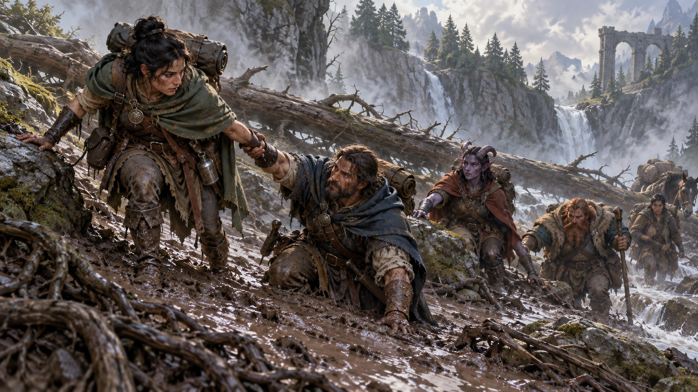
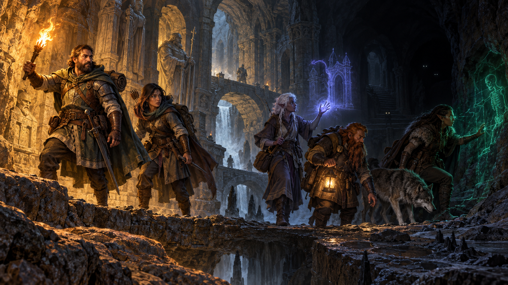
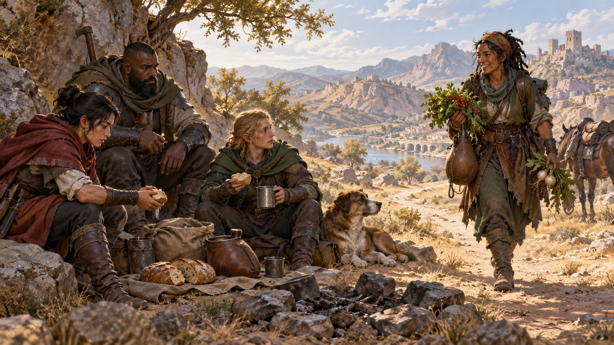
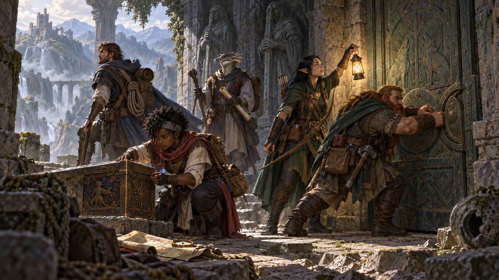
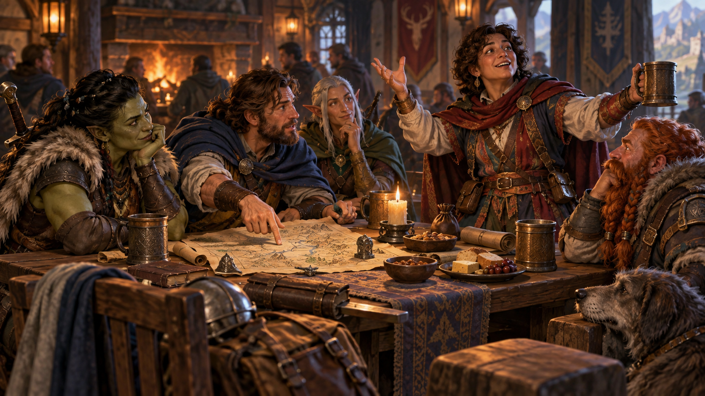
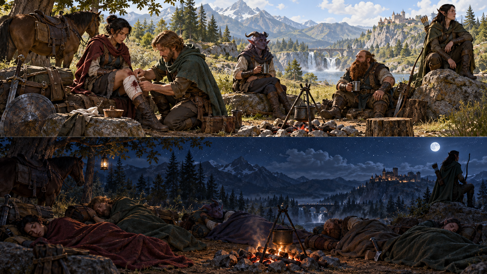
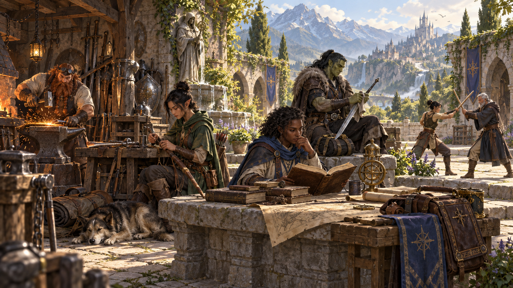

Nguồn: *D&D Basic Rules (Version 1.0), 2018*, trang 66-71.

*Phiêu lưu là hành trình qua những miền đất mới, nơi thời gian, địa hình, hiểm họa và con người đều định hình câu chuyện. Minh họa nguyên bản tạo bằng OpenAI ImageGen cho bản dịch này.*

Thám hiểm Tomb of Horrors cổ xưa, lẻn qua những ngõ hẻm phía sau của Waterdeep, phát quang một lối đi mới xuyên rừng rậm trên Isle of Dread — đó là những điều tạo nên các cuộc phiêu lưu trong Dungeons & Dragons. Nhân vật của bạn có thể khám phá những phế tích bị lãng quên và vùng đất chưa được lập bản đồ, vạch trần bí mật đen tối và âm mưu hiểm độc, tiêu diệt những quái vật ghê tởm. Và nếu mọi chuyện thuận lợi, nhân vật sẽ sống sót để nhận những phần thưởng hậu hĩnh trước khi lên đường cho một cuộc phiêu lưu mới.

Chương này bao quát những điều cơ bản của đời sống phiêu lưu, từ cơ chế di chuyển đến sự phức tạp của tương tác xã hội. Quy tắc nghỉ ngơi cũng nằm trong chương này, cùng phần bàn về các hoạt động nhân vật có thể theo đuổi giữa những cuộc phiêu lưu.

Dù các nhà phiêu lưu đang khám phá một hầm ngục đầy bụi hay những mối quan hệ phức tạp của triều đình, trò chơi đều theo một nhịp tự nhiên, như trình bày trong phần giới thiệu của sách:

1. DM mô tả môi trường.
2. Người chơi mô tả điều họ muốn làm.
3. DM thuật lại kết quả hành động của họ.

Thông thường, DM dùng bản đồ làm khung cho cuộc phiêu lưu, theo dõi tiến trình của nhân vật khi họ khám phá hành lang hầm ngục hoặc những vùng hoang dã. Ghi chú của DM, gồm phần chú giải bản đồ, mô tả những gì nhà phiêu lưu tìm thấy khi bước vào từng khu vực mới. Đôi khi diễn biến thời gian và hành động của nhà phiêu lưu quyết định chuyện xảy ra; khi đó, DM có thể dùng dòng thời gian hoặc lưu đồ để theo dõi tiến trình thay cho bản đồ.

## Thời gian (Time)

*Thời gian giúp đo độ dài hành động, hành trình và những thay đổi trong thế giới phiêu lưu. Minh họa nguyên bản tạo bằng OpenAI ImageGen cho bản dịch này.*

Trong những tình huống cần theo dõi thời gian trôi qua, DM xác định một nhiệm vụ đòi hỏi bao nhiêu thời gian. DM có thể dùng thang thời gian khác nhau tùy bối cảnh của tình huống trước mắt. Trong môi trường hầm ngục, việc di chuyển của nhà phiêu lưu diễn ra theo thang **phút**. Họ mất khoảng một phút để rón rén đi hết hành lang dài, thêm một phút để kiểm tra bẫy trên cánh cửa ở cuối hành lang, và khoảng mười phút để lục tìm những thứ thú vị hoặc có giá trị trong căn phòng phía sau cửa.

Trong thành phố hoặc vùng hoang dã, thang **giờ** thường thích hợp hơn. Các nhà phiêu lưu háo hức đến tòa tháp đơn độc giữa rừng vội vượt quãng đường mười lăm mile trong chưa đầy bốn giờ.

Với hành trình dài, thang **ngày** thích hợp nhất. Đi theo con đường từ Baldur’s Gate đến Waterdeep, các nhà phiêu lưu trải qua bốn ngày bình yên trước khi một cuộc phục kích của goblin làm gián đoạn hành trình.

Trong chiến đấu và những tình huống diễn ra nhanh khác, trò chơi dùng **vòng (round)**, khoảng thời gian 6 giây được mô tả ở chương 9.

## Di chuyển (Movement)

*Tốc độ và nhịp hành trình quyết định quãng đường nhóm có thể vượt qua. Minh họa nguyên bản tạo bằng OpenAI ImageGen cho bản dịch này.*

Bơi qua dòng sông chảy xiết, lén đi dọc hành lang hầm ngục, leo lên sườn núi hiểm trở — mọi kiểu di chuyển đều đóng vai trò quan trọng trong các cuộc phiêu lưu D&D.

DM có thể tóm tắt việc di chuyển của nhà phiêu lưu mà không tính khoảng cách hoặc thời gian hành trình chính xác: “Các bạn đi qua khu rừng và tìm thấy cửa vào hầm ngục vào cuối buổi tối ngày thứ ba.” Ngay cả trong hầm ngục, đặc biệt là hầm ngục lớn hoặc mạng lưới hang động, DM cũng có thể tóm tắt việc di chuyển giữa các cuộc chạm trán: “Sau khi giết kẻ canh giữ lối vào thành trì cổ của người lùn, các bạn xem bản đồ; nó dẫn các bạn qua nhiều mile hành lang vang vọng đến một vực sâu có vòm cầu đá hẹp bắc qua.”

Tuy nhiên, đôi khi cần biết mất bao lâu để đi từ nơi này đến nơi khác, dù câu trả lời tính bằng ngày, giờ hay phút. Quy tắc xác định thời gian hành trình phụ thuộc vào hai yếu tố: tốc độ và nhịp hành trình của những sinh vật đang di chuyển, cùng địa hình họ đi qua.

### Tốc độ (Speed)

Mọi nhân vật và quái vật đều có một tốc độ, là khoảng cách tính bằng feet mà nhân vật hoặc quái vật có thể đi bộ trong 1 vòng. Con số này giả định những đợt di chuyển mạnh mẽ, ngắn ngủi trong tình huống đe dọa tính mạng.

Các quy tắc sau xác định nhân vật hoặc quái vật có thể đi bao xa trong một phút, một giờ hoặc một ngày.

### Nhịp hành trình (Travel Pace)

Khi đi đường, một nhóm nhà phiêu lưu có thể di chuyển với nhịp bình thường, nhanh hoặc chậm, như trong bảng Nhịp hành trình. Bảng cho biết nhóm có thể đi bao xa trong một khoảng thời gian và nhịp đó có ảnh hưởng gì không. Nhịp nhanh làm nhân vật kém nhạy bén hơn, còn nhịp chậm cho phép di chuyển lén lút và tìm kiếm trong một khu vực kỹ hơn; xem phần “Hoạt động khi đi đường” ở phía sau chương này để biết thêm.

**Hành quân cưỡng sức (Forced March).** Bảng Nhịp hành trình giả định nhân vật đi đường 8 giờ trong một ngày. Họ có thể tiếp tục vượt giới hạn đó nhưng có nguy cơ kiệt sức.

Với mỗi giờ đi thêm sau 8 giờ, nhân vật đi được khoảng cách ghi ở cột Giờ ứng với nhịp của mình, và mỗi nhân vật phải tung cứu nguy Thể chất vào cuối giờ ấy. DC bằng 10 + 1 cho mỗi giờ vượt quá 8 giờ. Nếu cứu nguy thất bại, nhân vật chịu một mức kiệt sức (exhaustion), xem phụ lục A.

**Thú cưỡi và phương tiện (Mounts and Vehicles).** Trong khoảng thời gian ngắn, tối đa một giờ, nhiều động vật di chuyển nhanh hơn sinh vật dạng người rất nhiều. Nhân vật đang cưỡi có thể cho thú cưỡi phi nước đại khoảng một giờ, đi được gấp đôi khoảng cách thông thường của nhịp nhanh. Nếu cứ mỗi 8 đến 10 mile lại có thú cưỡi còn sung sức để thay, nhân vật có thể đi quãng đường dài hơn với nhịp này; tuy nhiên, điều đó rất hiếm ngoài các vùng đông dân.

Nhân vật đi xe chở hàng, xe ngựa hoặc phương tiện đường bộ khác chọn nhịp như bình thường. Nhân vật trên phương tiện đường thủy bị giới hạn bởi tốc độ phương tiện, xem chương 5; họ không chịu phạt của nhịp nhanh hoặc nhận lợi ích của nhịp chậm. Tùy phương tiện và số lượng thủy thủ, tàu có thể đi đến 24 giờ mỗi ngày.

Một số thú cưỡi đặc biệt, như pegasus hoặc griffon, hay phương tiện đặc biệt, như thảm bay (*carpet of flying*), cho phép bạn đi nhanh hơn. *Dungeon Master’s Guide* có thêm thông tin về những phương thức di chuyển đặc biệt.

#### Nhịp hành trình

| Nhịp | Khoảng cách mỗi phút | Khoảng cách mỗi giờ | Khoảng cách mỗi ngày | Ảnh hưởng |
| --- | --- | --- | --- | --- |
| Nhanh | 400 feet | 4 mile | 30 mile | Phạt -5 vào điểm Minh triết (Tri giác) thụ động |
| Bình thường | 300 feet | 3 mile | 24 mile | — |
| Chậm | 200 feet | 2 mile | 18 mile | Có thể dùng Lén lút |

### Địa hình khó đi (Difficult Terrain)

*Địa hình khó đi làm chậm bước chân và buộc cả nhóm phải thận trọng hơn. Minh họa nguyên bản tạo bằng OpenAI ImageGen cho bản dịch này.*

Tốc độ hành trình trong bảng Nhịp hành trình giả định địa hình tương đối dễ đi: đường sá, đồng bằng thoáng hoặc hành lang hầm ngục không có vật cản. Nhưng nhà phiêu lưu thường gặp rừng rậm, đầm lầy sâu, phế tích đầy gạch đá vụn, núi dốc và mặt đất phủ băng — tất cả đều được coi là địa hình khó đi.

Bạn di chuyển với nửa tốc độ trong địa hình khó đi: đi 1 foot trong địa hình khó đi tiêu tốn 2 feet tốc độ. Vì vậy, bạn chỉ đi được một nửa khoảng cách thông thường trong một phút, một giờ hoặc một ngày.

### Các kiểu di chuyển đặc biệt (Special Types of Movement)

*Leo, bơi, bò và nhảy mở ra những con đường vượt ngoài việc đi bộ thông thường. Minh họa nguyên bản tạo bằng OpenAI ImageGen cho bản dịch này.*

Di chuyển qua hầm ngục nguy hiểm hoặc vùng hoang dã thường không chỉ đơn thuần là đi bộ. Nhà phiêu lưu có thể phải leo, bò, bơi hoặc nhảy để đến nơi cần đến.

#### Leo, bơi và bò (Climbing, Swimming, and Crawling)

Khi leo, bơi hoặc bò, mỗi foot di chuyển tiêu tốn thêm 1 foot, hoặc thêm 2 feet trong địa hình khó đi. Bạn bỏ qua phần tiêu tốn thêm này nếu có tốc độ leo và dùng nó để leo, hoặc có tốc độ bơi và dùng nó để bơi. Theo quyết định của DM, leo một bề mặt thẳng đứng trơn trượt hoặc có ít chỗ bám đòi hỏi kiểm tra Sức mạnh (Điền kinh) thành công. Tương tự, để tiến được bất kỳ khoảng cách nào trong vùng nước dữ, bạn có thể phải thành công kiểm tra Sức mạnh (Điền kinh).

#### Nhảy (Jumping)

Sức mạnh xác định bạn có thể nhảy xa đến đâu.

**Nhảy xa (Long Jump).** Khi nhảy xa, bạn vượt được số feet tối đa bằng điểm Sức mạnh nếu ngay trước cú nhảy bạn đã di chuyển ít nhất 10 feet bằng chân. Khi nhảy xa tại chỗ, bạn chỉ nhảy được một nửa khoảng cách đó. Trong cả hai trường hợp, mỗi foot vượt qua trong cú nhảy tiêu tốn một foot di chuyển.

Quy tắc này giả định độ cao cú nhảy không quan trọng, như khi nhảy qua suối hoặc vực sâu. Theo quyết định của DM, bạn phải thành công kiểm tra Sức mạnh (Điền kinh) DC 10 để vượt một chướng ngại thấp, không cao hơn một phần tư khoảng cách cú nhảy, như hàng rào cây hoặc tường thấp. Nếu không, bạn va vào chướng ngại ấy.

Khi tiếp đất trong địa hình khó đi, bạn phải thành công kiểm tra Khéo léo (Nhào lộn) DC 10 để đứng vững khi tiếp đất. Nếu không, bạn tiếp đất trong tư thế ngã sấp (prone).

**Nhảy cao (High Jump).** Khi nhảy cao, bạn bật lên số feet bằng 3 + hệ số Sức mạnh, tối thiểu 0 feet, nếu ngay trước cú nhảy bạn đã di chuyển ít nhất 10 feet bằng chân. Khi nhảy cao tại chỗ, bạn chỉ nhảy được một nửa khoảng cách đó. Trong cả hai trường hợp, mỗi foot vượt qua trong cú nhảy tiêu tốn một foot di chuyển. Trong một số hoàn cảnh, DM có thể cho phép thực hiện kiểm tra Sức mạnh (Điền kinh) để nhảy cao hơn mức thông thường.

Trong cú nhảy, bạn có thể vươn tay lên cao hơn mình một khoảng bằng nửa chiều cao cơ thể. Vì vậy, bạn có thể với lên khoảng cách bằng độ cao cú nhảy cộng 1½ lần chiều cao của mình.

### Hoạt động khi đi đường (Activity While Traveling)

*Mỗi nhân vật có thể nhận một vai trò khi đi đường, từ dẫn đường đến cảnh giới và kiếm thức ăn. Minh họa nguyên bản tạo bằng OpenAI ImageGen cho bản dịch này.*

Khi đi qua hầm ngục hoặc vùng hoang dã, nhà phiêu lưu cần cảnh giác với nguy hiểm, và một số nhân vật có thể làm nhiệm vụ khác để giúp hành trình của nhóm.

#### Thứ tự hành quân (Marching Order)

Các nhà phiêu lưu nên xác định thứ tự hành quân. Thứ tự này giúp dễ xác định nhân vật nào chịu ảnh hưởng của bẫy, ai có thể phát hiện kẻ địch đang ẩn nấp và ai ở gần những kẻ địch ấy nhất khi nổ ra giao chiến.

Nhân vật có thể ở hàng đầu, một trong các hàng giữa hoặc hàng cuối. Nhân vật ở hàng đầu và cuối cần đủ chỗ để đi cạnh những người khác trong cùng hàng. Khi không gian quá chật, thứ tự hành quân phải thay đổi, thường bằng cách chuyển nhân vật sang một hàng giữa.

**Ít hơn ba hàng (Fewer Than Three Ranks).** Nếu nhóm nhà phiêu lưu xếp thứ tự hành quân chỉ với hai hàng, đó là hàng đầu và hàng cuối. Nếu chỉ có một hàng, hàng ấy được coi là hàng đầu.

#### Lén lút (Stealth)

Khi đi với nhịp chậm, nhân vật có thể di chuyển lén lút. Chừng nào không ở nơi trống trải, họ có thể thử gây bất ngờ hoặc lẻn qua những sinh vật gặp trên đường. Xem quy tắc ẩn nấp ở chương 7.

#### Chia nhóm (Splitting Up the Party)

Đôi khi chia nhóm nhà phiêu lưu là hợp lý, đặc biệt nếu bạn muốn một hoặc nhiều nhân vật trinh sát phía trước. Bạn có thể lập nhiều nhóm, mỗi nhóm đi với tốc độ khác nhau. Mỗi nhóm có hàng đầu, hàng giữa và hàng cuối riêng.

Nhược điểm của cách này là nhóm sẽ bị chia thành nhiều nhóm nhỏ hơn khi bị tấn công. Ưu điểm là một nhóm nhỏ gồm các nhân vật giỏi lén lút, di chuyển chậm, có thể lẻn qua những kẻ địch mà các nhân vật vụng về hơn sẽ khiến chúng cảnh giác. Hai đạo tặc đi với nhịp chậm khó bị phát hiện hơn nhiều khi để người bạn chiến binh người lùn lại phía sau.

#### Nhận ra mối đe dọa (Noticing Threats)

Dùng điểm Minh triết (Tri giác) thụ động của nhân vật để xác định có ai trong nhóm nhận ra mối đe dọa ẩn giấu hay không. DM có thể quyết định mối đe dọa chỉ có thể được nhận ra bởi nhân vật ở một hàng cụ thể. Ví dụ, khi nhân vật khám phá mê cung đường hầm, DM có thể quyết định chỉ những người ở hàng cuối có cơ hội nghe hoặc nhìn thấy sinh vật đang lén theo nhóm, còn người ở hàng đầu và giữa thì không.

Khi đi với nhịp nhanh, nhân vật chịu phạt -5 vào điểm Minh triết (Tri giác) thụ động dùng để nhận ra mối đe dọa ẩn giấu.

**Gặp sinh vật (Encountering Creatures).** Nếu DM xác định các nhà phiêu lưu gặp những sinh vật khác khi đi đường, cả hai nhóm sẽ quyết định điều xảy ra tiếp theo. Mỗi nhóm có thể chọn tấn công, bắt đầu trò chuyện, bỏ chạy hoặc chờ xem nhóm kia làm gì.

**Gây bất ngờ cho kẻ địch (Surprising Foes).** Nếu nhà phiêu lưu gặp một sinh vật hoặc nhóm thù địch, DM xác định nhà phiêu lưu hoặc kẻ địch có bị bất ngờ khi chiến đấu nổ ra hay không. Xem chương 9 để biết thêm về bất ngờ.

#### Hoạt động khác (Other Activities)

Nhân vật chuyển sự chú ý sang nhiệm vụ khác trong lúc nhóm đi đường không tập trung theo dõi nguy hiểm. Điểm Minh triết (Tri giác) thụ động của những nhân vật này không góp vào khả năng nhóm nhận ra mối đe dọa ẩn giấu. Tuy nhiên, thay vào đó nhân vật không theo dõi nguy hiểm có thể làm một trong các hoạt động sau, hoặc hoạt động khác nếu DM cho phép.

**Tìm đường (Navigate).** Nhân vật có thể cố giữ nhóm không bị lạc, thực hiện kiểm tra Minh triết (Sinh tồn) khi DM yêu cầu. *Dungeon Master’s Guide* có quy tắc xác định nhóm có bị lạc hay không.

**Vẽ bản đồ (Draw a Map).** Nhân vật có thể vẽ bản đồ ghi lại tiến trình của nhóm và giúp nhân vật trở lại đúng lộ trình nếu bị lạc. Không cần kiểm tra thuộc tính.

**Lần dấu (Track).** Nhân vật có thể theo dấu vết của một sinh vật khác, thực hiện kiểm tra Minh triết (Sinh tồn) khi DM yêu cầu. *Dungeon Master’s Guide* có quy tắc lần dấu.

**Tìm thức ăn và nước (Forage).** Nhân vật có thể để ý tìm các nguồn thức ăn và nước sẵn có, thực hiện kiểm tra Minh triết (Sinh tồn) khi DM yêu cầu. *Dungeon Master’s Guide* có quy tắc tìm thức ăn và nước.

## Môi trường (The Environment)

*Môi trường có thể gây nguy hiểm trực tiếp qua độ cao, nước sâu, khói và không khí cạn kiệt. Minh họa nguyên bản tạo bằng OpenAI ImageGen cho bản dịch này.*

Bản chất của phiêu lưu là thám hiểm những nơi tối tăm, nguy hiểm và đầy bí ẩn chờ khám phá. Quy tắc trong phần này bao quát một số cách quan trọng nhất mà nhà phiêu lưu tương tác với môi trường ở những nơi ấy. *Dungeon Master’s Guide* có quy tắc cho các tình huống khác thường hơn.

### Rơi (Falling)

Rơi từ độ cao lớn là một trong những hiểm họa thường gặp nhất đối với nhà phiêu lưu.

Khi kết thúc cú rơi, sinh vật chịu 1d6 sát thương đập (bludgeoning) cho mỗi 10 feet đã rơi, tối đa 20d6. Sinh vật tiếp đất trong tư thế ngã sấp, trừ khi tránh được việc chịu sát thương từ cú rơi.

### Ngạt thở (Suffocating)

Sinh vật có thể nín thở trong số phút bằng 1 + hệ số Thể chất, tối thiểu 30 giây.

Khi sinh vật hết hơi hoặc bị nghẹt thở, nó có thể sống sót trong số vòng bằng hệ số Thể chất, tối thiểu 1 vòng. Sau số vòng ấy, vào đầu lượt tiếp theo của nó, nó giảm xuống 0 điểm sinh lực và đang hấp hối; nó không thể hồi điểm sinh lực hoặc được ổn định cho đến khi thở lại được.

Ví dụ, sinh vật có Thể chất 14 có thể nín thở 3 phút. Nếu bắt đầu ngạt thở, nó có 2 vòng để tiếp cận không khí trước khi giảm xuống 0 điểm sinh lực.

### Thị giác và ánh sáng (Vision and Light)

*Ánh sáng và các dạng thị giác quyết định nhân vật có thể nhận biết điều gì trong bóng tối. Minh họa nguyên bản tạo bằng OpenAI ImageGen cho bản dịch này.*

Những nhiệm vụ cơ bản nhất của phiêu lưu — nhận ra nguy hiểm, tìm đồ vật bị giấu, đánh trúng kẻ địch trong chiến đấu và chọn mục tiêu cho phép, chỉ kể vài ví dụ — phụ thuộc nhiều vào khả năng nhìn của nhân vật. Bóng tối và các hiệu ứng khác che khuất thị giác có thể gây cản trở đáng kể.

Một khu vực có thể bị che khuất nhẹ hoặc nặng. Trong khu vực **bị che khuất nhẹ (lightly obscured)**, như ánh sáng yếu, sương mù từng mảng hoặc tán lá không quá dày, sinh vật có bất lợi trong kiểm tra Minh triết (Tri giác) dựa vào thị giác.

Khu vực **bị che khuất nặng (heavily obscured)**, như bóng tối, sương mù không nhìn xuyên được hoặc tán lá dày đặc, chặn hoàn toàn thị giác. Sinh vật thực chất chịu trạng thái mù (blinded), xem phụ lục A, khi cố nhìn một thứ trong khu vực ấy.

Sự hiện diện hoặc vắng mặt của ánh sáng trong môi trường tạo ra ba mức chiếu sáng: ánh sáng rõ, ánh sáng yếu và bóng tối.

**Ánh sáng rõ (Bright Light)** cho phép phần lớn sinh vật nhìn bình thường. Ngay cả ngày âm u cũng có ánh sáng rõ; đuốc, đèn lồng, lửa và những nguồn chiếu sáng khác cũng tạo ánh sáng rõ trong một bán kính cụ thể.

**Ánh sáng yếu (Dim Light)**, cũng gọi là bóng râm, tạo ra khu vực bị che khuất nhẹ. Khu vực ánh sáng yếu thường là ranh giới giữa nguồn ánh sáng rõ, như đuốc, và bóng tối xung quanh. Ánh sáng dịu lúc chạng vạng và bình minh cũng được coi là ánh sáng yếu. Một đêm trăng tròn đặc biệt sáng có thể phủ ánh sáng yếu lên mặt đất.

**Bóng tối (Darkness)** tạo ra khu vực bị che khuất nặng. Nhân vật gặp bóng tối ở ngoài trời vào ban đêm, kể cả phần lớn những đêm có trăng, trong hầm ngục hoặc hầm ngầm không được chiếu sáng, hoặc trong khu vực bóng tối ma thuật.

#### Thị giác mù (Blindsight)

Sinh vật có thị giác mù có thể nhận biết xung quanh mà không dựa vào thị giác, trong một bán kính cụ thể. Sinh vật không có mắt, như ooze, và sinh vật có khả năng định vị bằng tiếng vang hoặc giác quan tăng cường, như dơi và rồng thực thụ, có giác quan này.

#### Thị giác bóng tối (Darkvision)

Nhiều sinh vật trong thế giới D&D, đặc biệt những loài sống dưới lòng đất, có thị giác bóng tối. Trong phạm vi quy định, sinh vật có thị giác bóng tối nhìn trong ánh sáng yếu như ánh sáng rõ, và trong bóng tối như ánh sáng yếu; vì vậy, đối với sinh vật ấy, khu vực bóng tối chỉ bị che khuất nhẹ. Tuy nhiên, sinh vật không phân biệt được màu trong bóng tối, mà chỉ thấy các sắc độ xám.

#### Chân thị (Truesight)

Trong phạm vi cụ thể, sinh vật có chân thị có thể nhìn trong bóng tối thông thường và ma thuật, nhìn thấy sinh vật và đồ vật vô hình, tự động phát hiện ảo ảnh thị giác và thành công các lần tung cứu nguy chống lại chúng, nhận biết hình dạng gốc của sinh vật biến hình hoặc sinh vật bị ma thuật biến đổi. Hơn nữa, sinh vật có thể nhìn vào Cõi Ethereal (Ethereal Plane).

### Thức ăn và nước (Food and Water)

*Thức ăn và nước là nguồn lực thiết yếu trong những hành trình kéo dài. Minh họa nguyên bản tạo bằng OpenAI ImageGen cho bản dịch này.*

Nhân vật không ăn hoặc uống chịu các ảnh hưởng của kiệt sức, xem phụ lục A. Kiệt sức do thiếu thức ăn hoặc nước không thể được loại bỏ cho đến khi nhân vật ăn và uống đủ toàn bộ lượng cần thiết.

#### Thức ăn (Food)

Nhân vật cần một pound thức ăn mỗi ngày và có thể kéo dài thời gian dùng thức ăn bằng cách sống với nửa khẩu phần. Ăn nửa pound thức ăn trong một ngày được tính là nửa ngày không có thức ăn.

Nhân vật có thể không ăn trong số ngày bằng 3 + hệ số Thể chất, tối thiểu 1 ngày. Vào cuối mỗi ngày vượt quá giới hạn ấy, nhân vật tự động chịu một mức kiệt sức.

Một ngày ăn uống với lượng thức ăn bình thường đặt lại số ngày không có thức ăn về 0.

#### Nước (Water)

Nhân vật cần một gallon nước mỗi ngày, hoặc hai gallon mỗi ngày nếu thời tiết nóng. Nhân vật chỉ uống một nửa lượng nước ấy phải thành công cứu nguy Thể chất DC 15, nếu không sẽ chịu một mức kiệt sức vào cuối ngày. Nhân vật có lượng nước ít hơn nữa tự động chịu một mức kiệt sức vào cuối ngày.

Nếu nhân vật đã có một hoặc nhiều mức kiệt sức, nhân vật chịu hai mức trong cả hai trường hợp.

### Tương tác với đồ vật (Interacting with Objects)

*Tương tác với đồ vật biến môi trường thành một phần chủ động của cuộc phiêu lưu. Minh họa nguyên bản tạo bằng OpenAI ImageGen cho bản dịch này.*

Tương tác của nhân vật với đồ vật trong môi trường thường được giải quyết đơn giản trong trò chơi. Người chơi nói với DM rằng nhân vật đang làm gì đó, như di chuyển một cần gạt, và DM mô tả chuyện xảy ra, nếu có.

Ví dụ, nhân vật có thể quyết định kéo cần gạt, từ đó nâng cửa lưới chắn, khiến phòng ngập nước hoặc mở cửa bí mật trên bức tường gần đó. Tuy nhiên, nếu cần gạt bị gỉ kẹt tại chỗ, nhân vật có thể phải dùng sức. Trong tình huống như vậy, DM có thể yêu cầu kiểm tra Sức mạnh để xem nhân vật có giật cần gạt về đúng vị trí hay không. DM đặt DC cho các kiểm tra như vậy dựa trên độ khó của nhiệm vụ.

Nhân vật cũng có thể làm hư hại đồ vật bằng vũ khí và phép. Đồ vật miễn nhiễm sát thương độc và tâm linh (psychic), nhưng ngoài ra có thể chịu ảnh hưởng của đòn tấn công vật lý và ma thuật gần giống sinh vật. DM xác định Chỉ số giáp và điểm sinh lực của đồ vật, và có thể quyết định một số đồ vật có kháng hoặc miễn nhiễm với một số loại tấn công. Ví dụ, khó cắt dây thừng bằng gậy. Đồ vật luôn thất bại cứu nguy Sức mạnh và Khéo léo, và miễn nhiễm các hiệu ứng đòi hỏi loại cứu nguy khác. Khi đồ vật giảm xuống 0 điểm sinh lực, nó bị phá hỏng.

Nhân vật cũng có thể thử kiểm tra Sức mạnh để phá một đồ vật. DM đặt DC cho những kiểm tra như vậy.

## Tương tác xã hội (Social Interaction)

*Tương tác xã hội phụ thuộc vào lời nói, thái độ, mục tiêu và phản ứng của những người tham gia. Minh họa nguyên bản tạo bằng OpenAI ImageGen cho bản dịch này.*

Khám phá hầm ngục, vượt chướng ngại và tiêu diệt quái vật là những phần quan trọng của các cuộc phiêu lưu D&D. Nhưng tương tác xã hội giữa nhà phiêu lưu và những cư dân khác của thế giới cũng quan trọng không kém.

Tương tác có nhiều hình thức. Bạn có thể cần thuyết phục một tên trộm vô lương tâm thú nhận việc làm sai trái, hoặc cố tâng bốc một con rồng để nó tha mạng. DM đóng vai mọi nhân vật tham gia tương tác mà không thuộc về người chơi khác tại bàn. Những nhân vật như vậy được gọi là **nhân vật không do người chơi điều khiển (nonplayer character, NPC)**.

Nhìn chung, thái độ của NPC đối với bạn được mô tả là **thân thiện (friendly)**, **thờ ơ (indifferent)** hoặc **thù địch (hostile)**. NPC thân thiện có khuynh hướng giúp bạn, còn NPC thù địch có xu hướng cản trở. Tất nhiên, dễ đạt điều bạn muốn từ NPC thân thiện hơn.

Tương tác xã hội có hai khía cạnh chính: nhập vai và kiểm tra thuộc tính.

### Nhập vai (Roleplaying)

*Nhập vai cho phép người chơi mô tả hoặc trực tiếp diễn lời nói và hành động của nhân vật. Minh họa nguyên bản tạo bằng OpenAI ImageGen cho bản dịch này.*

Nhập vai, theo nghĩa đen, là diễn một vai. Trong trường hợp này, bạn với tư cách người chơi quyết định nhân vật suy nghĩ, hành động và nói chuyện thế nào.

Nhập vai là một phần của mọi khía cạnh trò chơi và trở nên nổi bật trong tương tác xã hội. Những nét khác thường, cách biểu hiện và tính cách của nhân vật ảnh hưởng đến kết quả tương tác.

Có hai phong cách bạn có thể dùng khi nhập vai nhân vật: cách mô tả và cách diễn trực tiếp. Phần lớn người chơi kết hợp hai phong cách. Hãy dùng cách phối hợp phù hợp nhất với bạn.

#### Cách nhập vai bằng mô tả (Descriptive Approach to Roleplaying)

Với cách này, bạn mô tả lời nói và hành động của nhân vật cho DM cùng người chơi khác. Dựa vào hình dung về nhân vật trong đầu, bạn nói cho mọi người biết nhân vật làm gì và làm như thế nào.

Ví dụ, Chris chơi Tordek, một người lùn. Tordek nóng tính và đổ lỗi cho các elf của Cloakwood về bất hạnh của gia đình mình. Trong quán rượu, một nhạc sĩ elf khó ưa ngồi vào bàn của Tordek và cố bắt chuyện với người lùn.

Chris nói: “Tordek nhổ xuống sàn, gầm gừ một lời sỉ nhục với thi sĩ rồi giậm chân đi đến quầy rượu. Anh ngồi lên ghế và trừng mắt nhìn nhạc sĩ trước khi gọi thêm đồ uống.”

Trong ví dụ này, Chris đã truyền đạt tâm trạng của Tordek và cho DM hình dung rõ thái độ cùng hành động của nhân vật.

Khi nhập vai bằng mô tả, hãy ghi nhớ những điều sau:

- Mô tả cảm xúc và thái độ của nhân vật.
- Tập trung vào ý định của nhân vật và cách người khác có thể hiểu ý định ấy.
- Thêm thắt chi tiết đến mức bạn thấy thoải mái.

Đừng lo phải làm mọi thứ hoàn toàn đúng. Chỉ cần tập trung nghĩ nhân vật sẽ làm gì và mô tả điều bạn hình dung trong đầu.

#### Cách nhập vai bằng diễn trực tiếp (Active Approach to Roleplaying)

Nếu nhập vai bằng mô tả kể cho DM và người chơi khác nhân vật nghĩ và làm gì, nhập vai bằng diễn trực tiếp cho họ thấy điều đó.

Khi dùng cách diễn trực tiếp, bạn nói bằng giọng của nhân vật như diễn viên nhận một vai. Bạn thậm chí có thể tái hiện cử động và ngôn ngữ cơ thể của nhân vật. Cách này tạo cảm giác nhập vai sâu hơn cách mô tả, dù bạn vẫn cần mô tả những việc không thể diễn lại một cách hợp lý.

Trở lại ví dụ Chris nhập vai Tordek ở trên, cảnh có thể diễn ra như sau nếu Chris dùng cách diễn trực tiếp:

Nói với tư cách Tordek, Chris dùng giọng trầm khàn: “Ta đang tự hỏi sao chỗ này bỗng bốc mùi kinh thế. Nếu muốn nghe thứ gì phát ra từ ngươi, ta sẽ bẻ gãy tay ngươi và thưởng thức tiếng gào.” Sau đó, bằng giọng bình thường, Chris nói thêm: “Tôi đứng dậy, trừng mắt nhìn elf rồi đi đến quầy rượu.”

#### Kết quả của nhập vai (Results of Roleplaying)

DM dùng hành động và thái độ của nhân vật để xác định NPC phản ứng thế nào. NPC nhát gan khuất phục trước đe dọa bạo lực. Người lùn bướng bỉnh không để ai gây sức ép lên mình. Rồng tự phụ thích thú với lời tâng bốc.

Khi tương tác với NPC, hãy chú ý cách DM thể hiện tâm trạng, lời thoại và tính cách của NPC. Bạn có thể xác định đặc điểm tính cách, lý tưởng, khuyết điểm và mối gắn bó của NPC, rồi tác động vào chúng để ảnh hưởng thái độ của NPC.

Tương tác trong D&D giống tương tác ngoài đời. Nếu có thể cho NPC thứ họ muốn, đe dọa họ bằng điều họ sợ hoặc tác động vào những điều họ đồng cảm và mục tiêu của họ, bạn có thể dùng lời nói để đạt gần như bất kỳ điều gì mình muốn. Ngược lại, nếu sỉ nhục một chiến binh kiêu hãnh hoặc nói xấu đồng minh của quý tộc, nỗ lực thuyết phục hay lừa dối của bạn sẽ không thành công.

### Kiểm tra thuộc tính (Ability Checks)

Bên cạnh nhập vai, kiểm tra thuộc tính là yếu tố quan trọng để xác định kết quả tương tác.

Nỗ lực nhập vai có thể thay đổi thái độ của NPC, nhưng tình huống vẫn có thể có yếu tố may rủi. Ví dụ, DM có thể yêu cầu kiểm tra Sức hút ở bất kỳ thời điểm nào trong tương tác nếu muốn xúc xắc góp phần quyết định phản ứng của NPC. Theo quyết định của DM, các kiểm tra khác có thể thích hợp trong một số tình huống.

Hãy chú ý sự thành thạo kỹ năng của mình khi nghĩ cách tương tác với NPC, và tạo lợi thế cho bản thân bằng cách dựa vào những khoản thưởng cùng kỹ năng tốt nhất. Nếu nhóm cần lừa lính gác cho vào lâu đài, đạo tặc thành thạo Lừa dối là lựa chọn tốt nhất để dẫn dắt cuộc nói chuyện. Khi thương lượng việc thả con tin, giáo sĩ có Thuyết phục nên nói phần lớn.

## Nghỉ ngơi (Resting)

*Nghỉ ngắn và nghỉ dài giúp nhân vật hồi phục sức lực theo những nhịp thời gian khác nhau. Minh họa nguyên bản tạo bằng OpenAI ImageGen cho bản dịch này.*

Dù anh hùng đến đâu, nhà phiêu lưu cũng không thể dành mọi giờ trong ngày để liên tục khám phá, tương tác xã hội và chiến đấu. Họ cần nghỉ: thời gian ngủ và ăn, chăm sóc vết thương, làm mới tâm trí và tinh thần để thi triển phép, chuẩn bị cho những cuộc phiêu lưu tiếp theo.

Nhà phiêu lưu, cũng như các sinh vật khác, có thể nghỉ ngắn giữa ngày và nghỉ dài để kết thúc ngày.

### Nghỉ ngắn (Short Rest)

Nghỉ ngắn là khoảng thời gian nghỉ ít nhất 1 giờ, trong đó nhân vật không làm gì vất vả hơn ăn, uống, đọc và chăm sóc vết thương.

Nhân vật có thể dùng một hoặc nhiều Xúc xắc Sinh lực vào cuối lần nghỉ ngắn, tối đa bằng số Xúc xắc Sinh lực tối đa của nhân vật, tức cấp nhân vật. Với mỗi Xúc xắc Sinh lực dùng theo cách này, người chơi tung xúc xắc và cộng hệ số Thể chất của nhân vật. Nhân vật hồi số điểm sinh lực bằng tổng, tối thiểu 0. Người chơi có thể quyết định dùng thêm một Xúc xắc Sinh lực sau mỗi lần tung. Nhân vật hồi lại một số Xúc xắc Sinh lực đã dùng khi hoàn tất nghỉ dài, như giải thích dưới đây.

### Nghỉ dài (Long Rest)

Nghỉ dài là khoảng thời gian nghỉ kéo dài ít nhất 8 giờ, trong đó nhân vật ngủ ít nhất 6 giờ và dành không quá 2 giờ cho hoạt động nhẹ như đọc, nói chuyện, ăn hoặc đứng gác. Nếu lần nghỉ bị gián đoạn bởi một khoảng hoạt động gắng sức — ít nhất 1 giờ đi bộ, chiến đấu, thi triển phép hoặc hoạt động phiêu lưu tương tự — nhân vật phải bắt đầu nghỉ lại từ đầu để nhận bất kỳ lợi ích nào.

Vào cuối lần nghỉ dài, nhân vật hồi toàn bộ điểm sinh lực đã mất. Nhân vật cũng hồi Xúc xắc Sinh lực đã dùng, tối đa bằng một nửa tổng số Xúc xắc Sinh lực của mình, tối thiểu một xúc xắc. Ví dụ, nếu nhân vật có tám Xúc xắc Sinh lực, nhân vật có thể hồi bốn Xúc xắc Sinh lực đã dùng khi hoàn tất nghỉ dài.

Nhân vật không thể nhận lợi ích từ nhiều hơn một lần nghỉ dài trong khoảng 24 giờ, và phải có ít nhất 1 điểm sinh lực khi bắt đầu nghỉ để nhận lợi ích của lần nghỉ đó.

## Giữa những cuộc phiêu lưu (Between Adventures)

*Khoảng thời gian giữa các chuyến đi cho phép nhân vật sống, chi tiêu và chuẩn bị cho hành trình kế tiếp. Minh họa nguyên bản tạo bằng OpenAI ImageGen cho bản dịch này.*

Giữa những chuyến vào hầm ngục và trận chiến chống cái ác cổ xưa, nhà phiêu lưu cần thời gian nghỉ, hồi phục và chuẩn bị cho cuộc phiêu lưu tiếp theo. Nhiều nhà phiêu lưu cũng dùng thời gian này cho việc khác, như chế tạo vũ khí và giáp, nghiên cứu hoặc tiêu số vàng vất vả kiếm được.

Trong một số trường hợp, thời gian trôi qua mà không có nhiều nhấn mạnh hoặc mô tả. Khi bắt đầu cuộc phiêu lưu mới, DM có thể chỉ tuyên bố một khoảng thời gian đã trôi qua và cho phép bạn mô tả khái quát nhân vật đã làm gì. Lúc khác, DM có thể muốn theo dõi chính xác thời gian trôi qua khi những sự kiện nằm ngoài nhận biết của bạn vẫn tiếp diễn.

### Chi phí lối sống (Lifestyle Expenses)

Giữa các cuộc phiêu lưu, bạn chọn một chất lượng sống cụ thể và trả chi phí duy trì lối sống đó, như mô tả ở chương 5.

Một lối sống cụ thể không tác động quá lớn đến nhân vật, nhưng có thể ảnh hưởng cách cá nhân và nhóm khác phản ứng với bạn. Ví dụ, khi sống theo lối sống quý tộc, bạn có thể dễ tác động đến quý tộc thành phố hơn so với khi sống trong nghèo khó.

### Hoạt động trong thời gian nghỉ giữa các cuộc phiêu lưu (Downtime Activities)

*Hoạt động thời gian nghỉ gồm chế tạo, hành nghề, hồi phục, nghiên cứu và huấn luyện. Minh họa nguyên bản tạo bằng OpenAI ImageGen cho bản dịch này.*

Giữa các cuộc phiêu lưu, DM có thể hỏi nhân vật làm gì trong thời gian nghỉ. Những khoảng nghỉ này có độ dài khác nhau, nhưng mỗi hoạt động đòi hỏi số ngày nhất định để hoàn thành trước khi bạn nhận được lợi ích; mỗi ngày phải dành ít nhất 8 giờ cho hoạt động ấy thì ngày đó mới được tính. Các ngày không cần liên tiếp. Nếu có nhiều ngày hơn mức tối thiểu, bạn có thể tiếp tục cùng hoạt động lâu hơn hoặc chuyển sang hoạt động mới.

Bạn có thể làm những hoạt động trong thời gian nghỉ khác ngoài các hoạt động trình bày dưới đây. Nếu muốn nhân vật dùng thời gian nghỉ để thực hiện một hoạt động không được đề cập ở đây, hãy trao đổi với DM.

#### Chế tạo (Crafting)

Bạn có thể chế tạo đồ vật không có ma thuật, gồm trang bị phiêu lưu và tác phẩm nghệ thuật. Bạn phải thành thạo công cụ liên quan đến đồ vật định tạo, thường là dụng cụ thợ thủ công. Bạn cũng có thể cần vật liệu đặc biệt hoặc địa điểm cần thiết để chế tạo. Ví dụ, người thành thạo dụng cụ thợ rèn cần lò rèn để chế tạo kiếm hoặc bộ giáp.

Với mỗi ngày trong thời gian nghỉ dành cho chế tạo, bạn có thể tạo một hoặc nhiều vật phẩm có tổng giá trị thị trường không vượt quá 5 gp, và phải dùng nguyên liệu thô trị giá một nửa tổng giá trị thị trường ấy. Nếu vật muốn chế tạo có giá trị thị trường lớn hơn 5 gp, mỗi ngày bạn tiến thêm một phần trị giá 5 gp cho đến khi đạt giá trị thị trường của vật phẩm. Ví dụ, một bộ giáp tấm, giá trị thị trường 1.500 gp, cần 300 ngày để tự chế tạo một mình.

Nhiều nhân vật có thể hợp sức chế tạo một vật phẩm, miễn tất cả đều thành thạo công cụ cần thiết và cùng làm tại một nơi. Mỗi nhân vật đóng góp phần công sức trị giá 5 gp cho mỗi ngày giúp chế tạo. Ví dụ, ba nhân vật có sự thành thạo công cụ cần thiết và cơ sở phù hợp có thể chế tạo bộ giáp tấm trong 100 ngày, với tổng chi phí 750 gp.

Trong khi chế tạo, bạn có thể duy trì lối sống vừa phải (modest) mà không phải trả 1 gp mỗi ngày, hoặc lối sống thoải mái (comfortable) với một nửa chi phí thông thường. Xem chương 5 để biết thêm về chi phí lối sống.

#### Hành nghề (Practicing a Profession)

Bạn có thể làm việc giữa các cuộc phiêu lưu, nhờ đó duy trì lối sống vừa phải mà không phải trả 1 gp mỗi ngày; xem chương 5 để biết thêm về chi phí lối sống. Lợi ích này kéo dài chừng nào bạn còn tiếp tục hành nghề.

Nếu là thành viên của tổ chức có thể cung cấp công việc được trả công, như đền thờ hoặc công hội trộm, thay vào đó bạn kiếm đủ để duy trì lối sống thoải mái.

Nếu thành thạo kỹ năng Biểu diễn và dùng kỹ năng ấy trong thời gian nghỉ, thay vào đó bạn kiếm đủ để duy trì lối sống giàu có (wealthy).

#### Hồi phục (Recuperating)

Bạn có thể dùng thời gian nghỉ giữa các cuộc phiêu lưu để hồi phục sau chấn thương, bệnh hoặc chất độc gây suy nhược.

Sau ba ngày trong thời gian nghỉ dành cho hồi phục, bạn có thể tung cứu nguy Thể chất DC 15. Nếu cứu nguy thành công, bạn có thể chọn một trong các kết quả sau:

- Chấm dứt một hiệu ứng trên bản thân ngăn bạn hồi điểm sinh lực.
- Trong 24 giờ tiếp theo, nhận lợi thế trong các lần tung cứu nguy chống một bệnh hoặc chất độc hiện đang ảnh hưởng đến bạn.

#### Nghiên cứu (Researching)

Thời gian giữa các cuộc phiêu lưu là cơ hội tốt để nghiên cứu, hiểu thêm những bí ẩn xuất hiện trong quá trình chiến dịch. Nghiên cứu có thể gồm nghiền ngẫm những quyển sách bụi bặm và cuộn giấy mục nát trong thư viện, hoặc mua đồ uống cho dân địa phương để moi tin đồn và chuyện bàn tán từ họ.

Khi bạn bắt đầu nghiên cứu, DM xác định thông tin có sẵn hay không, cần bao nhiêu ngày trong thời gian nghỉ để tìm ra, và việc nghiên cứu có giới hạn nào không, như phải tìm một cá nhân, quyển sách hoặc địa điểm cụ thể. DM cũng có thể yêu cầu một hoặc nhiều kiểm tra thuộc tính, như kiểm tra Trí tuệ (Điều tra) để tìm manh mối dẫn đến thông tin cần tìm, hoặc kiểm tra Sức hút (Thuyết phục) để có được sự giúp đỡ của ai đó. Khi đáp ứng các điều kiện này, bạn biết được thông tin nếu thông tin ấy có sẵn.

Với mỗi ngày nghiên cứu, bạn phải chi 1 gp để trang trải chi phí. Khoản này ngoài chi phí lối sống thông thường, như bàn ở chương 5.

#### Huấn luyện (Training)

Bạn có thể dành thời gian giữa các cuộc phiêu lưu để học ngôn ngữ mới hoặc tập dùng một bộ công cụ. DM có thể cho phép thêm các lựa chọn huấn luyện khác.

Trước hết, bạn phải tìm người hướng dẫn sẵn lòng dạy mình. DM xác định việc này mất bao lâu và có cần một hoặc nhiều kiểm tra thuộc tính hay không.

Việc huấn luyện kéo dài 250 ngày và tốn 1 gp mỗi ngày. Sau khi dành đủ thời gian và tiền cần thiết, bạn học được ngôn ngữ mới hoặc thành thạo công cụ mới.

---

*D&D Basic Rules (Version 1.0). Không được bán lại. Được phép in và sao chụp tài liệu này chỉ để sử dụng cá nhân.*
