Nguồn: *D&D Basic Rules (Version 1.0), 2018*, trang 72-80.

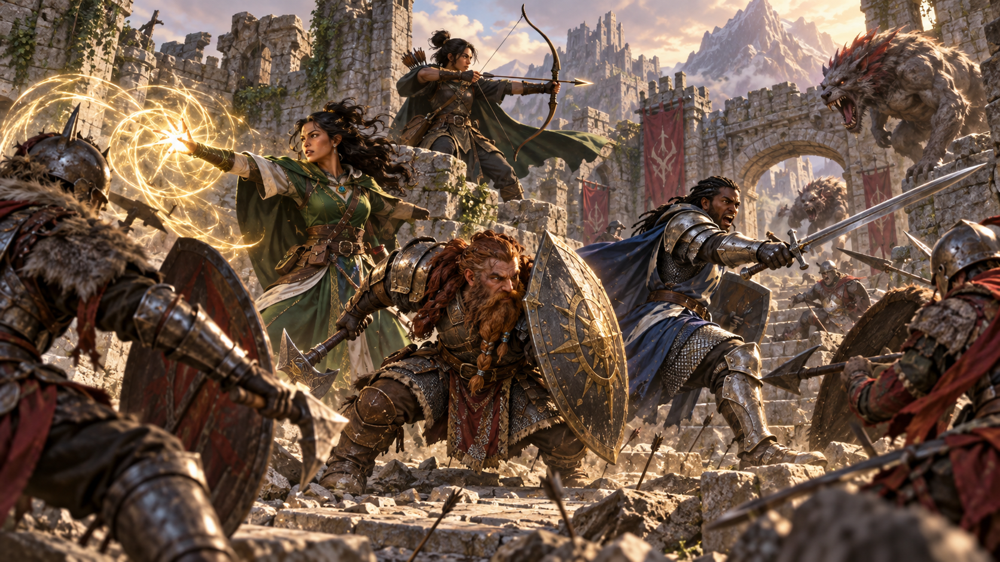

*Chiến đấu kết hợp vị trí, thời điểm, hành động và phối hợp để tạo nên những cuộc đối đầu kịch tính. Minh họa nguyên bản tạo bằng OpenAI ImageGen cho bản dịch này.*

Tiếng kiếm va vào khiên chan chát. Tiếng xé rách kinh hoàng khi móng vuốt quái vật cào xuyên giáp. Ánh sáng chói lòa khi quả cầu lửa nở bung từ phép của pháp sư. Mùi máu sắc nồng trong không khí, xuyên qua mùi hôi của quái vật ghê tởm. Tiếng gầm giận dữ, tiếng reo chiến thắng, tiếng kêu đau đớn. Chiến đấu trong D&D có thể hỗn loạn, chết chóc và đầy phấn khích.

Chương này cung cấp những quy tắc cần thiết để nhân vật và quái vật tham gia chiến đấu, dù là cuộc giao tranh ngắn hay xung đột kéo dài trong hầm ngục hoặc trên chiến trường. Xuyên suốt chương, quy tắc nói trực tiếp với bạn, người chơi hoặc Dungeon Master. Dungeon Master điều khiển tất cả quái vật và nhân vật không do người chơi điều khiển tham gia chiến đấu; mỗi người chơi khác điều khiển một nhà phiêu lưu. “Bạn” cũng có thể chỉ nhân vật hoặc quái vật mà bạn điều khiển.

## Trình tự chiến đấu (The Order of Combat)

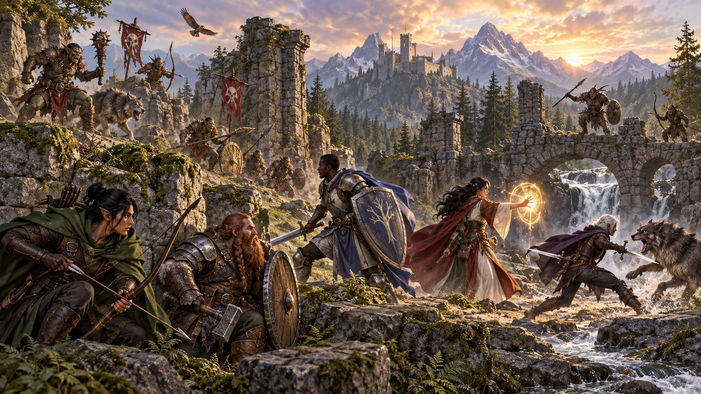

*Trình tự chiến đấu chia cuộc đối đầu thành các vòng và lượt có thứ tự rõ ràng. Minh họa nguyên bản tạo bằng OpenAI ImageGen cho bản dịch này.*

Một cuộc chạm trán chiến đấu điển hình là cuộc đụng độ giữa hai phe, với những đợt vung vũ khí, đòn nghi binh, đỡ đòn, di chuyển chân và thi triển phép. Trò chơi tổ chức sự hỗn loạn ấy thành chu kỳ gồm **vòng (round)** và **lượt (turn)**. Một vòng tương đương khoảng 6 giây trong thế giới trò chơi. Trong một vòng, mỗi bên tham gia trận chiến có một lượt. Thứ tự lượt được xác định khi cuộc chạm trán bắt đầu, lúc mọi người tung sáng kiến. Sau khi mọi người đã có lượt, trận chiến tiếp tục sang vòng sau nếu chưa phe nào đánh bại phe kia.

### Chiến đấu từng bước (Combat Step by Step)

1. **Xác định bất ngờ.** DM xác định có ai tham gia cuộc chạm trán chiến đấu bị bất ngờ hay không.
2. **Xác định vị trí.** DM quyết định tất cả nhân vật và quái vật đang ở đâu. Dựa trên thứ tự hành quân của nhà phiêu lưu hoặc vị trí họ đã nói rõ trong phòng hay địa điểm khác, DM xác định đối thủ ở đâu, cách bao xa và theo hướng nào.
3. **Tung sáng kiến.** Mọi người tham gia cuộc chạm trán chiến đấu tung sáng kiến, xác định thứ tự lượt của những người tham chiến.
4. **Thực hiện các lượt.** Mỗi người tham gia trận chiến thực hiện một lượt theo thứ tự sáng kiến.
5. **Bắt đầu vòng tiếp theo.** Khi mọi người tham gia chiến đấu đã có một lượt, vòng kết thúc. Lặp lại bước 4 cho đến khi ngừng giao chiến.

### Bất ngờ (Surprise)

*Nhận biết mối đe dọa quyết định ai bị bất ngờ và ai sẵn sàng hành động khi giao tranh bắt đầu. Minh họa nguyên bản tạo bằng OpenAI ImageGen cho bản dịch này.*

Một nhóm nhà phiêu lưu lén đến trại cướp, lao từ trong cây ra tấn công. Một khối gelatinous cube trượt dọc lối đi hầm ngục mà nhà phiêu lưu không nhận ra cho đến khi nó nuốt chửng một người trong nhóm. Trong những tình huống này, một phe khiến phe kia bị bất ngờ.

DM xác định ai có thể bị bất ngờ. Nếu không phe nào cố lén lút, họ tự động nhận ra nhau. Nếu có, DM so sánh kiểm tra Khéo léo (Lén lút) của bất kỳ ai đang ẩn nấp với điểm Minh triết (Tri giác) thụ động của từng sinh vật ở phe đối diện. Nhân vật hoặc quái vật không nhận ra mối đe dọa bị bất ngờ khi cuộc chạm trán bắt đầu.

Nếu bị bất ngờ, bạn không thể di chuyển hoặc thực hiện hành động trong lượt đầu tiên của mình trong trận chiến, và không thể thực hiện phản ứng cho đến khi lượt đó kết thúc. Một thành viên trong nhóm có thể bị bất ngờ dù các thành viên khác không bị.

### Sáng kiến (Initiative)

Sáng kiến xác định thứ tự lượt trong chiến đấu. Khi chiến đấu bắt đầu, mỗi bên tham gia thực hiện kiểm tra Khéo léo để xác định vị trí trong thứ tự sáng kiến. DM tung một lần cho cả nhóm sinh vật giống nhau, nên mọi thành viên trong nhóm đó hành động cùng lúc.

DM xếp người tham chiến từ người có tổng kiểm tra Khéo léo cao nhất đến người có tổng thấp nhất. Đây là thứ tự, gọi là thứ tự sáng kiến, mà họ hành động trong mỗi vòng. Thứ tự sáng kiến giữ nguyên qua các vòng.

Nếu hòa, DM quyết định thứ tự giữa các sinh vật do DM điều khiển có kết quả hòa, còn người chơi quyết định thứ tự giữa những nhân vật của họ có kết quả hòa. DM có thể quyết định thứ tự nếu hòa giữa quái vật và nhân vật người chơi. Theo lựa chọn của DM, mỗi nhân vật và quái vật hòa nhau có thể tung một d20 để xác định thứ tự; kết quả cao nhất đi trước.

### Lượt của bạn (Your Turn)

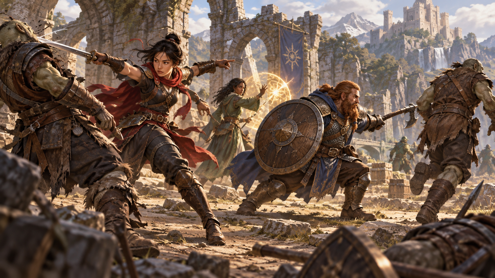

*Trong lượt, nhân vật kết hợp di chuyển và hành động; phản ứng có thể xảy ra khi một điều kiện thích hợp xuất hiện. Minh họa nguyên bản tạo bằng OpenAI ImageGen cho bản dịch này.*

Trong lượt, bạn có thể **di chuyển** quãng đường tối đa bằng tốc độ của mình và thực hiện **một hành động**. Bạn quyết định di chuyển trước hay hành động trước. Tốc độ, đôi khi được gọi là tốc độ đi bộ, được ghi trên phiếu nhân vật.

Những hành động thường gặp nhất được mô tả trong phần “Hành động trong chiến đấu” ở phía sau chương này. Nhiều đặc tính lớp và khả năng khác cung cấp thêm lựa chọn cho hành động của bạn.

Phần “Di chuyển và vị trí” phía sau chương này cung cấp quy tắc di chuyển.

Bạn có thể bỏ qua di chuyển, hành động hoặc không làm gì trong lượt. Nếu không quyết định được làm gì, hãy cân nhắc hành động Né tránh (Dodge) hoặc Chuẩn bị (Ready), như mô tả trong “Hành động trong chiến đấu”.

#### Hành động phụ (Bonus Actions)

Nhiều đặc tính lớp, phép và khả năng khác cho phép bạn thực hiện thêm một hành động trong lượt, gọi là hành động phụ. Ví dụ, đặc tính Hành động xảo quyệt (Cunning Action) cho phép đạo tặc thực hiện hành động phụ. Bạn chỉ có thể thực hiện hành động phụ khi một khả năng đặc biệt, phép hoặc đặc tính khác của trò chơi nói rõ bạn có thể làm điều gì đó bằng hành động phụ. Nếu không, bạn không có hành động phụ để thực hiện.

Bạn chỉ có thể thực hiện một hành động phụ trong lượt, nên phải chọn hành động phụ nào nếu có nhiều lựa chọn.

Bạn chọn thời điểm thực hiện hành động phụ trong lượt, trừ khi thời điểm ấy được quy định cụ thể. Bất cứ điều gì tước khả năng thực hiện hành động cũng ngăn bạn thực hiện hành động phụ.

#### Hoạt động khác trong lượt (Other Activity on Your Turn)

Lượt của bạn có thể gồm nhiều động tác phụ không đòi hỏi hành động hoặc di chuyển.

Bạn có thể giao tiếp bằng bất kỳ cách nào mình có thể, qua lời nói ngắn và cử chỉ, trong khi thực hiện lượt.

Bạn cũng có thể tương tác miễn phí với một đồ vật hoặc yếu tố môi trường trong lúc di chuyển hoặc thực hiện hành động. Ví dụ, bạn có thể mở cửa trong lúc di chuyển về phía kẻ địch, hoặc rút vũ khí như một phần của cùng hành động dùng để tấn công.

Nếu muốn tương tác với đồ vật thứ hai, bạn phải dùng hành động. Một số vật phẩm ma thuật và đồ vật đặc biệt khác luôn đòi hỏi hành động để sử dụng, như ghi trong mô tả của chúng.

DM có thể yêu cầu bạn dùng hành động cho bất kỳ hoạt động nào trong số này khi nó cần sự cẩn thận đặc biệt hoặc có trở ngại khác thường. Ví dụ, DM có thể hợp lý yêu cầu bạn dùng hành động để mở cửa bị kẹt hoặc quay tay quay để hạ cầu kéo.

#### Tương tác với đồ vật xung quanh (Interacting with Objects Around You)

Dưới đây là một số ví dụ về những việc có thể làm cùng với di chuyển và hành động:

- Rút kiếm hoặc tra kiếm vào vỏ.
- Mở hoặc đóng cửa.
- Lấy thuốc từ ba lô.
- Nhặt rìu bị đánh rơi.
- Lấy món đồ nhỏ trên bàn.
- Tháo nhẫn khỏi ngón tay.
- Nhét một ít thức ăn vào miệng.
- Cắm cờ xuống đất.
- Lấy vài đồng xu từ túi đeo thắt lưng.
- Uống hết bia ale trong bình uống.
- Gạt cần hoặc công tắc.
- Rút đuốc khỏi giá đỡ trên tường.
- Lấy sách trên kệ trong tầm với.
- Dập một ngọn lửa nhỏ.
- Đeo mặt nạ.
- Kéo mũ trùm của áo choàng lên đầu.
- Áp tai vào cửa.
- Đá một viên đá nhỏ.
- Xoay chìa trong ổ khóa.
- Gõ sàn bằng sào dài 10 feet.
- Đưa một vật phẩm cho nhân vật khác.

### Phản ứng (Reactions)

Một số khả năng đặc biệt, phép và tình huống cho phép bạn thực hiện một hành động đặc biệt gọi là phản ứng. Phản ứng là sự đáp lại tức thời một yếu tố kích hoạt nào đó, có thể xảy ra trong lượt của bạn hoặc lượt của người khác. Đánh cơ hội, mô tả ở phía sau chương này, là loại phản ứng thường gặp nhất.

Khi thực hiện phản ứng, bạn không thể thực hiện phản ứng khác cho đến đầu lượt tiếp theo của mình. Nếu phản ứng làm gián đoạn lượt của sinh vật khác, sinh vật đó có thể tiếp tục lượt ngay sau phản ứng.

## Di chuyển và vị trí (Movement and Position)

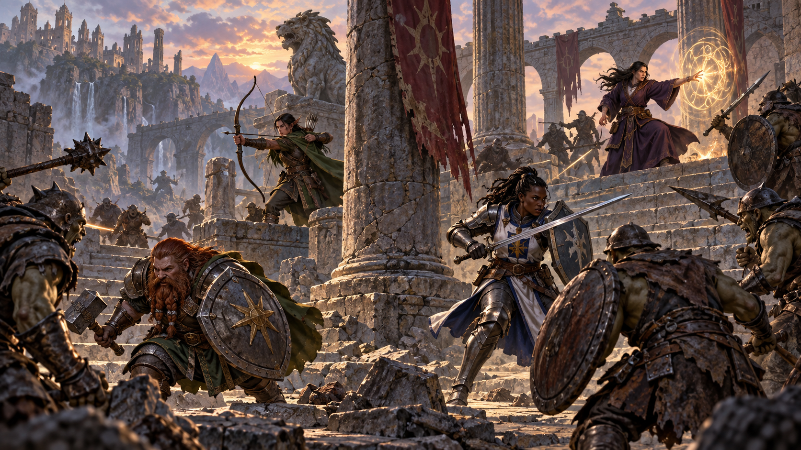

*Di chuyển và vị trí quyết định nhân vật có thể tiếp cận, né tránh hoặc kiểm soát phần nào của chiến trường. Minh họa nguyên bản tạo bằng OpenAI ImageGen cho bản dịch này.*

Trong chiến đấu, nhân vật và quái vật liên tục di chuyển, thường dùng sự di chuyển và vị trí để giành thế thượng phong.

Trong lượt, bạn có thể di chuyển quãng đường tối đa bằng tốc độ của mình. Bạn có thể dùng nhiều hay ít tốc độ tùy ý, theo các quy tắc ở đây.

Di chuyển có thể gồm nhảy, leo và bơi. Những kiểu di chuyển này có thể kết hợp với đi bộ hoặc chiếm toàn bộ phần di chuyển. Dù di chuyển thế nào, bạn trừ khoảng cách của từng phần di chuyển khỏi tốc độ cho đến khi dùng hết hoặc ngừng di chuyển.

Phần “Các kiểu di chuyển đặc biệt” ở chương 8 trình bày chi tiết về nhảy, leo và bơi.

### Chia nhỏ di chuyển (Breaking Up Your Move)

Bạn có thể chia nhỏ việc di chuyển trong lượt, dùng một phần tốc độ trước và sau hành động. Ví dụ, nếu có tốc độ 30 feet, bạn có thể đi 10 feet, thực hiện hành động, rồi đi 20 feet.

#### Di chuyển giữa các đòn tấn công (Moving between Attacks)

Nếu thực hiện hành động gồm nhiều hơn một đòn tấn công bằng vũ khí, bạn có thể chia nhỏ di chuyển hơn nữa bằng cách di chuyển giữa những đòn ấy. Ví dụ, chiến binh có thể thực hiện hai đòn nhờ đặc tính Tấn công thêm (Extra Attack), với tốc độ 25 feet, có thể đi 10 feet, tấn công, đi 15 feet, rồi tấn công lần nữa.

#### Dùng các tốc độ khác nhau (Using Different Speeds)

Nếu có nhiều tốc độ, như tốc độ đi bộ và tốc độ bay, bạn có thể đổi qua lại giữa chúng trong lúc di chuyển. Mỗi lần đổi, trừ quãng đường đã di chuyển khỏi tốc độ mới. Kết quả xác định bạn có thể đi thêm bao xa. Nếu kết quả bằng 0 hoặc thấp hơn, bạn không thể dùng tốc độ mới trong lần di chuyển hiện tại.

Ví dụ, nếu có tốc độ 30 và tốc độ bay 60 vì pháp sư thi triển *fly* lên bạn, bạn có thể bay 20 feet, đi bộ 10 feet, rồi lao lên không trung bay thêm 30 feet.

### Địa hình khó đi (Difficult Terrain)

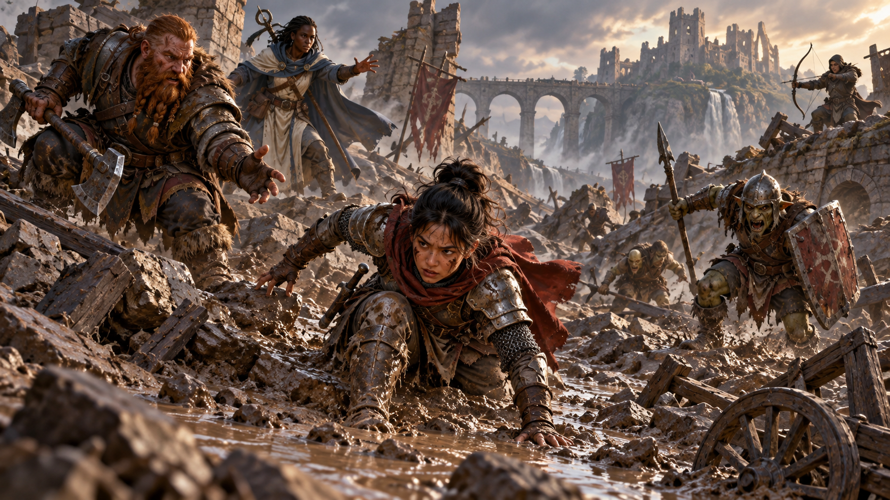

*Địa hình khó đi và trạng thái ngã sấp làm thay đổi tốc độ cũng như lựa chọn chiến thuật. Minh họa nguyên bản tạo bằng OpenAI ImageGen cho bản dịch này.*

Chiến đấu hiếm khi diễn ra trong phòng trống hoặc đồng bằng không có đặc điểm gì. Hang động đầy đá tảng, rừng rậm gai góc, cầu thang hiểm trở — bối cảnh của trận chiến điển hình có địa hình khó đi.

Mỗi foot di chuyển trong địa hình khó đi tiêu tốn thêm 1 foot. Quy tắc này vẫn đúng ngay cả khi nhiều yếu tố trong cùng một không gian được coi là địa hình khó đi.

Đồ đạc thấp, gạch đá vụn, bụi cây, cầu thang dốc, tuyết và đầm lầy nông là những ví dụ về địa hình khó đi. Không gian của một sinh vật khác, dù thù địch hay không, cũng được coi là địa hình khó đi.

### Ngã sấp (Being Prone)

Người tham chiến thường nằm trên mặt đất, do bị đánh ngã hoặc tự nằm xuống. Trong trò chơi, họ ở trạng thái ngã sấp (prone), được mô tả ở phụ lục A.

Bạn có thể tự nằm sấp mà không dùng tốc độ. Đứng dậy cần nhiều sức hơn; việc đó tiêu tốn lượng di chuyển bằng một nửa tốc độ. Ví dụ, nếu tốc độ là 30 feet, bạn phải dùng 15 feet di chuyển để đứng dậy. Bạn không thể đứng dậy nếu không còn đủ di chuyển hoặc tốc độ bằng 0.

Để di chuyển khi ngã sấp, bạn phải bò hoặc dùng ma thuật như dịch chuyển tức thời. Mỗi foot di chuyển khi bò tiêu tốn thêm 1 foot. Vì vậy, bò 1 foot trong địa hình khó đi tiêu tốn 3 feet di chuyển.

### Di chuyển quanh sinh vật khác (Moving Around Other Creatures)

Bạn có thể đi qua không gian của sinh vật không thù địch. Ngược lại, bạn chỉ có thể đi qua không gian của sinh vật thù địch nếu nó lớn hơn hoặc nhỏ hơn bạn ít nhất hai bậc kích cỡ. Hãy nhớ không gian của sinh vật khác là địa hình khó đi đối với bạn.

Dù sinh vật là bạn hay địch, bạn không thể chủ động kết thúc di chuyển trong không gian của nó.

Nếu rời tầm với của sinh vật thù địch trong lúc di chuyển, bạn kích hoạt đánh cơ hội, như giải thích ở phía sau chương này.

### Di chuyển bay (Flying Movement)

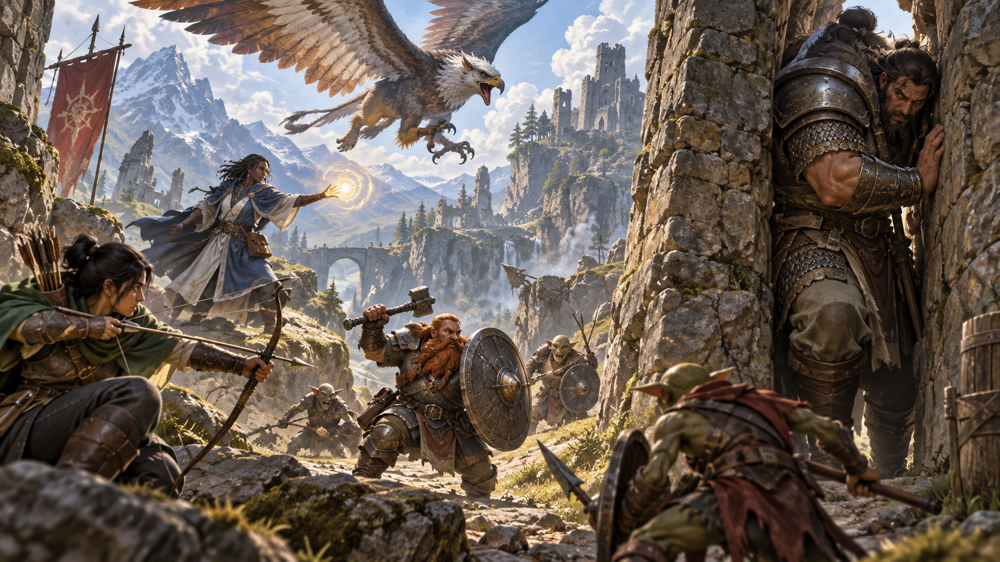

*Bay, kích cỡ và không gian của sinh vật ảnh hưởng trực tiếp đến cách chúng chiếm chỗ và di chuyển. Minh họa nguyên bản tạo bằng OpenAI ImageGen cho bản dịch này.*

Sinh vật bay có nhiều lợi ích về khả năng cơ động nhưng cũng phải đối mặt nguy cơ rơi. Nếu sinh vật đang bay bị đánh ngã sấp, bị giảm tốc độ xuống 0 hoặc bị tước khả năng di chuyển theo cách khác, nó rơi, trừ khi có khả năng lơ lửng (hover) hoặc được ma thuật giữ trên không, như phép *fly*.

### Kích cỡ sinh vật (Creature Size)

Mỗi sinh vật chiếm lượng không gian khác nhau. Bảng Các bậc kích cỡ cho biết sinh vật ở một kích cỡ cụ thể kiểm soát bao nhiêu không gian trong chiến đấu. Đôi khi đồ vật cũng dùng các bậc kích cỡ này.

#### Các bậc kích cỡ (Size Categories)

| Kích cỡ | Không gian | Quái vật ví dụ |
| --- | --- | --- |
| Tí hon (Tiny) | 2½ × 2½ feet | Imp, sprite |
| Nhỏ (Small) | 5 × 5 feet | Chuột khổng lồ, goblin |
| Trung bình (Medium) | 5 × 5 feet | Orc, người sói |
| Lớn (Large) | 10 × 10 feet | Hippogriff, ogre |
| Khổng lồ (Huge) | 15 × 15 feet | Khổng lồ lửa, treant |
| Cực đại (Gargantuan) | 20 × 20 feet hoặc lớn hơn | Kraken, purple worm |

#### Không gian (Space)

Không gian của sinh vật là khu vực tính bằng feet mà nó thực sự kiểm soát trong chiến đấu, không phải kích thước thể chất. Ví dụ, sinh vật Trung bình điển hình không rộng 5 feet, nhưng kiểm soát một không gian rộng như vậy. Nếu hobgoblin Trung bình đứng trong cửa rộng 5 feet, sinh vật khác không thể đi qua trừ khi hobgoblin cho phép.

Không gian cũng phản ánh khu vực sinh vật cần để chiến đấu hiệu quả. Vì vậy, có giới hạn số sinh vật có thể vây quanh một sinh vật khác trong chiến đấu. Giả định người tham chiến có kích cỡ Trung bình, tám sinh vật có thể đứng trong bán kính 5 feet quanh một sinh vật khác.

Vì sinh vật lớn chiếm nhiều không gian hơn, ít sinh vật như vậy có thể vây quanh một sinh vật. Nếu bốn sinh vật Lớn chen quanh một sinh vật Trung bình hoặc nhỏ hơn, gần như không còn chỗ cho ai khác. Ngược lại, có thể có đến hai mươi sinh vật Trung bình vây quanh một sinh vật Cực đại.

#### Chen qua không gian nhỏ hơn (Squeezing into a Smaller Space)

Sinh vật có thể chen qua không gian đủ rộng cho sinh vật nhỏ hơn nó một bậc kích cỡ. Vì vậy, sinh vật Lớn có thể chen qua lối đi chỉ rộng 5 feet. Trong lúc chen qua, sinh vật phải dùng thêm 1 foot cho mỗi foot di chuyển ở đó, và có bất lợi trong tung tấn công và cứu nguy Khéo léo. Những lần tung tấn công vào sinh vật có lợi thế khi nó ở trong không gian nhỏ hơn ấy.

### Quy tắc tùy chọn: Chơi trên lưới ô vuông (Variant: Playing on a Grid)

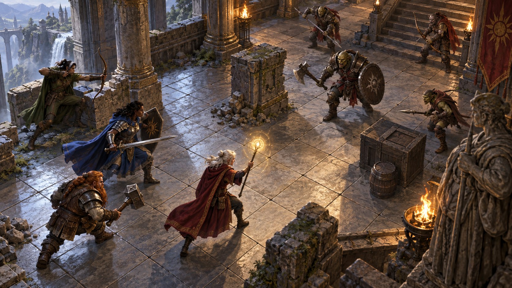

*Lưới ô vuông giúp thể hiện khoảng cách, đường đi, tầm với và vật cản một cách trực quan. Minh họa nguyên bản tạo bằng OpenAI ImageGen cho bản dịch này.*

Nếu diễn chiến đấu bằng lưới ô vuông cùng mô hình thu nhỏ hoặc quân đại diện khác, hãy dùng các quy tắc này.

**Ô vuông (Squares).** Mỗi ô trên lưới đại diện 5 feet.

**Tốc độ (Speed).** Thay vì đi từng foot, di chuyển từng ô trên lưới. Nghĩa là bạn dùng tốc độ theo từng đoạn 5 feet. Điều này đặc biệt dễ nếu đổi tốc độ thành số ô bằng cách chia tốc độ cho 5. Ví dụ, tốc độ 30 feet tương đương tốc độ 6 ô.

Nếu thường dùng lưới, hãy cân nhắc ghi tốc độ bằng số ô lên phiếu nhân vật.

**Vào một ô (Entering a Square).** Để vào một ô, bạn phải còn ít nhất 1 ô di chuyển, ngay cả khi ô ấy nằm liền kề theo đường chéo với ô hiện tại. Quy tắc di chuyển chéo hy sinh tính thực tế để trò chơi diễn ra trôi chảy. *Dungeon Master’s Guide* hướng dẫn cách dùng phương pháp thực tế hơn.

Nếu một ô tiêu tốn thêm di chuyển, như ô địa hình khó đi, bạn phải còn đủ di chuyển để trả chi phí vào ô ấy. Ví dụ, bạn phải còn ít nhất 2 ô di chuyển để vào một ô địa hình khó đi.

**Góc (Corners).** Di chuyển chéo không thể cắt qua góc của tường, cây lớn hoặc yếu tố địa hình khác lấp đầy không gian của nó.

**Tầm (Ranges).** Để xác định tầm trên lưới giữa hai thứ, dù sinh vật hay đồ vật, bắt đầu đếm ô từ một ô liền kề một bên và dừng trong không gian của bên kia. Đếm theo đường ngắn nhất.

## Hành động trong chiến đấu (Actions in Combat)

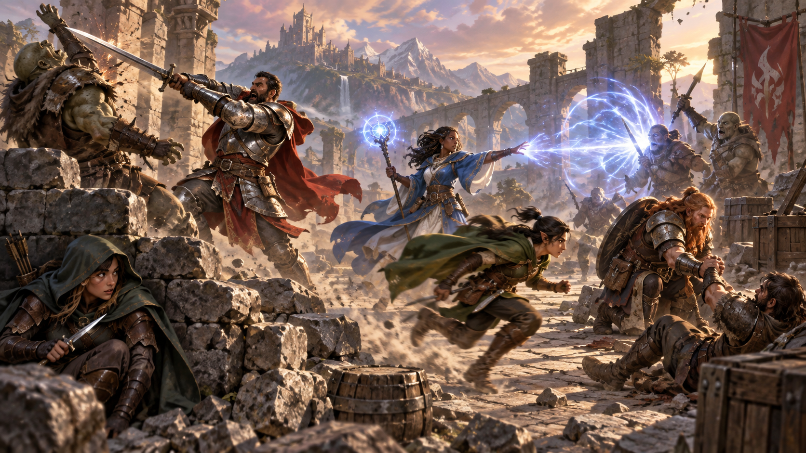

*Mỗi hành động chiến đấu mở ra một cách khác nhau để gây ảnh hưởng đến cuộc đối đầu. Minh họa nguyên bản tạo bằng OpenAI ImageGen cho bản dịch này.*

Khi thực hiện hành động trong lượt, bạn có thể chọn một hành động trình bày ở đây, một hành động nhận từ lớp hoặc đặc tính đặc biệt, hoặc hành động tự ứng biến. Nhiều quái vật có những lựa chọn hành động riêng trong khối thông số.

Khi mô tả hành động không được quy tắc trình bày chi tiết ở nơi khác, DM cho biết hành động đó có thể thực hiện hay không và bạn cần loại lần tung nào, nếu có, để xác định thành công hoặc thất bại.

### Tấn công (Attack)

Hành động thường gặp nhất trong chiến đấu là Tấn công, dù bạn vung kiếm, bắn tên từ cung hay đánh nhau bằng nắm đấm.

Với hành động này, bạn thực hiện một đòn tấn công cận chiến hoặc tầm xa. Xem phần “Thực hiện đòn tấn công” để biết quy tắc chi phối các đòn tấn công.

Một số đặc tính, như Tấn công thêm của chiến binh, cho phép thực hiện nhiều hơn một đòn tấn công bằng hành động này.

### Thi triển phép (Cast a Spell)

Người thi triển phép như pháp sư và giáo sĩ, cùng nhiều quái vật, có phép và có thể dùng chúng hiệu quả trong chiến đấu. Mỗi phép có thời gian thi triển, quy định người thi triển phải dùng hành động, phản ứng, nhiều phút hay thậm chí nhiều giờ để thi triển. Vì vậy, thi triển phép không nhất thiết là một hành động. Phần lớn phép có thời gian thi triển 1 hành động, nên người thi triển thường dùng hành động trong chiến đấu để thi triển phép như vậy. Xem chương 10 về quy tắc thi triển phép.

### Chạy nước rút (Dash)

Khi thực hiện hành động Chạy nước rút, bạn nhận thêm di chuyển cho lượt hiện tại. Lượng tăng bằng tốc độ sau khi áp dụng mọi điều chỉnh. Ví dụ, với tốc độ 30 feet, bạn có thể đi tối đa 60 feet trong lượt nếu chạy nước rút.

Bất kỳ tăng hoặc giảm nào của tốc độ cũng thay đổi phần di chuyển thêm này cùng một lượng. Ví dụ, nếu tốc độ 30 feet giảm xuống 15 feet, bạn có thể đi tối đa 30 feet trong lượt này nếu chạy nước rút.

### Rút lui (Disengage)

Nếu thực hiện hành động Rút lui, di chuyển của bạn không kích hoạt đánh cơ hội trong phần còn lại của lượt.

### Né tránh (Dodge)

Khi thực hiện hành động Né tránh, bạn tập trung hoàn toàn vào tránh các đòn tấn công. Cho đến đầu lượt tiếp theo của bạn, mọi lần tung tấn công vào bạn có bất lợi nếu bạn nhìn thấy kẻ tấn công, và bạn tung cứu nguy Khéo léo với lợi thế. Bạn mất lợi ích này nếu mất năng lực hành động (incapacitated), như giải thích ở phụ lục A, hoặc tốc độ giảm xuống 0.

### Trợ giúp (Help)

Bạn có thể giúp sinh vật khác hoàn thành nhiệm vụ. Khi thực hiện hành động Trợ giúp, sinh vật được giúp có lợi thế trong kiểm tra thuộc tính tiếp theo để thực hiện nhiệm vụ bạn đang hỗ trợ, miễn nó thực hiện kiểm tra trước đầu lượt tiếp theo của bạn.

Thay vào đó, bạn có thể giúp sinh vật thân thiện tấn công một sinh vật trong 5 feet của bạn. Bạn nghi binh, làm mục tiêu phân tâm hoặc phối hợp theo cách khác để đòn tấn công của đồng minh hiệu quả hơn. Nếu đồng minh tấn công mục tiêu trước lượt tiếp theo của bạn, lần tung tấn công đầu tiên có lợi thế.

### Ẩn nấp (Hide)

Khi thực hiện hành động Ẩn nấp, bạn kiểm tra Khéo léo (Lén lút) để thử ẩn nấp, theo quy tắc ở chương 7. Nếu thành công, bạn nhận một số lợi ích, như mô tả trong phần “Kẻ tấn công và mục tiêu không bị nhìn thấy” phía sau chương này.

### Chuẩn bị (Ready)

Đôi khi bạn muốn ra tay trước kẻ địch hoặc chờ một hoàn cảnh cụ thể rồi mới hành động. Để làm vậy, bạn có thể thực hiện hành động Chuẩn bị trong lượt, cho phép hành động bằng phản ứng trước đầu lượt tiếp theo của mình.

Trước hết, quyết định hoàn cảnh có thể nhận biết nào sẽ kích hoạt phản ứng. Sau đó, chọn hành động thực hiện để đáp lại, hoặc chọn di chuyển tối đa bằng tốc độ để đáp lại. Ví dụ: “Nếu tên giáo đồ bước lên cửa sập, tôi kéo cần mở cửa sập”, và “Nếu goblin bước đến cạnh tôi, tôi di chuyển ra xa.”

Khi yếu tố kích hoạt xảy ra, bạn có thể thực hiện phản ứng ngay sau khi yếu tố ấy kết thúc hoặc bỏ qua nó. Hãy nhớ bạn chỉ có thể thực hiện một phản ứng mỗi vòng.

Khi chuẩn bị một phép, bạn thi triển như bình thường nhưng giữ lại năng lượng, rồi giải phóng bằng phản ứng khi yếu tố kích hoạt xảy ra. Để được chuẩn bị, phép phải có thời gian thi triển 1 hành động; giữ ma thuật của phép đòi hỏi tập trung (concentration), giải thích ở chương 10. Nếu tập trung bị phá vỡ, phép tan biến mà không có hiệu quả. Ví dụ, nếu đang tập trung vào *web* rồi chuẩn bị *magic missile*, phép *web* kết thúc; nếu chịu sát thương trước khi giải phóng *magic missile* bằng phản ứng, tập trung của bạn có thể bị phá vỡ.

### Tìm kiếm (Search)

Khi thực hiện hành động Tìm kiếm, bạn dành sự chú ý để tìm một thứ. Tùy bản chất tìm kiếm, DM có thể yêu cầu kiểm tra Minh triết (Tri giác) hoặc Trí tuệ (Điều tra).

### Sử dụng đồ vật (Use an Object)

Thông thường, bạn tương tác với đồ vật trong lúc làm việc khác, như rút kiếm trong một đòn tấn công. Khi đồ vật đòi hỏi hành động để sử dụng, bạn thực hiện hành động Sử dụng đồ vật. Hành động này cũng hữu ích khi muốn tương tác với nhiều hơn một đồ vật trong lượt.

### Ứng biến hành động (Improvising an Action)

Nhân vật có thể làm những việc không được các hành động trong chương này bao quát, như phá cửa, uy hiếp kẻ địch, cảm nhận điểm yếu trong phòng thủ ma thuật hoặc kêu gọi thương lượng với kẻ địch. Giới hạn duy nhất của các hành động bạn có thể thử là trí tưởng tượng và điểm thuộc tính của nhân vật. Xem mô tả điểm thuộc tính ở chương 7 để tìm ý tưởng khi ứng biến.

Khi mô tả hành động không được quy tắc trình bày chi tiết ở nơi khác, DM cho biết hành động có thể thực hiện hay không và cần loại lần tung nào, nếu có, để xác định thành công hoặc thất bại.

## Thực hiện đòn tấn công (Making an Attack)

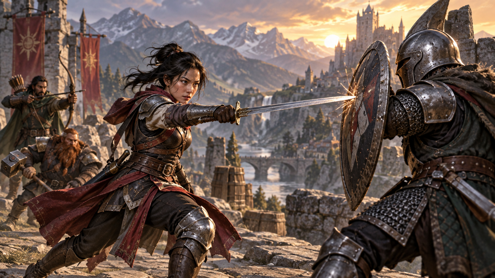

*Một đòn tấn công cần xác định mục tiêu, tung tấn công và giải quyết kết quả trúng hoặc trượt. Minh họa nguyên bản tạo bằng OpenAI ImageGen cho bản dịch này.*

Dù đánh bằng vũ khí cận chiến, bắn vũ khí tầm xa hay tung tấn công trong một phép, đòn tấn công có cấu trúc đơn giản.

1. **Chọn mục tiêu.** Chọn mục tiêu trong tầm của đòn tấn công: sinh vật, đồ vật hoặc địa điểm.
2. **Xác định điều chỉnh.** DM xác định mục tiêu có vật che chắn hay không và bạn có lợi thế hoặc bất lợi khi tấn công mục tiêu hay không. Ngoài ra, phép, khả năng đặc biệt và hiệu ứng khác có thể áp dụng khoản thưởng hoặc phạt vào lần tung tấn công.
3. **Giải quyết đòn tấn công.** Bạn tung tấn công. Nếu trúng, tung sát thương, trừ khi đòn tấn công cụ thể có quy tắc khác. Một số đòn gây hiệu ứng đặc biệt bên cạnh hoặc thay cho sát thương.

Nếu có thắc mắc một việc bạn đang làm có được tính là đòn tấn công hay không, quy tắc rất đơn giản: nếu đang tung tấn công, bạn đang thực hiện đòn tấn công.

### Tung tấn công (Attack Rolls)

Khi thực hiện đòn tấn công, lần tung tấn công xác định trúng hay trượt. Để tung tấn công, tung một d20 và cộng những điều chỉnh thích hợp. Nếu tổng lần tung cộng điều chỉnh bằng hoặc vượt Chỉ số giáp (Armor Class, AC) của mục tiêu, đòn tấn công trúng. AC của nhân vật được xác định khi tạo nhân vật; AC của quái vật nằm trong khối thông số.

#### Điều chỉnh lần tung (Modifiers to the Roll)

Khi nhân vật tung tấn công, hai điều chỉnh thường gặp nhất là hệ số thuộc tính và thưởng thành thạo. Khi quái vật tung tấn công, nó dùng hệ số được cung cấp trong khối thông số.

**Hệ số thuộc tính (Ability Modifier).** Thuộc tính dùng cho tấn công bằng vũ khí cận chiến là Sức mạnh; thuộc tính dùng cho tấn công bằng vũ khí tầm xa là Khéo léo. Vũ khí có tính chất Tinh xảo (finesse) hoặc Ném (thrown) là ngoại lệ của quy tắc này.

Một số phép cũng đòi hỏi tung tấn công. Hệ số thuộc tính dùng cho tấn công phép phụ thuộc thuộc tính thi triển phép của người thi triển, như giải thích ở chương 10.

**Thưởng thành thạo (Proficiency Bonus).** Bạn cộng thưởng thành thạo vào lần tung tấn công khi dùng vũ khí mình thành thạo, cũng như khi tấn công bằng phép.

#### Tung ra 1 hoặc 20 (Rolling 1 or 20)

Đôi khi số phận ban phước hoặc nguyền rủa người tham chiến, khiến người mới đánh trúng còn người lão luyện đánh trượt.

Nếu d20 của lần tung tấn công ra 20, đòn trúng bất kể điều chỉnh hoặc AC của mục tiêu. Đây gọi là đòn chí mạng (critical hit), giải thích phía sau chương này.

Nếu d20 của lần tung tấn công ra 1, đòn trượt bất kể điều chỉnh hoặc AC của mục tiêu.

### Kẻ tấn công và mục tiêu không bị nhìn thấy (Unseen Attackers and Targets)

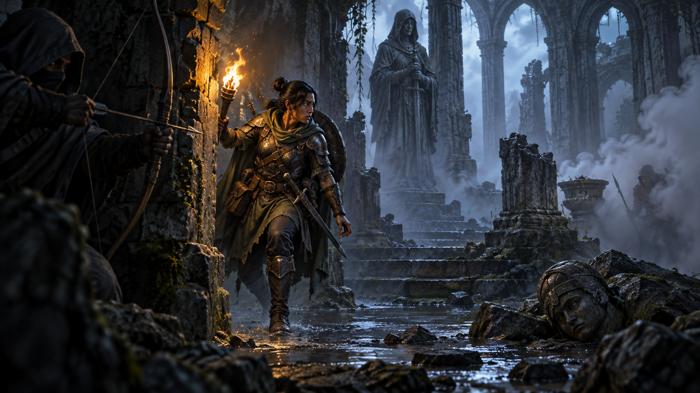

*Ẩn nấp, bóng tối và che khuất làm thay đổi khả năng nhận biết kẻ tấn công hoặc mục tiêu. Minh họa nguyên bản tạo bằng OpenAI ImageGen cho bản dịch này.*

Người tham chiến thường cố tránh bị kẻ địch nhận ra bằng cách ẩn nấp, thi triển *invisibility* hoặc nấp trong bóng tối.

Khi tấn công mục tiêu không nhìn thấy, bạn có bất lợi trong lần tung tấn công. Điều này đúng dù đoán vị trí mục tiêu hay nhắm một sinh vật nghe thấy nhưng không nhìn thấy. Nếu mục tiêu không ở vị trí bạn nhắm, bạn tự động trượt; tuy nhiên, DM thường chỉ nói đòn trượt, không nói bạn có đoán đúng vị trí mục tiêu hay không.

Khi sinh vật không nhìn thấy bạn, bạn có lợi thế trong các lần tung tấn công vào nó.

Nếu đang ẩn nấp, tức không bị nhìn thấy và nghe thấy, khi thực hiện đòn tấn công, bạn để lộ vị trí khi đòn trúng hoặc trượt.

### Tấn công tầm xa (Ranged Attacks)

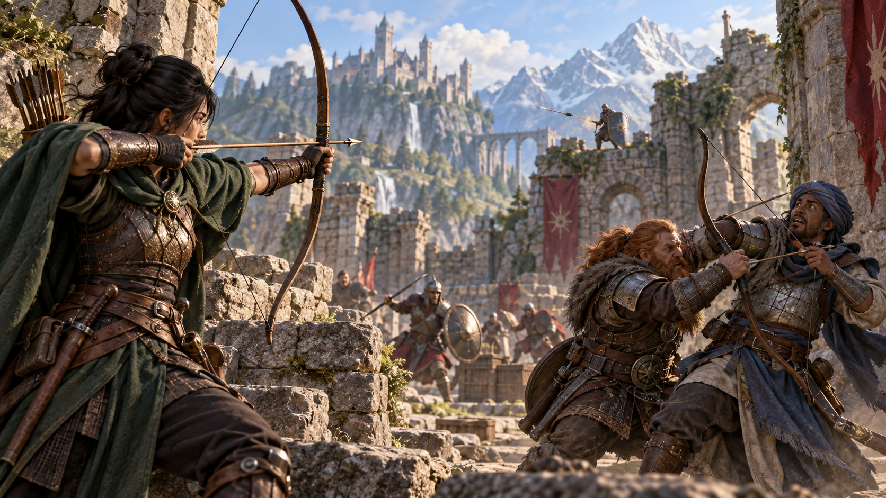

*Tầm bắn và sự hiện diện của kẻ địch ở cự ly gần ảnh hưởng đến tấn công tầm xa. Minh họa nguyên bản tạo bằng OpenAI ImageGen cho bản dịch này.*

Khi thực hiện đòn tấn công tầm xa, bạn bắn cung hoặc nỏ, ném rìu tay hoặc phóng vật theo cách khác để đánh kẻ địch từ xa. Quái vật có thể bắn gai từ đuôi. Nhiều phép cũng có đòn tấn công tầm xa.

#### Tầm (Range)

Bạn chỉ có thể thực hiện đòn tấn công tầm xa vào mục tiêu trong tầm quy định.

Nếu đòn tấn công tầm xa, như một đòn bằng phép, có một tầm duy nhất, bạn không thể tấn công mục tiêu ngoài tầm đó.

Một số đòn tấn công tầm xa, như bằng cung dài hoặc cung ngắn, có hai tầm. Số nhỏ hơn là tầm bình thường, số lớn hơn là tầm xa. Lần tung tấn công có bất lợi khi mục tiêu ngoài tầm bình thường, và bạn không thể tấn công mục tiêu ngoài tầm xa.

#### Tấn công tầm xa khi đánh gần (Ranged Attacks in Close Combat)

Ngắm đòn tấn công tầm xa khó hơn khi kẻ địch ở cạnh bạn. Khi tấn công tầm xa bằng vũ khí, phép hoặc cách khác, bạn có bất lợi trong lần tung tấn công nếu ở trong 5 feet của một sinh vật thù địch có thể nhìn thấy bạn và không mất năng lực hành động.

### Tấn công cận chiến (Melee Attacks)

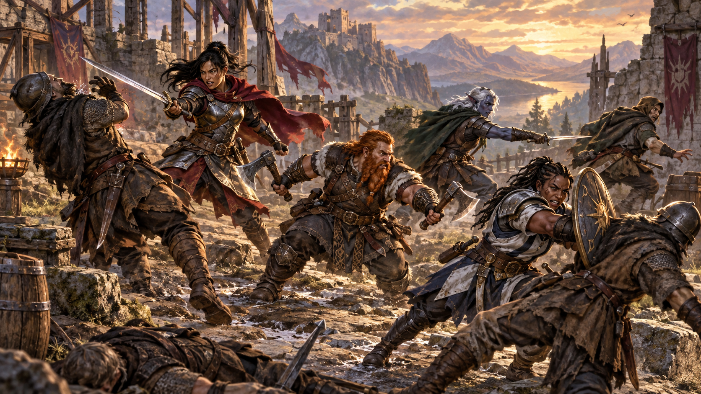

*Chiến đấu cận chiến bao gồm nhiều lựa chọn ngoài một đòn đánh thông thường. Minh họa nguyên bản tạo bằng OpenAI ImageGen cho bản dịch này.*

Được dùng khi đánh giáp lá cà, tấn công cận chiến cho phép đánh kẻ địch trong tầm với. Đòn cận chiến thường dùng vũ khí cầm tay như kiếm, búa chiến hoặc rìu. Quái vật điển hình tấn công cận chiến bằng móng vuốt, sừng, răng, xúc tu hoặc bộ phận cơ thể khác. Một số phép cũng có đòn tấn công cận chiến.

Phần lớn sinh vật có tầm với 5 feet, vì vậy có thể tấn công mục tiêu trong 5 feet khi thực hiện đòn cận chiến. Một số sinh vật, thường lớn hơn Trung bình, có đòn cận chiến với tầm với hơn 5 feet, như ghi trong mô tả.

Thay vì dùng vũ khí để thực hiện đòn tấn công bằng vũ khí cận chiến, bạn có thể dùng **đòn tay không (unarmed strike)**: đấm, đá, húc đầu hoặc đòn dùng sức tương tự; không đòn nào trong số này được tính là vũ khí. Nếu trúng, đòn tay không gây sát thương đập bằng 1 + hệ số Sức mạnh. Bạn thành thạo các đòn tay không của mình.

#### Đánh cơ hội (Opportunity Attacks)

Trong trận chiến, mọi người luôn theo dõi lúc kẻ địch sơ hở. Hiếm khi bạn có thể đi qua kẻ địch một cách bất cẩn mà không tự đặt mình vào nguy hiểm; làm vậy kích hoạt đánh cơ hội.

Bạn có thể đánh cơ hội khi một sinh vật thù địch mà bạn nhìn thấy di chuyển ra khỏi tầm với. Để đánh cơ hội, bạn dùng phản ứng thực hiện một đòn tấn công cận chiến vào sinh vật kích hoạt nó. Đòn xảy ra ngay trước khi sinh vật rời tầm với.

Bạn có thể tránh kích hoạt đánh cơ hội bằng hành động Rút lui. Bạn cũng không kích hoạt đánh cơ hội khi dịch chuyển tức thời hoặc khi ai đó hay thứ gì đó di chuyển bạn mà không dùng di chuyển, hành động hoặc phản ứng của bạn. Ví dụ, bạn không kích hoạt đánh cơ hội nếu vụ nổ hất bạn ra khỏi tầm với kẻ địch hoặc trọng lực khiến bạn rơi qua một kẻ địch.

#### Chiến đấu bằng hai vũ khí (Two-Weapon Fighting)

Khi thực hiện hành động Tấn công và tấn công bằng một vũ khí cận chiến Nhẹ (light) cầm trong một tay, bạn có thể dùng hành động phụ để tấn công bằng một vũ khí cận chiến Nhẹ khác cầm trong tay kia. Bạn không cộng hệ số thuộc tính vào sát thương của đòn tấn công phụ, trừ khi hệ số âm.

Nếu một trong hai vũ khí có tính chất Ném, bạn có thể ném vũ khí đó thay cho thực hiện đòn tấn công cận chiến bằng nó.

#### Đối kháng trong chiến đấu (Contests in Combat)

Trận chiến thường gồm việc so tài của bạn với kẻ địch. Thử thách như vậy được thể hiện bằng đối kháng. Phần này gồm những đối kháng thường gặp nhất đòi hỏi hành động trong chiến đấu: vật lộn và xô sinh vật. DM có thể dùng chúng làm mẫu để ứng biến những đối kháng khác.

#### Vật lộn (Grappling)

Khi muốn túm hoặc vật một sinh vật, bạn có thể dùng hành động Tấn công để thực hiện đòn tấn công cận chiến đặc biệt, gọi là vật lộn. Nếu có thể thực hiện nhiều đòn bằng hành động Tấn công, đòn này thay thế một trong số đó.

Mục tiêu vật lộn không được lớn hơn bạn quá một bậc kích cỡ và phải trong tầm với. Dùng ít nhất một tay trống, bạn cố túm mục tiêu bằng kiểm tra vật lộn: kiểm tra Sức mạnh (Điền kinh) đối kháng với kiểm tra Sức mạnh (Điền kinh) hoặc Khéo léo (Nhào lộn) của mục tiêu; mục tiêu chọn thuộc tính dùng. Bạn tự động thành công nếu mục tiêu mất năng lực hành động. Nếu thành công, bạn khiến mục tiêu chịu trạng thái bị vật giữ (grappled), xem phụ lục A. Trạng thái này quy định những điều chấm dứt nó; bạn có thể thả mục tiêu bất cứ khi nào muốn, không cần hành động.

**Thoát vật lộn (Escaping a Grapple).** Sinh vật bị vật giữ có thể dùng hành động để thoát. Để làm vậy, nó phải thành công kiểm tra Sức mạnh (Điền kinh) hoặc Khéo léo (Nhào lộn) đối kháng với kiểm tra Sức mạnh (Điền kinh) của bạn.

**Di chuyển sinh vật bị vật giữ (Moving a Grappled Creature).** Khi di chuyển, bạn có thể kéo hoặc mang sinh vật bị vật giữ theo, nhưng tốc độ bị chia đôi, trừ khi sinh vật nhỏ hơn bạn ít nhất hai bậc kích cỡ.

#### Xô sinh vật (Shoving a Creature)

Dùng hành động Tấn công, bạn có thể thực hiện đòn tấn công cận chiến đặc biệt để xô sinh vật, nhằm đánh nó ngã sấp hoặc đẩy ra xa. Nếu có thể thực hiện nhiều đòn bằng hành động Tấn công, đòn này thay thế một trong số đó.

Mục tiêu bị xô không được lớn hơn bạn quá một bậc kích cỡ và phải trong tầm với. Bạn kiểm tra Sức mạnh (Điền kinh) đối kháng với kiểm tra Sức mạnh (Điền kinh) hoặc Khéo léo (Nhào lộn) của mục tiêu; mục tiêu chọn thuộc tính dùng. Bạn tự động thành công nếu mục tiêu mất năng lực hành động. Nếu thành công, bạn đánh mục tiêu ngã sấp hoặc đẩy nó ra xa 5 feet.

## Che chắn (Cover)

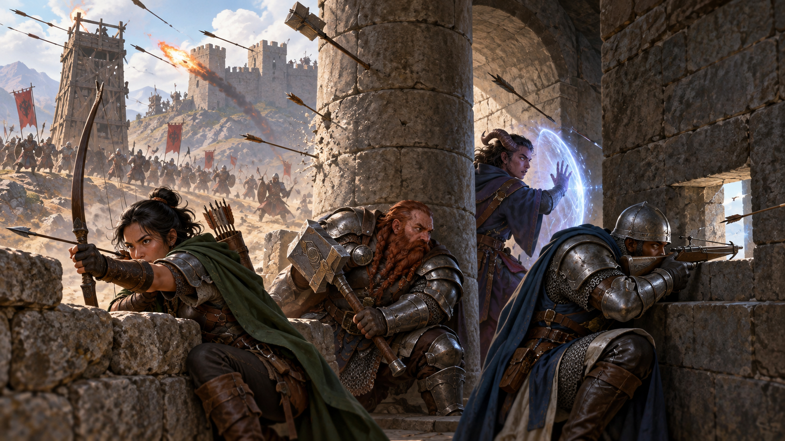

*Che chắn giúp mục tiêu tránh đòn tấn công bằng cách đặt vật cản giữa họ và kẻ tấn công. Minh họa nguyên bản tạo bằng OpenAI ImageGen cho bản dịch này.*

Tường, cây, sinh vật và chướng ngại khác có thể che chắn trong chiến đấu, khiến mục tiêu khó bị tổn hại hơn. Mục tiêu chỉ có thể hưởng lợi từ che chắn khi đòn tấn công hoặc hiệu ứng khác xuất phát từ phía bên kia vật che chắn.

Có ba mức che chắn. Nếu mục tiêu ở sau nhiều nguồn che chắn, chỉ áp dụng mức bảo vệ tốt nhất; các mức không cộng với nhau. Ví dụ, nếu mục tiêu ở sau một sinh vật cho che chắn một nửa và thân cây cho che chắn ba phần tư, mục tiêu có che chắn ba phần tư.

Mục tiêu có **che chắn một nửa (half cover)** nhận thưởng +2 vào AC và cứu nguy Khéo léo. Mục tiêu có mức này nếu chướng ngại chắn ít nhất nửa cơ thể. Chướng ngại có thể là tường thấp, đồ đạc lớn, thân cây hẹp hoặc sinh vật, dù bạn hay địch.

Mục tiêu có **che chắn ba phần tư (three-quarters cover)** nhận thưởng +5 vào AC và cứu nguy Khéo léo. Mục tiêu có mức này nếu khoảng ba phần tư cơ thể được chướng ngại che. Chướng ngại có thể là cửa lưới chắn, khe bắn tên hoặc thân cây dày.

Mục tiêu có **che chắn toàn bộ (total cover)** không thể được chọn trực tiếp làm mục tiêu đòn tấn công hoặc phép, dù một số phép có thể tác động bằng cách bao gồm nó trong vùng hiệu ứng. Mục tiêu có mức này nếu được chướng ngại che hoàn toàn.

## Sát thương và chữa lành (Damage and Healing)

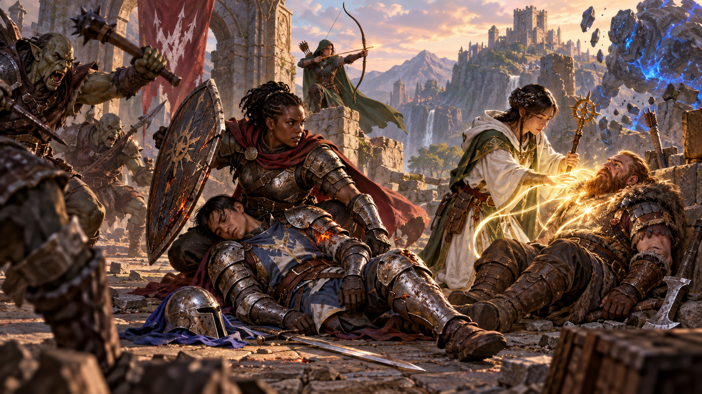

*Sát thương làm giảm điểm sinh lực, còn chữa lành và ổn định giúp nhân vật tiếp tục sống sót. Minh họa nguyên bản tạo bằng OpenAI ImageGen cho bản dịch này.*

Thương tích và nguy cơ tử vong luôn đi cùng những người khám phá thế giới D&D. Cú đâm kiếm, mũi tên bắn chuẩn hoặc luồng lửa từ phép *fireball* đều có thể gây tổn hại, thậm chí giết chết sinh vật dẻo dai nhất.

### Điểm sinh lực (Hit Points)

Điểm sinh lực thể hiện sự kết hợp của sức chịu đựng thể chất và tinh thần, ý chí sống và may mắn. Sinh vật có nhiều điểm sinh lực khó bị giết hơn. Sinh vật có ít điểm sinh lực mong manh hơn.

Điểm sinh lực hiện tại, thường gọi ngắn là điểm sinh lực, có thể là bất kỳ số nào từ điểm sinh lực tối đa của sinh vật xuống 0. Con số này thường xuyên thay đổi khi sinh vật chịu sát thương hoặc được chữa lành.

Mỗi khi sinh vật chịu sát thương, sát thương đó được trừ khỏi điểm sinh lực. Mất điểm sinh lực không ảnh hưởng năng lực của sinh vật cho đến khi nó giảm xuống 0 điểm sinh lực.

### Tung sát thương (Damage Rolls)

Mỗi vũ khí, phép và khả năng gây hại của quái vật quy định sát thương nó gây ra. Bạn tung xúc xắc sát thương, cộng mọi điều chỉnh và áp dụng sát thương vào mục tiêu. Vũ khí ma thuật, khả năng đặc biệt và yếu tố khác có thể cho thưởng sát thương.

Khi tấn công bằng vũ khí, bạn cộng hệ số thuộc tính vào sát thương, dùng cùng hệ số như lần tung tấn công. Phép cho biết dùng xúc xắc nào để tung sát thương và có cộng điều chỉnh hay không.

Nếu phép hoặc hiệu ứng khác gây sát thương cho nhiều mục tiêu cùng lúc, tung sát thương một lần cho tất cả. Ví dụ, khi pháp sư thi triển *fireball* hoặc giáo sĩ thi triển *flame strike*, sát thương của phép được tung một lần cho mọi sinh vật trong vùng bùng nổ.

#### Đòn chí mạng (Critical Hits)

Khi đánh chí mạng, bạn được tung thêm xúc xắc sát thương của đòn vào mục tiêu. Tung tất cả xúc xắc sát thương của đòn hai lần và cộng kết quả. Sau đó cộng những điều chỉnh liên quan như bình thường. Để chơi nhanh hơn, bạn có thể tung tất cả xúc xắc sát thương cùng lúc.

Ví dụ, nếu đánh chí mạng bằng dao găm, tung 2d4 sát thương thay vì 1d4, rồi cộng hệ số thuộc tính liên quan. Nếu đòn có xúc xắc sát thương khác, như từ đặc tính Tấn công lén (Sneak Attack) của đạo tặc, bạn cũng tung những xúc xắc đó hai lần.

#### Các loại sát thương (Damage Types)

Những đòn tấn công, phép gây sát thương và hiệu ứng gây hại khác nhau gây những loại sát thương khác nhau. Các loại sát thương không có quy tắc riêng, nhưng quy tắc khác, như kháng sát thương, dựa vào chúng.

Dưới đây là các loại sát thương, kèm ví dụ giúp DM gán loại sát thương cho hiệu ứng mới.

**Axit (Acid).** Luồng phun ăn mòn từ hơi thở rồng đen và enzyme phân hủy do black pudding tiết ra gây sát thương axit.

**Đập (Bludgeoning).** Các đòn dùng lực va đập hoặc ép, như búa, rơi, siết và tương tự, gây sát thương đập.

**Lạnh (Cold).** Hơi lạnh địa ngục tỏa từ giáo của ice devil và luồng hơi thở băng giá của rồng trắng gây sát thương lạnh.

**Lửa (Fire).** Rồng đỏ phun lửa, và nhiều phép tạo lửa để gây sát thương lửa.

**Lực (Force).** Lực là năng lượng ma thuật thuần túy được tập trung thành dạng gây hại. Phần lớn hiệu ứng gây sát thương lực là phép, gồm *magic missile* và *spiritual weapon*.

**Sét (Lightning).** Phép *lightning bolt* và hơi thở rồng xanh lam gây sát thương sét.

**Hoại tử (Necrotic).** Sát thương hoại tử, do một số xác sống và phép gây ra, làm tàn lụi vật chất và cả linh hồn.

**Đâm (Piercing).** Các đòn chọc thủng và xuyên, gồm giáo và cú cắn quái vật, gây sát thương đâm.

**Độc (Poison).** Cú chích có nọc độc và khí độc từ hơi thở rồng xanh lá gây sát thương độc.

**Tâm linh (Psychic).** Khả năng tinh thần như luồng công kích tâm năng của mind flayer gây sát thương tâm linh.

**Quang năng (Radiant).** Sát thương quang năng, do phép *flame strike* của giáo sĩ hoặc vũ khí trừng phạt của thiên thần gây ra, thiêu cháy da thịt như lửa và khiến tinh thần quá tải vì quyền năng.

**Chém (Slashing).** Kiếm, rìu và móng vuốt quái vật gây sát thương chém.

**Sấm (Thunder).** Đợt âm thanh bùng nổ gây chấn động, như hiệu ứng của phép *thunderwave*, gây sát thương sấm.

#### Mô tả ảnh hưởng của sát thương (Describing the Effects of Damage)

Dungeon Master mô tả mất điểm sinh lực theo nhiều cách. Khi điểm sinh lực hiện tại bằng hoặc lớn hơn một nửa điểm sinh lực tối đa, bạn thường không có dấu hiệu bị thương. Khi giảm dưới một nửa tối đa, bạn có dấu hiệu hao mòn, như vết cắt và bầm tím. Đòn tấn công khiến bạn giảm xuống 0 điểm sinh lực đánh trực tiếp vào bạn, để lại vết thương chảy máu hoặc chấn thương khác, hoặc đơn giản đánh bạn bất tỉnh.

### Kháng và dễ tổn thương sát thương (Damage Resistance and Vulnerability)

Một số sinh vật và đồ vật cực kỳ khó bị tổn hại hoặc dễ bị tổn hại khác thường bởi một số loại sát thương.

Nếu sinh vật hoặc đồ vật có **kháng (resistance)** một loại sát thương, sát thương loại đó vào nó bị chia đôi. Nếu có **dễ tổn thương (vulnerability)** trước một loại sát thương, sát thương loại đó vào nó bị nhân đôi.

Áp dụng kháng trước, rồi dễ tổn thương, sau tất cả điều chỉnh sát thương khác. Ví dụ, sinh vật có kháng sát thương đập bị trúng đòn gây 25 sát thương đập. Nó cũng ở trong hào quang ma thuật giảm mọi sát thương 5. Trước hết giảm 25 sát thương đi 5, rồi chia đôi, nên sinh vật chịu 10 sát thương.

Nhiều nguồn kháng hoặc dễ tổn thương ảnh hưởng cùng một loại sát thương chỉ tính là một nguồn. Ví dụ, nếu sinh vật có kháng sát thương lửa và kháng mọi sát thương không có ma thuật, sát thương lửa không có ma thuật vào nó giảm một nửa, không giảm ba phần tư.

### Chữa lành (Healing)

Trừ khi dẫn đến tử vong, sát thương không vĩnh viễn. Ngay cả tử vong cũng có thể đảo ngược bằng ma thuật mạnh. Nghỉ ngơi có thể hồi điểm sinh lực, như giải thích ở chương 8; phương thức ma thuật như phép *cure wounds* hoặc thuốc chữa lành (*potion of healing*) có thể loại bỏ tổn hại tức thì.

Khi sinh vật nhận bất kỳ hình thức chữa lành nào, số điểm sinh lực hồi được cộng vào điểm sinh lực hiện tại. Điểm sinh lực không thể vượt tối đa, nên mọi điểm hồi vượt con số đó bị mất. Ví dụ, druid chữa cho ranger 8 điểm sinh lực. Nếu ranger hiện có 14 điểm sinh lực và tối đa 20, ranger hồi 6 điểm từ druid, không phải 8.

Sinh vật đã chết không thể hồi điểm sinh lực cho đến khi ma thuật như phép *revivify* khôi phục sự sống cho nó.

### Giảm xuống 0 điểm sinh lực (Dropping to 0 Hit Points)

Khi giảm xuống 0 điểm sinh lực, bạn chết ngay hoặc bất tỉnh, như giải thích trong những phần sau.

#### Chết tức thì (Instant Death)

Sát thương lớn có thể giết bạn ngay. Khi sát thương khiến bạn giảm xuống 0 điểm sinh lực và vẫn còn sát thương dư, bạn chết nếu phần dư bằng hoặc vượt điểm sinh lực tối đa.

Ví dụ, giáo sĩ có tối đa 12 điểm sinh lực hiện còn 6. Nếu chịu 18 sát thương từ một đòn, cô giảm xuống 0 điểm sinh lực nhưng còn dư 12 sát thương. Vì phần dư bằng điểm sinh lực tối đa, giáo sĩ chết.

#### Bất tỉnh (Falling Unconscious)

Nếu sát thương khiến bạn giảm xuống 0 điểm sinh lực nhưng không giết bạn, bạn bất tỉnh (unconscious), xem phụ lục A. Sự bất tỉnh này kết thúc nếu bạn hồi bất kỳ điểm sinh lực nào.

#### Cứu nguy tử vong (Death Saving Throws)

Mỗi khi bắt đầu lượt với 0 điểm sinh lực, bạn phải thực hiện lần tung cứu nguy đặc biệt, gọi là cứu nguy tử vong, để xác định bạn tiến gần cái chết hơn hay bám lấy sự sống. Khác các lần tung cứu nguy khác, lần này không gắn với điểm thuộc tính nào. Bạn đang trong tay số phận, chỉ được hỗ trợ bởi phép và đặc tính cải thiện khả năng thành công khi tung cứu nguy.

Tung một d20. Nếu kết quả là 10 hoặc cao hơn, bạn thành công. Nếu không, bạn thất bại. Một thành công hoặc thất bại tự nó không có hiệu quả. Ở lần thành công thứ ba, bạn trở nên ổn định (stable), xem dưới đây. Ở lần thất bại thứ ba, bạn chết. Thành công và thất bại không cần liên tiếp; theo dõi cả hai cho đến khi có ba lần cùng loại. Cả hai số đếm đặt lại về 0 khi bạn hồi bất kỳ điểm sinh lực nào hoặc trở nên ổn định.

**Tung ra 1 hoặc 20 (Rolling 1 or 20).** Khi cứu nguy tử vong và d20 ra 1, tính là hai thất bại. Nếu d20 ra 20, bạn hồi 1 điểm sinh lực.

**Sát thương khi có 0 điểm sinh lực (Damage at 0 Hit Points).** Nếu chịu bất kỳ sát thương nào khi có 0 điểm sinh lực, bạn nhận một thất bại cứu nguy tử vong. Nếu sát thương đến từ đòn chí mạng, thay vào đó nhận hai thất bại. Nếu sát thương bằng hoặc vượt điểm sinh lực tối đa, bạn chết tức thì.

#### Ổn định sinh vật (Stabilizing a Creature)

Cách tốt nhất để cứu sinh vật có 0 điểm sinh lực là chữa lành cho nó. Nếu không có chữa lành, ít nhất có thể ổn định sinh vật để nó không bị giết bởi cứu nguy tử vong thất bại.

Bạn có thể dùng hành động sơ cứu sinh vật bất tỉnh và thử ổn định nó, đòi hỏi kiểm tra Minh triết (Y học) DC 10 thành công.

Sinh vật ổn định không tung cứu nguy tử vong dù có 0 điểm sinh lực, nhưng vẫn bất tỉnh. Sinh vật ngừng ổn định và phải bắt đầu tung cứu nguy tử vong lại nếu chịu bất kỳ sát thương nào. Sinh vật ổn định không được chữa lành hồi 1 điểm sinh lực sau 1d4 giờ.

#### Quái vật và tử vong (Monsters and Death)

Phần lớn DM cho quái vật chết ngay khi giảm xuống 0 điểm sinh lực, thay vì bất tỉnh và tung cứu nguy tử vong.

Phản diện hùng mạnh và NPC đặc biệt là ngoại lệ thường gặp; DM có thể cho chúng bất tỉnh và theo cùng quy tắc như nhân vật người chơi.

### Đánh bất tỉnh sinh vật (Knocking a Creature Out)

Đôi khi kẻ tấn công muốn làm kẻ địch mất khả năng chiến đấu thay vì giáng đòn giết chết. Khi khiến sinh vật giảm xuống 0 điểm sinh lực bằng đòn tấn công cận chiến, kẻ tấn công có thể đánh sinh vật bất tỉnh. Kẻ tấn công có thể chọn điều này ngay khi gây sát thương. Sinh vật bất tỉnh và ổn định.

### Điểm sinh lực tạm thời (Temporary Hit Points)

Một số phép và khả năng đặc biệt cho sinh vật điểm sinh lực tạm thời. Đây không phải điểm sinh lực thực sự; chúng là lớp đệm chống sát thương, một nguồn điểm bảo vệ bạn khỏi thương tích.

Khi có điểm sinh lực tạm thời và chịu sát thương, điểm tạm thời mất trước; phần sát thương dư chuyển vào điểm sinh lực thông thường. Ví dụ, nếu có 5 điểm sinh lực tạm thời và chịu 7 sát thương, bạn mất điểm tạm thời rồi chịu 2 sát thương.

Vì điểm sinh lực tạm thời tách biệt với điểm thực sự, chúng có thể vượt điểm sinh lực tối đa. Vì vậy, nhân vật có thể đang đầy điểm sinh lực và vẫn nhận điểm tạm thời.

Chữa lành không thể khôi phục điểm sinh lực tạm thời, và chúng không cộng dồn. Nếu đang có điểm tạm thời rồi nhận thêm, bạn quyết định giữ số hiện có hay nhận số mới. Ví dụ, nếu phép cho 12 điểm tạm thời khi đang có 10, bạn có thể có 12 hoặc 10, không phải 22.

Nếu có 0 điểm sinh lực, nhận điểm sinh lực tạm thời không khiến bạn tỉnh lại hoặc ổn định. Chúng vẫn có thể hấp thụ sát thương hướng vào bạn khi ở trạng thái ấy, nhưng chỉ chữa lành thực sự mới có thể cứu bạn.

Trừ khi đặc tính cho điểm sinh lực tạm thời có thời lượng, chúng tồn tại cho đến khi dùng hết hoặc bạn hoàn tất nghỉ dài.

## Chiến đấu trên thú cưỡi (Mounted Combat)

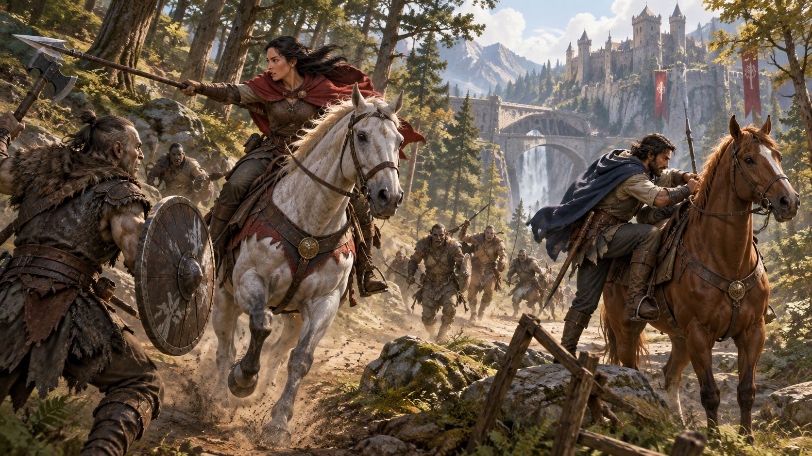

*Chiến đấu trên thú cưỡi kết hợp khả năng di chuyển của vật cưỡi với hành động của người điều khiển. Minh họa nguyên bản tạo bằng OpenAI ImageGen cho bản dịch này.*

Hiệp sĩ xông vào trận trên ngựa chiến, pháp sư thi triển phép từ lưng griffon hoặc giáo sĩ bay qua bầu trời trên pegasus đều hưởng tốc độ và sự cơ động mà thú cưỡi có thể cung cấp.

Một sinh vật sẵn lòng, lớn hơn bạn ít nhất một bậc kích cỡ và có cấu tạo cơ thể phù hợp, có thể làm thú cưỡi theo các quy tắc sau.

### Lên và xuống thú cưỡi (Mounting and Dismounting)

Một lần trong lúc di chuyển, bạn có thể lên một sinh vật trong 5 feet hoặc xuống thú cưỡi. Việc này tiêu tốn lượng di chuyển bằng nửa tốc độ. Ví dụ, nếu tốc độ là 30 feet, bạn phải dùng 15 feet di chuyển để lên ngựa. Vì vậy, bạn không thể lên nếu không còn 15 feet di chuyển hoặc tốc độ bằng 0.

Nếu hiệu ứng di chuyển thú cưỡi trái ý nó khi bạn đang cưỡi, bạn phải thành công cứu nguy Khéo léo DC 10, nếu không sẽ rơi khỏi thú cưỡi, ngã sấp trong không gian cách nó không quá 5 feet. Nếu bị đánh ngã sấp khi đang cưỡi, bạn phải tung cứu nguy tương tự.

Nếu thú cưỡi bị đánh ngã sấp, bạn có thể dùng phản ứng xuống khi nó ngã và tiếp đất đứng vững. Nếu không, bạn bị hất khỏi thú cưỡi và ngã sấp trong không gian cách nó không quá 5 feet.

### Điều khiển thú cưỡi (Controlling a Mount)

Khi đang cưỡi, bạn có hai lựa chọn: điều khiển thú cưỡi hoặc để nó hành động độc lập. Sinh vật thông minh, như rồng, hành động độc lập.

Bạn chỉ có thể điều khiển thú cưỡi nếu nó được huấn luyện chấp nhận người cưỡi. Ngựa, lừa và sinh vật tương tự đã thuần hóa được giả định có huấn luyện ấy. Sáng kiến của thú cưỡi được điều khiển đổi thành sáng kiến của bạn khi bạn lên cưỡi. Nó di chuyển theo chỉ dẫn và chỉ có ba lựa chọn hành động: Chạy nước rút, Rút lui và Né tránh. Thú cưỡi được điều khiển có thể di chuyển và hành động ngay trong lượt bạn lên cưỡi.

Thú cưỡi độc lập giữ vị trí trong thứ tự sáng kiến. Chở người cưỡi không hạn chế những hành động nó có thể làm; nó di chuyển và hành động theo ý mình. Nó có thể bỏ chạy khỏi chiến đấu, lao đến tấn công và ăn một kẻ địch bị thương nặng, hoặc hành động trái ý bạn theo cách khác.

Trong cả hai trường hợp, nếu thú cưỡi kích hoạt đánh cơ hội khi bạn đang cưỡi, kẻ tấn công có thể nhắm bạn hoặc thú cưỡi.

## Chiến đấu dưới nước (Underwater Combat)

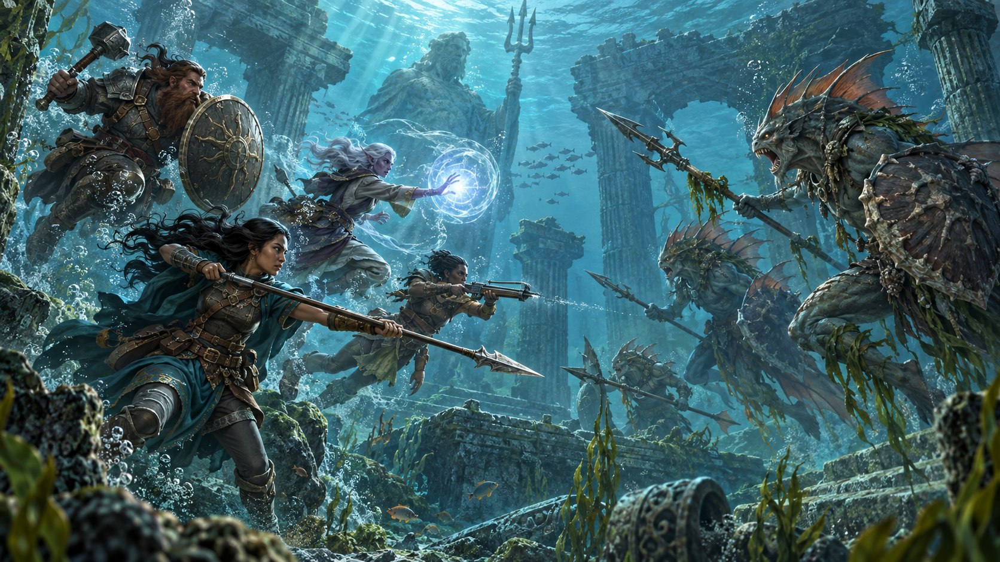

*Nước cản trở chuyển động và khiến nhiều loại vũ khí hoạt động khác với trên mặt đất. Minh họa nguyên bản tạo bằng OpenAI ImageGen cho bản dịch này.*

Khi nhà phiêu lưu đuổi sahuagin về nơi ở dưới biển, chống cá mập trong xác tàu cổ hoặc ở trong phòng hầm ngục bị ngập, họ phải chiến đấu trong môi trường đầy thử thách. Dưới nước, các quy tắc sau áp dụng.

Khi thực hiện **đòn tấn công bằng vũ khí cận chiến**, sinh vật không có tốc độ bơi, dù tự nhiên hay được ma thuật cho, có bất lợi trong lần tung tấn công, trừ khi vũ khí là dao găm, lao, kiếm ngắn, giáo hoặc đinh ba.

**Đòn tấn công bằng vũ khí tầm xa** tự động trượt mục tiêu ngoài tầm bình thường của vũ khí. Ngay cả với mục tiêu trong tầm bình thường, lần tung có bất lợi, trừ khi vũ khí là nỏ, lưới hoặc vũ khí được ném như lao, gồm giáo, đinh ba hoặc phi tiêu.

Sinh vật và đồ vật chìm hoàn toàn trong nước có kháng sát thương lửa.

---

*Minh họa trong bản gốc, trang 78-79: Richard Whitters.*

*D&D Basic Rules (Version 1.0). Không được bán lại. Được phép in và sao chụp tài liệu này chỉ để sử dụng cá nhân.*
