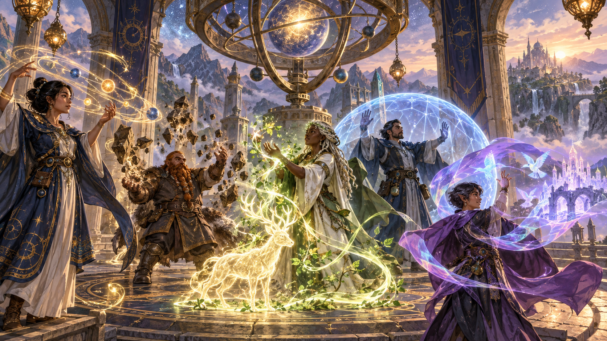
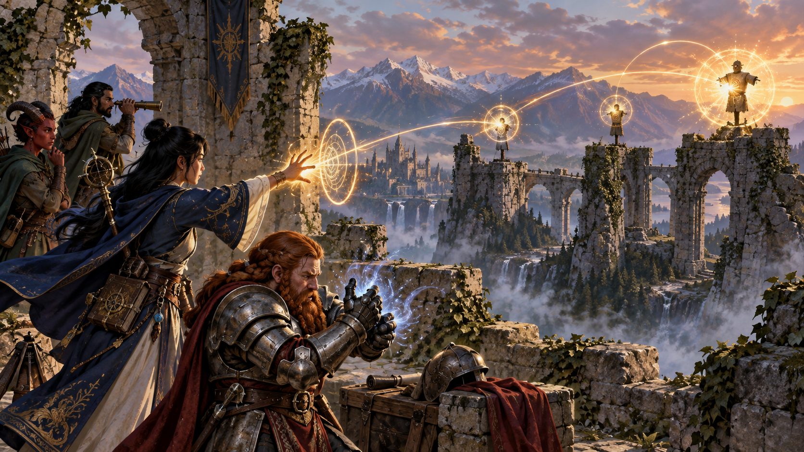
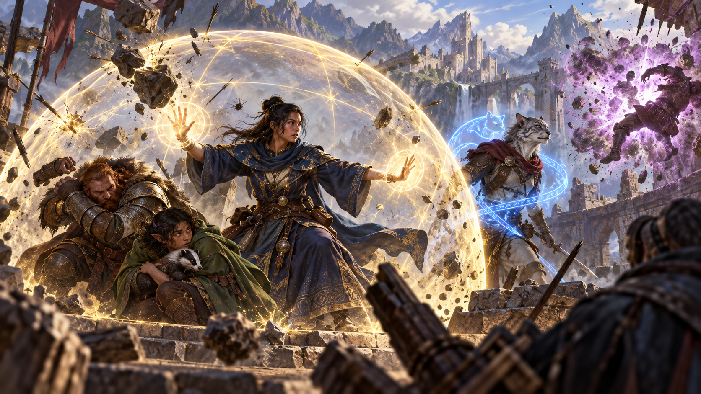
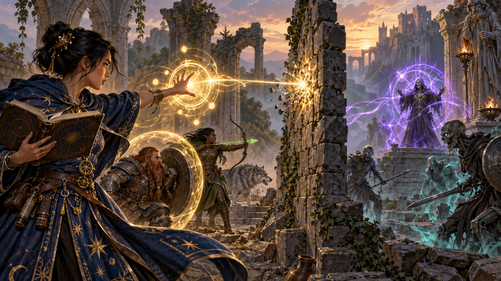
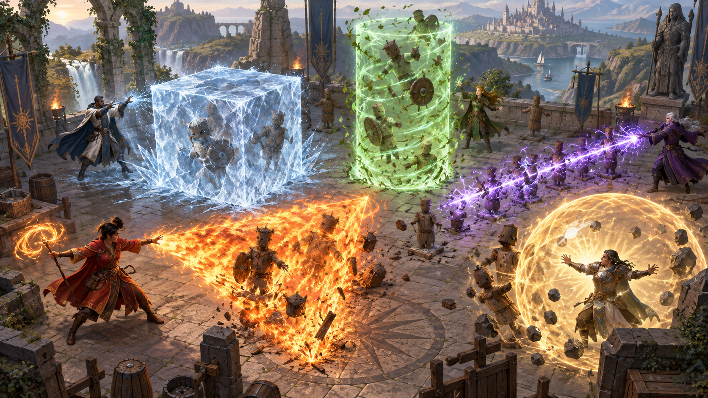
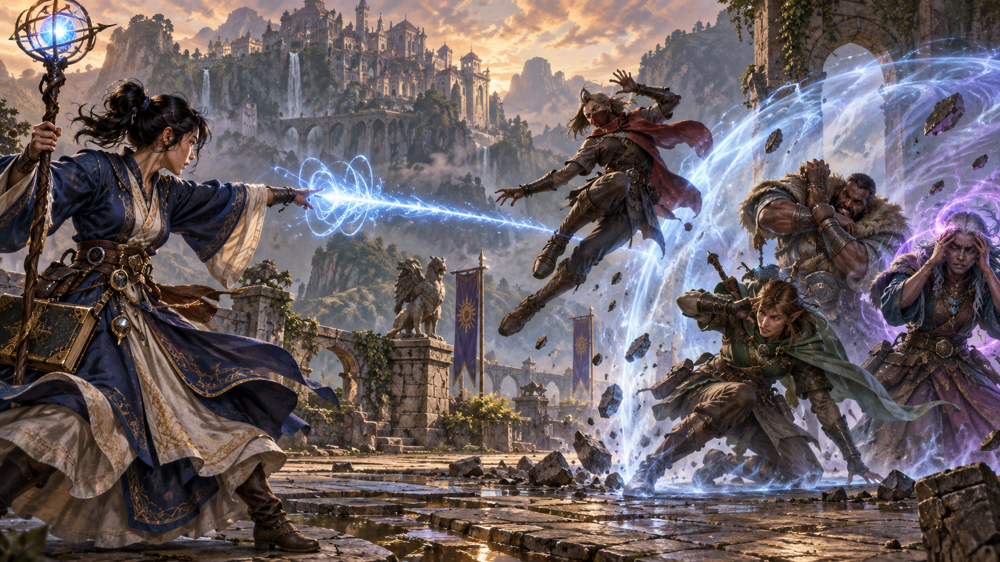
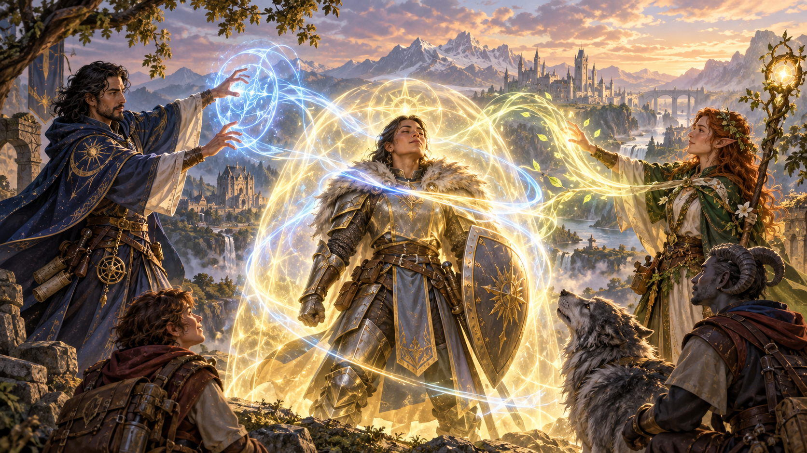
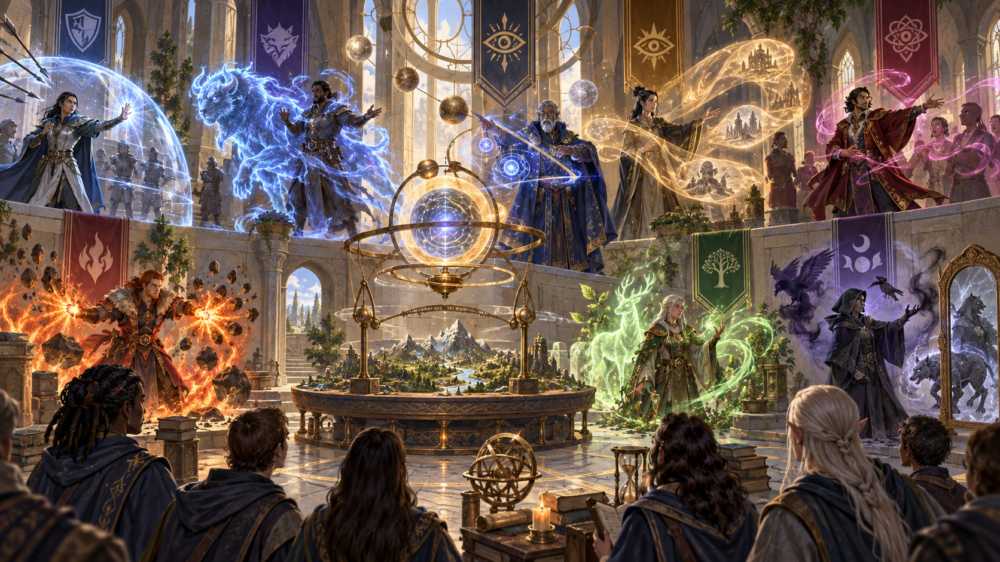

Nguồn: *D&D Basic Rules (Version 1.0), 2018*, trang 82-85.

*Thi triển phép biến năng lượng ma thuật thành những hiệu ứng có hình thức, mục tiêu và giới hạn rõ ràng. Minh họa nguyên bản tạo bằng OpenAI ImageGen cho bản dịch này.*

Ma thuật thấm khắp các thế giới D&D và thường xuất hiện dưới dạng phép.

Chương này cung cấp quy tắc [thi triển phép](99-glossary.md#spellcasting). Các [lớp nhân vật](99-glossary.md#class) khác nhau có cách học và chuẩn bị phép riêng, còn [quái vật](99-glossary.md#monster) dùng phép theo những cách độc đáo. Bất kể nguồn gốc, phép đều tuân theo những quy tắc ở đây.

## Phép là gì? (What Is a Spell?)

*Một phép là sự định hình có chủ ý của năng lượng ma thuật thành một hiệu ứng cụ thể. Minh họa nguyên bản tạo bằng OpenAI ImageGen cho bản dịch này.*

Một phép là một hiệu ứng ma thuật riêng biệt: một lần định hình năng lượng ma thuật tràn ngập [đa vũ trụ](99-glossary.md#multiverse) thành biểu hiện cụ thể, có giới hạn. Khi thi triển phép, nhân vật cẩn thận gảy những sợi ma thuật thô vô hình thấm khắp thế giới, cố định chúng theo một mẫu nhất định, khiến chúng rung theo cách cụ thể, rồi thả ra để giải phóng hiệu ứng mong muốn; trong phần lớn trường hợp, tất cả diễn ra chỉ trong vài giây.

Phép có thể là công cụ đa năng, vũ khí hoặc bùa phòng hộ. Chúng có thể gây sát thương hoặc khắc phục tổn hại, áp đặt hoặc loại bỏ [trạng thái](99-glossary.md#condition), xem phụ lục A, rút đi sinh lực và trả lại sự sống cho người chết.

Vô số nghìn phép đã được tạo ra trong lịch sử đa vũ trụ, và nhiều phép từ lâu đã bị lãng quên. Một số có thể còn được ghi trong những sách phép mục nát giấu trong phế tích cổ, hoặc bị giữ trong tâm trí các vị thần đã chết. Hoặc một ngày nào đó, chúng có thể được một nhân vật đã tích lũy đủ quyền năng và minh triết sáng tạo lại.

### Bậc phép (Spell Level)

*Bậc phép biểu thị độ mạnh và phức tạp, còn [ô phép](99-glossary.md#spell-slot) là nguồn lực dùng để thi triển chúng. Minh họa nguyên bản tạo bằng OpenAI ImageGen cho bản dịch này.*

Mọi phép có bậc từ 0 đến 9. Bậc phép cho biết khái quát sức mạnh của phép, từ *magic missile* nhỏ bé nhưng vẫn ấn tượng ở bậc 1 đến *time stop* phi thường ở bậc 9. Phép sơ cấp (cantrip), những phép đơn giản nhưng mạnh mẽ mà nhân vật có thể thi triển gần như theo thói quen đã thuộc lòng, có bậc 0. Bậc phép càng cao, người thi triển phải có cấp càng cao để dùng phép đó.

Bậc phép và [cấp nhân vật](99-glossary.md#level) không tương ứng trực tiếp. Thông thường, nhân vật phải ít nhất cấp 17, không phải cấp 9, để thi triển phép bậc 9.

### Phép đã biết và đã chuẩn bị (Known and Prepared Spells)

*Các lớp nhân vật tiếp cận phép đã biết và phép chuẩn bị theo những cách khác nhau. Minh họa nguyên bản tạo bằng OpenAI ImageGen cho bản dịch này.*

Trước khi dùng phép, người thi triển phải ghi nhớ vững chắc phép ấy, hoặc có thể tiếp cận phép trong một [vật phẩm ma thuật](99-glossary.md#magic-item). Thành viên của một số lớp có danh sách hạn chế những phép đã biết luôn được ghi nhớ trong tâm trí. Nhiều quái vật dùng ma thuật cũng vậy. Những người thi triển khác, như [giáo sĩ](99-glossary.md#cleric) và [pháp sư](99-glossary.md#wizard), trải qua quá trình chuẩn bị phép. Quá trình này khác nhau giữa các lớp, như trình bày chi tiết trong mô tả lớp.

Trong mọi trường hợp, số phép người thi triển có thể ghi nhớ tại một thời điểm phụ thuộc cấp nhân vật.

### Ô phép (Spell Slots)

Bất kể biết hoặc chuẩn bị bao nhiêu phép, người thi triển chỉ có thể thi triển số phép giới hạn trước khi nghỉ. Điều khiển kết cấu ma thuật và dẫn năng lượng của nó vào ngay cả một phép đơn giản cũng gây hao tổn thể chất và tinh thần; phép bậc cao còn hao tổn hơn. Vì vậy, mô tả của mỗi lớp thi triển phép có bảng cho biết nhân vật có thể dùng bao nhiêu ô phép ở mỗi [bậc phép](99-glossary.md#spell-level) tại từng cấp nhân vật. Ví dụ, pháp sư Umara cấp 3 có bốn ô phép bậc 1 và hai ô bậc 2.

Khi thi triển phép, nhân vật tiêu hao một ô cùng bậc với phép hoặc cao hơn, thực chất là “lấp đầy” ô bằng phép. Bạn có thể hình dung ô phép là rãnh có kích thước nhất định: nhỏ với ô bậc 1, lớn hơn với phép bậc cao. Phép bậc 1 vừa ô ở bất kỳ kích thước nào, nhưng phép bậc 9 chỉ vừa ô bậc 9. Vì vậy, khi Umara thi triển *magic missile*, một phép bậc 1, cô dùng một trong bốn ô bậc 1 và còn ba ô.

Hoàn tất [nghỉ dài](99-glossary.md#long-rest) khôi phục mọi ô phép đã dùng; xem chương 8 về quy tắc nghỉ ngơi.

Một số nhân vật và quái vật có khả năng đặc biệt cho phép thi triển phép mà không dùng ô phép.

#### Thi triển phép ở bậc cao hơn (Casting a Spell at a Higher Level)

Khi người thi triển dùng ô có bậc cao hơn bậc của phép, phép mang bậc cao hơn ấy trong lần thi triển đó. Ví dụ, nếu Umara thi triển *magic missile* bằng một ô bậc 2, lần *magic missile* ấy là phép bậc 2. Thực chất, phép mở rộng để lấp đầy ô mà nó được đặt vào.

Một số phép, như *magic missile* và *cure wounds*, có hiệu ứng mạnh hơn khi thi triển ở bậc cao, như trình bày chi tiết trong mô tả phép.

### Phép sơ cấp (Cantrips)

*Phép sơ cấp có thể dùng thường xuyên, còn [nghi thức](99-glossary.md#ritual) đổi thời gian lấy việc không tiêu hao ô phép. Minh họa nguyên bản tạo bằng OpenAI ImageGen cho bản dịch này.*

Phép sơ cấp là phép có thể thi triển tùy ý, không dùng ô phép và không cần chuẩn bị trước. Việc luyện tập lặp lại đã khắc sâu phép vào tâm trí người thi triển, đồng thời truyền cho họ ma thuật cần để tạo hiệu ứng hết lần này đến lần khác. Bậc của [phép sơ cấp](99-glossary.md#cantrip) là 0.

### Nghi thức (Rituals)

Một số phép có nhãn đặc biệt: nghi thức (ritual). Phép như vậy có thể được thi triển theo quy tắc thông thường, hoặc dưới dạng nghi thức. Phiên bản nghi thức mất thêm 10 phút để thi triển so với bình thường. Nó cũng không tiêu hao ô phép, nghĩa là phiên bản nghi thức không thể được thi triển ở bậc cao hơn.

Để thi triển phép dưới dạng nghi thức, người thi triển phải có đặc tính cho phép làm vậy. Ví dụ, giáo sĩ và [druid](99-glossary.md#druid) có đặc tính này. Người thi triển cũng phải đã chuẩn bị phép hoặc có phép trong danh sách phép đã biết, trừ khi đặc tính nghi thức của nhân vật quy định khác, như đặc tính của pháp sư.

## Thi triển một phép (Casting a Spell)

Khi nhân vật thi triển bất kỳ phép nào, cùng những quy tắc cơ bản được áp dụng, bất kể lớp nhân vật hoặc hiệu ứng của phép.

Mỗi mô tả phép ở chương 11 bắt đầu bằng khối thông tin gồm tên phép, bậc, [trường phái ma thuật](99-glossary.md#spell-school), thời gian thi triển, tầm, thành phần và thời lượng. Phần còn lại của mục phép mô tả hiệu ứng của nó.

### Thời gian thi triển (Casting Time)

*Thời gian thi triển xác định phép cần một hành động, [hành động phụ](99-glossary.md#action), phản ứng hay quá trình dài hơn. Minh họa nguyên bản tạo bằng OpenAI ImageGen cho bản dịch này.*

Phần lớn phép cần một hành động để thi triển, nhưng một số cần hành động phụ, phản ứng hoặc thời gian dài hơn nhiều.

#### Hành động phụ (Bonus Action)

Phép được thi triển bằng hành động phụ đặc biệt nhanh. Bạn phải dùng hành động phụ trong lượt của mình để thi triển, miễn chưa thực hiện hành động phụ nào trong lượt này. Bạn không thể thi triển phép khác trong cùng lượt, ngoại trừ phép sơ cấp có thời gian thi triển 1 hành động.

#### Phản ứng (Reactions)

Một số phép có thể được thi triển bằng phản ứng. Những phép này chỉ mất một phần nhỏ của giây để tạo ra và được thi triển nhằm đáp lại một sự kiện. Nếu có thể thi triển bằng phản ứng, mô tả phép cho biết chính xác khi nào bạn được làm vậy.

#### Thời gian thi triển dài hơn (Longer Casting Times)

Một số phép, gồm các phép thi triển dưới dạng nghi thức, cần nhiều thời gian hơn: nhiều phút hoặc thậm chí nhiều giờ. Khi thi triển phép có thời gian dài hơn một hành động hoặc phản ứng, bạn phải dùng hành động mỗi lượt để thi triển và phải duy trì tập trung trong quá trình đó, xem “[Tập trung](99-glossary.md#concentration)” bên dưới. Nếu tập trung bị phá vỡ, phép thất bại nhưng bạn không tiêu hao ô phép. Nếu muốn thử thi triển lại, bạn phải bắt đầu từ đầu.

### Tầm (Range)

*Tầm xác định nơi hiệu ứng có thể bắt đầu; giáp cũng có thể cản trở người chưa thành thạo thi triển phép. Minh họa nguyên bản tạo bằng OpenAI ImageGen cho bản dịch này.*

Mục tiêu phải nằm trong tầm của phép. Với phép như *magic missile*, mục tiêu là sinh vật. Với phép như *fireball*, mục tiêu là điểm trong không gian nơi quả cầu lửa bùng nổ.

Phần lớn phép có tầm tính bằng mét, với trị số [feet](99-glossary.md#feet) gốc được giữ trong ngoặc. Một số chỉ có thể chọn sinh vật bạn chạm vào, gồm cả bạn, làm mục tiêu. Những phép khác, như *shield*, chỉ ảnh hưởng đến bạn. Các phép này có tầm bản thân (self).

Phép tạo hình nón hoặc đường hiệu ứng xuất phát từ bạn cũng có tầm bản thân, cho biết điểm xuất phát của hiệu ứng phải là bạn; xem “Vùng hiệu ứng” ở phía sau chương này.

Sau khi phép được thi triển, hiệu ứng của nó không bị giới hạn bởi tầm, trừ khi mô tả phép quy định khác.

#### Thi triển khi mặc giáp (Casting in Armor)

Do thi triển phép đòi hỏi tập trung tinh thần và cử chỉ chính xác, bạn phải thành thạo loại giáp đang mặc để thi triển. Nếu không, giáp khiến bạn quá phân tâm và cản trở thể chất để thi triển phép.

### Thành phần (Components)

*Lời nói, cử chỉ và vật chất là những thành phần có thể cần để hoàn thành một phép. Minh họa nguyên bản tạo bằng OpenAI ImageGen cho bản dịch này.*

Thành phần của phép là những yêu cầu về thể chất bạn phải đáp ứng để thi triển. Mô tả mỗi phép cho biết nó cần thành phần lời nói (V), cử chỉ (S) hay vật chất (M). Nếu không cung cấp được một hoặc nhiều thành phần của phép, bạn không thể thi triển phép đó.

#### Lời nói (Verbal, V)

Phần lớn phép cần đọc những lời huyền bí. Bản thân lời nói không phải nguồn quyền năng; thay vào đó, sự kết hợp âm thanh cụ thể, với cao độ và cộng hưởng nhất định, khiến những sợi ma thuật chuyển động. Vì vậy, nhân vật bị bịt miệng hoặc ở trong vùng yên lặng, như vùng do phép *silence* tạo ra, không thể thi triển phép có thành phần lời nói.

#### Cử chỉ (Somatic, S)

Cử chỉ thi triển phép có thể gồm động tác mạnh hoặc chuỗi cử chỉ phức tạp. Nếu phép cần thành phần cử chỉ, người thi triển phải có ít nhất một tay được sử dụng tự do để thực hiện chúng.

#### Vật chất (Material, M)

Thi triển một số phép cần những đồ vật cụ thể, được ghi trong ngoặc ở mục thành phần. Nhân vật có thể dùng túi thành phần phép hoặc [tiêu điểm thi triển phép](99-glossary.md#spellcasting-focus) (spellcasting focus), trình bày ở chương 5, thay cho những thành phần được quy định. Nhưng nếu thành phần có ghi giá, nhân vật phải có đúng thành phần ấy trước khi thi triển phép.

Nếu phép nói một [thành phần vật chất](99-glossary.md#components) bị tiêu thụ bởi phép, người thi triển phải cung cấp thành phần đó cho mỗi lần thi triển.

Người thi triển phải có một tay trống để lấy các thành phần hoặc cầm tiêu điểm thi triển phép, nhưng có thể dùng cùng tay ấy để thực hiện thành phần cử chỉ.

### Thời lượng (Duration)

*Thời lượng cho biết hiệu ứng tồn tại bao lâu, và một số phép cần tập trung để duy trì. Minh họa nguyên bản tạo bằng OpenAI ImageGen cho bản dịch này.*

Thời lượng là khoảng thời gian phép tồn tại. Thời lượng có thể tính bằng vòng, phút, giờ hoặc thậm chí năm. Một số phép quy định hiệu ứng kéo dài cho đến khi phép bị giải trừ hoặc phá hủy.

#### Tức thời (Instantaneous)

Nhiều phép là tức thời. Phép gây hại, chữa lành, tạo ra hoặc thay đổi sinh vật hay đồ vật theo cách không thể giải trừ, vì ma thuật của nó chỉ tồn tại trong khoảnh khắc.

#### Tập trung (Concentration)

Một số phép đòi hỏi duy trì tập trung để giữ ma thuật hoạt động. Nếu mất tập trung, phép như vậy kết thúc.

Nếu phép phải được duy trì bằng tập trung, điều đó được ghi trong mục Thời lượng, và phép quy định bạn có thể tập trung bao lâu. Bạn có thể kết thúc tập trung bất kỳ lúc nào, không cần hành động.

Hoạt động bình thường, như di chuyển và tấn công, không cản trở tập trung. Những yếu tố sau có thể phá vỡ tập trung:

- **Thi triển phép khác cần tập trung.** Bạn mất tập trung vào một phép nếu thi triển phép khác cần tập trung. Bạn không thể tập trung vào hai phép cùng lúc.
- **Chịu sát thương.** Mỗi khi chịu sát thương trong lúc tập trung vào phép, bạn phải cứu nguy [Thể chất](99-glossary.md#constitution) để duy trì tập trung. [DC](99-glossary.md#difficulty-class) bằng 10 hoặc một nửa sát thương nhận được, lấy số cao hơn. Nếu chịu sát thương từ nhiều nguồn, như mũi tên và hơi thở [rồng](99-glossary.md#dragon), bạn [tung cứu nguy](99-glossary.md#saving-throw) riêng cho mỗi nguồn sát thương.
- **[Mất năng lực hành động](99-glossary.md#incapacitated) hoặc bị giết.** Bạn mất tập trung vào phép nếu mất năng lực hành động (incapacitated) hoặc chết.

DM cũng có thể quyết định một số hiện tượng môi trường, như sóng trùm lên bạn khi đang trên tàu chòng chành trong bão, đòi hỏi cứu nguy Thể chất DC 10 thành công để duy trì tập trung vào phép.

### Mục tiêu (Targets)

*Phép cần mục tiêu hợp lệ và thường cần một đường thông không bị vật cản che kín. Minh họa nguyên bản tạo bằng OpenAI ImageGen cho bản dịch này.*

Phép điển hình yêu cầu chọn một hoặc nhiều mục tiêu chịu ảnh hưởng ma thuật. Mô tả phép cho biết nó nhắm sinh vật, đồ vật hay điểm xuất phát của vùng hiệu ứng, được mô tả bên dưới.

Trừ khi phép có hiệu ứng nhận biết được, sinh vật có thể hoàn toàn không biết mình bị phép nhắm đến. Hiệu ứng như sét nổ lách tách rất rõ ràng, nhưng hiệu ứng tinh tế hơn, như nỗ lực đọc suy nghĩ sinh vật, thường không bị nhận ra, trừ khi phép quy định khác.

#### Đường thông đến mục tiêu (A Clear Path to the Target)

Để nhắm một thứ, bạn phải có đường thông đến nó; vì vậy, nó không thể ở sau [che chắn](99-glossary.md#cover) toàn bộ.

Nếu đặt vùng hiệu ứng tại điểm không nhìn thấy và có chướng ngại, như tường, nằm giữa bạn và điểm ấy, điểm xuất phát xuất hiện ở phía gần bạn của chướng ngại.

#### Nhắm bản thân (Targeting Yourself)

Nếu phép nhắm một sinh vật do bạn chọn, bạn có thể chọn bản thân, trừ khi sinh vật phải thù địch hoặc được quy định cụ thể là sinh vật khác bạn. Nếu ở trong vùng hiệu ứng của phép mình thi triển, bạn có thể nhắm bản thân.

### Vùng hiệu ứng (Areas of Effect)

*Vùng hiệu ứng xác định không gian và các sinh vật mà một phép có thể tác động. Minh họa nguyên bản tạo bằng OpenAI ImageGen cho bản dịch này.*

Các phép như *burning hands* và *cone of cold* bao phủ một khu vực, cho phép ảnh hưởng nhiều sinh vật cùng lúc.

Mô tả phép quy định vùng hiệu ứng, thường có một trong năm hình dạng: hình nón, khối lập phương, hình trụ, đường hoặc hình cầu. Mỗi vùng hiệu ứng có **điểm xuất phát (point of origin)**, nơi năng lượng phép bùng ra. Quy tắc của từng hình dạng quy định cách đặt điểm xuất phát. Thông thường, đó là điểm trong không gian, nhưng một số phép có vùng xuất phát từ sinh vật hoặc đồ vật.

Hiệu ứng của phép lan theo đường thẳng từ điểm xuất phát. Nếu không có đường thẳng không bị chặn nối từ điểm xuất phát đến một vị trí trong vùng hiệu ứng, vị trí đó không nằm trong vùng của phép. Để chặn một đường tưởng tượng như vậy, chướng ngại phải cho che chắn toàn bộ, như giải thích ở chương 9.

#### Hình nón (Cone)

Hình nón kéo dài từ điểm xuất phát theo hướng bạn chọn. Chiều rộng của nón tại một điểm dọc chiều dài bằng khoảng cách từ điểm đó đến điểm xuất phát. Vùng hiệu ứng hình nón quy định chiều dài tối đa của nó.

Điểm xuất phát không nằm trong vùng hiệu ứng hình nón, trừ khi bạn quyết định khác.

#### Khối lập phương (Cube)

Bạn chọn điểm xuất phát của khối lập phương ở bất kỳ đâu trên một mặt của khối hiệu ứng. Kích thước được biểu thị bằng độ dài mỗi cạnh.

Điểm xuất phát không nằm trong vùng hiệu ứng khối lập phương, trừ khi bạn quyết định khác.

#### Hình trụ (Cylinder)

Điểm xuất phát của hình trụ là tâm một hình tròn có bán kính cụ thể, như ghi trong mô tả phép. Hình tròn phải ở trên mặt đất hoặc ở độ cao của hiệu ứng phép. Năng lượng lan theo đường thẳng từ điểm xuất phát đến chu vi hình tròn, tạo đáy hình trụ. Hiệu ứng sau đó phóng lên từ đáy hoặc xuống từ mặt trên một khoảng bằng chiều cao hình trụ.

Điểm xuất phát nằm trong vùng hiệu ứng hình trụ.

#### Đường (Line)

Một đường kéo dài từ điểm xuất phát theo hướng thẳng đến hết chiều dài, bao phủ khu vực được xác định bởi chiều rộng.

Điểm xuất phát không nằm trong vùng hiệu ứng dạng đường, trừ khi bạn quyết định khác.

#### Hình cầu (Sphere)

Bạn chọn điểm xuất phát của hình cầu, rồi hình cầu mở rộng ra từ điểm đó. Kích thước được biểu thị bằng bán kính tính bằng mét, kèm trị số feet gốc trong ngoặc, từ điểm xuất phát.

Điểm xuất phát nằm trong vùng hiệu ứng hình cầu.

### Cứu nguy (Saving Throws)

*Phép có thể yêu cầu mục tiêu tung cứu nguy hoặc yêu cầu người thi triển thực hiện [tung tấn công](99-glossary.md#attack-roll). Minh họa nguyên bản tạo bằng OpenAI ImageGen cho bản dịch này.*

Nhiều phép quy định mục tiêu có thể tung cứu nguy để tránh một phần hoặc toàn bộ hiệu ứng. Phép quy định thuộc tính mục tiêu dùng khi cứu nguy và điều xảy ra khi thành công hoặc thất bại.

DC để chống một phép của bạn bằng:

`8 + hệ số thuộc tính thi triển phép + thưởng thành thạo + mọi điều chỉnh đặc biệt`

### Tung tấn công (Attack Rolls)

Một số phép yêu cầu người thi triển tung tấn công để xác định hiệu ứng có trúng mục tiêu dự định hay không. Thưởng tấn công của bạn khi tấn công bằng phép bằng:

`Hệ số thuộc tính thi triển phép + thưởng thành thạo`

Phần lớn phép yêu cầu tung tấn công dùng đòn tấn công tầm xa. Hãy nhớ bạn có bất lợi trong tung tấn công tầm xa nếu ở trong 1,5 m (5 feet) của sinh vật thù địch có thể nhìn thấy bạn và không mất năng lực hành động, xem chương 9.

### Kết hợp hiệu ứng ma thuật (Combining Magical Effects)

*Hiệu ứng phép khác nhau có thể kết hợp, còn các hiệu ứng cùng tên thường không cộng dồn sức mạnh. Minh họa nguyên bản tạo bằng OpenAI ImageGen cho bản dịch này.*

Hiệu ứng của các phép khác nhau cộng với nhau trong thời gian thời lượng của chúng chồng lấn. Tuy nhiên, hiệu ứng của cùng một phép được thi triển nhiều lần không kết hợp. Thay vào đó, hiệu ứng mạnh nhất, như khoản thưởng cao nhất, trong những lần thi triển ấy áp dụng khi thời lượng chồng lấn. Hoặc hiệu ứng mới nhất áp dụng nếu các lần thi triển mạnh ngang nhau và thời lượng chồng lấn.

Ví dụ, nếu hai giáo sĩ thi triển *bless* lên cùng mục tiêu, nhân vật đó chỉ nhận lợi ích một lần; nhân vật không được tung hai xúc xắc thưởng.

## Các trường phái ma thuật (The Schools of Magic)

*Tám trường phái phân loại phép theo bản chất và cách chúng làm thay đổi thế giới. Minh họa nguyên bản tạo bằng OpenAI ImageGen cho bản dịch này.*

Các học viện ma thuật chia phép thành tám nhóm gọi là trường phái ma thuật. Học giả, đặc biệt pháp sư, áp dụng những nhóm này cho mọi phép, tin rằng mọi ma thuật vận hành về cơ bản theo cùng một cách, dù bắt nguồn từ nghiên cứu nghiêm ngặt hay được thần linh ban tặng.

Các trường phái giúp mô tả phép; chúng không có quy tắc riêng, dù một số quy tắc tham chiếu đến chúng.

**Phòng hộ (Abjuration)** có bản chất bảo vệ, dù một số phép có cách dùng tấn công. Chúng tạo rào chắn ma thuật, vô hiệu hóa hiệu ứng gây hại, gây hại kẻ xâm nhập hoặc trục xuất sinh vật đến các [cõi tồn tại](99-glossary.md#plane) khác.

**Triệu hồi (Conjuration)** liên quan đến vận chuyển đồ vật và sinh vật từ nơi này sang nơi khác. Một số phép triệu hồi sinh vật hoặc đồ vật đến bên người thi triển, còn phép khác cho phép người thi triển dịch chuyển tức thời đến nơi khác. Một số phép Triệu hồi tạo đồ vật hoặc hiệu ứng từ hư vô.

**Tiên tri (Divination)** tiết lộ thông tin, dù dưới dạng bí mật bị lãng quên từ lâu, thoáng thấy tương lai, vị trí những thứ bị giấu, sự thật sau ảo ảnh hoặc hình ảnh người và nơi ở xa.

**[Mê hoặc](99-glossary.md#charmed) (Enchantment)** ảnh hưởng tâm trí người khác, tác động hoặc điều khiển hành vi. Những phép này có thể khiến kẻ địch xem người thi triển như bạn, buộc sinh vật làm theo một hướng hành động hoặc thậm chí điều khiển sinh vật khác như con rối.

**Gọi năng lượng (Evocation)** điều khiển năng lượng ma thuật để tạo hiệu ứng mong muốn. Một số phép tạo đợt lửa hoặc sét bùng nổ. Phép khác dẫn năng lượng tích cực để chữa vết thương.

**Ảo ảnh (Illusion)** đánh lừa giác quan hoặc tâm trí. Chúng khiến người ta thấy những thứ không có, bỏ qua những thứ có, nghe tiếng động hư ảo hoặc nhớ chuyện chưa từng xảy ra. Một số ảo ảnh tạo hình ảnh hư ảo mà sinh vật nào cũng nhìn thấy, nhưng những ảo ảnh hiểm độc nhất cấy hình ảnh trực tiếp vào tâm trí một sinh vật.

**Tử linh (Necromancy)** điều khiển năng lượng sống và chết. Những phép này có thể cho thêm nguồn sinh lực dự trữ, rút sinh lực của sinh vật khác, tạo [xác sống](99-glossary.md#undead) hoặc thậm chí hồi sinh người chết.

Tạo xác sống bằng phép Tử linh như *animate dead* không phải hành động thiện, và chỉ người thi triển tà ác mới thường xuyên dùng những phép như vậy.

**Biến đổi (Transmutation)** thay đổi đặc tính của sinh vật, đồ vật hoặc môi trường. Chúng có thể biến kẻ địch thành sinh vật vô hại, tăng sức mạnh đồng minh, khiến đồ vật chuyển động theo lệnh người thi triển hoặc tăng khả năng tự chữa lành bẩm sinh của sinh vật để hồi phục thương tích nhanh chóng.

## Mạng dệt ma thuật (The Weave of Magic)

*Mạng Dệt là cấu trúc mà người thi triển tiếp cận để định hình năng lượng ma thuật. Minh họa nguyên bản tạo bằng OpenAI ImageGen cho bản dịch này.*

Các thế giới trong đa vũ trụ D&D là những nơi đầy ma thuật. Toàn bộ sự tồn tại thấm đẫm quyền năng ma thuật, và năng lượng tiềm tàng chưa được khai thác nằm trong mọi tảng đá, dòng suối, sinh vật sống, thậm chí trong chính không khí. Ma thuật thô là chất liệu của sự sáng tạo, ý chí câm lặng và không có tâm trí của sự tồn tại, thấm khắp mọi mảnh vật chất và hiện diện trong mọi biểu hiện năng lượng trên toàn đa vũ trụ.

Người phàm không thể trực tiếp định hình ma thuật thô này. Thay vào đó, họ dùng kết cấu ma thuật, một dạng giao diện giữa ý chí người thi triển và chất liệu ma thuật thô. Người thi triển ở [Forgotten Realms](99-glossary.md#forgotten-realms) gọi nó là **Mạng dệt (Weave)** và nhìn nhận bản thể của nó là nữ thần Mystra, nhưng những người thi triển có nhiều cách đặt tên và hình dung giao diện ấy. Dù gọi tên gì, không có Mạng dệt, ma thuật thô bị khóa kín và không thể tiếp cận; đại pháp sư mạnh nhất không thể thắp nến bằng ma thuật tại nơi Mạng dệt bị xé rách. Nhưng khi được Mạng dệt bao quanh, người thi triển có thể định hình sét để đánh kẻ địch, đi hàng trăm mile trong chớp mắt hoặc thậm chí đảo ngược cái chết.

Mọi ma thuật phụ thuộc Mạng dệt, dù các loại ma thuật khác nhau tiếp cận nó theo nhiều cách. Phép của pháp sư, [warlock](99-glossary.md#warlock), sorcerer và [thi sĩ](99-glossary.md#bard) thường được gọi là **[huyền thuật](99-glossary.md#arcane-divine) (arcane magic)**. Chúng dựa vào sự hiểu biết, do học tập hoặc trực giác, về cách Mạng dệt vận hành. Người thi triển trực tiếp gảy những sợi của Mạng dệt để tạo hiệu ứng mong muốn. Hiệp sĩ huyền thuật (eldritch knight) và [đạo tặc](99-glossary.md#rogue) huyền thuật (arcane trickster) cũng dùng huyền thuật. Phép của giáo sĩ, druid, [thánh kỵ sĩ](99-glossary.md#paladin) và ranger được gọi là **ma thuật thần thánh (divine magic)**. Việc tiếp cận Mạng dệt của những người thi triển này được thực hiện thông qua quyền năng thần thánh: các vị thần, sức mạnh thần thánh của tự nhiên hoặc sức nặng thiêng liêng của lời thề thánh kỵ sĩ.

Mỗi khi hiệu ứng ma thuật được tạo ra, những sợi của Mạng dệt đan vào nhau, xoắn và gấp để làm hiệu ứng có thể xảy ra. Khi nhân vật dùng phép Tiên tri như *detect magic* hoặc *identify*, họ thoáng thấy Mạng dệt. Phép như *dispel magic* làm Mạng dệt phẳng lại. Các phép như *antimagic field* sắp xếp lại Mạng dệt để ma thuật chảy quanh khu vực bị ảnh hưởng thay vì xuyên qua nó. Và ở nơi Mạng dệt hư hại hoặc bị xé rách, ma thuật hoạt động khó lường, hoặc hoàn toàn không hoạt động.

---

*Minh họa trong bản gốc, trang 85: Richard Whitters.*

*D&D Basic Rules (Version 1.0). Không được bán lại. Được phép in và sao chụp tài liệu này chỉ để sử dụng cá nhân.*
