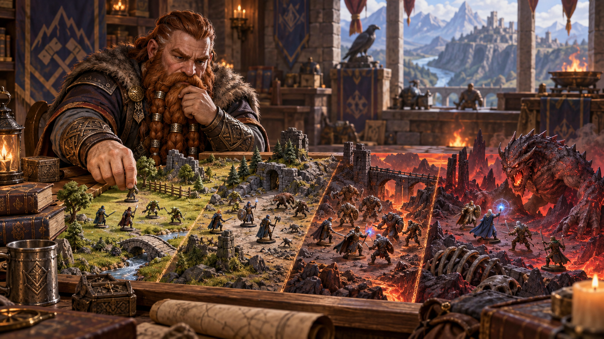
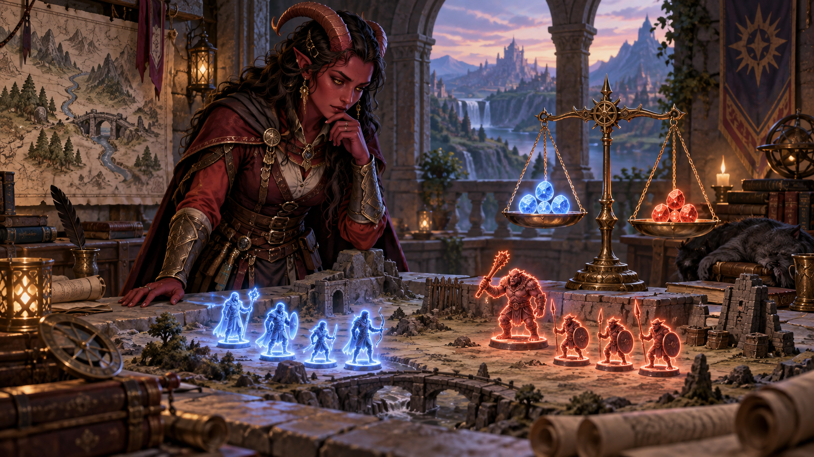
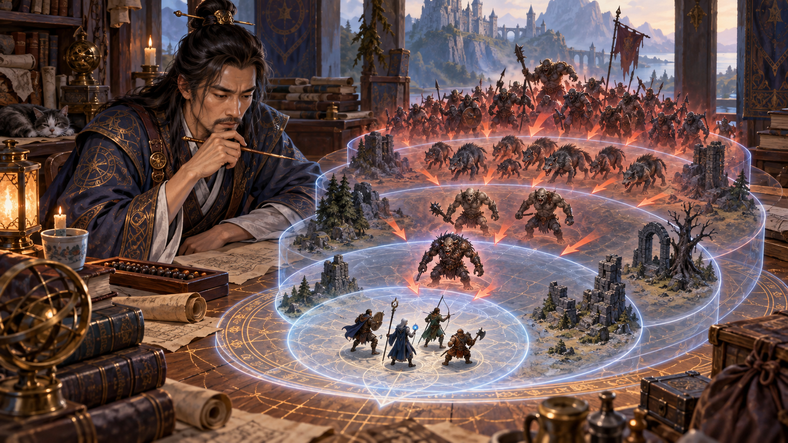
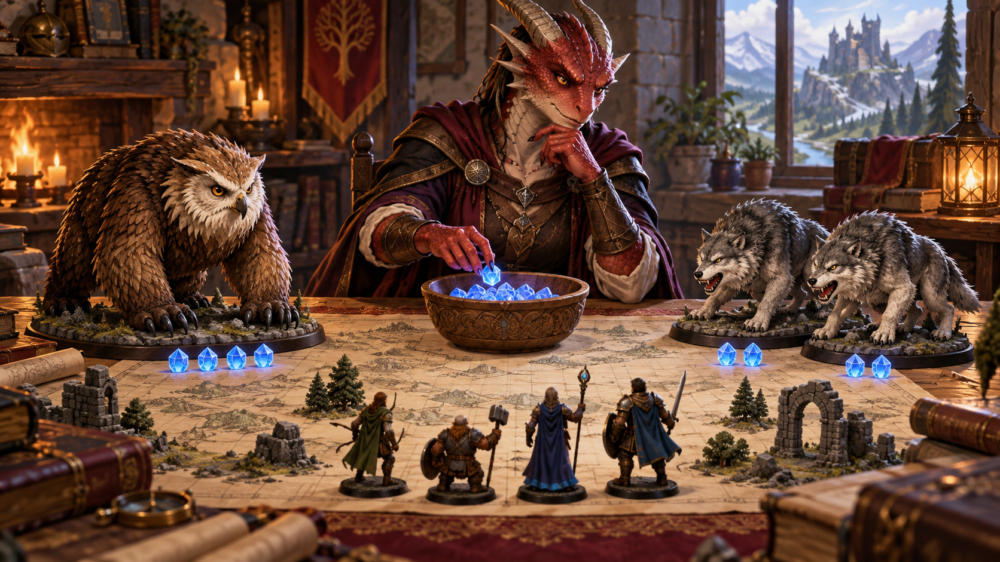
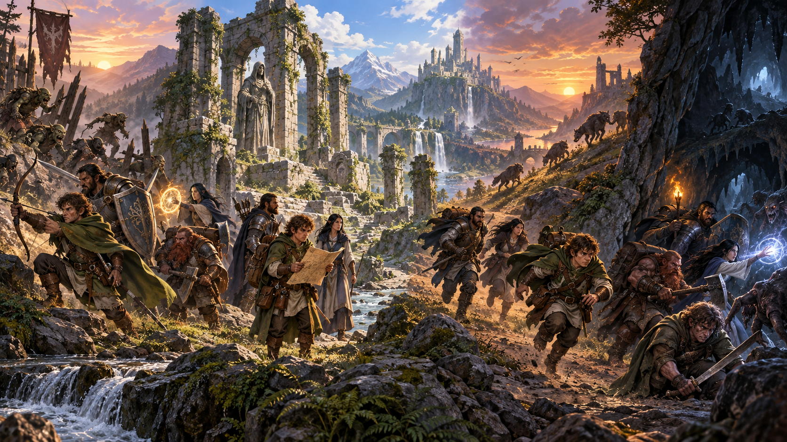
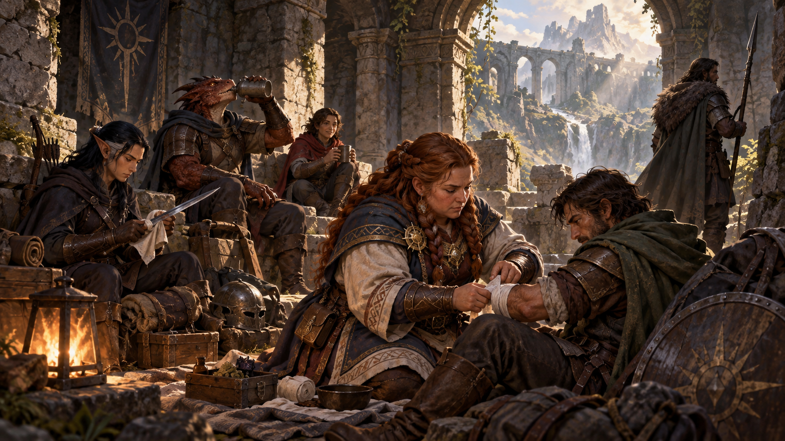
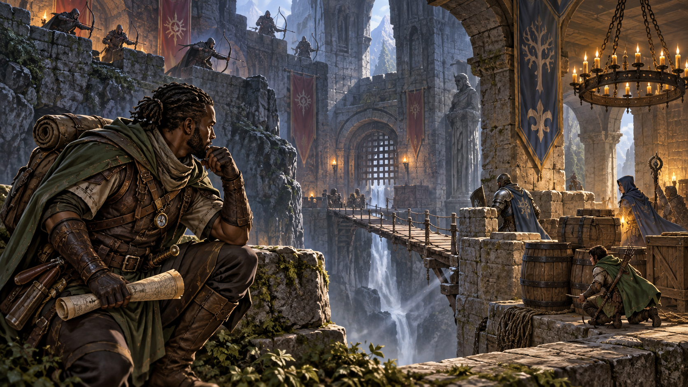
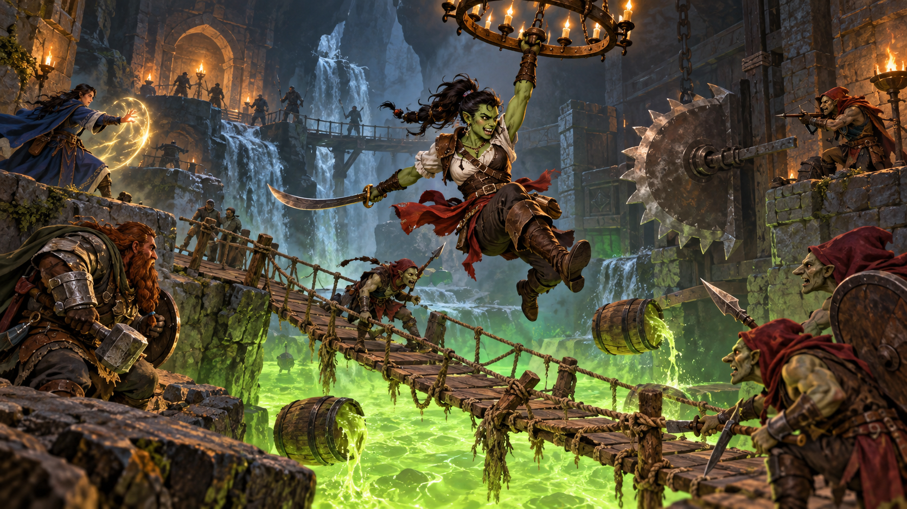
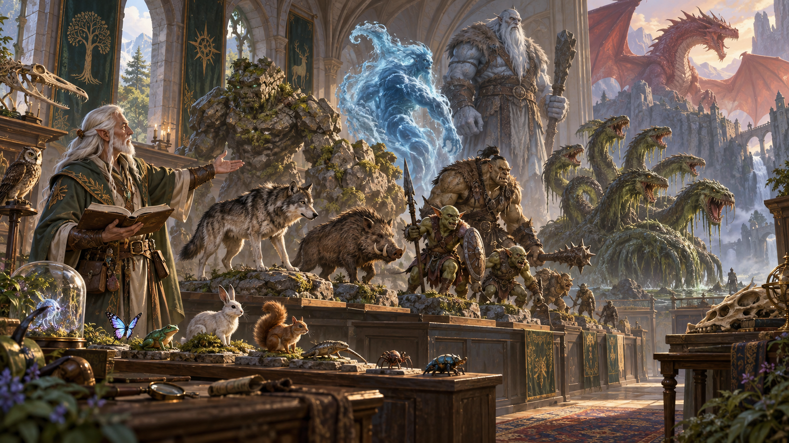

Nguồn: *D&D Basic Rules (Version 1.0), 2018*, trang 165-167.

*Thiết kế [cuộc chạm trán](99-glossary.md#encounter) kết hợp trí tưởng tượng, thử thách và niềm vui của cả nhóm. Minh họa nguyên bản tạo bằng OpenAI ImageGen cho bản dịch này.*

Khi tạo cuộc chạm trán chiến đấu, hãy để trí tưởng tượng tự do và xây dựng điều người chơi sẽ thích. Sau khi xác định các chi tiết, dùng phần này để điều chỉnh độ khó cuộc chạm trán.

## Độ khó cuộc chạm trán chiến đấu (Combat Encounter Difficulty)

*Bốn mức độ khó thể hiện mức tài nguyên và hiểm nguy mà nhóm có thể phải đối mặt. Minh họa nguyên bản tạo bằng OpenAI ImageGen cho bản dịch này.*

Có bốn mức độ khó.

**Dễ (Easy).** Cuộc chạm trán dễ không làm hao tổn đáng kể tài nguyên nhân vật hoặc đặt họ vào hiểm nguy nghiêm trọng. Họ có thể mất vài [điểm sinh lực](99-glossary.md#hit-points), nhưng gần như chắc chắn thắng.

**Trung bình (Medium).** Cuộc chạm trán trung bình thường có một hoặc hai khoảnh khắc đáng sợ với người chơi, nhưng nhân vật nên thắng mà không ai thiệt mạng. Một hoặc nhiều người có thể cần dùng tài nguyên chữa lành.

**Khó (Hard).** Cuộc chạm trán khó có thể diễn biến xấu với [nhà phiêu lưu](99-glossary.md#adventurer). Nhân vật yếu hơn có thể bị loại khỏi cuộc chiến; có một khả năng nhỏ một hoặc nhiều nhân vật chết.

**Chết chóc (Deadly).** Cuộc chạm trán chết chóc có thể giết một hoặc nhiều [nhân vật người chơi](99-glossary.md#player-character). Sống sót thường cần chiến thuật tốt và suy nghĩ nhanh; nhóm có nguy cơ thất bại.

### Ngưỡng [XP](99-glossary.md#experience-points) theo [cấp nhân vật](99-glossary.md#level) (XP Thresholds by Character Level)

| Cấp nhân vật | Dễ | Trung bình | Khó | Chết chóc |
| --- | --- | --- | --- | --- |
| 1 | 25 | 50 | 75 | 100 |
| 2 | 50 | 100 | 150 | 200 |
| 3 | 75 | 150 | 225 | 400 |
| 4 | 125 | 250 | 375 | 500 |
| 5 | 250 | 500 | 750 | 1.100 |
| 6 | 300 | 600 | 900 | 1.400 |
| 7 | 350 | 750 | 1.100 | 1.700 |
| 8 | 450 | 900 | 1.400 | 2.100 |
| 9 | 550 | 1.100 | 1.600 | 2.400 |
| 10 | 600 | 1.200 | 1.900 | 2.800 |
| 11 | 800 | 1.600 | 2.400 | 3.600 |
| 12 | 1.000 | 2.000 | 3.000 | 4.500 |
| 13 | 1.100 | 2.200 | 3.400 | 5.100 |
| 14 | 1.250 | 2.500 | 3.800 | 5.700 |
| 15 | 1.400 | 2.800 | 4.300 | 6.400 |
| 16 | 1.600 | 3.200 | 4.800 | 7.200 |
| 17 | 2.000 | 3.900 | 5.900 | 8.800 |
| 18 | 2.100 | 4.200 | 6.300 | 9.500 |
| 19 | 2.400 | 4.900 | 7.300 | 10.900 |
| 20 | 2.800 | 5.700 | 8.500 | 12.700 |

## Đánh giá độ khó cuộc chạm trán (Evaluating Encounter Difficulty)

*Đánh giá cuộc chạm trán đòi hỏi so sánh ngưỡng của cả nhóm với tổng XP đã điều chỉnh của đối thủ. Minh họa nguyên bản tạo bằng OpenAI ImageGen cho bản dịch này.*

Dùng phương pháp sau để ước lượng độ khó bất kỳ cuộc chạm trán chiến đấu nào.

1. **Xác định ngưỡng XP.** Trước hết, xác định ngưỡng điểm kinh nghiệm (XP) cho mỗi nhân vật trong nhóm. Bảng Ngưỡng XP theo cấp nhân vật có bốn ngưỡng cho mỗi cấp, mỗi ngưỡng ứng với một mức độ khó. Dùng cấp nhân vật xác định ngưỡng của họ. Lặp lại cho mọi nhân vật trong nhóm.
2. **Xác định ngưỡng XP của nhóm.** Với mỗi mức độ khó, cộng ngưỡng XP của các nhân vật để có ngưỡng XP của nhóm. Bạn nhận được bốn tổng, mỗi tổng ứng với một mức độ khó.

   Ví dụ, nhóm có ba nhân vật cấp 3 và một nhân vật cấp 2 có tổng ngưỡng như sau:

   - Dễ: 275 XP (75 + 75 + 75 + 50).
   - Trung bình: 550 XP (150 + 150 + 150 + 100).
   - Khó: 825 XP (225 + 225 + 225 + 150).
   - Chết chóc: 1.400 XP (400 + 400 + 400 + 200).

   Ghi lại các tổng này vì có thể dùng chúng cho mọi cuộc chạm trán trong [cuộc phiêu lưu](99-glossary.md#adventure).

3. **Tính tổng XP [quái vật](99-glossary.md#monster).** Cộng XP mọi quái vật trong cuộc chạm trán. Mỗi quái vật có giá trị XP trong [khối thông số](99-glossary.md#stat-block).
4. **Điều chỉnh tổng XP khi có nhiều quái vật.** Nếu cuộc chạm trán có hơn một quái vật, áp dụng hệ số nhân cho tổng XP của chúng. Càng nhiều quái vật, bạn càng tung nhiều đòn tấn công vào nhân vật trong một vòng, và cuộc chạm trán càng nguy hiểm. Để đánh giá đúng độ khó, nhân tổng XP mọi quái vật với giá trị trong bảng Hệ số nhân cuộc chạm trán.

   Ví dụ, bốn quái vật có tổng 500 XP: nhân 2 được XP điều chỉnh 1.000. Giá trị điều chỉnh này không phải số XP quái vật đáng được thưởng; mục đích duy nhất là giúp đánh giá chính xác độ khó.

   Khi tính, không đếm quái vật có [mức thách thức](99-glossary.md#challenge-rating) thấp hơn đáng kể so với mức thách thức trung bình của các quái vật khác trong nhóm, trừ khi bạn cho rằng quái vật yếu góp phần đáng kể vào độ khó.

5. **So sánh XP.** So XP điều chỉnh của quái vật với ngưỡng XP nhóm. Ngưỡng bằng giá trị điều chỉnh quyết định độ khó. Nếu không bằng ngưỡng nào, dùng ngưỡng gần nhất thấp hơn giá trị điều chỉnh.

   Ví dụ, một bugbear và ba hobgoblin có XP điều chỉnh 1.000, tạo cuộc chạm trán khó cho nhóm ba nhân vật cấp 3 và một nhân vật cấp 2 (ngưỡng khó 825 XP, chết chóc 1.400 XP).

### Hệ số nhân cuộc chạm trán (Encounter Multipliers)

*Nhiều quái vật tạo ra nhiều hành động hơn và làm mức đe dọa tăng nhanh. Minh họa nguyên bản tạo bằng OpenAI ImageGen cho bản dịch này.*

| Số quái vật | Hệ số nhân |
| --- | --- |
| 1 | × 1 |
| 2 | × 1,5 |
| 3-6 | × 2 |
| 7-10 | × 2,5 |
| 11-14 | × 3 |
| 15 trở lên | × 4 |

### Quy mô nhóm (Party Size)

Hướng dẫn trên giả định nhóm có ba đến năm nhà phiêu lưu.

Nếu nhóm dưới ba nhân vật, dùng hệ số cao hơn một bậc trong bảng Hệ số nhân cuộc chạm trán. Ví dụ, dùng 1,5 khi đánh một quái vật, và 5 khi đánh nhóm từ mười lăm quái vật trở lên.

Nếu nhóm từ sáu nhân vật trở lên, dùng hệ số thấp hơn một bậc. Với một quái vật, dùng 0,5.

### Cuộc chạm trán nhiều phần (Multipart Encounters)

Đôi khi cuộc chạm trán có nhiều kẻ địch mà nhóm không đối mặt cùng lúc. Ví dụ, quái vật đến thành từng đợt. Để xác định độ khó, coi mỗi phần hoặc đợt riêng biệt là một cuộc chạm trán riêng.

Nhóm không thể hưởng lợi từ [nghỉ ngắn](99-glossary.md#short-rest) giữa các phần, nên không thể dùng Xúc xắc Sinh lực để hồi HP hoặc hồi khả năng cần nghỉ ngắn. Theo quy tắc chung, nếu XP điều chỉnh của quái vật trong cuộc chạm trán nhiều phần vượt một phần ba tổng XP dự kiến của nhóm trong ngày phiêu lưu (xem bên dưới), cuộc chạm trán sẽ khó hơn tổng các phần của nó.

## Xây dựng cuộc chạm trán theo ngân sách (Building Encounters on a Budget)

*Ngân sách XP giúp lựa chọn một đối thủ lớn hoặc nhiều đối thủ nhỏ cho cùng mức thử thách. Minh họa nguyên bản tạo bằng OpenAI ImageGen cho bản dịch này.*

Bạn có thể xây dựng cuộc chạm trán khi biết độ khó mong muốn. Ngưỡng XP của nhóm cho ngân sách XP để chi cho quái vật, tạo cuộc chạm trán dễ, trung bình, khó và chết chóc. Nhớ rằng nhóm quái vật tiêu tốn nhiều ngân sách hơn giá trị XP cơ bản cho thấy (xem bước 4).

Ví dụ, với nhóm ở bước 2, bạn tạo cuộc chạm trán trung bình bằng cách bảo đảm XP điều chỉnh ít nhất 550 (ngưỡng trung bình) và không quá 825 (ngưỡng khó). Một quái vật thách thức 3, như [manticore](99-glossary.md#manticore) hoặc [gấu cú](99-glossary.md#owlbear) (owlbear), đáng 700 XP nên là một lựa chọn. Nếu muốn hai quái vật, mỗi con tính bằng 1,5 lần XP cơ bản. Hai sói hung (dire wolf), mỗi con 200 XP, có XP điều chỉnh 600, cũng là cuộc chạm trán trung bình cho nhóm.

Để hỗ trợ cách này, Phụ lục B của *[Dungeon Master](99-glossary.md#dungeon-master)'s Guide* liệt kê mọi quái vật trong *Monster Manual* theo mức thách thức. Xem “Quái vật theo mức thách thức” ở cuối chương để có danh sách theo CR của các quái vật trong tài liệu này.

## Ngày phiêu lưu (The Adventuring Day)

*Một ngày phiêu lưu tiêu hao dần sinh lực, phép thuật và các tài nguyên khác của nhóm. Minh họa nguyên bản tạo bằng OpenAI ImageGen cho bản dịch này.*

Với điều kiện phiêu lưu điển hình và vận may trung bình, phần lớn nhóm xử lý được khoảng sáu đến tám cuộc chạm trán trung bình hoặc khó mỗi ngày. Nhiều cuộc chạm trán dễ thì xử lý được nhiều hơn; nhiều cuộc chạm trán chết chóc thì ít hơn.

Tương tự cách xác định độ khó cuộc chạm trán, bạn có thể dùng XP quái vật và đối thủ khác trong cuộc phiêu lưu để ước lượng nhóm có thể tiến xa đến đâu.

Với mỗi nhân vật, dùng bảng XP ngày phiêu lưu để ước tính XP dự kiến kiếm được trong ngày. Cộng giá trị mọi thành viên để có tổng cho ngày phiêu lưu của nhóm. Đây là ước tính sơ bộ XP điều chỉnh của các cuộc chạm trán nhóm xử lý được trước khi cần [nghỉ dài](99-glossary.md#long-rest).

### XP ngày phiêu lưu (Adventuring Day XP)

| Cấp | XP điều chỉnh mỗi ngày, mỗi nhân vật | Cấp | XP điều chỉnh mỗi ngày, mỗi nhân vật |
| --- | --- | --- | --- |
| 1 | 300 | 11 | 10.500 |
| 2 | 600 | 12 | 11.500 |
| 3 | 1.200 | 13 | 13.500 |
| 4 | 1.700 | 14 | 15.000 |
| 5 | 3.500 | 15 | 18.000 |
| 6 | 4.000 | 16 | 20.000 |
| 7 | 5.000 | 17 | 25.000 |
| 8 | 6.000 | 18 | 27.000 |
| 9 | 7.500 | 19 | 30.000 |
| 10 | 9.000 | 20 | 40.000 |

### Nghỉ ngắn (Short Rests)

*Nghỉ ngắn cho phép nhóm hồi phục một phần trước khi tiếp tục hành trình. Minh họa nguyên bản tạo bằng OpenAI ImageGen cho bản dịch này.*

Nhìn chung, trong một ngày phiêu lưu trọn vẹn, nhóm có thể cần hai lần nghỉ ngắn, khoảng khi đi qua một phần ba và hai phần ba ngày.

## Điều chỉnh độ khó cuộc chạm trán (Modifying Encounter Difficulty)

*Địa hình, tầm nhìn, bất ngờ và [che chắn](99-glossary.md#cover) có thể thay đổi đáng kể độ khó thực tế. Minh họa nguyên bản tạo bằng OpenAI ImageGen cho bản dịch này.*

Địa điểm và tình huống có thể khiến cuộc chạm trán dễ hoặc khó hơn.

Tăng độ khó một bậc (ví dụ dễ thành trung bình) nếu nhân vật chịu bất lợi tình huống mà kẻ địch không có. Giảm một bậc nếu nhân vật có [lợi thế](99-glossary.md#advantage) tình huống mà kẻ địch không có. Mỗi lợi thế hoặc bất lợi bổ sung đẩy độ khó thêm một bậc theo hướng tương ứng. Nếu có cả lợi thế và bất lợi, chúng triệt tiêu nhau.

Bất lợi tình huống gồm:

- Cả nhóm bị bất ngờ, kẻ địch không bị.
- Kẻ địch có che chắn, nhóm không có.
- Nhân vật không thể thấy kẻ địch.
- Nhân vật chịu sát thương mỗi vòng từ hiệu ứng môi trường hoặc nguồn ma thuật.
- Nhân vật treo trên dây, đang leo tường/vách dựng đứng, bị dính vào sàn hoặc ở tình huống khác cản di chuyển.

Lợi thế tình huống tương tự bất lợi, nhưng mang lợi cho nhân vật thay vì kẻ địch.

## Cuộc chạm trán chiến đấu thú vị (Fun Combat Encounters)

*Địa hình có chuyển động, độ cao và rủi ro chung khiến chiến đấu sinh động hơn. Minh họa nguyên bản tạo bằng OpenAI ImageGen cho bản dịch này.*

Các yếu tố sau tăng thú vị và hồi hộp:

- Địa hình vốn gây rủi ro cho cả nhân vật và kẻ địch, như cầu dây sờn và vũng chất nhầy xanh.
- Địa hình tạo chênh cao, như hố, chồng thùng rỗng và gờ cao.
- Yếu tố khuyến khích hoặc buộc cả hai bên di chuyển, như đèn chùm, thùng thuốc súng/dầu và bẫy lưỡi xoay.
- Kẻ địch ở chỗ khó tiếp cận hoặc vị trí phòng thủ, khiến nhân vật thường đánh tầm xa phải di chuyển quanh chiến trường.

> **Mức thách thức (Challenge Rating)**
>
> Khi xây dựng cuộc chạm trán hoặc cuộc phiêu lưu, đặc biệt ở cấp thấp, hãy thận trọng với quái vật có mức thách thức cao hơn cấp trung bình nhóm. Sinh vật ấy có thể gây đủ sát thương chỉ trong một hành động để loại nhà phiêu lưu cấp thấp hơn. Ví dụ, [ogre](99-glossary.md#ogre) có thách thức 2 nhưng có thể giết [pháp sư](99-glossary.md#wizard) cấp 1 bằng một cú đánh.

## Quái vật theo mức thách thức (Monsters by Challenge Rating)

*Mức thách thức giúp DM nhanh chóng tìm sinh vật phù hợp với cuộc phiêu lưu. Minh họa nguyên bản tạo bằng OpenAI ImageGen cho bản dịch này.*

Danh sách sau sắp xếp quái vật trong tài liệu này theo mức thách thức.

### Thách thức 0 (0-10 XP)

- Bụi cây thức tỉnh (Awakened shrub).
- Khỉ đầu chó (Baboon).
- Lửng (Badger).
- Dơi (Bat).
- Mèo (Cat).
- Thường dân (Commoner).
- Cua (Crab).
- Hươu (Deer).
- Đại bàng (Eagle).
- Ếch (Frog).
- Bọ lửa khổng lồ (Giant fire beetle).
- Dê (Goat).
- Diều hâu (Hawk).
- Linh cẩu (Hyena).
- Chó rừng (Jackal).
- Thằn lằn (Lizard).
- Bạch tuộc (Octopus).
- Cú (Owl).
- Cá quipper (Quipper).
- Chuột (Rat).
- Quạ (Raven).
- Bọ cạp (Scorpion).
- Cá ngựa (Sea horse).
- Nhện (Spider).
- Kền kền (Vulture).
- Chồn (Weasel).

### Thách thức 1/8 (25 XP)

- Kẻ cướp (Bandit).
- Diều hâu máu (Blood hawk).
- Lạc đà (Camel).
- Tín đồ tà giáo (Cultist).
- Rắn bay (Flying snake).
- Cua khổng lồ (Giant crab).
- Chuột khổng lồ (Giant rat).
- Chồn khổng lồ (Giant weasel).
- Lính gác (Guard).
- [Kobold](99-glossary.md#kobold) (Kobold).
- Chó ngao (Mastiff).
- Người cá (Merfolk).
- La (Mule).
- Rắn độc (Poisonous snake).
- Ngựa nhỏ (Pony).
- [Stirge](99-glossary.md#stirge) (Stirge).
- Cành cây tai ương (Twig blight).

### Thách thức 1/4 (50 XP)

- Tu sinh (Acolyte).
- Chim mỏ rìu (Axe beak).
- Chó chớp biến (Blink dog).
- Lợn rừng (Boar).
- Trăn (Constrictor snake).
- Ngựa kéo (Draft horse).
- Nai sừng lớn (Elk).
- Kiếm bay (Flying sword).
- Lửng khổng lồ (Giant badger).
- Dơi khổng lồ (Giant bat).
- Rết khổng lồ (Giant centipede).
- Ếch khổng lồ (Giant frog).
- Thằn lằn khổng lồ (Giant lizard).
- Cú khổng lồ (Giant owl).
- Rắn độc khổng lồ (Giant poisonous snake).
- Nhện sói khổng lồ (Giant wolf spider).
- [Goblin](99-glossary.md#goblin) (Goblin).
- Báo (Panther).
- Thằn lằn bay Pteranodon (Pteranodon).
- Ngựa cưỡi (Riding horse).
- Bộ xương (Skeleton).
- Bầy dơi (Swarm of bats).
- Bầy chuột (Swarm of rats).
- Bầy quạ (Swarm of ravens).
- Sói (Wolf).
- Thây ma (Zombie).

### Thách thức 1/2 (100 XP)

- Vượn (Ape).
- Gấu đen (Black bear).
- [Cockatrice](99-glossary.md#cockatrice) (Cockatrice).
- Cá sấu (Crocodile).
- Dê khổng lồ (Giant goat).
- Cá ngựa khổng lồ (Giant sea horse).
- Ong bắp cày khổng lồ (Giant wasp).
- [Gnoll](99-glossary.md#gnoll) (Gnoll).
- Hobgoblin (Hobgoblin).
- Người thằn lằn (Lizardfolk).
- Orc (Orc).
- Cá mập rạn (Reef shark).
- Người dê (Satyr).
- Bầy côn trùng (Swarm of insects).
- Côn đồ (Thug).
- Chiến mã (Warhorse).
- Worg (Worg).

### Thách thức 1 (200 XP)

- Giáp sống (Animated armor).
- Gấu nâu (Brown bear).
- Bugbear (Bugbear).
- Chó tử thần (Death dog).
- Sói hung (Dire wolf).
- Quỷ ăn xác (Ghoul).
- Đại bàng khổng lồ (Giant eagle).
- Linh cẩu khổng lồ (Giant hyena).
- Bạch tuộc khổng lồ (Giant octopus).
- Nhện khổng lồ (Giant spider).
- Cóc khổng lồ (Giant toad).
- Kền kền khổng lồ (Giant vulture).
- Nữ yêu chim (Harpy).
- Ưng mã (Hippogriff).
- Sư tử (Lion).
- Bầy cá quipper (Swarm of quippers).
- Hổ (Tiger).

### Thách thức 2 (450 XP)

- Khủng long Allosaurus (Allosaurus).
- Cây thức tỉnh (Awakened tree).
- Chiến binh cuồng nộ (Berserker).
- Nhân mã (Centaur).
- Quỷ đá (Gargoyle).
- Lợn rừng khổng lồ (Giant boar).
- Trăn khổng lồ (Giant constrictor snake).
- Nai sừng lớn khổng lồ (Giant elk).
- Grick (Grick).
- Sư điểu (Griffon).
- Cá mập săn (Hunter shark).
- Nothic (Nothic).
- Nhầy vàng đất (Ochre jelly).
- Ogre (Ogre).
- Thiên mã (Pegasus).
- Bò sát biển Plesiosaurus (Plesiosaurus).
- Gấu Bắc Cực (Polar bear).
- Tu sĩ (Priest).
- Tê giác (Rhinoceros).
- Hổ răng kiếm (Saber-toothed tiger).
- Bầy rắn độc (Swarm of poisonous snakes).

### Thách thức 3 (700 XP)

- Khủng long Ankylosaurus (Ankylosaurus).
- [Basilisk](99-glossary.md#basilisk) (Basilisk).
- Kẻ giả dạng (Doppelganger).
- Bọ cạp khổng lồ (Giant scorpion).
- Chó săn địa ngục (Hell hound).
- Cá voi sát thủ (Killer whale).
- Hiệp sĩ (Knight).
- Manticore (Manticore).
- Người đầu bò (Minotaur).
- Xác ướp (Mummy).
- Gấu cú (Owlbear).
- Nhện chuyển cõi (Phase spider).
- Kẻ quan sát (Spectator).
- Người sói (Werewolf).
- [Wight](99-glossary.md#wight) (Wight).
- Sói mùa đông (Winter wolf).
- Người tuyết Yeti (Yeti).

### Thách thức 4 (1,100 XP)

- [Nữ yêu than khóc](99-glossary.md#banshee) (Banshee).
- Voi (Elephant).
- Sọ lửa (Flameskull).
- Ma (Ghost).

### Thách thức 5 (1,800 XP)

- [Nguyên tố khí](99-glossary.md#elemental) (Air elemental).
- Nguyên tố đất (Earth elemental).
- Nguyên tố lửa (Fire elemental).
- [Golem](99-glossary.md#golem) thịt (Flesh golem).
- Cá sấu khổng lồ (Giant crocodile).
- Cá mập khổng lồ (Giant shark).
- Khổng nhân đồi (Hill giant).
- Khủng long ba sừng (Triceratops).
- [Troll](99-glossary.md#troll) (Troll).
- Nguyên tố nước (Water elemental).

### Thách thức 6 (2,300 XP)

- [Chimera](99-glossary.md#chimera) (Chimera).
- Khổng nhân một mắt (Cyclops).
- Pháp sư (Mage).
- Voi ma mút (Mammoth).
- Nữ yêu tóc rắn (Medusa).
- [Wyvern](99-glossary.md#wyvern) (Wyvern).

### Thách thức 7 (2,900 XP)

- Vượn khổng lồ (Giant ape).

### Thách thức 8 (3,900 XP)

- Khổng nhân băng giá (Frost giant).
- Hydra (Hydra).
- Khủng long bạo chúa (Tyrannosaurus rex).
- Rồng xanh lá non (Young green dragon).

### Thách thức 9 (5,000 XP)

- Khổng nhân lửa (Fire giant).

### Thách thức 10 (5,900 XP)

- Golem đá (Stone golem).

### Thách thức 17 (18,000 XP)

- Rồng đỏ trưởng thành (Adult red dragon).

---

**Thông báo sử dụng trong bản gốc:** Không được bán lại. Được phép in và sao chụp tài liệu này chỉ để sử dụng cá nhân.
