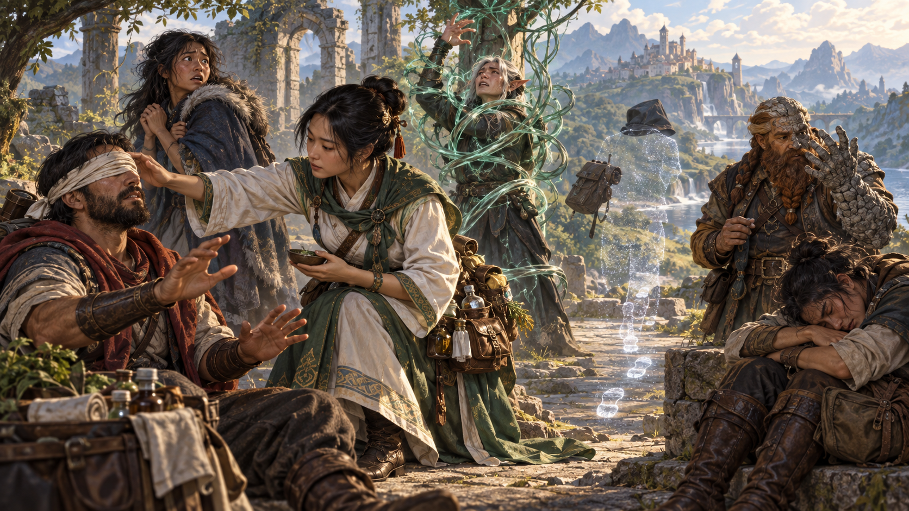
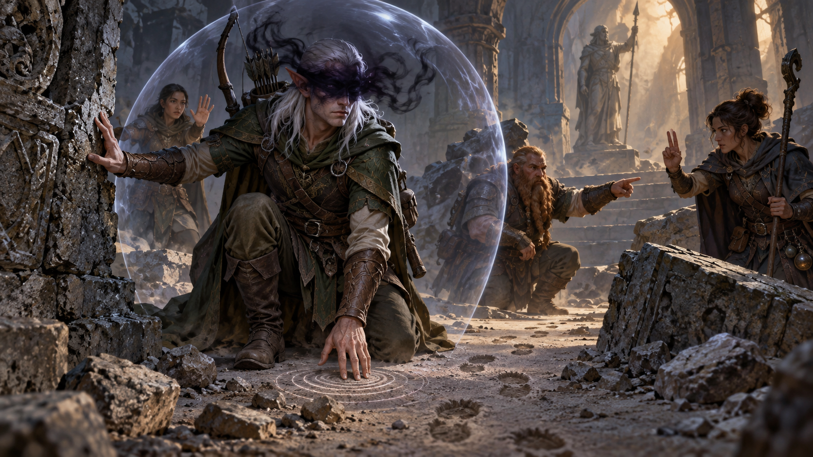
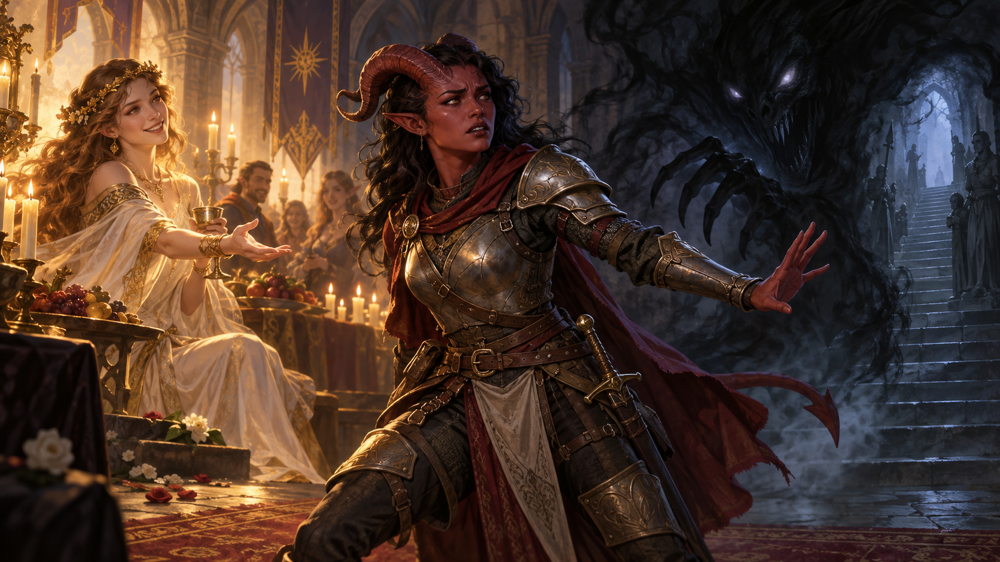
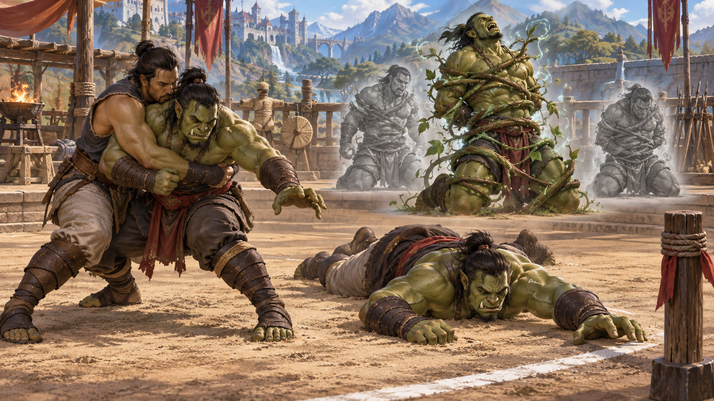
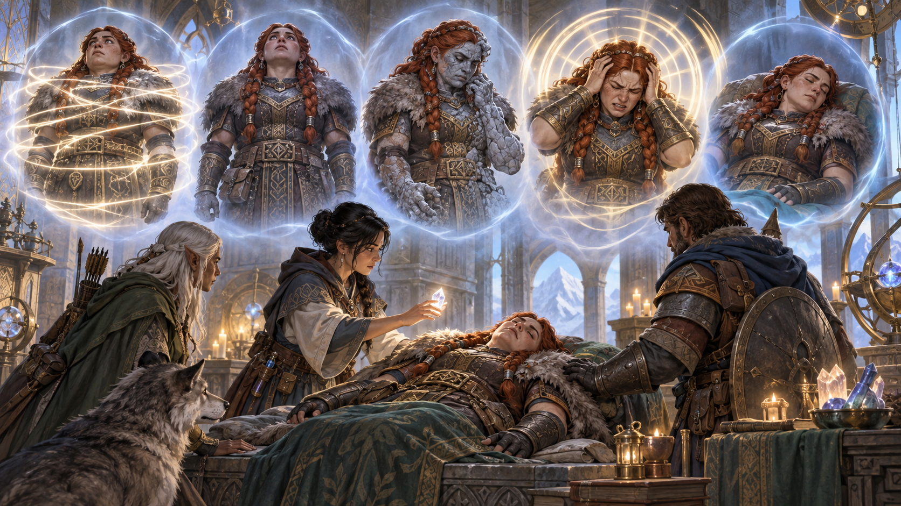
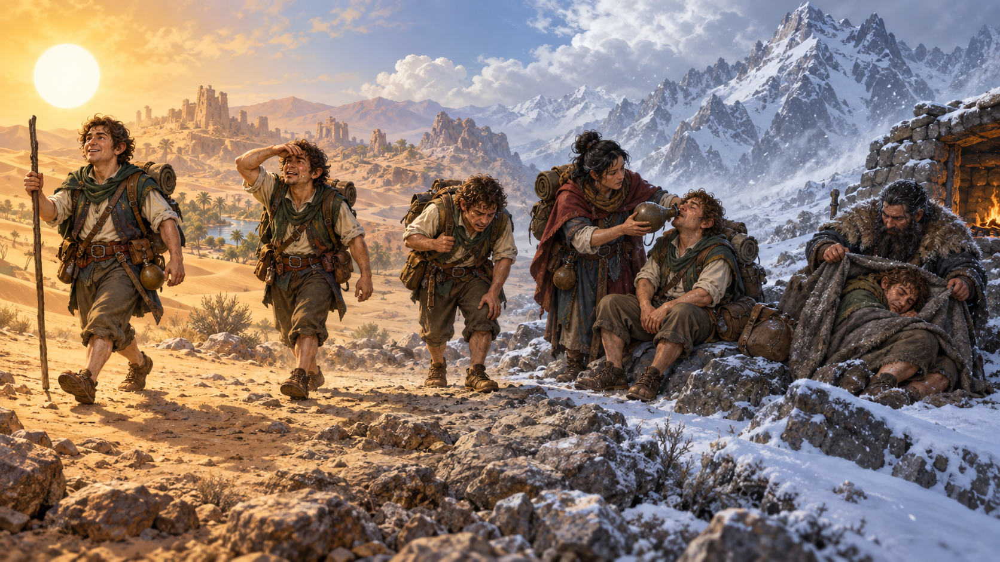

Nguồn: *D&D Basic Rules (Version 1.0), 2018*, trang 171-172 (phần Trạng thái trên trang 172).

*Trạng thái có thể thay đổi khả năng cảm nhận, hành động, di chuyển và sinh tồn của một sinh vật. Minh họa nguyên bản tạo bằng OpenAI ImageGen cho bản dịch này.*

Trạng thái thay đổi khả năng của sinh vật theo nhiều cách, có thể phát sinh từ phép, [đặc tính lớp](99-glossary.md#class-feature), đòn tấn công [quái vật](99-glossary.md#monster) hoặc hiệu ứng khác. Phần lớn [trạng thái](99-glossary.md#condition), như mù, gây suy giảm; một số, như vô hình, có thể có lợi.

Trạng thái tồn tại đến khi được khắc phục (ví dụ, đứng dậy khắc phục ngã sấp) hoặc trong thời lượng do hiệu ứng gây ra nó quy định.

Nếu nhiều hiệu ứng áp đặt cùng trạng thái, mỗi lần áp đặt có thời lượng riêng, nhưng tác động trạng thái không nặng thêm. Sinh vật hoặc có trạng thái hoặc không có.

Các định nghĩa dưới đây quy định điều xảy ra khi sinh vật chịu trạng thái.

## [Mù (Blinded)](99-glossary.md#blinded)

*Mù và điếc khiến sinh vật mất khả năng dựa vào thị giác hoặc thính giác. Minh họa nguyên bản tạo bằng OpenAI ImageGen cho bản dịch này.*

- Không thể thấy và tự động thất bại mọi kiểm tra thuộc tính cần thị giác.
- Tung tấn công vào sinh vật có [lợi thế](99-glossary.md#advantage); [tung tấn công](99-glossary.md#attack-roll) của sinh vật có bất lợi.

## [Mê hoặc](99-glossary.md#charmed) (Charmed)

*Mê hoặc và hoảng sợ tác động đến lựa chọn mục tiêu, hành động và hướng di chuyển. Minh họa nguyên bản tạo bằng OpenAI ImageGen cho bản dịch này.*

- Không thể tấn công kẻ mê hoặc mình hoặc nhắm kẻ đó bằng khả năng gây hại hay hiệu ứng ma thuật gây hại.
- Kẻ mê hoặc có lợi thế mọi kiểm tra thuộc tính để tương tác xã hội với sinh vật.

## [Điếc](99-glossary.md#deafened) (Deafened)

- Không thể nghe và tự động thất bại mọi kiểm tra thuộc tính cần thính giác.

## [Hoảng sợ](99-glossary.md#frightened) (Frightened)

- Có bất lợi kiểm tra thuộc tính và tung tấn công khi nguồn gây sợ nằm trong đường nhìn.
- Không thể tự nguyện di chuyển gần nguồn gây sợ hơn.

## Bị [vật lộn](99-glossary.md#grapple) (Grappled)

*Vật lộn, ngã sấp và kiềm giữ hạn chế khả năng di chuyển hoặc chiến đấu hiệu quả. Minh họa nguyên bản tạo bằng OpenAI ImageGen cho bản dịch này.*

- Tốc độ thành 0 và không hưởng bất kỳ thưởng tốc độ nào.
- Trạng thái kết thúc nếu kẻ vật lộn mất năng lực hành động (xem trạng thái đó).
- Cũng kết thúc nếu hiệu ứng đưa sinh vật ra khỏi [tầm với](99-glossary.md#reach) kẻ vật lộn hoặc hiệu ứng vật lộn, như bị phép Sóng sấm (*thunderwave*) hất đi.

## [Mất năng lực hành động](99-glossary.md#incapacitated) (Incapacitated)

- Không thể dùng hành động hoặc phản ứng.

## [Vô hình](99-glossary.md#invisible) (Invisible)

- Không thể thấy sinh vật nếu không có ma thuật hoặc giác quan đặc biệt hỗ trợ. Khi xét việc ẩn nấp, sinh vật được coi là bị che khuất nặng. Có thể phát hiện vị trí qua tiếng động hoặc dấu vết nó để lại.
- Tung tấn công vào sinh vật có bất lợi; tung tấn công của sinh vật có lợi thế.

## [Tê liệt](99-glossary.md#paralyzed) (Paralyzed)

*Tê liệt, hóa đá, choáng và bất tỉnh đều có thể khiến sinh vật gần như không thể tự bảo vệ. Minh họa nguyên bản tạo bằng OpenAI ImageGen cho bản dịch này.*

- Mất năng lực hành động (xem trạng thái đó), không thể di chuyển hoặc nói.
- Tự động thất bại [cứu nguy](99-glossary.md#saving-throw) [Sức mạnh](99-glossary.md#strength) và [Khéo léo](99-glossary.md#dexterity).
- Tung tấn công vào sinh vật có lợi thế.
- Mọi đòn trúng là chí mạng nếu kẻ tấn công trong 5 [feet](99-glossary.md#feet) của sinh vật.

## [Hóa đá](99-glossary.md#petrified) (Petrified)

- Sinh vật cùng mọi đồ vật không ma thuật đang mặc/mang biến thành chất rắn vô tri (thường là đá). Trọng lượng tăng gấp mười và ngừng già đi.
- Mất năng lực hành động (xem trạng thái đó), không thể di chuyển/nói và không nhận biết xung quanh.
- Tung tấn công vào sinh vật có lợi thế.
- Tự động thất bại cứu nguy Sức mạnh và Khéo léo.
- Kháng mọi sát thương.
- Miễn nhiễm độc và bệnh, nhưng độc/bệnh đã có trong cơ thể chỉ bị đình chỉ, không bị hóa giải.

## [Trúng độc](99-glossary.md#poisoned) (Poisoned)

- Có bất lợi tung tấn công và kiểm tra thuộc tính.

## [Ngã sấp](99-glossary.md#prone) (Prone)

- Chỉ có thể bò, trừ khi đứng dậy để chấm dứt trạng thái.
- Có bất lợi tung tấn công.
- Tung tấn công vào sinh vật có lợi thế nếu kẻ tấn công trong 5 feet; nếu không, có bất lợi.

## [Kiềm giữ](99-glossary.md#restrained) (Restrained)

- Tốc độ thành 0 và không hưởng bất kỳ thưởng tốc độ nào.
- Tung tấn công vào sinh vật có lợi thế; tung tấn công của sinh vật có bất lợi.
- Có bất lợi cứu nguy Khéo léo.

## [Choáng](99-glossary.md#stunned) (Stunned)

- Mất năng lực hành động (xem trạng thái đó), không thể di chuyển và chỉ nói ngập ngừng.
- Tự động thất bại cứu nguy Sức mạnh và Khéo léo.
- Tung tấn công vào sinh vật có lợi thế.

## [Bất tỉnh](99-glossary.md#unconscious) (Unconscious)

- Mất năng lực hành động (xem trạng thái đó), không thể di chuyển/nói và không nhận biết xung quanh.
- Buông mọi thứ đang cầm và ngã sấp.
- Tự động thất bại cứu nguy Sức mạnh và Khéo léo.
- Tung tấn công vào sinh vật có lợi thế.
- Mọi đòn trúng là chí mạng nếu kẻ tấn công trong 5 feet của sinh vật.

## [Kiệt sức](99-glossary.md#exhaustion) (Exhaustion)

*Kiệt sức tích lũy theo từng mức và ngày càng làm suy giảm khả năng của sinh vật. Minh họa nguyên bản tạo bằng OpenAI ImageGen cho bản dịch này.*

Một số khả năng đặc biệt và hiểm họa môi trường, như đói hoặc tác động lâu dài của nhiệt độ đóng băng/nóng bỏng, có thể gây trạng thái đặc biệt gọi là kiệt sức. Kiệt sức có sáu mức. Hiệu ứng có thể cho sinh vật một hoặc nhiều mức theo mô tả.

| Mức | Hiệu ứng |
| --- | --- |
| 1 | Bất lợi kiểm tra thuộc tính |
| 2 | Tốc độ chia đôi |
| 3 | Bất lợi tung tấn công và cứu nguy |
| 4 | [HP](99-glossary.md#hit-points) tối đa chia đôi |
| 5 | Tốc độ giảm xuống 0 |
| 6 | Chết |

Nếu sinh vật đã kiệt sức chịu hiệu ứng gây kiệt sức khác, mức hiện tại tăng thêm số mức ghi trong mô tả hiệu ứng.

Sinh vật chịu hiệu ứng mức hiện tại và mọi mức thấp hơn. Ví dụ, kiệt sức mức 2 vừa chia đôi tốc độ vừa gây bất lợi kiểm tra thuộc tính.

Hiệu ứng xóa kiệt sức giảm mức theo mô tả; mọi hiệu ứng kiệt sức kết thúc nếu mức giảm xuống dưới 1.

Hoàn tất [nghỉ dài](99-glossary.md#long-rest) giảm 1 mức kiệt sức nếu sinh vật cũng đã ăn và uống. Được hồi sinh từ cõi chết cũng giảm 1 mức kiệt sức.

---

**Thông báo sử dụng trong bản gốc:** Không được bán lại. Được phép in và sao chụp tài liệu này chỉ để sử dụng cá nhân.
