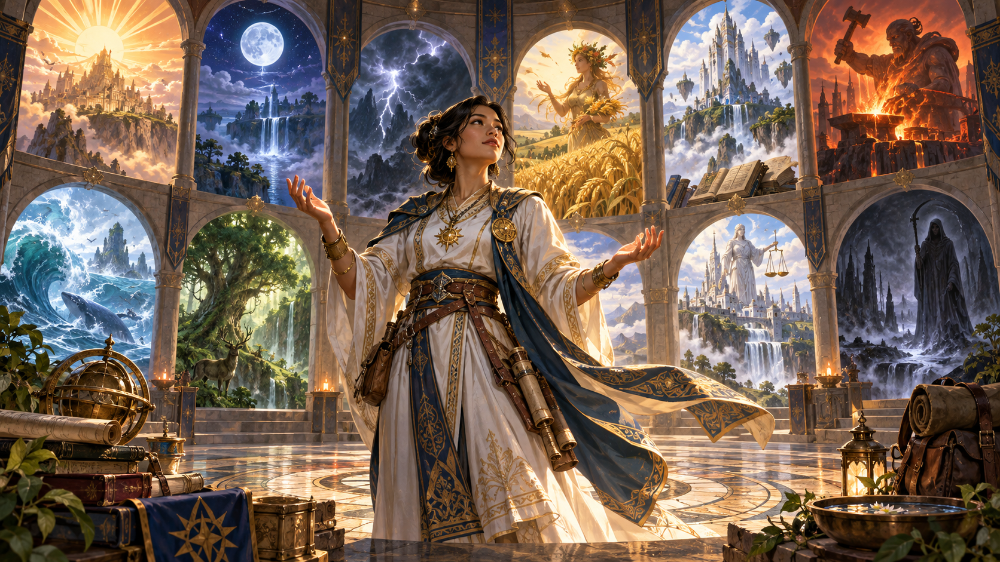
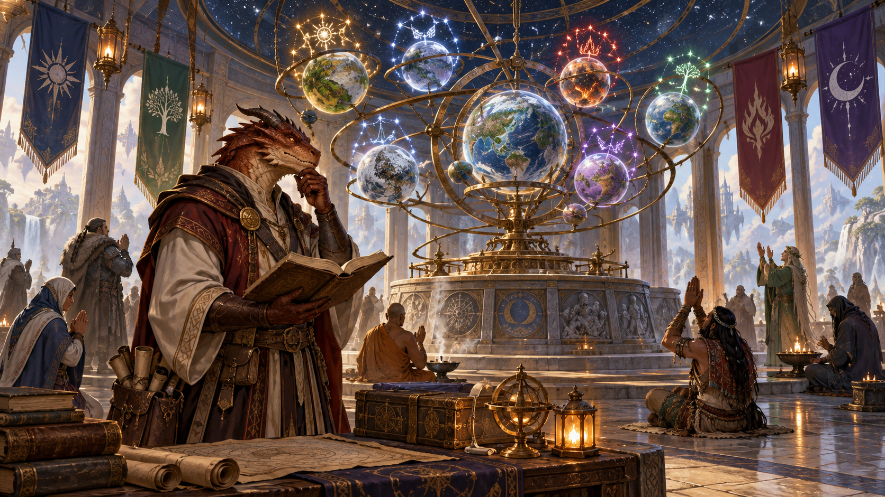
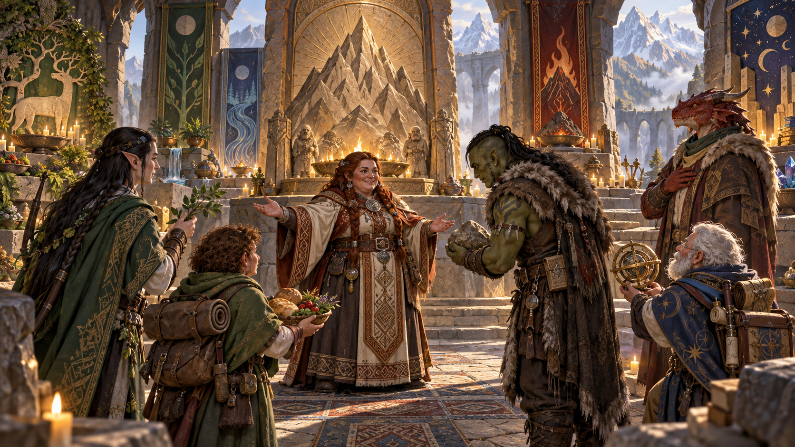
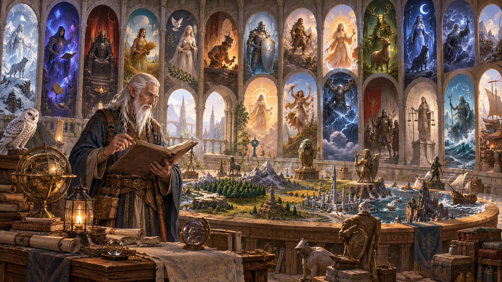

Nguồn: *D&D Basic Rules (Version 1.0), 2018*, trang 172-173 (phần Các vị thần trên trang 172).

*Tín ngưỡng trong thế giới fantasy phản ánh nhiều mặt của tự nhiên, xã hội và số phận. Minh họa nguyên bản tạo bằng OpenAI ImageGen cho bản dịch này.*

Tôn giáo là phần quan trọng của đời sống trong các thế giới đa vũ trụ D&D. Khi thần đi trên thế giới, giáo sĩ dẫn truyền quyền năng thần thánh, tà giáo hiến tế tối tăm trong hang ổ dưới đất và thánh kỵ sĩ rạng ngời đứng như hải đăng chống bóng tối, khó có thể thờ ơ với thần linh và phủ nhận họ tồn tại.

Nhiều người thờ các thần khác nhau tùy lúc và hoàn cảnh. Ví dụ, người ở Forgotten Realms có thể cầu Sune may mắn tình yêu, dâng lễ Waukeen trước khi đi chợ và cầu xoa dịu Talos khi bão dữ đến—tất cả trong cùng ngày. Nhiều người có một thần yêu thích, lấy lý tưởng và giáo huấn của vị ấy làm của mình. Một số ít hiến trọn mình cho một thần, thường làm tu sĩ hoặc người bảo vệ lý tưởng của thần ấy.

DM quyết định thần nào, nếu có, được thờ trong chiến dịch. Trong số thần hiện có, bạn chọn một vị để nhân vật phục vụ, thờ hoặc chỉ tỏ lòng kính bằng lời. Hoặc chọn vài thần nhân vật thường cầu nhất. Hoặc ghi nhớ các thần được tôn kính trong chiến dịch để gọi tên khi phù hợp. Nếu chơi giáo sĩ hoặc nhân vật có xuất thân Trợ tế (Acolyte), hãy quyết định nhân vật phục vụ/đã phục vụ thần nào và cân nhắc các lãnh địa gợi ý của thần khi chọn lãnh địa nhân vật.

## Các hệ thần D&D (D&D Pantheons)

*Mỗi thế giới có thể có hệ thần, truyền thống thờ phụng và cách diễn giải thần tính riêng. Minh họa nguyên bản tạo bằng OpenAI ImageGen cho bản dịch này.*

Mỗi thế giới trong đa vũ trụ D&D có các hệ thần riêng. Phụ lục này xét một hệ: Forgotten Realms.

### Forgotten Realms

Hàng chục thần được tôn kính, thờ phụng và kính sợ khắp Forgotten Realms. Ít nhất ba mươi vị được biết rộng rãi khắp Realms; nhiều hơn được thờ ở địa phương, bởi từng bộ lạc, giáo phái nhỏ hoặc các tông phái trong tổ chức đền thờ lớn hơn.

### Thần của các chủng ngoài loài người (Nonhuman Deities)

*Các dân tộc fantasy thường duy trì hệ thần và nghi lễ gắn với lịch sử cộng đồng của mình. Minh họa nguyên bản tạo bằng OpenAI ImageGen cho bản dịch này.*

Một số thần gắn chặt với chủng ngoài loài người được tôn kính trên nhiều thế giới, dù không luôn cùng cách. Các chủng ngoài loài người ở Forgotten Realms và Greyhawk cùng thờ những vị ấy.

Các chủng thường có cả hệ thần riêng. Ví dụ, ngoài Moradin, thần dwarf gồm vợ ông, Berronar Truesilver, và các thần được coi là con/cháu: Abbathor, Clangeddin Silverbeard, Dugmaren Brightmantle, Dumathoin, Gorm Gulthyn, Haela Brightaxe, Marthammor Duin, Sharindlar, Thard Harr và Vergadain. Từng thị tộc/vương quốc dwarf có thể tôn kính một số, tất cả hoặc không vị nào; một số có thần khác người ngoài không biết (hoặc biết bằng tên khác).

## Các vị thần Forgotten Realms (Deities of the Forgotten Realms)

*Các vị thần được phân biệt qua khuynh hướng, lãnh địa và biểu tượng trong truyền thống thờ phụng. Minh họa nguyên bản tạo bằng OpenAI ImageGen cho bản dịch này.*

*Ký hiệu khuynh hướng trong bảng: LG = trật tự thiện; NG = trung lập thiện; CG = hỗn loạn thiện; LN = trật tự trung lập; N = trung lập; CN = hỗn loạn trung lập; LE = trật tự ác; NE = trung lập ác; CE = hỗn loạn ác. Đây là phần giải thích ký hiệu của bản dịch.*

| Thần | Khuynh hướng | Lãnh địa gợi ý (Suggested Domains) | Biểu tượng |
| --- | --- | --- | --- |
| Auril, nữ thần mùa đông | NE | Tự nhiên (Nature), Bão tố (Tempest) | Bông tuyết sáu cánh |
| Azuth, thần pháp sư | LN | Tri thức (Knowledge) | Bàn tay trái chỉ lên, viền lửa |
| Bane, thần bạo quyền | LE | Chiến tranh (War) | Bàn tay phải đen dựng đứng, ngón cái và các ngón khép nhau |
| Beshaba, nữ thần bất hạnh | CE | Mưu mẹo (Trickery) | Gạc đen |
| Bhaal, thần sát nhân | NE | Tử vong (Death) | Sọ bao quanh bởi vòng giọt máu |
| Chauntea, nữ thần nông nghiệp | NG | Sự sống (Life) | Bó ngũ cốc hoặc hoa hồng nở trên ngũ cốc |
| Cyric, thần dối trá | CE | Mưu mẹo (Trickery) | Sọ trắng không hàm trên hình mặt trời tỏa tia đen hoặc tím |
| Deneir, thần chữ viết | NG | Tri thức (Knowledge) | Nến cháy trên mắt mở |
| Eldath, nữ thần hòa bình | NG | Sự sống (Life), Tự nhiên (Nature) | Thác đổ vào hồ tĩnh |
| Gond, thần chế tác | N | Tri thức (Knowledge) | Bánh răng có bốn nan hoa |
| Helm, thần bảo vệ | LN | Sự sống (Life), Ánh sáng (Light) | Mắt nhìn chăm chăm trên găng giáp trái dựng đứng |
| Ilmater, thần chịu đựng | LG | Sự sống (Life) | Hai tay buộc ở cổ tay bằng dây đỏ |
| Kelemvor, thần người chết | LN | Tử vong (Death) | Cánh tay xương dựng đứng cầm cân thăng bằng |
| Lathander, thần sinh thành và đổi mới | NG | Sự sống (Life), Ánh sáng (Light) | Con đường đi vào bình minh |
| Leira, nữ thần ảo ảnh | CN | Mưu mẹo (Trickery) | Tam giác chĩa xuống chứa xoáy sương |
| Lliira, nữ thần niềm vui | CG | Sự sống (Life) | Ba sao sáu cánh tạo tam giác |
| Loviatar, nữ thần đau đớn | LE | Tử vong (Death) | Roi gai chín đuôi |
| Malar, thần săn bắn | CE | Tự nhiên (Nature) | Bàn chân thú có vuốt |
| Mask, thần trộm cắp | CN | Mưu mẹo (Trickery) | Mặt nạ đen |
| Mielikki, nữ thần rừng | NG | Tự nhiên (Nature) | Đầu kỳ lân |
| Milil, thần thơ và ca | NG | Ánh sáng (Light) | Đàn hạc năm dây làm bằng lá |
| Myrkul, thần cái chết | NE | Tử vong (Death) | Sọ người trắng |
| Mystra, nữ thần ma thuật | NG | Tri thức (Knowledge) | Vòng bảy sao, hoặc chín sao bao quanh sương đỏ chảy, hoặc một sao duy nhất |
| Oghma, thần tri thức | N | Tri thức (Knowledge) | Cuộn trống |
| Savras, thần bói toán và số phận | LN | Tri thức (Knowledge) | Cầu pha lê chứa nhiều loại mắt |
| Selûne, nữ thần mặt trăng | CG | Tri thức (Knowledge), Sự sống (Life) | Đôi mắt bao quanh bởi bảy sao |
| Shar, nữ thần bóng tối và mất mát | NE | Tử vong (Death), Mưu mẹo (Trickery) | Đĩa đen có đường viền bao quanh |
| Silvanus, thần thiên nhiên hoang dã | N | Tự nhiên (Nature) | Lá sồi |
| Sune, nữ thần tình yêu và sắc đẹp | CG | Sự sống (Life), Ánh sáng (Light) | Mặt phụ nữ tóc đỏ xinh đẹp |
| Talona, nữ thần bệnh và độc | CE | Tử vong (Death) | Ba giọt lệ trên tam giác |
| Talos, thần bão | CE | Bão tố (Tempest) | Ba tia sét tỏa từ điểm giữa |
| Tempus, thần chiến tranh | N | Chiến tranh (War) | Kiếm cháy dựng đứng |
| Torm, thần can đảm và hy sinh bản thân | LG | Chiến tranh (War) | Găng giáp phải trắng |
| Tymora, nữ thần may mắn | CG | Mưu mẹo (Trickery) | Đồng xu ngửa |
| Tyr, thần công lý | LG | Chiến tranh (War) | Cân thăng bằng đặt trên búa chiến |
| Umberlee, nữ thần biển | CE | Bão tố (Tempest) | Sóng cuộn sang trái và phải |
| Waukeen, nữ thần thương mại | N | Tri thức (Knowledge), Mưu mẹo (Trickery) | Đồng xu dựng đứng, hình nghiêng Waukeen quay trái |

---

**Thông báo sử dụng trong bản gốc:** Không được bán lại. Được phép in và sao chụp tài liệu này chỉ để sử dụng cá nhân.
