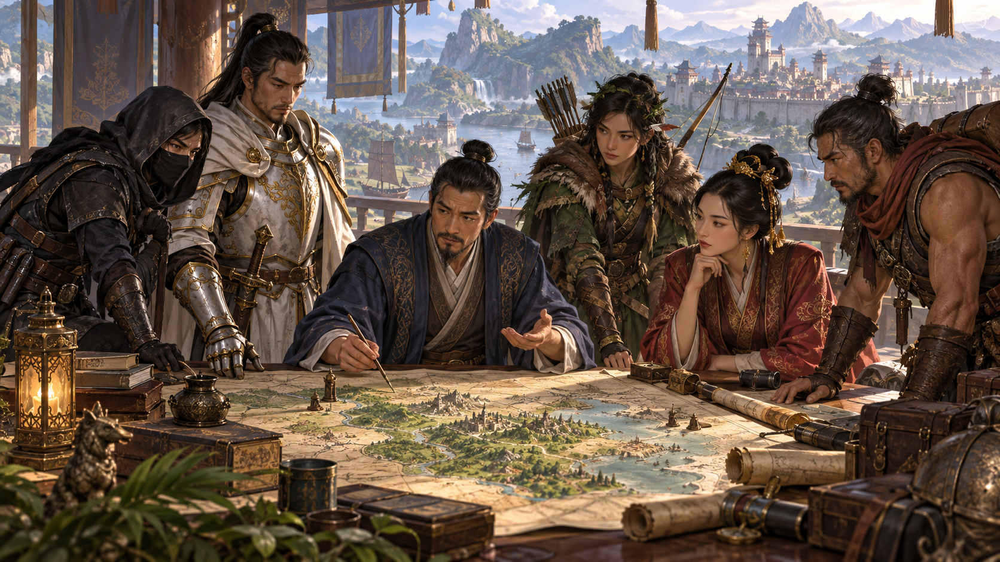
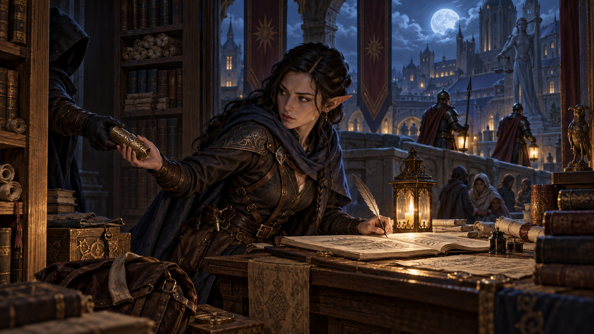
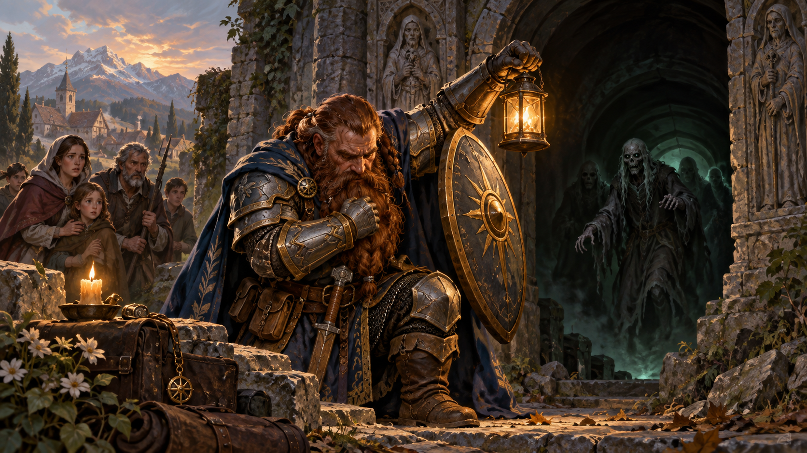
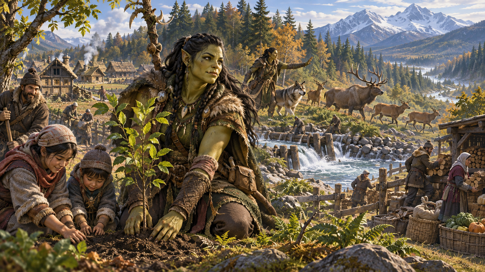
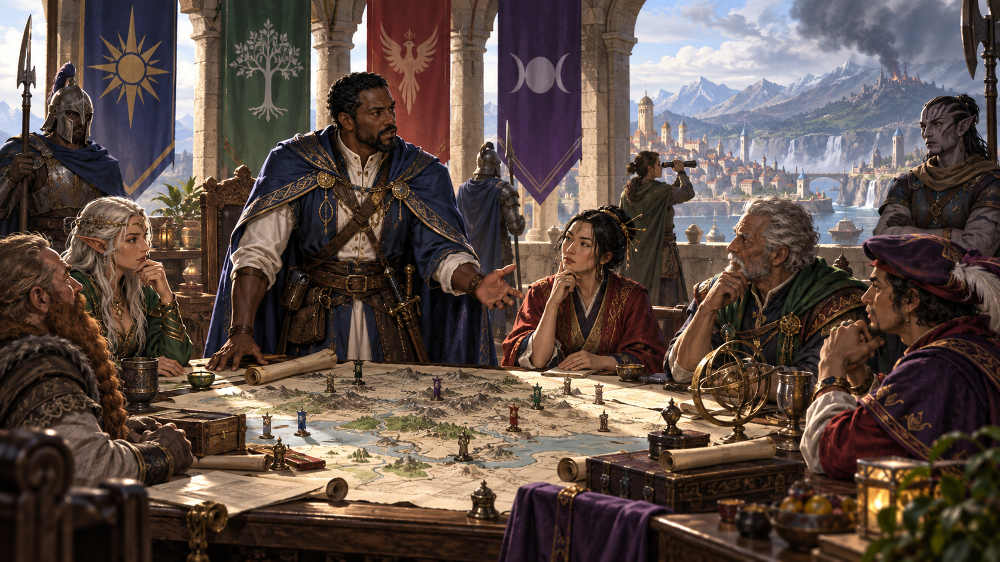
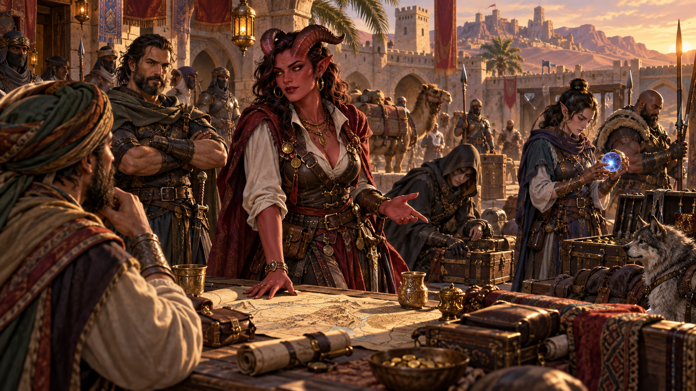

Nguồn: *D&D Basic Rules (Version 1.0), 2018*, trang 174-176.

*Năm phe phái có mục tiêu và phương pháp khác nhau nhưng có thể hợp tác trước mối đe dọa chung. Minh họa nguyên bản tạo bằng OpenAI ImageGen cho bản dịch này.*

Nhiều nhân vật trong bối cảnh [Forgotten Realms](99-glossary.md#forgotten-realms), đặc biệt cho hoạt động chơi D&D có tổ chức, thuộc một trong năm phe nổi bật ở Faerûn. Mỗi phe có động cơ, mục tiêu và triết lý riêng. Một số anh hùng hơn số khác, nhưng tất cả liên kết khi gặp khó để giải quyết mối đe dọa lớn.

## [Harpers](99-glossary.md#harpers)

*Harpers hoạt động kín đáo, coi tri thức và sự tự chủ là công cụ chống áp bức. Minh họa nguyên bản tạo bằng OpenAI ImageGen cho bản dịch này.*

Mạng lưới bí mật người [thi triển phép](99-glossary.md#spellcasting) và gián điệp gọi là Harpers tìm cách nghiêng cán cân về người vô tội, yếu và nghèo. Đặc vụ Harper tự hào là người bảo vệ điều thiện không thể bị tha hóa, không bao giờ ngần ngại giúp người bị áp bức. Ưa hoạt động hậu trường, họ hiếm khi được chú ý trong lúc ngăn bạo chúa, phế người cai trị và chặn lực lượng đang lớn mạnh bị cho là có ý đồ ác. Phe nắm nhịp quyền lực trong Realms; thành viên làm không mệt để cân bằng cơ hội cho người bị chà đạp.

Từng đặc vụ hoạt động một mình, dựa trí khôn và mạng thông tin rộng của phe để có ưu thế trước kẻ thù. Họ biết tri thức là sức mạnh, nên thu thập tình báo trước là then chốt thành công. Họ hiểu rõ tình hình và luôn tiếp cận được hỗ trợ ma thuật lẫn hỗ trợ khác. Thành viên kỳ cựu giấu kho thông tin bí mật khắp Faerûn, cùng nguồn tin đáng tin ở mọi thị trấn và thành phố lớn.

Tổ chức luôn tìm vật phẩm mạnh, với mục đích rõ ràng là giữ khỏi tay kẻ ác. Vì vậy đặc vụ dùng nhiều vỏ bọc và danh tính để tìm bí mật được canh giữ kỹ, như bản đồ tổ tiên, thành phố chôn vùi và thành lũy [pháp sư](99-glossary.md#wizard).

Liên kết giữa Harpers mạnh, tình bạn gần như không thể phá. Họ hiếm khi hoạt động công khai, nhưng đôi lúc phải vậy vì không còn lựa chọn. Khi ấy, bạn có thể chắc một Harper khác đang theo dõi kỹ, sẵn lao khỏi bóng tối giúp đồng đội ngay tức khắc.

> Harper trước hết phải tự lực, vì một khi tự chủ, không ai có thể dụ bạn dùng quyền lực làm chiếc nạng. Bạn là chủ chính mình.
>
> Vì vậy linh hồn Harper phải không thể bị tha hóa. Nhiều người tin mình như vậy, nhưng quyền lực mang nhiều hình dạng và chắc chắn tìm điểm yếu của bạn. Điều này bạn có thể tin chắc. Chỉ Harper thực thụ vượt thử thách ấy và biến yếu thành mạnh. Đó là lý do chúng ta là bàn tay ngăn bạo chúa, nuôi người bị áp bức và không đòi đáp lại gì.
>
> Chúng ta là bài ca của người không có tiếng nói.
>
> —Remallia “Remi” Haventree

## [Hội Găng giáp](99-glossary.md#order-gauntlet) (Order of the Gauntlet)

*Hội Găng giáp kết hợp kỷ luật nội tâm, đức tin và hành động trực diện chống cái ác. Minh họa nguyên bản tạo bằng OpenAI ImageGen cho bản dịch này.*

Hội Găng giáp là tổ chức khá mới, tận tụy đánh tan cái ác bất cứ nơi nào ẩn náu, không do dự. Thành viên hiểu cái ác mang nhiều vỏ bọc, bày trò và lừa người để nhanh lan rộng. Vì vậy họ hành động theo thẩm quyền của mình, nhận diện và loại bỏ mối đe dọa trước khi nó phát huy toàn bộ khả năng.

Vì mầm ác được nuôi trong bóng tối, Hội tiến đến ngục nguy hiểm nhất, hang tối nhất và hố ô uế nhất để nhổ kẻ làm điều sai. Dù vậy, thành viên biết rõ mầm ác trong mỗi người chờ cơ hội bén rễ vào linh hồn. Thánh kỵ sĩ, [võ tăng](99-glossary.md#monk) và [giáo sĩ](99-glossary.md#cleric) của hội dành hàng giờ cầu nguyện sâu, giữ con mắt bên trong cảnh giác, tập trung vào suy nghĩ/cảm xúc của mình. Nhờ vậy họ thanh lọc từ bên trong trước khi cầm kiếm làm sạch thế giới.

Hội tin mọi sinh vật có ý thức phải tự nguyện đến ánh sáng lý trí và điều thiện. Vì vậy phe không quan tâm kiểm soát tâm trí: chỉ chú trọng hành động, làm gương với hy vọng truyền cảm hứng và khai sáng người khác. Hội cho rằng đức tin nơi thần, bạn bè và bản thân là vũ khí tốt nhất chống bầy ác ý.

Với xác tín sùng đạo ấy, thành viên là nguồn sức mạnh đáng tin cho mình và người khác, ánh sáng rực chống tối. Tuy nhiên họ không phải kẻ bắt nạt đánh trước. Quy tắc danh dự nghiêm ngặt chỉ cho đánh khi hành vi ác đang được thực hiện. Vì vậy Hội luôn cảnh giác, dùng mọi tài nguyên ma thuật và thông thường để biết việc ác sẽ xảy ra ở đâu, lúc nào.

> Cái ác là vậy: là tối, là bóng, ẩn trong điểm mù của bạn. Rồi khi bạn xao nhãng, nó lẻn vào. Cái ác là bậc thầy cải trang—và bạn hỏi vỏ bọc lớn nhất là gì? Chính bạn. Nó khoác suy nghĩ và cảm xúc giả làm của bạn, bảo bạn tức giận, tham lam, ghen tị và đặt mình trên người khác.
>
> Người ta không sinh ra đã ác—cần thời gian để cái ác lừa bạn nghĩ giọng nó là giọng mình. Vì vậy hội đòi mỗi người mong gia nhập phải biết mình thực sự là ai. Can đảm không phải đánh [rồng](99-glossary.md#dragon) ngoài kia—mà đánh rồng bên trong. Đó là điều chúng ta làm trong cầu nguyện. Khi giết con rồng ấy, bạn vượt bóng tối ẩn trong mình. Chỉ khi ấy bạn mới có khả năng biết điều thiện thực sự. Chỉ khi ấy bạn mới sẵn cầm kiếm và đeo huy hiệu hội.
>
> —Kajiso Steelhand

## [Hội Ngọc lục bảo](99-glossary.md#emerald-enclave) (Emerald Enclave)

*Hội Ngọc lục bảo bảo vệ trật tự tự nhiên và giúp văn minh chung sống với hoang dã. Minh họa nguyên bản tạo bằng OpenAI ImageGen cho bản dịch này.*

Hội Ngọc lục bảo là nhóm hoạt động rộng, chống mối đe dọa thế giới tự nhiên và giúp người khác sống trong hoang dã. Chi nhánh rải khắp Faerûn, thường hoạt động tách biệt. Đời sống ấy khiến thành viên tự lực quyết liệt và tinh thông một số kỹ năng chiến đấu/sinh tồn. Kiểm lâm của hội có thể được thuê dẫn đoàn xe qua đèo hiểm hoặc lãnh nguyên đóng băng Icewind Dale. Druid có thể tình nguyện giúp làng chuẩn bị mùa đông dài khắc nghiệt. Barbarian và [druid](99-glossary.md#druid) sống ẩn sĩ có thể bất ngờ xuất hiện giúp bảo vệ thị trấn khỏi [orc](99-glossary.md#orc) cướp phá.

Thành viên biết sống sót và, quan trọng hơn, giúp người khác làm vậy. Họ không chống văn minh hoặc tiến bộ, nhưng cố giữ các “tiến bộ” cân bằng với hoang dã. Họ khôi phục/bảo tồn trật tự tự nhiên, đồng thời nhổ bỏ và phá mọi thứ phi tự nhiên. Họ kiểm soát các lực nguyên tố thế giới và ngăn văn minh với hoang dã hủy nhau.

> Chúng ta, Hội Ngọc lục bảo, canh cổng không gian bao la ngoài tường thành. Chúng ta bảo vệ cả hoang dã và xã hội không hiểu nó.
>
> Phần lớn đã quên có trật tự tự nhiên cổ xưa chi phối từ lâu trước khi chúng ta hình thành khái niệm trí tuệ về nó. Tiếp xúc trật tự nguyên sơ ấy là chạm quyền năng dẫn mọi sự sống.
>
> Người theo đường Hội Ngọc lục bảo thấm quyền năng đó; chúng ta hiện thân nó và nó thúc chúng ta làm việc. Vì vậy chúng ta không bao giờ đơn độc. Ngay giữa thành phố đông ồn, vẫn cảm thấy thế giới tự nhiên bên trong, tươi mới, mạnh và sống động. Hội tìm cách giúp mọi người nhận biết quyền năng này.
>
> Tự do. Chẳng phải đây là tiếng gọi cao cả nhất sao?
>
> —Delaan Winterhound

## [Liên minh Lãnh chúa](99-glossary.md#lords-alliance) (Lords’ Alliance)

*Liên minh Lãnh chúa dùng ngoại giao, tình báo và sức mạnh chung để bảo vệ các khu định cư. Minh họa nguyên bản tạo bằng OpenAI ImageGen cho bản dịch này.*

Liên minh Lãnh chúa là liên kết người cai trị các thành phố/thị trấn khắp Faerûn (chủ yếu miền Bắc), tin đoàn kết cần thiết để chặn cái ác. Người cai trị Waterdeep, Silverymoon, Neverwinter và các thành phố tự do khác chi phối liên minh; mọi lãnh chúa chủ yếu làm vì vận mệnh và thịnh vượng khu định cư của mình.

Đặc vụ gồm bard tinh tế, [thánh kỵ sĩ](99-glossary.md#paladin) nhiệt thành, pháp sư tài năng và [chiến binh](99-glossary.md#fighter) dạn dày. Được chọn chủ yếu vì trung thành, họ giỏi quan sát, ẩn nấp, nói bóng gió và chiến đấu. Có người giàu/quyền quý hậu thuẫn, họ mang trang bị tốt (thường cải dạng trông bình thường), gồm nhiều cuộn ghi phép giao tiếp.

Đặc vụ bảo đảm an toàn/thịnh vượng Faerûn văn minh bằng đoàn kết chống lực đe dọa văn minh. Họ quyết liệt loại mối đe dọa bằng mọi cách, tự hào chiến đấu vì vinh quang/an ninh dân mình và phúc lợi lãnh chúa cai trị dân ấy. Đặc vụ thường được vinh quang thúc đẩy, tìm ưu thế địa vị trước đồng sự từ thành phố liên minh khác. Lãnh đạo biết nhóm chỉ sống còn nếu thành viên hỗ trợ nhau, đòi mọi người cân bằng tự hào với ngoại giao. Đặc vụ tự ý làm trái trong liên minh hiếm, nhưng đã có trường hợp ly khai.

> Ai cũng muốn ngủ ban đêm và thấy an toàn ở nhà, nhưng bao nhiêu người muốn làm điều cần để chặn triều ác? Đứng trong lạnh và mưa chờ đánh, trong khi đói cồn cào bụng? Nhiều người muốn hưởng vụ mùa tốt, nhưng ít người muốn dọn đá và cày đất gieo trồng.
>
> Liên minh Lãnh chúa đánh những thứ người bán hàng nằm trên giường chưa từng nghe. Chúng ta loại mối đe dọa trước khi thị trưởng biết. Chúng ta khiến điều xấu biến mất. Đó là việc chúng ta giỏi.
>
> —Rameel Jos

## [Zhentarim](99-glossary.md#zhentarim)

*Zhentarim theo đuổi ảnh hưởng, của cải và cơ hội thông qua mạng lưới đầy tham vọng. Minh họa nguyên bản tạo bằng OpenAI ImageGen cho bản dịch này.*

Zhentarim, còn gọi Mạng lưới Đen (Black Network), là tổ chức lính đánh thuê huấn luyện tốt, rogue sành sỏi và [warlock](99-glossary.md#warlock) mưu trí muốn mở ảnh hưởng/quyền lực khắp Faerûn. Đặc vụ tin nếu theo quy tắc thì chẳng làm được gì. Cuối cùng họ muốn đặt quy tắc—và đôi trường hợp đã làm. Họ giữ ranh giới cẩn thận khi tuân chữ nghĩa luật pháp, không ngại thỉnh thoảng giao dịch mờ ám hoặc làm trái luật để đạt điều muốn.

Với Zhentarim, của cải là quyền lực. Đặc vụ biết chẳng gì khác gây tự tin và xóa nghi ngờ tốt như thế. Họ thường mang vũ khí/giáp tốt nhất vì phe không tiếc chi trang bị. Khi thương nhân cần hộ tống đoàn xe, gia đình quý tộc cần vệ sĩ bảo vệ tài sản hoặc thành phố khẩn cần lính huấn luyện giữ tường, Zhentarim cung cấp chiến binh tốt nhất tiền mua được.

Tổ chức khuyến khích tham vọng cá nhân và thưởng người đổi mới tự giải quyết việc. Chỉ kết quả quan trọng. Người vào Mạng lưới Đen tay trắng có thể thành nhân vật quan trọng nhờ tham vọng và kiên trì của mình.

> Thành viên Zhentarim như chìa khóa nghìn cửa, mỗi cửa dẫn đến thỏa mong muốn cá nhân. Phần lớn né tự do này. Họ thích ràng buộc, luật và khăn quấn—cho họ ảo tưởng an toàn.
>
> Mạng lưới Đen cho điều tôi cần để khám phá các cõi và chiều không gian sẽ xé tâm trí quen giới hạn. Chỉ ở đó tôi mới tìm được ma thuật đủ mạnh đánh bại thực thể không biết thời gian, sợ hãi hay thương xót. Bạn có thể không thích cách Zhentarim, nhưng khi demon bò khỏi [Abyss](99-glossary.md#abyss) đến tìm gia đình, bạn sẽ mừng vì tôi đã đến cõi tối nhất tìm câu trả lời vấn đề của bạn.
>
> —Ianna Asterion

---

Tên họa sĩ ghi trong nguồn: Richard Whitters (trang 176).

**Thông báo sử dụng trong bản gốc:** Không được bán lại. Được phép in và sao chụp tài liệu này chỉ để sử dụng cá nhân.
