Bảng này giải thích các thuật ngữ xuất hiện trong phần Giới thiệu, 14 chương và 3 phụ lục. Mục tiêu không chỉ là đối chiếu Anh–Việt mà còn làm rõ những khái niệm fantasy phương Tây, cơ chế trò chơi và từ dễ gợi liên tưởng sai trong văn hóa Việt Nam.

## Cách đọc bảng thuật ngữ

- Tên tiếng Anh được giữ lại khi chưa có một từ Việt phổ thông truyền đạt đủ nghĩa.
- Các từ như “giáo sĩ”, “thánh kỵ sĩ”, “druid”, “quỷ”, “rồng” và “chủng tộc” chỉ khái niệm trong thế giới fantasy của trò chơi; không nên tự động đồng nhất với tôn giáo, cộng đồng hoặc sinh vật trong văn hóa Việt Nam.
- “Cấp nhân vật” và “bậc phép” là hai thang khác nhau. “Trí tuệ” chỉ **Intelligence**; **Wisdom** được dịch là “Minh triết”.
- Liên kết trong các chương trỏ tới mục này ở lần xuất hiện đầu tiên của thuật ngữ trong từng tệp.

## Vai trò và cấu trúc trò chơi

### Dungeons & Dragons (D&D)

Tên trò chơi nhập vai bàn, thường viết tắt D&D. Người chơi cùng kể một câu chuyện bằng lời nói, luật và xúc xắc; đây không phải trò chơi điện tử và cũng không có một người chơi phải “thắng” những người còn lại.

### Quản trò (Dungeon Master, DM)

Người mô tả thế giới, điều khiển sinh vật và nhân vật không do người chơi điều khiển, đồng thời phân xử luật. DM gần với người dẫn truyện kiêm trọng tài hơn là tác giả quyết định sẵn mọi hành động.

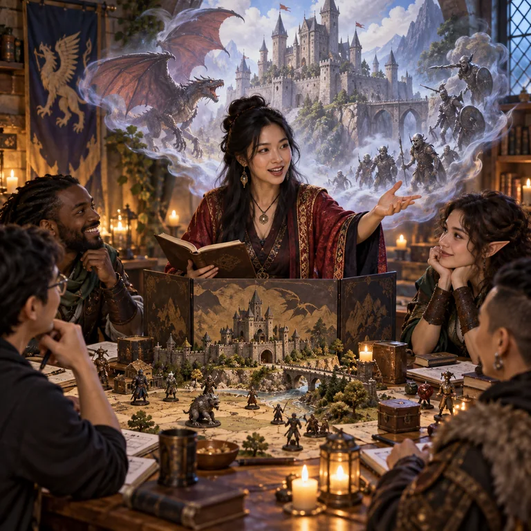

*Quản trò vừa kể chuyện, điều khiển thế giới vừa phân xử luật. Minh họa nguyên bản tạo bằng OpenAI ImageGen cho bảng thuật ngữ này.*

### Nhân vật người chơi (player character, PC)

Nhân vật do một người chơi đưa ra quyết định. PC khác với chính người chơi và khác NPC do DM điều khiển.

### Nhân vật không do người chơi điều khiển (nonplayer character, NPC)

Mọi nhân vật trong thế giới do DM điều khiển, từ dân thường và đồng minh đến đối thủ. “Không phải người chơi” không có nghĩa nhân vật ấy không phải con người.

### Nhà phiêu lưu (adventurer)

Cách gọi chung các nhân vật tham gia nhiệm vụ nguy hiểm. Từ này chỉ vai trò trong truyện, không phải một lớp nhân vật.

### Nhóm phiêu lưu (party)

Nhóm PC cùng hoạt động. *Party* ở đây nghĩa là một toán đồng hành, không phải “bữa tiệc” hay đảng phái.

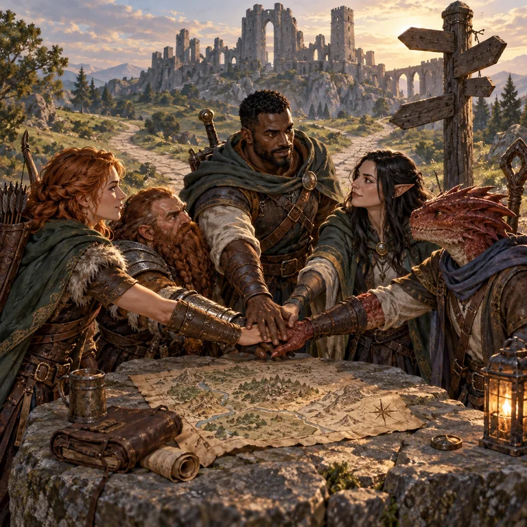

*Nhóm phiêu lưu hợp tác vì mục tiêu chung. Minh họa nguyên bản tạo bằng OpenAI ImageGen cho bảng thuật ngữ này.*

### Cuộc phiêu lưu (adventure)

Một nhiệm vụ hoặc mạch truyện có mở đầu, địa điểm, thử thách và kết quả. Nhiều cuộc phiêu lưu có thể hợp thành một chiến dịch.

### Chiến dịch (campaign)

Chuỗi dài các cuộc phiêu lưu dùng chung nhân vật và thế giới. Không nhất thiết mang nghĩa chiến dịch quân sự hay vận động chính trị.

### Ba trụ cột phiêu lưu

Ba dạng hoạt động chính: khám phá, tương tác xã hội và chiến đấu. Chúng là khung mô tả, không bắt buộc mỗi buổi chơi phải chia đều thời lượng.

### Luật riêng của nhóm (house rule)

Quy tắc do một nhóm tự thêm hoặc sửa cho bàn chơi của mình. Luật này chỉ có hiệu lực khi nhóm thống nhất, không tự động là luật chính thức.

## Xúc xắc và cơ chế cốt lõi

### Ký hiệu xúc xắc (d4, d6, d8, d10, d12, d20, d100)

Chữ **d** viết tắt cho *die/dice*; số sau là số mặt. “2d6 + 3” nghĩa là tung hai xúc xắc sáu mặt, cộng kết quả rồi cộng 3.

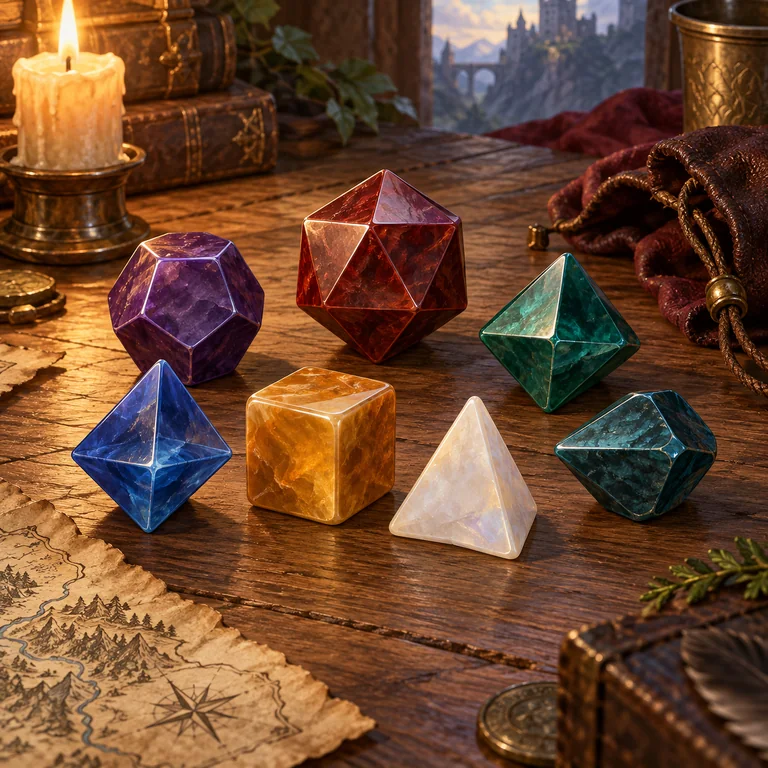

*Các loại xúc xắc được phân biệt bằng số mặt. Minh họa nguyên bản tạo bằng OpenAI ImageGen cho bảng thuật ngữ này.*

### Điểm thuộc tính (ability score)

Con số mô tả sáu năng lực nền tảng của nhân vật. Điểm này tạo ra hệ số thuộc tính nhưng thường không được cộng trực tiếp vào lần tung.

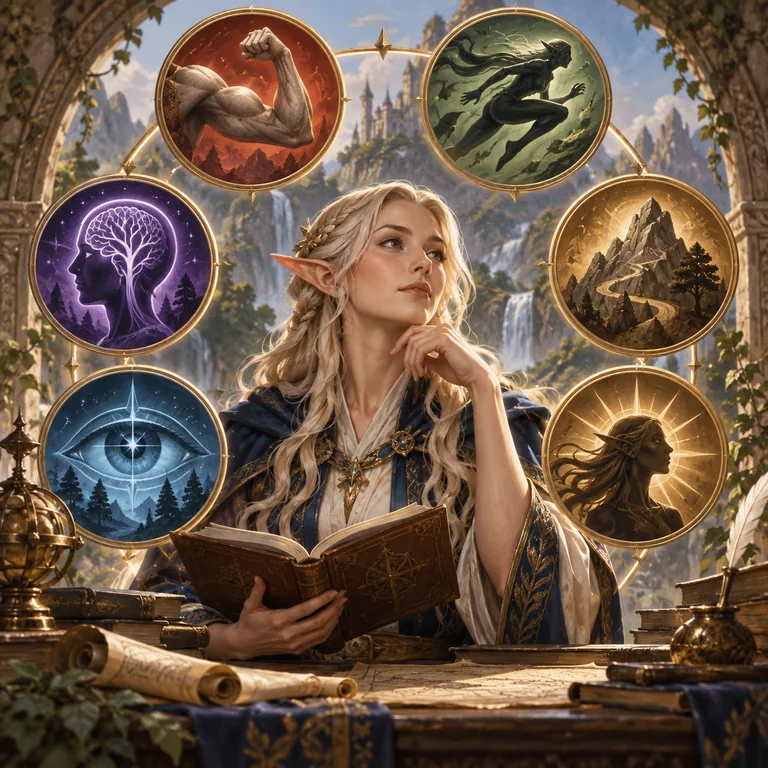

*Sáu thuộc tính mô tả những phương diện năng lực khác nhau. Minh họa nguyên bản tạo bằng OpenAI ImageGen cho bảng thuật ngữ này.*

### Sức mạnh (Strength, STR)

Khả năng vận động và lực cơ thể: nâng, kéo, phá, vật lộn và nhiều đòn cận chiến.

### Khéo léo (Dexterity, DEX)

Sự nhanh nhẹn, phản xạ, thăng bằng và điều khiển động tác. Không chỉ có nghĩa khéo tay.

### Thể chất (Constitution, CON)

Sức khỏe và sức bền của cơ thể. Thuộc tính này thường ảnh hưởng HP và khả năng chịu độc, bệnh hoặc kiệt sức.

### Trí tuệ (Intelligence, INT)

Khả năng ghi nhớ, suy luận và kiến thức đã học. Bản dịch dùng “Trí tuệ” riêng cho Intelligence, không dùng cho Wisdom.

### Minh triết (Wisdom, WIS)

Khả năng nhận biết, trực giác, đọc tình huống và hòa hợp với môi trường. Không đồng nghĩa với học vấn hay tuổi cao.

### Sức hút (Charisma, CHA)

Sức mạnh hiện diện, ý chí xã hội và khả năng tác động người khác. Không chỉ là vẻ đẹp ngoại hình.

### Hệ số điều chỉnh (modifier)

Con số được cộng hoặc trừ vào một lần tung. Hệ số thuộc tính được suy ra từ điểm thuộc tính.

### Phép kiểm tra thuộc tính (ability check)

Lần tung d20 để xem một hành động có thành công hay không. Chữ “phép” ở đây nghĩa là phép thử/kiểm tra, không phải phép thuật.

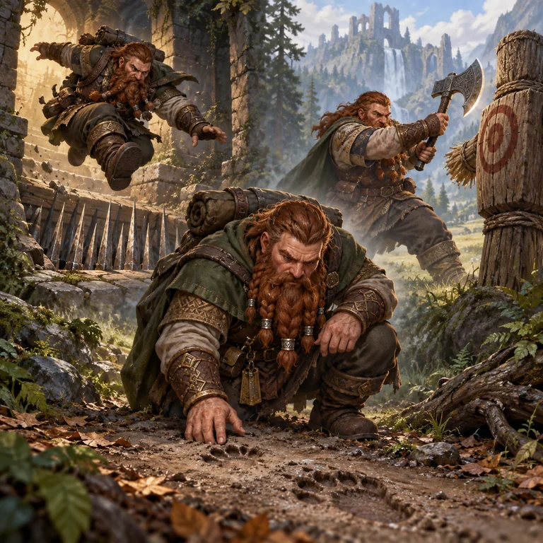

*Kiểm tra, cứu nguy và tấn công đều dùng d20 nhưng giải quyết tình huống khác nhau. Minh họa nguyên bản tạo bằng OpenAI ImageGen cho bảng thuật ngữ này.*

### Lần tung cứu nguy (saving throw)

Lần tung d20 để chống hoặc giảm một hiệu ứng đang tác động lên nhân vật. Đây không phải hành động “cứu người” theo nghĩa thông thường.

### Lần tung tấn công (attack roll)

Lần tung d20 nhằm xác định một đòn đánh có trúng mục tiêu hay không; khác với lần tung sát thương sau khi đã trúng.

### Độ khó (Difficulty Class, DC)

Con số mục tiêu mà kết quả kiểm tra, cứu nguy hoặc một số hiệu ứng phải đạt hoặc vượt.

### Lợi thế và bất lợi (advantage/disadvantage)

Khi có lợi thế, tung hai d20 và lấy kết quả cao; khi có bất lợi, lấy kết quả thấp. Nhiều nguồn cùng loại thường không cộng dồn thành ba xúc xắc.

### Sự thành thạo và thưởng thành thạo

Thành thạo cho phép cộng thưởng thành thạo vào các lần tung phù hợp. Nó biểu thị huấn luyện, không có nghĩa hành động tự động thành công.

### Cảm hứng (Inspiration)

Phần thưởng cơ học DM trao khi người chơi thể hiện tốt đặc điểm nhân vật; có thể tiêu để nhận lợi thế. Không phải cảm hứng nghệ thuật hay phép thi sĩ.

## Nhân vật, cấp độ và lựa chọn

### Phiếu nhân vật (character sheet)

Bản ghi các chỉ số, năng lực, trang bị và thông tin nhập vai của một PC.

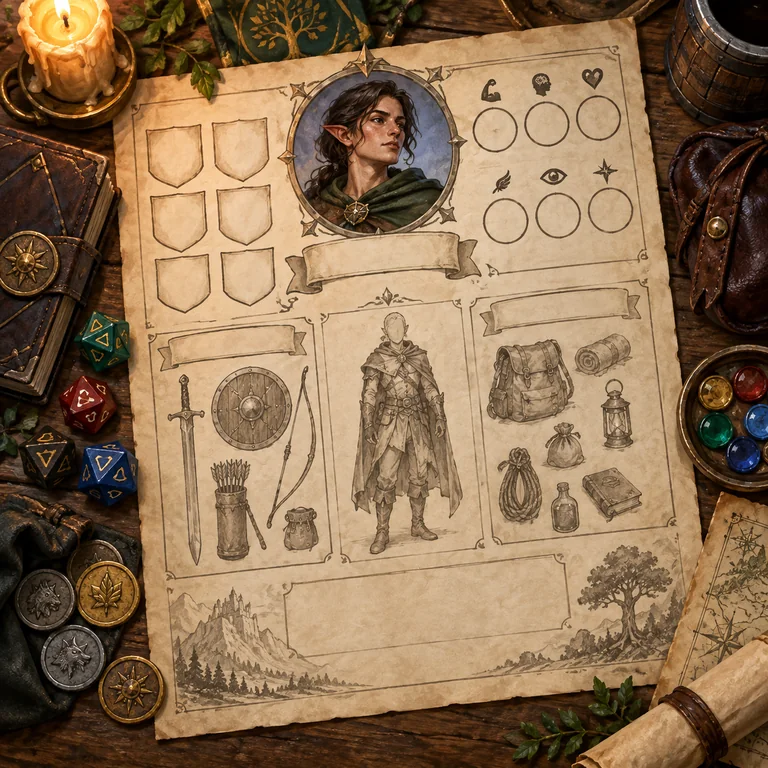

*Phiếu nhân vật tập hợp thông tin cần dùng trong khi chơi. Minh họa nguyên bản tạo bằng OpenAI ImageGen cho bảng thuật ngữ này.*

### Chủng tộc fantasy (race)

Thuật ngữ của bản luật 2018 cho các dân tộc như dwarf, elf và halfling. Đây là phân loại giả tưởng có đặc tính cơ học, không nên đồng nhất với khái niệm chủng tộc người trong khoa học hay chính trị hiện đại.

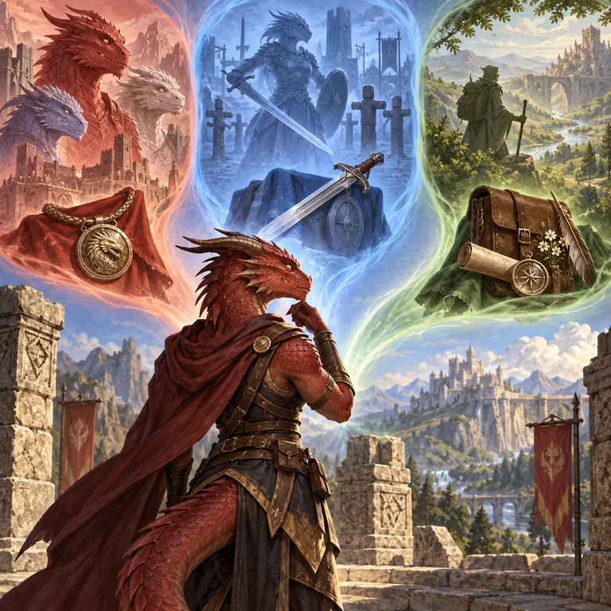

*Dân tộc, lớp và xuất thân cùng tạo nên nhân vật. Minh họa nguyên bản tạo bằng OpenAI ImageGen cho bảng thuật ngữ này.*

### Phân chủng (subrace)

Nhánh văn hóa hoặc huyết thống trong một chủng tộc fantasy, có thêm đặc điểm riêng.

### Lớp nhân vật (class)

Con đường năng lực chính của nhân vật, như chiến binh hoặc pháp sư. “Lớp” không phải tầng lớp xã hội hay lớp học.

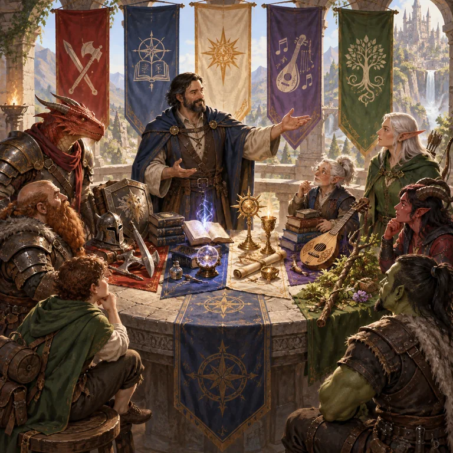

*Lớp nhân vật xác định con đường phát triển năng lực chính. Minh họa nguyên bản tạo bằng OpenAI ImageGen cho bảng thuật ngữ này.*

### Đặc tính lớp (class feature)

Năng lực mà nhân vật nhận từ lớp ở một cấp nhất định.

### Cấp nhân vật (character level)

Thước đo tiến triển của nhân vật từ 1 đến 20. Phải phân biệt với bậc phép.

### Bậc phép (spell level)

Thang sức mạnh phép từ sơ cấp đến bậc 9. “Phép bậc 3” không có nghĩa chỉ nhân vật cấp 3 mới dùng được.

### Điểm kinh nghiệm (experience points, XP)

Điểm phản ánh tiến triển qua thử thách. Khi đạt mốc, nhân vật có thể tăng cấp theo quy tắc chiến dịch.

### Điểm sinh lực (hit points, HP)

Khả năng tiếp tục chiến đấu, kết hợp sức khỏe, ý chí, may mắn và kỹ năng tránh đòn. HP không hoàn toàn là lượng máu.

### Xúc xắc sinh lực (Hit Dice)

Nguồn lực gắn với lớp và cấp, dùng để tính HP và hồi HP khi nghỉ ngắn. Không phải xúc xắc tung để xác định đòn đánh có trúng hay không.

### Xuất thân (background)

Đời sống và nghề nghiệp trước khi phiêu lưu, cung cấp thành thạo, trang bị và đặc tính nhập vai. Không phải tiểu sử hoàn chỉnh.

### Khuynh hướng đạo đức (alignment)

Mô tả xu hướng đạo đức và thái độ với trật tự qua hai trục thiện–ác và luật–hỗn loạn. Đây là công cụ nhập vai khái quát, không phải chẩn đoán tâm lý hay mệnh lệnh tuyệt đối.

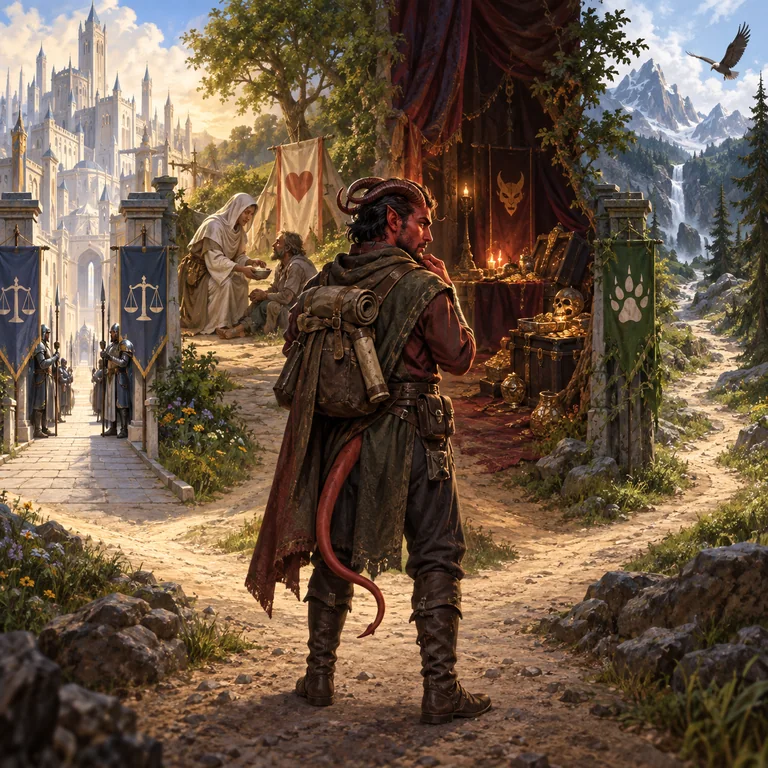

*Khuynh hướng là xu hướng nhập vai, không phải xiềng xích hành vi. Minh họa nguyên bản tạo bằng OpenAI ImageGen cho bảng thuật ngữ này.*

### Kỳ tài (feat)

Năng lực tùy chọn thể hiện huấn luyện hoặc tài năng đặc biệt, thường được chọn thay cho tăng điểm thuộc tính.

### Đa lớp (multiclassing)

Quy tắc tùy chọn cho phép một nhân vật lấy cấp ở nhiều lớp khác nhau.

## Các dân tộc fantasy

### Dwarf / người lùn fantasy

Dân tộc fantasy thấp, chắc khỏe, thường gắn với thị tộc, đá và nghề rèn. Không nên dùng hình ảnh người mắc chứng lùn ngoài đời để diễn giải.

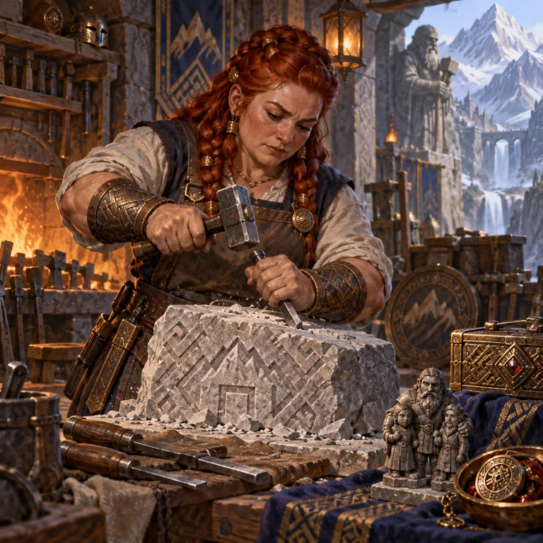

*Dwarf là một dân tộc fantasy, không phải mô tả tình trạng cơ thể ngoài đời. Minh họa nguyên bản tạo bằng OpenAI ImageGen cho bảng thuật ngữ này.*

### Elf

Dân tộc fantasy sống lâu, nhanh nhẹn và gắn với phép thuật hoặc thiên nhiên. Elf không hoàn toàn tương đương “tiên” trong truyện dân gian Việt Nam.

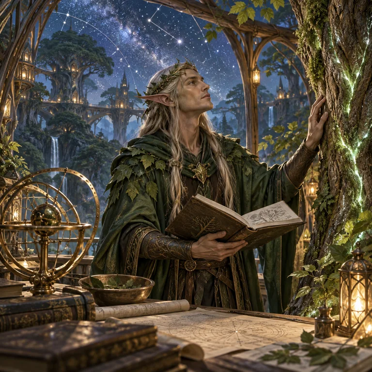

*Elf là dân tộc fantasy sống lâu, gắn với phép thuật và thiên nhiên. Minh họa nguyên bản tạo bằng OpenAI ImageGen cho bảng thuật ngữ này.*

### Halfling

Dân tộc hình người có vóc dáng nhỏ, thường coi trọng gia đình và đời sống yên bình. Không phải trẻ em và không phải người lùn fantasy.

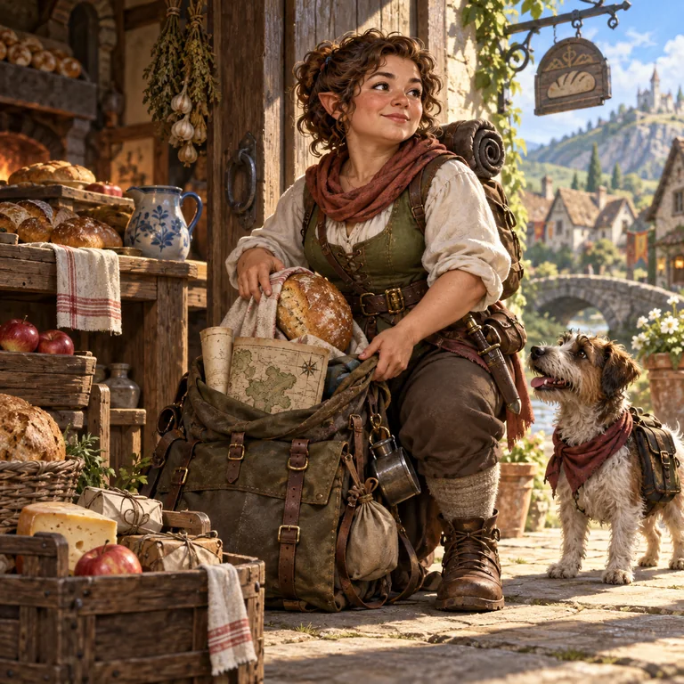

*Halfling có vóc dáng nhỏ nhưng là người trưởng thành độc lập. Minh họa nguyên bản tạo bằng OpenAI ImageGen cho bảng thuật ngữ này.*

### Con người trong thế giới fantasy

Con người trong bối cảnh D&D đa dạng về văn hóa và vùng miền; không có một nền văn hóa “loài người” duy nhất.

### Dragonborn

Dân tộc hình người mang đặc điểm rồng và có hơi thở nguyên tố. Không phải rồng con hay người biến hình từ rồng.

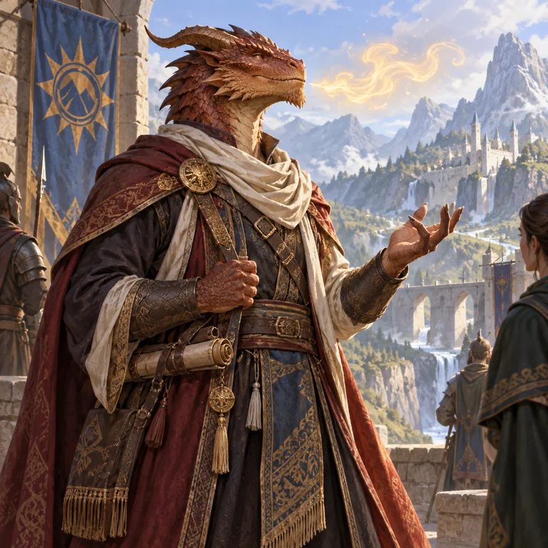

*Dragonborn mang đặc điểm rồng nhưng không phải rồng con. Minh họa nguyên bản tạo bằng OpenAI ImageGen cho bảng thuật ngữ này.*

### Gnome

Dân tộc fantasy nhỏ bé, thường gắn với tính tò mò, ảo thuật hoặc kỹ nghệ. Khác với halfling và không đơn thuần là yêu tinh giữ vườn.

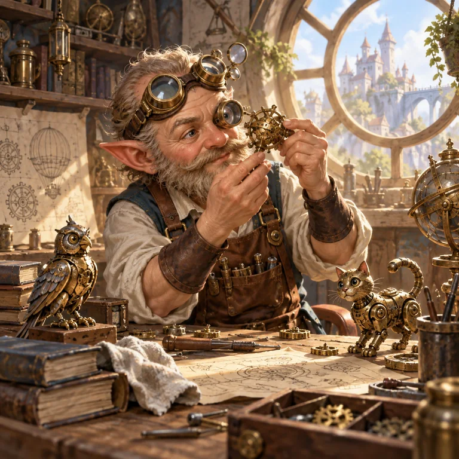

*Gnome là dân tộc fantasy nhỏ bé và hiếu kỳ. Minh họa nguyên bản tạo bằng OpenAI ImageGen cho bảng thuật ngữ này.*

### Half-elf / người lai elf

Nhân vật có dòng dõi người và elf, thường sống giữa nhiều cộng đồng.

### Half-orc / người lai orc

Nhân vật có dòng dõi người và orc. Nguồn gốc không tự quyết định đạo đức hay tính cách.

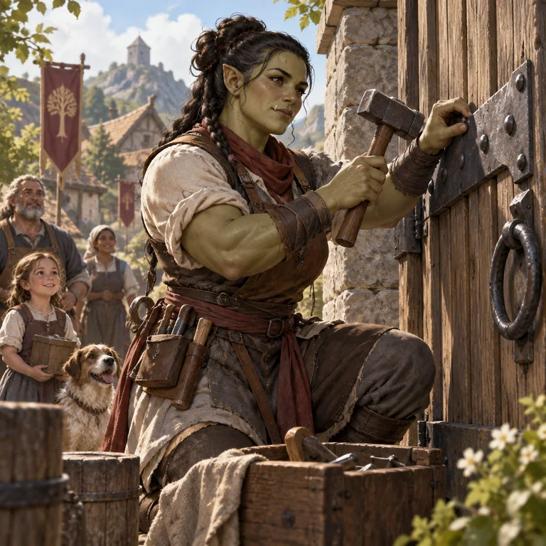

*Dòng dõi không quyết định tính cách hay vai trò xã hội. Minh họa nguyên bản tạo bằng OpenAI ImageGen cho bảng thuật ngữ này.*

### Tiefling

Dân tộc hình người mang dấu ấn huyết thống từ các cõi hạ giới, thường có sừng và đuôi. Tiefling không mặc nhiên là quỷ dữ hay người xấu.

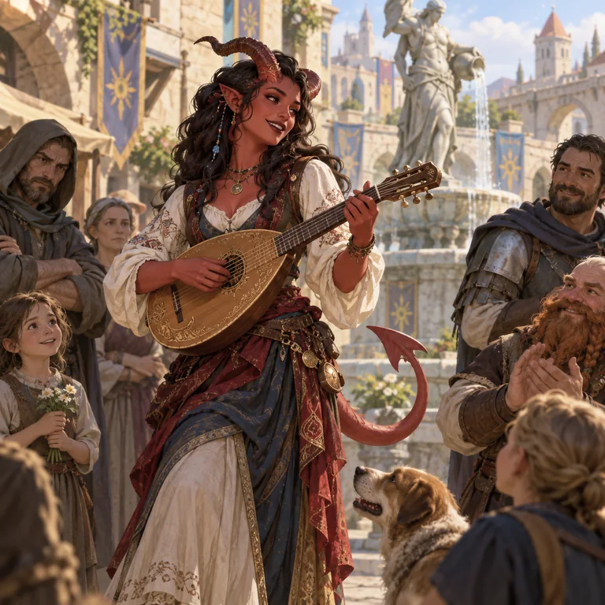

*Dòng dõi ngoại giới không quyết định đạo đức của tiefling. Minh họa nguyên bản tạo bằng OpenAI ImageGen cho bảng thuật ngữ này.*

### Orc

Một dân tộc hình người fantasy. Các mô tả văn hóa trong bối cảnh cụ thể không nên được hiểu là bản chất đạo đức cố định của mọi cá nhân.

### Fey và Feywild

Fey là sinh vật của thế giới thần tiên hoang dã; Feywild là cõi phản chiếu thiên nhiên và cảm xúc. Khái niệm này rộng hơn “tiên” trong tiếng Việt.

## Lớp nhân vật và vai trò

### Giáo sĩ (cleric)

Người thi triển phép thần thánh nhờ đức tin hoặc sự phụng sự một quyền lực/lãnh địa. Không hoàn toàn tương đương linh mục trong bất kỳ tôn giáo có thật nào.

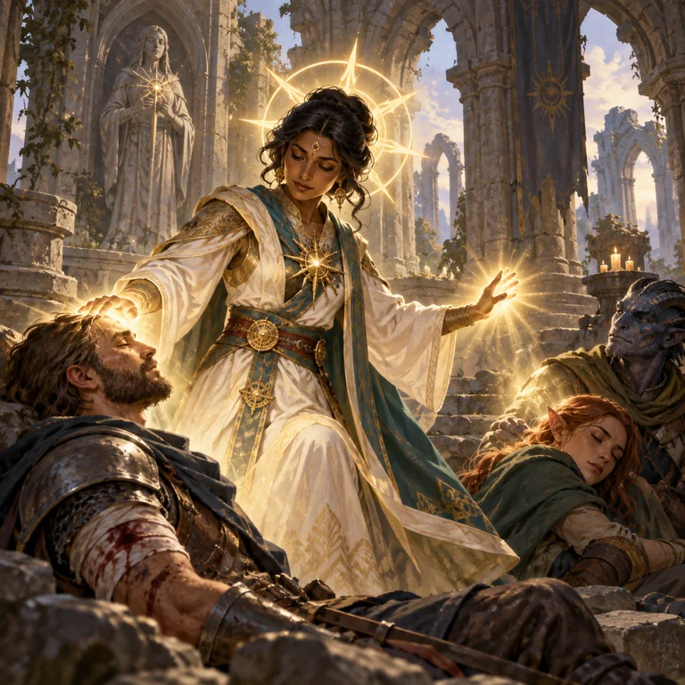

*Giáo sĩ D&D là lớp fantasy, không tương đương hoàn toàn giáo sĩ ngoài đời. Minh họa nguyên bản tạo bằng OpenAI ImageGen cho bảng thuật ngữ này.*

### Chiến binh (fighter)

Lớp chuyên về kỹ năng võ thuật, vũ khí và giáp; không giới hạn ở lính chính quy.

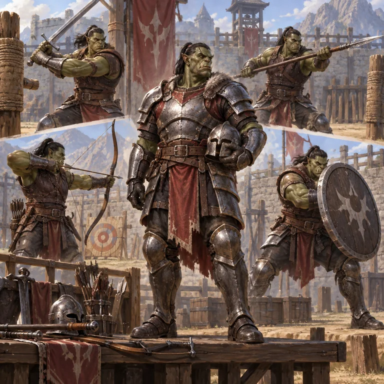

*Chiến binh làm chủ kỹ thuật võ thuật và trang bị. Minh họa nguyên bản tạo bằng OpenAI ImageGen cho bảng thuật ngữ này.*

### Đạo tặc (rogue)

Lớp dựa vào kỹ năng, sự chính xác và mưu trí. Tên lớp không bắt buộc nhân vật phải là tội phạm hay trộm cắp.

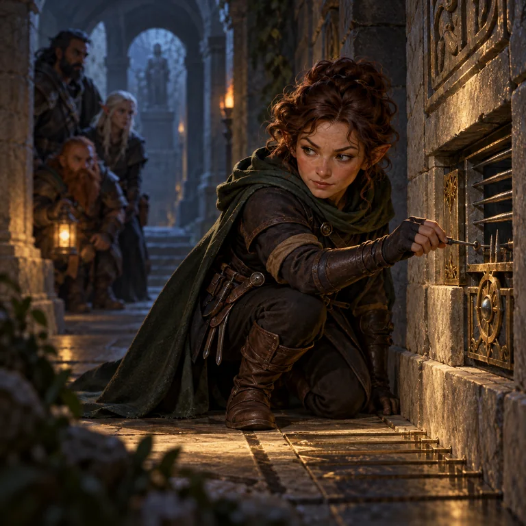

*Đạo tặc dựa vào kỹ năng và sự chính xác, không bắt buộc là tội phạm. Minh họa nguyên bản tạo bằng OpenAI ImageGen cho bảng thuật ngữ này.*

### Pháp sư (wizard)

Người học và ghi phép vào sách phép. Khác sorcerer, người có ma thuật bẩm sinh, và warlock, người nhận quyền năng qua giao ước.

*Pháp sư học và chuẩn bị phép thông qua sách phép. Minh họa nguyên bản tạo bằng OpenAI ImageGen cho bảng thuật ngữ này.*

### Thi sĩ (bard)

Người dùng nghệ thuật, tri thức và ma thuật để truyền cảm hứng. Không chỉ là nhà thơ theo nghĩa nghề nghiệp Việt Nam.

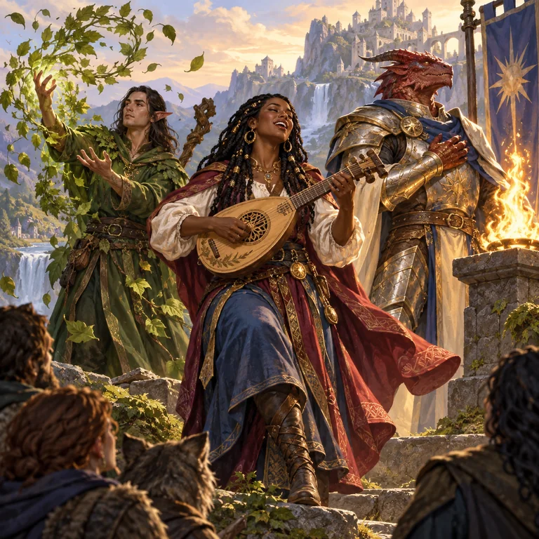

*Nghệ thuật, thiên nhiên và lời thề tạo nên ba truyền thống phiêu lưu riêng. Minh họa nguyên bản tạo bằng OpenAI ImageGen cho bảng thuật ngữ này.*

### Druid / tu sĩ tự nhiên

Người thi triển phép gắn với thiên nhiên và có thể biến hình. Druid trong D&D lấy cảm hứng từ tên gọi Celtic cổ nhưng là sáng tạo fantasy, không phải mô tả chính xác tôn giáo lịch sử.

### Thánh kỵ sĩ (paladin)

Chiến binh tuyên thệ theo một lý tưởng và dùng quyền năng thần thánh. Không mặc nhiên thuộc Kitô giáo hay một giáo hội có thật.

### Man rợ (barbarian)

Tên lớp chiến đấu dùng cơn cuồng nộ. Đây là nhãn cơ học của fantasy; không nên dùng để đánh giá các dân tộc hoặc xã hội ngoài đời.

### Võ tăng (monk)

Lớp chiến đấu rèn thân thể và năng lượng nội tại. Không phải mô tả tu sĩ Phật giáo Việt Nam.

### Kiểm lâm (ranger)

Chiến binh sinh tồn, truy dấu và bảo vệ vùng hoang dã. Không đồng nhất với nghề kiểm lâm nhà nước hiện đại.

### Thuật sĩ (sorcerer)

Người có ma thuật bẩm sinh hoặc được biến đổi bởi nguồn quyền năng, khác pháp sư học phép qua sách.

### Warlock / pháp sư khế ước

Người nhận ma thuật qua giao ước với một thực thể quyền năng. *Warlock* không có một từ Việt hoàn toàn tương đương.

## Trang bị và đơn vị

### Chỉ số giáp (Armor Class, AC)

Mức khó để một đòn tấn công đánh trúng. AC bao gồm giáp, khiên, sự nhanh nhẹn và hiệu ứng khác; không phải điểm độ bền của áo giáp.

### Giáp nhẹ, trung bình và nặng

Các nhóm giáp theo quy tắc, ảnh hưởng AC, Khéo léo, sức mang và khả năng lén lút.

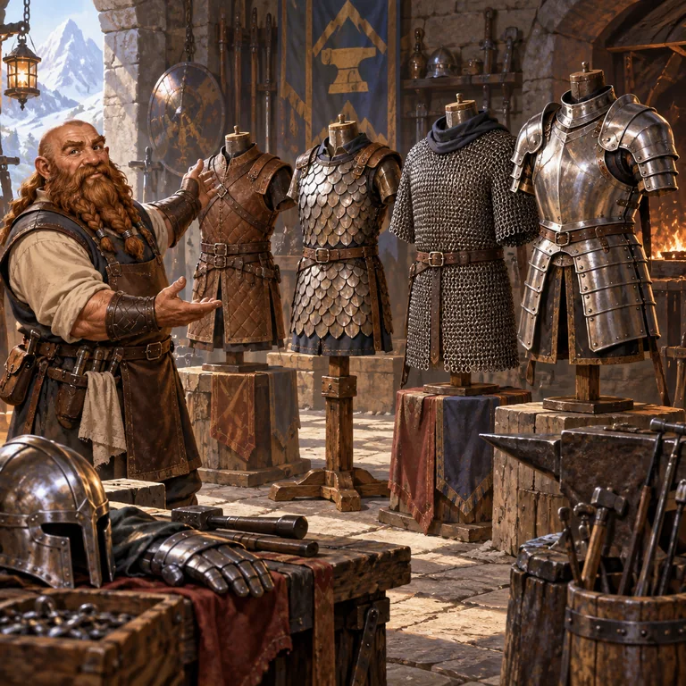

*Giáp nhẹ, trung bình và nặng khác nhau về cấu tạo và quy tắc. Minh họa nguyên bản tạo bằng OpenAI ImageGen cho bảng thuật ngữ này.*

### Giáp xích (chain mail)

Áo giáp làm từ nhiều vòng kim loại đan nhau. Khác giáp vảy và giáp tấm.

### Giáp vảy (scale mail)

Giáp gồm nhiều mảnh kim loại nhỏ xếp chồng giống vảy, gắn trên nền da hoặc vải.

### Giáp tấm (plate armor)

Bộ giáp kim loại gồm các tấm ghép bảo vệ toàn thân; không phải một tấm thép duy nhất.

### Khiên (shield)

Vật phòng thủ cầm tay giúp tăng AC. Khiên D&D là một hạng trang bị chung, không phân nhỏ theo mọi kiểu lịch sử.

### Vũ khí cận chiến và tầm xa

Cận chiến dùng để đánh mục tiêu gần; tầm xa dùng đạn hoặc vật phóng. Một số vũ khí cận chiến có thể ném.

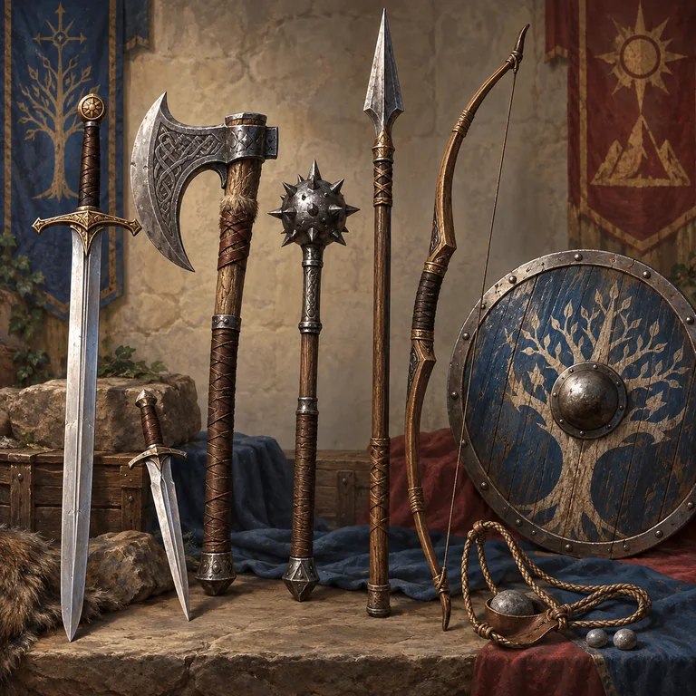

*Vũ khí được phân nhóm theo cách sử dụng trong chiến đấu. Minh họa nguyên bản tạo bằng OpenAI ImageGen cho bảng thuật ngữ này.*

### Tinh xảo (finesse)

Tính chất vũ khí cho phép dùng Khéo léo thay Sức mạnh khi tấn công và gây sát thương.

### Đa dụng (versatile)

Tính chất vũ khí cho phép dùng một hoặc hai tay; khi dùng hai tay thường có xúc xắc sát thương lớn hơn.

### Tầm với (reach)

Khoảng cách mà vũ khí hoặc sinh vật có thể thực hiện đòn cận chiến.

### Kiếm rapier

Kiếm châu Âu có lưỡi dài, hẹp, thiên về đâm. Không hoàn toàn tương đương kiếm liễu hay kiếm mảnh Đông Á.

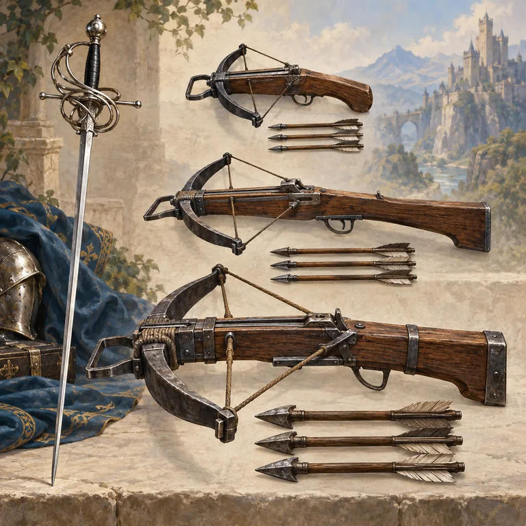

*Rapier thiên về đâm; các loại nỏ khác nhau về kích thước và cơ cấu. Minh họa nguyên bản tạo bằng OpenAI ImageGen cho bảng thuật ngữ này.*

### Nỏ tay, nỏ nhẹ và nỏ nặng

Các loại nỏ fantasy dựa trên vũ khí cơ khí bắn tên ngắn; “tay/nhẹ/nặng” là hạng luật chơi.

### Đồng vàng (gold piece, gp)

Đơn vị tiền quy ước của trò chơi. Giá trị không quy đổi trực tiếp sang tiền Việt hay giá vàng ngoài đời.

### Đơn vị hệ mét và đơn vị gốc

Bản dịch đặt đơn vị hệ mét trước và giữ đơn vị Anh–Mỹ của luật gốc trong ngoặc. Để các khoảng cách trên lưới dễ dùng, quy ước **0,3 m (1 foot)** và **1,5 m (5 feet)** cho một ô vuông. Các quy đổi thông dụng khác gồm **1,6 km (1 mile)**, **0,45 kg (1 pound)**, **2,5 cm (1 inch)**, **3,8 lít (1 gallon)** và **0,47 lít (1 pint)**. Các giá trị hệ mét được làm tròn để chơi thuận tiện; khi cần phân xử chính xác, trị số gốc trong ngoặc được ưu tiên.

## Phiêu lưu và chiến đấu

### Nghỉ ngắn (short rest)

Khoảng nghỉ ít nhất 1 giờ trong bản luật 2018, cho phép dùng Xúc xắc Sinh lực và hồi một số năng lực.

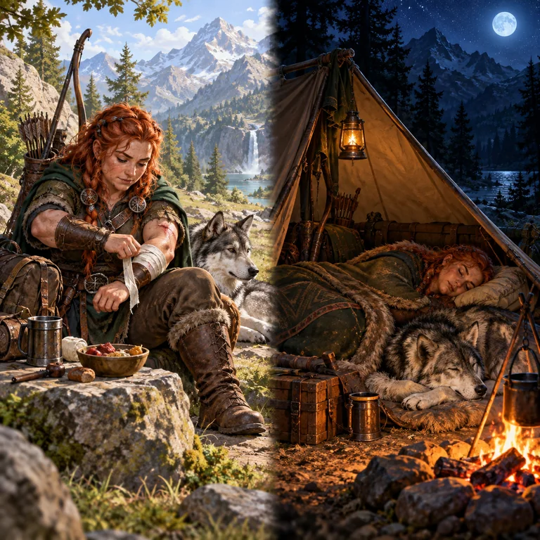

*Hai loại nghỉ hồi phục các nguồn lực ở mức khác nhau. Minh họa nguyên bản tạo bằng OpenAI ImageGen cho bảng thuật ngữ này.*

### Nghỉ dài (long rest)

Khoảng nghỉ ít nhất 8 giờ, thường hồi nhiều HP, ô phép và năng lực hơn nghỉ ngắn.

### Đội hình hành quân (marching order)

Thứ tự các nhân vật di chuyển trong hành lang hoặc đường hẹp, dùng để xác định ai gặp nguy hiểm hay phát hiện sự việc trước.

### Địa hình khó (difficult terrain)

Địa hình làm mỗi 0,3 m (1 foot) di chuyển tốn thêm 0,3 m (1 foot); không nhất thiết yêu cầu phép kiểm tra.

### Sáng kiến chiến đấu (initiative)

Thứ tự hành động trong chiến đấu, thường dựa trên kiểm tra Khéo léo. Không mang nghĩa “đề xuất sáng kiến” thông thường.

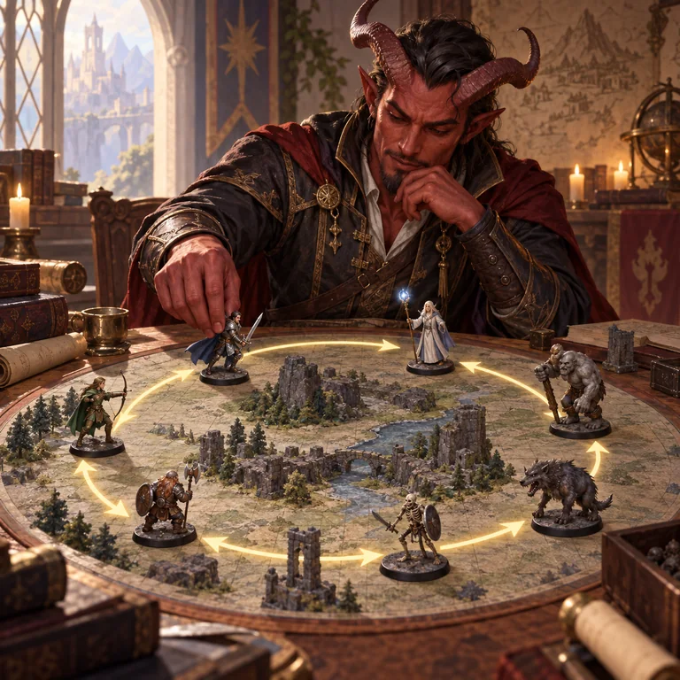

*Sáng kiến quyết định thứ tự hành động trong mỗi vòng. Minh họa nguyên bản tạo bằng OpenAI ImageGen cho bảng thuật ngữ này.*

### Vòng và lượt (round/turn)

Một vòng biểu diễn khoảng 6 giây, trong đó mọi bên có lượt; lượt là phần hành động của một sinh vật.

### Hành động, hành động phụ và phản ứng

Ba loại thời điểm cơ học khác nhau. Phản ứng xảy ra khi có tác nhân cụ thể và thường chỉ dùng một lần trước đầu lượt kế tiếp.

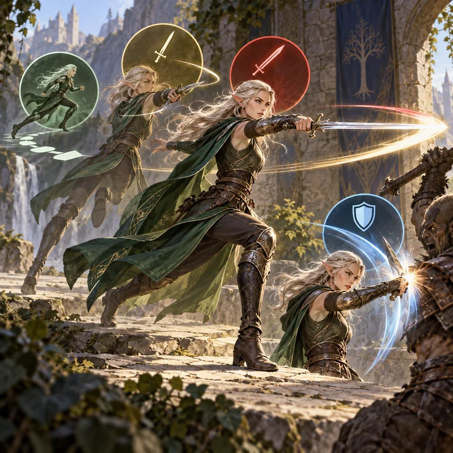

*Mỗi loại hành động có thời điểm và giới hạn riêng. Minh họa nguyên bản tạo bằng OpenAI ImageGen cho bảng thuật ngữ này.*

### Tấn công cơ hội (opportunity attack)

Phản ứng cận chiến khi một sinh vật nhìn thấy rời khỏi tầm với mà không rút lui an toàn.

### Vật lộn và xô ngã

Các đòn tấn công đặc biệt dùng kiểm tra đối kháng thay vì tung tấn công thông thường.

### Che chắn (cover)

Vật cản giữa kẻ tấn công và mục tiêu có thể tăng AC cùng cứu nguy Khéo léo; che chắn hoàn toàn ngăn bị nhắm trực tiếp.

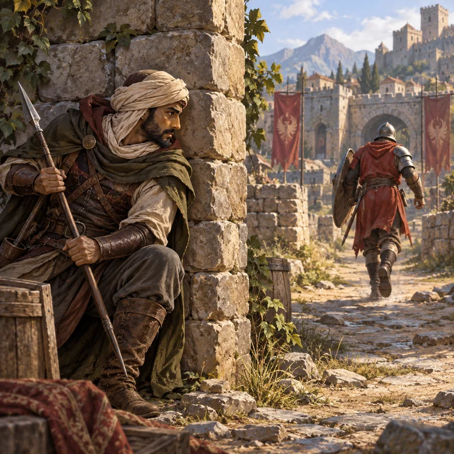

*Che chắn và tấn công cơ hội phụ thuộc vị trí trên chiến trường. Minh họa nguyên bản tạo bằng OpenAI ImageGen cho bảng thuật ngữ này.*

### Đòn chí mạng (critical hit)

Khi tung d20 tấn công ra 20 tự nhiên, đòn đánh tự động trúng và tung gấp đôi toàn bộ xúc xắc sát thương của đòn.

### Cứu nguy tử vong (death saving throw)

Lần tung đặc biệt khi nhân vật ở 0 HP; ba thành công giúp ổn định, ba thất bại dẫn đến chết.

### Mức thách thức (Challenge Rating, CR)

Chỉ số ước lượng sức mạnh quái vật so với nhóm bốn nhân vật. CR không phải cấp của quái vật và không bảo đảm mọi cuộc chạm trán cùng CR khó như nhau.

### Cuộc chạm trán (encounter)

Một tình huống có thử thách cần giải quyết; “combat encounter” là chạm trán chiến đấu. Không phải mọi cuộc gặp trong truyện đều cần dùng luật chiến đấu.

## Phép thuật

### Thi triển phép (spellcasting)

Quy trình sử dụng phép theo lớp, gồm bậc phép, ô phép, thành phần, thời gian, tầm và thời lượng.

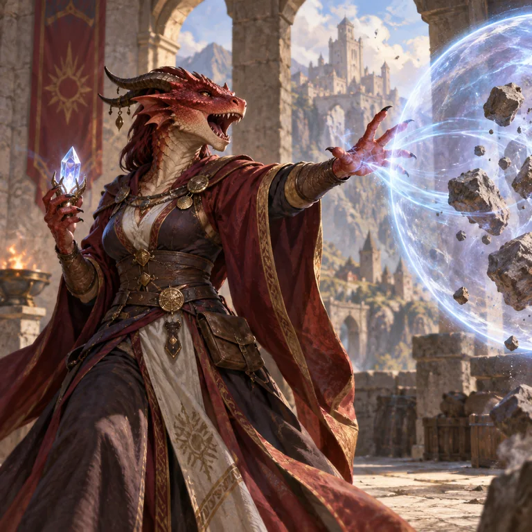

*Phép có thể đòi hỏi lời nói, cử chỉ và thành phần vật chất. Minh họa nguyên bản tạo bằng OpenAI ImageGen cho bảng thuật ngữ này.*

### Phép sơ cấp (cantrip)

Phép bậc 0 có thể thi triển không giới hạn trong điều kiện bình thường. *Cantrip* không có tương đương trực tiếp trong văn hóa phép thuật Việt Nam.

### Ô phép (spell slot)

Nguồn lực dùng để thi triển phép bậc 1 trở lên. Ô phép không phải một phép cụ thể; cùng một ô có thể dùng cho nhiều phép đã biết hoặc đã chuẩn bị.

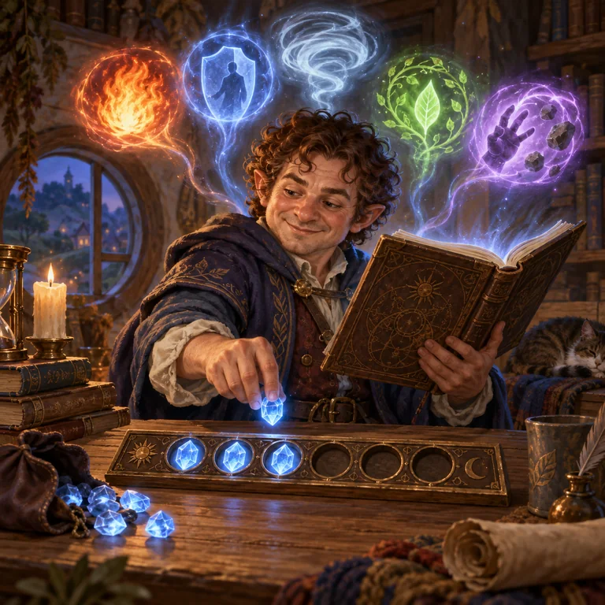

*Ô phép là nguồn lực, không phải một phép cụ thể. Minh họa nguyên bản tạo bằng OpenAI ImageGen cho bảng thuật ngữ này.*

### Phép đã chuẩn bị (prepared spell)

Phép được nhân vật chọn để sẵn sàng thi triển trong ngày. Có phép trong sách chưa chắc đã đồng nghĩa đang chuẩn bị phép ấy.

### Tập trung (concentration)

Cơ chế duy trì một phép; thông thường chỉ duy trì được một phép cần tập trung tại một thời điểm và có thể mất khi chịu sát thương.

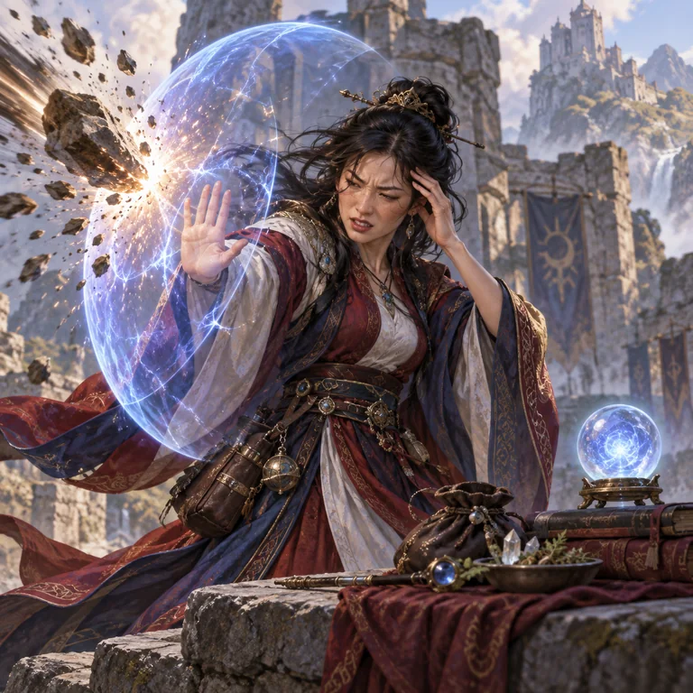

*Tập trung cho phép duy trì một phép và có thể bị phá vỡ. Minh họa nguyên bản tạo bằng OpenAI ImageGen cho bảng thuật ngữ này.*

### Nghi thức (ritual)

Cách thi triển một số phép lâu hơn để không tiêu ô phép, nếu nhân vật có đặc tính cho phép. Không mặc nhiên là nghi lễ tôn giáo.

### Tiêu điểm thi triển phép

Vật dùng thay nhiều thành phần vật chất không có giá tiền, như thánh vật, gậy phép hoặc túi thành phần.

### Thành phần lời nói, cử chỉ và vật chất

Ba loại yêu cầu của phép: âm thanh, động tác tay và vật liệu/tiêu điểm. Bị trói hoặc bị làm câm có thể ảnh hưởng tùy thành phần.

### Tám trường phái ma thuật

Phân loại phép theo chức năng: Bảo hộ, Triệu hồi, Tiên tri, Yểm thuật, Gọi năng lượng, Ảo ảnh, Hoại tử và Chuyển hóa. “Trường phái” không nhất thiết là một trường học hay môn phái xã hội.

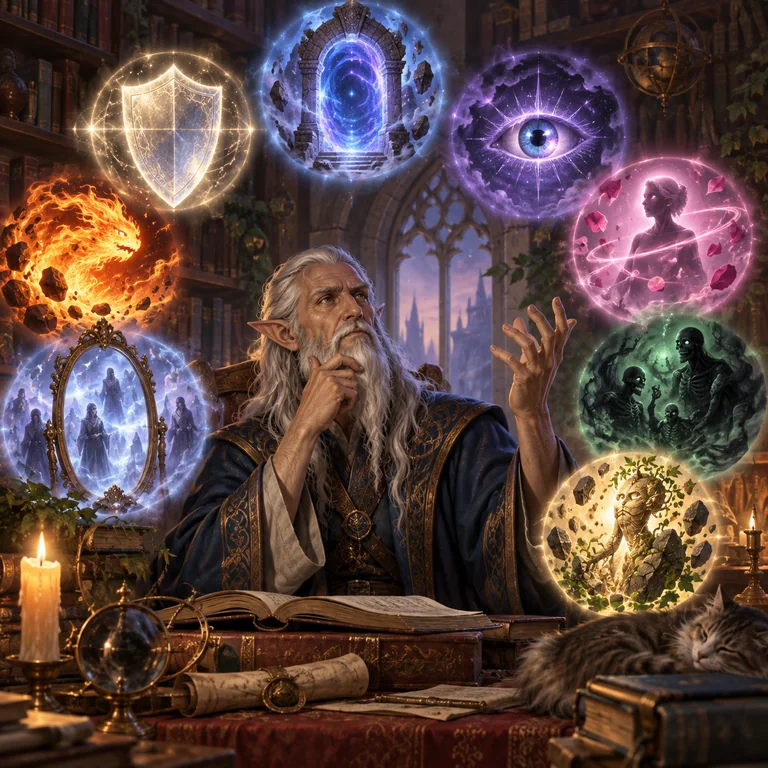

*Trường phái phân loại phép theo chức năng, không nhất thiết là tổ chức. Minh họa nguyên bản tạo bằng OpenAI ImageGen cho bảng thuật ngữ này.*

### Ma thuật huyền thuật và thần thánh

Hai truyền thống mô tả nguồn và cách tiếp cận phép. Đây là phân loại fantasy, không phải thuật ngữ của tín ngưỡng Việt Nam.

### Sách phép (spellbook)

Kho phép của pháp sư, dùng để chuẩn bị phép. Mất sách không làm pháp sư quên ngay các phép đang chuẩn bị nhưng cản trở việc chuẩn bị và sao chép về sau.

## Thế giới, cõi và sinh vật

### Đa vũ trụ (multiverse)

Toàn bộ các thế giới và cõi tồn tại của D&D. Đây là mô hình vũ trụ fantasy của trò chơi, không phải khẳng định khoa học hay tôn giáo.

### Cõi tồn tại (plane of existence)

Một tầng thực tại có quy luật và cư dân riêng, như Cõi Vật chất, các Cõi Nguyên tố hay Cõi Astral. *Plane* ở đây không phải máy bay hoặc mặt phẳng hình học.

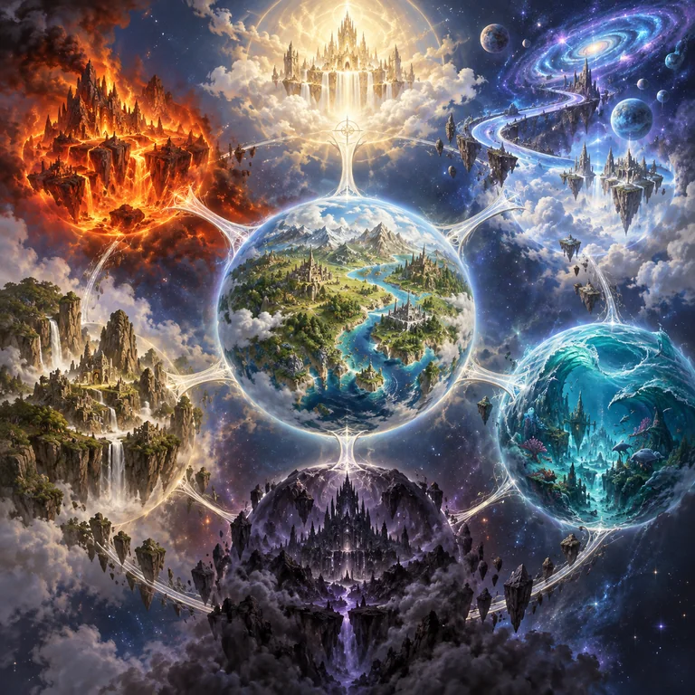

*Các cõi là những tầng thực tại khác nhau trong đa vũ trụ fantasy. Minh họa nguyên bản tạo bằng OpenAI ImageGen cho bảng thuật ngữ này.*

### Cõi Astral (Astral Plane)

Không gian siêu hình nối nhiều cõi, thường được hình dung như biển bạc vô trọng lượng.

### Abyss

Cõi hạ giới hỗn loạn gồm vô số tầng, gắn với demon. Không đồng nhất với mọi khái niệm “địa ngục”.

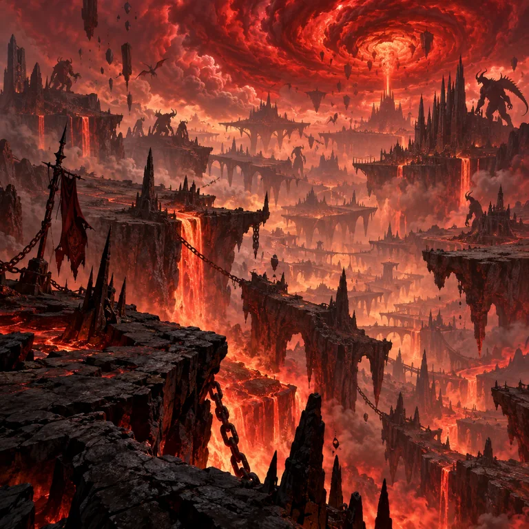

*Abyss là một cõi hạ giới fantasy, không đồng nhất với mọi quan niệm địa ngục. Minh họa nguyên bản tạo bằng OpenAI ImageGen cho bảng thuật ngữ này.*

### Quái vật (monster)

Trong luật, mọi sinh vật có khối thông số và có thể tương tác hoặc chiến đấu đều có thể được gọi là monster, kể cả động vật hoặc NPC; từ này không luôn hàm ý xấu xa.

### Khối thông số (stat block)

Bản tóm tắt dữ liệu cần để điều khiển một sinh vật: AC, HP, tốc độ, thuộc tính, giác quan, đặc tính và hành động.

### Loại sinh vật (creature type)

Phân loại cơ học như thú, rồng, nguyên tố, fey, fiend, humanoid hoặc undead. Loại có thể quyết định một phép hay vật phẩm có tác dụng hay không.

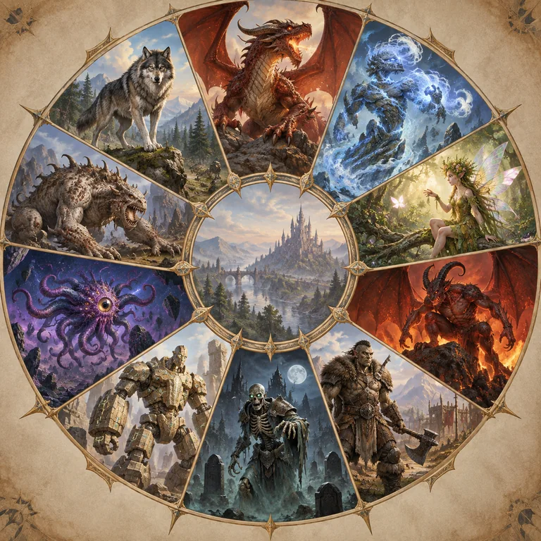

*Loại sinh vật là nhãn cơ học ảnh hưởng tương tác luật. Minh họa nguyên bản tạo bằng OpenAI ImageGen cho bảng thuật ngữ này.*

### Hình người (humanoid)

Loại sinh vật có cơ thể và xã hội gần dạng người. Đây là nhãn luật chơi, không phải phán xét mức độ “văn minh”.

### Bất tử/xác sống (undead)

Sinh vật tồn tại sau cái chết nhờ ma thuật, lời nguyền hoặc năng lượng tiêu cực. Bản dịch có thể dùng “bất tử” cho loại sinh vật và “xác sống” trong tên năng lực quen thuộc.

### Fiend, demon và devil

*Fiend* là loại sinh vật tà ác từ các cõi hạ giới; demon gắn với hỗn loạn, devil gắn với trật tự bạo quyền. Không nên gộp cả ba thành một khái niệm quỷ trong tín ngưỡng Việt Nam.

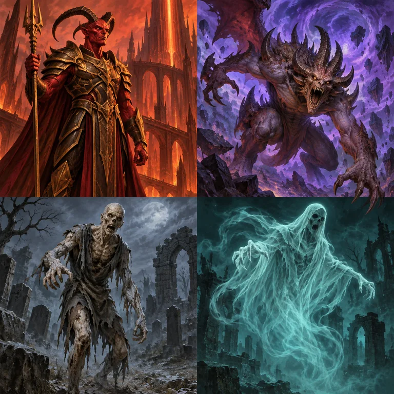

*Fiend thuộc các cõi hạ giới; undead tồn tại sau cái chết. Minh họa nguyên bản tạo bằng OpenAI ImageGen cho bảng thuật ngữ này.*

### Nguyên tố (elemental)

Sinh vật hiện thân cho khí, đất, lửa, nước hoặc lực nguyên sơ khác. Không phải “nguyên tố hóa học”.

### Cấu thể (construct)

Sinh vật được chế tạo và trao chuyển động bằng phép thuật hoặc kỹ nghệ, như golem hay giáp sống.

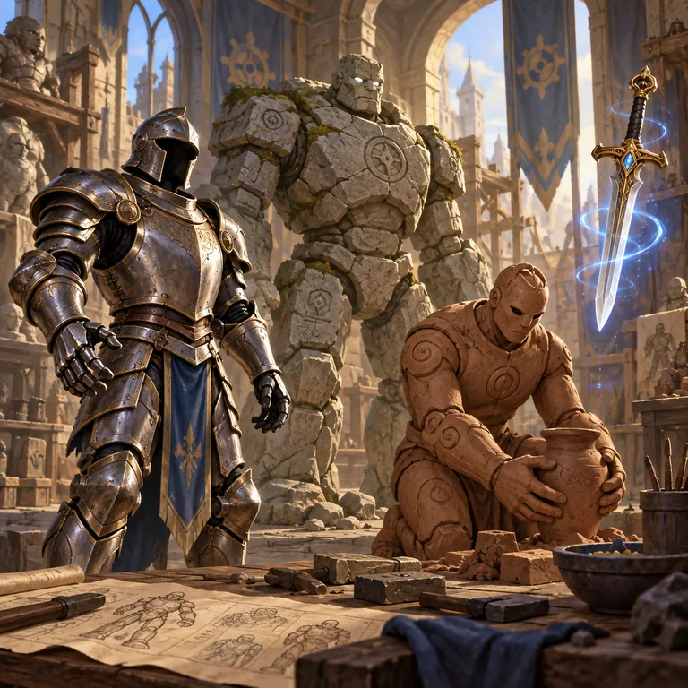

*Cấu thể được tạo ra thay vì sinh ra. Minh họa nguyên bản tạo bằng OpenAI ImageGen cho bảng thuật ngữ này.*

### Dị thể (aberration)

Sinh vật có bản chất xa lạ với trật tự tự nhiên của thế giới, thường gắn với tâm trí hoặc hình thể kỳ dị.

### Quái thú dị hình (monstrosity)

Loại sinh vật fantasy không thuộc thú tự nhiên, thường do ma thuật, lai ghép hoặc nguồn gốc bất thường.

### Rồng trong D&D

Sinh vật phép thuật cổ xưa, thường có hơi thở nguyên tố và nhiều giống theo màu hoặc kim loại. Không đồng nhất với long/rồng trong văn hóa Việt Nam và Đông Á.

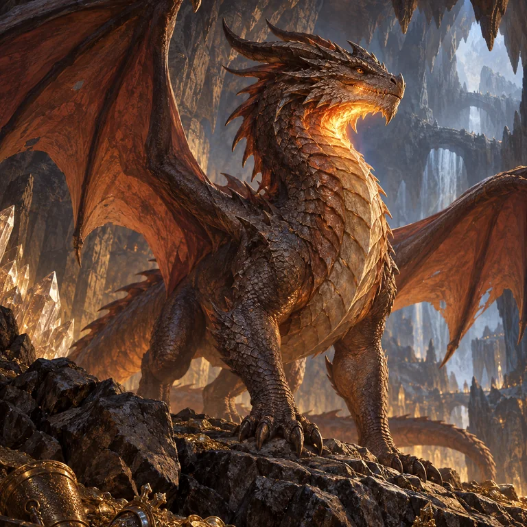

*Rồng D&D có hình thể và truyền thống khác long trong văn hóa Việt Nam. Minh họa nguyên bản tạo bằng OpenAI ImageGen cho bảng thuật ngữ này.*

### Goblin

Dân tộc hình người nhỏ trong fantasy phương Tây. Không có bản dịch Việt duy nhất tương ứng với mọi mô tả goblin.

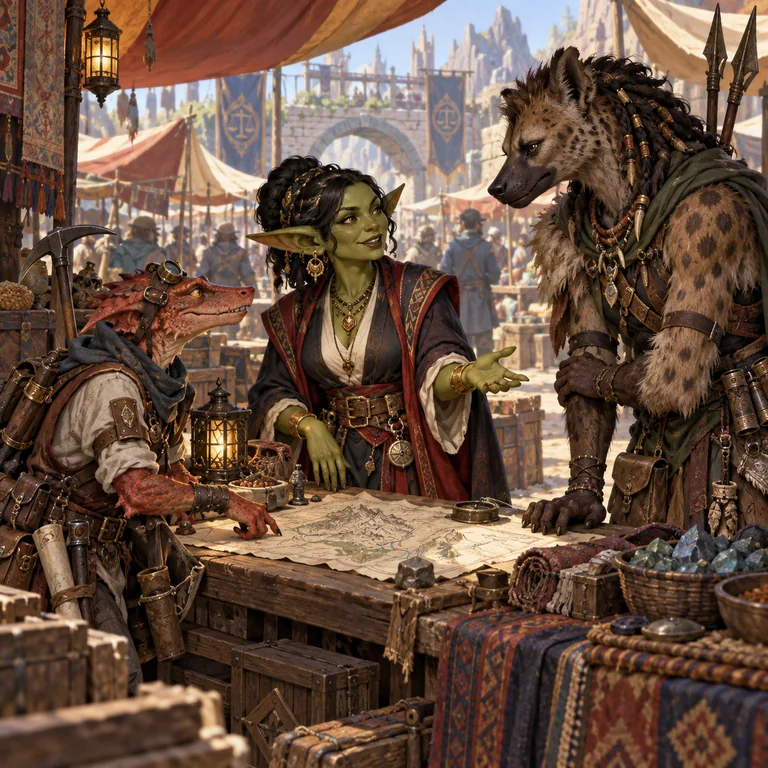

*Các dân tộc fantasy có hình thái và văn hóa riêng, không phải một nhóm đồng nhất. Minh họa nguyên bản tạo bằng OpenAI ImageGen cho bảng thuật ngữ này.*

### Kobold

Sinh vật hình người nhỏ mang nét bò sát/rồng trong D&D; khác kobold trong dân gian Đức và không phải yêu tinh Việt Nam.

### Gnoll

Sinh vật hình người mang nét linh cẩu trong bản luật. Tên riêng fantasy được giữ nguyên để tránh gán vào loài vật hoặc truyền thuyết Việt.

### Golem

Cấu thể nhân tạo được truyền sức sống bằng phép. Tên bắt nguồn từ truyền thống Do Thái nhưng golem D&D là phiên bản fantasy của trò chơi, không phải trình bày đầy đủ truyền thống ấy.

### Lycanthrope / người hóa thú

Sinh vật mang lời nguyền hoặc khả năng biến giữa dạng người, thú và lai. *Lycanthrope* rộng hơn riêng người sói.

## Giác quan, sức chống chịu và sinh vật huyền thoại

### Thị giác bóng tối (darkvision)

Khả năng nhìn trong bóng tối trong một tầm nhất định như ánh sáng mờ, thường chỉ thấy sắc xám. Đây không phải nhìn rõ hoàn toàn như ban ngày.

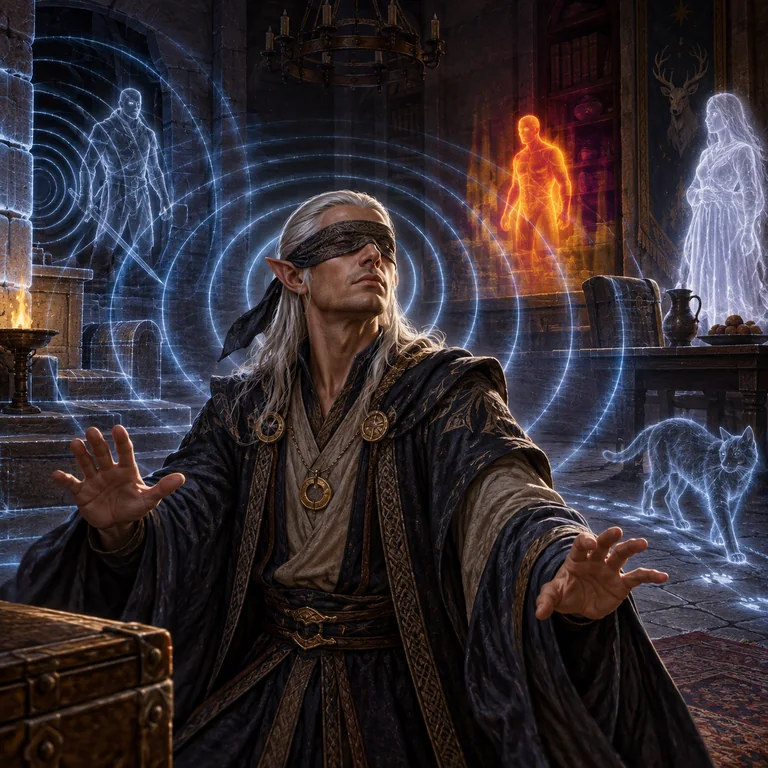

*Thị giác bóng tối, cảm nhận mù và chân thị cung cấp thông tin khác nhau. Minh họa nguyên bản tạo bằng OpenAI ImageGen cho bảng thuật ngữ này.*

### Cảm nhận mù (blindsight)

Khả năng nhận biết môi trường trong một tầm mà không cần thị giác, có thể dựa trên rung động, siêu âm hoặc giác quan đặc biệt.

### Chân thị (truesight)

Giác quan thấy qua bóng tối ma thuật, nhận ra vô hình, ảo ảnh và hình dạng thật trong một tầm nhất định.

### Thần giao cách cảm (telepathy)

Giao tiếp trực tiếp bằng tâm trí trong một tầm. Khả năng này không mặc nhiên cho phép đọc mọi suy nghĩ hoặc điều khiển tâm trí.

### Loại sát thương

Các nhãn như chém, xuyên, đập, lửa, lạnh, sét, độc, tâm linh, quang năng, hoại tử, lực và sấm dùng để xác định tương tác với kháng, miễn nhiễm hoặc dễ tổn thương.

### Kháng, miễn nhiễm và dễ tổn thương

Kháng thường giảm một nửa sát thương; miễn nhiễm loại bỏ hoàn toàn; dễ tổn thương nhân đôi sát thương. Các hiệu ứng cùng loại không mặc nhiên cộng dồn.

### Tri giác thụ động (passive Perception)

Giá trị cố định dùng khi DM cần biết nhân vật có nhận ra điều gì mà không yêu cầu tung xúc xắc.

### Hành động huyền thoại

Hành động đặc biệt cho phép sinh vật rất mạnh hoạt động ngoài lượt của mình, thường ở cuối lượt sinh vật khác.

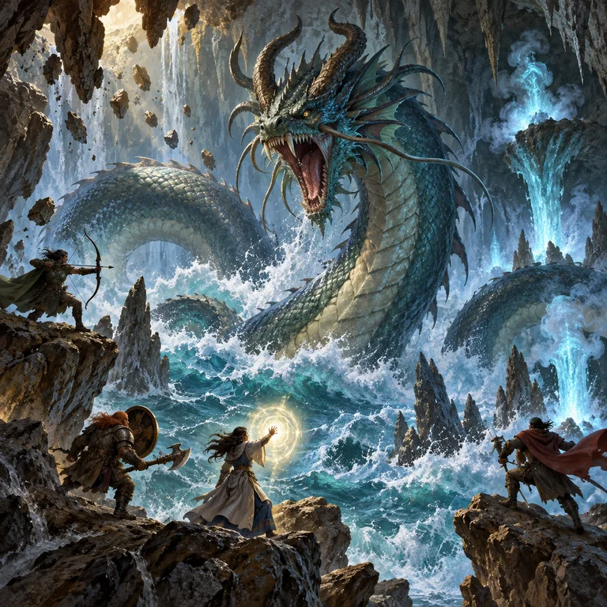

*Sinh vật huyền thoại có thể hành động ngoài lượt và điều khiển môi trường hang ổ. Minh họa nguyên bản tạo bằng OpenAI ImageGen cho bảng thuật ngữ này.*

### Hành động hang ổ

Hiệu ứng môi trường do sinh vật huyền thoại kích hoạt tại hang ổ ở một mốc sáng kiến cố định.

### Hồi năng lực (Recharge)

Cơ chế cho khả năng quái vật có cơ hội dùng lại: đầu lượt tung d6 và hồi nếu kết quả nằm trong khoảng ghi.

### Basilisk

Quái thú bò sát trong fantasy phương Tây có ánh nhìn hóa đá. Không nên đồng nhất với một loài thằn lằn có thật cùng tên tiếng Anh.

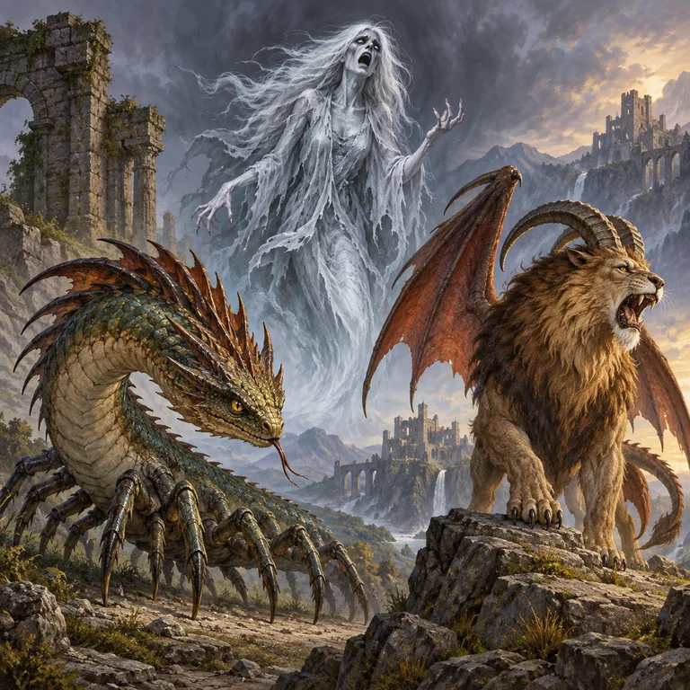

*Ba sinh vật fantasy phương Tây có nguồn gốc và năng lực khác nhau. Minh họa nguyên bản tạo bằng OpenAI ImageGen cho bảng thuật ngữ này.*

### Banshee / nữ yêu than khóc

Linh hồn nữ với tiếng than gây chết chóc, lấy cảm hứng từ truyền thuyết Ireland; không tương đương “ma nữ” trong tín ngưỡng Việt Nam.

### Chimera

Quái vật lai nhiều loài, bắt nguồn từ thần thoại Hy Lạp. Trong D&D thường kết hợp nét sư tử, dê và rồng.

### Cockatrice

Sinh vật fantasy giống gà lai bò sát có khả năng hóa đá; khác basilisk và không phải một loài động vật có thật.

### Manticore

Quái vật có thân sư tử, mặt gần người và đuôi phóng gai, bắt nguồn từ truyền thuyết Ba Tư qua văn học phương Tây.

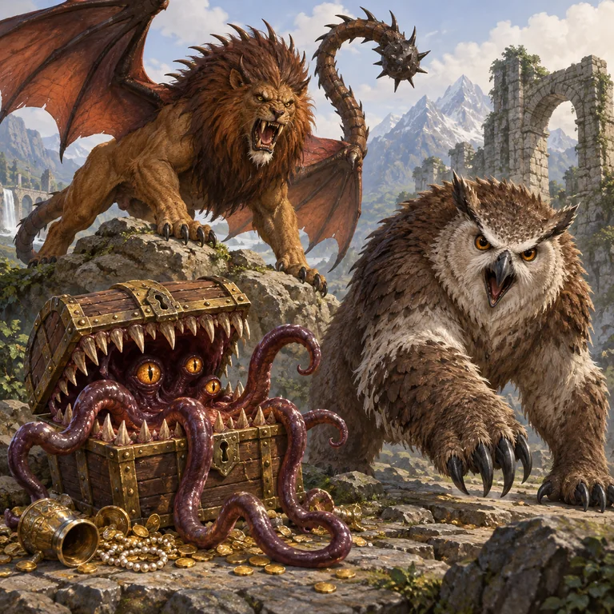

*Những quái vật lai hoặc biến hình không có tương đương trực tiếp trong văn hóa Việt Nam. Minh họa nguyên bản tạo bằng OpenAI ImageGen cho bảng thuật ngữ này.*

### Mimic / kẻ giả dạng đồ vật

Quái vật đổi hình thành đồ vật vô tri, nổi tiếng với hình dạng rương kho báu. Không phải năng lực bắt chước âm thanh.

### Owlbear / gấu cú

Quái thú lai giữa gấu và cú, là sinh vật fantasy chứ không phải tên một loài tự nhiên.

### Ogre

Người khổng lồ ăn thịt trong fantasy phương Tây. Từ này không có một sinh vật dân gian Việt Nam hoàn toàn tương đương.

### Troll

Trong D&D, quái vật lớn có khả năng tái sinh mạnh và sợ lửa/axit; khác nhiều hình tượng troll trong dân gian Bắc Âu hoặc văn hóa mạng.

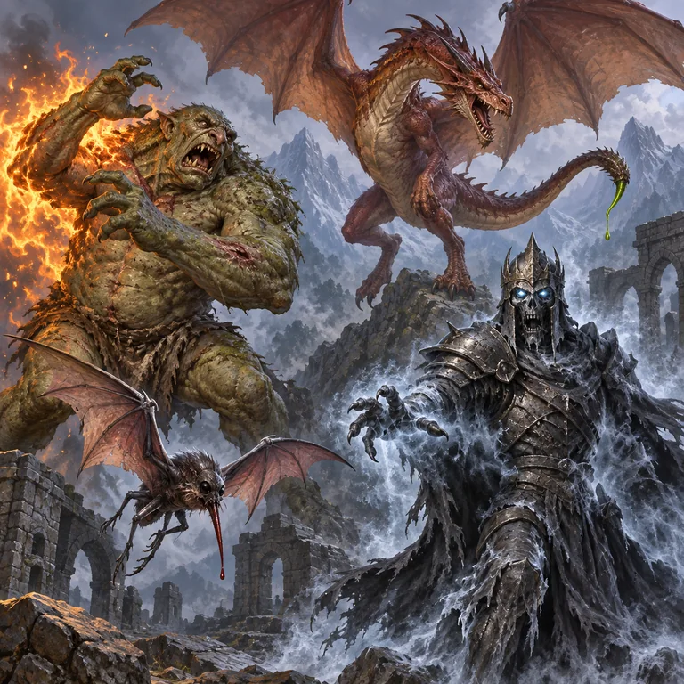

*Bốn sinh vật có hình thái và cơ chế đặc trưng trong fantasy. Minh họa nguyên bản tạo bằng OpenAI ImageGen cho bảng thuật ngữ này.*

### Wyvern

Sinh vật họ rồng có hai chân, hai cánh và đuôi độc. Trong huy hiệu châu Âu và fantasy, wyvern thường được phân biệt với rồng bốn chân.

### Wight

Xác sống có ý chí và khả năng hút sinh lực, bắt nguồn từ một từ cổ chỉ sinh vật/người rồi phát triển thành hình tượng fantasy.

### Stirge

Sinh vật fantasy nhỏ có cánh và vòi hút máu; không phải một loài muỗi hoặc dơi có thật.

## Trạng thái

### Trạng thái (condition)

Hiệu ứng luật chuẩn làm thay đổi khả năng của sinh vật. Cùng một trạng thái từ nhiều nguồn không tự tăng mức, trừ kiệt sức.

### Mù (blinded)

Không thể thấy; tự động thất bại kiểm tra cần thị giác, tấn công của bản thân có bất lợi và đòn đánh vào mình có lợi thế.

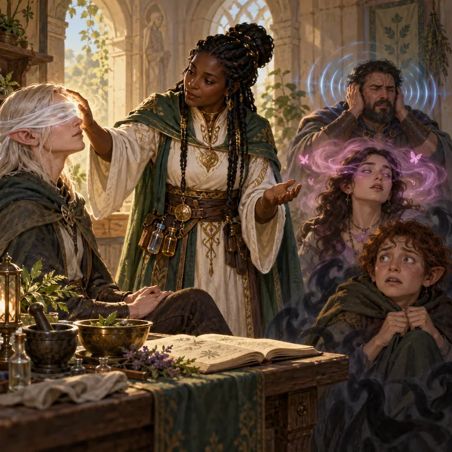

*Mù, điếc, mê hoặc và hoảng sợ tác động theo những cách riêng. Minh họa nguyên bản tạo bằng OpenAI ImageGen cho bảng thuật ngữ này.*

### Mê hoặc (charmed)

Không thể tấn công hoặc gây hại người đã mê hoặc mình; người đó có lợi thế khi tương tác xã hội. Trạng thái không đồng nghĩa bị điều khiển hoàn toàn.

### Điếc (deafened)

Không thể nghe và tự động thất bại kiểm tra cần thính giác.

### Hoảng sợ (frightened)

Bị bất lợi khi còn thấy nguồn sợ và không thể tự nguyện tiến gần nguồn đó.

### Bị vật lộn (grappled)

Tốc độ trở thành 0 nhưng sinh vật vẫn có thể hành động; trạng thái không tự làm ngã sấp hay mất năng lực.

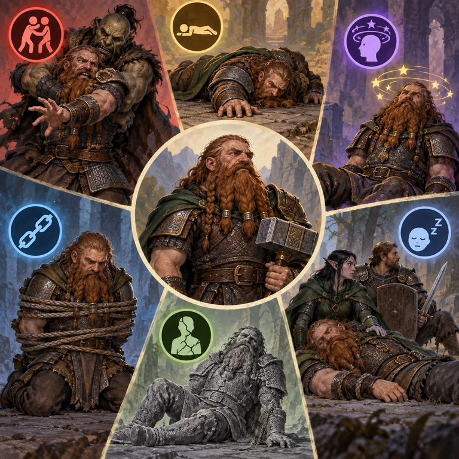

*Các trạng thái có thể hạn chế di chuyển, hành động hoặc nhận biết. Minh họa nguyên bản tạo bằng OpenAI ImageGen cho bảng thuật ngữ này.*

### Mất năng lực hành động (incapacitated)

Không thể dùng hành động hoặc phản ứng; nhiều trạng thái nặng hơn bao hàm trạng thái này.

### Vô hình (invisible)

Không thể bị nhìn thấy nếu không có giác quan đặc biệt, nhưng vị trí vẫn có thể bị phát hiện qua âm thanh hoặc dấu vết.

### Tê liệt (paralyzed)

Mất năng lực, không thể di chuyển/nói, thất bại cứu nguy Sức mạnh và Khéo léo; đòn đánh gần trúng sẽ chí mạng.

### Hóa đá (petrified)

Cơ thể và đồ vật không ma thuật biến thành chất rắn; sinh vật mất nhận biết, kháng sát thương và ngừng già.

### Trúng độc (poisoned)

Có bất lợi khi tấn công và kiểm tra thuộc tính. Trạng thái này khác sát thương độc và miễn nhiễm bệnh.

### Ngã sấp (prone)

Phải bò hoặc đứng dậy; tấn công của bản thân có bất lợi, còn người đánh gần thường có lợi thế.

### Kiềm giữ (restrained)

Tốc độ 0, đòn đánh vào có lợi thế, đòn đánh của mình và cứu nguy Khéo léo có bất lợi.

### Choáng (stunned)

Mất năng lực, không thể di chuyển, nói khó và thất bại cứu nguy Sức mạnh cùng Khéo léo.

### Bất tỉnh (unconscious)

Không nhận biết, buông đồ và ngã sấp; đòn đánh gần trúng sẽ chí mạng.

### Kiệt sức (exhaustion)

Trạng thái đặc biệt có sáu mức tích lũy, từ bất lợi kiểm tra đến chết. Nghỉ dài chỉ giảm một mức khi đủ ăn uống.

## Vật phẩm ma thuật

### Vật phẩm ma thuật (magic item)

Đồ vật có đặc tính siêu nhiên. Một số hoạt động ngay, một số cần lệnh, tích năng hoặc hòa hợp.

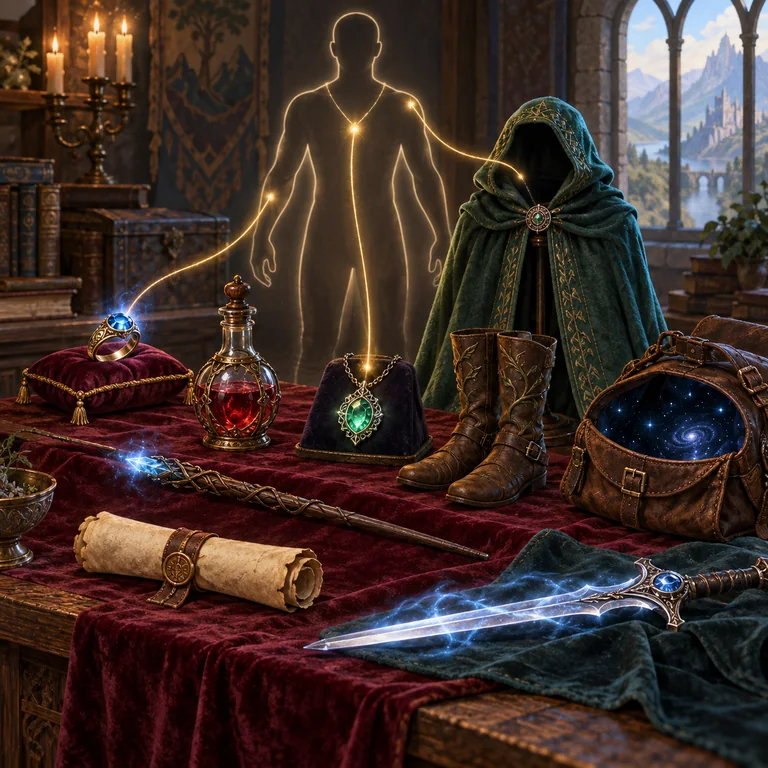

*Vật phẩm ma thuật có nhiều hình thức, độ hiếm và yêu cầu sử dụng. Minh họa nguyên bản tạo bằng OpenAI ImageGen cho bảng thuật ngữ này.*

### Hòa hợp (attunement)

Mối liên kết giữa sinh vật và vật phẩm, thường hình thành sau một lần nghỉ ngắn tập trung. Một sinh vật thường chỉ hòa hợp tối đa ba vật phẩm.

### Độ hiếm vật phẩm

Thang thường, ít gặp, hiếm, rất hiếm và huyền thoại; phản ánh mức độ đặc biệt tương đối, không phải giá bán cố định.

### Lượt tích năng (charges)

Số lần vật phẩm có thể kích hoạt trước khi phải hồi lại. Dùng hết đôi khi có nguy cơ phá hủy vật phẩm.

### Túi chứa đồ (Bag of Holding)

Túi có không gian ngoại chiều lớn hơn vẻ ngoài. Đặt nó vào vật phẩm ngoại chiều khác có thể tạo cổng nguy hiểm.

### Cuộn phép (spell scroll)

Vật phẩm dùng một lần chứa một phép. Người dùng cần có phép trong danh sách lớp và có thể phải kiểm tra nếu phép quá cao.

## Bối cảnh, thần linh và phe phái

### Forgotten Realms và Faerûn

Forgotten Realms là một bối cảnh chiến dịch; Faerûn là lục địa trung tâm thường được nhắc đến. Đây là địa danh hư cấu, không phải thần thoại lịch sử.

### Hệ thần (pantheon)

Nhóm các vị thần được thờ trong một thế giới hoặc văn hóa. Các thần D&D là yếu tố bối cảnh fantasy, không phải lời mô tả tín ngưỡng có thật.

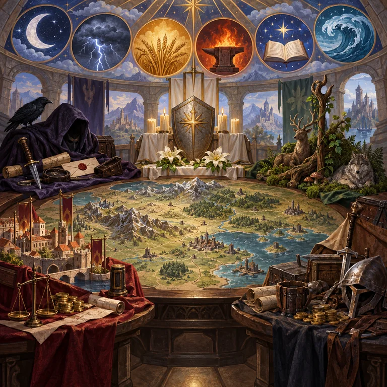

*Hệ thần và phe phái là hai lớp tổ chức khác nhau của bối cảnh fantasy. Minh họa nguyên bản tạo bằng OpenAI ImageGen cho bảng thuật ngữ này.*

### Lãnh địa thần thánh (divine domain)

Phạm vi quyền năng và lý tưởng của thần, đồng thời là lựa chọn cơ học của giáo sĩ. “Lãnh địa” không nhất thiết là lãnh thổ vật lý.

### Harpers

Mạng lưới đặc vụ kín đáo bảo vệ người yếu và chống lạm quyền bằng tri thức, gián điệp và hỗ trợ bí mật.

### Hội Găng giáp (Order of the Gauntlet)

Phe gồm nhiều chiến binh và người có đức tin, nhấn mạnh kỷ luật nội tâm và hành động trực tiếp chống cái ác.

### Hội Ngọc lục bảo (Emerald Enclave)

Phe bảo vệ cân bằng giữa thế giới tự nhiên và văn minh.

### Liên minh Lãnh chúa (Lords’ Alliance)

Liên minh chính trị của nhiều thành phố, phối hợp bảo vệ an ninh và lợi ích chung dù mỗi thành viên vẫn theo đuổi ưu tiên riêng.

### Zhentarim / Mạng lưới Đen

Mạng lưới lính đánh thuê, người môi giới và đặc vụ theo đuổi của cải, ảnh hưởng và tham vọng. Không phải mọi thành viên đều có cùng đạo đức.
