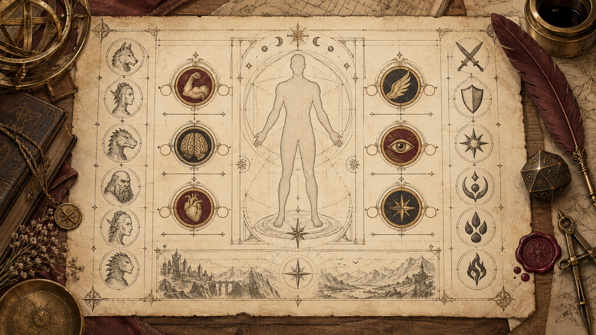
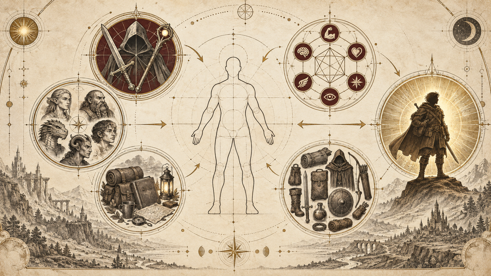
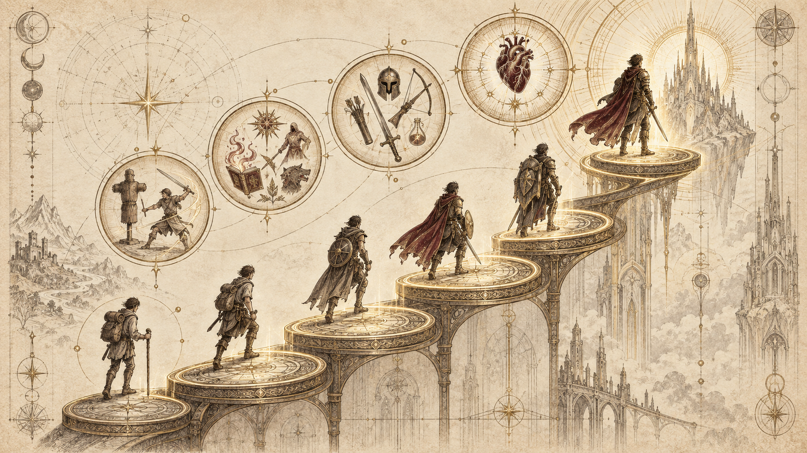
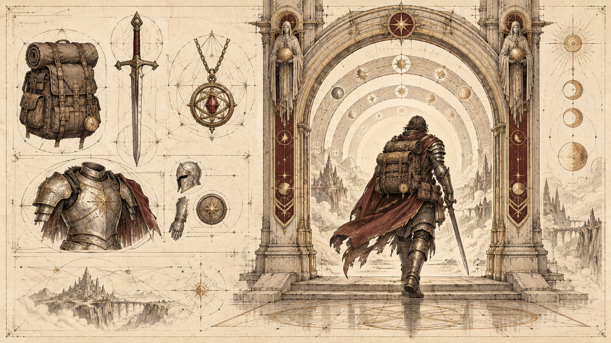
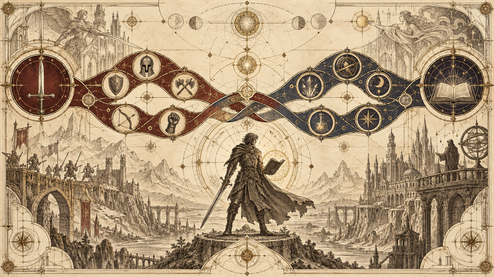
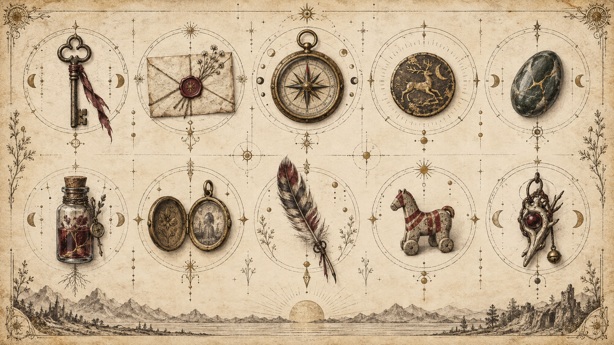

Nguồn: *System Reference Document 5.2.1* (SRD 5.2.1), chương "Character Creation".

## Chọn phiếu nhân vật (Choose a Character Sheet)

Bạn sẽ ghi các thông tin chính của nhân vật lên một **phiếu nhân vật** (character sheet). Trong chương này, "phiếu nhân vật" chỉ bất cứ thứ gì bạn dùng để theo dõi thông tin nhân vật, dù là phiếu in sẵn, phiếu kỹ thuật số hay chỉ là giấy trắng. Hãy chọn loại phiếu hợp với bạn rồi bắt tay vào tạo nhân vật!

## Tạo nhân vật của bạn (Create Your Character)

Dưới đây là các bước tạo nhân vật; mỗi bước được trình bày chi tiết ở phần sau:

1. **Chọn lớp nhân vật.** Mỗi nhà phiêu lưu đều thuộc một lớp nhân vật (class). Lớp nhân vật mô tả khái quát nghề nghiệp, tài năng đặc biệt và chiến thuật ưa thích của nhân vật.
2. **Xác định nguồn gốc.** Nguồn gốc (origin) của nhân vật gồm hai yếu tố: xuất thân và giống loài. Nhân vật đã trải qua những năm tháng nào trước khi trở thành nhà phiêu lưu? Tổ tiên của nhân vật là ai? Bạn cũng chọn ngôn ngữ cho nhân vật ở bước này.
3. **Xác định điểm thuộc tính.** Phần lớn những gì nhân vật làm được trong trò chơi phụ thuộc vào sáu thuộc tính.
4. **Chọn khuynh hướng đạo đức.** Khuynh hướng đạo đức là cách gọi ngắn gọn cho la bàn đạo đức của nhân vật.
5. **Điền chi tiết.** Dựa trên các lựa chọn đã thực hiện, điền nốt thông tin còn lại trên phiếu nhân vật.

### Bước 1: Chọn lớp nhân vật (Step 1: Choose Class)

Chọn một lớp nhân vật và ghi lên phiếu. Bảng **Tổng quan lớp nhân vật** tóm tắt các lớp. Xem [Lớp nhân vật](03-Classes.md) để biết chi tiết.

**Tổng quan lớp nhân vật (Class Overview)**

| Lớp nhân vật | Yêu thích… | Thuộc tính chính | Độ phức tạp |
|---|---|---|---|
| Man rợ (Barbarian) | Chiến trận | Sức mạnh | Trung bình |
| Thi sĩ (Bard) | Biểu diễn | Sức hút | Cao |
| Giáo sĩ (Cleric) | Thần linh | Minh triết | Trung bình |
| Druid | Thiên nhiên | Minh triết | Cao |
| Chiến binh (Fighter) | Vũ khí | Sức mạnh hoặc Khéo léo | Thấp |
| Võ tăng (Monk) | Võ tay không | Khéo léo và Minh triết | Cao |
| Thánh kỵ sĩ (Paladin) | Bảo vệ | Sức mạnh và Sức hút | Trung bình |
| Kiểm lâm (Ranger) | Sinh tồn | Khéo léo và Minh triết | Trung bình |
| Đạo tặc (Rogue) | Lén lút | Khéo léo | Thấp |
| Thuật sĩ (Sorcerer) | Sức mạnh bẩm sinh | Sức hút | Cao |
| Warlock | Tri thức huyền bí | Sức hút | Cao |
| Pháp sư (Wizard) | Sách phép | Trí tuệ | Trung bình |

**Ghi cấp độ (Write Your Level).** Ghi cấp của nhân vật lên phiếu. Thông thường, nhân vật bắt đầu ở cấp 1 và lên cấp nhờ phiêu lưu và nhận **điểm kinh nghiệm (XP)**. Hãy ghi cả XP. Nhân vật cấp 1 có 0 XP.

**Bắt đầu ở cấp cao hơn (Starting at a Higher Level).** GM có thể cho bạn bắt đầu ở cấp cao hơn. Nếu bắt đầu từ cấp 3 trở lên, hãy ghi phân lớp đã chọn lên phiếu. Xem phần [Bắt đầu ở cấp cao hơn](#bắt-đầu-ở-cấp-cao-hơn-starting-at-higher-levels) bên dưới để biết thêm.

**Ghi huấn luyện giáp (Note Armor Training).** Lớp nhân vật có thể cho bạn huấn luyện với một số loại giáp. Ghi chú điều này lên phiếu. Được huấn luyện với một loại giáp nghĩa là bạn có thể mặc nó hiệu quả và nhận lợi ích phòng thủ. Các loại giáp được mô tả trong [Trang bị](06-Equipment.md).

### Bước 2: Nguồn gốc nhân vật (Step 2: Character Origin)

Xác định nguồn gốc gồm việc chọn một xuất thân, một giống loài và hai ngôn ngữ. Xuất thân đại diện cho nơi chốn và nghề nghiệp đã ảnh hưởng sâu sắc nhất đến nhân vật. Sự kết hợp giữa xuất thân, giống loài và ngôn ngữ là nền tảng phong phú để bạn hình dung những năm đầu đời của nhân vật.

**Chọn xuất thân (Choose a Background).** Chọn xuất thân cho nhân vật và ghi lên phiếu. Bạn có thể chọn bất kỳ xuất thân nào trong [Nguồn gốc nhân vật](04-Character-Origins.md), và GM có thể đưa thêm lựa chọn khác.

Xuất thân ảnh hưởng đến bước 3, khi bạn xác định điểm thuộc tính. Nếu phân vân, bảng **Điểm thuộc tính và xuất thân** cho biết xuất thân nào có lợi cho thuộc tính nào. Hãy tìm thuộc tính chính của lớp nhân vật trong bảng.

**Điểm thuộc tính và xuất thân (Ability Scores and Backgrounds)**

| Thuộc tính | Xuất thân |
|---|---|
| Sức mạnh | Binh sĩ (Soldier) |
| Khéo léo | Binh sĩ (Soldier) |
| Thể chất | Binh sĩ (Soldier) |
| Trí tuệ | Trợ tế (Acolyte) |
| Minh triết | Trợ tế (Acolyte) |
| Sức hút | Trợ tế (Acolyte) |

**Ghi kỳ tài (Record Your Feat).** Xuất thân cho bạn một **kỳ tài** (feat) mang lại những khả năng cụ thể. Kỳ tài được trình bày trong [Kỳ tài](05-Feats.md). Ghi kỳ tài đó lên phiếu.

**Ghi các thành thạo (Note Proficiencies).** Xuất thân cho bạn thành thạo hai kỹ năng và một công cụ. Ghi các thông tin này lên phiếu. Lớp nhân vật cũng cho các thành thạo; hãy xem mô tả lớp trong [Lớp nhân vật](03-Classes.md) và ghi lại.

Bảng đặc tính trong mô tả lớp cho biết thưởng thành thạo của bạn (mô tả trong [Chơi trò chơi](01-Playing-the-Game.md)), là +2 với nhân vật cấp 1. Ghi con số này lên phiếu. Bạn sẽ điền các con số khác liên quan đến thành thạo ở bước 5.

**Chọn trang bị khởi đầu (Choose Starting Equipment).** Cả xuất thân và lớp nhân vật đều cho trang bị khởi đầu. Số tiền nhận được ở bước này có thể dùng ngay để mua trang bị trong [Trang bị](06-Equipment.md).

Ghi trang bị đã chọn lên phiếu. Trang bị được mô tả trong [Trang bị](06-Equipment.md), nhưng lúc này bạn chỉ cần ghi tên và tra chi tiết sau. Ghi số tiền còn lại sau khi mua sắm.

**Chọn giống loài (Choose a Species).** Chọn giống loài cho nhân vật. Các lựa chọn sau được trình bày trong [Nguồn gốc nhân vật](04-Character-Origins.md): Dragonborn, Người lùn (Dwarf), Elf, Gnome, Goliath, Halfling, Con người (Human), Orc và Tiefling. Sau khi chọn, ghi giống loài và các đặc điểm của nó lên phiếu.

Kích cỡ và Tốc độ của nhân vật do giống loài quyết định; hãy ghi vào ô tương ứng trên phiếu (có thể chỉ ghi chữ cái đầu của kích cỡ).

**Hình dung quá khứ và hiện tại (Imagine Your Past and Present).** Hãy để xuất thân và giống loài gợi cảm hứng cho quá khứ của nhân vật. Quá khứ đó nuôi dưỡng hiện tại. Với ý đó, hãy thử trả lời các câu hỏi sau dưới góc nhìn của nhân vật:

- Ai đã nuôi nấng bạn?
- Ai là bạn thân nhất thời thơ ấu của bạn?
- Bạn có lớn lên cùng một con vật nuôi không?
- Bạn đã từng yêu chưa? Nếu có, là ai?
- Bạn có gia nhập tổ chức nào như phường hội hay tôn giáo không? Nếu có, bạn còn là thành viên chứ?
- Điều gì trong quá khứ thôi thúc bạn đi phiêu lưu hôm nay?

**Chọn ngôn ngữ (Choose Languages).** Nhân vật biết ít nhất ba ngôn ngữ: Common cộng với hai ngôn ngữ bạn tung xúc xắc hoặc chọn từ bảng **Ngôn ngữ tiêu chuẩn**. Biết một ngôn ngữ nghĩa là nhân vật có thể nói, đọc và viết ngôn ngữ đó. Lớp nhân vật và các đặc tính khác cũng có thể cho thêm ngôn ngữ.

Bảng **Ngôn ngữ tiêu chuẩn** liệt kê những ngôn ngữ phổ biến trong bối cảnh trò chơi. Mọi nhân vật người chơi đều biết Common. Các ngôn ngữ phổ biến khác bắt nguồn từ những thành viên đầu tiên của các giống loài nổi bật nhất trong bối cảnh rồi lan rộng.

**Ngôn ngữ tiêu chuẩn (Standard Languages)**

| 1d12 | Ngôn ngữ |
|---|---|
| — | Common (tiếng Chung) |
| 1 | Common Sign Language (ngôn ngữ ký hiệu Chung) |
| 2 | Draconic (tiếng Rồng) |
| 3–4 | Dwarvish (tiếng Người lùn) |
| 5–6 | Elvish (tiếng Elf) |
| 7 | Giant (tiếng Người khổng lồ) |
| 8 | Gnomish (tiếng Gnome) |
| 9 | Goblin |
| 10–11 | Halfling |
| 12 | Orc |

Bảng **Ngôn ngữ hiếm** liệt kê các ngôn ngữ bí mật hoặc bắt nguồn từ các cõi tồn tại khác, nên ít phổ biến trong các thế giới thuộc Cõi Vật chất (Material Plane). Một số đặc tính cho phép nhân vật học ngôn ngữ hiếm.

**Ngôn ngữ hiếm (Rare Languages)**

| Ngôn ngữ | Ngôn ngữ |
|---|---|
| Abyssal | Primordial* |
| Celestial | Sylvan |
| Deep Speech | Thieves' Cant (tiếng lóng của kẻ trộm) |
| Druidic | Undercommon |
| Infernal | |

\*Primordial gồm các phương ngữ Aquan, Auran, Ignan và Terran. Sinh vật biết một phương ngữ có thể giao tiếp với sinh vật biết phương ngữ khác.

### Bước 3: Điểm thuộc tính (Step 3: Ability Scores)

Để xác định điểm thuộc tính, trước tiên bạn tạo sáu con số theo hướng dẫn dưới đây rồi gán chúng cho sáu thuộc tính. [Chơi trò chơi](01-Playing-the-Game.md) giải thích ý nghĩa của từng thuộc tính.

**Tạo các điểm số (Generate Your Scores).** Xác định điểm thuộc tính bằng một trong các cách sau. GM có thể muốn bạn dùng một cách cụ thể.

- **Bộ số tiêu chuẩn (Standard Array).** Dùng sáu số sau cho các thuộc tính: 15, 14, 13, 12, 10, 8.
- **Tạo ngẫu nhiên (Random Generation).** Tung bốn viên d6 và ghi tổng ba viên cao nhất. Lặp lại thêm năm lần để có sáu số.
- **Mua điểm (Point Cost).** Bạn có 27 điểm để phân bổ vào các điểm thuộc tính. Chi phí mỗi mức điểm nằm trong bảng **Chi phí mua điểm thuộc tính**. Ví dụ, điểm 14 tốn 7 trong 27 điểm.

**Chi phí mua điểm thuộc tính (Ability Score Point Costs)**

| Điểm | Chi phí | Điểm | Chi phí |
|---|---|---|---|
| 8 | 0 | 12 | 4 |
| 9 | 1 | 13 | 5 |
| 10 | 2 | 14 | 7 |
| 11 | 3 | 15 | 9 |

**Gán điểm thuộc tính (Assign Ability Scores).** Sau khi có sáu số, gán chúng cho Sức mạnh, Khéo léo, Thể chất, Trí tuệ, Minh triết và Sức hút, chú ý đến thuộc tính chính của lớp nhân vật. Điền cả hệ số thuộc tính.

Nếu dùng bộ số tiêu chuẩn, hãy tham khảo bảng **Bộ số tiêu chuẩn theo lớp** để biết cách gán gợi ý. Bảng đặt điểm cao nhất vào các thuộc tính quan trọng nhất của mỗi lớp. Nếu dùng cách khác, bạn vẫn có thể dựa vào bảng để quyết định nơi đặt điểm cao và thấp.

**Bộ số tiêu chuẩn theo lớp (Standard Array by Class)**

| Lớp nhân vật | STR | DEX | CON | INT | WIS | CHA |
|---|---|---|---|---|---|---|
| Man rợ | 15 | 13 | 14 | 10 | 12 | 8 |
| Thi sĩ | 8 | 14 | 12 | 13 | 10 | 15 |
| Giáo sĩ | 14 | 8 | 13 | 10 | 15 | 12 |
| Druid | 8 | 12 | 14 | 13 | 15 | 10 |
| Chiến binh | 15 | 14 | 13 | 8 | 10 | 12 |
| Võ tăng | 12 | 15 | 13 | 10 | 14 | 8 |
| Thánh kỵ sĩ | 15 | 10 | 13 | 8 | 12 | 14 |
| Kiểm lâm | 12 | 15 | 13 | 8 | 14 | 10 |
| Đạo tặc | 12 | 15 | 13 | 14 | 10 | 8 |
| Thuật sĩ | 10 | 13 | 14 | 8 | 12 | 15 |
| Warlock | 8 | 14 | 13 | 12 | 10 | 15 |
| Pháp sư | 8 | 12 | 13 | 15 | 14 | 10 |

**Điều chỉnh điểm thuộc tính (Adjust Ability Scores).** Sau khi gán điểm, hãy điều chỉnh theo xuất thân. Xuất thân liệt kê ba thuộc tính; tăng một thuộc tính thêm 2 và một thuộc tính khác thêm 1, hoặc tăng cả ba thêm 1. Không mức tăng nào được đưa điểm vượt quá 20.

Có người chơi thích tăng thuộc tính chính của lớp, có người lại thích bù cho một điểm thấp.

**Xác định hệ số thuộc tính (Determine Ability Modifiers).** Cuối cùng, xác định hệ số thuộc tính bằng bảng **Điểm và hệ số thuộc tính**. Ghi hệ số cạnh mỗi điểm.

**Điểm và hệ số thuộc tính (Ability Scores and Modifiers)**

| Điểm | Hệ số | Điểm | Hệ số |
|---|---|---|---|
| 3 | −4 | 12–13 | +1 |
| 4–5 | −3 | 14–15 | +2 |
| 6–7 | −2 | 16–17 | +3 |
| 8–9 | −1 | 18–19 | +4 |
| 10–11 | +0 | 20 | +5 |

### Bước 4: Khuynh hướng đạo đức (Step 4: Alignment)

Chọn khuynh hướng đạo đức cho nhân vật từ các lựa chọn dưới đây và ghi lên phiếu.

Trò chơi mặc định nhân vật người chơi không mang khuynh hướng ác. Hãy bàn với GM trước khi tạo một nhân vật ác.

**Chín khuynh hướng đạo đức (The Nine Alignments).** Khuynh hướng đạo đức của một sinh vật mô tả khái quát thái độ đạo đức và lý tưởng của nó. Khuynh hướng là sự kết hợp của hai yếu tố: một yếu tố về đạo đức (thiện, ác hoặc trung lập) và một yếu tố về thái độ với trật tự (trật tự, hỗn loạn hoặc trung lập).

Các mô tả dưới đây nêu hành vi điển hình của sinh vật mang từng khuynh hướng; mỗi cá thể có thể khác đi.

- **Trật tự thiện (Lawful Good, LG).** Sinh vật trật tự thiện cố làm điều đúng như xã hội kỳ vọng. Người không ngần ngại chống bất công và bảo vệ người vô tội có lẽ là trật tự thiện.
- **Trung lập thiện (Neutral Good, NG).** Sinh vật trung lập thiện làm điều tốt nhất có thể, hành động trong khuôn khổ luật lệ nhưng không thấy mình bị trói buộc bởi chúng. Người tử tế giúp đỡ người khác tùy nhu cầu của họ có lẽ là trung lập thiện.
- **Hỗn loạn thiện (Chaotic Good, CG).** Sinh vật hỗn loạn thiện hành động theo lương tâm, ít bận tâm đến kỳ vọng của người khác. Kẻ nổi loạn chặn cướp tiền thuế của một nam tước tàn ác rồi dùng số tiền đó giúp người nghèo có lẽ là hỗn loạn thiện.
- **Trật tự trung lập (Lawful Neutral, LN).** Cá thể trật tự trung lập hành động theo luật pháp, truyền thống hoặc nguyên tắc riêng. Người sống theo kỷ luật nghiêm ngặt — không bị lay động bởi lời cầu cứu hay cám dỗ của cái ác — có lẽ là trật tự trung lập.
- **Trung lập (Neutral, N).** Trung lập là khuynh hướng của những ai muốn tránh các câu hỏi đạo đức và không đứng về phe nào, làm điều có vẻ tốt nhất vào lúc đó. Người chán ngán những cuộc tranh luận đạo đức có lẽ là trung lập.
- **Hỗn loạn trung lập (Chaotic Neutral, CN).** Sinh vật hỗn loạn trung lập làm theo ý thích, coi trọng tự do cá nhân trên hết. Kẻ lang bạt sống nhờ mưu mẹo có lẽ là hỗn loạn trung lập.
- **Trật tự ác (Lawful Evil, LE).** Sinh vật trật tự ác lấy thứ mình muốn một cách có phương pháp, trong giới hạn của truyền thống, lòng trung thành hoặc trật tự. Quý tộc bóc lột dân chúng trong khi mưu cầu quyền lực có lẽ là trật tự ác.
- **Trung lập ác (Neutral Evil, NE).** Trung lập ác là khuynh hướng của những kẻ chẳng bận tâm đến tổn hại mình gây ra khi theo đuổi ham muốn. Tên tội phạm cướp của giết người tùy hứng có lẽ là trung lập ác.
- **Hỗn loạn ác (Chaotic Evil, CE).** Sinh vật hỗn loạn ác hành động bằng bạo lực tùy tiện, bị thôi thúc bởi thù hận hoặc khát máu. Kẻ phản diện theo đuổi âm mưu trả thù và tàn phá có lẽ là hỗn loạn ác.

> [!info] Sinh vật không khuynh hướng (Unaligned Creatures)
> Hầu hết sinh vật không có khả năng tư duy lý trí thì không có khuynh hướng đạo đức; chúng **không khuynh hướng** (unaligned). Ví dụ, cá mập là kẻ săn mồi hung dữ nhưng không ác; chúng không khuynh hướng.

### Bước 5: Hoàn thiện chi tiết (Step 5: Character Creation Details)

Giờ hãy điền nốt phần còn lại của phiếu nhân vật.

**Ghi đặc tính lớp (Record Class Features).** Xem bảng đặc tính của lớp trong [Lớp nhân vật](03-Classes.md) và ghi các đặc tính cấp 1. Chi tiết từng đặc tính cũng nằm ở đó. Một số đặc tính đưa ra lựa chọn; hãy đọc hết các đặc tính và đưa ra những lựa chọn cần thiết.

**Điền các con số (Fill In Numbers).** Ghi các con số sau lên phiếu.

- **Lần cứu nguy (Saving Throws).** Với loại cứu nguy bạn thành thạo, cộng thưởng thành thạo vào hệ số thuộc tính tương ứng và ghi tổng. Một số người chơi cũng ghi hệ số của các loại cứu nguy không thành thạo, tức chỉ là hệ số thuộc tính tương ứng.
- **Kỹ năng (Skills).** Với kỹ năng bạn thành thạo, cộng thưởng thành thạo vào hệ số thuộc tính của kỹ năng đó và ghi tổng. Bạn cũng có thể ghi hệ số của các kỹ năng không thành thạo, tức chỉ là hệ số thuộc tính tương ứng.
- **Tri giác thụ động (Passive Perception).** Đôi khi GM xác định nhân vật có nhận ra điều gì đó hay không mà không yêu cầu kiểm tra Minh triết (Tri giác); thay vào đó GM dùng Tri giác thụ động. Đây là điểm phản ánh mức nhận biết chung về xung quanh khi bạn không chủ động tìm kiếm. Dùng công thức sau:

  **Tri giác thụ động = 10 + hệ số kiểm tra Minh triết (Tri giác)**

  Tính cả mọi hệ số áp dụng cho phép kiểm tra Minh triết (Tri giác). Ví dụ, nếu nhân vật có Minh triết 15 và thành thạo kỹ năng Tri giác, Tri giác thụ động là 14 (10 + 2 từ hệ số Minh triết + 2 từ thành thạo).

- **Điểm sinh lực (Hit Points).** Lớp nhân vật và hệ số Thể chất quyết định điểm sinh lực tối đa ở cấp 1, như trong bảng **Điểm sinh lực cấp 1 theo lớp**.

**Điểm sinh lực cấp 1 theo lớp (Level 1 Hit Points by Class)**

| Lớp nhân vật | Điểm sinh lực tối đa |
|---|---|
| Man rợ | 12 + hệ số CON |
| Chiến binh, Thánh kỵ sĩ hoặc Kiểm lâm | 10 + hệ số CON |
| Thi sĩ, Giáo sĩ, Druid, Võ tăng, Đạo tặc hoặc Warlock | 8 + hệ số CON |
| Thuật sĩ hoặc Pháp sư | 6 + hệ số CON |

Phiếu nhân vật có chỗ ghi HP hiện tại khi bạn chịu sát thương, cũng như điểm sinh lực tạm thời. Phiếu cũng có chỗ theo dõi cứu nguy tử vong.

- **Xúc xắc sinh lực (Hit Point Dice).** Mô tả lớp cho biết loại xúc xắc sinh lực (Hit Point Dice, gọi tắt Hit Dice) của nhân vật; ghi lên phiếu. Ở cấp 1, nhân vật có 1 xúc xắc sinh lực. Bạn có thể dùng xúc xắc sinh lực khi nghỉ ngắn để hồi HP. Phiếu cũng có chỗ ghi số xúc xắc sinh lực đã dùng.
- **Sáng kiến (Initiative).** Ghi hệ số Khéo léo vào ô Sáng kiến trên phiếu.
- **Chỉ số giáp (Armor Class).** Không mặc giáp hay cầm khiên, AC cơ bản của bạn là 10 cộng hệ số Khéo léo. Nếu trang bị khởi đầu có giáp hoặc Khiên (hoặc cả hai), hãy tính AC theo luật trong [Trang bị](06-Equipment.md). Một đặc tính lớp có thể cho bạn cách tính AC khác.
- **Tấn công (Attacks).** Ghi các vũ khí khởi đầu vào mục Vũ khí và phép sơ cấp gây sát thương trên phiếu. Điểm cộng khi tung tấn công bằng vũ khí mà bạn thành thạo tính theo một trong các công thức sau, trừ khi thuộc tính của vũ khí nói khác:

  **Điểm cộng tấn công cận chiến = hệ số Sức mạnh + thưởng thành thạo**

  **Điểm cộng tấn công tầm xa = hệ số Khéo léo + thưởng thành thạo**

  Tra sát thương và thuộc tính của vũ khí trong [Trang bị](06-Equipment.md). Bạn cộng cùng hệ số thuộc tính dùng để tấn công bằng vũ khí vào lần tung sát thương của vũ khí đó.

- **Phép (Spells).** Ghi cả DC cứu nguy phép lẫn điểm cộng tấn công bằng phép theo các công thức sau:

  **DC cứu nguy phép = 8 + hệ số thuộc tính thi triển phép + thưởng thành thạo**

  **Điểm cộng tấn công bằng phép = hệ số thuộc tính thi triển phép + thưởng thành thạo**

  Hệ số thuộc tính thi triển phép của một phép được xác định bởi danh sách phép, đặc tính lớp hoặc kỳ tài đã cho bạn khả năng thi triển phép đó.

  Nếu lớp nhân vật cho bạn đặc tính Thi triển phép (Spellcasting) hoặc Ma thuật khế ước (Pact Magic), bảng đặc tính lớp cho biết số ô phép, số phép sơ cấp bạn biết và số phép bạn có thể chuẩn bị. Hãy chọn phép sơ cấp và các phép chuẩn bị, rồi ghi chúng — cùng số ô phép — lên phiếu.

## Lên cấp (Level Advancement)

Khi phiêu lưu, nhân vật tích lũy kinh nghiệm, thể hiện bằng **điểm kinh nghiệm (XP)**. Khi đạt một mức XP nhất định, nhân vật trở nên mạnh hơn. Sự tiến bộ này gọi là lên cấp.

Bảng **Tiến trình nhân vật** liệt kê XP cần để đạt từng cấp và thưởng thành thạo ở cấp đó. Khi tổng XP bằng hoặc vượt một con số trong cột Điểm kinh nghiệm, bạn đạt cấp tương ứng.

**Tiến trình nhân vật (Character Advancement)**

| Cấp | Điểm kinh nghiệm | Thưởng thành thạo |
|---|---|---|
| 1 | 0 | +2 |
| 2 | 300 | +2 |
| 3 | 900 | +2 |
| 4 | 2.700 | +2 |
| 5 | 6.500 | +3 |
| 6 | 14.000 | +3 |
| 7 | 23.000 | +3 |
| 8 | 34.000 | +3 |
| 9 | 48.000 | +4 |
| 10 | 64.000 | +4 |
| 11 | 85.000 | +4 |
| 12 | 100.000 | +4 |
| 13 | 120.000 | +5 |
| 14 | 140.000 | +5 |
| 15 | 165.000 | +5 |
| 16 | 195.000 | +5 |
| 17 | 225.000 | +6 |
| 18 | 265.000 | +6 |
| 19 | 305.000 | +6 |
| 20 | 355.000 | +6 |

**Khi lên cấp (Gaining a Level).** Khi lên cấp, hãy làm theo các bước sau:

1. **Chọn lớp nhân vật.** Hầu hết nhân vật lên cấp trong cùng một lớp. Tuy nhiên, bạn có thể lên cấp ở lớp khác theo luật trong phần [Đa lớp](#đa-lớp-multiclassing).
2. **Điều chỉnh điểm sinh lực và xúc xắc sinh lực.** Mỗi lần lên cấp, bạn nhận thêm một xúc xắc sinh lực. Tung viên đó, cộng hệ số Thể chất và cộng tổng (tối thiểu 1) vào điểm sinh lực tối đa. Thay vì tung, bạn có thể dùng giá trị cố định trong bảng **Điểm sinh lực cố định theo lớp**.

**Điểm sinh lực cố định theo lớp (Fixed Hit Points by Class)**

| Lớp nhân vật | Điểm sinh lực mỗi cấp |
|---|---|
| Man rợ | 7 + hệ số CON |
| Chiến binh, Thánh kỵ sĩ hoặc Kiểm lâm | 6 + hệ số CON |
| Thi sĩ, Giáo sĩ, Druid, Võ tăng, Đạo tặc hoặc Warlock | 5 + hệ số CON |
| Thuật sĩ hoặc Pháp sư | 4 + hệ số CON |

3. **Ghi đặc tính lớp mới.** Xem bảng đặc tính của lớp trong [Lớp nhân vật](03-Classes.md) và ghi các đặc tính nhận được ở cấp mới. Đưa ra các lựa chọn mà đặc tính mới yêu cầu.
4. **Điều chỉnh thưởng thành thạo.** Thưởng thành thạo tăng ở một số cấp, như trong bảng Tiến trình nhân vật và bảng đặc tính lớp. Khi thưởng thành thạo tăng, hãy tăng mọi con số trên phiếu có tính thưởng thành thạo.
5. **Điều chỉnh hệ số thuộc tính.** Nếu chọn một kỳ tài tăng điểm thuộc tính, hệ số thuộc tính cũng thay đổi khi điểm mới là số chẵn. Khi đó, hãy điều chỉnh mọi con số trên phiếu dùng hệ số ấy. Khi hệ số Thể chất tăng 1, điểm sinh lực tối đa tăng 1 cho mỗi cấp bạn đã đạt. Ví dụ, nếu nhân vật đạt cấp 8 và tăng Thể chất từ 17 lên 18, hệ số Thể chất thành +4. Điểm sinh lực tối đa khi đó tăng thêm 8, ngoài số HP nhận được khi lên cấp 8.

### Các bậc chơi (Tiers of Play)

Mỗi cấp mới mang đến những năng lực giúp nhân vật đối phó thử thách lớn hơn. Khi nhân vật lên cấp, không khí của trò chơi cũng thay đổi và mức độ hệ trọng của chiến dịch tăng lên. Sẽ hữu ích khi nghĩ về hành trình của nhân vật (và của chiến dịch) theo bốn **bậc chơi** (tier of play), từ nhân vật cấp 1 mới bước vào nghiệp phiêu lưu đến đỉnh cao sử thi của cấp 20. Các bậc này không kèm quy tắc nào; chúng chỉ phản ánh rằng trải nghiệm chơi thay đổi khi nhân vật lên cấp.

**Bậc 1 (cấp 1–4).** Ở bậc 1, nhân vật là nhà phiêu lưu tập sự, dù đã vượt trội người thường nhờ năng lực phi thường. Họ học các đặc tính lớp đầu tiên và chọn phân lớp. Mối đe dọa họ đối mặt thường nhắm vào trang trại hay làng mạc địa phương.

**Bậc 2 (cấp 5–10).** Ở bậc 2, nhân vật là nhà phiêu lưu thực thụ. Người thi triển phép có những phép tiêu biểu như *Quả cầu lửa* (Fireball), *Tia sét* (Lightning Bolt) và *Gọi người chết dậy* (Raise Dead). Hầu hết các lớp thiên về vũ khí có thể tấn công nhiều lần mỗi vòng. Nhân vật giờ đối mặt với hiểm họa đe dọa các thành phố và vương quốc.

**Bậc 3 (cấp 11–16).** Ở bậc 3, nhân vật đạt đến sức mạnh khiến họ nổi bật giữa giới phiêu lưu. Ở cấp 11, nhiều người thi triển phép học được những phép thay đổi thực tại. Các nhân vật khác có đặc tính cho phép tấn công nhiều lần hơn hoặc làm những điều ấn tượng hơn với đòn tấn công. Những nhà phiêu lưu này thường đối mặt với mối đe dọa đến cả một vùng lãnh thổ.

**Bậc 4 (cấp 17–20).** Ở bậc 4, nhân vật đạt đỉnh cao của các đặc tính lớp, trở thành hình mẫu anh hùng. Vận mệnh của thế giới, thậm chí trật tự của đa vũ trụ, có thể phụ thuộc vào cuộc phiêu lưu của họ.

## Bắt đầu ở cấp cao hơn (Starting at Higher Levels)

GM có thể cho các nhân vật trong nhóm bắt đầu ở cấp cao hơn 1. Nên bắt đầu ở cấp 3 nếu nhóm gồm những người chơi D&D dày dạn kinh nghiệm.

Tạo nhân vật cấp cao dùng các bước tạo nhân vật trong chương này cùng luật lên cấp trong phần [Lên cấp](#lên-cấp-level-advancement). Bạn bắt đầu với lượng XP tối thiểu cần cho cấp khởi đầu. Ví dụ, nếu GM cho bạn bắt đầu ở cấp 10, bạn có 64.000 XP.

**Trang bị khởi đầu (Starting Equipment).** GM quyết định nhân vật có được nhiều hơn trang bị tiêu chuẩn của nhân vật cấp 1 hay không, thậm chí có thể có một hoặc nhiều vật phẩm ma thuật. Bảng **Trang bị khởi đầu ở cấp cao hơn** là hướng dẫn cho GM.

**Trang bị khởi đầu ở cấp cao hơn (Starting Equipment at Higher Levels)**

| Cấp khởi đầu | Trang bị và tiền |
|---|---|
| 2–4 | Trang bị khởi đầu thông thường |
| 5–10 | 500 gp cộng 1d10 × 25 gp cộng trang bị khởi đầu thông thường (vật phẩm ma thuật: 1 Thông thường) |
| 11–16 | 5.000 gp cộng 1d10 × 250 gp cộng trang bị khởi đầu thông thường (vật phẩm ma thuật: 1 Thông thường, 1 Ít gặp) |
| 17–20 | 20.000 gp cộng 1d10 × 250 gp cộng trang bị khởi đầu thông thường (vật phẩm ma thuật: 2 Thông thường, 3 Ít gặp, 1 Hiếm) |

Hãy bàn với GM về những trang bị có thể mua bằng số tiền khởi đầu. Ví dụ, súng được mô tả trong [Trang bị](06-Equipment.md) quá đắt với nhân vật cấp 1, nhưng có thể mua được nếu GM cho phép.

> [!info] Kỳ tài thưởng ở cấp 20 (Bonus Feats at Level 20)
> GM có thể dùng kỳ tài làm hình thức tiến bộ sau khi nhân vật đạt cấp 20, giúp những nhân vật không còn cấp nào để lên tiếp tục mạnh hơn. Theo cách này, mỗi nhân vật nhận một kỳ tài tùy chọn cho mỗi 30.000 XP kiếm được vượt trên 355.000 XP. Kỳ tài Ân huệ sử thi (Epic Boon) đặc biệt phù hợp làm kỳ tài thưởng, nhưng người chơi có thể chọn bất kỳ kỳ tài nào mà nhân vật cấp 20 đủ điều kiện.

## Đa lớp (Multiclassing)

**Đa lớp** cho phép bạn lên cấp ở nhiều lớp nhân vật. Với luật này, mỗi khi lên cấp, bạn có thể chọn lên cấp ở một lớp mới thay vì lớp hiện tại. Nhờ vậy, bạn kết hợp năng lực của nhiều lớp để hiện thực hóa ý tưởng nhân vật mà một lớp đơn lẻ không thể hiện được.

**Điều kiện tiên quyết (Prerequisites).** Để được theo một lớp mới, bạn phải có ít nhất 13 điểm ở thuộc tính chính của lớp mới và của các lớp hiện tại. Ví dụ, một Man rợ muốn đa lớp sang Druid phải có Sức mạnh và Minh triết từ 13 trở lên, vì Sức mạnh là thuộc tính chính của Man rợ và Minh triết là thuộc tính chính của Druid.

**Điểm kinh nghiệm (Experience Points).** Số XP cần để lên cấp dựa trên tổng cấp nhân vật, không phải cấp trong một lớp cụ thể, như trong bảng Tiến trình nhân vật. Ví dụ, nếu bạn là Giáo sĩ cấp 6 / Chiến binh cấp 1, bạn phải có đủ XP để đạt cấp 8 trước khi lên Chiến binh cấp 2 hoặc Giáo sĩ cấp 7.

**Điểm sinh lực và xúc xắc sinh lực (Hit Points and Hit Point Dice).** Bạn nhận HP từ lớp mới theo mức dành cho các cấp sau cấp 1. Bạn chỉ nhận HP cấp 1 của một lớp khi tổng cấp nhân vật là 1.

Gộp xúc xắc sinh lực từ mọi lớp thành kho xúc xắc sinh lực của bạn. Nếu cùng loại, bạn gộp chung. Ví dụ, cả Chiến binh lẫn Thánh kỵ sĩ đều dùng d10, nên nếu bạn là Chiến binh cấp 5 / Thánh kỵ sĩ cấp 5, bạn có mười xúc xắc sinh lực d10. Nếu các lớp dùng xúc xắc khác loại, hãy theo dõi riêng. Ví dụ, Giáo sĩ cấp 5 / Thánh kỵ sĩ cấp 5 có năm d8 và năm d10.

**Thưởng thành thạo (Proficiency Bonus).** Thưởng thành thạo dựa trên tổng cấp nhân vật, không phải cấp trong một lớp cụ thể, như trong bảng Tiến trình nhân vật. Ví dụ, Chiến binh cấp 3 / Đạo tặc cấp 2 có thưởng thành thạo của nhân vật cấp 5, tức +3.

**Thành thạo (Proficiencies).** Khi nhận cấp đầu tiên ở một lớp khác lớp ban đầu, bạn chỉ nhận một phần thành thạo khởi đầu của lớp mới, như ghi trong mô tả từng lớp ở [Lớp nhân vật](03-Classes.md).

**Đặc tính lớp (Class Features).** Khi lên một cấp mới ở một lớp, bạn nhận các đặc tính của cấp đó. Một số đặc tính có quy tắc bổ sung khi đa lớp; hãy xem thông tin đa lớp trong mô tả từng lớp.

Có quy tắc đặc biệt cho Tấn công thêm (Extra Attack), Thi triển phép (Spellcasting) và các đặc tính (như Phòng thủ không giáp — Unarmored Defense) cho bạn cách tính Chỉ số giáp khác.

**Chỉ số giáp (Armor Class).** Nếu có nhiều cách tính AC, mỗi lúc bạn chỉ hưởng lợi từ một cách. Ví dụ, một Võ tăng/Thuật sĩ có Phòng thủ không giáp của Võ tăng và Sức bền rồng (Draconic Resilience) của Thuật sĩ phải chọn một trong hai để tính AC.

**Tấn công thêm (Extra Attack).** Nếu nhận đặc tính Tấn công thêm từ nhiều lớp, chúng không cộng dồn. Bạn không thể tấn công quá hai lần với đặc tính này, trừ khi có đặc tính nói bạn làm được (như Hai đòn tấn công thêm — Two Extra Attacks của Chiến binh).

Tương tự, khẩn chú Lưỡi kiếm khát máu (Thirsting Blade) của Warlock, vốn cho đặc tính Tấn công thêm với vũ khí khế ước, không cho thêm đòn nếu bạn đã có Tấn công thêm.

**Thi triển phép (Spellcasting).** Khả năng thi triển phép phụ thuộc một phần vào tổng cấp ở mọi lớp thi triển phép và một phần vào cấp riêng ở từng lớp. Khi có đặc tính Thi triển phép từ nhiều lớp, hãy dùng các quy tắc dưới đây. Nếu đa lớp nhưng chỉ một lớp có Thi triển phép, hãy theo luật của lớp đó.

- **Phép đã chuẩn bị (Spells Prepared).** Bạn xác định phép có thể chuẩn bị cho từng lớp riêng, như thể bạn chỉ theo lớp đó. Ví dụ, nếu bạn là Kiểm lâm cấp 4 / Thuật sĩ cấp 3, bạn có thể chuẩn bị năm phép Kiểm lâm bậc 1 và sáu phép Thuật sĩ bậc 1 hoặc 2 (cùng bốn phép sơ cấp Thuật sĩ).
- **Phép sơ cấp (Cantrips).** Mỗi phép bạn chuẩn bị gắn với một lớp, và bạn dùng thuộc tính thi triển phép của lớp đó khi thi triển. Nếu một phép sơ cấp mạnh lên ở cấp cao hơn, mức tăng dựa trên tổng cấp nhân vật, không phải cấp trong một lớp cụ thể, trừ khi phép nói khác.
- **Ô phép (Spell Slots).** Xác định số ô phép bằng cách cộng:
  - Toàn bộ cấp của bạn ở các lớp Thi sĩ, Giáo sĩ, Druid, Thuật sĩ và Pháp sư
  - Một nửa cấp (làm tròn lên) ở các lớp Thánh kỵ sĩ và Kiểm lâm

  Sau đó tra tổng này ở cột Cấp của bảng **Người thi triển phép đa lớp**. Bạn dùng ô phép của cấp đó để thi triển phép có bậc phù hợp từ bất kỳ lớp nào có đặc tính Thi triển phép.

  Bảng có thể cho bạn ô phép bậc cao hơn các phép bạn chuẩn bị được. Bạn vẫn dùng các ô đó, nhưng chỉ để thi triển phép bậc thấp hơn. Nếu phép bậc thấp như *Bàn tay bốc lửa* (Burning Hands) có hiệu ứng mạnh hơn khi dùng ô bậc cao, bạn hưởng hiệu ứng đó như bình thường.

  Ví dụ, Kiểm lâm cấp 4 / Thuật sĩ cấp 3 được tính là nhân vật cấp 5 khi xác định ô phép: toàn bộ cấp Thuật sĩ và một nửa cấp Kiểm lâm. Theo bảng, bạn có bốn ô bậc 1, ba ô bậc 2 và hai ô bậc 3. Tuy nhiên, bạn không thể chuẩn bị phép bậc 3 nào, cũng không thể chuẩn bị phép Kiểm lâm bậc 2 nào. Bạn vẫn dùng ô phép của các bậc đó để thi triển những phép chuẩn bị được — và có thể tăng cường hiệu ứng của chúng.

- **Ma thuật khế ước (Pact Magic).** Nếu có Ma thuật khế ước từ lớp Warlock và đặc tính Thi triển phép, bạn có thể dùng ô phép từ Ma thuật khế ước để thi triển phép đã chuẩn bị từ các lớp có Thi triển phép, và dùng ô phép từ Thi triển phép để thi triển phép Warlock đã chuẩn bị.

**Người thi triển phép đa lớp: ô phép theo bậc phép (Multiclass Spellcaster: Spell Slots per Spell Level)**

| Cấp | 1 | 2 | 3 | 4 | 5 | 6 | 7 | 8 | 9 |
|---|---|---|---|---|---|---|---|---|---|
| 1 | 2 | — | — | — | — | — | — | — | — |
| 2 | 3 | — | — | — | — | — | — | — | — |
| 3 | 4 | 2 | — | — | — | — | — | — | — |
| 4 | 4 | 3 | — | — | — | — | — | — | — |
| 5 | 4 | 3 | 2 | — | — | — | — | — | — |
| 6 | 4 | 3 | 3 | — | — | — | — | — | — |
| 7 | 4 | 3 | 3 | 1 | — | — | — | — | — |
| 8 | 4 | 3 | 3 | 2 | — | — | — | — | — |
| 9 | 4 | 3 | 3 | 3 | 1 | — | — | — | — |
| 10 | 4 | 3 | 3 | 3 | 2 | — | — | — | — |
| 11 | 4 | 3 | 3 | 3 | 2 | 1 | — | — | — |
| 12 | 4 | 3 | 3 | 3 | 2 | 1 | — | — | — |
| 13 | 4 | 3 | 3 | 3 | 2 | 1 | 1 | — | — |
| 14 | 4 | 3 | 3 | 3 | 2 | 1 | 1 | — | — |
| 15 | 4 | 3 | 3 | 3 | 2 | 1 | 1 | 1 | — |
| 16 | 4 | 3 | 3 | 3 | 2 | 1 | 1 | 1 | — |
| 17 | 4 | 3 | 3 | 3 | 2 | 1 | 1 | 1 | 1 |
| 18 | 4 | 3 | 3 | 3 | 3 | 1 | 1 | 1 | 1 |
| 19 | 4 | 3 | 3 | 3 | 3 | 2 | 1 | 1 | 1 |
| 20 | 4 | 3 | 3 | 3 | 3 | 2 | 2 | 1 | 1 |

## Đồ lặt vặt (Trinkets)

Khi tạo nhân vật, bạn có thể tung một lần trên bảng **Đồ lặt vặt** để nhận một món đồ Tí hon, đơn giản và phảng phất chút bí ẩn. GM cũng có thể dùng bảng này để trang trí một căn phòng trong hầm ngục hoặc bỏ vào túi của một sinh vật.

**Đồ lặt vặt (Trinkets)**

| 1d100 | Đồ lặt vặt |
|---|---|
| 01 | Một bàn tay goblin đã ướp |
| 02 | Một mẩu pha lê phát sáng lờ mờ dưới ánh trăng |
| 03 | Một đồng vàng đúc ở xứ sở không ai biết |
| 04 | Một cuốn nhật ký viết bằng thứ tiếng bạn không biết |
| 05 | Một chiếc nhẫn đồng thau không bao giờ xỉn màu |
| 06 | Một quân cờ cổ làm bằng thủy tinh |
| 07 | Một cặp xúc xắc bằng xương đốt ngón, mặt lẽ ra có sáu chấm lại khắc hình đầu lâu |
| 08 | Một bức tượng nhỏ hình sinh vật ác mộng khiến bạn gặp ác mộng khi ngủ gần |
| 09 | Một lọn tóc của ai đó |
| 10 | Giấy chứng nhận sở hữu một mảnh đất ở vương quốc bạn không biết |
| 11 | Một khối nặng 28 g (1 ounce) làm từ vật liệu không rõ |
| 12 | Một con búp bê vải nhỏ bị cắm đầy kim |
| 13 | Một chiếc răng của con thú không rõ loài |
| 14 | Một chiếc vảy khổng lồ, có lẽ của rồng |
| 15 | Một chiếc lông vũ xanh lá tươi |
| 16 | Một lá bài bói cổ có hình giống bạn |
| 17 | Một quả cầu thủy tinh chứa đầy khói cuộn chuyển |
| 18 | Một quả trứng nặng 0,45 kg (1 pound) vỏ đỏ tươi |
| 19 | Một cái tẩu thổi ra bong bóng |
| 20 | Một lọ thủy tinh chứa mẩu thịt kỳ lạ ngâm trong dung dịch |
| 21 | Một hộp nhạc do gnome chế tác, chơi bài hát bạn mơ hồ nhớ từ thuở nhỏ |
| 22 | Một tượng gỗ nhỏ hình một halfling tự mãn |
| 23 | Một quả cầu đồng thau khắc những ký tự rune kỳ lạ |
| 24 | Một đĩa đá nhiều màu |
| 25 | Một biểu tượng hình con quạ bằng bạc |
| 26 | Một túi chứa bốn mươi bảy chiếc răng, một chiếc bị sâu |
| 27 | Một mảnh đá vỏ chai (obsidian) luôn ấm khi chạm vào |
| 28 | Một móng vuốt rồng xâu trên dây da |
| 29 | Một đôi tất cũ |
| 30 | Một cuốn sách trắng mà trang giấy không giữ được mực, phấn, than chì hay bất kỳ dấu vết nào |
| 31 | Một huy hiệu bạc hình ngôi sao năm cánh |
| 32 | Một con dao từng thuộc về người thân |
| 33 | Một lọ thủy tinh đầy móng tay cắt |
| 34 | Một vật kim loại hình chữ nhật, một đầu có hai cốc kim loại nhỏ, tóe tia lửa khi bị ướt |
| 35 | Một chiếc găng tay trắng đính kim sa, cỡ tay người |
| 36 | Một chiếc áo gi-lê có một trăm túi nhỏ |
| 37 | Một hòn đá nhẹ bẫng như không có trọng lượng |
| 38 | Một bức phác họa chân dung một goblin |
| 39 | Một lọ thủy tinh rỗng còn vương mùi hương |
| 40 | Một viên đá quý mà ai ngoài bạn nhìn vào cũng thấy như cục than |
| 41 | Một mảnh vải từ lá cờ cũ |
| 42 | Một phù hiệu cấp bậc của một lính lê dương mất tích |
| 43 | Một chiếc chuông bạc không có quả lắc |
| 44 | Một con chim hoàng yến cơ khí trong chiếc đèn |
| 45 | Một chiếc rương nhỏ xíu chạm khắc như có nhiều chân dưới đáy |
| 46 | Một con tiên nhỏ đã chết trong chai thủy tinh trong suốt |
| 47 | Một hộp kim loại không có chỗ mở, lắc nghe như chứa chất lỏng, cát, nhện hoặc thủy tinh vỡ (tùy bạn chọn) |
| 48 | Một quả cầu thủy tinh chứa nước, bên trong có con cá vàng cơ khí đang bơi |
| 49 | Một chiếc thìa bạc khắc chữ M trên cán |
| 50 | Một chiếc còi bằng gỗ màu vàng óng |
| 51 | Một con bọ cánh cứng chết to bằng bàn tay |
| 52 | Hai lính chì đồ chơi, một người mất đầu |
| 53 | Một hộp nhỏ đựng cúc áo đủ cỡ |
| 54 | Một cây nến không thể thắp sáng |
| 55 | Một chiếc lồng nhỏ xíu không có cửa |
| 56 | Một chiếc chìa khóa cũ |
| 57 | Một tấm bản đồ kho báu không thể giải mã |
| 58 | Chuôi của một thanh kiếm gãy |
| 59 | Một chiếc chân thỏ |
| 60 | Một con mắt thủy tinh |
| 61 | Một mặt dây chạm nổi (cameo) khắc hình một người xấu xí |
| 62 | Một chiếc đầu lâu bạc to bằng đồng xu |
| 63 | Một chiếc mặt nạ bằng thạch cao tuyết hoa |
| 64 | Một khối nhang đen, dính và hôi |
| 65 | Một chiếc mũ ngủ mang lại giấc mơ đẹp khi đội |
| 66 | Một chiếc chông sắt đơn lẻ làm bằng xương |
| 67 | Một gọng kính một mắt bằng vàng không có tròng |
| 68 | Một khối lập phương cạnh 2,5 cm (1 inch), mỗi mặt một màu |
| 69 | Một quả nắm cửa bằng pha lê |
| 70 | Một gói bột màu hồng |
| 71 | Một đoạn bài hát tuyệt đẹp, chép thành nốt nhạc trên hai tờ giấy da |
| 72 | Một bông tai bạc hình giọt lệ, bên trong chứa một giọt nước mắt thật |
| 73 | Một vỏ trứng vẽ cảnh khổ đau chi tiết đến rợn người |
| 74 | Một chiếc quạt, khi mở ra hiện hình con mèo đang ngủ |
| 75 | Một bộ ống sáo bằng xương |
| 76 | Một cây cỏ bốn lá ép trong cuốn sách về phép lịch sự |
| 77 | Một tờ giấy da vẽ bản thiết kế cỗ máy cơ khí |
| 78 | Một bao kiếm trang trí cầu kỳ không vừa lưỡi kiếm nào bạn từng tìm thấy |
| 79 | Một thiếp mời dự tiệc nơi từng xảy ra án mạng |
| 80 | Một ngôi sao năm cánh bằng đồng, giữa khắc hình đầu chuột |
| 81 | Một chiếc khăn tay tím thêu tên một đại pháp sư |
| 82 | Nửa bản vẽ mặt bằng của một ngôi đền, lâu đài hoặc công trình khác |
| 83 | Một mảnh vải gấp, khi mở ra thành chiếc mũ sang trọng |
| 84 | Biên nhận gửi tiền ở một ngân hàng tại thành phố xa xôi |
| 85 | Một cuốn nhật ký bị mất bảy trang |
| 86 | Một hộp thuốc hít bằng bạc rỗng, trên nắp khắc chữ "những giấc mơ" |
| 87 | Một biểu tượng thánh bằng sắt thờ một vị thần không rõ |
| 88 | Một cuốn sách kể về sự trỗi dậy và sụp đổ của một anh hùng huyền thoại, thiếu chương cuối |
| 89 | Một lọ máu rồng |
| 90 | Một mũi tên cổ kiểu elf |
| 91 | Một cây kim không bao giờ cong |
| 92 | Một chiếc trâm cài cầu kỳ theo phong cách người lùn |
| 93 | Một chai rượu rỗng có nhãn đẹp ghi "The Wizard of Wines Winery, Red Dragon Crush, 331422-W" |
| 94 | Một viên gạch khảm tráng men nhiều màu |
| 95 | Một con chuột đã hóa đá |
| 96 | Một lá cờ cướp biển đen có hình đầu lâu rồng và xương bắt chéo |
| 97 | Một con cua hoặc nhện cơ khí nhỏ chỉ cử động khi không ai nhìn |
| 98 | Một hũ thủy tinh đựng mỡ, nhãn ghi "Mỡ Griffon" |
| 99 | Một hộp gỗ đáy gốm chứa một con sâu sống có đầu ở cả hai đầu mình |
| 00 | Một bình kim loại đựng tro cốt của một anh hùng |
