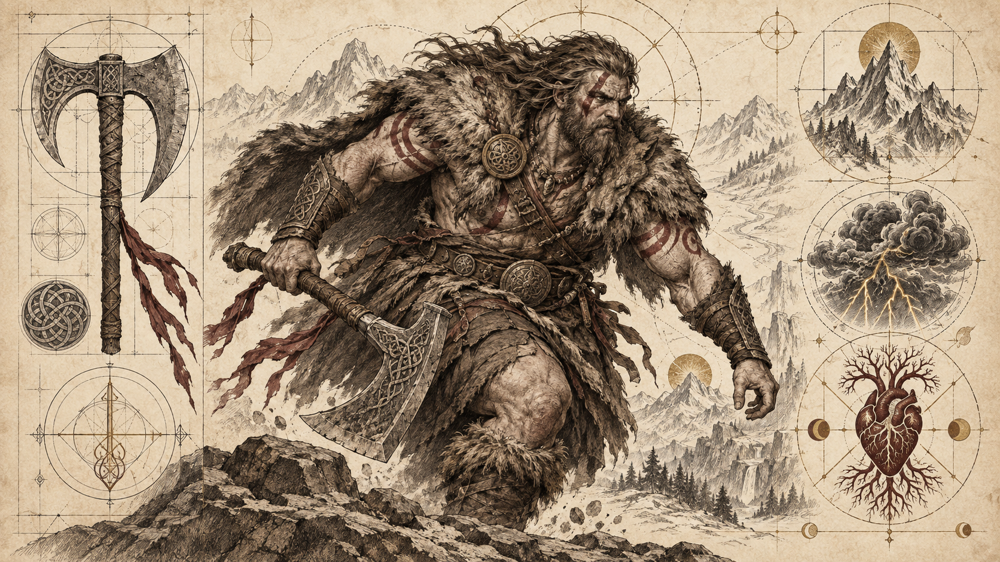
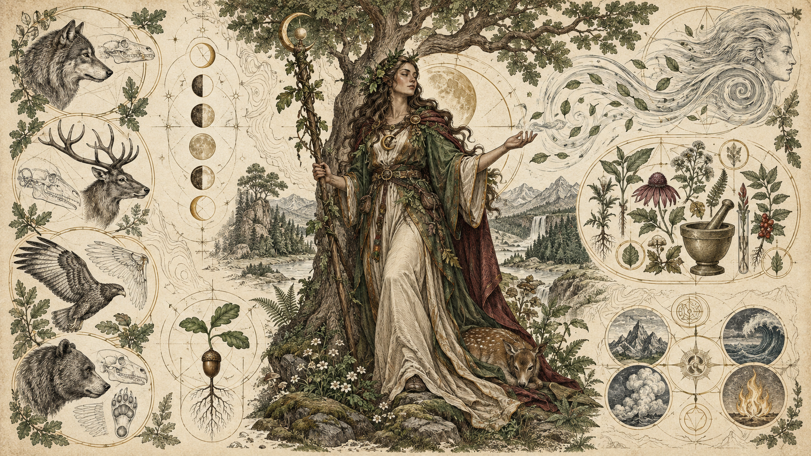
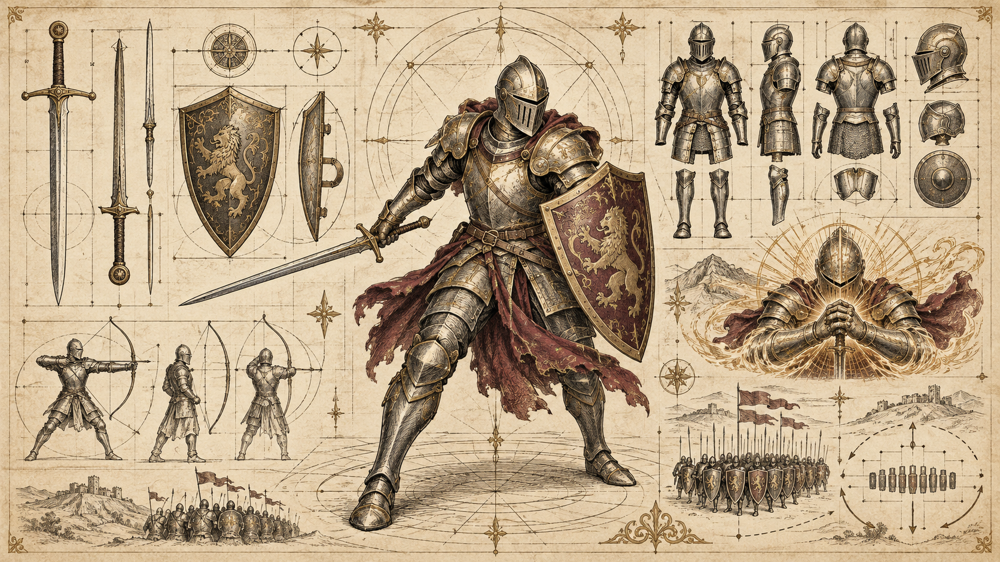
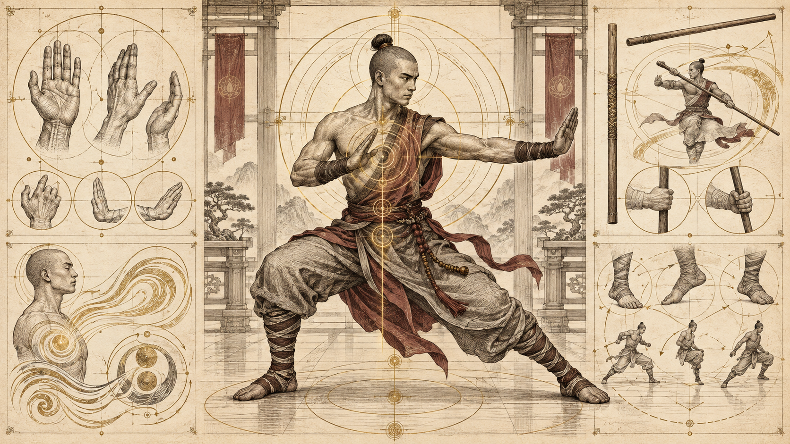
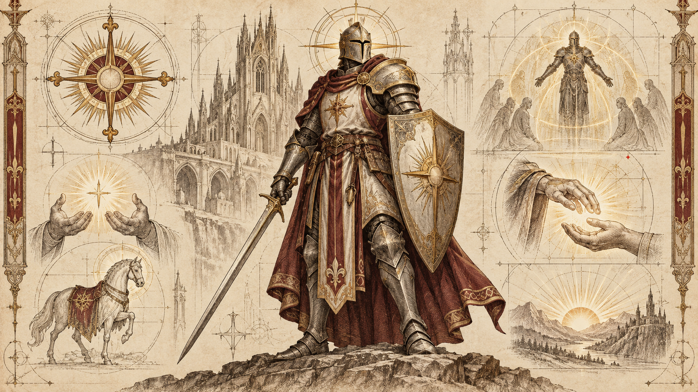
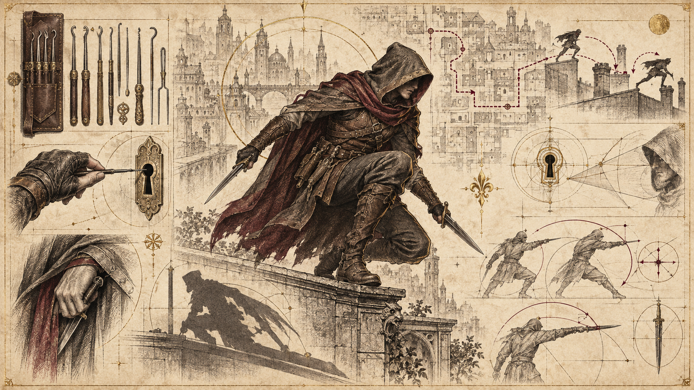
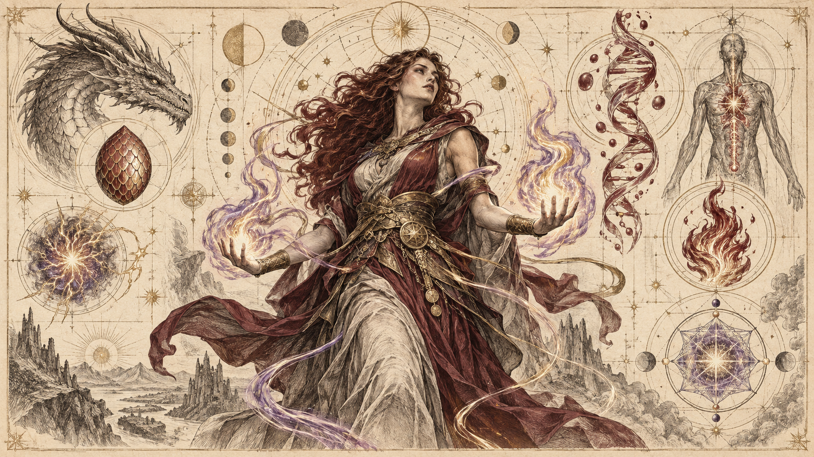
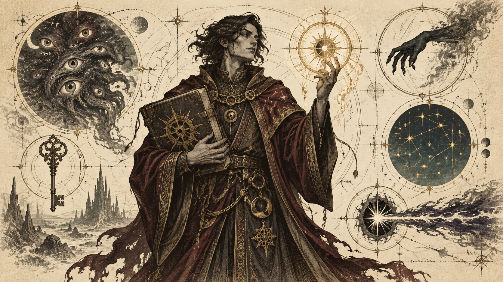

Nguồn: *System Reference Document 5.2.1* (SRD 5.2.1), chương "Classes".

## Man rợ (Barbarian)

**Đặc điểm cốt lõi của Man rợ (Core Barbarian Traits)**

| | |
|---|---|
| Thuộc tính chính | Sức mạnh |
| Xúc xắc sinh lực | d12 mỗi cấp Man rợ |
| Cứu nguy thành thạo | Sức mạnh và Thể chất |
| Kỹ năng thành thạo | Chọn 2: Xử lý động vật, Điền kinh, Uy hiếp, Tự nhiên, Tri giác hoặc Sinh tồn |
| Vũ khí thành thạo | Vũ khí đơn giản và vũ khí võ thuật |
| Huấn luyện giáp | Giáp nhẹ, giáp trung bình và Khiên |
| Trang bị khởi đầu | Chọn A hoặc B: (A) Rìu lớn (Greataxe), 4 Rìu tay (Handaxe), Gói đồ thám hiểm (Explorer's Pack) và 15 gp; hoặc (B) 75 gp |

**Trở thành Man rợ… (Becoming a Barbarian …)**

*Khi là nhân vật cấp 1*
- Nhận mọi đặc điểm trong bảng Đặc điểm cốt lõi của Man rợ.
- Nhận các đặc tính cấp 1 của Man rợ trong bảng Đặc tính Man rợ.

*Khi là nhân vật đa lớp*
- Nhận các đặc điểm sau từ bảng Đặc điểm cốt lõi của Man rợ: xúc xắc sinh lực, thành thạo vũ khí võ thuật và huấn luyện với Khiên.
- Nhận các đặc tính cấp 1 của Man rợ trong bảng Đặc tính Man rợ.

**Đặc tính Man rợ (Barbarian Features)**

| Cấp | Thưởng thành thạo | Đặc tính lớp | Số lần Cuồng nộ | Sát thương Cuồng nộ | Tinh thông vũ khí |
|---|---|---|---|---|---|
| 1 | +2 | Cuồng nộ, Phòng thủ không giáp, Tinh thông vũ khí | 2 | +2 | 2 |
| 2 | +2 | Cảm nhận hiểm nguy, Tấn công liều lĩnh | 2 | +2 | 2 |
| 3 | +2 | Phân lớp Man rợ, Tri thức nguyên thủy | 3 | +2 | 2 |
| 4 | +2 | Tăng điểm thuộc tính | 3 | +2 | 3 |
| 5 | +3 | Tấn công thêm, Di chuyển nhanh | 3 | +2 | 3 |
| 6 | +3 | Đặc tính phân lớp | 4 | +2 | 3 |
| 7 | +3 | Bản năng hoang dã, Vồ theo bản năng | 4 | +2 | 3 |
| 8 | +3 | Tăng điểm thuộc tính | 4 | +2 | 3 |
| 9 | +4 | Đòn tàn bạo | 4 | +3 | 3 |
| 10 | +4 | Đặc tính phân lớp | 4 | +3 | 4 |
| 11 | +4 | Cuồng nộ bất khuất | 4 | +3 | 4 |
| 12 | +4 | Tăng điểm thuộc tính | 5 | +3 | 4 |
| 13 | +5 | Đòn tàn bạo cải tiến | 5 | +3 | 4 |
| 14 | +5 | Đặc tính phân lớp | 5 | +3 | 4 |
| 15 | +5 | Cuồng nộ dai dẳng | 5 | +3 | 4 |
| 16 | +5 | Tăng điểm thuộc tính | 5 | +4 | 4 |
| 17 | +6 | Đòn tàn bạo cải tiến | 6 | +4 | 4 |
| 18 | +6 | Sức mạnh bất khuất | 6 | +4 | 4 |
| 19 | +6 | Ân huệ sử thi | 6 | +4 | 4 |
| 20 | +6 | Nhà vô địch nguyên thủy | 6 | +4 | 4 |

### Đặc tính lớp Man rợ (Barbarian Class Features)

Là Man rợ, bạn nhận các đặc tính lớp sau khi đạt cấp Man rợ tương ứng. Các đặc tính này được liệt kê trong bảng Đặc tính Man rợ.

**Cấp 1: Cuồng nộ (Rage).** Bạn có thể khơi dậy trong mình một sức mạnh nguyên thủy gọi là **Cuồng nộ**, mang lại sức mạnh và sức bền phi thường. Bạn có thể vào trạng thái Cuồng nộ bằng một hành động phụ nếu không mặc giáp nặng.

Bạn có thể Cuồng nộ số lần ghi ở cột Số lần Cuồng nộ ứng với cấp Man rợ của mình. Bạn hồi một lần đã dùng khi hoàn thành nghỉ ngắn, và hồi mọi lần đã dùng khi hoàn thành nghỉ dài.

Khi đang Cuồng nộ, bạn tuân theo các quy tắc sau:

- **Kháng sát thương (Damage Resistance).** Bạn kháng sát thương đập, xuyên và chém.
- **Sát thương Cuồng nộ (Rage Damage).** Khi tấn công bằng Sức mạnh — với vũ khí hoặc đòn đánh không vũ khí — và gây sát thương lên mục tiêu, bạn được cộng thêm sát thương tăng theo cấp Man rợ, như trong cột Sát thương Cuồng nộ.
- **Sức mạnh vượt trội (Strength Advantage).** Bạn có lợi thế khi kiểm tra Sức mạnh và cứu nguy Sức mạnh.
- **Không Tập trung hay thi triển phép (No Concentration or Spells).** Bạn không thể duy trì Tập trung và không thể thi triển phép.
- **Thời lượng (Duration).** Cuồng nộ kéo dài đến hết lượt kế tiếp của bạn và kết thúc sớm nếu bạn mặc giáp nặng hoặc rơi vào trạng thái Mất năng lực hành động. Nếu Cuồng nộ vẫn còn vào lượt kế tiếp, bạn có thể kéo dài thêm một vòng bằng một trong các cách sau:
  - Tung tấn công nhắm vào một kẻ thù.
  - Buộc một kẻ thù thực hiện lần cứu nguy.
  - Dùng hành động phụ để kéo dài Cuồng nộ.

  Mỗi lần được kéo dài, Cuồng nộ kéo dài đến hết lượt kế tiếp của bạn. Bạn có thể duy trì Cuồng nộ tối đa 10 phút.

**Cấp 1: Phòng thủ không giáp (Unarmored Defense).** Khi không mặc giáp, AC cơ bản của bạn bằng 10 cộng hệ số Khéo léo và Thể chất. Bạn vẫn hưởng lợi ích này khi dùng Khiên.

**Cấp 1: Tinh thông vũ khí (Weapon Mastery).** Nhờ rèn luyện, bạn có thể dùng thuộc tính tinh thông của hai loại vũ khí cận chiến đơn giản hoặc võ thuật tùy chọn, chẳng hạn Rìu lớn và Rìu tay. Mỗi khi hoàn thành nghỉ dài, bạn có thể luyện tập và đổi một trong các lựa chọn đó.

Khi đạt một số cấp Man rợ nhất định, bạn có thể dùng thuộc tính tinh thông của thêm nhiều loại vũ khí, như trong cột Tinh thông vũ khí.

**Cấp 2: Cảm nhận hiểm nguy (Danger Sense).** Bạn có giác quan nhạy bén với những điều bất thường, giúp bạn né tránh hiểm nguy. Bạn có lợi thế khi cứu nguy Khéo léo, trừ khi đang ở trạng thái Mất năng lực hành động.

**Cấp 2: Tấn công liều lĩnh (Reckless Attack).** Bạn có thể gạt bỏ mọi lo toan phòng thủ để tấn công dữ dội hơn. Khi tung tấn công lần đầu trong lượt, bạn có thể quyết định tấn công liều lĩnh. Khi đó, bạn có lợi thế với các lần tung tấn công dùng Sức mạnh cho đến đầu lượt kế tiếp, nhưng các lần tung tấn công nhắm vào bạn cũng có lợi thế trong thời gian đó.

**Cấp 3: Phân lớp Man rợ (Barbarian Subclass).** Bạn chọn một phân lớp Man rợ. Phân lớp Con đường Cuồng chiến (Path of the Berserker) được trình bày sau phần mô tả lớp này. Phân lớp là một hướng chuyên sâu mang lại đặc tính ở những cấp Man rợ nhất định. Trong suốt phần còn lại của sự nghiệp, bạn nhận mọi đặc tính phân lớp có cấp bằng hoặc thấp hơn cấp Man rợ của mình.

**Cấp 3: Tri thức nguyên thủy (Primal Knowledge).** Bạn thành thạo thêm một kỹ năng tùy chọn trong danh sách kỹ năng của Man rợ ở cấp 1. Ngoài ra, khi đang Cuồng nộ, bạn có thể dồn sức mạnh nguyên thủy vào một số việc; mỗi khi kiểm tra thuộc tính bằng một trong các kỹ năng sau, bạn có thể thực hiện nó như một phép kiểm tra Sức mạnh dù bình thường nó dùng thuộc tính khác: Nhào lộn, Uy hiếp, Tri giác, Lén lút hoặc Sinh tồn. Khi dùng khả năng này, Sức mạnh của bạn đại diện cho sức mạnh nguyên thủy chảy trong người, mài giũa sự nhanh nhẹn, khí thế và giác quan của bạn.

**Cấp 4: Tăng điểm thuộc tính (Ability Score Improvement).** Bạn nhận kỳ tài Tăng điểm thuộc tính (xem [Kỳ tài](05-Feats.md)) hoặc một kỳ tài khác mà bạn đủ điều kiện. Bạn nhận lại đặc tính này ở cấp Man rợ 8, 12 và 16.

**Cấp 5: Tấn công thêm (Extra Attack).** Bạn có thể tấn công hai lần thay vì một mỗi khi dùng hành động Tấn công trong lượt.

**Cấp 5: Di chuyển nhanh (Fast Movement).** Tốc độ của bạn tăng 3 m (10 feet) khi không mặc giáp nặng.

**Cấp 7: Bản năng hoang dã (Feral Instinct).** Bản năng của bạn sắc bén đến mức bạn có lợi thế khi tung Sáng kiến.

**Cấp 7: Vồ theo bản năng (Instinctive Pounce).** Trong cùng hành động phụ dùng để vào Cuồng nộ, bạn có thể di chuyển tối đa một nửa Tốc độ.

**Cấp 9: Đòn tàn bạo (Brutal Strike).** Nếu dùng Tấn công liều lĩnh, bạn có thể từ bỏ lợi thế ở một lần tung tấn công dựa trên Sức mạnh tùy chọn trong lượt. Lần tung được chọn không được chịu bất lợi. Nếu nó trúng, mục tiêu chịu thêm 1d10 sát thương cùng loại với sát thương của vũ khí hoặc đòn đánh không vũ khí, và bạn có thể gây một hiệu ứng Đòn tàn bạo tùy chọn. Bạn có các lựa chọn sau:

- **Đòn hất văng (Forceful Blow).** Mục tiêu bị đẩy thẳng ra xa bạn 4,5 m (15 feet). Sau đó bạn có thể di chuyển tối đa một nửa Tốc độ thẳng về phía mục tiêu mà không kích hoạt tấn công cơ hội.
- **Đòn cắt gân (Hamstring Blow).** Tốc độ của mục tiêu giảm 4,5 m (15 feet) cho đến đầu lượt kế tiếp của bạn. Mỗi lúc, mục tiêu chỉ chịu ảnh hưởng của một Đòn cắt gân — đòn gần nhất.

**Cấp 11: Cuồng nộ bất khuất (Relentless Rage).** Cơn cuồng nộ giúp bạn tiếp tục chiến đấu dù bị thương nặng. Nếu HP về 0 khi đang Cuồng nộ mà không chết ngay, bạn có thể thực hiện cứu nguy Thể chất DC 10. Nếu thành công, HP của bạn thay vào đó trở thành con số bằng hai lần cấp Man rợ.

Mỗi lần dùng đặc tính này sau lần đầu, DC tăng thêm 5. Khi hoàn thành nghỉ ngắn hoặc nghỉ dài, DC trở về 10.

**Cấp 13: Đòn tàn bạo cải tiến (Improved Brutal Strike).** Bạn đã rèn thêm những cách tấn công hung hãn mới. Các hiệu ứng sau được thêm vào lựa chọn Đòn tàn bạo:

- **Đòn choáng váng (Staggering Blow).** Mục tiêu chịu bất lợi ở lần cứu nguy kế tiếp và không thể thực hiện tấn công cơ hội cho đến đầu lượt kế tiếp của bạn.
- **Đòn phá giáp (Sundering Blow).** Trước đầu lượt kế tiếp của bạn, lần tung tấn công tiếp theo của một sinh vật khác nhắm vào mục tiêu được +5. Mỗi lần tung tấn công chỉ nhận được một điểm cộng Đòn phá giáp.

**Cấp 15: Cuồng nộ dai dẳng (Persistent Rage).** Khi tung Sáng kiến, bạn có thể hồi mọi lần Cuồng nộ đã dùng. Sau khi hồi theo cách này, bạn không thể làm lại cho đến khi hoàn thành nghỉ dài.

Ngoài ra, Cuồng nộ giờ dữ dội đến mức kéo dài 10 phút mà không cần bạn làm gì để duy trì qua từng vòng. Cuồng nộ kết thúc sớm nếu bạn rơi vào trạng thái Bất tỉnh (không chỉ Mất năng lực hành động) hoặc mặc giáp nặng.

**Cấp 17: Đòn tàn bạo cải tiến (Improved Brutal Strike).** Sát thương thêm của Đòn tàn bạo tăng lên 2d10. Ngoài ra, mỗi khi dùng Đòn tàn bạo, bạn có thể áp dụng hai hiệu ứng Đòn tàn bạo khác nhau.

**Cấp 18: Sức mạnh bất khuất (Indomitable Might).** Nếu tổng điểm kiểm tra Sức mạnh hoặc cứu nguy Sức mạnh thấp hơn điểm Sức mạnh, bạn có thể dùng điểm Sức mạnh thay cho tổng đó.

**Cấp 19: Ân huệ sử thi (Epic Boon).** Bạn nhận một kỳ tài Ân huệ sử thi (xem [Kỳ tài](05-Feats.md)) hoặc kỳ tài khác mà bạn đủ điều kiện. Khuyến nghị: Ân huệ Tấn công không thể cản (Boon of Irresistible Offense).

**Cấp 20: Nhà vô địch nguyên thủy (Primal Champion).** Bạn là hiện thân của sức mạnh nguyên thủy. Điểm Sức mạnh và Thể chất của bạn tăng 4, tối đa 25.

### Phân lớp Man rợ: Con đường Cuồng chiến (Barbarian Subclass: Path of the Berserker)

*Biến Cuồng nộ thành cơn thịnh nộ bạo liệt*

Man rợ đi theo Con đường Cuồng chiến dồn Cuồng nộ chủ yếu vào bạo lực. Con đường của họ là cơn thịnh nộ không kiềm chế, và họ say sưa trong hỗn loạn chiến trận khi để Cuồng nộ chiếm lấy và tiếp sức.

**Cấp 3: Điên loạn (Frenzy).** Nếu dùng Tấn công liều lĩnh khi đang Cuồng nộ, bạn gây thêm sát thương lên mục tiêu đầu tiên mà bạn đánh trúng trong lượt bằng đòn tấn công dựa trên Sức mạnh. Để tính sát thương thêm, tung số viên d6 bằng điểm cộng Sát thương Cuồng nộ rồi cộng lại. Sát thương này cùng loại với vũ khí hoặc đòn đánh không vũ khí dùng để tấn công.

**Cấp 6: Cuồng nộ vô tri (Mindless Rage).** Khi đang Cuồng nộ, bạn miễn nhiễm trạng thái Mê hoặc và Hoảng sợ. Nếu đang bị Mê hoặc hoặc Hoảng sợ khi vào Cuồng nộ, trạng thái đó kết thúc.

**Cấp 10: Trả đũa (Retaliation).** Khi chịu sát thương từ một sinh vật trong phạm vi 1,5 m (5 feet), bạn có thể dùng phản ứng để tấn công cận chiến sinh vật đó bằng vũ khí hoặc đòn đánh không vũ khí.

**Cấp 14: Khí thế đáng sợ (Intimidating Presence).** Bằng một hành động phụ, bạn có thể gieo nỗi kinh hoàng bằng khí thế đe dọa và sức mạnh nguyên thủy. Khi đó, mỗi sinh vật tùy chọn trong vùng tỏa 9 m (30 feet) quanh bạn phải cứu nguy Minh triết (DC bằng 8 + hệ số Sức mạnh + thưởng thành thạo của bạn). Nếu thất bại, sinh vật rơi vào trạng thái Hoảng sợ trong 1 phút. Cuối mỗi lượt của mình, sinh vật Hoảng sợ lặp lại lần cứu nguy, kết thúc hiệu ứng lên bản thân nếu thành công.

Sau khi dùng đặc tính này, bạn không thể dùng lại cho đến khi hoàn thành nghỉ dài, trừ khi bạn tiêu một lần Cuồng nộ (không cần hành động) để khôi phục nó.

## Thi sĩ (Bard)

**Đặc điểm cốt lõi của Thi sĩ (Core Bard Traits)**

| | |
|---|---|
| Thuộc tính chính | Sức hút |
| Xúc xắc sinh lực | d8 mỗi cấp Thi sĩ |
| Cứu nguy thành thạo | Khéo léo và Sức hút |
| Kỹ năng thành thạo | Chọn 3 kỹ năng bất kỳ (xem [Chơi trò chơi](01-Playing-the-Game.md)) |
| Vũ khí thành thạo | Vũ khí đơn giản |
| Công cụ thành thạo | Chọn 3 nhạc cụ (xem [Trang bị](06-Equipment.md)) |
| Huấn luyện giáp | Giáp nhẹ |
| Trang bị khởi đầu | Chọn A hoặc B: (A) Giáp da (Leather Armor), 2 Dao găm (Dagger), một nhạc cụ tùy chọn, Gói đồ nghệ sĩ (Entertainer's Pack) và 19 gp; hoặc (B) 90 gp |

**Trở thành Thi sĩ… (Becoming a Bard …)**

*Khi là nhân vật cấp 1*
- Nhận mọi đặc điểm trong bảng Đặc điểm cốt lõi của Thi sĩ.
- Nhận các đặc tính cấp 1 của Thi sĩ trong bảng Đặc tính Thi sĩ.

*Khi là nhân vật đa lớp*
- Nhận các đặc điểm sau từ bảng Đặc điểm cốt lõi của Thi sĩ: xúc xắc sinh lực, thành thạo một kỹ năng tùy chọn, thành thạo một nhạc cụ tùy chọn và huấn luyện giáp nhẹ.
- Nhận các đặc tính cấp 1 của Thi sĩ trong bảng Đặc tính Thi sĩ. Xem luật đa lớp trong [Tạo nhân vật](02-Character-Creation.md) để xác định số ô phép.

**Đặc tính Thi sĩ (Bard Features)**

| Cấp | Thưởng thành thạo | Đặc tính lớp | Xúc xắc thi sĩ | Phép sơ cấp | Phép chuẩn bị | 1 | 2 | 3 | 4 | 5 | 6 | 7 | 8 | 9 |
|---|---|---|---|---|---|---|---|---|---|---|---|---|---|---|
| 1 | +2 | Cảm hứng thi sĩ, Thi triển phép | d6 | 2 | 4 | 2 | — | — | — | — | — | — | — | — |
| 2 | +2 | Chuyên môn, Đa tài | d6 | 2 | 5 | 3 | — | — | — | — | — | — | — | — |
| 3 | +2 | Phân lớp Thi sĩ | d6 | 2 | 6 | 4 | 2 | — | — | — | — | — | — | — |
| 4 | +2 | Tăng điểm thuộc tính | d6 | 3 | 7 | 4 | 3 | — | — | — | — | — | — | — |
| 5 | +3 | Suối nguồn cảm hứng | d8 | 3 | 9 | 4 | 3 | 2 | — | — | — | — | — | — |
| 6 | +3 | Đặc tính phân lớp | d8 | 3 | 10 | 4 | 3 | 3 | — | — | — | — | — | — |
| 7 | +3 | Phản mê hoặc | d8 | 3 | 11 | 4 | 3 | 3 | 1 | — | — | — | — | — |
| 8 | +3 | Tăng điểm thuộc tính | d8 | 3 | 12 | 4 | 3 | 3 | 2 | — | — | — | — | — |
| 9 | +4 | Chuyên môn | d8 | 3 | 14 | 4 | 3 | 3 | 3 | 1 | — | — | — | — |
| 10 | +4 | Bí mật ma thuật | d10 | 4 | 15 | 4 | 3 | 3 | 3 | 2 | — | — | — | — |
| 11 | +4 | — | d10 | 4 | 16 | 4 | 3 | 3 | 3 | 2 | 1 | — | — | — |
| 12 | +4 | Tăng điểm thuộc tính | d10 | 4 | 16 | 4 | 3 | 3 | 3 | 2 | 1 | — | — | — |
| 13 | +5 | — | d10 | 4 | 17 | 4 | 3 | 3 | 3 | 2 | 1 | 1 | — | — |
| 14 | +5 | Đặc tính phân lớp | d10 | 4 | 17 | 4 | 3 | 3 | 3 | 2 | 1 | 1 | — | — |
| 15 | +5 | — | d12 | 4 | 18 | 4 | 3 | 3 | 3 | 2 | 1 | 1 | 1 | — |
| 16 | +5 | Tăng điểm thuộc tính | d12 | 4 | 18 | 4 | 3 | 3 | 3 | 2 | 1 | 1 | 1 | — |
| 17 | +6 | — | d12 | 4 | 19 | 4 | 3 | 3 | 3 | 2 | 1 | 1 | 1 | 1 |
| 18 | +6 | Cảm hứng thượng thừa | d12 | 4 | 20 | 4 | 3 | 3 | 3 | 3 | 1 | 1 | 1 | 1 |
| 19 | +6 | Ân huệ sử thi | d12 | 4 | 21 | 4 | 3 | 3 | 3 | 3 | 2 | 1 | 1 | 1 |
| 20 | +6 | Lời sáng thế | d12 | 4 | 22 | 4 | 3 | 3 | 3 | 3 | 2 | 2 | 1 | 1 |

Các cột 1–9 là số ô phép theo bậc phép.

### Đặc tính lớp Thi sĩ (Bard Class Features)

**Cấp 1: Cảm hứng thi sĩ (Bardic Inspiration).** Bạn có thể truyền cảm hứng siêu nhiên cho người khác bằng lời nói, âm nhạc hoặc cử chỉ. Cảm hứng này thể hiện bằng xúc xắc Cảm hứng thi sĩ, là một d6.

*Dùng Cảm hứng thi sĩ (Using Bardic Inspiration).* Bằng một hành động phụ, bạn có thể truyền cảm hứng cho một sinh vật khác trong phạm vi 18 m (60 feet) nhìn thấy hoặc nghe thấy bạn. Sinh vật đó nhận một xúc xắc Cảm hứng thi sĩ. Mỗi lúc, một sinh vật chỉ giữ được một xúc xắc Cảm hứng thi sĩ.

Một lần trong giờ tiếp theo, khi thất bại một phép thử d20, sinh vật có thể tung xúc xắc Cảm hứng thi sĩ và cộng kết quả vào d20, có thể biến thất bại thành thành công. Xúc xắc Cảm hứng thi sĩ bị tiêu hao khi được tung.

*Số lần sử dụng (Number of Uses).* Bạn có thể trao xúc xắc Cảm hứng thi sĩ số lần bằng hệ số Sức hút (tối thiểu một lần), và hồi mọi lần đã dùng khi hoàn thành nghỉ dài.

*Xúc xắc thi sĩ (Bardic Die).* Xúc xắc Cảm hứng thi sĩ thay đổi khi bạn đạt một số cấp Thi sĩ, như trong cột Xúc xắc thi sĩ: d8 ở cấp 5, d10 ở cấp 10 và d12 ở cấp 15.

**Cấp 1: Thi triển phép (Spellcasting).** Bạn đã học cách thi triển phép qua nghệ thuật của thi sĩ. Xem [Phép thuật](07-Spells.md) để biết luật thi triển phép. Thông tin dưới đây cho biết cách áp dụng luật đó với phép Thi sĩ, nằm trong danh sách phép Thi sĩ ở phần sau.

- **Phép sơ cấp (Cantrips).** Bạn biết hai phép sơ cấp tùy chọn trong danh sách phép Thi sĩ. Khuyến nghị: *Ánh sáng nhảy múa* (Dancing Lights) và *Chế nhạo độc địa* (Vicious Mockery). Mỗi khi lên một cấp Thi sĩ, bạn có thể thay một phép sơ cấp bằng phép sơ cấp khác trong danh sách. Khi đạt cấp Thi sĩ 4 và 10, bạn học thêm một phép sơ cấp tùy chọn trong danh sách, như trong cột Phép sơ cấp.
- **Ô phép (Spell Slots).** Bảng Đặc tính Thi sĩ cho biết số ô phép dùng để thi triển phép bậc 1 trở lên. Bạn hồi mọi ô đã dùng khi hoàn thành nghỉ dài.
- **Phép bậc 1 trở lên đã chuẩn bị (Prepared Spells of Level 1+).** Bạn chuẩn bị danh sách phép bậc 1 trở lên có thể thi triển bằng đặc tính này, chọn từ danh sách phép Thi sĩ. Lúc đầu, chọn bốn phép bậc 1. Khuyến nghị: *Mê hoặc người* (Charm Person), *Chữa vết thương* (Cure Wounds), *Cải dạng bản thân* (Disguise Self) và *Lời chữa lành* (Healing Word).

  Số phép trong danh sách tăng khi bạn lên cấp Thi sĩ, như trong cột Phép chuẩn bị. Mỗi khi con số đó tăng, hãy chọn thêm phép từ danh sách phép Thi sĩ cho đến khi khớp với bảng. Phép được chọn phải có bậc mà bạn có ô phép. Ví dụ, Thi sĩ cấp 3 có thể chuẩn bị sáu phép bậc 1 và 2 theo bất kỳ tổ hợp nào.

  Nếu một đặc tính Thi sĩ khác cho bạn phép luôn được chuẩn bị, các phép đó không tính vào số phép chuẩn bị bằng đặc tính này, nhưng vẫn được xem là phép Thi sĩ của bạn.

  *Thay phép đã chuẩn bị (Changing Your Prepared Spells).* Mỗi khi lên một cấp Thi sĩ, bạn có thể thay một phép trong danh sách bằng một phép Thi sĩ khác có bậc mà bạn có ô phép.

- **Thuộc tính thi triển phép (Spellcasting Ability).** Sức hút là thuộc tính thi triển phép Thi sĩ của bạn.
- **Tiêu điểm thi triển phép (Spellcasting Focus).** Bạn có thể dùng một nhạc cụ làm tiêu điểm thi triển phép Thi sĩ.

**Cấp 2: Chuyên môn (Expertise).** Bạn nhận Chuyên môn (xem [Bảng thuật ngữ luật](08-Rules-Glossary.md)) ở hai kỹ năng thành thạo tùy chọn. Khuyến nghị Biểu diễn và Thuyết phục nếu bạn thành thạo chúng. Ở cấp Thi sĩ 9, bạn nhận Chuyên môn ở hai kỹ năng thành thạo khác.

**Cấp 2: Đa tài (Jack of All Trades).** Bạn có thể cộng một nửa thưởng thành thạo (làm tròn xuống) vào bất kỳ phép kiểm tra thuộc tính nào dùng kỹ năng mà bạn không thành thạo và không được cộng thưởng thành thạo theo cách nào khác. Ví dụ, nếu kiểm tra Sức mạnh (Điền kinh) mà không thành thạo Điền kinh, bạn có thể cộng một nửa thưởng thành thạo.

**Cấp 3: Phân lớp Thi sĩ (Bard Subclass).** Bạn chọn một phân lớp Thi sĩ. Phân lớp Học viện Tri thức (College of Lore) được trình bày sau phần mô tả lớp này. Phân lớp là một hướng chuyên sâu mang lại đặc tính ở những cấp Thi sĩ nhất định. Trong suốt phần còn lại của sự nghiệp, bạn nhận mọi đặc tính phân lớp có cấp bằng hoặc thấp hơn cấp Thi sĩ của mình.

**Cấp 4: Tăng điểm thuộc tính (Ability Score Improvement).** Bạn nhận kỳ tài Tăng điểm thuộc tính (xem [Kỳ tài](05-Feats.md)) hoặc kỳ tài khác mà bạn đủ điều kiện. Bạn nhận lại đặc tính này ở cấp Thi sĩ 8, 12 và 16.

**Cấp 5: Suối nguồn cảm hứng (Font of Inspiration).** Giờ bạn hồi mọi lần dùng Cảm hứng thi sĩ khi hoàn thành nghỉ ngắn hoặc nghỉ dài. Ngoài ra, bạn có thể tiêu một ô phép (không cần hành động) để hồi một lần dùng Cảm hứng thi sĩ.

**Cấp 7: Phản mê hoặc (Countercharm).** Bạn có thể dùng nốt nhạc hoặc lời quyền năng để phá các hiệu ứng tác động lên tâm trí. Nếu bạn hoặc một sinh vật trong phạm vi 9 m (30 feet) thất bại lần cứu nguy chống hiệu ứng gây trạng thái Mê hoặc hoặc Hoảng sợ, bạn có thể dùng phản ứng để lần cứu nguy đó được tung lại, và lần tung mới có lợi thế.

**Cấp 10: Bí mật ma thuật (Magical Secrets).** Bạn đã học được bí mật từ nhiều truyền thống ma thuật. Mỗi khi đạt một cấp Thi sĩ (kể cả cấp này) mà số Phép chuẩn bị trong bảng tăng, bạn có thể chọn phép chuẩn bị mới từ danh sách phép Thi sĩ, Giáo sĩ, Druid và Pháp sư, và các phép đó được xem là phép Thi sĩ của bạn (xem phần của từng lớp để biết danh sách phép). Ngoài ra, mỗi khi thay một phép đã chuẩn bị của lớp này, bạn có thể thay bằng một phép từ các danh sách đó.

**Cấp 18: Cảm hứng thượng thừa (Superior Inspiration).** Khi tung Sáng kiến, nếu còn ít hơn hai lần dùng Cảm hứng thi sĩ, bạn hồi lại cho đến khi có hai lần.

**Cấp 19: Ân huệ sử thi (Epic Boon).** Bạn nhận một kỳ tài Ân huệ sử thi (xem [Kỳ tài](05-Feats.md)) hoặc kỳ tài khác mà bạn đủ điều kiện. Khuyến nghị: Ân huệ Hồi tưởng phép (Boon of Spell Recall).

**Cấp 20: Lời sáng thế (Words of Creation).** Bạn đã thông thạo hai trong các Lời sáng thế: lời của sự sống và cái chết. Vì vậy bạn luôn chuẩn bị sẵn các phép *Quyền ngôn chữa lành* (Power Word Heal) và *Quyền ngôn giết chết* (Power Word Kill). Khi thi triển một trong hai phép, bạn có thể nhắm thêm một sinh vật thứ hai nếu nó ở trong phạm vi 3 m (10 feet) quanh mục tiêu đầu tiên.

### Danh sách phép Thi sĩ (Bard Spell List)

Phần này trình bày danh sách phép Thi sĩ. Các phép được sắp theo bậc phép rồi theo thứ tự chữ cái tên tiếng Anh, kèm trường phái ma thuật. Trong cột Đặc biệt, **C** nghĩa là phép cần Tập trung, **R** nghĩa là phép có thể thi triển như Nghi thức, và **M** nghĩa là phép cần thành phần vật chất cụ thể.

**Phép sơ cấp (phép Thi sĩ bậc 0)**

| Phép | Trường phái | Đặc biệt |
|---|---|---|
| Ánh sáng nhảy múa (Dancing Lights) | Ảo ảnh | C |
| Ánh sáng (Light) | Gọi năng lượng | — |
| Bàn tay pháp sư (Mage Hand) | Triệu hồi | — |
| Sửa chữa (Mending) | Biến đổi | — |
| Tin nhắn (Message) | Biến đổi | — |
| Ảo ảnh nhỏ (Minor Illusion) | Ảo ảnh | — |
| Tiểu xảo ma thuật (Prestidigitation) | Biến đổi | — |
| Đốm sao (Starry Wisp) | Gọi năng lượng | — |
| Đòn chuẩn xác (True Strike) | Tiên tri | — |
| Chế nhạo độc địa (Vicious Mockery) | Yểm thuật | — |

**Phép Thi sĩ bậc 1**

| Phép | Trường phái | Đặc biệt |
|---|---|---|
| Tình bạn muông thú (Animal Friendship) | Yểm thuật | — |
| Suy vận (Bane) | Yểm thuật | C |
| Mê hoặc người (Charm Person) | Yểm thuật | — |
| Tia sáng ngũ sắc (Color Spray) | Ảo ảnh | — |
| Ra lệnh (Command) | Yểm thuật | — |
| Hiểu ngôn ngữ (Comprehend Languages) | Tiên tri | R |
| Chữa vết thương (Cure Wounds) | Phòng hộ | — |
| Phát hiện ma thuật (Detect Magic) | Tiên tri | C, R |
| Cải dạng bản thân (Disguise Self) | Ảo ảnh | — |
| Lời thì thầm bất hòa (Dissonant Whispers) | Yểm thuật | — |
| Lửa yêu tinh (Faerie Fire) | Gọi năng lượng | C |
| Rơi nhẹ như lông (Feather Fall) | Biến đổi | — |
| Lời chữa lành (Healing Word) | Phòng hộ | — |
| Anh hùng khí khái (Heroism) | Yểm thuật | C |
| Tràng cười kinh khủng (Hideous Laughter) | Yểm thuật | C |
| Nhận diện (Identify) | Tiên tri | R, M |
| Chữ viết ảo ảnh (Illusory Script) | Ảo ảnh | R, M |
| Sải bước dài (Longstrider) | Biến đổi | — |
| Hình ảnh im lặng (Silent Image) | Ảo ảnh | C |
| Ngủ (Sleep) | Yểm thuật | C |
| Nói chuyện với muông thú (Speak with Animals) | Tiên tri | R |
| Sóng sấm (Thunderwave) | Gọi năng lượng | — |
| Đầy tớ vô hình (Unseen Servant) | Triệu hồi | R |

**Phép Thi sĩ bậc 2**

| Phép | Trường phái | Đặc biệt |
|---|---|---|
| Tiếp sức (Aid) | Phòng hộ | — |
| Sứ giả muông thú (Animal Messenger) | Yểm thuật | R |
| Mù/Điếc (Blindness/Deafness) | Biến đổi | — |
| Trấn an cảm xúc (Calm Emotions) | Yểm thuật | C |
| Đọc suy nghĩ (Detect Thoughts) | Tiên tri | C |
| Tăng cường năng lực (Enhance Ability) | Biến đổi | C |
| Phóng to/thu nhỏ (Enlarge/Reduce) | Biến đổi | C |
| Mê hoặc đám đông (Enthrall) | Yểm thuật | C |
| Nung kim loại (Heat Metal) | Biến đổi | C |
| Giữ người (Hold Person) | Yểm thuật | C |
| Vô hình (Invisibility) | Ảo ảnh | C |
| Gõ mở (Knock) | Biến đổi | — |
| Phục hồi cơ bản (Lesser Restoration) | Phòng hộ | — |
| Định vị muông thú hoặc thực vật (Locate Animals or Plants) | Tiên tri | R |
| Định vị vật thể (Locate Object) | Tiên tri | C |
| Miệng ma thuật (Magic Mouth) | Ảo ảnh | R, M |
| Hình ảnh phản chiếu (Mirror Image) | Ảo ảnh | — |
| Thấy vô hình (See Invisibility) | Tiên tri | — |
| Phá vỡ (Shatter) | Gọi năng lượng | — |
| Im lặng (Silence) | Ảo ảnh | C, R |
| Gợi ý (Suggestion) | Yểm thuật | C |
| Vùng sự thật (Zone of Truth) | Yểm thuật | — |

**Phép Thi sĩ bậc 3**

| Phép | Trường phái | Đặc biệt |
|---|---|---|
| Giáng lời nguyền (Bestow Curse) | Tử linh | C |
| Thấu thị (Clairvoyance) | Tiên tri | C, M |
| Giải trừ ma thuật (Dispel Magic) | Phòng hộ | — |
| Sợ hãi (Fear) | Ảo ảnh | C |
| Chú văn trấn yểm (Glyph of Warding) | Phòng hộ | M |
| Hoa văn thôi miên (Hypnotic Pattern) | Ảo ảnh | C |
| Ảo ảnh lớn (Major Image) | Ảo ảnh | C |
| Lời chữa lành hàng loạt (Mass Healing Word) | Phòng hộ | — |
| Vô hiệu dò tìm (Nondetection) | Phòng hộ | M |
| Tăng trưởng thực vật (Plant Growth) | Biến đổi | — |
| Gửi tin (Sending) | Tiên tri | — |
| Chậm lại (Slow) | Biến đổi | C |
| Nói với người chết (Speak with Dead) | Tử linh | — |
| Nói chuyện với thực vật (Speak with Plants) | Biến đổi | — |
| Đám mây hôi thối (Stinking Cloud) | Triệu hồi | C |
| Lều nhỏ (Tiny Hut) | Gọi năng lượng | R |
| Ngôn ngữ (Tongues) | Tiên tri | — |

**Phép Thi sĩ bậc 4**

| Phép | Trường phái | Đặc biệt |
|---|---|---|
| Mê hoặc quái vật (Charm Monster) | Yểm thuật | — |
| Cưỡng ép (Compulsion) | Yểm thuật | C |
| Hỗn loạn (Confusion) | Yểm thuật | C |
| Cửa chiều không gian (Dimension Door) | Triệu hồi | — |
| Tự do di chuyển (Freedom of Movement) | Phòng hộ | — |
| Vô hình cao cấp (Greater Invisibility) | Ảo ảnh | C |
| Địa hình ảo ảnh (Hallucinatory Terrain) | Ảo ảnh | — |
| Định vị sinh vật (Locate Creature) | Tiên tri | C |
| Kẻ giết chóc ảo ảnh (Phantasmal Killer) | Ảo ảnh | C |
| Biến hình (Polymorph) | Biến đổi | C |

**Phép Thi sĩ bậc 5**

| Phép | Trường phái | Đặc biệt |
|---|---|---|
| Hoạt hóa đồ vật (Animate Objects) | Biến đổi | C |
| Đánh thức (Awaken) | Biến đổi | M |
| Thống trị người (Dominate Person) | Yểm thuật | C |
| Giấc mơ (Dream) | Ảo ảnh | — |
| Lời nguyền sai khiến (Geas) | Yểm thuật | — |
| Phục hồi cao cấp (Greater Restoration) | Phòng hộ | M |
| Giữ quái vật (Hold Monster) | Yểm thuật | C |
| Truyền thuyết (Legend Lore) | Tiên tri | M |
| Chữa vết thương hàng loạt (Mass Cure Wounds) | Phòng hộ | — |
| Đánh lạc hướng (Mislead) | Ảo ảnh | C |
| Chỉnh sửa ký ức (Modify Memory) | Yểm thuật | C |
| Trói buộc liên cõi (Planar Binding) | Phòng hộ | M |
| Gọi người chết dậy (Raise Dead) | Tử linh | M |
| Do thám (Scrying) | Tiên tri | C, M |
| Giả dạng (Seeming) | Ảo ảnh | — |
| Liên kết thần giao (Telepathic Bond) | Tiên tri | R |
| Vòng dịch chuyển (Teleportation Circle) | Triệu hồi | M |

**Phép Thi sĩ bậc 6**

| Phép | Trường phái | Đặc biệt |
|---|---|---|
| Ánh mắt rắn độc (Eyebite) | Tử linh | C |
| Tìm lối (Find the Path) | Tiên tri | C, M |
| Canh gác và trấn yểm (Guards and Wards) | Phòng hộ | M |
| Yến tiệc anh hùng (Heroes' Feast) | Triệu hồi | M |
| Điệu nhảy không thể cưỡng (Irresistible Dance) | Yểm thuật | C |
| Gợi ý hàng loạt (Mass Suggestion) | Yểm thuật | — |
| Ảo ảnh lập trình (Programmed Illusion) | Ảo ảnh | M |
| Nhìn sự thật (True Seeing) | Tiên tri | M |

**Phép Thi sĩ bậc 7**

| Phép | Trường phái | Đặc biệt |
|---|---|---|
| Kiếm huyền thuật (Arcane Sword) | Gọi năng lượng | C, M |
| Hóa Ethereal (Etherealness) | Triệu hồi | — |
| Lồng lực (Forcecage) | Gọi năng lượng | C, M |
| Dinh thự tráng lệ (Magnificent Mansion) | Triệu hồi | M |
| Ảo cảnh huyền bí (Mirage Arcane) | Ảo ảnh | — |
| Tia ngũ sắc (Prismatic Spray) | Gọi năng lượng | — |
| Phóng chiếu hình ảnh (Project Image) | Ảo ảnh | C, M |
| Tái sinh (Regenerate) | Biến đổi | — |
| Phục sinh (Resurrection) | Tử linh | M |
| Biểu tượng (Symbol) | Phòng hộ | M |
| Dịch chuyển tức thời (Teleport) | Triệu hồi | — |

**Phép Thi sĩ bậc 8**

| Phép | Trường phái | Đặc biệt |
|---|---|---|
| Ác cảm/thiện cảm (Antipathy/Sympathy) | Yểm thuật | — |
| Làm rối trí (Befuddlement) | Yểm thuật | — |
| Thống trị quái vật (Dominate Monster) | Yểm thuật | C |
| Khéo ăn nói (Glibness) | Yểm thuật | — |
| Khiên tâm trí (Mind Blank) | Phòng hộ | — |
| Quyền ngôn làm choáng (Power Word Stun) | Yểm thuật | — |

**Phép Thi sĩ bậc 9**

| Phép | Trường phái | Đặc biệt |
|---|---|---|
| Thấy trước (Foresight) | Tiên tri | — |
| Quyền ngôn chữa lành (Power Word Heal) | Yểm thuật | — |
| Quyền ngôn giết chết (Power Word Kill) | Yểm thuật | — |
| Tường ngũ sắc (Prismatic Wall) | Phòng hộ | — |
| Biến hình toàn vẹn (True Polymorph) | Biến đổi | C |

### Phân lớp Thi sĩ: Học viện Tri thức (Bard Subclass: College of Lore)

*Khám phá tận cùng tri thức ma thuật*

Thi sĩ thuộc Học viện Tri thức thu thập phép và bí mật từ nhiều nguồn, như sách học thuật, nghi lễ huyền bí và truyện dân gian. Thành viên học viện tụ họp ở thư viện và trường đại học để chia sẻ kiến thức. Họ cũng gặp nhau ở lễ hội hay sự kiện triều chính, nơi họ vạch trần tham nhũng, bóc trần dối trá và châm biếm những kẻ quyền thế tự cao tự đại.

**Cấp 3: Thành thạo thưởng (Bonus Proficiencies).** Bạn thành thạo ba kỹ năng tùy chọn.

**Cấp 3: Lời châm chọc (Cutting Words).** Bạn học cách dùng sự dí dỏm để làm người khác phân tâm, bối rối và mất tự tin bằng sức mạnh siêu nhiên. Khi một sinh vật mà bạn nhìn thấy trong phạm vi 18 m (60 feet) tung sát thương hoặc thành công một phép kiểm tra thuộc tính hay lần tung tấn công, bạn có thể dùng phản ứng để tiêu một lần Cảm hứng thi sĩ; tung xúc xắc Cảm hứng thi sĩ và trừ kết quả khỏi lần tung của sinh vật đó, làm giảm sát thương hoặc có thể biến thành công thành thất bại.

**Cấp 6: Khám phá ma thuật (Magical Discoveries).** Bạn học hai phép tùy chọn. Các phép này có thể lấy từ danh sách phép Giáo sĩ, Druid hoặc Pháp sư, hay kết hợp bất kỳ (xem phần của từng lớp để biết danh sách phép). Mỗi phép được chọn phải là phép sơ cấp hoặc phép có bậc mà bạn có ô phép, như trong bảng Đặc tính Thi sĩ.

Bạn luôn chuẩn bị sẵn các phép đã chọn, và mỗi khi lên một cấp Thi sĩ, bạn có thể thay một phép bằng phép khác đáp ứng các yêu cầu này.

**Cấp 14: Kỹ năng vô song (Peerless Skill).** Khi kiểm tra thuộc tính hoặc tung tấn công và thất bại, bạn có thể tiêu một lần Cảm hứng thi sĩ; tung xúc xắc Cảm hứng thi sĩ và cộng kết quả vào d20, có thể biến thất bại thành thành công. Nếu vẫn thất bại, lần Cảm hứng thi sĩ đó không bị tiêu hao.

## Giáo sĩ (Cleric)

**Đặc điểm cốt lõi của Giáo sĩ (Core Cleric Traits)**

| | |
|---|---|
| Thuộc tính chính | Minh triết |
| Xúc xắc sinh lực | d8 mỗi cấp Giáo sĩ |
| Cứu nguy thành thạo | Minh triết và Sức hút |
| Kỹ năng thành thạo | Chọn 2: Lịch sử, Thấu hiểu, Y học, Thuyết phục hoặc Tôn giáo |
| Vũ khí thành thạo | Vũ khí đơn giản |
| Huấn luyện giáp | Giáp nhẹ, giáp trung bình và Khiên |
| Trang bị khởi đầu | Chọn A hoặc B: (A) Áo xích (Chain Shirt), Khiên (Shield), Chùy đầu kim loại (Mace), Biểu tượng thánh (Holy Symbol), Gói đồ tu sĩ (Priest's Pack) và 7 gp; hoặc (B) 110 gp |

**Trở thành Giáo sĩ… (Becoming a Cleric …)**

*Khi là nhân vật cấp 1*
- Nhận mọi đặc điểm trong bảng Đặc điểm cốt lõi của Giáo sĩ.
- Nhận các đặc tính cấp 1 của Giáo sĩ trong bảng Đặc tính Giáo sĩ.

*Khi là nhân vật đa lớp*
- Nhận các đặc điểm sau từ bảng Đặc điểm cốt lõi của Giáo sĩ: xúc xắc sinh lực và huấn luyện với giáp nhẹ, giáp trung bình và Khiên.
- Nhận các đặc tính cấp 1 của Giáo sĩ trong bảng Đặc tính Giáo sĩ. Xem luật đa lớp trong [Tạo nhân vật](02-Character-Creation.md) để xác định số ô phép.

**Đặc tính Giáo sĩ (Cleric Features)**

| Cấp | Thưởng thành thạo | Đặc tính lớp | Dẫn truyền thần lực | Phép sơ cấp | Phép chuẩn bị | 1 | 2 | 3 | 4 | 5 | 6 | 7 | 8 | 9 |
|---|---|---|---|---|---|---|---|---|---|---|---|---|---|---|
| 1 | +2 | Thi triển phép, Thiên chức | — | 3 | 4 | 2 | — | — | — | — | — | — | — | — |
| 2 | +2 | Dẫn truyền thần lực | 2 | 3 | 5 | 3 | — | — | — | — | — | — | — | — |
| 3 | +2 | Phân lớp Giáo sĩ | 2 | 3 | 6 | 4 | 2 | — | — | — | — | — | — | — |
| 4 | +2 | Tăng điểm thuộc tính | 2 | 4 | 7 | 4 | 3 | — | — | — | — | — | — | — |
| 5 | +3 | Thiêu đốt xác sống | 2 | 4 | 9 | 4 | 3 | 2 | — | — | — | — | — | — |
| 6 | +3 | Đặc tính phân lớp | 3 | 4 | 10 | 4 | 3 | 3 | — | — | — | — | — | — |
| 7 | +3 | Đòn ban phước | 3 | 4 | 11 | 4 | 3 | 3 | 1 | — | — | — | — | — |
| 8 | +3 | Tăng điểm thuộc tính | 3 | 4 | 12 | 4 | 3 | 3 | 2 | — | — | — | — | — |
| 9 | +4 | — | 3 | 4 | 14 | 4 | 3 | 3 | 3 | 1 | — | — | — | — |
| 10 | +4 | Can thiệp thần thánh | 3 | 5 | 15 | 4 | 3 | 3 | 3 | 2 | — | — | — | — |
| 11 | +4 | — | 3 | 5 | 16 | 4 | 3 | 3 | 3 | 2 | 1 | — | — | — |
| 12 | +4 | Tăng điểm thuộc tính | 3 | 5 | 16 | 4 | 3 | 3 | 3 | 2 | 1 | — | — | — |
| 13 | +5 | — | 3 | 5 | 17 | 4 | 3 | 3 | 3 | 2 | 1 | 1 | — | — |
| 14 | +5 | Đòn ban phước cải tiến | 3 | 5 | 17 | 4 | 3 | 3 | 3 | 2 | 1 | 1 | — | — |
| 15 | +5 | — | 3 | 5 | 18 | 4 | 3 | 3 | 3 | 2 | 1 | 1 | 1 | — |
| 16 | +5 | Tăng điểm thuộc tính | 3 | 5 | 18 | 4 | 3 | 3 | 3 | 2 | 1 | 1 | 1 | — |
| 17 | +6 | Đặc tính phân lớp | 3 | 5 | 19 | 4 | 3 | 3 | 3 | 2 | 1 | 1 | 1 | 1 |
| 18 | +6 | — | 4 | 5 | 20 | 4 | 3 | 3 | 3 | 3 | 1 | 1 | 1 | 1 |
| 19 | +6 | Ân huệ sử thi | 4 | 5 | 21 | 4 | 3 | 3 | 3 | 3 | 2 | 1 | 1 | 1 |
| 20 | +6 | Can thiệp thần thánh vĩ đại | 4 | 5 | 22 | 4 | 3 | 3 | 3 | 3 | 2 | 2 | 1 | 1 |

Các cột 1–9 là số ô phép theo bậc phép.

### Đặc tính lớp Giáo sĩ (Cleric Class Features)

**Cấp 1: Thi triển phép (Spellcasting).** Bạn đã học cách thi triển phép qua cầu nguyện và thiền định. Xem [Phép thuật](07-Spells.md) để biết luật thi triển phép. Thông tin dưới đây cho biết cách áp dụng luật đó với phép Giáo sĩ, nằm trong danh sách phép Giáo sĩ ở phần sau.

- **Phép sơ cấp (Cantrips).** Bạn biết ba phép sơ cấp tùy chọn trong danh sách phép Giáo sĩ. Khuyến nghị: *Chỉ dẫn* (Guidance), *Lửa thiêng* (Sacred Flame) và *Hiển phép* (Thaumaturgy). Mỗi khi lên một cấp Giáo sĩ, bạn có thể thay một phép sơ cấp bằng phép sơ cấp khác trong danh sách. Khi đạt cấp Giáo sĩ 4 và 10, bạn học thêm một phép sơ cấp tùy chọn, như trong cột Phép sơ cấp.
- **Ô phép (Spell Slots).** Bảng Đặc tính Giáo sĩ cho biết số ô phép dùng để thi triển phép bậc 1 trở lên. Bạn hồi mọi ô đã dùng khi hoàn thành nghỉ dài.
- **Phép bậc 1 trở lên đã chuẩn bị (Prepared Spells of Level 1+).** Bạn chuẩn bị danh sách phép bậc 1 trở lên có thể thi triển bằng đặc tính này, chọn từ danh sách phép Giáo sĩ. Lúc đầu, chọn bốn phép bậc 1. Khuyến nghị: *Ban phước* (Bless), *Chữa vết thương* (Cure Wounds), *Tia dẫn đường* (Guiding Bolt) và *Khiên đức tin* (Shield of Faith).

  Số phép trong danh sách tăng khi bạn lên cấp Giáo sĩ, như trong cột Phép chuẩn bị. Mỗi khi con số đó tăng, hãy chọn thêm phép từ danh sách phép Giáo sĩ cho đến khi khớp với bảng. Phép được chọn phải có bậc mà bạn có ô phép. Ví dụ, Giáo sĩ cấp 3 có thể chuẩn bị sáu phép bậc 1 và 2 theo bất kỳ tổ hợp nào.

  Nếu một đặc tính Giáo sĩ khác cho bạn phép luôn được chuẩn bị, các phép đó không tính vào số phép chuẩn bị bằng đặc tính này, nhưng vẫn được xem là phép Giáo sĩ của bạn.

  *Thay phép đã chuẩn bị (Changing Your Prepared Spells).* Mỗi khi hoàn thành nghỉ dài, bạn có thể thay đổi danh sách phép đã chuẩn bị, thay bất kỳ phép nào bằng một phép Giáo sĩ khác có bậc mà bạn có ô phép.

- **Thuộc tính thi triển phép (Spellcasting Ability).** Minh triết là thuộc tính thi triển phép Giáo sĩ của bạn.
- **Tiêu điểm thi triển phép (Spellcasting Focus).** Bạn có thể dùng Biểu tượng thánh làm tiêu điểm thi triển phép Giáo sĩ.

**Cấp 1: Thiên chức (Divine Order).** Bạn đã hiến mình cho một trong các vai trò thiêng liêng sau:

- **Người bảo hộ (Protector).** Được rèn luyện cho chiến trận, bạn thành thạo vũ khí võ thuật và được huấn luyện giáp nặng.
- **Người hiển phép (Thaumaturge).** Bạn biết thêm một phép sơ cấp từ danh sách phép Giáo sĩ. Ngoài ra, mối liên kết huyền bí với thần linh cho bạn điểm cộng khi kiểm tra Trí tuệ (Huyền thuật hoặc Tôn giáo). Điểm cộng bằng hệ số Minh triết (tối thiểu +1).

**Cấp 2: Dẫn truyền thần lực (Channel Divinity).** Bạn có thể dẫn năng lượng thần thánh trực tiếp từ các Cõi Ngoài (Outer Planes) để tạo hiệu ứng ma thuật. Bạn bắt đầu với hai hiệu ứng: Tia lửa thần thánh và Xua đuổi xác sống, mô tả dưới đây. Mỗi lần dùng Dẫn truyền thần lực của lớp này, hãy chọn hiệu ứng Dẫn truyền thần lực nào của lớp để tạo ra. Bạn có thêm lựa chọn hiệu ứng ở các cấp Giáo sĩ cao hơn.

Bạn có thể dùng Dẫn truyền thần lực của lớp này hai lần. Bạn hồi một lần đã dùng khi hoàn thành nghỉ ngắn, và hồi mọi lần khi hoàn thành nghỉ dài. Bạn có thêm lần dùng ở một số cấp Giáo sĩ, như trong cột Dẫn truyền thần lực.

Nếu hiệu ứng Dẫn truyền thần lực đòi hỏi cứu nguy, DC bằng DC cứu nguy phép từ đặc tính Thi triển phép của lớp này.

- **Tia lửa thần thánh (Divine Spark).** Bằng hành động Ma thuật, bạn hướng Biểu tượng thánh về một sinh vật khác mà bạn nhìn thấy trong phạm vi 9 m (30 feet) và dồn năng lượng thần thánh vào nó. Tung 1d8 và cộng hệ số Minh triết. Bạn hoặc hồi cho sinh vật số HP bằng tổng đó, hoặc buộc nó cứu nguy Thể chất. Nếu thất bại, sinh vật chịu sát thương hoại tử hoặc quang (tùy bạn chọn) bằng tổng đó. Nếu thành công, nó chịu một nửa (làm tròn xuống).

  Bạn tung thêm một d8 khi đạt cấp Giáo sĩ 7 (2d8), 13 (3d8) và 18 (4d8).

- **Xua đuổi xác sống (Turn Undead).** Bằng hành động Ma thuật, bạn giơ Biểu tượng thánh và quở trách xác sống. Mỗi Xác sống tùy chọn trong phạm vi 9 m (30 feet) phải cứu nguy Minh triết. Nếu thất bại, nó rơi vào trạng thái Hoảng sợ và Mất năng lực hành động trong 1 phút. Trong thời gian đó, nó cố di chuyển xa bạn nhất có thể trong lượt của mình. Hiệu ứng kết thúc sớm với sinh vật đó nếu nó chịu bất kỳ sát thương nào, nếu bạn rơi vào trạng thái Mất năng lực hành động, hoặc nếu bạn chết.

**Cấp 3: Phân lớp Giáo sĩ (Cleric Subclass).** Bạn chọn một phân lớp Giáo sĩ. Phân lớp Lãnh địa Sự sống (Life Domain) được trình bày sau phần mô tả lớp này. Phân lớp là một hướng chuyên sâu mang lại đặc tính ở những cấp Giáo sĩ nhất định. Trong suốt phần còn lại của sự nghiệp, bạn nhận mọi đặc tính phân lớp có cấp bằng hoặc thấp hơn cấp Giáo sĩ của mình.

**Cấp 4: Tăng điểm thuộc tính (Ability Score Improvement).** Bạn nhận kỳ tài Tăng điểm thuộc tính (xem [Kỳ tài](05-Feats.md)) hoặc kỳ tài khác mà bạn đủ điều kiện. Bạn nhận lại đặc tính này ở cấp Giáo sĩ 8, 12 và 16.

**Cấp 5: Thiêu đốt xác sống (Sear Undead).** Mỗi khi dùng Xua đuổi xác sống, bạn có thể tung số d8 bằng hệ số Minh triết (tối thiểu 1d8) rồi cộng lại. Mỗi Xác sống thất bại lần cứu nguy chống lần Xua đuổi xác sống đó chịu sát thương quang bằng tổng này. Sát thương này không chấm dứt hiệu ứng xua đuổi.

**Cấp 7: Đòn ban phước (Blessed Strikes).** Sức mạnh thần thánh tràn vào bạn trong chiến trận. Bạn nhận một trong các lựa chọn sau (nếu bạn đã có cả hai lựa chọn từ một phân lớp Giáo sĩ trong sách cũ, chỉ dùng lựa chọn bạn chọn cho đặc tính này).

- **Đòn thần thánh (Divine Strike).** Một lần trong mỗi lượt của bạn, khi đánh trúng một sinh vật bằng lần tung tấn công dùng vũ khí, bạn có thể khiến mục tiêu chịu thêm 1d8 sát thương hoại tử hoặc quang (tùy bạn chọn).
- **Phép uy lực (Potent Spellcasting).** Cộng hệ số Minh triết vào sát thương gây ra bằng bất kỳ phép sơ cấp Giáo sĩ nào.

**Cấp 10: Can thiệp thần thánh (Divine Intervention).** Bạn có thể khẩn cầu thần linh can thiệp giúp mình. Bằng hành động Ma thuật, hãy chọn một phép Giáo sĩ bậc 5 trở xuống không cần phản ứng để thi triển. Trong cùng hành động đó, bạn thi triển phép mà không tiêu ô phép hay cần thành phần vật chất. Bạn không thể dùng lại đặc tính này cho đến khi hoàn thành nghỉ dài.

**Cấp 14: Đòn ban phước cải tiến (Improved Blessed Strikes).** Lựa chọn Đòn thần thánh hoặc Phép uy lực của Đòn ban phước trở nên mạnh hơn.

- **Đòn thần thánh (Divine Strike).** Sát thương thêm của Đòn thần thánh tăng lên 2d8.
- **Phép uy lực (Potent Spellcasting).** Khi thi triển phép sơ cấp Giáo sĩ và gây sát thương lên một sinh vật, bạn có thể truyền sinh lực cho bản thân hoặc một sinh vật khác trong phạm vi 18 m (60 feet), cho số điểm sinh lực tạm thời bằng hai lần hệ số Minh triết.

**Cấp 19: Ân huệ sử thi (Epic Boon).** Bạn nhận một kỳ tài Ân huệ sử thi (xem [Kỳ tài](05-Feats.md)) hoặc kỳ tài khác mà bạn đủ điều kiện. Khuyến nghị: Ân huệ Định mệnh (Boon of Fate).

**Cấp 20: Can thiệp thần thánh vĩ đại (Greater Divine Intervention).** Bạn có thể khẩn cầu sự can thiệp thần thánh còn mạnh mẽ hơn. Khi dùng Can thiệp thần thánh, bạn có thể chọn bất kỳ phép nào. Nếu làm vậy, bạn không thể dùng lại Can thiệp thần thánh cho đến khi hoàn thành 2d4 lần nghỉ dài.

### Danh sách phép Giáo sĩ (Cleric Spell List)

**Phép sơ cấp (phép Giáo sĩ bậc 0)**

| Phép | Trường phái | Đặc biệt |
|---|---|---|
| Chỉ dẫn (Guidance) | Tiên tri | C |
| Ánh sáng (Light) | Gọi năng lượng | — |
| Sửa chữa (Mending) | Biến đổi | — |
| Chống chịu (Resistance) | Phòng hộ | C |
| Lửa thiêng (Sacred Flame) | Gọi năng lượng | — |
| Cứu người hấp hối (Spare the Dying) | Tử linh | — |
| Hiển phép (Thaumaturgy) | Biến đổi | — |

**Phép Giáo sĩ bậc 1**

| Phép | Trường phái | Đặc biệt |
|---|---|---|
| Suy vận (Bane) | Yểm thuật | C |
| Ban phước (Bless) | Yểm thuật | C, M |
| Ra lệnh (Command) | Yểm thuật | — |
| Tạo hoặc hủy nước (Create or Destroy Water) | Biến đổi | — |
| Chữa vết thương (Cure Wounds) | Phòng hộ | — |
| Phát hiện thiện ác (Detect Evil and Good) | Tiên tri | C |
| Phát hiện ma thuật (Detect Magic) | Tiên tri | C, R |
| Phát hiện độc và bệnh (Detect Poison and Disease) | Tiên tri | C, R |
| Tia dẫn đường (Guiding Bolt) | Gọi năng lượng | — |
| Lời chữa lành (Healing Word) | Phòng hộ | — |
| Gây vết thương (Inflict Wounds) | Tử linh | — |
| Chống thiện ác (Protection from Evil and Good) | Phòng hộ | C, M |
| Thanh lọc thức ăn và nước uống (Purify Food and Drink) | Biến đổi | R |
| Nơi trú an toàn (Sanctuary) | Phòng hộ | — |
| Khiên đức tin (Shield of Faith) | Phòng hộ | C |

**Phép Giáo sĩ bậc 2**

| Phép | Trường phái | Đặc biệt |
|---|---|---|
| Tiếp sức (Aid) | Phòng hộ | — |
| Bói điềm (Augury) | Tiên tri | R, M |
| Mù/Điếc (Blindness/Deafness) | Biến đổi | — |
| Trấn an cảm xúc (Calm Emotions) | Yểm thuật | C |
| Ngọn lửa vĩnh cửu (Continual Flame) | Gọi năng lượng | M |
| Tăng cường năng lực (Enhance Ability) | Biến đổi | C |
| Tìm bẫy (Find Traps) | Tiên tri | — |
| Bảo quản xác (Gentle Repose) | Tử linh | R, M |
| Giữ người (Hold Person) | Yểm thuật | C |
| Phục hồi cơ bản (Lesser Restoration) | Phòng hộ | — |
| Định vị vật thể (Locate Object) | Tiên tri | C |
| Lời cầu chữa lành (Prayer of Healing) | Phòng hộ | — |
| Chống độc (Protection from Poison) | Phòng hộ | — |
| Im lặng (Silence) | Ảo ảnh | C, R |
| Vũ khí linh thể (Spiritual Weapon) | Gọi năng lượng | C |
| Liên kết bảo hộ (Warding Bond) | Phòng hộ | M |
| Vùng sự thật (Zone of Truth) | Yểm thuật | — |

**Phép Giáo sĩ bậc 3**

| Phép | Trường phái | Đặc biệt |
|---|---|---|
| Hoạt hóa xác chết (Animate Dead) | Tử linh | — |
| Ngọn đèn hy vọng (Beacon of Hope) | Phòng hộ | C |
| Giáng lời nguyền (Bestow Curse) | Tử linh | C |
| Thấu thị (Clairvoyance) | Tiên tri | C, M |
| Tạo thức ăn và nước uống (Create Food and Water) | Triệu hồi | — |
| Ánh sáng ban ngày (Daylight) | Gọi năng lượng | — |
| Giải trừ ma thuật (Dispel Magic) | Phòng hộ | — |
| Chú văn trấn yểm (Glyph of Warding) | Phòng hộ | M |
| Vòng tròn ma thuật (Magic Circle) | Phòng hộ | M |
| Lời chữa lành hàng loạt (Mass Healing Word) | Phòng hộ | — |
| Hòa vào đá (Meld into Stone) | Biến đổi | R |
| Bảo vệ khỏi năng lượng (Protection from Energy) | Phòng hộ | C |
| Gỡ lời nguyền (Remove Curse) | Phòng hộ | — |
| Hồi sinh tức thời (Revivify) | Tử linh | M |
| Gửi tin (Sending) | Tiên tri | — |
| Nói với người chết (Speak with Dead) | Tử linh | — |
| Linh thể hộ vệ (Spirit Guardians) | Triệu hồi | C |
| Ngôn ngữ (Tongues) | Tiên tri | — |
| Đi trên nước (Water Walk) | Biến đổi | R |

**Phép Giáo sĩ bậc 4**

| Phép | Trường phái | Đặc biệt |
|---|---|---|
| Hào quang sự sống (Aura of Life) | Phòng hộ | C |
| Trục xuất (Banishment) | Phòng hộ | C |
| Điều khiển nước (Control Water) | Biến đổi | C |
| Bảo hộ khỏi chết (Death Ward) | Phòng hộ | — |
| Thần đoán (Divination) | Tiên tri | R, M |
| Tự do di chuyển (Freedom of Movement) | Phòng hộ | — |
| Hộ vệ đức tin (Guardian of Faith) | Triệu hồi | — |
| Định vị sinh vật (Locate Creature) | Tiên tri | C |
| Định hình đá (Stone Shape) | Biến đổi | — |

**Phép Giáo sĩ bậc 5**

| Phép | Trường phái | Đặc biệt |
|---|---|---|
| Thỉnh ý thần (Commune) | Tiên tri | R |
| Bệnh dịch (Contagion) | Tử linh | — |
| Xua đuổi thiện ác (Dispel Evil and Good) | Phòng hộ | C |
| Lửa thần giáng (Flame Strike) | Gọi năng lượng | — |
| Lời nguyền sai khiến (Geas) | Yểm thuật | — |
| Phục hồi cao cấp (Greater Restoration) | Phòng hộ | M |
| Thánh hóa (Hallow) | Phòng hộ | M |
| Ôn dịch côn trùng (Insect Plague) | Triệu hồi | C |
| Truyền thuyết (Legend Lore) | Tiên tri | M |
| Chữa vết thương hàng loạt (Mass Cure Wounds) | Phòng hộ | — |
| Trói buộc liên cõi (Planar Binding) | Phòng hộ | M |
| Gọi người chết dậy (Raise Dead) | Tử linh | M |
| Do thám (Scrying) | Tiên tri | C, M |

**Phép Giáo sĩ bậc 6**

| Phép | Trường phái | Đặc biệt |
|---|---|---|
| Rào lưỡi kiếm (Blade Barrier) | Gọi năng lượng | C |
| Tạo xác sống (Create Undead) | Tử linh | M |
| Tìm lối (Find the Path) | Tiên tri | C, M |
| Cấm địa (Forbiddance) | Phòng hộ | R, M |
| Gây hại (Harm) | Tử linh | — |
| Chữa lành (Heal) | Phòng hộ | — |
| Yến tiệc anh hùng (Heroes' Feast) | Triệu hồi | M |
| Đồng minh liên cõi (Planar Ally) | Triệu hồi | — |
| Tia nắng (Sunbeam) | Gọi năng lượng | C |
| Nhìn sự thật (True Seeing) | Tiên tri | M |
| Lời triệu hồi (Word of Recall) | Triệu hồi | — |

**Phép Giáo sĩ bậc 7**

| Phép | Trường phái | Đặc biệt |
|---|---|---|
| Triệu hồi thiên thần (Conjure Celestial) | Triệu hồi | C |
| Lời nói thần thánh (Divine Word) | Gọi năng lượng | — |
| Hóa Ethereal (Etherealness) | Triệu hồi | — |
| Bão lửa (Fire Storm) | Gọi năng lượng | — |
| Dịch chuyển liên cõi (Plane Shift) | Triệu hồi | M |
| Tái sinh (Regenerate) | Biến đổi | — |
| Phục sinh (Resurrection) | Tử linh | M |
| Biểu tượng (Symbol) | Phòng hộ | M |

**Phép Giáo sĩ bậc 8**

| Phép | Trường phái | Đặc biệt |
|---|---|---|
| Trường phản ma thuật (Antimagic Field) | Phòng hộ | C |
| Điều khiển thời tiết (Control Weather) | Biến đổi | C |
| Động đất (Earthquake) | Biến đổi | C |
| Hào quang thánh (Holy Aura) | Phòng hộ | C, M |
| Bùng sáng mặt trời (Sunburst) | Gọi năng lượng | — |

**Phép Giáo sĩ bậc 9**

| Phép | Trường phái | Đặc biệt |
|---|---|---|
| Xuất hồn Astral (Astral Projection) | Tử linh | M |
| Cổng cõi (Gate) | Triệu hồi | C, M |
| Chữa lành hàng loạt (Mass Heal) | Phòng hộ | — |
| Quyền ngôn chữa lành (Power Word Heal) | Yểm thuật | — |
| Phục sinh đích thực (True Resurrection) | Tử linh | M |

### Phân lớp Giáo sĩ: Lãnh địa Sự sống (Cleric Subclass: Life Domain)

*Xoa dịu nỗi đau của thế gian*

Lãnh địa Sự sống tập trung vào năng lượng tích cực duy trì mọi sự sống trong đa vũ trụ. Giáo sĩ theo lãnh địa này là bậc thầy chữa lành, dùng sinh lực đó để hàn gắn vô số vết thương.

Chính sự tồn tại dựa vào năng lượng tích cực gắn với lãnh địa này, nên Giáo sĩ thuộc gần như bất kỳ truyền thống tôn giáo nào cũng có thể chọn nó. Lãnh địa này đặc biệt gắn với thần nông nghiệp, thần chữa lành hay sức bền, và thần gia đình, cộng đồng. Các dòng tu chữa bệnh cũng tìm đến ma thuật của lãnh địa này.

**Cấp 3: Môn đồ sự sống (Disciple of Life).** Khi một phép bạn thi triển bằng ô phép hồi HP cho một sinh vật, sinh vật đó hồi thêm HP trong lượt bạn thi triển. Số HP thêm bằng 2 cộng bậc của ô phép.

**Cấp 3: Phép Lãnh địa Sự sống (Life Domain Spells).** Mối liên kết với lãnh địa thiêng liêng này bảo đảm bạn luôn có sẵn một số phép. Khi đạt cấp Giáo sĩ ghi trong bảng Phép Lãnh địa Sự sống, từ đó bạn luôn chuẩn bị sẵn các phép được liệt kê.

**Phép Lãnh địa Sự sống (Life Domain Spells)**

| Cấp Giáo sĩ | Phép chuẩn bị |
|---|---|
| 3 | *Tiếp sức* (Aid), *Ban phước* (Bless), *Chữa vết thương* (Cure Wounds), *Phục hồi cơ bản* (Lesser Restoration) |
| 5 | *Lời chữa lành hàng loạt* (Mass Healing Word), *Hồi sinh tức thời* (Revivify) |
| 7 | *Hào quang sự sống* (Aura of Life), *Bảo hộ khỏi chết* (Death Ward) |
| 9 | *Phục hồi cao cấp* (Greater Restoration), *Chữa vết thương hàng loạt* (Mass Cure Wounds) |

**Cấp 3: Bảo toàn sự sống (Preserve Life).** Bằng hành động Ma thuật, bạn giơ Biểu tượng thánh và tiêu một lần Dẫn truyền thần lực để khơi dậy năng lượng chữa lành có thể hồi số HP bằng năm lần cấp Giáo sĩ. Chọn các sinh vật đang Đẫm máu trong phạm vi 9 m (30 feet) (có thể gồm cả bạn) và chia số HP đó cho họ. Đặc tính này không thể hồi cho sinh vật vượt quá một nửa điểm sinh lực tối đa của nó.

**Cấp 6: Người chữa lành được ban phước (Blessed Healer).** Các phép chữa lành bạn thi triển cho người khác cũng chữa lành cho bạn. Ngay sau khi thi triển một phép bằng ô phép có hồi HP cho một hoặc nhiều sinh vật khác ngoài bạn, bạn hồi số HP bằng 2 cộng bậc của ô phép đó.

**Cấp 17: Chữa lành tối thượng (Supreme Healing).** Khi lẽ ra phải tung một hoặc nhiều xúc xắc để hồi HP cho sinh vật bằng phép hoặc Dẫn truyền thần lực, đừng tung; thay vào đó dùng giá trị cao nhất của mỗi viên. Ví dụ, thay vì hồi 2d6 HP cho một sinh vật bằng phép, bạn hồi 12.

## Druid

**Đặc điểm cốt lõi của Druid (Core Druid Traits)**

| | |
|---|---|
| Thuộc tính chính | Minh triết |
| Xúc xắc sinh lực | d8 mỗi cấp Druid |
| Cứu nguy thành thạo | Trí tuệ và Minh triết |
| Kỹ năng thành thạo | Chọn 2: Xử lý động vật, Huyền thuật, Thấu hiểu, Y học, Tự nhiên, Tri giác, Tôn giáo hoặc Sinh tồn |
| Vũ khí thành thạo | Vũ khí đơn giản |
| Công cụ thành thạo | Bộ dụng cụ thảo dược (Herbalism Kit) |
| Huấn luyện giáp | Giáp nhẹ và Khiên |
| Trang bị khởi đầu | Chọn A hoặc B: (A) Giáp da (Leather Armor), Khiên, Liềm (Sickle), tiêu điểm druid (Gậy — Quarterstaff), Gói đồ thám hiểm (Explorer's Pack), Bộ dụng cụ thảo dược và 9 gp; hoặc (B) 50 gp |

**Trở thành Druid… (Becoming a Druid …)**

*Khi là nhân vật cấp 1*
- Nhận mọi đặc điểm trong bảng Đặc điểm cốt lõi của Druid.
- Nhận các đặc tính cấp 1 của Druid trong bảng Đặc tính Druid.

*Khi là nhân vật đa lớp*
- Nhận các đặc điểm sau từ bảng Đặc điểm cốt lõi của Druid: xúc xắc sinh lực và huấn luyện với giáp nhẹ và Khiên.
- Nhận các đặc tính cấp 1 của Druid trong bảng Đặc tính Druid. Xem luật đa lớp trong [Tạo nhân vật](02-Character-Creation.md) để xác định số ô phép.

**Đặc tính Druid (Druid Features)**

| Cấp | Thưởng thành thạo | Đặc tính lớp | Biến hình hoang dã | Phép sơ cấp | Phép chuẩn bị | 1 | 2 | 3 | 4 | 5 | 6 | 7 | 8 | 9 |
|---|---|---|---|---|---|---|---|---|---|---|---|---|---|---|
| 1 | +2 | Thi triển phép, Tiếng Druid, Thiên chức nguyên thủy | — | 2 | 4 | 2 | — | — | — | — | — | — | — | — |
| 2 | +2 | Biến hình hoang dã, Bạn đồng hành hoang dã | 2 | 2 | 5 | 3 | — | — | — | — | — | — | — | — |
| 3 | +2 | Phân lớp Druid | 2 | 2 | 6 | 4 | 2 | — | — | — | — | — | — | — |
| 4 | +2 | Tăng điểm thuộc tính | 2 | 3 | 7 | 4 | 3 | — | — | — | — | — | — | — |
| 5 | +3 | Hồi phục hoang dã | 2 | 3 | 9 | 4 | 3 | 2 | — | — | — | — | — | — |
| 6 | +3 | Đặc tính phân lớp | 3 | 3 | 10 | 4 | 3 | 3 | — | — | — | — | — | — |
| 7 | +3 | Cơn thịnh nộ nguyên tố | 3 | 3 | 11 | 4 | 3 | 3 | 1 | — | — | — | — | — |
| 8 | +3 | Tăng điểm thuộc tính | 3 | 3 | 12 | 4 | 3 | 3 | 2 | — | — | — | — | — |
| 9 | +4 | — | 3 | 3 | 14 | 4 | 3 | 3 | 3 | 1 | — | — | — | — |
| 10 | +4 | Đặc tính phân lớp | 3 | 4 | 15 | 4 | 3 | 3 | 3 | 2 | — | — | — | — |
| 11 | +4 | — | 3 | 4 | 16 | 4 | 3 | 3 | 3 | 2 | 1 | — | — | — |
| 12 | +4 | Tăng điểm thuộc tính | 3 | 4 | 16 | 4 | 3 | 3 | 3 | 2 | 1 | — | — | — |
| 13 | +5 | — | 3 | 4 | 17 | 4 | 3 | 3 | 3 | 2 | 1 | 1 | — | — |
| 14 | +5 | Đặc tính phân lớp | 3 | 4 | 17 | 4 | 3 | 3 | 3 | 2 | 1 | 1 | — | — |
| 15 | +5 | Cơn thịnh nộ nguyên tố cải tiến | 3 | 4 | 18 | 4 | 3 | 3 | 3 | 2 | 1 | 1 | 1 | — |
| 16 | +5 | Tăng điểm thuộc tính | 3 | 4 | 18 | 4 | 3 | 3 | 3 | 2 | 1 | 1 | 1 | — |
| 17 | +6 | — | 4 | 4 | 19 | 4 | 3 | 3 | 3 | 2 | 1 | 1 | 1 | 1 |
| 18 | +6 | Phép trong hình thú | 4 | 4 | 20 | 4 | 3 | 3 | 3 | 3 | 1 | 1 | 1 | 1 |
| 19 | +6 | Ân huệ sử thi | 4 | 4 | 21 | 4 | 3 | 3 | 3 | 3 | 2 | 1 | 1 | 1 |
| 20 | +6 | Đại Druid | 4 | 4 | 22 | 4 | 3 | 3 | 3 | 3 | 2 | 2 | 1 | 1 |

Các cột 1–9 là số ô phép theo bậc phép.

### Đặc tính lớp Druid (Druid Class Features)

**Cấp 1: Thi triển phép (Spellcasting).** Bạn đã học cách thi triển phép bằng cách nghiên cứu những thế lực huyền bí của thiên nhiên. Xem [Phép thuật](07-Spells.md) để biết luật thi triển phép. Thông tin dưới đây cho biết cách áp dụng luật đó với phép Druid, nằm trong danh sách phép Druid ở phần sau.

- **Phép sơ cấp (Cantrips).** Bạn biết hai phép sơ cấp tùy chọn trong danh sách phép Druid. Khuyến nghị: *Thuật Druid* (Druidcraft) và *Tạo lửa* (Produce Flame). Mỗi khi lên một cấp Druid, bạn có thể thay một phép sơ cấp bằng phép sơ cấp khác trong danh sách. Khi đạt cấp Druid 4 và 10, bạn học thêm một phép sơ cấp tùy chọn, như trong cột Phép sơ cấp.
- **Ô phép (Spell Slots).** Bảng Đặc tính Druid cho biết số ô phép dùng để thi triển phép bậc 1 trở lên. Bạn hồi mọi ô đã dùng khi hoàn thành nghỉ dài.
- **Phép bậc 1 trở lên đã chuẩn bị (Prepared Spells of Level 1+).** Bạn chuẩn bị danh sách phép bậc 1 trở lên có thể thi triển bằng đặc tính này, chọn từ danh sách phép Druid. Lúc đầu, chọn bốn phép bậc 1. Khuyến nghị: *Tình bạn muông thú* (Animal Friendship), *Chữa vết thương* (Cure Wounds), *Lửa yêu tinh* (Faerie Fire) và *Sóng sấm* (Thunderwave).

  Số phép trong danh sách tăng khi bạn lên cấp Druid, như trong cột Phép chuẩn bị. Mỗi khi con số đó tăng, hãy chọn thêm phép từ danh sách phép Druid cho đến khi khớp với bảng. Phép được chọn phải có bậc mà bạn có ô phép. Ví dụ, Druid cấp 3 có thể chuẩn bị sáu phép bậc 1 và 2 theo bất kỳ tổ hợp nào.

  Nếu một đặc tính Druid khác cho bạn phép luôn được chuẩn bị, các phép đó không tính vào số phép chuẩn bị bằng đặc tính này, nhưng vẫn được xem là phép Druid của bạn.

  *Thay phép đã chuẩn bị (Changing Your Prepared Spells).* Mỗi khi hoàn thành nghỉ dài, bạn có thể thay đổi danh sách phép đã chuẩn bị, thay bất kỳ phép nào bằng một phép Druid khác có bậc mà bạn có ô phép.

- **Thuộc tính thi triển phép (Spellcasting Ability).** Minh triết là thuộc tính thi triển phép Druid của bạn.
- **Tiêu điểm thi triển phép (Spellcasting Focus).** Bạn có thể dùng tiêu điểm druid làm tiêu điểm thi triển phép Druid.

**Cấp 1: Tiếng Druid (Druidic).** Bạn biết Druidic, ngôn ngữ bí mật của các Druid. Trong lúc học thứ tiếng cổ xưa này, bạn cũng khám phá ra ma thuật trò chuyện với động vật; bạn luôn chuẩn bị sẵn phép *Nói chuyện với muông thú* (Speak with Animals).

Bạn có thể dùng tiếng Druid để lại thông điệp ẩn. Bạn và những ai biết tiếng Druid tự động nhận ra các thông điệp đó. Người khác phát hiện được sự tồn tại của thông điệp nếu thành công phép kiểm tra Trí tuệ (Điều tra) DC 15, nhưng không thể giải mã nếu không dùng ma thuật.

**Cấp 1: Thiên chức nguyên thủy (Primal Order).** Bạn đã hiến mình cho một trong các vai trò thiêng liêng sau:

- **Pháp sư thiên nhiên (Magician).** Bạn biết thêm một phép sơ cấp từ danh sách phép Druid. Ngoài ra, mối liên kết huyền bí với thiên nhiên cho bạn điểm cộng khi kiểm tra Trí tuệ (Huyền thuật hoặc Tự nhiên). Điểm cộng bằng hệ số Minh triết (tối thiểu +1).
- **Người canh giữ (Warden).** Được rèn luyện cho chiến trận, bạn thành thạo vũ khí võ thuật và được huấn luyện giáp trung bình.

**Cấp 2: Biến hình hoang dã (Wild Shape).** Sức mạnh thiên nhiên cho phép bạn mang hình dạng động vật. Bằng một hành động phụ, bạn biến thành một dạng Thú đã học cho đặc tính này (xem "Dạng đã biết" bên dưới). Bạn giữ dạng đó trong số giờ bằng một nửa cấp Druid, hoặc đến khi dùng lại Biến hình hoang dã, rơi vào trạng thái Mất năng lực hành động hoặc chết. Bạn cũng có thể rời dạng đó sớm bằng một hành động phụ.

*Số lần sử dụng (Number of Uses).* Bạn có thể dùng Biến hình hoang dã hai lần. Bạn hồi một lần đã dùng khi hoàn thành nghỉ ngắn, và hồi mọi lần khi hoàn thành nghỉ dài. Bạn có thêm lần dùng ở một số cấp Druid, như trong cột Biến hình hoang dã.

*Dạng đã biết (Known Forms).* Bạn biết bốn dạng Thú cho đặc tính này, chọn trong các khối thông số Thú có Mức thách thức tối đa như trong bảng Hình dạng Thú và không có Tốc độ bay (xem [Động vật](13-Animals.md) để biết các lựa chọn). Khuyến nghị: Chuột (Rat), Ngựa cưỡi (Riding Horse) và Nhện (Spider). Mỗi khi hoàn thành nghỉ dài, bạn có thể thay một dạng đã biết bằng dạng đủ điều kiện khác.

Khi đạt một số cấp Druid, số dạng đã biết và Mức thách thức tối đa tăng lên, như trong bảng Hình dạng Thú. Ngoài ra, từ cấp 8 bạn có thể chọn dạng có Tốc độ bay.

Khi chọn dạng đã biết, bạn có thể tìm Thú đủ điều kiện trong các nguồn khác nếu Quản trò cho phép.

**Hình dạng Thú (Beast Shapes)**

| Cấp Druid | Số dạng đã biết | CR tối đa | Tốc độ bay |
|---|---|---|---|
| 2 | 4 | 1/4 | Không |
| 4 | 6 | 1/2 | Không |
| 8 | 8 | 1 | Có |

*Quy tắc khi biến hình (Rules While Shape-Shifted).* Khi ở một dạng, bạn giữ nguyên tính cách, ký ức và khả năng nói, và áp dụng các quy tắc sau:

- **Điểm sinh lực tạm thời (Temporary Hit Points).** Khi mang một dạng Biến hình hoang dã, bạn nhận số điểm sinh lực tạm thời bằng cấp Druid.
- **Chỉ số trò chơi (Game Statistics).** Chỉ số của bạn được thay bằng khối thông số của Thú, nhưng bạn giữ loại sinh vật; HP; xúc xắc sinh lực; điểm Trí tuệ, Minh triết và Sức hút; đặc tính lớp; ngôn ngữ và kỳ tài. Bạn cũng giữ các thành thạo kỹ năng và cứu nguy, dùng thưởng thành thạo của mình cho chúng, đồng thời nhận thêm các thành thạo của sinh vật. Nếu hệ số kỹ năng hoặc cứu nguy trong khối thông số của Thú cao hơn của bạn, hãy dùng số trong khối thông số.
- **Không thi triển phép (No Spellcasting).** Bạn không thể thi triển phép, nhưng việc biến hình không phá Tập trung của bạn hay ảnh hưởng đến phép đã thi triển trước đó.
- **Đồ vật (Objects).** Khả năng cầm nắm đồ vật phụ thuộc vào chi của dạng mới thay vì cơ thể bạn. Ngoài ra, bạn chọn để trang bị rơi xuống chỗ bạn đứng, hòa vào dạng mới hoặc được dạng mới mang trên người. Trang bị được mang vẫn hoạt động bình thường, nhưng GM quyết định dạng mới có mang được món đó một cách hợp lý hay không dựa trên kích cỡ và hình thể của sinh vật. Trang bị không đổi kích cỡ hay hình dạng theo dạng mới, và món nào dạng mới không mang được thì phải rơi xuống đất hoặc hòa vào dạng đó. Trang bị hòa vào dạng mới không có tác dụng khi bạn ở dạng đó.

**Cấp 2: Bạn đồng hành hoang dã (Wild Companion).** Bạn có thể triệu gọi một linh hồn thiên nhiên mang hình dạng một con Thú quen thuộc để giúp đỡ. Bằng hành động Ma thuật, bạn có thể tiêu một ô phép hoặc một lần Biến hình hoang dã để thi triển phép *Tìm sinh vật quen thuộc* (Find Familiar) mà không cần thành phần vật chất. Khi thi triển theo cách này, sinh vật quen thuộc thuộc loại Tiên và biến mất khi bạn hoàn thành nghỉ dài.

**Cấp 3: Phân lớp Druid (Druid Subclass).** Bạn chọn một phân lớp Druid. Phân lớp Vòng tròn Đất đai (Circle of the Land) được trình bày sau phần mô tả lớp này. Phân lớp là một hướng chuyên sâu mang lại đặc tính ở những cấp Druid nhất định. Trong suốt phần còn lại của sự nghiệp, bạn nhận mọi đặc tính phân lớp có cấp bằng hoặc thấp hơn cấp Druid của mình.

**Cấp 4: Tăng điểm thuộc tính (Ability Score Improvement).** Bạn nhận kỳ tài Tăng điểm thuộc tính (xem [Kỳ tài](05-Feats.md)) hoặc kỳ tài khác mà bạn đủ điều kiện. Bạn nhận lại đặc tính này ở cấp Druid 8, 12 và 16.

**Cấp 5: Hồi phục hoang dã (Wild Resurgence).** Một lần mỗi lượt, nếu không còn lần Biến hình hoang dã nào, bạn có thể tiêu một ô phép (không cần hành động) để nhận một lần dùng.

Ngoài ra, bạn có thể tiêu một lần Biến hình hoang dã (không cần hành động) để nhận một ô phép bậc 1, nhưng không thể làm lại cho đến khi hoàn thành nghỉ dài.

**Cấp 7: Cơn thịnh nộ nguyên tố (Elemental Fury).** Sức mạnh nguyên tố chảy trong bạn. Bạn nhận một trong các lựa chọn sau:

- **Đòn nguyên thủy (Primal Strike).** Một lần mỗi lượt, khi đánh trúng một sinh vật bằng lần tung tấn công dùng vũ khí hoặc đòn tấn công của dạng Thú trong Biến hình hoang dã, bạn có thể khiến mục tiêu chịu thêm 1d8 sát thương lạnh, lửa, sét hoặc sấm (chọn khi đánh trúng).
- **Phép uy lực (Potent Spellcasting).** Cộng hệ số Minh triết vào sát thương gây ra bằng bất kỳ phép sơ cấp Druid nào.

**Cấp 15: Cơn thịnh nộ nguyên tố cải tiến (Improved Elemental Fury).** Lựa chọn của Cơn thịnh nộ nguyên tố trở nên mạnh hơn:

- **Đòn nguyên thủy (Primal Strike).** Sát thương thêm của Đòn nguyên thủy tăng lên 2d8.
- **Phép uy lực (Potent Spellcasting).** Khi thi triển phép sơ cấp Druid có tầm từ 3 m (10 feet) trở lên, tầm của phép tăng thêm 90 m (300 feet).

**Cấp 18: Phép trong hình thú (Beast Spells).** Khi dùng Biến hình hoang dã, bạn có thể thi triển phép ở dạng Thú, trừ các phép có thành phần vật chất ghi giá tiền hoặc tiêu hao thành phần vật chất.

**Cấp 19: Ân huệ sử thi (Epic Boon).** Bạn nhận một kỳ tài Ân huệ sử thi (xem [Kỳ tài](05-Feats.md)) hoặc kỳ tài khác mà bạn đủ điều kiện. Khuyến nghị: Ân huệ Du hành chiều không gian (Boon of Dimensional Travel).

**Cấp 20: Đại Druid (Archdruid).** Sức sống trường tồn của thiên nhiên không ngừng nảy nở trong bạn, mang lại các lợi ích sau:

- **Tiềm lực hoang dã (Evergreen Wild Shape).** Mỗi khi tung Sáng kiến mà không còn lần Biến hình hoang dã nào, bạn hồi một lần đã dùng.
- **Pháp sư thiên nhiên (Nature Magician).** Bạn có thể chuyển các lần Biến hình hoang dã thành một ô phép (không cần hành động). Chọn một số lần Biến hình hoang dã chưa dùng và chuyển thành một ô phép duy nhất, mỗi lần đóng góp 2 bậc phép. Ví dụ, chuyển hai lần Biến hình hoang dã tạo ra một ô phép bậc 4. Sau khi dùng lợi ích này, bạn không thể làm lại cho đến khi hoàn thành nghỉ dài.
- **Trường thọ (Longevity).** Ma thuật nguyên thủy khiến bạn già đi chậm hơn. Cứ mỗi mười năm trôi qua, cơ thể bạn chỉ già đi một năm.

### Danh sách phép Druid (Druid Spell List)

**Phép sơ cấp (phép Druid bậc 0)**

| Phép | Trường phái | Đặc biệt |
|---|---|---|
| Thuật Druid (Druidcraft) | Biến đổi | — |
| Nguyên tố thuật (Elementalism) | Biến đổi | — |
| Chỉ dẫn (Guidance) | Tiên tri | C |
| Sửa chữa (Mending) | Biến đổi | — |
| Tin nhắn (Message) | Biến đổi | — |
| Phun độc (Poison Spray) | Tử linh | — |
| Tạo lửa (Produce Flame) | Triệu hồi | — |
| Chống chịu (Resistance) | Phòng hộ | C |
| Gậy phép (Shillelagh) | Biến đổi | — |
| Cứu người hấp hối (Spare the Dying) | Tử linh | — |
| Đốm sao (Starry Wisp) | Gọi năng lượng | — |

**Phép Druid bậc 1**

| Phép | Trường phái | Đặc biệt |
|---|---|---|
| Tình bạn muông thú (Animal Friendship) | Yểm thuật | — |
| Mê hoặc người (Charm Person) | Yểm thuật | — |
| Tạo hoặc hủy nước (Create or Destroy Water) | Biến đổi | — |
| Chữa vết thương (Cure Wounds) | Phòng hộ | — |
| Phát hiện ma thuật (Detect Magic) | Tiên tri | C, R |
| Phát hiện độc và bệnh (Detect Poison and Disease) | Tiên tri | C, R |
| Dây leo trói buộc (Entangle) | Triệu hồi | C |
| Lửa yêu tinh (Faerie Fire) | Gọi năng lượng | C |
| Sương mù (Fog Cloud) | Triệu hồi | C |
| Quả mọng tốt lành (Goodberry) | Triệu hồi | — |
| Lời chữa lành (Healing Word) | Phòng hộ | — |
| Dao băng (Ice Knife) | Triệu hồi | — |
| Nhảy vọt (Jump) | Biến đổi | — |
| Sải bước dài (Longstrider) | Biến đổi | — |
| Chống thiện ác (Protection from Evil and Good) | Phòng hộ | C, M |
| Thanh lọc thức ăn và nước uống (Purify Food and Drink) | Biến đổi | R |
| Nói chuyện với muông thú (Speak with Animals) | Tiên tri | R |
| Sóng sấm (Thunderwave) | Gọi năng lượng | — |

**Phép Druid bậc 2**

| Phép | Trường phái | Đặc biệt |
|---|---|---|
| Tiếp sức (Aid) | Phòng hộ | — |
| Sứ giả muông thú (Animal Messenger) | Yểm thuật | R |
| Bói điềm (Augury) | Tiên tri | R, M |
| Da vỏ cây (Barkskin) | Biến đổi | — |
| Ngọn lửa vĩnh cửu (Continual Flame) | Gọi năng lượng | M |
| Thị giác bóng tối (Darkvision) | Biến đổi | — |
| Tăng cường năng lực (Enhance Ability) | Biến đổi | C |
| Phóng to/thu nhỏ (Enlarge/Reduce) | Biến đổi | C |
| Tìm bẫy (Find Traps) | Tiên tri | — |
| Lưỡi kiếm lửa (Flame Blade) | Gọi năng lượng | C |
| Cầu lửa rực (Flaming Sphere) | Gọi năng lượng | C |
| Cơn gió lốc (Gust of Wind) | Gọi năng lượng | C |
| Nung kim loại (Heat Metal) | Biến đổi | C |
| Giữ người (Hold Person) | Yểm thuật | C |
| Phục hồi cơ bản (Lesser Restoration) | Phòng hộ | — |
| Định vị muông thú hoặc thực vật (Locate Animals or Plants) | Tiên tri | R |
| Định vị vật thể (Locate Object) | Tiên tri | C |
| Tia trăng (Moonbeam) | Gọi năng lượng | C |
| Không dấu vết (Pass without Trace) | Phòng hộ | C |
| Chống độc (Protection from Poison) | Phòng hộ | — |
| Gai tăng trưởng (Spike Growth) | Biến đổi | C |

**Phép Druid bậc 3**

| Phép | Trường phái | Đặc biệt |
|---|---|---|
| Triệu hồi sét (Call Lightning) | Triệu hồi | C |
| Triệu hồi muông thú (Conjure Animals) | Triệu hồi | C |
| Ánh sáng ban ngày (Daylight) | Gọi năng lượng | — |
| Giải trừ ma thuật (Dispel Magic) | Phòng hộ | — |
| Hòa vào đá (Meld into Stone) | Biến đổi | R |
| Tăng trưởng thực vật (Plant Growth) | Biến đổi | — |
| Bảo vệ khỏi năng lượng (Protection from Energy) | Phòng hộ | C |
| Hồi sinh tức thời (Revivify) | Tử linh | M |
| Bão mưa đá (Sleet Storm) | Triệu hồi | C |
| Nói chuyện với thực vật (Speak with Plants) | Biến đổi | — |
| Thở dưới nước (Water Breathing) | Biến đổi | R |
| Đi trên nước (Water Walk) | Biến đổi | R |
| Tường gió (Wind Wall) | Gọi năng lượng | C |

**Phép Druid bậc 4**

| Phép | Trường phái | Đặc biệt |
|---|---|---|
| Tàn lụi (Blight) | Tử linh | — |
| Mê hoặc quái vật (Charm Monster) | Yểm thuật | — |
| Hỗn loạn (Confusion) | Yểm thuật | C |
| Triệu hồi nguyên tố nhỏ (Conjure Minor Elementals) | Triệu hồi | C |
| Triệu hồi sinh vật rừng (Conjure Woodland Beings) | Triệu hồi | C |
| Điều khiển nước (Control Water) | Biến đổi | C |
| Thần đoán (Divination) | Tiên tri | R, M |
| Thống trị muông thú (Dominate Beast) | Yểm thuật | C |
| Khiên lửa (Fire Shield) | Gọi năng lượng | — |
| Tự do di chuyển (Freedom of Movement) | Phòng hộ | — |
| Côn trùng khổng lồ (Giant Insect) | Triệu hồi | C |
| Địa hình ảo ảnh (Hallucinatory Terrain) | Ảo ảnh | — |
| Bão băng (Ice Storm) | Gọi năng lượng | — |
| Định vị sinh vật (Locate Creature) | Tiên tri | C |
| Biến hình (Polymorph) | Biến đổi | C |
| Định hình đá (Stone Shape) | Biến đổi | — |
| Da đá (Stoneskin) | Biến đổi | C, M |
| Tường lửa (Wall of Fire) | Gọi năng lượng | C |

**Phép Druid bậc 5**

| Phép | Trường phái | Đặc biệt |
|---|---|---|
| Lớp vỏ chống sự sống (Antilife Shell) | Phòng hộ | C |
| Đánh thức (Awaken) | Biến đổi | M |
| Giao tiếp thiên nhiên (Commune with Nature) | Tiên tri | R |
| Nón băng giá (Cone of Cold) | Gọi năng lượng | — |
| Triệu hồi nguyên tố (Conjure Elemental) | Triệu hồi | C |
| Bệnh dịch (Contagion) | Tử linh | — |
| Lời nguyền sai khiến (Geas) | Yểm thuật | — |
| Phục hồi cao cấp (Greater Restoration) | Phòng hộ | M |
| Ôn dịch côn trùng (Insect Plague) | Triệu hồi | C |
| Chữa vết thương hàng loạt (Mass Cure Wounds) | Phòng hộ | — |
| Trói buộc liên cõi (Planar Binding) | Phòng hộ | M |
| Đầu thai (Reincarnate) | Tử linh | M |
| Do thám (Scrying) | Tiên tri | C, M |
| Sải bước cây (Tree Stride) | Triệu hồi | C |
| Tường đá (Wall of Stone) | Gọi năng lượng | C |

**Phép Druid bậc 6**

| Phép | Trường phái | Đặc biệt |
|---|---|---|
| Triệu hồi tiên (Conjure Fey) | Triệu hồi | C |
| Tìm lối (Find the Path) | Tiên tri | C, M |
| Hóa đá thịt (Flesh to Stone) | Biến đổi | C |
| Chữa lành (Heal) | Phòng hộ | — |
| Yến tiệc anh hùng (Heroes' Feast) | Triệu hồi | M |
| Dịch chuyển đất (Move Earth) | Biến đổi | C |
| Tia nắng (Sunbeam) | Gọi năng lượng | C |
| Vận chuyển qua thực vật (Transport via Plants) | Triệu hồi | — |
| Tường gai (Wall of Thorns) | Triệu hồi | C |
| Đi trên gió (Wind Walk) | Biến đổi | — |

**Phép Druid bậc 7**

| Phép | Trường phái | Đặc biệt |
|---|---|---|
| Bão lửa (Fire Storm) | Gọi năng lượng | — |
| Ảo cảnh huyền bí (Mirage Arcane) | Ảo ảnh | — |
| Dịch chuyển liên cõi (Plane Shift) | Triệu hồi | M |
| Tái sinh (Regenerate) | Biến đổi | — |
| Đảo ngược trọng lực (Reverse Gravity) | Biến đổi | C |
| Biểu tượng (Symbol) | Phòng hộ | M |

**Phép Druid bậc 8**

| Phép | Trường phái | Đặc biệt |
|---|---|---|
| Hình dạng muông thú (Animal Shapes) | Biến đổi | — |
| Ác cảm/thiện cảm (Antipathy/Sympathy) | Yểm thuật | — |
| Làm rối trí (Befuddlement) | Yểm thuật | — |
| Điều khiển thời tiết (Control Weather) | Biến đổi | C |
| Động đất (Earthquake) | Biến đổi | C |
| Đám mây cháy (Incendiary Cloud) | Triệu hồi | C |
| Bùng sáng mặt trời (Sunburst) | Gọi năng lượng | — |
| Sóng thần (Tsunami) | Triệu hồi | C |

**Phép Druid bậc 9**

| Phép | Trường phái | Đặc biệt |
|---|---|---|
| Thấy trước (Foresight) | Tiên tri | — |
| Biến hình toàn diện (Shapechange) | Biến đổi | C, M |
| Bão báo thù (Storm of Vengeance) | Triệu hồi | C |
| Phục sinh đích thực (True Resurrection) | Tử linh | M |

### Phân lớp Druid: Vòng tròn Đất đai (Druid Subclass: Circle of the Land)

*Tôn vinh mối liên kết với thế giới tự nhiên*

Vòng tròn Đất đai gồm những nhà thần bí và hiền giả gìn giữ tri thức và nghi lễ cổ xưa. Các Druid này tụ họp trong những vòng cây hoặc vòng đá thiêng để thì thầm bí mật nguyên thủy bằng tiếng Druid. Những thành viên thông thái nhất chủ trì với tư cách tư tế trưởng của cộng đồng.

**Cấp 3: Phép Vòng tròn Đất đai (Circle of the Land Spells).** Mỗi khi hoàn thành nghỉ dài, hãy chọn một loại vùng đất: khô cằn, băng giá, ôn đới hoặc nhiệt đới. Tra bảng tương ứng bên dưới; bạn luôn chuẩn bị sẵn các phép ghi cho cấp Druid của mình và các cấp thấp hơn.

**Vùng đất khô cằn (Arid Land)**

| Cấp Druid | Phép vòng tròn |
|---|---|
| 3 | *Mờ nhòe* (Blur), *Bàn tay bốc lửa* (Burning Hands), *Tia lửa* (Fire Bolt) |
| 5 | *Quả cầu lửa* (Fireball) |
| 7 | *Tàn lụi* (Blight) |
| 9 | *Tường đá* (Wall of Stone) |

**Vùng đất băng giá (Polar Land)**

| Cấp Druid | Phép vòng tròn |
|---|---|
| 3 | *Sương mù* (Fog Cloud), *Giữ người* (Hold Person), *Tia băng giá* (Ray of Frost) |
| 5 | *Bão mưa đá* (Sleet Storm) |
| 7 | *Bão băng* (Ice Storm) |
| 9 | *Nón băng giá* (Cone of Cold) |

**Vùng đất ôn đới (Temperate Land)**

| Cấp Druid | Phép vòng tròn |
|---|---|
| 3 | *Bước sương* (Misty Step), *Nắm giật điện* (Shocking Grasp), *Ngủ* (Sleep) |
| 5 | *Tia sét* (Lightning Bolt) |
| 7 | *Tự do di chuyển* (Freedom of Movement) |
| 9 | *Sải bước cây* (Tree Stride) |

**Vùng đất nhiệt đới (Tropical Land)**

| Cấp Druid | Phép vòng tròn |
|---|---|
| 3 | *Tạt axit* (Acid Splash), *Tia bệnh tật* (Ray of Sickness), *Mạng nhện* (Web) |
| 5 | *Đám mây hôi thối* (Stinking Cloud) |
| 7 | *Biến hình* (Polymorph) |
| 9 | *Ôn dịch côn trùng* (Insect Plague) |

**Cấp 3: Đất lành tương trợ (Land's Aid).** Bằng hành động Ma thuật, bạn có thể tiêu một lần Biến hình hoang dã và chọn một điểm trong phạm vi 18 m (60 feet). Những đóa hoa ban sự sống và gai độc hút sinh lực thoáng hiện trong một hình cầu bán kính 3 m (10 feet) lấy điểm đó làm tâm. Mỗi sinh vật tùy chọn trong hình cầu phải cứu nguy Thể chất với DC cứu nguy phép của bạn, chịu 2d6 sát thương hoại tử nếu thất bại hoặc một nửa nếu thành công. Một sinh vật tùy chọn trong vùng đó hồi 2d6 HP.

Sát thương và lượng hồi tăng thêm 1d6 khi bạn đạt cấp Druid 10 (3d6) và 14 (4d6).

**Cấp 6: Hồi phục tự nhiên (Natural Recovery).** Bạn có thể thi triển một phép bậc 1 trở lên đã chuẩn bị từ đặc tính Phép Vòng tròn mà không tiêu ô phép, và phải hoàn thành nghỉ dài trước khi làm lại.

Ngoài ra, khi hoàn thành nghỉ ngắn, bạn có thể chọn các ô phép đã dùng để hồi. Tổng bậc của các ô này bằng hoặc nhỏ hơn một nửa cấp Druid (làm tròn lên), và không ô nào được từ bậc 6 trở lên. Ví dụ, Druid cấp 6 có thể hồi tổng cộng tối đa ba bậc ô phép: một ô bậc 3, hoặc một ô bậc 2 và một ô bậc 1, hoặc ba ô bậc 1. Sau khi hồi ô phép bằng đặc tính này, bạn không thể làm lại cho đến khi hoàn thành nghỉ dài.

**Cấp 10: Thiên nhiên che chở (Nature's Ward).** Bạn miễn nhiễm trạng thái Trúng độc, và kháng một loại sát thương gắn với loại vùng đất hiện tại trong đặc tính Phép Vòng tròn, như trong bảng Thiên nhiên che chở.

**Thiên nhiên che chở (Nature's Ward)**

| Vùng đất | Kháng | Vùng đất | Kháng |
|---|---|---|---|
| Khô cằn | Lửa | Ôn đới | Sét |
| Băng giá | Lạnh | Nhiệt đới | Độc |

**Cấp 14: Thánh địa thiên nhiên (Nature's Sanctuary).** Bằng hành động Ma thuật, bạn có thể tiêu một lần Biến hình hoang dã để khiến cây cối và dây leo ma quái mọc lên trong một khối lập phương 4,5 m (15 feet) trên mặt đất trong phạm vi 36 m (120 feet). Chúng tồn tại trong 1 phút hoặc đến khi bạn rơi vào trạng thái Mất năng lực hành động hoặc chết. Bạn và đồng minh được che chắn một nửa khi ở trong vùng đó, và đồng minh của bạn được hưởng loại kháng hiện tại từ Thiên nhiên che chở của bạn khi ở đó.

Bằng một hành động phụ, bạn có thể di chuyển khối lập phương tối đa 18 m (60 feet) đến mặt đất trong phạm vi 36 m (120 feet).

## Chiến binh (Fighter)

**Đặc điểm cốt lõi của Chiến binh (Core Fighter Traits)**

| | |
|---|---|
| Thuộc tính chính | Sức mạnh hoặc Khéo léo |
| Xúc xắc sinh lực | d10 mỗi cấp Chiến binh |
| Cứu nguy thành thạo | Sức mạnh và Thể chất |
| Kỹ năng thành thạo | Chọn 2: Nhào lộn, Xử lý động vật, Điền kinh, Lịch sử, Thấu hiểu, Uy hiếp, Thuyết phục, Tri giác hoặc Sinh tồn |
| Vũ khí thành thạo | Vũ khí đơn giản và vũ khí võ thuật |
| Huấn luyện giáp | Giáp nhẹ, trung bình, nặng và Khiên |
| Trang bị khởi đầu | Chọn A, B hoặc C: (A) Giáp xích (Chain Mail), Kiếm lớn (Greatsword), Chùy xích (Flail), 8 Lao (Javelin), Gói đồ thám hầm (Dungeoneer's Pack) và 4 gp; (B) Giáp da đinh tán (Studded Leather Armor), Đao cong (Scimitar), Kiếm ngắn (Shortsword), Cung dài (Longbow), 20 Mũi tên (Arrow), Ống tên (Quiver), Gói đồ thám hầm và 11 gp; hoặc (C) 155 gp |

**Trở thành Chiến binh… (Becoming a Fighter …)**

*Khi là nhân vật cấp 1*
- Nhận mọi đặc điểm trong bảng Đặc điểm cốt lõi của Chiến binh.
- Nhận các đặc tính cấp 1 của Chiến binh trong bảng Đặc tính Chiến binh.

*Khi là nhân vật đa lớp*
- Nhận các đặc điểm sau từ bảng Đặc điểm cốt lõi của Chiến binh: xúc xắc sinh lực, thành thạo vũ khí võ thuật và huấn luyện với giáp nhẹ, giáp trung bình và Khiên.
- Nhận các đặc tính cấp 1 của Chiến binh trong bảng Đặc tính Chiến binh.

**Đặc tính Chiến binh (Fighter Features)**

| Cấp | Thưởng thành thạo | Đặc tính lớp | Hơi thở thứ hai | Tinh thông vũ khí |
|---|---|---|---|---|
| 1 | +2 | Phong cách chiến đấu, Hơi thở thứ hai, Tinh thông vũ khí | 2 | 3 |
| 2 | +2 | Bùng nổ hành động (một lần), Đầu óc chiến thuật | 2 | 3 |
| 3 | +2 | Phân lớp Chiến binh | 2 | 3 |
| 4 | +2 | Tăng điểm thuộc tính | 3 | 4 |
| 5 | +3 | Tấn công thêm, Chuyển vị chiến thuật | 3 | 4 |
| 6 | +3 | Tăng điểm thuộc tính | 3 | 4 |
| 7 | +3 | Đặc tính phân lớp | 3 | 4 |
| 8 | +3 | Tăng điểm thuộc tính | 3 | 4 |
| 9 | +4 | Bất khuất (một lần), Bậc thầy chiến thuật | 3 | 4 |
| 10 | +4 | Đặc tính phân lớp | 4 | 5 |
| 11 | +4 | Hai đòn tấn công thêm | 4 | 5 |
| 12 | +4 | Tăng điểm thuộc tính | 4 | 5 |
| 13 | +5 | Bất khuất (hai lần), Đòn đã nghiên cứu | 4 | 5 |
| 14 | +5 | Tăng điểm thuộc tính | 4 | 5 |
| 15 | +5 | Đặc tính phân lớp | 4 | 5 |
| 16 | +5 | Tăng điểm thuộc tính | 4 | 6 |
| 17 | +6 | Bùng nổ hành động (hai lần), Bất khuất (ba lần) | 4 | 6 |
| 18 | +6 | Đặc tính phân lớp | 4 | 6 |
| 19 | +6 | Ân huệ sử thi | 4 | 6 |
| 20 | +6 | Ba đòn tấn công thêm | 4 | 6 |

### Đặc tính lớp Chiến binh (Fighter Class Features)

**Cấp 1: Phong cách chiến đấu (Fighting Style).** Bạn đã mài giũa kỹ năng chiến đấu và nhận một kỳ tài Phong cách chiến đấu tùy chọn (xem [Kỳ tài](05-Feats.md)). Khuyến nghị: Phòng thủ (Defense).

Mỗi khi lên một cấp Chiến binh, bạn có thể thay kỳ tài đã chọn bằng một kỳ tài Phong cách chiến đấu khác.

**Cấp 1: Hơi thở thứ hai (Second Wind).** Bạn có một nguồn sức bền thể chất và tinh thần hạn chế để khai thác. Bằng một hành động phụ, bạn có thể dùng nó để hồi HP bằng 1d10 cộng cấp Chiến binh.

Bạn có thể dùng đặc tính này hai lần. Bạn hồi một lần đã dùng khi hoàn thành nghỉ ngắn, và hồi mọi lần khi hoàn thành nghỉ dài. Khi đạt một số cấp Chiến binh, bạn có thêm lần dùng, như trong cột Hơi thở thứ hai.

**Cấp 1: Tinh thông vũ khí (Weapon Mastery).** Nhờ rèn luyện, bạn có thể dùng thuộc tính tinh thông của ba loại vũ khí đơn giản hoặc võ thuật tùy chọn. Mỗi khi hoàn thành nghỉ dài, bạn có thể luyện tập và đổi một trong các lựa chọn đó.

Khi đạt một số cấp Chiến binh, bạn có thể dùng thuộc tính tinh thông của thêm nhiều loại vũ khí, như trong cột Tinh thông vũ khí.

**Cấp 2: Bùng nổ hành động (Action Surge).** Bạn có thể tạm thời vượt quá giới hạn bình thường. Trong lượt của mình, bạn có thể thực hiện thêm một hành động, trừ hành động Ma thuật.

Sau khi dùng đặc tính này, bạn không thể dùng lại cho đến khi hoàn thành nghỉ ngắn hoặc nghỉ dài. Từ cấp 17, bạn có thể dùng hai lần trước khi nghỉ, nhưng mỗi lượt chỉ một lần.

**Cấp 2: Đầu óc chiến thuật (Tactical Mind).** Bạn có đầu óc chiến thuật cả trong lẫn ngoài chiến trường. Khi thất bại một phép kiểm tra thuộc tính, bạn có thể tiêu một lần Hơi thở thứ hai để thúc mình tới thành công. Thay vì hồi HP, bạn tung 1d10 và cộng vào phép kiểm tra, có thể biến nó thành thành công. Nếu vẫn thất bại, lần Hơi thở thứ hai đó không bị tiêu hao.

**Cấp 3: Phân lớp Chiến binh (Fighter Subclass).** Bạn chọn một phân lớp Chiến binh. Phân lớp Nhà vô địch (Champion) được trình bày sau phần mô tả lớp này. Phân lớp là một hướng chuyên sâu mang lại đặc tính ở những cấp Chiến binh nhất định. Trong suốt phần còn lại của sự nghiệp, bạn nhận mọi đặc tính phân lớp có cấp bằng hoặc thấp hơn cấp Chiến binh của mình.

**Cấp 4: Tăng điểm thuộc tính (Ability Score Improvement).** Bạn nhận kỳ tài Tăng điểm thuộc tính (xem [Kỳ tài](05-Feats.md)) hoặc kỳ tài khác mà bạn đủ điều kiện. Bạn nhận lại đặc tính này ở cấp Chiến binh 6, 8, 12, 14 và 16.

**Cấp 5: Tấn công thêm (Extra Attack).** Bạn có thể tấn công hai lần thay vì một mỗi khi dùng hành động Tấn công trong lượt.

**Cấp 5: Chuyển vị chiến thuật (Tactical Shift).** Mỗi khi kích hoạt Hơi thở thứ hai bằng hành động phụ, bạn có thể di chuyển tối đa một nửa Tốc độ mà không kích hoạt tấn công cơ hội.

**Cấp 9: Bất khuất (Indomitable).** Nếu thất bại một lần cứu nguy, bạn có thể tung lại với điểm cộng bằng cấp Chiến binh. Bạn phải dùng kết quả mới, và không thể dùng lại đặc tính này cho đến khi hoàn thành nghỉ dài.

Bạn có thể dùng đặc tính này hai lần giữa hai lần nghỉ dài từ cấp 13, và ba lần từ cấp 17.

**Cấp 9: Bậc thầy chiến thuật (Tactical Master).** Khi tấn công bằng vũ khí mà bạn dùng được thuộc tính tinh thông, bạn có thể thay thuộc tính đó bằng Đẩy (Push), Làm suy yếu (Sap) hoặc Làm chậm (Slow) cho đòn tấn công đó.

**Cấp 11: Hai đòn tấn công thêm (Two Extra Attacks).** Bạn có thể tấn công ba lần thay vì một mỗi khi dùng hành động Tấn công trong lượt.

**Cấp 13: Đòn đã nghiên cứu (Studied Attacks).** Bạn nghiên cứu đối thủ và học hỏi từ mỗi đòn đánh. Nếu tung tấn công một sinh vật và trượt, bạn có lợi thế ở lần tung tấn công kế tiếp nhắm vào sinh vật đó trước khi kết thúc lượt kế tiếp của bạn.

**Cấp 19: Ân huệ sử thi (Epic Boon).** Bạn nhận một kỳ tài Ân huệ sử thi (xem [Kỳ tài](05-Feats.md)) hoặc kỳ tài khác mà bạn đủ điều kiện. Khuyến nghị: Ân huệ Tài chiến đấu (Boon of Combat Prowess).

**Cấp 20: Ba đòn tấn công thêm (Three Extra Attacks).** Bạn có thể tấn công bốn lần thay vì một mỗi khi dùng hành động Tấn công trong lượt.

### Phân lớp Chiến binh: Nhà vô địch (Fighter Subclass: Champion)

*Theo đuổi sự hoàn hảo thể chất trong chiến đấu*

Nhà vô địch tập trung phát triển kỹ năng chiến đấu trên con đường không ngừng theo đuổi chiến thắng. Họ kết hợp luyện tập khắc nghiệt với thể chất xuất sắc để tung đòn tàn khốc, vượt qua hiểm nguy và giành lấy vinh quang. Dù ở cuộc thi đấu hay trận chiến đẫm máu, Nhà vô địch luôn nhắm đến vòng nguyệt quế của kẻ thắng cuộc.

**Cấp 3: Chí mạng cải tiến (Improved Critical).** Lần tung tấn công bằng vũ khí và đòn đánh không vũ khí của bạn là đòn chí mạng khi d20 ra 19 hoặc 20.

**Cấp 3: Vận động viên phi thường (Remarkable Athlete).** Nhờ thể lực vượt trội, bạn có lợi thế khi tung Sáng kiến và kiểm tra Sức mạnh (Điền kinh).

Ngoài ra, ngay sau khi ghi đòn chí mạng, bạn có thể di chuyển tối đa một nửa Tốc độ mà không kích hoạt tấn công cơ hội.

**Cấp 7: Phong cách chiến đấu bổ sung (Additional Fighting Style).** Bạn nhận thêm một kỳ tài Phong cách chiến đấu tùy chọn.

**Cấp 10: Chiến binh anh hùng (Heroic Warrior).** Hưng phấn chiến trận thôi thúc bạn tiến tới chiến thắng. Trong chiến đấu, mỗi khi bắt đầu lượt mà không có Cảm hứng anh hùng, bạn có thể tự nhận Cảm hứng anh hùng.

**Cấp 15: Chí mạng thượng thừa (Superior Critical).** Lần tung tấn công bằng vũ khí và đòn đánh không vũ khí của bạn giờ là đòn chí mạng khi d20 ra 18–20.

**Cấp 18: Kẻ sống sót (Survivor).** Bạn đạt đỉnh cao sức bền chiến trận, nhận các lợi ích sau:

- **Thách thức cái chết (Defy Death).** Bạn có lợi thế khi cứu nguy tử vong. Hơn nữa, khi tung được 18–20 ở lần cứu nguy tử vong, bạn nhận lợi ích như tung được 20.
- **Hồi sức anh hùng (Heroic Rally).** Đầu mỗi lượt, nếu đang Đẫm máu và còn ít nhất 1 HP, bạn hồi số HP bằng 5 cộng hệ số Thể chất.

## Võ tăng (Monk)

**Đặc điểm cốt lõi của Võ tăng (Core Monk Traits)**

| | |
|---|---|
| Thuộc tính chính | Khéo léo và Minh triết |
| Xúc xắc sinh lực | d8 mỗi cấp Võ tăng |
| Cứu nguy thành thạo | Sức mạnh và Khéo léo |
| Kỹ năng thành thạo | Chọn 2: Nhào lộn, Điền kinh, Lịch sử, Thấu hiểu, Tôn giáo hoặc Lén lút |
| Vũ khí thành thạo | Vũ khí đơn giản và vũ khí võ thuật có thuộc tính Nhẹ |
| Công cụ thành thạo | Chọn một loại công cụ thợ thủ công hoặc một nhạc cụ (xem [Trang bị](06-Equipment.md)) |
| Huấn luyện giáp | Không |
| Trang bị khởi đầu | Chọn A hoặc B: (A) Giáo (Spear), 5 Dao găm (Dagger), công cụ thợ thủ công hoặc nhạc cụ đã chọn ở trên, Gói đồ thám hiểm (Explorer's Pack) và 11 gp; hoặc (B) 50 gp |

**Trở thành Võ tăng… (Becoming a Monk …)**

*Khi là nhân vật cấp 1*
- Nhận mọi đặc điểm trong bảng Đặc điểm cốt lõi của Võ tăng.
- Nhận các đặc tính cấp 1 của Võ tăng trong bảng Đặc tính Võ tăng.

*Khi là nhân vật đa lớp*
- Nhận xúc xắc sinh lực từ bảng Đặc điểm cốt lõi của Võ tăng.
- Nhận các đặc tính cấp 1 của Võ tăng trong bảng Đặc tính Võ tăng.

**Đặc tính Võ tăng (Monk Features)**

| Cấp | Thưởng thành thạo | Đặc tính lớp | Võ thuật | Điểm tập trung | Di chuyển không giáp |
|---|---|---|---|---|---|
| 1 | +2 | Võ thuật, Phòng thủ không giáp | 1d6 | — | — |
| 2 | +2 | Tập trung của Võ tăng, Di chuyển không giáp, Trao đổi chất phi thường | 1d6 | 2 | +3 m (10 ft.) |
| 3 | +2 | Gạt đòn, Phân lớp Võ tăng | 1d6 | 3 | +3 m (10 ft.) |
| 4 | +2 | Tăng điểm thuộc tính, Rơi chậm | 1d6 | 4 | +3 m (10 ft.) |
| 5 | +3 | Tấn công thêm, Đòn gây choáng | 1d8 | 5 | +3 m (10 ft.) |
| 6 | +3 | Đòn cường hóa, Đặc tính phân lớp | 1d8 | 6 | +4,5 m (15 ft.) |
| 7 | +3 | Né tránh bẩm sinh | 1d8 | 7 | +4,5 m (15 ft.) |
| 8 | +3 | Tăng điểm thuộc tính | 1d8 | 8 | +4,5 m (15 ft.) |
| 9 | +4 | Di chuyển nhào lộn | 1d8 | 9 | +4,5 m (15 ft.) |
| 10 | +4 | Tập trung nâng cao, Tự phục hồi | 1d8 | 10 | +6 m (20 ft.) |
| 11 | +4 | Đặc tính phân lớp | 1d10 | 11 | +6 m (20 ft.) |
| 12 | +4 | Tăng điểm thuộc tính | 1d10 | 12 | +6 m (20 ft.) |
| 13 | +5 | Gạt năng lượng | 1d10 | 13 | +6 m (20 ft.) |
| 14 | +5 | Kẻ sống sót kỷ luật | 1d10 | 14 | +7,5 m (25 ft.) |
| 15 | +5 | Tập trung hoàn hảo | 1d10 | 15 | +7,5 m (25 ft.) |
| 16 | +5 | Tăng điểm thuộc tính | 1d10 | 16 | +7,5 m (25 ft.) |
| 17 | +6 | Đặc tính phân lớp | 1d12 | 17 | +7,5 m (25 ft.) |
| 18 | +6 | Phòng thủ thượng thừa | 1d12 | 18 | +9 m (30 ft.) |
| 19 | +6 | Ân huệ sử thi | 1d12 | 19 | +9 m (30 ft.) |
| 20 | +6 | Thân và tâm | 1d12 | 20 | +9 m (30 ft.) |

### Đặc tính lớp Võ tăng (Monk Class Features)

**Cấp 1: Võ thuật (Martial Arts).** Quá trình luyện võ giúp bạn làm chủ các lối đánh dùng đòn đánh không vũ khí và vũ khí Võ tăng, gồm:
- Vũ khí cận chiến đơn giản
- Vũ khí cận chiến võ thuật có thuộc tính Nhẹ

Bạn nhận các lợi ích sau khi tay không hoặc chỉ cầm vũ khí Võ tăng, đồng thời không mặc giáp và không cầm Khiên:

- **Đòn đánh không vũ khí thưởng (Bonus Unarmed Strike).** Bạn có thể thực hiện một đòn đánh không vũ khí bằng hành động phụ.
- **Xúc xắc Võ thuật (Martial Arts Die).** Bạn có thể tung 1d6 thay cho sát thương thường của đòn đánh không vũ khí hoặc vũ khí Võ tăng. Xúc xắc này thay đổi khi bạn lên cấp Võ tăng, như trong cột Võ thuật.
- **Đòn khéo léo (Dexterous Attacks).** Bạn có thể dùng hệ số Khéo léo thay cho hệ số Sức mạnh khi tung tấn công và sát thương bằng đòn đánh không vũ khí và vũ khí Võ tăng. Ngoài ra, khi dùng lựa chọn Vật lộn hoặc Xô của đòn đánh không vũ khí, bạn có thể dùng hệ số Khéo léo thay cho Sức mạnh để tính DC cứu nguy.

**Cấp 1: Phòng thủ không giáp (Unarmored Defense).** Khi không mặc giáp và không cầm Khiên, AC cơ bản của bạn bằng 10 cộng hệ số Khéo léo và Minh triết.

**Cấp 2: Tập trung của Võ tăng (Monk's Focus).** Sự tập trung và rèn luyện võ thuật cho phép bạn khai thác nguồn năng lượng phi thường bên trong. Năng lượng này thể hiện bằng **điểm tập trung** (Focus Points). Cấp Võ tăng quyết định số điểm bạn có, như trong cột Điểm tập trung.

Bạn có thể tiêu các điểm này để tăng cường hoặc kích hoạt một số đặc tính Võ tăng. Lúc đầu bạn có ba đặc tính như vậy: Mưa đòn, Phòng thủ nhẫn nại và Bước chân của gió, mô tả dưới đây. Điểm tập trung đã tiêu không dùng được cho đến khi bạn hoàn thành nghỉ ngắn hoặc nghỉ dài, khi đó bạn hồi mọi điểm đã tiêu.

Một số đặc tính dùng điểm tập trung buộc mục tiêu cứu nguy. DC cứu nguy bằng 8 + hệ số Minh triết + thưởng thành thạo.

- **Mưa đòn (Flurry of Blows).** Bạn có thể tiêu 1 điểm tập trung để thực hiện hai đòn đánh không vũ khí bằng hành động phụ.
- **Phòng thủ nhẫn nại (Patient Defense).** Bạn có thể dùng hành động Rút lui bằng hành động phụ. Ngoài ra, bạn có thể tiêu 1 điểm tập trung để dùng cả Rút lui lẫn Né tránh bằng hành động phụ.
- **Bước chân của gió (Step of the Wind).** Bạn có thể dùng hành động Chạy nước rút bằng hành động phụ. Ngoài ra, bạn có thể tiêu 1 điểm tập trung để dùng cả Rút lui lẫn Chạy nước rút bằng hành động phụ, và khoảng cách nhảy của bạn được nhân đôi trong lượt đó.

**Cấp 2: Di chuyển không giáp (Unarmored Movement).** Tốc độ của bạn tăng 3 m (10 feet) khi không mặc giáp và không cầm Khiên. Mức tăng này lớn dần ở một số cấp Võ tăng, như trong bảng Đặc tính Võ tăng.

**Cấp 2: Trao đổi chất phi thường (Uncanny Metabolism).** Khi tung Sáng kiến, bạn có thể hồi mọi điểm tập trung đã tiêu. Khi làm vậy, tung xúc xắc Võ thuật và hồi số HP bằng cấp Võ tăng cộng kết quả tung. Sau khi dùng đặc tính này, bạn không thể dùng lại cho đến khi hoàn thành nghỉ dài.

**Cấp 3: Gạt đòn (Deflect Attacks).** Khi một lần tung tấn công trúng bạn và sát thương có loại đập, xuyên hoặc chém, bạn có thể dùng phản ứng để giảm tổng sát thương của đòn đó. Lượng giảm bằng 1d10 + hệ số Khéo léo + cấp Võ tăng.

Nếu giảm sát thương về 0, bạn có thể tiêu 1 điểm tập trung để chuyển hướng một phần lực đánh. Khi đó, chọn một sinh vật mà bạn nhìn thấy trong phạm vi 1,5 m (5 feet) nếu là đòn cận chiến, hoặc một sinh vật mà bạn nhìn thấy trong phạm vi 18 m (60 feet) và không được che chắn toàn phần nếu là đòn tầm xa. Sinh vật đó phải thành công cứu nguy Khéo léo, nếu không chịu sát thương bằng hai lần tung xúc xắc Võ thuật cộng hệ số Khéo léo của bạn. Sát thương này cùng loại với sát thương của đòn tấn công.

**Cấp 3: Phân lớp Võ tăng (Monk Subclass).** Bạn chọn một phân lớp Võ tăng. Phân lớp Chiến binh Bàn tay rộng mở (Warrior of the Open Hand) được trình bày sau phần mô tả lớp này. Phân lớp là một hướng chuyên sâu mang lại đặc tính ở những cấp Võ tăng nhất định. Trong suốt phần còn lại của sự nghiệp, bạn nhận mọi đặc tính phân lớp có cấp bằng hoặc thấp hơn cấp Võ tăng của mình.

**Cấp 4: Tăng điểm thuộc tính (Ability Score Improvement).** Bạn nhận kỳ tài Tăng điểm thuộc tính (xem [Kỳ tài](05-Feats.md)) hoặc kỳ tài khác mà bạn đủ điều kiện. Bạn nhận lại đặc tính này ở cấp Võ tăng 8, 12 và 16.

**Cấp 4: Rơi chậm (Slow Fall).** Khi rơi, bạn có thể dùng phản ứng để giảm sát thương do cú rơi một lượng bằng năm lần cấp Võ tăng.

**Cấp 5: Tấn công thêm (Extra Attack).** Bạn có thể tấn công hai lần thay vì một mỗi khi dùng hành động Tấn công trong lượt.

**Cấp 5: Đòn gây choáng (Stunning Strike).** Một lần mỗi lượt, khi đánh trúng một sinh vật bằng vũ khí Võ tăng hoặc đòn đánh không vũ khí, bạn có thể tiêu 1 điểm tập trung để thử đánh choáng. Mục tiêu phải cứu nguy Thể chất. Nếu thất bại, nó rơi vào trạng thái Choáng cho đến đầu lượt kế tiếp của bạn. Nếu thành công, Tốc độ của nó giảm một nửa cho đến đầu lượt kế tiếp của bạn, và lần tung tấn công tiếp theo nhắm vào nó trước thời điểm đó có lợi thế.

**Cấp 6: Đòn cường hóa (Empowered Strikes).** Mỗi khi gây sát thương bằng đòn đánh không vũ khí, bạn có thể chọn gây sát thương lực hoặc loại sát thương thường của nó.

**Cấp 7: Né tránh bẩm sinh (Evasion).** Khi chịu hiệu ứng cho phép cứu nguy Khéo léo để chỉ chịu một nửa sát thương, bạn không chịu sát thương nếu thành công và chỉ chịu một nửa nếu thất bại. Bạn không hưởng lợi ích này khi ở trạng thái Mất năng lực hành động.

**Cấp 9: Di chuyển nhào lộn (Acrobatic Movement).** Khi không mặc giáp và không cầm Khiên, bạn có thể di chuyển dọc theo bề mặt thẳng đứng và trên mặt chất lỏng trong lượt mà không bị rơi khi đang di chuyển.

**Cấp 10: Tập trung nâng cao (Heightened Focus).** Mưa đòn, Phòng thủ nhẫn nại và Bước chân của gió nhận các lợi ích sau:

- **Mưa đòn (Flurry of Blows).** Bạn có thể tiêu 1 điểm tập trung để dùng Mưa đòn và thực hiện ba đòn đánh không vũ khí thay vì hai.
- **Phòng thủ nhẫn nại (Patient Defense).** Khi tiêu điểm tập trung để dùng Phòng thủ nhẫn nại, bạn nhận số điểm sinh lực tạm thời bằng hai lần tung xúc xắc Võ thuật.
- **Bước chân của gió (Step of the Wind).** Khi tiêu điểm tập trung để dùng Bước chân của gió, bạn có thể chọn một sinh vật tự nguyện cỡ Lớn trở xuống trong phạm vi 1,5 m (5 feet). Bạn mang sinh vật đó theo cho đến hết lượt. Việc di chuyển của nó không kích hoạt tấn công cơ hội.

**Cấp 10: Tự phục hồi (Self-Restoration).** Bằng ý chí thuần túy, cuối mỗi lượt bạn có thể loại bỏ một trong các trạng thái sau khỏi bản thân: Mê hoặc, Hoảng sợ hoặc Trúng độc.

Ngoài ra, nhịn ăn uống không khiến bạn tích lũy cấp độ Kiệt sức.

**Cấp 13: Gạt năng lượng (Deflect Energy).** Giờ bạn có thể dùng Gạt đòn với đòn tấn công gây bất kỳ loại sát thương nào, không chỉ đập, xuyên hoặc chém.

**Cấp 14: Kẻ sống sót kỷ luật (Disciplined Survivor).** Kỷ luật thân và tâm giúp bạn thành thạo mọi loại cứu nguy.

Ngoài ra, mỗi khi thất bại một lần cứu nguy, bạn có thể tiêu 1 điểm tập trung để tung lại và phải dùng kết quả mới.

**Cấp 15: Tập trung hoàn hảo (Perfect Focus).** Khi tung Sáng kiến mà không dùng Trao đổi chất phi thường, nếu còn 3 điểm tập trung trở xuống, bạn hồi lại cho đến khi có 4 điểm.

**Cấp 18: Phòng thủ thượng thừa (Superior Defense).** Đầu lượt, bạn có thể tiêu 3 điểm tập trung để tự bảo vệ trong 1 phút hoặc đến khi rơi vào trạng thái Mất năng lực hành động. Trong thời gian đó, bạn kháng mọi sát thương trừ sát thương lực.

**Cấp 19: Ân huệ sử thi (Epic Boon).** Bạn nhận một kỳ tài Ân huệ sử thi (xem [Kỳ tài](05-Feats.md)) hoặc kỳ tài khác mà bạn đủ điều kiện. Khuyến nghị: Ân huệ Tấn công không thể cản (Boon of Irresistible Offense).

**Cấp 20: Thân và tâm (Body and Mind).** Bạn đã rèn thân và tâm lên tầm cao mới. Điểm Khéo léo và Minh triết của bạn tăng 4, tối đa 25.

### Phân lớp Võ tăng: Chiến binh Bàn tay rộng mở (Monk Subclass: Warrior of the Open Hand)

*Làm chủ kỹ thuật chiến đấu tay không*

Chiến binh Bàn tay rộng mở là bậc thầy chiến đấu tay không. Họ học các kỹ thuật đẩy và quật ngã đối thủ, đồng thời điều khiển năng lượng của chính mình để tự bảo vệ.

**Cấp 3: Kỹ thuật Bàn tay rộng mở (Open Hand Technique).** Mỗi khi đánh trúng một sinh vật bằng đòn tấn công từ Mưa đòn, bạn có thể áp một trong các hiệu ứng sau lên mục tiêu:

- **Làm rối (Addle).** Mục tiêu không thể thực hiện tấn công cơ hội cho đến đầu lượt kế tiếp của nó.
- **Đẩy (Push).** Mục tiêu phải thành công cứu nguy Sức mạnh, nếu không bị đẩy ra xa bạn tối đa 4,5 m (15 feet).
- **Quật ngã (Topple).** Mục tiêu phải thành công cứu nguy Khéo léo, nếu không rơi vào trạng thái Ngã sấp.

**Cấp 6: Thân thể toàn vẹn (Wholeness of Body).** Bạn có khả năng tự chữa lành. Bằng hành động phụ, bạn tung xúc xắc Võ thuật và hồi số HP bằng kết quả cộng hệ số Minh triết (tối thiểu 1 HP).

Bạn có thể dùng đặc tính này số lần bằng hệ số Minh triết (tối thiểu một lần), và hồi mọi lần đã dùng khi hoàn thành nghỉ dài.

**Cấp 11: Bước chân thoăn thoắt (Fleet Step).** Khi thực hiện một hành động phụ không phải Bước chân của gió, bạn cũng có thể dùng Bước chân của gió ngay sau hành động phụ đó.

**Cấp 17: Chưởng rung động (Quivering Palm).** Bạn có thể tạo ra những rung động chết người trong cơ thể người khác. Khi đánh trúng một sinh vật bằng đòn đánh không vũ khí, bạn có thể tiêu 4 điểm tập trung để khởi phát những rung động vô hình, kéo dài số ngày bằng cấp Võ tăng. Rung động vô hại trừ khi bạn dùng một hành động để kết thúc chúng. Ngoài ra, khi dùng hành động Tấn công trong lượt, bạn có thể bỏ một đòn tấn công để kết thúc rung động. Để kết thúc, bạn và mục tiêu phải ở cùng một cõi tồn tại. Khi đó, mục tiêu phải cứu nguy Thể chất, chịu 10d12 sát thương lực nếu thất bại hoặc một nửa nếu thành công.

Mỗi lúc chỉ một sinh vật chịu hiệu ứng của đặc tính này. Bạn có thể kết thúc rung động mà không gây hại (không cần hành động).

## Thánh kỵ sĩ (Paladin)

**Đặc điểm cốt lõi của Thánh kỵ sĩ (Core Paladin Traits)**

| | |
|---|---|
| Thuộc tính chính | Sức mạnh và Sức hút |
| Xúc xắc sinh lực | d10 mỗi cấp Thánh kỵ sĩ |
| Cứu nguy thành thạo | Minh triết và Sức hút |
| Kỹ năng thành thạo | Chọn 2: Điền kinh, Thấu hiểu, Uy hiếp, Y học, Thuyết phục hoặc Tôn giáo |
| Vũ khí thành thạo | Vũ khí đơn giản và vũ khí võ thuật |
| Huấn luyện giáp | Giáp nhẹ, trung bình, nặng và Khiên |
| Trang bị khởi đầu | Chọn A hoặc B: (A) Giáp xích (Chain Mail), Khiên, Kiếm dài (Longsword), 6 Lao (Javelin), Biểu tượng thánh, Gói đồ tu sĩ (Priest's Pack) và 9 gp; hoặc (B) 150 gp |

**Trở thành Thánh kỵ sĩ… (Becoming a Paladin …)**

*Khi là nhân vật cấp 1*
- Nhận mọi đặc điểm trong bảng Đặc điểm cốt lõi của Thánh kỵ sĩ.
- Nhận các đặc tính cấp 1 của Thánh kỵ sĩ trong bảng Đặc tính Thánh kỵ sĩ.

*Khi là nhân vật đa lớp*
- Nhận các đặc điểm sau từ bảng Đặc điểm cốt lõi của Thánh kỵ sĩ: xúc xắc sinh lực, thành thạo vũ khí võ thuật và huấn luyện với giáp nhẹ, giáp trung bình và Khiên.
- Nhận các đặc tính cấp 1 của Thánh kỵ sĩ trong bảng Đặc tính Thánh kỵ sĩ. Xem luật đa lớp trong [Tạo nhân vật](02-Character-Creation.md) để xác định số ô phép.

**Đặc tính Thánh kỵ sĩ (Paladin Features)**

| Cấp | Thưởng thành thạo | Đặc tính lớp | Dẫn truyền thần lực | Phép chuẩn bị | 1 | 2 | 3 | 4 | 5 |
|---|---|---|---|---|---|---|---|---|---|
| 1 | +2 | Đặt tay chữa lành, Thi triển phép, Tinh thông vũ khí | — | 2 | 2 | — | — | — | — |
| 2 | +2 | Phong cách chiến đấu, Trừng phạt của Thánh kỵ sĩ | — | 3 | 2 | — | — | — | — |
| 3 | +2 | Dẫn truyền thần lực, Phân lớp Thánh kỵ sĩ | 2 | 4 | 3 | — | — | — | — |
| 4 | +2 | Tăng điểm thuộc tính | 2 | 5 | 3 | — | — | — | — |
| 5 | +3 | Tấn công thêm, Chiến mã trung thành | 2 | 6 | 4 | 2 | — | — | — |
| 6 | +3 | Hào quang bảo hộ | 2 | 6 | 4 | 2 | — | — | — |
| 7 | +3 | Đặc tính phân lớp | 2 | 7 | 4 | 3 | — | — | — |
| 8 | +3 | Tăng điểm thuộc tính | 2 | 7 | 4 | 3 | — | — | — |
| 9 | +4 | Khiển trách kẻ thù | 2 | 9 | 4 | 3 | 2 | — | — |
| 10 | +4 | Hào quang dũng cảm | 2 | 9 | 4 | 3 | 2 | — | — |
| 11 | +4 | Đòn quang minh | 3 | 10 | 4 | 3 | 3 | — | — |
| 12 | +4 | Tăng điểm thuộc tính | 3 | 10 | 4 | 3 | 3 | — | — |
| 13 | +5 | — | 3 | 11 | 4 | 3 | 3 | 1 | — |
| 14 | +5 | Cú chạm phục hồi | 3 | 11 | 4 | 3 | 3 | 1 | — |
| 15 | +5 | Đặc tính phân lớp | 3 | 12 | 4 | 3 | 3 | 2 | — |
| 16 | +5 | Tăng điểm thuộc tính | 3 | 12 | 4 | 3 | 3 | 2 | — |
| 17 | +6 | — | 3 | 14 | 4 | 3 | 3 | 3 | 1 |
| 18 | +6 | Mở rộng hào quang | 3 | 14 | 4 | 3 | 3 | 3 | 1 |
| 19 | +6 | Ân huệ sử thi | 3 | 15 | 4 | 3 | 3 | 3 | 2 |
| 20 | +6 | Đặc tính phân lớp | 3 | 15 | 4 | 3 | 3 | 3 | 2 |

Các cột 1–5 là số ô phép theo bậc phép.

### Đặc tính lớp Thánh kỵ sĩ (Paladin Class Features)

**Cấp 1: Đặt tay chữa lành (Lay On Hands).** Cú chạm được ban phước của bạn có thể chữa lành vết thương. Bạn có một nguồn năng lượng chữa lành được nạp lại khi hoàn thành nghỉ dài. Với nguồn đó, bạn có thể hồi tổng cộng số HP bằng năm lần cấp Thánh kỵ sĩ.

Bằng một hành động phụ, bạn có thể chạm vào một sinh vật (có thể là chính bạn) và rút năng lượng từ nguồn để hồi cho sinh vật đó số HP tùy ý, tối đa bằng lượng còn lại trong nguồn.

Bạn cũng có thể tiêu 5 HP từ nguồn để loại bỏ trạng thái Trúng độc khỏi sinh vật đó; các điểm này không đồng thời hồi HP cho sinh vật.

**Cấp 1: Thi triển phép (Spellcasting).** Bạn đã học cách thi triển phép qua cầu nguyện và thiền định. Xem [Phép thuật](07-Spells.md) để biết luật thi triển phép. Thông tin dưới đây cho biết cách áp dụng luật đó với phép Thánh kỵ sĩ, nằm trong danh sách phép Thánh kỵ sĩ ở phần sau.

- **Ô phép (Spell Slots).** Bảng Đặc tính Thánh kỵ sĩ cho biết số ô phép dùng để thi triển phép bậc 1 trở lên. Bạn hồi mọi ô đã dùng khi hoàn thành nghỉ dài.
- **Phép bậc 1 trở lên đã chuẩn bị (Prepared Spells of Level 1+).** Bạn chuẩn bị danh sách phép bậc 1 trở lên có thể thi triển bằng đặc tính này. Lúc đầu, chọn hai phép Thánh kỵ sĩ bậc 1. Khuyến nghị: *Ban phước* (Bless) và *Trừng phạt thiêu đốt* (Searing Smite).

  Số phép trong danh sách tăng khi bạn lên cấp Thánh kỵ sĩ, như trong cột Phép chuẩn bị. Mỗi khi con số đó tăng, hãy chọn thêm phép Thánh kỵ sĩ cho đến khi khớp với bảng. Phép được chọn phải có bậc mà bạn có ô phép. Ví dụ, Thánh kỵ sĩ cấp 5 có thể chuẩn bị sáu phép Thánh kỵ sĩ bậc 1 hoặc 2 theo bất kỳ tổ hợp nào.

  Nếu một đặc tính Thánh kỵ sĩ khác cho bạn phép luôn được chuẩn bị, các phép đó không tính vào số phép chuẩn bị bằng đặc tính này, nhưng vẫn được xem là phép Thánh kỵ sĩ của bạn.

  *Thay phép đã chuẩn bị (Changing Your Prepared Spells).* Mỗi khi hoàn thành nghỉ dài, bạn có thể thay một phép trong danh sách bằng một phép Thánh kỵ sĩ khác có bậc mà bạn có ô phép.

- **Thuộc tính thi triển phép (Spellcasting Ability).** Sức hút là thuộc tính thi triển phép Thánh kỵ sĩ của bạn.
- **Tiêu điểm thi triển phép (Spellcasting Focus).** Bạn có thể dùng Biểu tượng thánh làm tiêu điểm thi triển phép Thánh kỵ sĩ.

**Cấp 1: Tinh thông vũ khí (Weapon Mastery).** Nhờ rèn luyện, bạn có thể dùng thuộc tính tinh thông của hai loại vũ khí tùy chọn mà bạn thành thạo, chẳng hạn Kiếm dài và Lao. Mỗi khi hoàn thành nghỉ dài, bạn có thể đổi các loại vũ khí đã chọn. Ví dụ, bạn có thể chuyển sang dùng thuộc tính tinh thông của Kích (Halberd) và Chùy xích (Flail).

**Cấp 2: Phong cách chiến đấu (Fighting Style).** Bạn nhận một kỳ tài Phong cách chiến đấu tùy chọn (xem [Kỳ tài](05-Feats.md)). Thay vì chọn một kỳ tài đó, bạn có thể chọn lựa chọn dưới đây.

- **Chiến binh được ban phước (Blessed Warrior).** Bạn học hai phép sơ cấp Giáo sĩ tùy chọn (xem phần lớp Giáo sĩ để biết danh sách phép). Khuyến nghị: *Lửa thiêng* (Sacred Flame) và *Chỉ dẫn* (Guidance). Các phép sơ cấp này được xem là phép Thánh kỵ sĩ của bạn, và Sức hút là thuộc tính thi triển phép cho chúng. Mỗi khi lên một cấp Thánh kỵ sĩ, bạn có thể thay một trong hai bằng phép sơ cấp Giáo sĩ khác.

**Cấp 2: Trừng phạt của Thánh kỵ sĩ (Paladin's Smite).** Bạn luôn chuẩn bị sẵn phép *Trừng phạt thần thánh* (Divine Smite). Ngoài ra, bạn có thể thi triển nó mà không tiêu ô phép, nhưng phải hoàn thành nghỉ dài trước khi thi triển theo cách đó lần nữa.

**Cấp 3: Dẫn truyền thần lực (Channel Divinity).** Bạn có thể dẫn năng lượng thần thánh trực tiếp từ các Cõi Ngoài để tạo hiệu ứng ma thuật. Lúc đầu bạn có một hiệu ứng: Thần giác, mô tả dưới đây. Các đặc tính Thánh kỵ sĩ khác cho thêm lựa chọn hiệu ứng Dẫn truyền thần lực. Mỗi lần dùng Dẫn truyền thần lực của lớp này, bạn chọn hiệu ứng nào của lớp để tạo ra.

Bạn có thể dùng Dẫn truyền thần lực của lớp này hai lần. Bạn hồi một lần đã dùng khi hoàn thành nghỉ ngắn, và hồi mọi lần khi hoàn thành nghỉ dài. Bạn có thêm một lần dùng khi đạt cấp Thánh kỵ sĩ 11.

> [!warning] Phá bỏ lời thề (Breaking Your Oath)
> Thánh kỵ sĩ cố giữ chuẩn mực hành xử cao nhất, nhưng ngay cả người tận tụy nhất cũng có lúc sai lầm. Đôi khi Thánh kỵ sĩ vi phạm lời thề của mình.
>
> Thánh kỵ sĩ đã phá thề thường tìm kiếm sự xá tội, trải qua một đêm canh thức để tỏ lòng sám hối hoặc nhịn ăn. Sau nghi lễ xá tội, Thánh kỵ sĩ bắt đầu lại từ đầu.
>
> Nếu Thánh kỵ sĩ của bạn vi phạm lời thề mà không hối cải, hãy bàn với GM. Có lẽ nhân vật nên chọn một phân lớp phù hợp hơn, hoặc thậm chí từ bỏ lớp này để theo lớp khác.

Nếu hiệu ứng Dẫn truyền thần lực đòi hỏi cứu nguy, DC bằng DC cứu nguy phép từ đặc tính Thi triển phép của lớp này.

- **Thần giác (Divine Sense).** Bằng một hành động phụ, bạn mở rộng giác quan để phát hiện Thiên thể, Ác quỷ và Xác sống. Trong 10 phút tiếp theo hoặc đến khi rơi vào trạng thái Mất năng lực hành động, bạn biết vị trí của mọi sinh vật thuộc các loại đó trong phạm vi 18 m (60 feet) và biết loại sinh vật của nó. Trong cùng bán kính, bạn cũng phát hiện mọi nơi chốn hay đồ vật đã được thánh hóa hoặc báng bổ, như với phép *Thánh hóa* (Hallow).

**Cấp 3: Phân lớp Thánh kỵ sĩ (Paladin Subclass).** Bạn chọn một phân lớp Thánh kỵ sĩ. Phân lớp Lời thề Tận hiến (Oath of Devotion) được trình bày sau phần mô tả lớp này. Phân lớp là một hướng chuyên sâu mang lại đặc tính ở những cấp Thánh kỵ sĩ nhất định. Trong suốt phần còn lại của sự nghiệp, bạn nhận mọi đặc tính phân lớp có cấp bằng hoặc thấp hơn cấp Thánh kỵ sĩ của mình.

**Cấp 4: Tăng điểm thuộc tính (Ability Score Improvement).** Bạn nhận kỳ tài Tăng điểm thuộc tính (xem [Kỳ tài](05-Feats.md)) hoặc kỳ tài khác mà bạn đủ điều kiện. Bạn nhận lại đặc tính này ở cấp Thánh kỵ sĩ 8, 12 và 16.

**Cấp 5: Tấn công thêm (Extra Attack).** Bạn có thể tấn công hai lần thay vì một mỗi khi dùng hành động Tấn công trong lượt.

**Cấp 5: Chiến mã trung thành (Faithful Steed).** Bạn có thể gọi một chiến mã đến từ thế giới khác trợ giúp. Bạn luôn chuẩn bị sẵn phép *Tìm chiến mã* (Find Steed). Bạn cũng có thể thi triển phép đó một lần mà không tiêu ô phép, và hồi khả năng này khi hoàn thành nghỉ dài.

**Cấp 6: Hào quang bảo hộ (Aura of Protection).** Bạn tỏa ra một hào quang bảo hộ vô hình trong vùng tỏa 3 m (10 feet) quanh mình. Hào quang không hoạt động khi bạn ở trạng thái Mất năng lực hành động.

Bạn và đồng minh trong hào quang được cộng vào lần cứu nguy một lượng bằng hệ số Sức hút của bạn (tối thiểu +1).

Nếu có Thánh kỵ sĩ khác, mỗi lúc một sinh vật chỉ hưởng lợi từ một Hào quang bảo hộ; sinh vật chọn hào quang nào khi ở trong cả hai.

**Cấp 9: Khiển trách kẻ thù (Abjure Foes).** Bằng hành động Ma thuật, bạn có thể tiêu một lần Dẫn truyền thần lực của lớp này để khiến kẻ thù khiếp sợ. Giơ Biểu tượng thánh hoặc vũ khí, bạn nhắm vào số sinh vật bằng hệ số Sức hút (tối thiểu một) mà bạn nhìn thấy trong phạm vi 18 m (60 feet). Mỗi mục tiêu phải thành công cứu nguy Minh triết, nếu không rơi vào trạng thái Hoảng sợ trong 1 phút hoặc đến khi chịu bất kỳ sát thương nào. Khi Hoảng sợ theo cách này, mục tiêu chỉ được làm một trong các việc sau trong lượt: di chuyển, thực hiện một hành động hoặc thực hiện một hành động phụ.

**Cấp 10: Hào quang dũng cảm (Aura of Courage).** Bạn và đồng minh miễn nhiễm trạng thái Hoảng sợ khi ở trong Hào quang bảo hộ của bạn. Nếu một đồng minh đang Hoảng sợ bước vào hào quang, trạng thái đó không có tác dụng với họ khi ở đó.

**Cấp 11: Đòn quang minh (Radiant Strikes).** Đòn đánh của bạn giờ mang sức mạnh siêu nhiên. Khi đánh trúng mục tiêu bằng lần tung tấn công dùng vũ khí cận chiến hoặc đòn đánh không vũ khí, mục tiêu chịu thêm 1d8 sát thương quang.

**Cấp 14: Cú chạm phục hồi (Restoring Touch).** Khi dùng Đặt tay chữa lành lên một sinh vật, bạn cũng có thể loại bỏ một hoặc nhiều trạng thái sau khỏi sinh vật: Mù, Mê hoặc, Điếc, Hoảng sợ, Tê liệt hoặc Choáng. Bạn phải tiêu 5 HP từ nguồn Đặt tay chữa lành cho mỗi trạng thái được loại bỏ; các điểm này không đồng thời hồi HP cho sinh vật.

**Cấp 18: Mở rộng hào quang (Aura Expansion).** Hào quang bảo hộ của bạn giờ là vùng tỏa 9 m (30 feet).

**Cấp 19: Ân huệ sử thi (Epic Boon).** Bạn nhận một kỳ tài Ân huệ sử thi (xem [Kỳ tài](05-Feats.md)) hoặc kỳ tài khác mà bạn đủ điều kiện. Khuyến nghị: Ân huệ Chân thị (Boon of Truesight).

### Danh sách phép Thánh kỵ sĩ (Paladin Spell List)

**Phép Thánh kỵ sĩ bậc 1**

| Phép | Trường phái | Đặc biệt |
|---|---|---|
| Ban phước (Bless) | Yểm thuật | C, M |
| Ra lệnh (Command) | Yểm thuật | — |
| Chữa vết thương (Cure Wounds) | Phòng hộ | — |
| Phát hiện thiện ác (Detect Evil and Good) | Tiên tri | C |
| Phát hiện ma thuật (Detect Magic) | Tiên tri | C, R |
| Phát hiện độc và bệnh (Detect Poison and Disease) | Tiên tri | C, R |
| Ân sủng thần thánh (Divine Favor) | Biến đổi | — |
| Trừng phạt thần thánh (Divine Smite) | Gọi năng lượng | — |
| Anh hùng khí khái (Heroism) | Yểm thuật | C |
| Chống thiện ác (Protection from Evil and Good) | Phòng hộ | C, M |
| Thanh lọc thức ăn và nước uống (Purify Food and Drink) | Biến đổi | R |
| Trừng phạt thiêu đốt (Searing Smite) | Gọi năng lượng | — |
| Khiên đức tin (Shield of Faith) | Phòng hộ | C |

**Phép Thánh kỵ sĩ bậc 2**

| Phép | Trường phái | Đặc biệt |
|---|---|---|
| Tiếp sức (Aid) | Phòng hộ | — |
| Tìm chiến mã (Find Steed) | Triệu hồi | — |
| Bảo quản xác (Gentle Repose) | Tử linh | R, M |
| Phục hồi cơ bản (Lesser Restoration) | Phòng hộ | — |
| Định vị vật thể (Locate Object) | Tiên tri | C |
| Vũ khí ma thuật (Magic Weapon) | Biến đổi | — |
| Lời cầu chữa lành (Prayer of Healing) | Phòng hộ | — |
| Chống độc (Protection from Poison) | Phòng hộ | — |
| Trừng phạt rực sáng (Shining Smite) | Biến đổi | C |
| Liên kết bảo hộ (Warding Bond) | Phòng hộ | M |
| Vùng sự thật (Zone of Truth) | Yểm thuật | — |

**Phép Thánh kỵ sĩ bậc 3**

| Phép | Trường phái | Đặc biệt |
|---|---|---|
| Tạo thức ăn và nước uống (Create Food and Water) | Triệu hồi | — |
| Ánh sáng ban ngày (Daylight) | Gọi năng lượng | — |
| Giải trừ ma thuật (Dispel Magic) | Phòng hộ | — |
| Vòng tròn ma thuật (Magic Circle) | Phòng hộ | M |
| Gỡ lời nguyền (Remove Curse) | Phòng hộ | — |
| Hồi sinh tức thời (Revivify) | Tử linh | M |

**Phép Thánh kỵ sĩ bậc 4**

| Phép | Trường phái | Đặc biệt |
|---|---|---|
| Hào quang sự sống (Aura of Life) | Phòng hộ | C |
| Trục xuất (Banishment) | Phòng hộ | C |
| Bảo hộ khỏi chết (Death Ward) | Phòng hộ | — |
| Định vị sinh vật (Locate Creature) | Tiên tri | C |

**Phép Thánh kỵ sĩ bậc 5**

| Phép | Trường phái | Đặc biệt |
|---|---|---|
| Xua đuổi thiện ác (Dispel Evil and Good) | Phòng hộ | C |
| Lời nguyền sai khiến (Geas) | Yểm thuật | — |
| Phục hồi cao cấp (Greater Restoration) | Phòng hộ | M |
| Gọi người chết dậy (Raise Dead) | Tử linh | M |

### Phân lớp Thánh kỵ sĩ: Lời thề Tận hiến (Paladin Subclass: Oath of Devotion)

*Gìn giữ lý tưởng công lý và trật tự*

Lời thề Tận hiến ràng buộc Thánh kỵ sĩ với lý tưởng công lý và trật tự. Những Thánh kỵ sĩ này đúng với hình mẫu hiệp sĩ trong bộ giáp sáng ngời. Họ giữ mình theo chuẩn mực hành xử cao nhất, và một số — dù tốt hay xấu — áp chuẩn mực đó lên cả thế giới.

Nhiều người lập lời thề này tận tụy với các vị thần của luật pháp và điều thiện, lấy giáo lý của thần làm thước đo cho lòng tận hiến. Những người khác coi thiên thần là lý tưởng và khắc hình đôi cánh thiên thần lên mũ giáp hay huy hiệu.

Các Thánh kỵ sĩ này cùng giữ những tín điều sau:
- Lời nói của bạn là lời hứa.
- Bảo vệ kẻ yếu và đừng bao giờ ngại hành động.
- Để hành vi đáng kính của bạn làm tấm gương.

**Cấp 3: Phép Lời thề Tận hiến (Oath of Devotion Spells).** Ma thuật từ lời thề bảo đảm bạn luôn có sẵn một số phép; khi đạt cấp Thánh kỵ sĩ ghi trong bảng Phép Lời thề Tận hiến, từ đó bạn luôn chuẩn bị sẵn các phép được liệt kê.

**Phép Lời thề Tận hiến (Oath of Devotion Spells)**

| Cấp Thánh kỵ sĩ | Phép |
|---|---|
| 3 | *Chống thiện ác* (Protection from Evil and Good), *Khiên đức tin* (Shield of Faith) |
| 5 | *Tiếp sức* (Aid), *Vùng sự thật* (Zone of Truth) |
| 9 | *Ngọn đèn hy vọng* (Beacon of Hope), *Giải trừ ma thuật* (Dispel Magic) |
| 13 | *Tự do di chuyển* (Freedom of Movement), *Hộ vệ đức tin* (Guardian of Faith) |
| 17 | *Thỉnh ý thần* (Commune), *Lửa thần giáng* (Flame Strike) |

**Cấp 3: Vũ khí thiêng (Sacred Weapon).** Khi dùng hành động Tấn công, bạn có thể tiêu một lần Dẫn truyền thần lực để truyền năng lượng tích cực vào một vũ khí cận chiến đang cầm. Trong 10 phút hoặc đến khi dùng lại đặc tính này, bạn cộng hệ số Sức hút (tối thiểu +1) vào lần tung tấn công bằng vũ khí đó, và mỗi lần đánh trúng, bạn chọn để nó gây loại sát thương thường hoặc sát thương quang. Vũ khí cũng phát ánh sáng rõ trong bán kính 6 m (20 feet) và ánh sáng yếu thêm 6 m (20 feet).

Bạn có thể kết thúc hiệu ứng sớm (không cần hành động). Hiệu ứng cũng kết thúc nếu bạn không còn mang vũ khí đó.

**Cấp 7: Hào quang tận hiến (Aura of Devotion).** Bạn và đồng minh miễn nhiễm trạng thái Mê hoặc khi ở trong Hào quang bảo hộ của bạn. Nếu một đồng minh đang bị Mê hoặc bước vào hào quang, trạng thái đó không có tác dụng với họ khi ở đó.

**Cấp 15: Trừng phạt bảo hộ (Smite of Protection).** Đòn *Trừng phạt thần thánh* của bạn giờ tỏa năng lượng bảo hộ. Mỗi khi thi triển *Trừng phạt thần thánh* (Divine Smite), bạn và đồng minh được che chắn một nửa khi ở trong Hào quang bảo hộ của bạn. Hào quang giữ lợi ích này cho đến đầu lượt kế tiếp của bạn.

**Cấp 20: Vầng hào quang thánh (Holy Nimbus).** Bằng một hành động phụ, bạn có thể truyền sức mạnh thiêng liêng vào Hào quang bảo hộ, nhận các lợi ích dưới đây trong 10 phút hoặc đến khi bạn kết thúc (không cần hành động). Sau khi dùng đặc tính này, bạn không thể dùng lại cho đến khi hoàn thành nghỉ dài. Bạn cũng có thể khôi phục nó bằng cách tiêu một ô phép bậc 5 (không cần hành động).

- **Chiến binh thánh (Holy Ward).** Bạn có lợi thế ở mọi lần cứu nguy do Ác quỷ hoặc Xác sống buộc bạn thực hiện.
- **Sát thương quang (Radiant Damage).** Mỗi khi kẻ thù bắt đầu lượt trong hào quang, nó chịu sát thương quang bằng hệ số Sức hút cộng thưởng thành thạo của bạn.
- **Ánh mặt trời (Sunlight).** Hào quang tràn ngập ánh sáng rõ, và đó là ánh sáng mặt trời.

## Kiểm lâm (Ranger)

**Đặc điểm cốt lõi của Kiểm lâm (Core Ranger Traits)**

| | |
|---|---|
| Thuộc tính chính | Khéo léo và Minh triết |
| Xúc xắc sinh lực | d10 mỗi cấp Kiểm lâm |
| Cứu nguy thành thạo | Sức mạnh và Khéo léo |
| Kỹ năng thành thạo | Chọn 3: Xử lý động vật, Điền kinh, Thấu hiểu, Điều tra, Tự nhiên, Tri giác, Lén lút hoặc Sinh tồn |
| Vũ khí thành thạo | Vũ khí đơn giản và vũ khí võ thuật |
| Huấn luyện giáp | Giáp nhẹ, giáp trung bình và Khiên |
| Trang bị khởi đầu | Chọn A hoặc B: (A) Giáp da đinh tán (Studded Leather Armor), Đao cong (Scimitar), Kiếm ngắn (Shortsword), Cung dài (Longbow), 20 Mũi tên, Ống tên, tiêu điểm druid (cành tầm gửi), Gói đồ thám hiểm và 7 gp; hoặc (B) 150 gp |

**Trở thành Kiểm lâm… (Becoming a Ranger …)**

*Khi là nhân vật cấp 1*
- Nhận mọi đặc điểm trong bảng Đặc điểm cốt lõi của Kiểm lâm.
- Nhận các đặc tính cấp 1 của Kiểm lâm trong bảng Đặc tính Kiểm lâm.

*Khi là nhân vật đa lớp*
- Nhận các đặc điểm sau từ bảng Đặc điểm cốt lõi của Kiểm lâm: xúc xắc sinh lực, thành thạo vũ khí võ thuật, thành thạo một kỹ năng tùy chọn trong danh sách kỹ năng của Kiểm lâm và huấn luyện với giáp nhẹ, giáp trung bình và Khiên.
- Nhận các đặc tính cấp 1 của Kiểm lâm trong bảng Đặc tính Kiểm lâm. Xem luật đa lớp trong [Tạo nhân vật](02-Character-Creation.md) để xác định số ô phép.

**Đặc tính Kiểm lâm (Ranger Features)**

| Cấp | Thưởng thành thạo | Đặc tính lớp | Kẻ thù ưu tiên | Phép chuẩn bị | 1 | 2 | 3 | 4 | 5 |
|---|---|---|---|---|---|---|---|---|---|
| 1 | +2 | Thi triển phép, Kẻ thù ưu tiên, Tinh thông vũ khí | 2 | 2 | 2 | — | — | — | — |
| 2 | +2 | Nhà thám hiểm lão luyện, Phong cách chiến đấu | 2 | 3 | 2 | — | — | — | — |
| 3 | +2 | Phân lớp Kiểm lâm | 2 | 4 | 3 | — | — | — | — |
| 4 | +2 | Tăng điểm thuộc tính | 2 | 5 | 3 | — | — | — | — |
| 5 | +3 | Tấn công thêm | 3 | 6 | 4 | 2 | — | — | — |
| 6 | +3 | Lang bạt | 3 | 6 | 4 | 2 | — | — | — |
| 7 | +3 | Đặc tính phân lớp | 3 | 7 | 4 | 3 | — | — | — |
| 8 | +3 | Tăng điểm thuộc tính | 3 | 7 | 4 | 3 | — | — | — |
| 9 | +4 | Chuyên môn | 4 | 9 | 4 | 3 | 2 | — | — |
| 10 | +4 | Không biết mệt | 4 | 9 | 4 | 3 | 2 | — | — |
| 11 | +4 | Đặc tính phân lớp | 4 | 10 | 4 | 3 | 3 | — | — |
| 12 | +4 | Tăng điểm thuộc tính | 4 | 10 | 4 | 3 | 3 | — | — |
| 13 | +5 | Thợ săn không ngừng | 5 | 11 | 4 | 3 | 3 | 1 | — |
| 14 | +5 | Màn che thiên nhiên | 5 | 11 | 4 | 3 | 3 | 1 | — |
| 15 | +5 | Đặc tính phân lớp | 5 | 12 | 4 | 3 | 3 | 2 | — |
| 16 | +5 | Tăng điểm thuộc tính | 5 | 12 | 4 | 3 | 3 | 2 | — |
| 17 | +6 | Thợ săn chuẩn xác | 6 | 14 | 4 | 3 | 3 | 3 | 1 |
| 18 | +6 | Giác quan hoang dã | 6 | 14 | 4 | 3 | 3 | 3 | 1 |
| 19 | +6 | Ân huệ sử thi | 6 | 15 | 4 | 3 | 3 | 3 | 2 |
| 20 | +6 | Diệt thù | 6 | 15 | 4 | 3 | 3 | 3 | 2 |

Các cột 1–5 là số ô phép theo bậc phép.

### Đặc tính lớp Kiểm lâm (Ranger Class Features)

**Cấp 1: Thi triển phép (Spellcasting).** Bạn đã học cách khơi dòng tinh túy ma thuật của thiên nhiên để thi triển phép. Xem [Phép thuật](07-Spells.md) để biết luật thi triển phép. Thông tin dưới đây cho biết cách áp dụng luật đó với phép Kiểm lâm, nằm trong danh sách phép Kiểm lâm ở phần sau.

- **Ô phép (Spell Slots).** Bảng Đặc tính Kiểm lâm cho biết số ô phép dùng để thi triển phép bậc 1 trở lên. Bạn hồi mọi ô đã dùng khi hoàn thành nghỉ dài.
- **Phép bậc 1 trở lên đã chuẩn bị (Prepared Spells of Level 1+).** Bạn chuẩn bị danh sách phép bậc 1 trở lên có thể thi triển bằng đặc tính này. Lúc đầu, chọn hai phép Kiểm lâm bậc 1. Khuyến nghị: *Chữa vết thương* (Cure Wounds) và *Đòn trói buộc* (Ensnaring Strike).

  Số phép trong danh sách tăng khi bạn lên cấp Kiểm lâm, như trong cột Phép chuẩn bị. Mỗi khi con số đó tăng, hãy chọn thêm phép Kiểm lâm cho đến khi khớp với bảng. Phép được chọn phải có bậc mà bạn có ô phép. Ví dụ, Kiểm lâm cấp 5 có thể chuẩn bị sáu phép Kiểm lâm bậc 1 hoặc 2 theo bất kỳ tổ hợp nào.

  Nếu một đặc tính Kiểm lâm khác cho bạn phép luôn được chuẩn bị, các phép đó không tính vào số phép chuẩn bị bằng đặc tính này, nhưng vẫn được xem là phép Kiểm lâm của bạn.

  *Thay phép đã chuẩn bị (Changing Your Prepared Spells).* Mỗi khi hoàn thành nghỉ dài, bạn có thể thay một phép trong danh sách bằng một phép Kiểm lâm khác có bậc mà bạn có ô phép.

- **Thuộc tính thi triển phép (Spellcasting Ability).** Minh triết là thuộc tính thi triển phép Kiểm lâm của bạn.
- **Tiêu điểm thi triển phép (Spellcasting Focus).** Bạn có thể dùng tiêu điểm druid làm tiêu điểm thi triển phép Kiểm lâm.

**Cấp 1: Kẻ thù ưu tiên (Favored Enemy).** Bạn luôn chuẩn bị sẵn phép *Dấu ấn thợ săn* (Hunter's Mark). Bạn có thể thi triển nó hai lần mà không tiêu ô phép, và hồi mọi lần dùng khả năng này khi hoàn thành nghỉ dài.

Số lần thi triển phép này không tốn ô phép tăng ở một số cấp Kiểm lâm, như trong cột Kẻ thù ưu tiên.

**Cấp 1: Tinh thông vũ khí (Weapon Mastery).** Nhờ rèn luyện, bạn có thể dùng thuộc tính tinh thông của hai loại vũ khí tùy chọn mà bạn thành thạo, chẳng hạn Cung dài và Kiếm ngắn. Mỗi khi hoàn thành nghỉ dài, bạn có thể đổi các loại vũ khí đã chọn. Ví dụ, bạn có thể chuyển sang Đao cong và Kiếm dài.

**Cấp 2: Nhà thám hiểm lão luyện (Deft Explorer).** Nhờ kinh nghiệm du hành, bạn nhận các lợi ích sau:

- **Chuyên môn (Expertise).** Chọn một kỹ năng thành thạo mà bạn chưa có Chuyên môn. Bạn nhận Chuyên môn ở kỹ năng đó.
- **Ngôn ngữ (Languages).** Bạn biết thêm hai ngôn ngữ tùy chọn từ các bảng ngôn ngữ trong [Tạo nhân vật](02-Character-Creation.md).

**Cấp 2: Phong cách chiến đấu (Fighting Style).** Bạn nhận một kỳ tài Phong cách chiến đấu tùy chọn (xem [Kỳ tài](05-Feats.md)). Thay vì chọn kỳ tài đó, bạn có thể chọn lựa chọn dưới đây.

- **Chiến binh Druid (Druidic Warrior).** Bạn học hai phép sơ cấp Druid tùy chọn (xem phần lớp Druid để biết danh sách phép). Khuyến nghị: *Đốm sao* (Starry Wisp) và *Chỉ dẫn* (Guidance). Các phép sơ cấp này được xem là phép Kiểm lâm của bạn, và Minh triết là thuộc tính thi triển phép cho chúng. Mỗi khi lên một cấp Kiểm lâm, bạn có thể thay một trong hai bằng phép sơ cấp Druid khác.

**Cấp 3: Phân lớp Kiểm lâm (Ranger Subclass).** Bạn chọn một phân lớp Kiểm lâm. Phân lớp Thợ săn (Hunter) được trình bày sau phần mô tả lớp này. Phân lớp là một hướng chuyên sâu mang lại đặc tính ở những cấp Kiểm lâm nhất định. Trong suốt phần còn lại của sự nghiệp, bạn nhận mọi đặc tính phân lớp có cấp bằng hoặc thấp hơn cấp Kiểm lâm của mình.

**Cấp 4: Tăng điểm thuộc tính (Ability Score Improvement).** Bạn nhận kỳ tài Tăng điểm thuộc tính (xem [Kỳ tài](05-Feats.md)) hoặc kỳ tài khác mà bạn đủ điều kiện. Bạn nhận lại đặc tính này ở cấp Kiểm lâm 8, 12 và 16.

**Cấp 5: Tấn công thêm (Extra Attack).** Bạn có thể tấn công hai lần thay vì một mỗi khi dùng hành động Tấn công trong lượt.

**Cấp 6: Lang bạt (Roving).** Tốc độ của bạn tăng 3 m (10 feet) khi không mặc giáp nặng. Bạn cũng có Tốc độ leo và Tốc độ bơi bằng Tốc độ của mình.

**Cấp 9: Chuyên môn (Expertise).** Chọn hai kỹ năng thành thạo mà bạn chưa có Chuyên môn. Bạn nhận Chuyên môn ở các kỹ năng đó.

**Cấp 10: Không biết mệt (Tireless).** Nguồn ma thuật dự trữ giúp bạn giữ sức trên đường dài, mang lại các lợi ích sau:

- **Điểm sinh lực tạm thời (Temporary Hit Points).** Bằng hành động Ma thuật, bạn có thể nhận số điểm sinh lực tạm thời bằng 1d8 + hệ số Minh triết (tối thiểu 1). Bạn dùng được hành động này số lần bằng hệ số Minh triết (tối thiểu một lần) và hồi mọi lần khi hoàn thành nghỉ dài.
- **Giảm kiệt sức (Decrease Exhaustion).** Mỗi khi hoàn thành nghỉ ngắn, cấp độ Kiệt sức của bạn (nếu có) giảm 1.

**Cấp 13: Thợ săn không ngừng (Relentless Hunter).** Chịu sát thương không thể phá Tập trung của bạn trên *Dấu ấn thợ săn*.

**Cấp 14: Màn che thiên nhiên (Nature's Veil).** Bạn khẩn gọi linh hồn thiên nhiên để ẩn mình bằng ma thuật. Bằng một hành động phụ, bạn có thể tự rơi vào trạng thái Vô hình cho đến hết lượt kế tiếp. Bạn dùng được đặc tính này số lần bằng hệ số Minh triết (tối thiểu một lần) và hồi mọi lần khi hoàn thành nghỉ dài.

**Cấp 17: Thợ săn chuẩn xác (Precise Hunter).** Bạn có lợi thế khi tung tấn công sinh vật đang bị *Dấu ấn thợ săn* của bạn đánh dấu.

**Cấp 18: Giác quan hoang dã (Feral Senses).** Mối liên kết với các thế lực thiên nhiên cho bạn cảm nhận mù trong phạm vi 9 m (30 feet).

**Cấp 19: Ân huệ sử thi (Epic Boon).** Bạn nhận một kỳ tài Ân huệ sử thi (xem [Kỳ tài](05-Feats.md)) hoặc kỳ tài khác mà bạn đủ điều kiện. Khuyến nghị: Ân huệ Du hành chiều không gian (Boon of Dimensional Travel).

**Cấp 20: Diệt thù (Foe Slayer).** Xúc xắc sát thương của *Dấu ấn thợ săn* là d10 thay vì d6.

### Danh sách phép Kiểm lâm (Ranger Spell List)

**Phép Kiểm lâm bậc 1**

| Phép | Trường phái | Đặc biệt |
|---|---|---|
| Báo động (Alarm) | Phòng hộ | R |
| Tình bạn muông thú (Animal Friendship) | Yểm thuật | — |
| Chữa vết thương (Cure Wounds) | Phòng hộ | — |
| Phát hiện ma thuật (Detect Magic) | Tiên tri | C, R |
| Phát hiện độc và bệnh (Detect Poison and Disease) | Tiên tri | C, R |
| Đòn trói buộc (Ensnaring Strike) | Triệu hồi | C |
| Dây leo trói buộc (Entangle) | Triệu hồi | C |
| Sương mù (Fog Cloud) | Triệu hồi | C |
| Quả mọng tốt lành (Goodberry) | Triệu hồi | — |
| Dấu ấn thợ săn (Hunter's Mark) | Tiên tri | C |
| Nhảy vọt (Jump) | Biến đổi | — |
| Sải bước dài (Longstrider) | Biến đổi | — |
| Nói chuyện với muông thú (Speak with Animals) | Tiên tri | R |

**Phép Kiểm lâm bậc 2**

| Phép | Trường phái | Đặc biệt |
|---|---|---|
| Tiếp sức (Aid) | Phòng hộ | — |
| Sứ giả muông thú (Animal Messenger) | Yểm thuật | R |
| Da vỏ cây (Barkskin) | Biến đổi | — |
| Thị giác bóng tối (Darkvision) | Biến đổi | — |
| Tăng cường năng lực (Enhance Ability) | Biến đổi | C |
| Tìm bẫy (Find Traps) | Tiên tri | — |
| Cơn gió lốc (Gust of Wind) | Gọi năng lượng | C |
| Phục hồi cơ bản (Lesser Restoration) | Phòng hộ | — |
| Định vị muông thú hoặc thực vật (Locate Animals or Plants) | Tiên tri | R |
| Định vị vật thể (Locate Object) | Tiên tri | C |
| Vũ khí ma thuật (Magic Weapon) | Biến đổi | — |
| Không dấu vết (Pass without Trace) | Phòng hộ | C |
| Chống độc (Protection from Poison) | Phòng hộ | — |
| Im lặng (Silence) | Ảo ảnh | C, R |
| Gai tăng trưởng (Spike Growth) | Biến đổi | C |

**Phép Kiểm lâm bậc 3**

| Phép | Trường phái | Đặc biệt |
|---|---|---|
| Triệu hồi muông thú (Conjure Animals) | Triệu hồi | C |
| Ánh sáng ban ngày (Daylight) | Gọi năng lượng | — |
| Giải trừ ma thuật (Dispel Magic) | Phòng hộ | — |
| Hòa vào đá (Meld into Stone) | Biến đổi | R |
| Vô hiệu dò tìm (Nondetection) | Phòng hộ | M |
| Tăng trưởng thực vật (Plant Growth) | Biến đổi | — |
| Bảo vệ khỏi năng lượng (Protection from Energy) | Phòng hộ | C |
| Hồi sinh tức thời (Revivify) | Tử linh | M |
| Nói chuyện với thực vật (Speak with Plants) | Biến đổi | — |
| Thở dưới nước (Water Breathing) | Biến đổi | R |
| Đi trên nước (Water Walk) | Biến đổi | R |
| Tường gió (Wind Wall) | Gọi năng lượng | C |

**Phép Kiểm lâm bậc 4**

| Phép | Trường phái | Đặc biệt |
|---|---|---|
| Triệu hồi sinh vật rừng (Conjure Woodland Beings) | Triệu hồi | C |
| Thống trị muông thú (Dominate Beast) | Yểm thuật | C |
| Tự do di chuyển (Freedom of Movement) | Phòng hộ | — |
| Định vị sinh vật (Locate Creature) | Tiên tri | C |
| Da đá (Stoneskin) | Biến đổi | C, M |

**Phép Kiểm lâm bậc 5**

| Phép | Trường phái | Đặc biệt |
|---|---|---|
| Giao tiếp thiên nhiên (Commune with Nature) | Tiên tri | R |
| Phục hồi cao cấp (Greater Restoration) | Phòng hộ | M |
| Sải bước cây (Tree Stride) | Triệu hồi | C |

### Phân lớp Kiểm lâm: Thợ săn (Ranger Subclass: Hunter)

*Bảo vệ thiên nhiên và con người khỏi sự hủy diệt*

Bạn săn đuổi con mồi nơi hoang dã và nhiều chốn khác, dùng tài năng của Thợ săn để bảo vệ thiên nhiên và con người khỏi những thế lực muốn hủy diệt họ.

**Cấp 3: Tri thức thợ săn (Hunter's Lore).** Bạn có thể khẩn gọi thế lực thiên nhiên để lộ ra điểm mạnh và điểm yếu của con mồi. Khi một sinh vật bị *Dấu ấn thợ săn* của bạn đánh dấu, bạn biết nó có miễn nhiễm, kháng hay dễ tổn thương gì không, và nếu có thì là gì.

**Cấp 3: Con mồi của thợ săn (Hunter's Prey).** Bạn nhận một trong các lựa chọn sau. Mỗi khi hoàn thành nghỉ ngắn hoặc nghỉ dài, bạn có thể đổi sang lựa chọn còn lại.

- **Diệt khổng lồ (Colossus Slayer).** Sự bền bỉ của bạn bào mòn cả những kẻ thù lì lợm nhất. Khi đánh trúng một sinh vật bằng vũ khí, vũ khí gây thêm 1d8 sát thương nếu mục tiêu đang thiếu HP. Mỗi lượt bạn chỉ gây sát thương thêm này một lần.
- **Phá bầy (Horde Breaker).** Một lần mỗi lượt, khi tấn công bằng vũ khí, bạn có thể thực hiện thêm một đòn bằng cùng vũ khí nhắm vào một sinh vật khác trong phạm vi 1,5 m (5 feet) quanh mục tiêu ban đầu, trong tầm của vũ khí và chưa bị bạn tấn công trong lượt này.

**Cấp 7: Chiến thuật phòng thủ (Defensive Tactics).** Bạn nhận một trong các lựa chọn sau. Mỗi khi hoàn thành nghỉ ngắn hoặc nghỉ dài, bạn có thể đổi sang lựa chọn còn lại.

- **Thoát vây (Escape the Horde).** Tấn công cơ hội nhắm vào bạn chịu bất lợi.
- **Phòng thủ đa đòn (Multiattack Defense).** Khi một sinh vật đánh trúng bạn bằng lần tung tấn công, nó chịu bất lợi ở mọi lần tung tấn công khác nhắm vào bạn trong lượt này.

**Cấp 11: Con mồi thượng hạng (Superior Hunter's Prey).** Một lần mỗi lượt, khi gây sát thương lên sinh vật bị *Dấu ấn thợ săn* đánh dấu, bạn cũng có thể gây sát thương thêm của phép đó lên một sinh vật khác mà bạn nhìn thấy trong phạm vi 9 m (30 feet) quanh sinh vật đầu tiên.

**Cấp 15: Phòng thủ thượng hạng (Superior Hunter's Defense).** Khi chịu sát thương, bạn có thể dùng phản ứng để kháng sát thương đó và mọi sát thương cùng loại cho đến hết lượt hiện tại.

## Đạo tặc (Rogue)

**Đặc điểm cốt lõi của Đạo tặc (Core Rogue Traits)**

| | |
|---|---|
| Thuộc tính chính | Khéo léo |
| Xúc xắc sinh lực | d8 mỗi cấp Đạo tặc |
| Cứu nguy thành thạo | Khéo léo và Trí tuệ |
| Kỹ năng thành thạo | Chọn 4: Nhào lộn, Điền kinh, Lừa gạt, Thấu hiểu, Uy hiếp, Điều tra, Tri giác, Thuyết phục, Khéo tay hoặc Lén lút |
| Vũ khí thành thạo | Vũ khí đơn giản và vũ khí võ thuật có thuộc tính Tinh xảo hoặc Nhẹ |
| Công cụ thành thạo | Đồ nghề trộm (Thieves' Tools) |
| Huấn luyện giáp | Giáp nhẹ |
| Trang bị khởi đầu | Chọn A hoặc B: (A) Giáp da, 2 Dao găm, Kiếm ngắn, Cung ngắn (Shortbow), 20 Mũi tên, Ống tên, Đồ nghề trộm, Gói đồ trộm (Burglar's Pack) và 8 gp; hoặc (B) 100 gp |

**Trở thành Đạo tặc… (Becoming a Rogue …)**

*Khi là nhân vật cấp 1*
- Nhận mọi đặc điểm trong bảng Đặc điểm cốt lõi của Đạo tặc.
- Nhận các đặc tính cấp 1 của Đạo tặc trong bảng Đặc tính Đạo tặc.

*Khi là nhân vật đa lớp*
- Nhận các đặc điểm sau từ bảng Đặc điểm cốt lõi của Đạo tặc: xúc xắc sinh lực, thành thạo một kỹ năng tùy chọn trong danh sách kỹ năng của Đạo tặc, thành thạo Đồ nghề trộm và huấn luyện giáp nhẹ.
- Nhận các đặc tính cấp 1 của Đạo tặc trong bảng Đặc tính Đạo tặc.

**Đặc tính Đạo tặc (Rogue Features)**

| Cấp | Thưởng thành thạo | Đặc tính lớp | Tấn công lén |
|---|---|---|---|
| 1 | +2 | Chuyên môn, Tấn công lén, Tiếng lóng kẻ trộm, Tinh thông vũ khí | 1d6 |
| 2 | +2 | Hành động xảo quyệt | 1d6 |
| 3 | +2 | Phân lớp Đạo tặc, Ngắm vững | 2d6 |
| 4 | +2 | Tăng điểm thuộc tính | 2d6 |
| 5 | +3 | Đòn xảo quyệt, Né đòn kỳ lạ | 3d6 |
| 6 | +3 | Chuyên môn | 3d6 |
| 7 | +3 | Né tránh bẩm sinh, Tài năng đáng tin | 4d6 |
| 8 | +3 | Tăng điểm thuộc tính | 4d6 |
| 9 | +4 | Đặc tính phân lớp | 5d6 |
| 10 | +4 | Tăng điểm thuộc tính | 5d6 |
| 11 | +4 | Đòn xảo quyệt cải tiến | 6d6 |
| 12 | +4 | Tăng điểm thuộc tính | 6d6 |
| 13 | +5 | Đặc tính phân lớp | 7d6 |
| 14 | +5 | Đòn hiểm độc | 7d6 |
| 15 | +5 | Tâm trí trơn tuột | 8d6 |
| 16 | +5 | Tăng điểm thuộc tính | 8d6 |
| 17 | +6 | Đặc tính phân lớp | 9d6 |
| 18 | +6 | Khó nắm bắt | 9d6 |
| 19 | +6 | Ân huệ sử thi | 10d6 |
| 20 | +6 | Vận may | 10d6 |

### Đặc tính lớp Đạo tặc (Rogue Class Features)

**Cấp 1: Chuyên môn (Expertise).** Bạn nhận Chuyên môn ở hai kỹ năng thành thạo tùy chọn. Khuyến nghị Khéo tay và Lén lút nếu bạn thành thạo chúng. Ở cấp Đạo tặc 6, bạn nhận Chuyên môn ở hai kỹ năng thành thạo khác.

**Cấp 1: Tấn công lén (Sneak Attack).** Bạn biết cách ra đòn kín đáo và lợi dụng lúc kẻ thù sơ hở. Một lần mỗi lượt, bạn có thể gây thêm 1d6 sát thương lên một sinh vật mà bạn đánh trúng bằng lần tung tấn công nếu có lợi thế ở lần tung đó và đòn tấn công dùng vũ khí Tinh xảo hoặc vũ khí tầm xa. Sát thương thêm cùng loại với sát thương của vũ khí.

Bạn không cần lợi thế nếu có ít nhất một đồng minh trong phạm vi 1,5 m (5 feet) quanh mục tiêu, đồng minh đó không ở trạng thái Mất năng lực hành động, và bạn không chịu bất lợi ở lần tung tấn công.

Sát thương thêm tăng khi bạn lên cấp Đạo tặc, như trong cột Tấn công lén.

**Cấp 1: Tiếng lóng kẻ trộm (Thieves' Cant).** Bạn đã học nhiều thứ tiếng trong các cộng đồng nơi bạn hành nghề. Bạn biết Thieves' Cant và một ngôn ngữ khác tùy chọn từ các bảng ngôn ngữ trong [Tạo nhân vật](02-Character-Creation.md).

**Cấp 1: Tinh thông vũ khí (Weapon Mastery).** Nhờ rèn luyện, bạn có thể dùng thuộc tính tinh thông của hai loại vũ khí tùy chọn mà bạn thành thạo, chẳng hạn Dao găm và Cung ngắn. Mỗi khi hoàn thành nghỉ dài, bạn có thể đổi các loại vũ khí đã chọn. Ví dụ, bạn có thể chuyển sang Đao cong và Kiếm ngắn.

**Cấp 2: Hành động xảo quyệt (Cunning Action).** Nhanh trí và nhanh nhẹn giúp bạn di chuyển, hành động mau lẹ. Trong lượt, bạn có thể dùng một trong các hành động sau bằng hành động phụ: Chạy nước rút, Rút lui hoặc Ẩn nấp.

**Cấp 3: Phân lớp Đạo tặc (Rogue Subclass).** Bạn chọn một phân lớp Đạo tặc. Phân lớp Kẻ trộm (Thief) được trình bày sau phần mô tả lớp này. Phân lớp là một hướng chuyên sâu mang lại đặc tính ở những cấp Đạo tặc nhất định. Trong suốt phần còn lại của sự nghiệp, bạn nhận mọi đặc tính phân lớp có cấp bằng hoặc thấp hơn cấp Đạo tặc của mình.

**Cấp 3: Ngắm vững (Steady Aim).** Bằng một hành động phụ, bạn có lợi thế ở lần tung tấn công kế tiếp trong lượt hiện tại. Bạn chỉ dùng được đặc tính này nếu chưa di chuyển trong lượt, và sau khi dùng, Tốc độ của bạn bằng 0 đến hết lượt.

**Cấp 4: Tăng điểm thuộc tính (Ability Score Improvement).** Bạn nhận kỳ tài Tăng điểm thuộc tính (xem [Kỳ tài](05-Feats.md)) hoặc kỳ tài khác mà bạn đủ điều kiện. Bạn nhận lại đặc tính này ở cấp Đạo tặc 8, 10, 12 và 16.

**Cấp 5: Đòn xảo quyệt (Cunning Strike).** Bạn đã phát triển những cách tinh ranh để dùng Tấn công lén. Khi gây sát thương Tấn công lén, bạn có thể thêm một hiệu ứng Đòn xảo quyệt dưới đây. Mỗi hiệu ứng có chi phí xúc xắc, là số xúc xắc sát thương Tấn công lén bạn phải bỏ để thêm hiệu ứng. Bạn bỏ xúc xắc trước khi tung, và hiệu ứng xảy ra ngay sau khi sát thương của đòn được gây ra. Ví dụ, nếu thêm hiệu ứng Tẩm độc, hãy bớt 1d6 khỏi sát thương Tấn công lén trước khi tung.

Nếu hiệu ứng Đòn xảo quyệt đòi hỏi cứu nguy, DC bằng 8 + hệ số Khéo léo + thưởng thành thạo.

- **Tẩm độc (Poison; chi phí 1d6).** Bạn tẩm độc vào đòn đánh, buộc mục tiêu cứu nguy Thể chất. Nếu thất bại, mục tiêu rơi vào trạng thái Trúng độc trong 1 phút. Cuối mỗi lượt của mình, mục tiêu Trúng độc lặp lại lần cứu nguy, kết thúc hiệu ứng lên bản thân nếu thành công. Để dùng hiệu ứng này, bạn phải mang theo Bộ đồ nghề chế độc (Poisoner's Kit).
- **Ngáng chân (Trip; chi phí 1d6).** Nếu mục tiêu cỡ Lớn trở xuống, nó phải thành công cứu nguy Khéo léo, nếu không rơi vào trạng thái Ngã sấp.
- **Rút lui (Withdraw; chi phí 1d6).** Ngay sau đòn tấn công, bạn di chuyển tối đa một nửa Tốc độ mà không kích hoạt tấn công cơ hội.

**Cấp 5: Né đòn kỳ lạ (Uncanny Dodge).** Khi một kẻ tấn công mà bạn nhìn thấy đánh trúng bạn bằng lần tung tấn công, bạn có thể dùng phản ứng để giảm một nửa sát thương của đòn đó (làm tròn xuống).

**Cấp 7: Né tránh bẩm sinh (Evasion).** Bạn có thể khéo léo tránh một số hiểm họa. Khi chịu hiệu ứng cho phép cứu nguy Khéo léo để chỉ chịu một nửa sát thương, bạn không chịu sát thương nếu thành công và chỉ chịu một nửa nếu thất bại. Bạn không dùng được đặc tính này khi ở trạng thái Mất năng lực hành động.

**Cấp 7: Tài năng đáng tin (Reliable Talent).** Mỗi khi kiểm tra thuộc tính bằng kỹ năng hoặc công cụ mà bạn thành thạo, bạn có thể coi kết quả d20 từ 9 trở xuống là 10.

**Cấp 11: Đòn xảo quyệt cải tiến (Improved Cunning Strike).** Bạn có thể dùng tối đa hai hiệu ứng Đòn xảo quyệt khi gây sát thương Tấn công lén, trả chi phí xúc xắc cho từng hiệu ứng.

**Cấp 14: Đòn hiểm độc (Devious Strikes).** Bạn đã luyện thêm những cách hiểm hóc để dùng Tấn công lén. Các hiệu ứng sau được thêm vào lựa chọn Đòn xảo quyệt:

- **Choáng váng (Daze; chi phí 2d6).** Mục tiêu phải thành công cứu nguy Thể chất, nếu không thì trong lượt kế tiếp nó chỉ được làm một trong các việc: di chuyển, thực hiện một hành động hoặc một hành động phụ.
- **Hạ gục (Knock Out; chi phí 6d6).** Mục tiêu phải thành công cứu nguy Thể chất, nếu không rơi vào trạng thái Bất tỉnh trong 1 phút hoặc đến khi chịu bất kỳ sát thương nào. Mục tiêu Bất tỉnh lặp lại lần cứu nguy cuối mỗi lượt của nó, kết thúc hiệu ứng lên bản thân nếu thành công.
- **Che mắt (Obscure; chi phí 3d6).** Mục tiêu phải thành công cứu nguy Khéo léo, nếu không rơi vào trạng thái Mù cho đến hết lượt kế tiếp của nó.

**Cấp 15: Tâm trí trơn tuột (Slippery Mind).** Tâm trí tinh ranh của bạn cực kỳ khó bị khống chế. Bạn thành thạo cứu nguy Minh triết và Sức hút.

**Cấp 18: Khó nắm bắt (Elusive).** Bạn né tránh khéo đến mức kẻ tấn công hiếm khi chiếm được ưu thế. Không lần tung tấn công nào nhắm vào bạn có lợi thế, trừ khi bạn ở trạng thái Mất năng lực hành động.

**Cấp 19: Ân huệ sử thi (Epic Boon).** Bạn nhận một kỳ tài Ân huệ sử thi (xem [Kỳ tài](05-Feats.md)) hoặc kỳ tài khác mà bạn đủ điều kiện. Khuyến nghị: Ân huệ Linh hồn bóng đêm (Boon of the Night Spirit).

**Cấp 20: Vận may (Stroke of Luck).** Bạn có tài thành công kỳ lạ đúng lúc cần. Nếu thất bại một phép thử d20, bạn có thể biến kết quả thành 20.

Sau khi dùng đặc tính này, bạn không thể dùng lại cho đến khi hoàn thành nghỉ ngắn hoặc nghỉ dài.

### Phân lớp Đạo tặc: Kẻ trộm (Rogue Subclass: Thief)

*Săn kho báu như một nhà phiêu lưu kinh điển*

Là sự pha trộn giữa kẻ cắp, thợ săn kho báu và nhà thám hiểm, bạn là hiện thân của nhà phiêu lưu. Ngoài việc trau dồi sự nhanh nhẹn và lén lút, bạn có những khả năng hữu ích để khám phá phế tích và khai thác tối đa vật phẩm ma thuật tìm thấy ở đó.

**Cấp 3: Tay nhanh (Fast Hands).** Bằng một hành động phụ, bạn có thể làm một trong các việc sau:

- **Khéo tay (Sleight of Hand).** Kiểm tra Khéo léo (Khéo tay) để mở khóa hoặc vô hiệu hóa bẫy bằng Đồ nghề trộm, hoặc để móc túi.
- **Dùng đồ vật (Use an Object).** Dùng hành động Sử dụng, hoặc dùng hành động Ma thuật để kích hoạt vật phẩm ma thuật cần hành động đó.

**Cấp 3: Nghề leo trèo (Second-Story Work).** Bạn được huấn luyện để lên những nơi đặc biệt khó tới, nhận các lợi ích sau:

- **Leo trèo (Climber).** Bạn có Tốc độ leo bằng Tốc độ của mình.
- **Nhảy (Jumper).** Bạn có thể tính khoảng cách nhảy bằng Khéo léo thay vì Sức mạnh.

**Cấp 9: Lén lút tối thượng (Supreme Sneak).** Bạn nhận thêm lựa chọn Đòn xảo quyệt sau:

- **Tấn công lén lút (Stealth Attack; chi phí 1d6).** Nếu đang ở trạng thái Vô hình nhờ hành động Ẩn nấp, đòn tấn công này không chấm dứt trạng thái đó nếu bạn kết thúc lượt sau vật che chắn ba phần tư hoặc toàn phần.

**Cấp 13: Dùng thiết bị ma thuật (Use Magic Device).** Bạn đã học cách khai thác tối đa vật phẩm ma thuật, nhận các lợi ích sau:

- **Hòa hợp (Attunement).** Bạn có thể hòa hợp cùng lúc với tối đa bốn vật phẩm ma thuật.
- **Lượt tích năng (Charges).** Mỗi khi dùng một thuộc tính của vật phẩm ma thuật tiêu tốn lượt tích năng, tung 1d6. Nếu ra 6, bạn dùng thuộc tính đó mà không tiêu tốn lượt tích năng.
- **Cuộn phép (Spell Scrolls).** Bạn có thể dùng bất kỳ Cuộn phép nào, lấy Trí tuệ làm thuộc tính thi triển phép. Nếu là phép sơ cấp hoặc phép bậc 1, bạn thi triển được một cách chắc chắn. Nếu cuộn chứa phép bậc cao hơn, trước tiên bạn phải thành công phép kiểm tra Trí tuệ (Huyền thuật) với DC bằng 10 + bậc phép. Nếu thành công, bạn thi triển phép từ cuộn; nếu thất bại, cuộn phép tan biến.

**Cấp 17: Phản xạ kẻ trộm (Thief's Reflexes).** Bạn giỏi phục kích và thoát thân nhanh. Bạn có hai lượt trong vòng đầu tiên của mọi trận chiến: lượt thứ nhất ở Sáng kiến bình thường và lượt thứ hai ở Sáng kiến trừ 10.

## Thuật sĩ (Sorcerer)

**Đặc điểm cốt lõi của Thuật sĩ (Core Sorcerer Traits)**

| | |
|---|---|
| Thuộc tính chính | Sức hút |
| Xúc xắc sinh lực | d6 mỗi cấp Thuật sĩ |
| Cứu nguy thành thạo | Thể chất và Sức hút |
| Kỹ năng thành thạo | Chọn 2: Huyền thuật, Lừa gạt, Thấu hiểu, Uy hiếp, Thuyết phục hoặc Tôn giáo |
| Vũ khí thành thạo | Vũ khí đơn giản |
| Huấn luyện giáp | Không |
| Trang bị khởi đầu | Chọn A hoặc B: (A) Giáo (Spear), 2 Dao găm, tiêu điểm huyền thuật (pha lê), Gói đồ thám hầm (Dungeoneer's Pack) và 28 gp; hoặc (B) 50 gp |

**Trở thành Thuật sĩ… (Becoming a Sorcerer …)**

*Khi là nhân vật cấp 1*
- Nhận mọi đặc điểm trong bảng Đặc điểm cốt lõi của Thuật sĩ.
- Nhận các đặc tính cấp 1 của Thuật sĩ trong bảng Đặc tính Thuật sĩ.

*Khi là nhân vật đa lớp*
- Nhận xúc xắc sinh lực từ bảng Đặc điểm cốt lõi của Thuật sĩ.
- Nhận các đặc tính cấp 1 của Thuật sĩ trong bảng Đặc tính Thuật sĩ. Xem luật đa lớp trong [Tạo nhân vật](02-Character-Creation.md) để xác định số ô phép.

**Đặc tính Thuật sĩ (Sorcerer Features)**

| Cấp | Thưởng thành thạo | Đặc tính lớp | Điểm thuật lực | Phép sơ cấp | Phép chuẩn bị | 1 | 2 | 3 | 4 | 5 | 6 | 7 | 8 | 9 |
|---|---|---|---|---|---|---|---|---|---|---|---|---|---|---|
| 1 | +2 | Thi triển phép, Thuật lực bẩm sinh | — | 4 | 2 | 2 | — | — | — | — | — | — | — | — |
| 2 | +2 | Suối nguồn ma thuật, Siêu phép | 2 | 4 | 4 | 3 | — | — | — | — | — | — | — | — |
| 3 | +2 | Phân lớp Thuật sĩ | 3 | 4 | 6 | 4 | 2 | — | — | — | — | — | — | — |
| 4 | +2 | Tăng điểm thuộc tính | 4 | 5 | 7 | 4 | 3 | — | — | — | — | — | — | — |
| 5 | +3 | Phục hồi thuật lực | 5 | 5 | 9 | 4 | 3 | 2 | — | — | — | — | — | — |
| 6 | +3 | Đặc tính phân lớp | 6 | 5 | 10 | 4 | 3 | 3 | — | — | — | — | — | — |
| 7 | +3 | Hiện thân thuật lực | 7 | 5 | 11 | 4 | 3 | 3 | 1 | — | — | — | — | — |
| 8 | +3 | Tăng điểm thuộc tính | 8 | 5 | 12 | 4 | 3 | 3 | 2 | — | — | — | — | — |
| 9 | +4 | — | 9 | 5 | 14 | 4 | 3 | 3 | 3 | 1 | — | — | — | — |
| 10 | +4 | Siêu phép | 10 | 6 | 15 | 4 | 3 | 3 | 3 | 2 | — | — | — | — |
| 11 | +4 | — | 11 | 6 | 16 | 4 | 3 | 3 | 3 | 2 | 1 | — | — | — |
| 12 | +4 | Tăng điểm thuộc tính | 12 | 6 | 16 | 4 | 3 | 3 | 3 | 2 | 1 | — | — | — |
| 13 | +5 | — | 13 | 6 | 17 | 4 | 3 | 3 | 3 | 2 | 1 | 1 | — | — |
| 14 | +5 | Đặc tính phân lớp | 14 | 6 | 17 | 4 | 3 | 3 | 3 | 2 | 1 | 1 | — | — |
| 15 | +5 | — | 15 | 6 | 18 | 4 | 3 | 3 | 3 | 2 | 1 | 1 | 1 | — |
| 16 | +5 | Tăng điểm thuộc tính | 16 | 6 | 18 | 4 | 3 | 3 | 3 | 2 | 1 | 1 | 1 | — |
| 17 | +6 | Siêu phép | 17 | 6 | 19 | 4 | 3 | 3 | 3 | 2 | 1 | 1 | 1 | 1 |
| 18 | +6 | Đặc tính phân lớp | 18 | 6 | 20 | 4 | 3 | 3 | 3 | 3 | 1 | 1 | 1 | 1 |
| 19 | +6 | Ân huệ sử thi | 19 | 6 | 21 | 4 | 3 | 3 | 3 | 3 | 2 | 1 | 1 | 1 |
| 20 | +6 | Thăng hoa huyền thuật | 20 | 6 | 22 | 4 | 3 | 3 | 3 | 3 | 2 | 2 | 1 | 1 |

Các cột 1–9 là số ô phép theo bậc phép.

### Đặc tính lớp Thuật sĩ (Sorcerer Class Features)

**Cấp 1: Thi triển phép (Spellcasting).** Rút từ ma thuật bẩm sinh, bạn có thể thi triển phép. Xem [Phép thuật](07-Spells.md) để biết luật thi triển phép. Thông tin dưới đây cho biết cách áp dụng luật đó với phép Thuật sĩ, nằm trong danh sách phép Thuật sĩ ở phần sau.

- **Phép sơ cấp (Cantrips).** Bạn biết bốn phép sơ cấp tùy chọn trong danh sách phép Thuật sĩ. Khuyến nghị: *Ánh sáng* (Light), *Tiểu xảo ma thuật* (Prestidigitation), *Tia băng giá* (Ray of Frost) và *Bùng nổ thuật lực* (Sorcerous Burst). Mỗi khi lên một cấp Thuật sĩ, bạn có thể thay một phép sơ cấp từ đặc tính này bằng phép sơ cấp Thuật sĩ khác. Khi đạt cấp Thuật sĩ 4 và 10, bạn học thêm một phép sơ cấp Thuật sĩ tùy chọn, như trong cột Phép sơ cấp.
- **Ô phép (Spell Slots).** Bảng Đặc tính Thuật sĩ cho biết số ô phép dùng để thi triển phép bậc 1 trở lên. Bạn hồi mọi ô đã dùng khi hoàn thành nghỉ dài.
- **Phép bậc 1 trở lên đã chuẩn bị (Prepared Spells of Level 1+).** Bạn chuẩn bị danh sách phép bậc 1 trở lên có thể thi triển bằng đặc tính này. Lúc đầu, chọn hai phép Thuật sĩ bậc 1. Khuyến nghị: *Bàn tay bốc lửa* (Burning Hands) và *Phát hiện ma thuật* (Detect Magic).

  Số phép trong danh sách tăng khi bạn lên cấp Thuật sĩ, như trong cột Phép chuẩn bị. Mỗi khi con số đó tăng, hãy chọn thêm phép Thuật sĩ cho đến khi khớp với bảng. Phép được chọn phải có bậc mà bạn có ô phép. Ví dụ, Thuật sĩ cấp 3 có thể chuẩn bị sáu phép Thuật sĩ bậc 1 hoặc 2 theo bất kỳ tổ hợp nào.

  Nếu một đặc tính Thuật sĩ khác cho bạn phép luôn được chuẩn bị, các phép đó không tính vào số phép chuẩn bị bằng đặc tính này, nhưng vẫn được xem là phép Thuật sĩ của bạn.

  *Thay phép đã chuẩn bị (Changing Your Prepared Spells).* Mỗi khi lên một cấp Thuật sĩ, bạn có thể thay một phép trong danh sách bằng một phép Thuật sĩ khác có bậc mà bạn có ô phép.

- **Thuộc tính thi triển phép (Spellcasting Ability).** Sức hút là thuộc tính thi triển phép Thuật sĩ của bạn.
- **Tiêu điểm thi triển phép (Spellcasting Focus).** Bạn có thể dùng tiêu điểm huyền thuật làm tiêu điểm thi triển phép Thuật sĩ.

**Cấp 1: Thuật lực bẩm sinh (Innate Sorcery).** Một biến cố trong quá khứ đã để lại dấu ấn không phai trên bạn, truyền vào người bạn thứ ma thuật âm ỉ. Bằng một hành động phụ, bạn có thể giải phóng ma thuật đó trong 1 phút, nhận các lợi ích sau:

- DC cứu nguy của các phép Thuật sĩ tăng 1.
- Bạn có lợi thế khi tung tấn công bằng phép Thuật sĩ.

Bạn có thể dùng đặc tính này hai lần, và hồi mọi lần đã dùng khi hoàn thành nghỉ dài.

**Cấp 2: Suối nguồn ma thuật (Font of Magic).** Bạn có thể khai thác nguồn ma thuật bên trong. Nguồn này thể hiện bằng **điểm thuật lực** (Sorcery Points), cho phép tạo nhiều hiệu ứng ma thuật.

Bạn có 2 điểm thuật lực, và nhận thêm khi lên cấp, như trong cột Điểm thuật lực. Bạn không thể có nhiều điểm thuật lực hơn số ghi cho cấp của mình. Bạn hồi mọi điểm thuật lực đã tiêu khi hoàn thành nghỉ dài.

Bạn có thể dùng điểm thuật lực cho các lựa chọn dưới đây, gồm chuyển đổi giữa điểm thuật lực và ô phép, và cho Siêu phép.

- **Chuyển điểm thuật lực thành ô phép (Converting Sorcery Points to a Spell Slot).** Bằng một hành động phụ, bạn có thể chuyển điểm thuật lực chưa dùng thành một ô phép. Bảng Tạo ô phép cho biết chi phí để tạo ô phép từng bậc và cấp Thuật sĩ tối thiểu cần có. Bạn không thể tạo ô phép cao hơn bậc 5. Mọi ô phép tạo bằng đặc tính này biến mất khi bạn hoàn thành nghỉ dài.
- **Tạo điểm thuật lực (Creating Sorcery Points).** Bạn có thể tiêu một ô phép để nhận số điểm thuật lực bằng bậc của ô đó (không cần hành động).

**Tạo ô phép (Creating Spell Slots)**

| Bậc ô phép | Chi phí điểm thuật lực | Cấp Thuật sĩ tối thiểu |
|---|---|---|
| 1 | 2 | 2 |
| 2 | 3 | 3 |
| 3 | 5 | 5 |
| 4 | 6 | 7 |
| 5 | 7 | 9 |

**Cấp 2: Siêu phép (Metamagic).** Vì ma thuật tuôn ra từ bên trong, bạn có thể biến đổi phép cho hợp nhu cầu; bạn nhận hai lựa chọn Siêu phép tùy chọn từ [Lựa chọn Siêu phép](#lựa-chọn-siêu-phép-metamagic-options) ở phần sau. Bạn dùng các lựa chọn này để tạm thời biến đổi phép khi thi triển. Để dùng một lựa chọn, bạn phải tiêu số điểm thuật lực mà nó yêu cầu.

Mỗi phép khi thi triển chỉ được áp dụng một lựa chọn Siêu phép, trừ khi một lựa chọn ghi khác.

Mỗi khi lên một cấp Thuật sĩ, bạn có thể thay một lựa chọn Siêu phép bằng lựa chọn bạn chưa biết. Bạn nhận thêm hai lựa chọn ở cấp Thuật sĩ 10 và hai lựa chọn nữa ở cấp 17.

**Cấp 3: Phân lớp Thuật sĩ (Sorcerer Subclass).** Bạn chọn một phân lớp Thuật sĩ. Phân lớp Thuật pháp Rồng (Draconic Sorcery) được trình bày sau phần mô tả lớp này. Phân lớp là một hướng chuyên sâu mang lại đặc tính ở những cấp Thuật sĩ nhất định. Trong suốt phần còn lại của sự nghiệp, bạn nhận mọi đặc tính phân lớp có cấp bằng hoặc thấp hơn cấp Thuật sĩ của mình.

**Cấp 4: Tăng điểm thuộc tính (Ability Score Improvement).** Bạn nhận kỳ tài Tăng điểm thuộc tính (xem [Kỳ tài](05-Feats.md)) hoặc kỳ tài khác mà bạn đủ điều kiện. Bạn nhận lại đặc tính này ở cấp Thuật sĩ 8, 12 và 16.

**Cấp 5: Phục hồi thuật lực (Sorcerous Restoration).** Khi hoàn thành nghỉ ngắn, bạn có thể hồi số điểm thuật lực đã tiêu, không quá một nửa cấp Thuật sĩ (làm tròn xuống). Sau khi dùng đặc tính này, bạn không thể làm lại cho đến khi hoàn thành nghỉ dài.

**Cấp 7: Hiện thân thuật lực (Sorcery Incarnate).** Nếu không còn lần dùng Thuật lực bẩm sinh nào, bạn vẫn có thể dùng nó bằng cách tiêu 2 điểm thuật lực khi dùng hành động phụ để kích hoạt.

Ngoài ra, khi Thuật lực bẩm sinh đang hoạt động, bạn có thể áp dụng tối đa hai lựa chọn Siêu phép cho mỗi phép thi triển.

**Cấp 19: Ân huệ sử thi (Epic Boon).** Bạn nhận một kỳ tài Ân huệ sử thi (xem [Kỳ tài](05-Feats.md)) hoặc kỳ tài khác mà bạn đủ điều kiện. Khuyến nghị: Ân huệ Du hành chiều không gian (Boon of Dimensional Travel).

**Cấp 20: Thăng hoa huyền thuật (Arcane Apotheosis).** Khi Thuật lực bẩm sinh đang hoạt động, mỗi lượt bạn có thể dùng một lựa chọn Siêu phép mà không tiêu điểm thuật lực.

### Lựa chọn Siêu phép (Metamagic Options)

Các lựa chọn sau dùng được cho đặc tính Siêu phép, xếp theo thứ tự chữ cái tên tiếng Anh.

**Phép cẩn trọng (Careful Spell; chi phí 1 điểm thuật lực).** Khi thi triển phép buộc sinh vật khác cứu nguy, bạn có thể che chắn một số sinh vật khỏi toàn bộ uy lực của phép. Tiêu 1 điểm thuật lực và chọn số sinh vật tối đa bằng hệ số Sức hút (tối thiểu một). Sinh vật được chọn tự động thành công lần cứu nguy chống phép đó, và không chịu sát thương nếu bình thường nó chịu một nửa khi cứu nguy thành công.

**Phép tầm xa (Distant Spell; chi phí 1 điểm thuật lực).** Khi thi triển phép có tầm ít nhất 1,5 m (5 feet), bạn có thể tiêu 1 điểm thuật lực để nhân đôi tầm của phép. Hoặc khi thi triển phép có tầm Chạm, bạn có thể tiêu 1 điểm thuật lực để tầm của phép thành 9 m (30 feet).

**Phép cường hóa (Empowered Spell; chi phí 1 điểm thuật lực).** Khi tung sát thương cho phép, bạn có thể tiêu 1 điểm thuật lực để tung lại số xúc xắc sát thương tối đa bằng hệ số Sức hút (tối thiểu một), và phải dùng kết quả mới. Bạn có thể dùng Phép cường hóa kể cả khi đã áp dụng một lựa chọn Siêu phép khác cho phép đó.

**Phép kéo dài (Extended Spell; chi phí 1 điểm thuật lực).** Khi thi triển phép có thời lượng từ 1 phút trở lên, bạn có thể tiêu 1 điểm thuật lực để nhân đôi thời lượng, tối đa 24 giờ. Nếu phép cần Tập trung, bạn có lợi thế ở mọi lần cứu nguy để duy trì Tập trung đó.

**Phép tăng uy (Heightened Spell; chi phí 2 điểm thuật lực).** Khi thi triển phép buộc một sinh vật cứu nguy, bạn có thể tiêu 2 điểm thuật lực để một mục tiêu của phép chịu bất lợi khi cứu nguy chống phép đó.

**Phép thần tốc (Quickened Spell; chi phí 2 điểm thuật lực).** Khi thi triển phép có thời gian thi triển là một hành động, bạn có thể tiêu 2 điểm thuật lực để đổi thời gian thi triển thành hành động phụ cho lần này. Bạn không thể biến đổi phép theo cách này nếu đã thi triển phép bậc 1 trở lên trong lượt hiện tại, và cũng không thể thi triển phép bậc 1 trở lên trong lượt này sau khi biến đổi phép theo cách này.

**Phép truy tìm (Seeking Spell; chi phí 1 điểm thuật lực).** Nếu tung tấn công bằng phép và trượt, bạn có thể tiêu 1 điểm thuật lực để tung lại d20, và phải dùng kết quả mới. Bạn có thể dùng Phép truy tìm kể cả khi đã áp dụng một lựa chọn Siêu phép khác cho phép đó.

**Phép kín đáo (Subtle Spell; chi phí 1 điểm thuật lực).** Khi thi triển phép, bạn có thể tiêu 1 điểm thuật lực để thi triển mà không cần thành phần lời nói, cử chỉ hay vật chất, trừ thành phần vật chất bị phép tiêu hao hoặc có ghi giá tiền.

**Phép chuyển hóa (Transmuted Spell; chi phí 1 điểm thuật lực).** Khi thi triển phép gây một loại sát thương trong danh sách sau, bạn có thể tiêu 1 điểm thuật lực để đổi loại sát thương đó thành một loại khác trong danh sách: axit, lạnh, lửa, sét, độc, sấm.

**Phép song sinh (Twinned Spell; chi phí 1 điểm thuật lực).** Khi thi triển một phép có thể nhắm thêm mục tiêu nếu dùng ô phép bậc cao hơn, chẳng hạn *Mê hoặc người* (Charm Person), bạn có thể tiêu 1 điểm thuật lực để tăng bậc hiệu lực của phép thêm 1.

### Danh sách phép Thuật sĩ (Sorcerer Spell List)

**Phép sơ cấp (phép Thuật sĩ bậc 0)**

| Phép | Trường phái | Đặc biệt |
|---|---|---|
| Tạt axit (Acid Splash) | Gọi năng lượng | — |
| Chạm lạnh giá (Chill Touch) | Tử linh | — |
| Ánh sáng nhảy múa (Dancing Lights) | Ảo ảnh | C |
| Nguyên tố thuật (Elementalism) | Biến đổi | — |
| Tia lửa (Fire Bolt) | Gọi năng lượng | — |
| Ánh sáng (Light) | Gọi năng lượng | — |
| Bàn tay pháp sư (Mage Hand) | Triệu hồi | — |
| Sửa chữa (Mending) | Biến đổi | — |
| Tin nhắn (Message) | Biến đổi | — |
| Ảo ảnh nhỏ (Minor Illusion) | Ảo ảnh | — |
| Phun độc (Poison Spray) | Tử linh | — |
| Tiểu xảo ma thuật (Prestidigitation) | Biến đổi | — |
| Tia băng giá (Ray of Frost) | Gọi năng lượng | — |
| Nắm giật điện (Shocking Grasp) | Gọi năng lượng | — |
| Bùng nổ thuật lực (Sorcerous Burst) | Gọi năng lượng | — |
| Đòn chuẩn xác (True Strike) | Tiên tri | — |

**Phép Thuật sĩ bậc 1**

| Phép | Trường phái | Đặc biệt |
|---|---|---|
| Bàn tay bốc lửa (Burning Hands) | Gọi năng lượng | — |
| Mê hoặc người (Charm Person) | Yểm thuật | — |
| Cầu năng lượng ngũ sắc (Chromatic Orb) | Gọi năng lượng | M |
| Tia sáng ngũ sắc (Color Spray) | Ảo ảnh | — |
| Hiểu ngôn ngữ (Comprehend Languages) | Tiên tri | R |
| Phát hiện ma thuật (Detect Magic) | Tiên tri | C, R |
| Cải dạng bản thân (Disguise Self) | Ảo ảnh | — |
| Rút lui thần tốc (Expeditious Retreat) | Biến đổi | C |
| Giả sinh mệnh (False Life) | Tử linh | — |
| Rơi nhẹ như lông (Feather Fall) | Biến đổi | — |
| Sương mù (Fog Cloud) | Triệu hồi | C |
| Mỡ trơn (Grease) | Triệu hồi | — |
| Dao băng (Ice Knife) | Triệu hồi | — |
| Nhảy vọt (Jump) | Biến đổi | — |
| Giáp pháp sư (Mage Armor) | Phòng hộ | — |
| Phi tiêu ma thuật (Magic Missile) | Gọi năng lượng | — |
| Tia bệnh tật (Ray of Sickness) | Tử linh | — |
| Khiên (Shield) | Phòng hộ | — |
| Hình ảnh im lặng (Silent Image) | Ảo ảnh | C |
| Ngủ (Sleep) | Yểm thuật | C |
| Sóng sấm (Thunderwave) | Gọi năng lượng | — |

**Phép Thuật sĩ bậc 2**

| Phép | Trường phái | Đặc biệt |
|---|---|---|
| Biến đổi bản thân (Alter Self) | Biến đổi | C |
| Mù/Điếc (Blindness/Deafness) | Biến đổi | — |
| Mờ nhòe (Blur) | Ảo ảnh | C |
| Bóng tối (Darkness) | Gọi năng lượng | C |
| Thị giác bóng tối (Darkvision) | Biến đổi | — |
| Đọc suy nghĩ (Detect Thoughts) | Tiên tri | C |
| Hơi thở rồng (Dragon's Breath) | Biến đổi | C |
| Tăng cường năng lực (Enhance Ability) | Biến đổi | C |
| Phóng to/thu nhỏ (Enlarge/Reduce) | Biến đổi | C |
| Lưỡi kiếm lửa (Flame Blade) | Gọi năng lượng | C |
| Cầu lửa rực (Flaming Sphere) | Gọi năng lượng | C |
| Cơn gió lốc (Gust of Wind) | Gọi năng lượng | C |
| Giữ người (Hold Person) | Yểm thuật | C |
| Vô hình (Invisibility) | Ảo ảnh | C |
| Gõ mở (Knock) | Biến đổi | — |
| Nâng lơ lửng (Levitate) | Biến đổi | C |
| Vũ khí ma thuật (Magic Weapon) | Biến đổi | — |
| Hình ảnh phản chiếu (Mirror Image) | Ảo ảnh | — |
| Bước sương (Misty Step) | Triệu hồi | — |
| Tia thiêu đốt (Scorching Ray) | Gọi năng lượng | — |
| Thấy vô hình (See Invisibility) | Tiên tri | — |
| Phá vỡ (Shatter) | Gọi năng lượng | — |
| Leo như nhện (Spider Climb) | Biến đổi | C |
| Gợi ý (Suggestion) | Yểm thuật | C |
| Mạng nhện (Web) | Triệu hồi | C |

**Phép Thuật sĩ bậc 3**

| Phép | Trường phái | Đặc biệt |
|---|---|---|
| Chớp ẩn (Blink) | Biến đổi | — |
| Thấu thị (Clairvoyance) | Tiên tri | C, M |
| Phản phép (Counterspell) | Phòng hộ | — |
| Ánh sáng ban ngày (Daylight) | Gọi năng lượng | — |
| Giải trừ ma thuật (Dispel Magic) | Phòng hộ | — |
| Sợ hãi (Fear) | Ảo ảnh | C |
| Quả cầu lửa (Fireball) | Gọi năng lượng | — |
| Bay (Fly) | Biến đổi | C |
| Hình dạng khí (Gaseous Form) | Biến đổi | C |
| Gia tốc (Haste) | Biến đổi | C |
| Hoa văn thôi miên (Hypnotic Pattern) | Ảo ảnh | C |
| Tia sét (Lightning Bolt) | Gọi năng lượng | — |
| Ảo ảnh lớn (Major Image) | Ảo ảnh | C |
| Bảo vệ khỏi năng lượng (Protection from Energy) | Phòng hộ | C |
| Bão mưa đá (Sleet Storm) | Triệu hồi | C |
| Chậm lại (Slow) | Biến đổi | C |
| Đám mây hôi thối (Stinking Cloud) | Triệu hồi | C |
| Ngôn ngữ (Tongues) | Tiên tri | — |
| Chạm hút máu (Vampiric Touch) | Tử linh | C |
| Thở dưới nước (Water Breathing) | Biến đổi | R |
| Đi trên nước (Water Walk) | Biến đổi | R |

**Phép Thuật sĩ bậc 4**

| Phép | Trường phái | Đặc biệt |
|---|---|---|
| Trục xuất (Banishment) | Phòng hộ | C |
| Tàn lụi (Blight) | Tử linh | — |
| Mê hoặc quái vật (Charm Monster) | Yểm thuật | — |
| Hỗn loạn (Confusion) | Yểm thuật | C |
| Cửa chiều không gian (Dimension Door) | Triệu hồi | — |
| Thống trị muông thú (Dominate Beast) | Yểm thuật | C |
| Khiên lửa (Fire Shield) | Gọi năng lượng | — |
| Vô hình cao cấp (Greater Invisibility) | Ảo ảnh | C |
| Bão băng (Ice Storm) | Gọi năng lượng | — |
| Biến hình (Polymorph) | Biến đổi | C |
| Da đá (Stoneskin) | Biến đổi | C, M |
| Cầu axit ăn mòn (Vitriolic Sphere) | Gọi năng lượng | — |
| Tường lửa (Wall of Fire) | Gọi năng lượng | C |

**Phép Thuật sĩ bậc 5**

| Phép | Trường phái | Đặc biệt |
|---|---|---|
| Hoạt hóa đồ vật (Animate Objects) | Biến đổi | C |
| Bàn tay huyền thuật (Arcane Hand) | Gọi năng lượng | C |
| Đám mây tử khí (Cloudkill) | Triệu hồi | C |
| Nón băng giá (Cone of Cold) | Gọi năng lượng | — |
| Sáng tạo (Creation) | Ảo ảnh | — |
| Thống trị người (Dominate Person) | Yểm thuật | C |
| Giữ quái vật (Hold Monster) | Yểm thuật | C |
| Ôn dịch côn trùng (Insect Plague) | Triệu hồi | C |
| Giả dạng (Seeming) | Ảo ảnh | — |
| Niệm lực (Telekinesis) | Biến đổi | C |
| Vòng dịch chuyển (Teleportation Circle) | Triệu hồi | M |
| Tường đá (Wall of Stone) | Gọi năng lượng | C |

**Phép Thuật sĩ bậc 6**

| Phép | Trường phái | Đặc biệt |
|---|---|---|
| Sét dây chuyền (Chain Lightning) | Gọi năng lượng | — |
| Vòng tròn tử thần (Circle of Death) | Tử linh | M |
| Phân rã (Disintegrate) | Biến đổi | — |
| Ánh mắt rắn độc (Eyebite) | Tử linh | C |
| Hóa đá thịt (Flesh to Stone) | Biến đổi | C |
| Cầu băng (Freezing Sphere) | Gọi năng lượng | — |
| Cầu bất khả xâm phạm (Globe of Invulnerability) | Phòng hộ | C |
| Gợi ý hàng loạt (Mass Suggestion) | Yểm thuật | — |
| Dịch chuyển đất (Move Earth) | Biến đổi | C |
| Tia nắng (Sunbeam) | Gọi năng lượng | C |
| Nhìn sự thật (True Seeing) | Tiên tri | M |

**Phép Thuật sĩ bậc 7**

| Phép | Trường phái | Đặc biệt |
|---|---|---|
| Quả cầu lửa trì hoãn (Delayed Blast Fireball) | Gọi năng lượng | C |
| Hóa Ethereal (Etherealness) | Triệu hồi | — |
| Ngón tay tử vong (Finger of Death) | Tử linh | — |
| Bão lửa (Fire Storm) | Gọi năng lượng | — |
| Dịch chuyển liên cõi (Plane Shift) | Triệu hồi | M |
| Tia ngũ sắc (Prismatic Spray) | Gọi năng lượng | — |
| Đảo ngược trọng lực (Reverse Gravity) | Biến đổi | C |
| Dịch chuyển tức thời (Teleport) | Triệu hồi | — |

**Phép Thuật sĩ bậc 8**

| Phép | Trường phái | Đặc biệt |
|---|---|---|
| Bán diện (Demiplane) | Triệu hồi | — |
| Thống trị quái vật (Dominate Monster) | Yểm thuật | C |
| Động đất (Earthquake) | Biến đổi | C |
| Đám mây cháy (Incendiary Cloud) | Triệu hồi | C |
| Quyền ngôn làm choáng (Power Word Stun) | Yểm thuật | — |
| Bùng sáng mặt trời (Sunburst) | Gọi năng lượng | — |

**Phép Thuật sĩ bậc 9**

| Phép | Trường phái | Đặc biệt |
|---|---|---|
| Cổng cõi (Gate) | Triệu hồi | C, M |
| Mưa thiên thạch (Meteor Swarm) | Gọi năng lượng | — |
| Quyền ngôn giết chết (Power Word Kill) | Yểm thuật | — |
| Dừng thời gian (Time Stop) | Biến đổi | — |
| Ước nguyện (Wish) | Triệu hồi | — |

### Phân lớp Thuật sĩ: Thuật pháp Rồng (Sorcerer Subclass: Draconic Sorcery)

*Hít thở ma thuật của loài rồng*

Ma thuật bẩm sinh của bạn đến từ món quà của rồng. Có lẽ một con rồng cổ đại đứng trước cái chết đã trao một phần sức mạnh ma thuật cho bạn hoặc tổ tiên bạn. Bạn có thể đã hấp thụ ma thuật từ một nơi thấm đẫm sức mạnh rồng. Có lẽ bạn từng cầm một món bảo vật lấy từ hang rồng, đã ngấm đầy sức mạnh ấy. Hoặc tổ tiên bạn có một con rồng.

**Cấp 3: Sức bền rồng (Draconic Resilience).** Ma thuật trong cơ thể biểu hiện thành những đặc điểm thể chất từ món quà của rồng. Điểm sinh lực tối đa của bạn tăng 3, và tăng thêm 1 mỗi khi bạn lên một cấp Thuật sĩ.

Một phần cơ thể bạn cũng được phủ vảy như rồng. Khi không mặc giáp, AC cơ bản của bạn bằng 10 cộng hệ số Khéo léo và Sức hút.

**Cấp 3: Phép rồng (Draconic Spells).** Khi đạt cấp Thuật sĩ ghi trong bảng Phép rồng, từ đó bạn luôn chuẩn bị sẵn các phép được liệt kê.

**Phép rồng (Draconic Spells)**

| Cấp Thuật sĩ | Phép |
|---|---|
| 3 | *Biến đổi bản thân* (Alter Self), *Cầu năng lượng ngũ sắc* (Chromatic Orb), *Ra lệnh* (Command), *Hơi thở rồng* (Dragon's Breath) |
| 5 | *Sợ hãi* (Fear), *Bay* (Fly) |
| 7 | *Mắt huyền thuật* (Arcane Eye), *Mê hoặc quái vật* (Charm Monster) |
| 9 | *Truyền thuyết* (Legend Lore), *Triệu hồi rồng* (Summon Dragon) |

**Cấp 6: Ái lực nguyên tố (Elemental Affinity).** Ma thuật rồng của bạn có ái lực với một loại sát thương gắn với loài rồng. Chọn một trong các loại: axit, lạnh, lửa, sét hoặc độc.

Bạn kháng loại sát thương đó, và khi thi triển phép gây sát thương loại đó, bạn có thể cộng hệ số Sức hút vào một lần tung sát thương của phép.

**Cấp 14: Cánh rồng (Dragon Wings).** Bằng một hành động phụ, bạn có thể khiến đôi cánh rồng mọc ra trên lưng. Đôi cánh tồn tại trong 1 giờ hoặc đến khi bạn thu chúng lại (không cần hành động). Trong thời gian đó, bạn có Tốc độ bay 18 m (60 feet).

Sau khi dùng đặc tính này, bạn không thể dùng lại cho đến khi hoàn thành nghỉ dài, trừ khi tiêu 3 điểm thuật lực (không cần hành động) để khôi phục nó.

**Cấp 18: Bạn đồng hành rồng (Dragon Companion).** Bạn có thể thi triển phép *Triệu hồi rồng* (Summon Dragon) mà không cần thành phần vật chất. Bạn cũng có thể thi triển nó một lần mà không tiêu ô phép, và hồi khả năng này khi hoàn thành nghỉ dài.

Mỗi khi bắt đầu thi triển phép này, bạn có thể biến đổi để nó không cần Tập trung. Khi đó, thời lượng của phép thành 1 phút cho lần thi triển này.

## Warlock

**Đặc điểm cốt lõi của Warlock (Core Warlock Traits)**

| | |
|---|---|
| Thuộc tính chính | Sức hút |
| Xúc xắc sinh lực | d8 mỗi cấp Warlock |
| Cứu nguy thành thạo | Minh triết và Sức hút |
| Kỹ năng thành thạo | Chọn 2: Huyền thuật, Lừa gạt, Lịch sử, Uy hiếp, Điều tra, Tự nhiên hoặc Tôn giáo |
| Vũ khí thành thạo | Vũ khí đơn giản |
| Huấn luyện giáp | Giáp nhẹ |
| Trang bị khởi đầu | Chọn A hoặc B: (A) Giáp da, Liềm, 2 Dao găm, tiêu điểm huyền thuật (quả cầu), Sách (tri thức huyền bí), Gói đồ học giả (Scholar's Pack) và 15 gp; hoặc (B) 100 gp |

**Trở thành Warlock… (Becoming a Warlock …)**

*Khi là nhân vật cấp 1*
- Nhận mọi đặc điểm trong bảng Đặc điểm cốt lõi của Warlock.
- Nhận các đặc tính cấp 1 của Warlock trong bảng Đặc tính Warlock.

*Khi là nhân vật đa lớp*
- Nhận các đặc điểm sau từ bảng Đặc điểm cốt lõi của Warlock: xúc xắc sinh lực và huấn luyện giáp nhẹ.
- Nhận các đặc tính cấp 1 của Warlock trong bảng Đặc tính Warlock. Xem luật đa lớp trong [Tạo nhân vật](02-Character-Creation.md) để xác định số ô phép.

**Đặc tính Warlock (Warlock Features)**

| Cấp | Thưởng thành thạo | Đặc tính lớp | Khẩn chú | Phép sơ cấp | Phép chuẩn bị | Ô phép | Bậc ô |
|---|---|---|---|---|---|---|---|
| 1 | +2 | Khẩn chú huyền bí, Ma thuật khế ước | 1 | 2 | 2 | 1 | 1 |
| 2 | +2 | Mưu mẹo ma thuật | 3 | 2 | 3 | 2 | 1 |
| 3 | +2 | Phân lớp Warlock | 3 | 2 | 4 | 2 | 2 |
| 4 | +2 | Tăng điểm thuộc tính | 3 | 3 | 5 | 2 | 2 |
| 5 | +3 | — | 5 | 3 | 6 | 2 | 3 |
| 6 | +3 | Đặc tính phân lớp | 5 | 3 | 7 | 2 | 3 |
| 7 | +3 | — | 6 | 3 | 8 | 2 | 4 |
| 8 | +3 | Tăng điểm thuộc tính | 6 | 3 | 9 | 2 | 4 |
| 9 | +4 | Liên lạc chủ nhân | 7 | 3 | 10 | 2 | 5 |
| 10 | +4 | Đặc tính phân lớp | 7 | 4 | 10 | 2 | 5 |
| 11 | +4 | Bí thuật huyền bí (phép bậc 6) | 7 | 4 | 11 | 3 | 5 |
| 12 | +4 | Tăng điểm thuộc tính | 8 | 4 | 11 | 3 | 5 |
| 13 | +5 | Bí thuật huyền bí (phép bậc 7) | 8 | 4 | 12 | 3 | 5 |
| 14 | +5 | Đặc tính phân lớp | 8 | 4 | 12 | 3 | 5 |
| 15 | +5 | Bí thuật huyền bí (phép bậc 8) | 9 | 4 | 13 | 3 | 5 |
| 16 | +5 | Tăng điểm thuộc tính | 9 | 4 | 13 | 3 | 5 |
| 17 | +6 | Bí thuật huyền bí (phép bậc 9) | 9 | 4 | 14 | 4 | 5 |
| 18 | +6 | — | 10 | 4 | 14 | 4 | 5 |
| 19 | +6 | Ân huệ sử thi | 10 | 4 | 15 | 4 | 5 |
| 20 | +6 | Bậc thầy huyền bí | 10 | 4 | 15 | 4 | 5 |

### Đặc tính lớp Warlock (Warlock Class Features)

**Cấp 1: Khẩn chú huyền bí (Eldritch Invocations).** Bạn đã khám phá ra **khẩn chú huyền bí**, những mảnh tri thức cấm kỵ truyền cho bạn khả năng ma thuật lâu bền hoặc những bài học khác. Bạn nhận một khẩn chú tùy chọn, chẳng hạn Khế ước Sách (Pact of the Tome). Các khẩn chú được mô tả trong phần [Lựa chọn Khẩn chú huyền bí](#lựa-chọn-khẩn-chú-huyền-bí-eldritch-invocation-options) ở sau.

*Điều kiện tiên quyết (Prerequisites).* Nếu khẩn chú có điều kiện tiên quyết, bạn phải đáp ứng mới học được. Ví dụ, nếu khẩn chú yêu cầu Warlock cấp 5+, bạn có thể chọn nó khi đạt cấp Warlock 5.

*Thay khẩn chú (Replacing Invocations).* Mỗi khi lên một cấp Warlock, bạn có thể thay một khẩn chú bằng khẩn chú khác mà bạn đủ điều kiện. Bạn không thể thay khẩn chú đang là điều kiện tiên quyết của một khẩn chú khác mà bạn có.

Khi đạt một số cấp Warlock, bạn nhận thêm khẩn chú tùy chọn, như trong cột Khẩn chú. Bạn không thể chọn cùng một khẩn chú quá một lần, trừ khi mô tả nói khác.

**Cấp 1: Ma thuật khế ước (Pact Magic).** Qua một nghi lễ huyền bí, bạn đã lập khế ước với một thực thể bí ẩn để nhận sức mạnh ma thuật. Thực thể đó là tiếng nói trong bóng tối — danh tính mờ mịt — nhưng ân huệ nó ban rất rõ ràng: khả năng thi triển phép. Xem [Phép thuật](07-Spells.md) để biết luật thi triển phép. Thông tin dưới đây cho biết cách áp dụng luật đó với phép Warlock, nằm trong danh sách phép Warlock ở phần sau.

- **Phép sơ cấp (Cantrips).** Bạn biết hai phép sơ cấp Warlock tùy chọn. Khuyến nghị: *Luồng năng lượng huyền bí* (Eldritch Blast) và *Tiểu xảo ma thuật* (Prestidigitation). Mỗi khi lên một cấp Warlock, bạn có thể thay một phép sơ cấp từ đặc tính này bằng phép sơ cấp Warlock khác. Khi đạt cấp Warlock 4 và 10, bạn học thêm một phép sơ cấp Warlock tùy chọn, như trong cột Phép sơ cấp.
- **Ô phép (Spell Slots).** Bảng Đặc tính Warlock cho biết số ô phép dùng để thi triển phép Warlock bậc 1–5, cùng bậc của các ô đó; tất cả ô đều cùng bậc. Bạn hồi mọi ô phép Ma thuật khế ước đã dùng khi hoàn thành nghỉ ngắn hoặc nghỉ dài.

  Ví dụ, Warlock cấp 5 có hai ô phép bậc 3. Để thi triển phép bậc 1 *Mê hoặc người* (Charm Person), bạn phải dùng một trong các ô đó và thi triển nó như phép bậc 3.

- **Phép bậc 1 trở lên đã chuẩn bị (Prepared Spells of Level 1+).** Bạn chuẩn bị danh sách phép bậc 1 trở lên có thể thi triển bằng đặc tính này. Lúc đầu, chọn hai phép Warlock bậc 1. Khuyến nghị: *Giáp Agathys* (Armor of Agathys) và *Nguyền độc* (Hex).

  Số phép trong danh sách tăng khi bạn lên cấp Warlock, như trong cột Phép chuẩn bị. Mỗi khi con số đó tăng, hãy chọn thêm phép Warlock cho đến khi khớp với bảng. Phép được chọn không được cao hơn bậc ghi ở cột Bậc ô ứng với cấp của bạn. Ví dụ, khi đạt cấp 6, bạn học một phép Warlock mới có thể thuộc bậc 1–3.

  Nếu một đặc tính Warlock khác cho bạn phép luôn được chuẩn bị, các phép đó không tính vào số phép chuẩn bị bằng đặc tính này, nhưng vẫn được xem là phép Warlock của bạn.

  *Thay phép đã chuẩn bị (Changing Your Prepared Spells).* Mỗi khi lên một cấp Warlock, bạn có thể thay một phép trong danh sách bằng một phép Warlock khác có bậc đủ điều kiện.

- **Thuộc tính thi triển phép (Spellcasting Ability).** Sức hút là thuộc tính thi triển phép Warlock của bạn.
- **Tiêu điểm thi triển phép (Spellcasting Focus).** Bạn có thể dùng tiêu điểm huyền thuật làm tiêu điểm thi triển phép Warlock.

**Cấp 2: Mưu mẹo ma thuật (Magical Cunning).** Bạn có thể thực hiện một nghi thức huyền bí kéo dài 1 phút. Khi kết thúc, bạn hồi số ô phép Ma thuật khế ước đã dùng, không quá một nửa số ô tối đa (làm tròn lên). Sau khi dùng đặc tính này, bạn không thể làm lại cho đến khi hoàn thành nghỉ dài.

**Cấp 3: Phân lớp Warlock (Warlock Subclass).** Bạn chọn một phân lớp Warlock. Phân lớp Chủ nhân Ác quỷ (Fiend Patron) được trình bày sau phần mô tả lớp này. Phân lớp là một hướng chuyên sâu mang lại đặc tính ở những cấp Warlock nhất định. Trong suốt phần còn lại của sự nghiệp, bạn nhận mọi đặc tính phân lớp có cấp bằng hoặc thấp hơn cấp Warlock của mình.

**Cấp 4: Tăng điểm thuộc tính (Ability Score Improvement).** Bạn nhận kỳ tài Tăng điểm thuộc tính (xem [Kỳ tài](05-Feats.md)) hoặc kỳ tài khác mà bạn đủ điều kiện. Bạn nhận lại đặc tính này ở cấp Warlock 8, 12 và 16.

**Cấp 9: Liên lạc chủ nhân (Contact Patron).** Trước đây, bạn thường liên lạc với chủ nhân qua trung gian. Giờ bạn có thể giao tiếp trực tiếp; bạn luôn chuẩn bị sẵn phép *Liên lạc cõi khác* (Contact Other Plane). Với đặc tính này, bạn có thể thi triển phép đó mà không tiêu ô phép để liên lạc với chủ nhân, và tự động thành công lần cứu nguy của phép.

Sau khi thi triển phép bằng đặc tính này, bạn không thể làm lại theo cách này cho đến khi hoàn thành nghỉ dài.

**Cấp 11: Bí thuật huyền bí (Mystic Arcanum).** Chủ nhân ban cho bạn một bí mật ma thuật gọi là bí thuật. Chọn một phép Warlock bậc 6 làm bí thuật này.

Bạn có thể thi triển phép bí thuật một lần mà không tiêu ô phép, và phải hoàn thành nghỉ dài trước khi thi triển theo cách đó lần nữa.

Như trong bảng Đặc tính Warlock, bạn nhận thêm một phép Warlock tùy chọn có thể thi triển theo cách này khi đạt cấp Warlock 13 (phép bậc 7), 15 (phép bậc 8) và 17 (phép bậc 9). Bạn hồi mọi lần dùng Bí thuật huyền bí khi hoàn thành nghỉ dài.

Mỗi khi lên một cấp Warlock, bạn có thể thay một phép bí thuật bằng phép Warlock khác cùng bậc.

**Cấp 19: Ân huệ sử thi (Epic Boon).** Bạn nhận một kỳ tài Ân huệ sử thi (xem [Kỳ tài](05-Feats.md)) hoặc kỳ tài khác mà bạn đủ điều kiện. Khuyến nghị: Ân huệ Định mệnh (Boon of Fate).

**Cấp 20: Bậc thầy huyền bí (Eldritch Master).** Khi dùng Mưu mẹo ma thuật, bạn hồi mọi ô phép Ma thuật khế ước đã dùng.

### Lựa chọn Khẩn chú huyền bí (Eldritch Invocation Options)

Các khẩn chú huyền bí được xếp theo thứ tự chữ cái tên tiếng Anh.

**Luồng thống khổ (Agonizing Blast).** *Điều kiện tiên quyết: Warlock cấp 2+, một phép sơ cấp Warlock gây sát thương.* Chọn một phép sơ cấp Warlock đã biết có gây sát thương. Bạn có thể cộng hệ số Sức hút vào lần tung sát thương của phép đó. Bạn có thể nhận khẩn chú này nhiều lần; mỗi lần, chọn một phép sơ cấp đủ điều kiện khác.

**Giáp bóng tối (Armor of Shadows).** Bạn có thể thi triển *Giáp pháp sư* (Mage Armor) lên bản thân mà không tiêu ô phép.

**Bước thăng thiên (Ascendant Step).** *Điều kiện tiên quyết: Warlock cấp 5+.* Bạn có thể thi triển *Nâng lơ lửng* (Levitate) lên bản thân mà không tiêu ô phép.

**Mắt quỷ (Devil's Sight).** *Điều kiện tiên quyết: Warlock cấp 2+.* Bạn nhìn bình thường trong ánh sáng yếu và bóng tối — cả ma thuật lẫn không ma thuật — trong phạm vi 36 m (120 feet).

**Lưỡi kiếm ngấu nghiến (Devouring Blade).** *Điều kiện tiên quyết: Warlock cấp 12+, khẩn chú Lưỡi kiếm khát máu.* Tấn công thêm từ khẩn chú Lưỡi kiếm khát máu cho bạn thêm hai đòn thay vì một.

**Tâm trí huyền bí (Eldritch Mind).** Bạn có lợi thế khi cứu nguy Thể chất để duy trì Tập trung.

**Trừng phạt huyền bí (Eldritch Smite).** *Điều kiện tiên quyết: Warlock cấp 5+, khẩn chú Khế ước Lưỡi kiếm.* Một lần mỗi lượt, khi đánh trúng một sinh vật bằng vũ khí khế ước, bạn có thể tiêu một ô phép Ma thuật khế ước để gây thêm 1d8 sát thương lực, cộng 1d8 cho mỗi bậc của ô phép, và có thể khiến mục tiêu rơi vào trạng thái Ngã sấp nếu nó cỡ Khổng lồ trở xuống.

**Giáo huyền bí (Eldritch Spear).** *Điều kiện tiên quyết: Warlock cấp 2+, một phép sơ cấp Warlock gây sát thương.* Chọn một phép sơ cấp Warlock đã biết có gây sát thương và có tầm từ 3 m (10 feet) trở lên. Khi thi triển phép đó, tầm của nó tăng thêm 9 m (30 feet) nhân với cấp Warlock của bạn. Bạn có thể nhận khẩn chú này nhiều lần; mỗi lần, chọn một phép sơ cấp đủ điều kiện khác.

**Sinh lực quỷ dữ (Fiendish Vigor).** *Điều kiện tiên quyết: Warlock cấp 2+.* Bạn có thể thi triển *Giả sinh mệnh* (False Life) lên bản thân mà không tiêu ô phép. Khi thi triển bằng đặc tính này, bạn không tung xúc xắc điểm sinh lực tạm thời mà tự động lấy giá trị cao nhất.

**Ánh nhìn song trí (Gaze of Two Minds).** *Điều kiện tiên quyết: Warlock cấp 5+.* Bạn có thể dùng hành động phụ để chạm vào một sinh vật tự nguyện và cảm nhận qua giác quan của nó cho đến hết lượt kế tiếp của bạn. Miễn là sinh vật ở cùng cõi tồn tại với bạn, bạn có thể dùng hành động phụ trong các lượt sau để duy trì kết nối, kéo dài đến hết lượt kế tiếp. Kết nối chấm dứt nếu bạn không duy trì.

Khi cảm nhận qua giác quan của sinh vật khác, bạn hưởng mọi giác quan đặc biệt của nó, và có thể thi triển phép như thể đang ở chỗ của bạn hoặc chỗ của sinh vật đó nếu hai bên cách nhau không quá 18 m (60 feet).

**Món quà biển sâu (Gift of the Depths).** *Điều kiện tiên quyết: Warlock cấp 5+.* Bạn thở được dưới nước và có Tốc độ bơi bằng Tốc độ của mình. Bạn cũng có thể thi triển *Thở dưới nước* (Water Breathing) một lần mà không tiêu ô phép, và hồi khả năng này khi hoàn thành nghỉ dài.

**Món quà hộ vệ (Gift of the Protectors).** *Điều kiện tiên quyết: Warlock cấp 9+, khẩn chú Khế ước Sách.* Một trang mới xuất hiện trong Sách bóng tối mỗi khi bạn triệu gọi nó. Với sự cho phép của bạn, một sinh vật có thể dùng một hành động để viết tên lên trang đó; trang chứa được số tên bằng hệ số Sức hút (tối thiểu một).

Khi HP của một sinh vật có tên trên trang về 0 mà nó không chết ngay, ma thuật khiến HP của nó thành 1. Sau khi ma thuật kích hoạt, không sinh vật nào hưởng lợi từ nó cho đến khi bạn hoàn thành nghỉ dài.

Bằng hành động Ma thuật, bạn có thể xóa một tên trên trang bằng cách chạm vào nó.

**Ân sủng của chủ xích (Investment of the Chain Master).** *Điều kiện tiên quyết: Warlock cấp 5+, khẩn chú Khế ước Xích.* Khi thi triển *Tìm sinh vật quen thuộc* (Find Familiar), bạn truyền một phần sức mạnh huyền bí vào sinh vật quen thuộc được triệu gọi, cho nó các lợi ích sau:

- **Trên không hoặc dưới nước (Aerial or Aquatic).** Sinh vật quen thuộc có Tốc độ bay hoặc Tốc độ bơi (tùy bạn chọn) 12 m (40 feet).
- **Tấn công bằng hành động phụ (Bonus Action Attack).** Bằng một hành động phụ, bạn có thể ra lệnh cho sinh vật quen thuộc dùng hành động Tấn công.
- **Sát thương hoại tử hoặc quang (Necrotic or Radiant Damage).** Mỗi khi sinh vật quen thuộc gây sát thương đập, xuyên hoặc chém, bạn có thể khiến nó gây sát thương hoại tử hoặc quang thay vào đó.
- **DC cứu nguy của bạn (Your Save DC).** Nếu sinh vật quen thuộc buộc một sinh vật cứu nguy, nó dùng DC cứu nguy phép của bạn.
- **Kháng (Resistance).** Khi sinh vật quen thuộc chịu sát thương, bạn có thể dùng phản ứng để nó kháng sát thương đó.

**Bài học từ những kẻ đầu tiên (Lessons of the First Ones).** *Điều kiện tiên quyết: Warlock cấp 2+.* Bạn nhận tri thức từ một thực thể cổ xưa của đa vũ trụ, cho phép bạn nhận một kỳ tài Nguồn gốc tùy chọn (xem [Kỳ tài](05-Feats.md)). Bạn có thể nhận khẩn chú này nhiều lần; mỗi lần, chọn một kỳ tài Nguồn gốc khác.

**Kẻ uống sinh lực (Lifedrinker).** *Điều kiện tiên quyết: Warlock cấp 9+, khẩn chú Khế ước Lưỡi kiếm.* Một lần mỗi lượt, khi đánh trúng một sinh vật bằng vũ khí khế ước, bạn có thể gây thêm 1d6 sát thương hoại tử, tâm linh hoặc quang (tùy bạn chọn), và có thể tiêu một xúc xắc sinh lực, tung nó và hồi số HP bằng kết quả cộng hệ số Thể chất (tối thiểu 1 HP).

**Mặt nạ muôn diện (Mask of Many Faces).** *Điều kiện tiên quyết: Warlock cấp 2+.* Bạn có thể thi triển *Cải dạng bản thân* (Disguise Self) mà không tiêu ô phép.

**Bậc thầy vạn hình (Master of Myriad Forms).** *Điều kiện tiên quyết: Warlock cấp 5+.* Bạn có thể thi triển *Biến đổi bản thân* (Alter Self) mà không tiêu ô phép.

**Ảo cảnh mù sương (Misty Visions).** *Điều kiện tiên quyết: Warlock cấp 2+.* Bạn có thể thi triển *Hình ảnh im lặng* (Silent Image) mà không tiêu ô phép.

**Hòa vào bóng tối (One with Shadows).** *Điều kiện tiên quyết: Warlock cấp 5+.* Khi ở nơi có ánh sáng yếu hoặc bóng tối, bạn có thể thi triển *Vô hình* (Invisibility) lên bản thân mà không tiêu ô phép.

**Bước nhảy dị giới (Otherworldly Leap).** *Điều kiện tiên quyết: Warlock cấp 2+.* Bạn có thể thi triển *Nhảy vọt* (Jump) lên bản thân mà không tiêu ô phép.

**Khế ước Lưỡi kiếm (Pact of the Blade).** Bằng một hành động phụ, bạn có thể triệu gọi vũ khí khế ước vào tay — một vũ khí cận chiến đơn giản hoặc võ thuật tùy chọn mà bạn gắn kết — hoặc tạo liên kết với một vũ khí ma thuật mà bạn chạm vào; bạn không thể liên kết với vũ khí ma thuật đang được người khác hòa hợp hoặc đã liên kết với một Warlock khác. Cho đến khi liên kết chấm dứt, bạn thành thạo vũ khí đó và có thể dùng nó làm tiêu điểm thi triển phép.

Mỗi khi tấn công bằng vũ khí đã liên kết, bạn có thể dùng hệ số Sức hút thay cho Sức mạnh hoặc Khéo léo khi tung tấn công và sát thương; và có thể khiến vũ khí gây sát thương hoại tử, tâm linh, quang hoặc loại sát thương thường của nó.

Liên kết chấm dứt nếu bạn dùng lại hành động phụ của đặc tính này, nếu vũ khí cách bạn hơn 1,5 m (5 feet) từ 1 phút trở lên, hoặc nếu bạn chết. Vũ khí được triệu gọi biến mất khi liên kết chấm dứt.

**Khế ước Xích (Pact of the Chain).** Bạn học phép *Tìm sinh vật quen thuộc* (Find Familiar) và có thể thi triển nó bằng hành động Ma thuật mà không tiêu ô phép. Khi thi triển phép này, ngoài các dạng thông thường, bạn có thể chọn một dạng đặc biệt: Imp, Pseudodragon, Quasit hoặc Sprite (xem [Quái vật A–Z](12-Monsters-A-Z.md) để biết khối thông số).

Ngoài ra, khi dùng hành động Tấn công, bạn có thể bỏ một đòn của mình để sinh vật quen thuộc dùng phản ứng thực hiện một đòn tấn công của riêng nó.

**Khế ước Sách (Pact of the Tome).** Kết tụ những sợi bóng tối, bạn triệu gọi một cuốn sách vào tay khi kết thúc nghỉ ngắn hoặc nghỉ dài. Cuốn Sách bóng tối này (bạn quyết định hình dáng) chứa ma thuật huyền bí chỉ mình bạn tiếp cận được, mang lại các lợi ích dưới đây. Cuốn sách biến mất nếu bạn triệu gọi cuốn khác bằng đặc tính này hoặc nếu bạn chết.

- **Phép sơ cấp và nghi thức (Cantrips and Rituals).** Khi sách xuất hiện, chọn ba phép sơ cấp và hai phép bậc 1 có nhãn Nghi thức. Các phép có thể lấy từ danh sách phép của bất kỳ lớp nào và phải là phép bạn chưa chuẩn bị. Khi mang sách bên mình, bạn luôn chuẩn bị sẵn các phép đã chọn, và chúng được xem là phép Warlock của bạn.
- **Tiêu điểm thi triển phép (Spellcasting Focus).** Bạn có thể dùng cuốn sách làm tiêu điểm thi triển phép.

**Luồng đẩy lùi (Repelling Blast).** *Điều kiện tiên quyết: Warlock cấp 2+, một phép sơ cấp Warlock gây sát thương bằng lần tung tấn công.* Chọn một phép sơ cấp Warlock đã biết cần tung tấn công. Khi đánh trúng một sinh vật cỡ Lớn trở xuống bằng phép đó, bạn có thể đẩy nó thẳng ra xa tối đa 3 m (10 feet). Bạn có thể nhận khẩn chú này nhiều lần; mỗi lần, chọn một phép sơ cấp đủ điều kiện khác.

**Lưỡi kiếm khát máu (Thirsting Blade).** *Điều kiện tiên quyết: Warlock cấp 5+, khẩn chú Khế ước Lưỡi kiếm.* Bạn nhận đặc tính Tấn công thêm, chỉ áp dụng cho vũ khí khế ước. Nhờ đó, bạn tấn công hai lần thay vì một bằng vũ khí đó khi dùng hành động Tấn công trong lượt.

**Ảo ảnh cõi xa (Visions of Distant Realms).** *Điều kiện tiên quyết: Warlock cấp 9+.* Bạn có thể thi triển *Mắt huyền thuật* (Arcane Eye) mà không tiêu ô phép.

**Lời thì thầm từ nấm mồ (Whispers of the Grave).** *Điều kiện tiên quyết: Warlock cấp 7+.* Bạn có thể thi triển *Nói với người chết* (Speak with Dead) mà không tiêu ô phép.

**Mắt phù thủy (Witch Sight).** *Điều kiện tiên quyết: Warlock cấp 15+.* Bạn có chân thị trong phạm vi 9 m (30 feet).

### Danh sách phép Warlock (Warlock Spell List)

**Phép sơ cấp (phép Warlock bậc 0)**

| Phép | Trường phái | Đặc biệt |
|---|---|---|
| Chạm lạnh giá (Chill Touch) | Tử linh | — |
| Luồng năng lượng huyền bí (Eldritch Blast) | Gọi năng lượng | — |
| Bàn tay pháp sư (Mage Hand) | Triệu hồi | — |
| Ảo ảnh nhỏ (Minor Illusion) | Ảo ảnh | — |
| Phun độc (Poison Spray) | Tử linh | — |
| Tiểu xảo ma thuật (Prestidigitation) | Biến đổi | — |
| Đòn chuẩn xác (True Strike) | Tiên tri | — |

**Phép Warlock bậc 1**

| Phép | Trường phái | Đặc biệt |
|---|---|---|
| Suy vận (Bane) | Yểm thuật | C |
| Mê hoặc người (Charm Person) | Yểm thuật | — |
| Hiểu ngôn ngữ (Comprehend Languages) | Tiên tri | R |
| Phát hiện ma thuật (Detect Magic) | Tiên tri | C, R |
| Rút lui thần tốc (Expeditious Retreat) | Biến đổi | C |
| Quở trách địa ngục (Hellish Rebuke) | Gọi năng lượng | — |
| Nguyền độc (Hex) | Yểm thuật | C |
| Tràng cười kinh khủng (Hideous Laughter) | Yểm thuật | C |
| Chữ viết ảo ảnh (Illusory Script) | Ảo ảnh | R, M |
| Chống thiện ác (Protection from Evil and Good) | Phòng hộ | C, M |
| Nói chuyện với muông thú (Speak with Animals) | Tiên tri | R |
| Đầy tớ vô hình (Unseen Servant) | Triệu hồi | R |

**Phép Warlock bậc 2**

| Phép | Trường phái | Đặc biệt |
|---|---|---|
| Bóng tối (Darkness) | Gọi năng lượng | C |
| Mê hoặc đám đông (Enthrall) | Yểm thuật | C |
| Giữ người (Hold Person) | Yểm thuật | C |
| Vô hình (Invisibility) | Ảo ảnh | C |
| Gai tâm trí (Mind Spike) | Tiên tri | C |
| Hình ảnh phản chiếu (Mirror Image) | Ảo ảnh | — |
| Bước sương (Misty Step) | Triệu hồi | — |
| Tia suy yếu (Ray of Enfeeblement) | Tử linh | C |
| Leo như nhện (Spider Climb) | Biến đổi | C |
| Gợi ý (Suggestion) | Yểm thuật | C |

**Phép Warlock bậc 3**

| Phép | Trường phái | Đặc biệt |
|---|---|---|
| Phản phép (Counterspell) | Phòng hộ | — |
| Giải trừ ma thuật (Dispel Magic) | Phòng hộ | — |
| Sợ hãi (Fear) | Ảo ảnh | C |
| Bay (Fly) | Biến đổi | C |
| Hình dạng khí (Gaseous Form) | Biến đổi | C |
| Hoa văn thôi miên (Hypnotic Pattern) | Ảo ảnh | C |
| Vòng tròn ma thuật (Magic Circle) | Phòng hộ | M |
| Ảo ảnh lớn (Major Image) | Ảo ảnh | C |
| Gỡ lời nguyền (Remove Curse) | Phòng hộ | — |
| Ngôn ngữ (Tongues) | Tiên tri | — |
| Chạm hút máu (Vampiric Touch) | Tử linh | C |

**Phép Warlock bậc 4**

| Phép | Trường phái | Đặc biệt |
|---|---|---|
| Trục xuất (Banishment) | Phòng hộ | C |
| Tàn lụi (Blight) | Tử linh | — |
| Mê hoặc quái vật (Charm Monster) | Yểm thuật | — |
| Cửa chiều không gian (Dimension Door) | Triệu hồi | — |
| Địa hình ảo ảnh (Hallucinatory Terrain) | Ảo ảnh | — |

**Phép Warlock bậc 5**

| Phép | Trường phái | Đặc biệt |
|---|---|---|
| Liên lạc cõi khác (Contact Other Plane) | Tiên tri | R |
| Giấc mơ (Dream) | Ảo ảnh | — |
| Giữ quái vật (Hold Monster) | Yểm thuật | C |
| Đánh lạc hướng (Mislead) | Ảo ảnh | C |
| Trói buộc liên cõi (Planar Binding) | Phòng hộ | M |
| Do thám (Scrying) | Tiên tri | C, M |
| Vòng dịch chuyển (Teleportation Circle) | Triệu hồi | M |

**Phép Warlock bậc 6**

| Phép | Trường phái | Đặc biệt |
|---|---|---|
| Vòng tròn tử thần (Circle of Death) | Tử linh | M |
| Tạo xác sống (Create Undead) | Tử linh | M |
| Ánh mắt rắn độc (Eyebite) | Tử linh | C |
| Nhìn sự thật (True Seeing) | Tiên tri | M |

**Phép Warlock bậc 7**

| Phép | Trường phái | Đặc biệt |
|---|---|---|
| Hóa Ethereal (Etherealness) | Triệu hồi | — |
| Ngón tay tử vong (Finger of Death) | Tử linh | — |
| Lồng lực (Forcecage) | Gọi năng lượng | C, M |
| Dịch chuyển liên cõi (Plane Shift) | Triệu hồi | M |

**Phép Warlock bậc 8**

| Phép | Trường phái | Đặc biệt |
|---|---|---|
| Làm rối trí (Befuddlement) | Yểm thuật | — |
| Bán diện (Demiplane) | Triệu hồi | — |
| Thống trị quái vật (Dominate Monster) | Yểm thuật | C |
| Khéo ăn nói (Glibness) | Yểm thuật | — |
| Quyền ngôn làm choáng (Power Word Stun) | Yểm thuật | — |

**Phép Warlock bậc 9**

| Phép | Trường phái | Đặc biệt |
|---|---|---|
| Xuất hồn Astral (Astral Projection) | Tử linh | M |
| Thấy trước (Foresight) | Tiên tri | — |
| Cổng cõi (Gate) | Triệu hồi | C, M |
| Giam cầm (Imprisonment) | Phòng hộ | M |
| Quyền ngôn giết chết (Power Word Kill) | Yểm thuật | — |
| Biến hình toàn vẹn (True Polymorph) | Biến đổi | C |
| Kinh hoàng (Weird) | Ảo ảnh | C |

### Phân lớp Warlock: Chủ nhân Ác quỷ (Warlock Subclass: Fiend Patron)

*Giao kèo với Hạ giới*

Khế ước của bạn dựa vào các Hạ giới (Lower Planes), những cõi của sự đọa đày. Có thể bạn đã giao kèo với một chúa quỷ (demon lord), một đại ác ma (archdevil) hoặc một ác quỷ đặc biệt hùng mạnh khác. Mục tiêu của chủ nhân là cái ác — làm tha hóa hoặc hủy diệt vạn vật, rốt cuộc gồm cả bạn — và con đường của bạn được định hình bởi mức độ bạn chống lại những mục tiêu đó.

**Cấp 3: Phước lành của Kẻ bóng tối (Dark One's Blessing).** Khi bạn làm HP của kẻ thù về 0, bạn nhận số điểm sinh lực tạm thời bằng hệ số Sức hút cộng cấp Warlock (tối thiểu 1). Bạn cũng nhận lợi ích này nếu người khác làm HP của một kẻ thù trong phạm vi 3 m (10 feet) quanh bạn về 0.

**Cấp 3: Phép Ác quỷ (Fiend Spells).** Ma thuật của chủ nhân bảo đảm bạn luôn có sẵn một số phép; khi đạt cấp Warlock ghi trong bảng Phép Ác quỷ, từ đó bạn luôn chuẩn bị sẵn các phép được liệt kê.

**Phép Ác quỷ (Fiend Spells)**

| Cấp Warlock | Phép |
|---|---|
| 3 | *Bàn tay bốc lửa* (Burning Hands), *Ra lệnh* (Command), *Tia thiêu đốt* (Scorching Ray), *Gợi ý* (Suggestion) |
| 5 | *Quả cầu lửa* (Fireball), *Đám mây hôi thối* (Stinking Cloud) |
| 7 | *Khiên lửa* (Fire Shield), *Tường lửa* (Wall of Fire) |
| 9 | *Lời nguyền sai khiến* (Geas), *Ôn dịch côn trùng* (Insect Plague) |

**Cấp 6: Vận may của Kẻ bóng tối (Dark One's Own Luck).** Bạn có thể khẩn cầu chủ nhân quỷ dữ xoay chuyển vận mệnh có lợi cho mình. Khi kiểm tra thuộc tính hoặc cứu nguy, bạn có thể dùng đặc tính này để cộng 1d10 vào lần tung. Bạn làm vậy sau khi thấy kết quả nhưng trước khi hiệu ứng của lần tung xảy ra.

Bạn dùng được đặc tính này số lần bằng hệ số Sức hút (tối thiểu một lần), nhưng mỗi lần tung chỉ dùng một lần. Bạn hồi mọi lần đã dùng khi hoàn thành nghỉ dài.

**Cấp 10: Sức bền quỷ dữ (Fiendish Resilience).** Mỗi khi hoàn thành nghỉ ngắn hoặc nghỉ dài, chọn một loại sát thương, trừ sát thương lực. Bạn kháng loại sát thương đó cho đến khi chọn loại khác bằng đặc tính này.

**Cấp 14: Ném vào địa ngục (Hurl Through Hell).** Một lần mỗi lượt, khi đánh trúng một sinh vật bằng lần tung tấn công, bạn có thể thử đưa mục tiêu xuyên qua các Hạ giới trong chớp mắt. Mục tiêu phải thành công cứu nguy Sức hút với DC cứu nguy phép của bạn, nếu không nó biến mất và lao qua một cảnh tượng ác mộng. Mục tiêu chịu 8d10 sát thương tâm linh nếu không phải Ác quỷ, và ở trạng thái Mất năng lực hành động cho đến hết lượt kế tiếp của bạn, khi đó nó trở về chỗ cũ hoặc chỗ trống gần nhất.

Sau khi dùng đặc tính này, bạn không thể dùng lại cho đến khi hoàn thành nghỉ dài, trừ khi tiêu một ô phép Ma thuật khế ước (không cần hành động) để khôi phục nó.

## Pháp sư (Wizard)

**Đặc điểm cốt lõi của Pháp sư (Core Wizard Traits)**

| | |
|---|---|
| Thuộc tính chính | Trí tuệ |
| Xúc xắc sinh lực | d6 mỗi cấp Pháp sư |
| Cứu nguy thành thạo | Trí tuệ và Minh triết |
| Kỹ năng thành thạo | Chọn 2: Huyền thuật, Lịch sử, Thấu hiểu, Điều tra, Y học, Tự nhiên hoặc Tôn giáo |
| Vũ khí thành thạo | Vũ khí đơn giản |
| Huấn luyện giáp | Không |
| Trang bị khởi đầu | Chọn A hoặc B: (A) 2 Dao găm, tiêu điểm huyền thuật (Gậy — Quarterstaff), Áo choàng (Robe), Sách phép (Spellbook), Gói đồ học giả (Scholar's Pack) và 5 gp; hoặc (B) 55 gp |

**Trở thành Pháp sư… (Becoming a Wizard …)**

*Khi là nhân vật cấp 1*
- Nhận mọi đặc điểm trong bảng Đặc điểm cốt lõi của Pháp sư.
- Nhận các đặc tính cấp 1 của Pháp sư trong bảng Đặc tính Pháp sư.

*Khi là nhân vật đa lớp*
- Nhận xúc xắc sinh lực từ bảng Đặc điểm cốt lõi của Pháp sư.
- Nhận các đặc tính cấp 1 của Pháp sư trong bảng Đặc tính Pháp sư. Xem luật đa lớp trong [Tạo nhân vật](02-Character-Creation.md) để xác định số ô phép.

**Đặc tính Pháp sư (Wizard Features)**

| Cấp | Thưởng thành thạo | Đặc tính lớp | Phép sơ cấp | Phép chuẩn bị | 1 | 2 | 3 | 4 | 5 | 6 | 7 | 8 | 9 |
|---|---|---|---|---|---|---|---|---|---|---|---|---|---|
| 1 | +2 | Thi triển phép, Thạo nghi thức, Phục hồi huyền thuật | 3 | 4 | 2 | — | — | — | — | — | — | — | — |
| 2 | +2 | Học giả | 3 | 5 | 3 | — | — | — | — | — | — | — | — |
| 3 | +2 | Phân lớp Pháp sư | 3 | 6 | 4 | 2 | — | — | — | — | — | — | — |
| 4 | +2 | Tăng điểm thuộc tính | 4 | 7 | 4 | 3 | — | — | — | — | — | — | — |
| 5 | +3 | Ghi nhớ phép | 4 | 9 | 4 | 3 | 2 | — | — | — | — | — | — |
| 6 | +3 | Đặc tính phân lớp | 4 | 10 | 4 | 3 | 3 | — | — | — | — | — | — |
| 7 | +3 | — | 4 | 11 | 4 | 3 | 3 | 1 | — | — | — | — | — |
| 8 | +3 | Tăng điểm thuộc tính | 4 | 12 | 4 | 3 | 3 | 2 | — | — | — | — | — |
| 9 | +4 | — | 4 | 14 | 4 | 3 | 3 | 3 | 1 | — | — | — | — |
| 10 | +4 | Đặc tính phân lớp | 5 | 15 | 4 | 3 | 3 | 3 | 2 | — | — | — | — |
| 11 | +4 | — | 5 | 16 | 4 | 3 | 3 | 3 | 2 | 1 | — | — | — |
| 12 | +4 | Tăng điểm thuộc tính | 5 | 16 | 4 | 3 | 3 | 3 | 2 | 1 | — | — | — |
| 13 | +5 | — | 5 | 17 | 4 | 3 | 3 | 3 | 2 | 1 | 1 | — | — |
| 14 | +5 | Đặc tính phân lớp | 5 | 18 | 4 | 3 | 3 | 3 | 2 | 1 | 1 | — | — |
| 15 | +5 | — | 5 | 19 | 4 | 3 | 3 | 3 | 2 | 1 | 1 | 1 | — |
| 16 | +5 | Tăng điểm thuộc tính | 5 | 21 | 4 | 3 | 3 | 3 | 2 | 1 | 1 | 1 | — |
| 17 | +6 | — | 5 | 22 | 4 | 3 | 3 | 3 | 2 | 1 | 1 | 1 | 1 |
| 18 | +6 | Tinh thông phép | 5 | 23 | 4 | 3 | 3 | 3 | 3 | 1 | 1 | 1 | 1 |
| 19 | +6 | Ân huệ sử thi | 5 | 24 | 4 | 3 | 3 | 3 | 3 | 2 | 1 | 1 | 1 |
| 20 | +6 | Phép đặc trưng | 5 | 25 | 4 | 3 | 3 | 3 | 3 | 2 | 2 | 1 | 1 |

Các cột 1–9 là số ô phép theo bậc phép.

### Đặc tính lớp Pháp sư (Wizard Class Features)

**Cấp 1: Thi triển phép (Spellcasting).** Là người nghiên cứu ma thuật huyền thuật, bạn đã học cách thi triển phép. Xem [Phép thuật](07-Spells.md) để biết luật thi triển phép. Thông tin dưới đây cho biết cách áp dụng luật đó với phép Pháp sư, nằm trong danh sách phép Pháp sư ở phần sau.

- **Phép sơ cấp (Cantrips).** Bạn biết ba phép sơ cấp Pháp sư tùy chọn. Khuyến nghị: *Ánh sáng* (Light), *Bàn tay pháp sư* (Mage Hand) và *Tia băng giá* (Ray of Frost). Mỗi khi hoàn thành nghỉ dài, bạn có thể thay một phép sơ cấp từ đặc tính này bằng phép sơ cấp Pháp sư khác. Khi đạt cấp Pháp sư 4 và 10, bạn học thêm một phép sơ cấp Pháp sư tùy chọn, như trong cột Phép sơ cấp.
- **Sách phép (Spellbook).** Thời gian học việc của pháp sư đạt đỉnh điểm khi tạo ra một cuốn sách độc nhất: **sách phép** của bạn. Đó là một đồ vật Tí hon nặng 1,35 kg (3 pound), gồm 100 trang, chỉ bạn hoặc người thi triển *Nhận diện* (Identify) hay *Phát hiện ma thuật* (Detect Magic) mới đọc được. Bạn quyết định hình thức và chất liệu của sách, chẳng hạn một cuốn bìa mạ vàng hay một xấp giấy da buộc dây.

  Sách phép chứa các phép Pháp sư bậc 1 trở lên mà bạn biết. Lúc đầu sách có sáu phép Pháp sư bậc 1 tùy chọn. Khuyến nghị: *Phát hiện ma thuật* (Detect Magic), *Giáp pháp sư* (Mage Armor), *Phi tiêu ma thuật* (Magic Missile), *Khiên* (Shield), *Sóng sấm* (Thunderwave) và *Đầy tớ vô hình* (Unseen Servant).

  Mỗi khi lên một cấp Pháp sư sau cấp 1, hãy thêm hai phép Pháp sư tùy chọn vào sách phép. Mỗi phép phải có bậc mà bạn có ô phép, như trong bảng Đặc tính Pháp sư.

- **Ô phép (Spell Slots).** Ô phép là thành quả của quá trình nghiên cứu huyền thuật đều đặn. Bảng Đặc tính Pháp sư cho biết số ô phép dùng để thi triển phép bậc 1 trở lên. Bạn hồi mọi ô đã dùng khi hoàn thành nghỉ dài.
- **Phép bậc 1 trở lên đã chuẩn bị (Prepared Spells of Level 1+).** Bạn chuẩn bị danh sách phép bậc 1 trở lên có thể thi triển bằng đặc tính này. Để làm vậy, chọn bốn phép từ sách phép. Phép được chọn phải có bậc mà bạn có ô phép.

  Số phép trong danh sách tăng khi bạn lên cấp Pháp sư, như trong cột Phép chuẩn bị. Mỗi khi con số đó tăng, hãy chọn thêm phép Pháp sư cho đến khi khớp với bảng. Phép được chọn phải có bậc mà bạn có ô phép. Ví dụ, Pháp sư cấp 3 có thể chuẩn bị sáu phép bậc 1 và 2 theo bất kỳ tổ hợp nào, chọn từ sách phép.

  Nếu một đặc tính Pháp sư khác cho bạn phép luôn được chuẩn bị, các phép đó không tính vào số phép chuẩn bị bằng đặc tính này, nhưng vẫn được xem là phép Pháp sư của bạn.

  *Thay phép đã chuẩn bị (Changing Your Prepared Spells).* Mỗi khi hoàn thành nghỉ dài, bạn có thể thay đổi danh sách phép đã chuẩn bị, thay bất kỳ phép nào bằng phép khác trong sách phép.

- **Thuộc tính thi triển phép (Spellcasting Ability).** Trí tuệ là thuộc tính thi triển phép Pháp sư của bạn.
- **Tiêu điểm thi triển phép (Spellcasting Focus).** Bạn có thể dùng tiêu điểm huyền thuật hoặc sách phép làm tiêu điểm thi triển phép Pháp sư.

**Cấp 1: Thạo nghi thức (Ritual Adept).** Bạn có thể thi triển bất kỳ phép nào như Nghi thức nếu phép có nhãn Nghi thức và nằm trong sách phép của bạn. Bạn không cần chuẩn bị phép đó, nhưng phải đọc từ sách để thi triển theo cách này.

**Cấp 1: Phục hồi huyền thuật (Arcane Recovery).** Bạn có thể lấy lại một phần năng lượng ma thuật bằng cách nghiên cứu sách phép. Khi hoàn thành nghỉ ngắn, bạn có thể chọn các ô phép đã dùng để hồi. Tổng bậc của các ô này không quá một nửa cấp Pháp sư (làm tròn lên), và không ô nào được từ bậc 6 trở lên. Ví dụ, Pháp sư cấp 4 có thể hồi tổng cộng tối đa hai bậc ô phép: một ô bậc 2 hoặc hai ô bậc 1.

Sau khi dùng đặc tính này, bạn không thể làm lại cho đến khi hoàn thành nghỉ dài.

**Cấp 2: Học giả (Scholar).** Trong lúc nghiên cứu ma thuật, bạn cũng chuyên sâu một lĩnh vực học thuật khác. Chọn một kỹ năng bạn thành thạo trong số: Huyền thuật, Lịch sử, Điều tra, Y học, Tự nhiên hoặc Tôn giáo. Bạn có Chuyên môn ở kỹ năng đó.

**Cấp 3: Phân lớp Pháp sư (Wizard Subclass).** Bạn chọn một phân lớp Pháp sư. Phân lớp Pháp sư Gọi năng lượng (Evoker) được trình bày sau phần mô tả lớp này. Phân lớp là một hướng chuyên sâu mang lại đặc tính ở những cấp Pháp sư nhất định. Trong suốt phần còn lại của sự nghiệp, bạn nhận mọi đặc tính phân lớp có cấp bằng hoặc thấp hơn cấp Pháp sư của mình.

> [!info] Mở rộng và thay thế sách phép (Expanding and Replacing a Spellbook)
> Các phép bạn thêm vào sách khi lên cấp phản ánh quá trình nghiên cứu ma thuật không ngừng, nhưng bạn cũng có thể tìm được phép khác trong các cuộc phiêu lưu để thêm vào sách. Ví dụ, bạn có thể tìm thấy một phép Pháp sư trên Cuộn phép rồi chép vào sách phép.
>
> **Chép phép vào sách (Copying a Spell into the Book).** Khi tìm thấy một phép Pháp sư bậc 1 trở lên, bạn có thể chép nó vào sách phép nếu phép có bậc mà bạn chuẩn bị được và bạn có thời gian. Mỗi bậc phép tốn 2 giờ và 50 gp để chép. Sau đó bạn có thể chuẩn bị phép như các phép khác trong sách.
>
> **Sao chép sách (Copying the Book).** Bạn có thể chép một phép từ sách phép sang cuốn sách khác. Việc này giống chép phép mới vào sách nhưng nhanh hơn vì bạn đã biết cách thi triển. Mỗi bậc phép chỉ tốn 1 giờ và 10 gp.
>
> Nếu mất sách phép, bạn có thể dùng cùng quy trình để chép các phép Pháp sư đang chuẩn bị sang sách mới. Muốn lấp đầy phần còn lại của sách mới, bạn phải tìm thêm phép. Vì vậy, nhiều pháp sư giữ một cuốn sách phép dự phòng.

**Cấp 4: Tăng điểm thuộc tính (Ability Score Improvement).** Bạn nhận kỳ tài Tăng điểm thuộc tính (xem [Kỳ tài](05-Feats.md)) hoặc kỳ tài khác mà bạn đủ điều kiện. Bạn nhận lại đặc tính này ở cấp Pháp sư 8, 12 và 16.

**Cấp 5: Ghi nhớ phép (Memorize Spell).** Mỗi khi hoàn thành nghỉ ngắn, bạn có thể nghiên cứu sách phép và thay một phép Pháp sư bậc 1 trở lên đã chuẩn bị cho đặc tính Thi triển phép bằng một phép bậc 1 trở lên khác trong sách.

**Cấp 18: Tinh thông phép (Spell Mastery).** Bạn đã thuần thục đến mức có thể thi triển một số phép tùy ý. Chọn một phép bậc 1 và một phép bậc 2 trong sách phép có thời gian thi triển là một hành động. Bạn luôn chuẩn bị sẵn các phép đó và có thể thi triển chúng ở bậc thấp nhất mà không tiêu ô phép. Để thi triển ở bậc cao hơn, bạn phải tiêu ô phép.

Mỗi khi hoàn thành nghỉ dài, bạn có thể nghiên cứu sách phép và thay một trong các phép đó bằng một phép đủ điều kiện khác cùng bậc trong sách.

**Cấp 19: Ân huệ sử thi (Epic Boon).** Bạn nhận một kỳ tài Ân huệ sử thi (xem [Kỳ tài](05-Feats.md)) hoặc kỳ tài khác mà bạn đủ điều kiện. Khuyến nghị: Ân huệ Hồi tưởng phép (Boon of Spell Recall).

**Cấp 20: Phép đặc trưng (Signature Spells).** Chọn hai phép bậc 3 trong sách phép làm phép đặc trưng. Bạn luôn chuẩn bị sẵn các phép này, và có thể thi triển mỗi phép một lần ở bậc 3 mà không tiêu ô phép. Sau đó bạn không thể thi triển chúng theo cách này lần nữa cho đến khi hoàn thành nghỉ ngắn hoặc nghỉ dài. Để thi triển ở bậc cao hơn, bạn phải tiêu ô phép.

### Danh sách phép Pháp sư (Wizard Spell List)

**Phép sơ cấp (phép Pháp sư bậc 0)**

| Phép | Trường phái | Đặc biệt |
|---|---|---|
| Tạt axit (Acid Splash) | Gọi năng lượng | — |
| Chạm lạnh giá (Chill Touch) | Tử linh | — |
| Ánh sáng nhảy múa (Dancing Lights) | Ảo ảnh | C |
| Nguyên tố thuật (Elementalism) | Biến đổi | — |
| Tia lửa (Fire Bolt) | Gọi năng lượng | — |
| Ánh sáng (Light) | Gọi năng lượng | — |
| Bàn tay pháp sư (Mage Hand) | Triệu hồi | — |
| Sửa chữa (Mending) | Biến đổi | — |
| Tin nhắn (Message) | Biến đổi | — |
| Ảo ảnh nhỏ (Minor Illusion) | Ảo ảnh | — |
| Phun độc (Poison Spray) | Tử linh | — |
| Tiểu xảo ma thuật (Prestidigitation) | Biến đổi | — |
| Tia băng giá (Ray of Frost) | Gọi năng lượng | — |
| Nắm giật điện (Shocking Grasp) | Gọi năng lượng | — |
| Đòn chuẩn xác (True Strike) | Tiên tri | — |

**Phép Pháp sư bậc 1**

| Phép | Trường phái | Đặc biệt |
|---|---|---|
| Báo động (Alarm) | Phòng hộ | R |
| Bàn tay bốc lửa (Burning Hands) | Gọi năng lượng | — |
| Mê hoặc người (Charm Person) | Yểm thuật | — |
| Cầu năng lượng ngũ sắc (Chromatic Orb) | Gọi năng lượng | M |
| Tia sáng ngũ sắc (Color Spray) | Ảo ảnh | — |
| Hiểu ngôn ngữ (Comprehend Languages) | Tiên tri | R |
| Phát hiện ma thuật (Detect Magic) | Tiên tri | C, R |
| Cải dạng bản thân (Disguise Self) | Ảo ảnh | — |
| Rút lui thần tốc (Expeditious Retreat) | Biến đổi | C |
| Giả sinh mệnh (False Life) | Tử linh | — |
| Rơi nhẹ như lông (Feather Fall) | Biến đổi | — |
| Tìm sinh vật quen thuộc (Find Familiar) | Triệu hồi | R, M |
| Đĩa lơ lửng (Floating Disk) | Triệu hồi | R |
| Sương mù (Fog Cloud) | Triệu hồi | C |
| Mỡ trơn (Grease) | Triệu hồi | — |
| Tràng cười kinh khủng (Hideous Laughter) | Yểm thuật | C |
| Dao băng (Ice Knife) | Triệu hồi | — |
| Nhận diện (Identify) | Tiên tri | R, M |
| Chữ viết ảo ảnh (Illusory Script) | Ảo ảnh | R, M |
| Nhảy vọt (Jump) | Biến đổi | — |
| Sải bước dài (Longstrider) | Biến đổi | — |
| Giáp pháp sư (Mage Armor) | Phòng hộ | — |
| Phi tiêu ma thuật (Magic Missile) | Gọi năng lượng | — |
| Chống thiện ác (Protection from Evil and Good) | Phòng hộ | C, M |
| Tia bệnh tật (Ray of Sickness) | Tử linh | — |
| Khiên (Shield) | Phòng hộ | — |
| Hình ảnh im lặng (Silent Image) | Ảo ảnh | C |
| Ngủ (Sleep) | Yểm thuật | C |
| Sóng sấm (Thunderwave) | Gọi năng lượng | — |
| Đầy tớ vô hình (Unseen Servant) | Triệu hồi | R |

**Phép Pháp sư bậc 2**

| Phép | Trường phái | Đặc biệt |
|---|---|---|
| Mũi tên axit (Acid Arrow) | Gọi năng lượng | — |
| Biến đổi bản thân (Alter Self) | Biến đổi | C |
| Khóa huyền thuật (Arcane Lock) | Phòng hộ | M |
| Hào quang ma thuật của nhà huyền thuật (Arcanist's Magic Aura) | Ảo ảnh | — |
| Bói điềm (Augury) | Tiên tri | R, M |
| Mù/Điếc (Blindness/Deafness) | Biến đổi | — |
| Mờ nhòe (Blur) | Ảo ảnh | C |
| Ngọn lửa vĩnh cửu (Continual Flame) | Gọi năng lượng | M |
| Bóng tối (Darkness) | Gọi năng lượng | C |
| Thị giác bóng tối (Darkvision) | Biến đổi | — |
| Đọc suy nghĩ (Detect Thoughts) | Tiên tri | C |
| Hơi thở rồng (Dragon's Breath) | Biến đổi | C |
| Tăng cường năng lực (Enhance Ability) | Biến đổi | C |
| Phóng to/thu nhỏ (Enlarge/Reduce) | Biến đổi | C |
| Cầu lửa rực (Flaming Sphere) | Gọi năng lượng | C |
| Bảo quản xác (Gentle Repose) | Tử linh | R, M |
| Cơn gió lốc (Gust of Wind) | Gọi năng lượng | C |
| Giữ người (Hold Person) | Yểm thuật | C |
| Vô hình (Invisibility) | Ảo ảnh | C |
| Gõ mở (Knock) | Biến đổi | — |
| Nâng lơ lửng (Levitate) | Biến đổi | C |
| Định vị vật thể (Locate Object) | Tiên tri | C |
| Miệng ma thuật (Magic Mouth) | Ảo ảnh | R, M |
| Vũ khí ma thuật (Magic Weapon) | Biến đổi | — |
| Gai tâm trí (Mind Spike) | Tiên tri | C |
| Hình ảnh phản chiếu (Mirror Image) | Ảo ảnh | — |
| Bước sương (Misty Step) | Triệu hồi | — |
| Tia suy yếu (Ray of Enfeeblement) | Tử linh | C |
| Mẹo dây thừng (Rope Trick) | Biến đổi | — |
| Tia thiêu đốt (Scorching Ray) | Gọi năng lượng | — |
| Thấy vô hình (See Invisibility) | Tiên tri | — |
| Phá vỡ (Shatter) | Gọi năng lượng | — |
| Leo như nhện (Spider Climb) | Biến đổi | C |
| Gợi ý (Suggestion) | Yểm thuật | C |
| Mạng nhện (Web) | Triệu hồi | C |

**Phép Pháp sư bậc 3**

| Phép | Trường phái | Đặc biệt |
|---|---|---|
| Hoạt hóa xác chết (Animate Dead) | Tử linh | — |
| Giáng lời nguyền (Bestow Curse) | Tử linh | C |
| Chớp ẩn (Blink) | Biến đổi | — |
| Thấu thị (Clairvoyance) | Tiên tri | C, M |
| Phản phép (Counterspell) | Phòng hộ | — |
| Giải trừ ma thuật (Dispel Magic) | Phòng hộ | — |
| Sợ hãi (Fear) | Ảo ảnh | C |
| Quả cầu lửa (Fireball) | Gọi năng lượng | — |
| Bay (Fly) | Biến đổi | C |
| Hình dạng khí (Gaseous Form) | Biến đổi | C |
| Chú văn trấn yểm (Glyph of Warding) | Phòng hộ | M |
| Gia tốc (Haste) | Biến đổi | C |
| Hoa văn thôi miên (Hypnotic Pattern) | Ảo ảnh | C |
| Tia sét (Lightning Bolt) | Gọi năng lượng | — |
| Vòng tròn ma thuật (Magic Circle) | Phòng hộ | M |
| Ảo ảnh lớn (Major Image) | Ảo ảnh | C |
| Vô hiệu dò tìm (Nondetection) | Phòng hộ | M |
| Chiến mã ảo ảnh (Phantom Steed) | Ảo ảnh | R |
| Bảo vệ khỏi năng lượng (Protection from Energy) | Phòng hộ | C |
| Gỡ lời nguyền (Remove Curse) | Phòng hộ | — |
| Gửi tin (Sending) | Tiên tri | — |
| Bão mưa đá (Sleet Storm) | Triệu hồi | C |
| Chậm lại (Slow) | Biến đổi | C |
| Nói với người chết (Speak with Dead) | Tử linh | — |
| Đám mây hôi thối (Stinking Cloud) | Triệu hồi | C |
| Lều nhỏ (Tiny Hut) | Gọi năng lượng | R |
| Ngôn ngữ (Tongues) | Tiên tri | — |
| Chạm hút máu (Vampiric Touch) | Tử linh | C |
| Thở dưới nước (Water Breathing) | Biến đổi | R |

**Phép Pháp sư bậc 4**

| Phép | Trường phái | Đặc biệt |
|---|---|---|
| Mắt huyền thuật (Arcane Eye) | Tiên tri | C |
| Trục xuất (Banishment) | Phòng hộ | C |
| Xúc tu đen (Black Tentacles) | Triệu hồi | C |
| Tàn lụi (Blight) | Tử linh | — |
| Mê hoặc quái vật (Charm Monster) | Yểm thuật | — |
| Hỗn loạn (Confusion) | Yểm thuật | C |
| Triệu hồi nguyên tố nhỏ (Conjure Minor Elementals) | Triệu hồi | C |
| Điều khiển nước (Control Water) | Biến đổi | C |
| Cửa chiều không gian (Dimension Door) | Triệu hồi | — |
| Thần đoán (Divination) | Tiên tri | R, M |
| Chế tạo (Fabricate) | Biến đổi | — |
| Chó canh trung thành (Faithful Hound) | Triệu hồi | — |
| Khiên lửa (Fire Shield) | Gọi năng lượng | — |
| Vô hình cao cấp (Greater Invisibility) | Ảo ảnh | C |
| Địa hình ảo ảnh (Hallucinatory Terrain) | Ảo ảnh | — |
| Bão băng (Ice Storm) | Gọi năng lượng | — |
| Định vị sinh vật (Locate Creature) | Tiên tri | C |
| Kẻ giết chóc ảo ảnh (Phantasmal Killer) | Ảo ảnh | C |
| Biến hình (Polymorph) | Biến đổi | C |
| Thánh địa riêng (Private Sanctum) | Phòng hộ | — |
| Cầu kiên cố (Resilient Sphere) | Phòng hộ | C |
| Rương bí mật (Secret Chest) | Triệu hồi | M |
| Định hình đá (Stone Shape) | Biến đổi | — |
| Da đá (Stoneskin) | Biến đổi | C, M |
| Cầu axit ăn mòn (Vitriolic Sphere) | Gọi năng lượng | — |
| Tường lửa (Wall of Fire) | Gọi năng lượng | C |

**Phép Pháp sư bậc 5**

| Phép | Trường phái | Đặc biệt |
|---|---|---|
| Hoạt hóa đồ vật (Animate Objects) | Biến đổi | C |
| Bàn tay huyền thuật (Arcane Hand) | Gọi năng lượng | C |
| Đám mây tử khí (Cloudkill) | Triệu hồi | C |
| Nón băng giá (Cone of Cold) | Gọi năng lượng | — |
| Triệu hồi nguyên tố (Conjure Elemental) | Triệu hồi | C |
| Liên lạc cõi khác (Contact Other Plane) | Tiên tri | R |
| Sáng tạo (Creation) | Ảo ảnh | — |
| Thống trị người (Dominate Person) | Yểm thuật | C |
| Giấc mơ (Dream) | Ảo ảnh | — |
| Lời nguyền sai khiến (Geas) | Yểm thuật | — |
| Giữ quái vật (Hold Monster) | Yểm thuật | C |
| Truyền thuyết (Legend Lore) | Tiên tri | M |
| Đánh lạc hướng (Mislead) | Ảo ảnh | C |
| Chỉnh sửa ký ức (Modify Memory) | Yểm thuật | C |
| Xuyên tường (Passwall) | Biến đổi | — |
| Trói buộc liên cõi (Planar Binding) | Phòng hộ | M |
| Do thám (Scrying) | Tiên tri | C, M |
| Giả dạng (Seeming) | Ảo ảnh | — |
| Triệu hồi rồng (Summon Dragon) | Triệu hồi | C, M |
| Niệm lực (Telekinesis) | Biến đổi | C |
| Liên kết thần giao (Telepathic Bond) | Tiên tri | R |
| Vòng dịch chuyển (Teleportation Circle) | Triệu hồi | M |
| Tường lực (Wall of Force) | Gọi năng lượng | C |
| Tường đá (Wall of Stone) | Gọi năng lượng | C |

**Phép Pháp sư bậc 6**

| Phép | Trường phái | Đặc biệt |
|---|---|---|
| Sét dây chuyền (Chain Lightning) | Gọi năng lượng | — |
| Vòng tròn tử thần (Circle of Death) | Tử linh | M |
| Tình huống dự phòng (Contingency) | Phòng hộ | M |
| Tạo xác sống (Create Undead) | Tử linh | M |
| Phân rã (Disintegrate) | Biến đổi | — |
| Ánh mắt rắn độc (Eyebite) | Tử linh | C |
| Hóa đá thịt (Flesh to Stone) | Biến đổi | C |
| Cầu băng (Freezing Sphere) | Gọi năng lượng | — |
| Cầu bất khả xâm phạm (Globe of Invulnerability) | Phòng hộ | C |
| Canh gác và trấn yểm (Guards and Wards) | Phòng hộ | M |
| Triệu vật tức thời (Instant Summons) | Triệu hồi | R, M |
| Điệu nhảy không thể cưỡng (Irresistible Dance) | Yểm thuật | C |
| Bình chứa linh hồn (Magic Jar) | Tử linh | M |
| Gợi ý hàng loạt (Mass Suggestion) | Yểm thuật | — |
| Dịch chuyển đất (Move Earth) | Biến đổi | C |
| Ảo ảnh lập trình (Programmed Illusion) | Ảo ảnh | M |
| Tia nắng (Sunbeam) | Gọi năng lượng | C |
| Nhìn sự thật (True Seeing) | Tiên tri | M |
| Tường băng (Wall of Ice) | Gọi năng lượng | C |

**Phép Pháp sư bậc 7**

| Phép | Trường phái | Đặc biệt |
|---|---|---|
| Kiếm huyền thuật (Arcane Sword) | Gọi năng lượng | C, M |
| Quả cầu lửa trì hoãn (Delayed Blast Fireball) | Gọi năng lượng | C |
| Hóa Ethereal (Etherealness) | Triệu hồi | — |
| Ngón tay tử vong (Finger of Death) | Tử linh | — |
| Lồng lực (Forcecage) | Gọi năng lượng | C, M |
| Dinh thự tráng lệ (Magnificent Mansion) | Triệu hồi | M |
| Ảo cảnh huyền bí (Mirage Arcane) | Ảo ảnh | — |
| Dịch chuyển liên cõi (Plane Shift) | Triệu hồi | M |
| Tia ngũ sắc (Prismatic Spray) | Gọi năng lượng | — |
| Phóng chiếu hình ảnh (Project Image) | Ảo ảnh | C, M |
| Đảo ngược trọng lực (Reverse Gravity) | Biến đổi | C |
| Cô lập (Sequester) | Biến đổi | M |
| Bản sao (Simulacrum) | Ảo ảnh | M |
| Biểu tượng (Symbol) | Phòng hộ | M |
| Dịch chuyển tức thời (Teleport) | Triệu hồi | — |

**Phép Pháp sư bậc 8**

| Phép | Trường phái | Đặc biệt |
|---|---|---|
| Trường phản ma thuật (Antimagic Field) | Phòng hộ | C |
| Ác cảm/thiện cảm (Antipathy/Sympathy) | Yểm thuật | — |
| Làm rối trí (Befuddlement) | Yểm thuật | — |
| Nhân bản (Clone) | Tử linh | M |
| Điều khiển thời tiết (Control Weather) | Biến đổi | C |
| Bán diện (Demiplane) | Triệu hồi | — |
| Thống trị quái vật (Dominate Monster) | Yểm thuật | C |
| Đám mây cháy (Incendiary Cloud) | Triệu hồi | C |
| Mê cung (Maze) | Triệu hồi | C |
| Khiên tâm trí (Mind Blank) | Phòng hộ | — |
| Quyền ngôn làm choáng (Power Word Stun) | Yểm thuật | — |
| Bùng sáng mặt trời (Sunburst) | Gọi năng lượng | — |

**Phép Pháp sư bậc 9**

| Phép | Trường phái | Đặc biệt |
|---|---|---|
| Xuất hồn Astral (Astral Projection) | Tử linh | M |
| Thấy trước (Foresight) | Tiên tri | — |
| Cổng cõi (Gate) | Triệu hồi | C, M |
| Giam cầm (Imprisonment) | Phòng hộ | M |
| Mưa thiên thạch (Meteor Swarm) | Gọi năng lượng | — |
| Quyền ngôn giết chết (Power Word Kill) | Yểm thuật | — |
| Tường ngũ sắc (Prismatic Wall) | Phòng hộ | — |
| Biến hình toàn diện (Shapechange) | Biến đổi | C, M |
| Dừng thời gian (Time Stop) | Biến đổi | — |
| Biến hình toàn vẹn (True Polymorph) | Biến đổi | C |
| Kinh hoàng (Weird) | Ảo ảnh | C |
| Ước nguyện (Wish) | Triệu hồi | — |

### Phân lớp Pháp sư: Pháp sư Gọi năng lượng (Wizard Subclass: Evoker)

*Tạo ra hiệu ứng nguyên tố bùng nổ*

Việc nghiên cứu của bạn tập trung vào thứ ma thuật tạo hiệu ứng nguyên tố mạnh mẽ như cái lạnh buốt xương, ngọn lửa thiêu đốt, tiếng sấm rền vang, tia sét lách tách và axit ăn da. Một số Pháp sư Gọi năng lượng làm việc cho quân đội như pháo binh, san bằng đạo quân từ xa. Người khác dùng sức mạnh để bảo vệ người khác, còn một số theo đuổi lợi ích riêng.

**Cấp 3: Học giả Gọi năng lượng (Evocation Savant).** Chọn hai phép Pháp sư thuộc trường phái Gọi năng lượng, mỗi phép không cao hơn bậc 2, và thêm chúng vào sách phép miễn phí.

Ngoài ra, mỗi khi có được ô phép bậc mới trong lớp này, bạn có thể thêm miễn phí một phép Pháp sư thuộc trường phái Gọi năng lượng vào sách phép. Phép được chọn phải có bậc mà bạn có ô phép.

**Cấp 3: Phép sơ cấp uy lực (Potent Cantrip).** Phép sơ cấp gây sát thương của bạn ảnh hưởng cả những sinh vật tránh được phần lớn hiệu ứng. Khi thi triển phép sơ cấp nhắm vào một sinh vật mà bạn tung tấn công trượt hoặc mục tiêu cứu nguy thành công, mục tiêu vẫn chịu một nửa sát thương của phép (nếu có) nhưng không chịu hiệu ứng bổ sung nào.

**Cấp 6: Định hình phép (Sculpt Spells).** Bạn có thể tạo những khoảng tương đối an toàn trong vùng hiệu ứng của phép Gọi năng lượng. Khi thi triển phép Gọi năng lượng ảnh hưởng đến những sinh vật khác mà bạn nhìn thấy, bạn có thể chọn số sinh vật bằng 1 cộng bậc phép. Các sinh vật được chọn tự động thành công lần cứu nguy chống phép, và không chịu sát thương nếu bình thường chúng chịu một nửa khi cứu nguy thành công.

**Cấp 10: Gọi năng lượng cường hóa (Empowered Evocation).** Mỗi khi thi triển phép Pháp sư thuộc trường phái Gọi năng lượng, bạn có thể cộng hệ số Trí tuệ vào một lần tung sát thương của phép.

**Cấp 14: Quá tải phép (Overchannel).** Bạn có thể dồn thêm sức mạnh vào phép. Khi thi triển phép Pháp sư gây sát thương bằng ô phép bậc 1–5, bạn có thể gây sát thương tối đa với phép đó trong lượt thi triển.

Lần đầu làm vậy, bạn không chịu tác dụng phụ nào. Nếu dùng lại đặc tính này trước khi hoàn thành nghỉ dài, bạn chịu 2d12 sát thương hoại tử cho mỗi bậc của ô phép ngay sau khi thi triển. Sát thương này bỏ qua kháng và miễn nhiễm.

Mỗi lần dùng thêm trước khi hoàn thành nghỉ dài, sát thương hoại tử mỗi bậc phép tăng thêm 1d12.
