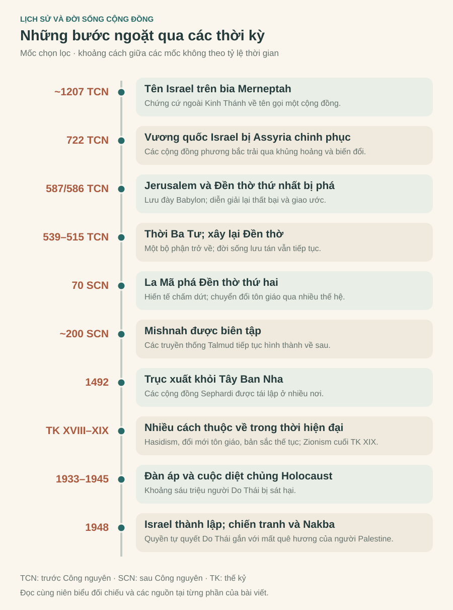
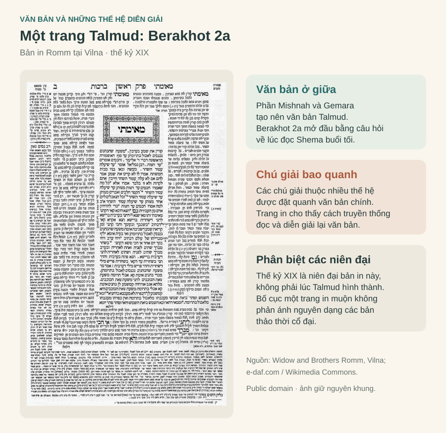
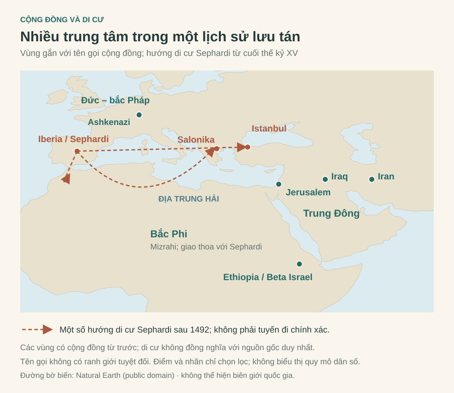

# Lịch sử dân tộc Do Thái: từ Đền thờ đến trang sách

Hãy hình dung một gia đình Do Thái quây quần trong bữa ăn nghi lễ [*Seder*](./glossary#seder-haggadah) của [lễ Vượt Qua](./glossary#pesach). Trên bàn có [bánh không men](./glossary#matzah) và [rau đắng](./glossary#maror). Người lớn kể lại câu chuyện tổ tiên rời khỏi cảnh nô lệ ở Ai Cập; trẻ em đặt câu hỏi. Trong bản văn nghi lễ [*Haggadah*](./glossary#seder-haggadah), mỗi thế hệ được nhắc rằng mình phải nhìn bản thân như người đã trực tiếp đi ra khỏi Ai Cập. Đó là cách đưa một câu chuyện về quá khứ vào trải nghiệm của người đang sống. [Nguồn: Haggadah trên Sefaria](https://voices.sefaria.org/sheets/557586).

Từ bàn ăn ấy, ta có thể bước vào một câu hỏi xuyên suốt lịch sử người Do Thái: **Điều gì giúp một cộng đồng duy trì bản sắc khi mất quyền tự chủ, phải di cư và sống phân tán trong nhiều xã hội khác nhau?**

Tôn giáo là một phần quan trọng của câu trả lời. Nhưng muốn hiểu vai trò ấy, cần theo dõi cả những thay đổi của chính tôn giáo: từ đời sống phụng tự của [Israel cổ đại](./glossary#israel-judah-kingdoms), qua [Đền thờ Jerusalem](./glossary#temple), đến Torah, [hội đường](./glossary#synagogue) và [truyền thống rabbi](./glossary#rabbi). Đồng thời, cần nhìn đến gia đình, ngôn ngữ, sinh kế, các thiết chế cộng đồng và quan hệ với những người láng giềng.

“Từ Đền thờ đến trang sách” là trục kể chuyện của bài này. Nó chỉ một sự chuyển dịch về trung tâm của đời sống tôn giáo, chứ không phải một cuộc thay thế hoàn toàn: kinh sách đã có vai trò trước khi Đền thờ bị phá hủy, còn Jerusalem và ký ức về Đền thờ tiếp tục hiện diện sau đó.

*Hình 1. Các bước ngoặt chọn lọc để định hướng khi đọc; khoảng cách giữa các mốc không theo tỷ lệ thời gian. Hình được biên soạn từ niên biểu đối chiếu cuối bài và các nguồn dẫn trong từng phần. Sự chuyển dịch từ Đền thờ sang kinh sách diễn ra qua nhiều thế hệ, trong khi đời sống tại quê hương và lưu tán cùng tiếp tục.*

## 1. Một dân tộc, một tôn giáo và nhiều cách thuộc về

Trong tiếng Việt, “[người Do Thái](./glossary#jewish-identity)” và “người theo Do Thái giáo” dễ được dùng như đồng nghĩa. Nhưng một người có thể là người Do Thái về nguồn gốc, văn hóa hoặc sự gắn bó với cộng đồng mà không thực hành tôn giáo. Ngược lại, [người cải đạo](./glossary#giyur) có thể gia nhập cộng đồng tôn giáo mà không có tổ tiên Do Thái. Bởi vậy, không thể xác định bản sắc này chỉ bằng đức tin hoặc huyết thống. [Nguồn: AJC, hướng dẫn về tôn giáo và văn hóa Do Thái](https://www.ajc.org/news/a-short-guide-to-jewish-religion-and-culture).

Khi gọi người Do Thái là một “dân tộc”, ta đang nói đến một cộng đồng lịch sử có ký ức, truyền thống và cảm thức thuộc về chung. Điều đó không có nghĩa mọi thành viên có cùng quan điểm, cùng mức độ giữ đạo hoặc cùng một trải nghiệm chính trị.

Cũng cần phân biệt các tên gọi qua thời gian. **[Israel cổ đại](./glossary#israel-judah-kingdoms)** và **[Judah cổ đại](./glossary#israel-judah-kingdoms)** là những cộng đồng, vương quốc của vùng [Cận Đông](./glossary#levant); **người Do Thái** là tên gọi gắn với một lịch sử phát triển lâu dài từ thế giới ấy; **người Israel** trong bối cảnh hiện đại thường chỉ công dân [Nhà nước Israel](./glossary#israel). Không phải mọi người Do Thái đều là công dân Israel, và không phải mọi công dân Israel đều là người Do Thái.

Những phân biệt này giúp ta tránh đọc quá khứ như thể các cộng đồng cổ đại đã mang nguyên vẹn bản sắc và thể chế của hiện tại.

## 2. Nguồn gốc: ký ức Kinh Thánh và dấu vết lịch sử

### Câu chuyện mà cộng đồng kể về mình

Trong [Kinh Thánh Hebrew](./glossary#tanakh), câu chuyện tổ tiên đi qua [Abraham, Isaac và Jacob](./glossary#abraham-isaac-jacob). Jacob nhận tên Israel; các [chi tộc](./glossary#bet-av) được đặt trong quan hệ với những người con của ông. Câu chuyện tiếp tục với cảnh nô lệ ở Ai Cập, [Moses](./glossary#moses), cuộc [Xuất hành](./glossary#exodus-event) và [giao ước](./glossary#covenant) tại [Sinai](./glossary#sinai).

Trong cách tự hiểu của truyền thống, Israel là một cộng đồng được Thiên Chúa giải phóng và trao trách nhiệm sống theo giáo huấn của Ngài. [Torah](./glossary#torah), theo nghĩa hẹp gồm năm sách đầu của Kinh Thánh Hebrew, kết nối câu chuyện nguồn gốc với những quy định về phụng tự và đời sống. Giao ước vì thế liên quan đến cách cư xử với người khác, bên cạnh việc thờ phượng.

Tuy nhiên, một bản văn kể về khởi nguyên không tự động là biên niên sử có thể kiểm chứng từng chi tiết. Các câu chuyện về tổ phụ và Xuất hành cần được đọc như truyền thống tôn giáo, đồng thời được khảo sát bằng phương pháp sử học. Chưa có bằng chứng độc lập đủ để xác nhận cuộc Xuất hành ở quy mô và theo toàn bộ trình tự mà Kinh Thánh mô tả. Điều đó cũng không cho phép khẳng định rằng mọi ký ức được lưu giữ trong câu chuyện đều không có cơ sở lịch sử. [Nguồn: Manfred Bietak và Gary A. Rendsburg, “Egypt and the Exodus”](https://jewishstudies.rutgers.edu/images/documents/faculty/Rendsburg/ch.%202%20text%20%20notes.pdf).

### Israel xuất hiện trong một thế giới Canaan

Một chứng cứ ngoài Kinh Thánh quan trọng là [bia của pharaoh Merneptah](./glossary#merneptah-stele), thường được định niên đại khoảng **1207 TCN**. Bia nhắc đến một nhóm mang tên Israel tại [Canaan](./glossary#canaan). Nó cho thấy tên gọi ấy đã tồn tại vào cuối thế kỷ XIII TCN, nhưng không xác nhận toàn bộ câu chuyện về nguồn gốc của nhóm người này. [Nguồn: Center for Online Judaic Studies, bia Merneptah](https://cojs.org/Stelae_and_Reliefs_of_Pharaoh_Merneptah-_c-_1207_BCE/).

Khảo cổ học cho thấy sự phát triển của các làng ở miền đồi Canaan trong thời kỳ hình thành Israel. Nhiều cách giải thích nhấn mạnh sự liên tục với cư dân và văn hóa địa phương, thay vì coi Israel đơn giản là một dân từ bên ngoài đến rồi thay thế hoàn toàn người Canaan. Dù vậy, việc gắn một kiểu di vật hay một khu định cư với bản sắc dân tộc cụ thể vẫn cần thận trọng. [Nguồn: Philip R. Davies, nghiên cứu về các khái niệm Israel cổ đại](https://bibleinterp.arizona.edu/sites/bibleinterp.arizona.edu/files/docs/Davies.pdf).

Như vậy, có hai câu hỏi khác nhau: cộng đồng kể gì về nguồn gốc của mình, và những nguồn tư liệu còn lại cho phép sử gia phục dựng điều gì? Đặt chúng cạnh nhau giúp ta hiểu cả lịch sử lẫn sức sống của ký ức tôn giáo.

## 3. Vương quốc và Đền thờ: khi đức tin gắn với đất đai

Theo tường thuật Kinh Thánh, [Saul](./glossary#samuel-saul), [David và Solomon](./glossary#david-solomon) đứng đầu một vương quốc thống nhất, sau đó vương quốc chia thành Israel ở phía bắc và Judah ở phía nam. Sử học và khảo cổ xác nhận sự tồn tại của hai vương quốc, nhưng quy mô và cấu trúc của vương quốc thống nhất vẫn là vấn đề tranh luận. Không nên trình bày toàn bộ bức tranh Kinh Thánh như một kết luận khảo cổ đã được thống nhất. [Nguồn: Zachary Thomas, nghiên cứu về tranh luận quanh vương quốc thống nhất](https://journals.sagepub.com/doi/10.1177/0146107916639208).

[Jerusalem](./glossary#jerusalem) trở thành trung tâm quan trọng của Judah. Trong truyền thống, Đền thờ thứ nhất gắn với Solomon. Đền thờ là nơi hiến tế và hành hương, đồng thời gắn đời sống tôn giáo với vương quyền và lãnh thổ. Tuy nhiên, phụng tự thực tế ở Israel–Judah có nhiều địa điểm và hình thức; các yêu cầu tập trung việc thờ phượng ở Jerusalem phản ánh cả một quá trình đấu tranh và cải tổ.

Tôn giáo Israel cổ đại cũng không thể được đồng nhất ngay với Do Thái giáo [độc thần](./glossary#monotheism-terms) của các thời kỳ sau. Cần phân biệt yêu cầu **chỉ phụng thờ [YHWH](./glossary#yhwh)**, tên Thiên Chúa trong Kinh Thánh Hebrew, với khẳng định **chỉ một Thiên Chúa thực sự hiện hữu**. Các tuyên bố độc thần rõ rệt trở nên đặc biệt quan trọng trong bối cảnh lưu đày và hậu lưu đày; quá trình này không diễn ra đồng đều trong mọi tầng lớp. [Nguồn: Cambridge University Press, nghiên cứu về sự hình thành Do Thái giáo độc thần](https://www.cambridge.org/core/books/abs/creating-god/scribes-priests-and-exiles-under-foreign-rule-the-emergence-of-monotheistic-judaism/DE4702FFCE96E477F902A75CA491D305).

Trong câu chuyện này, đất đai và Đền thờ mang ý nghĩa tôn giáo sâu sắc. Vì thế, khi các đế quốc đánh bại những vương quốc ấy, khủng hoảng không chỉ nằm ở việc ai sẽ cai trị. Nó còn đặt ra câu hỏi về giao ước và sự hiện diện của Thiên Chúa.

## 4. Lưu đày Babylon: giao ước có thể sống sau một vương quốc?

Israel phía bắc bị [Assyria](./glossary#assyria-babylon) chinh phục vào cuối thế kỷ VIII TCN, thường được lấy mốc **722 TCN**. Judah tồn tại lâu hơn, nhưng Jerusalem và Đền thờ bị [Babylon](./glossary#assyria-babylon) phá hủy vào **587/586 TCN**. Nhiều người thuộc tầng lớp lãnh đạo và những nhóm dân khác bị đưa sang Babylon; không phải toàn bộ cư dân Judah đều bị lưu đày. [Nguồn: nghiên cứu “Exile and Return”, Jewish Bible Quarterly](https://www.jewishbible.org/articles/exile-and-return/).

Một phần các văn bản Kinh Thánh diễn giải thảm họa như hậu quả của sự bất trung với giao ước. Trong cách hiểu ấy, thất bại quân sự không chứng minh Thiên Chúa đã biến mất hoặc mất quyền năng; nó có thể trở thành lời phán xét và lời kêu gọi thay đổi. Đây là cách giải thích thần học của truyền thống, cần được phân biệt với phân tích của sử gia về chiến tranh và quyền lực đế quốc. [Nguồn: My Jewish Learning, lưu đày Babylon](https://www.myjewishlearning.com/article/babylonian-exile/).

Từ đây nổi lên một vấn đề có ý nghĩa lâu dài: **Một cộng đồng có thể giữ quan hệ với Thiên Chúa mà không có vua riêng và không tiếp cận được Đền thờ bằng cách nào?**

Trong thời [lưu đày Babylon](./glossary#babylonian-exile) và hậu lưu đày, việc lưu giữ, biên soạn và diễn giải các truyền thống ngày càng quan trọng. Những bản văn ấy giúp cộng đồng nhìn lại thất bại, định nghĩa trách nhiệm và nuôi hy vọng phục hồi. Tuy nhiên, Torah và toàn bộ Kinh Thánh Hebrew không được viết xong trong một lần hoặc tại một thời điểm duy nhất. [Nguồn: Cambridge University Press, bối cảnh lưu đày và hậu lưu đày](https://www.cambridge.org/core/books/abs/creating-god/scribes-priests-and-exiles-under-foreign-rule-the-emergence-of-monotheistic-judaism/DE4702FFCE96E477F902A75CA491D305).

Có thể hiểu sự chuyển động ấy như việc mở rộng nơi gìn giữ bản sắc. Khi đời sống chính trị bị phá vỡ, câu chuyện, luật lệ và thực hành của cộng đồng có thể tiếp tục được truyền lại. Chúng không làm mất đi mong muốn trở về, nhưng giúp việc thuộc về cộng đồng không còn phụ thuộc hoàn toàn vào việc sống tại một nơi.

## 5. Đền thờ thứ hai: trở về và sống phân tán cùng lúc

Sau khi [Ba Tư](./glossary#persian-empire) chinh phục Babylon năm **539 TCN**, một bộ phận người lưu đày được phép trở về. [Đền thờ thứ hai](./glossary#temple) được hoàn thành khoảng **515 TCN**. Nhưng nhiều người ở lại Babylon; đời sống Do Thái tiếp tục phát triển cả trong quê hương lẫn bên ngoài. [Nguồn: My Jewish Learning, lưu đày Babylon](https://www.myjewishlearning.com/article/babylonian-exile/), [xây dựng Đền thờ thứ hai](https://www.myjewishlearning.com/article/second-temple/).

Điều này sửa một hình dung phổ biến: **[lưu tán](./glossary#eretz-yisrael-diaspora) không bắt đầu bằng một cuộc trục xuất toàn bộ người Do Thái vào năm 70**. Các cộng đồng ngoài vùng đất Israel đã tồn tại từ trước, hình thành qua cả cưỡng bức di dời lẫn di cư. Lịch sử ở quê hương và lịch sử lưu tán diễn ra song song. [Nguồn: Lester L. Grabbe, lịch sử người Do Thái thời Đền thờ thứ hai](https://api.pageplace.de/preview/DT0400.9780567700711_A42099220/preview-9780567700711_A42099220.pdf).

Thời Đền thờ thứ hai trải qua sự cai trị của Ba Tư, các thế lực [Hy Lạp hóa](./glossary#hellenization) và La Mã, xen giữa là thời kỳ tự chủ dưới triều [Hasmonean](./glossary#maccabees-hasmoneans). Đây cũng là một thế giới tôn giáo đa dạng: các nhóm có cách hiểu khác nhau về luật, quyền lực [tư tế](./glossary#kohen), đời sau và sự cứu chuộc. Kitô giáo ban đầu xuất hiện trong môi trường Do Thái này, rồi phát triển thành một tôn giáo riêng qua một quá trình kéo dài. [Nguồn: My Jewish Learning, tổng quan thời cổ đại](https://www.myjewishlearning.com/article/ancient-judaism-101/).

Hội đường đã tồn tại trước khi Đền thờ thứ hai bị phá hủy. Việc hội họp, đọc và học Torah tạo ra những nơi sinh hoạt cộng đồng bên cạnh trung tâm hiến tế ở Jerusalem. Sau năm 70, các thiết chế này dần mang vai trò lớn hơn. [Nguồn: Jeffrey Spitzer, hội đường và nhà học](https://www.myjewishlearning.com/article/the-synagogue-and-the-study-house/).

Sự đa dạng ấy rất quan trọng: Do Thái giáo của thời kỳ sau không đơn giản là bản sao của toàn bộ đời sống tôn giáo trước năm 70. Nó kế thừa một số truyền thống và phát triển chúng trong những điều kiện mới.

## 6. Năm 70 và sự phát triển của Do Thái giáo rabbi

Năm **70 SCN**, trong cuộc chiến với người Do Thái, quân La Mã phá hủy Đền thờ Jerusalem. Trung tâm hiến tế mất đi. Đây là một đứt gãy lớn, nhưng sự chuyển đổi đời sống tôn giáo sau đó diễn ra qua nhiều thế hệ, chứ không hoàn tất ngay khi chiến tranh kết thúc.

Trong quá trình ấy, **[Do Thái giáo rabbi](./glossary#rabbinic-judaism)** dần trở thành truyền thống có ảnh hưởng chủ đạo. [Rabbi](./glossary#rabbi) là người thầy và người diễn giải giáo huấn; vai trò của họ khác với tư tế thực hiện hiến tế ở Đền thờ. [Hội đường](./glossary#synagogue), [nhà học](./glossary#beit-midrash) và các thực hành trong đời sống hằng ngày giúp tổ chức quan hệ tôn giáo khi Đền thờ không còn hoạt động. [Nguồn: My Jewish Learning, Do Thái giáo sau Đền thờ](https://www.myjewishlearning.com/article/judaism-after-the-temple/), [hội đường và nhà học](https://www.myjewishlearning.com/article/the-synagogue-and-the-study-house/).

### Từ giáo huấn đến truyền thống diễn giải

Khoảng **năm 200**, [*Mishnah*](./glossary#mishnah-term) được biên tập dưới sự gắn kết với [Rabbi Judah ha-Nasi](./glossary#judah-ha-nasi). Tác phẩm tập hợp các giáo huấn rabbi về nhiều mặt của đời sống. Các cuộc thảo luận tiếp theo tạo thành [*Gemara*](./glossary#gemara); Mishnah và Gemara hợp thành [*Talmud*](./glossary#talmud). Có hai truyền thống Talmud lớn, thường gọi là Talmud Jerusalem và Talmud Babylon. [Nguồn: My Jewish Learning, Talmud là gì?](https://www.myjewishlearning.com/article/talmud-101/).

Talmud lưu lại nhiều ý kiến, tranh luận và cách lập luận. Nó không chỉ đưa ra một danh sách quy tắc cuối cùng. Nhờ đó, học tập trở thành việc bước vào một cuộc đối thoại giữa các thế hệ: luật được hiểu ra sao, áp dụng thế nào, và phải làm gì khi những nghĩa vụ va chạm nhau? [Nguồn: My Jewish Learning, Talmud và việc xây dựng lý luận pháp lý](https://www.myjewishlearning.com/article/talmud-is-not-a-code-of-law/).

*Hình 2. Trang Berakhot 2a trong bản in Romm tại Vilna, thế kỷ XIX: văn bản chính ở giữa được đặt cùng các chú giải bao quanh. Đây là một bản in muộn giúp hình dung truyền thống diễn giải, không phải bản thảo thời Talmud hình thành. Trang mở đầu bằng câu hỏi về thời điểm đọc Shema buổi tối; có thể đối chiếu [văn bản Berakhot 2a trên Sefaria](https://www.sefaria.org/Berakhot.2a). Ảnh: Widow and Brothers Romm, Vilna; nguồn e-daf.com qua [Wikimedia Commons](https://commons.wikimedia.org/wiki/File:Berakhot2a.jpg), [public domain](https://creativecommons.org/publicdomain/mark/1.0/). Bản quét giữ nguyên khung, được thu nhỏ và đặt cạnh phần giải thích tiếng Việt.*

### Một đời sống tôn giáo có thể được mang theo

Có thể thấy điều này qua [Shabbat](./glossary#shabbat), ngày nghỉ hằng tuần. Việc dừng lao động, quây quần bên bữa ăn, cầu nguyện và đọc Torah tạo một nhịp sống chung cho gia đình và cộng đồng. Phong tục thay đổi qua các địa phương và thời kỳ, nhưng nhịp tuần ấy có thể được duy trì ở những nơi khác nhau. [Nguồn: My Jewish Learning, Shabbat](https://www.myjewishlearning.com/article/shabbat-101/).

Đó là ý nghĩa chính của hình ảnh “trang sách”: thẩm quyền tôn giáo được gìn giữ qua văn bản và việc diễn giải, còn đời sống cộng đồng được tổ chức tại những nơi người Do Thái thực sự sinh sống. Đền thờ không bị quên đi; ký ức về nó tiếp tục là một phần của thế giới tôn giáo đã thay đổi.

## 7. Thời trung đại: nhiều cộng đồng, nhiều cuộc gặp gỡ

Đọc lịch sử người Do Thái chỉ qua châu Âu sẽ bỏ qua một phần lớn câu chuyện. Những tên gọi quen thuộc phản ánh các lịch sử địa phương khác nhau:

| Cộng đồng | Không gian lịch sử thường gắn với tên gọi |
| --- | --- |
| [Ashkenazi](./glossary#ashkenazi) | Đức và miền bắc Pháp, rồi nhiều vùng Trung và Đông Âu |
| [Sephardi](./glossary#sephardi) | Bán đảo Iberia và các cộng đồng hình thành sau những cuộc di cư từ đó |
| [Mizrahi](./glossary#mizrahi) | Tên gọi bao quát nhiều cộng đồng có nguồn gốc ở Trung Đông và Bắc Phi; có phần giao thoa với Sephardi |
| [Beta Israel](./glossary#beta-israel) | Truyền thống Do Thái ở Ethiopia |

Đây là những chỉ dẫn khái quát, không phải các nhóm có ranh giới tuyệt đối. Ngoài ra còn có nhiều cộng đồng khác. Khác biệt về ngôn ngữ, món ăn, phong tục và nghi lễ cùng tồn tại với những liên hệ về kinh sách và ký ức. [Nguồn: Rachel M. Solomin, sự đa dạng của các cộng đồng Do Thái](https://www.myjewishlearning.com/article/sephardic-ashkenazic-mizrahi-jews-jewish-ethnic-diversity/).

*Hình 3. Bản đồ định hướng cho bảng cộng đồng ở trên. Các tên gọi gắn với những lịch sử địa phương có giao thoa, không phải các lãnh thổ có ranh giới tuyệt đối. Mũi tên chỉ một số hướng di cư Sephardi từ Iberia tới Bắc Phi và các trung tâm Ottoman như Salonika, Istanbul từ cuối thế kỷ XV; không thể hiện tuyến đi, số lượng người di cư hay toàn bộ các điểm đến. Những vùng tiếp nhận đã có cộng đồng Do Thái từ trước. Tham khảo [tổng quan các cộng đồng Trung Đông và Bắc Phi](https://www.myjewishlearning.com/article/jews-of-the-middle-east/). Nền đường bờ biển: [Natural Earth](https://www.naturalearthdata.com/about/terms-of-use/), public domain; không dùng biên giới quốc gia hiện đại.*

### Giao lưu và sáng tạo

Trong thế giới Hồi giáo trung đại, đặc biệt ở một số giai đoạn tại bán đảo Iberia, người Do Thái tham gia những môi trường văn hóa và học thuật phong phú. Nhưng điều kiện sống thay đổi theo triều đại và địa phương; không thể coi toàn bộ thời kỳ là một thời đại hòa hợp không có phân biệt hoặc bạo lực. [Nguồn: My Jewish Learning, đời sống Do Thái tại Tây Ban Nha Hồi giáo](https://www.myjewishlearning.com/article/from-golden-to-grim-jewish-life-in-muslim-spain/).

[Maimonides](./glossary#maimonides), nhà tư tưởng thế kỷ XII, cho thấy truyền thống có thể phát triển qua đối thoại với môi trường xung quanh. Ông tìm cách suy nghĩ về giáo huấn Do Thái bằng các công cụ triết học chịu ảnh hưởng Aristotle và thế giới học thuật Hồi giáo. Việc tiếp nhận tri thức bên ngoài cũng tạo ra tranh luận trong nội bộ Do Thái. [Nguồn: My Jewish Learning, các tác phẩm triết học của Maimonides](https://www.myjewishlearning.com/article/maimonides-philosophical-writings/).

Nhìn từ đây, bản sắc được duy trì không nhất thiết bằng cách đóng kín. Một cộng đồng có thể học ngôn ngữ và tư tưởng của xã hội chung quanh, đồng thời tiếp tục đặt những câu hỏi riêng của mình.

### Kỳ thị, bạo lực và di cư

Ở châu Âu, nhiều cộng đồng trải qua các đợt đàn áp và trục xuất. Trong thời [Cái Chết Đen](./glossary#black-death), lời vu cáo người Do Thái đầu độc giếng nước góp phần thúc đẩy bạo lực. Năm **1492**, chính quyền Tây Ban Nha ban lệnh buộc người Do Thái không cải sang Kitô giáo phải rời đi. Những cuộc di cư tiếp theo làm thay đổi địa lý đời sống Do Thái. [Nguồn: My Jewish Learning, trục xuất và tái tiếp nhận](https://www.myjewishlearning.com/article/expulsion-and-readmission/).

Các thảm họa ấy cần được kể rõ, nhưng không nên chiếm toàn bộ bức tranh. Giữa chúng còn có đời sống gia đình, lao động, văn chương, học tập và những quan hệ thường nhật. Người Do Thái vừa chịu tác động của xã hội nơi mình sống, vừa tham gia tạo nên lịch sử của xã hội ấy.

## 8. Từ những đổi mới tôn giáo đến câu hỏi hiện đại về bản sắc

Sự biến đổi không chỉ đến từ bên ngoài. Thế kỷ XVIII, phong trào **[Hasidism](./glossary#hasidism)** phát triển ở Đông Âu, nhấn mạnh đời sống tâm linh, cầu nguyện và quan hệ với người lãnh đạo tinh thần gọi là [*rebbe*](./glossary#rebbe). Phong trào gặp sự phản đối từ các nhóm Do Thái khác, cho thấy việc giữ truyền thống luôn có thể đi cùng tranh luận về cách giữ nó. [Nguồn: My Jewish Learning, lịch sử Hasidism](https://www.myjewishlearning.com/article/hasidic-movement-a-history/).

Trong thời hiện đại, những thay đổi về quyền công dân, giáo dục và đời sống xã hội mở rộng các lựa chọn. Một người có thể gắn mình với một quốc gia, một văn hóa thế tục hoặc một phong trào chính trị, đồng thời tiếp tục nhận mình là người Do Thái. Quá trình này diễn ra không đồng đều giữa các cộng đồng. [Nguồn: John Efron, Oxford Bibliographies về lịch sử Do Thái hiện đại](https://academic.oup.com/reference/62376/reference-article-abstract/554971981).

Trong lĩnh vực tôn giáo, các khuynh hướng như **[Chính thống](./glossary#orthodox-judaism)**, **[Cải cách](./glossary#reform-judaism)** và **[Bảo thủ/Masorti](./glossary#conservative-masorti)** đưa ra những cách khác nhau để hiểu thẩm quyền của luật và quan hệ với đời sống hiện đại. Những tên gọi ấy không mô tả toàn bộ thế giới Do Thái; chúng cũng không phải nhãn quan điểm chính trị. [Nguồn: AJC, các khuynh hướng tôn giáo Do Thái](https://www.ajc.org/news/a-short-guide-to-jewish-religion-and-culture).

Từ đó, câu hỏi “Làm người Do Thái nghĩa là gì?” có thêm những câu trả lời: giữ đạo, giữ văn hóa, gắn bó với gia đình và ký ức, hoặc tham gia một cộng đồng lịch sử. Khảo sát về người Do Thái tại Hoa Kỳ cho thấy nguồn gốc và văn hóa có vai trò đáng kể bên cạnh thực hành tôn giáo; đây là bằng chứng về một xã hội cụ thể, không phải kết luận đại diện cho mọi cộng đồng trên thế giới. [Nguồn: Pew Research Center, bản sắc Do Thái](https://www.pewresearch.org/religion/2013/10/01/chapter-3-jewish-identity/).

## 9. Chủ nghĩa phục quốc Do Thái và Holocaust

### Một câu trả lời bằng chính trị

Cuối thế kỷ XIX, **[chủ nghĩa phục quốc Do Thái](./glossary#zionism)**, thường gọi là [*Zionism*](./glossary#zionism), phát triển như một phong trào dân tộc tìm kiếm quê hương và quyền tự quyết tại vùng đất gắn với lịch sử Israel. Những người tham gia có các động cơ và quan điểm khác nhau; phong trào có cả khuynh hướng thế tục lẫn tôn giáo và gặp nhiều phản đối ngay trong cộng đồng Do Thái. [Nguồn: Eli Barnavi, tổng quan Zionism](https://www.myjewishlearning.com/article/zionism/).

Về mặt tư tưởng, đây là một thay đổi lớn. Bên cạnh câu hỏi làm sao duy trì cộng đồng trong lưu tán, xuất hiện một chương trình nhằm thay đổi điều kiện chính trị của cộng đồng bằng việc xây dựng một quê hương quốc gia.

Zionism đã hình thành trước Holocaust. Vì thế, không thể kể lịch sử Israel như thể phong trào này chỉ xuất hiện sau cuộc diệt chủng, cũng không thể xem nó là hệ quả tất yếu được mọi người Do Thái đồng thuận.

### Một cuộc diệt chủng làm đứt gãy thế giới Do Thái châu Âu

**[Holocaust](./glossary#holocaust-shoah)**, còn gọi là [*Shoah*](./glossary#holocaust-shoah), là cuộc đàn áp và sát hại có hệ thống khoảng **sáu triệu người Do Thái châu Âu** do chế độ Đức Quốc xã cùng các đồng minh và lực lượng cộng tác thực hiện. Người Do Thái bị nhắm đến theo cách phân loại chủng tộc của Quốc xã, bất kể họ giữ đạo hay sống thế tục. [Nguồn: United States Holocaust Memorial Museum](https://encyclopedia.ushmm.org/?lang=en.html).

Sự mất mát ấy không thể được diễn đạt chỉ bằng một con số. Nó cắt đứt quan hệ gia đình và việc truyền lại ký ức, để lại những câu hỏi về trách nhiệm, niềm tin và khả năng tiếp tục sống sau thảm họa.

Tuy nhiên, khi đặt Holocaust trong lịch sử Do Thái, cần tránh biến nó thành lời giải thích bao trùm cho mọi thời kỳ trước và sau. Lịch sử của một cộng đồng không được định nghĩa trọn vẹn bởi tội ác mà người khác gây ra cho họ.

## 10. Năm 1948 và những câu hỏi còn tiếp tục

Năm **1947**, Đại hội đồng Liên Hợp Quốc đề xuất chia [Palestine dưới quyền ủy trị Anh](./glossary#mandatory-palestine) thành một nhà nước Do Thái và một nhà nước Arab, với quy chế quốc tế cho Jerusalem. Israel tuyên bố độc lập ngày **14 tháng 5 năm 1948**. Chiến tranh và những biến động quanh thời điểm ấy khiến hàng trăm nghìn người Palestine phải chạy trốn hoặc bị trục xuất khỏi nhà cửa; người Palestine gọi trải nghiệm này là **[Nakba](./glossary#nakba)**, nghĩa là “thảm họa”. [Nguồn: Liên Hợp Quốc, lịch sử vấn đề Palestine](https://www.un.org/unispal/history/), [giới thiệu về Nakba](https://www.un.org/unispal/about-the-nakba/).

Đối với nhiều người Do Thái, Israel mang ý nghĩa quyền tự quyết và một nơi có thể tìm đến sau lịch sử bất an. Nhưng lịch sử ấy đồng thời gắn với một vùng đất có những cộng đồng cư dân khác và với sự mất quê hương của người Palestine. Một bài viết lịch sử cần giữ cả hai trải nghiệm trong tầm nhìn.

Sự tồn tại của nhà nước làm thay đổi câu hỏi về quan hệ giữa dân tộc và tôn giáo. Khi luật tôn giáo, quyền công dân và quyền lực chính trị gặp nhau, việc thuộc về cộng đồng phải được suy nghĩ trong một bối cảnh khác với đời sống thiểu số ở lưu tán.

Người Do Thái, Do Thái giáo và Nhà nước Israel vì vậy là ba phạm trù cần được phân biệt khi đọc lịch sử hoặc thảo luận hiện tại. Một chính phủ không đại diện cho mọi người Do Thái, và cộng đồng Do Thái trên thế giới không có một quan điểm duy nhất về Israel.

Lịch sử này vẫn tiếp tục trong các gia đình, hội đường, trường học và cộng đồng ở nhiều quốc gia. Việc có một nhà nước không làm biến mất đời sống lưu tán hoặc các cách thuộc về đã hình thành bên ngoài nó.

## 11. Điều gì nối các thế hệ với nhau?

Trở lại bàn ăn của lễ Vượt Qua, ta thấy một hình thức truyền lại bản sắc rất cụ thể: người lớn kể, trẻ em hỏi, thức ăn gợi nhớ, và câu chuyện cũ được đặt trước trải nghiệm mới.

Qua các thời kỳ, cách truyền lại ấy đã thay đổi. Đền thờ từng là một trung tâm; kinh sách và sự diễn giải mở rộng khả năng duy trì đời sống tôn giáo; gia đình và thiết chế địa phương giúp cộng đồng tồn tại ở nhiều nơi. Trong thời hiện đại, văn hóa thế tục và những hình thức gắn bó mới tiếp tục làm phong phú các câu trả lời.

Đây là cách đọc mà bài viết đề xuất: **bản sắc được duy trì qua việc tiếp nhận và diễn giải lại di sản trong những điều kiện lịch sử khác nhau**. Đó không phải một lời giải duy nhất cho sự tồn tại của người Do Thái, càng không phải một phẩm chất bất biến có thể gán cho mọi thành viên. Nó là một hướng để hiểu mối liên hệ giữa lịch sử dân tộc và lịch sử tôn giáo.

Trang sách có thể được mang theo, nhưng cần người đọc; ký ức có thể được kể lại, nhưng cần người nghe. Những cuộc gặp gỡ giữa các thế hệ ấy là nơi câu chuyện tiếp tục sống.

## Niên biểu đối chiếu

*TCN: trước Công nguyên; SCN: sau Công nguyên. Các mốc cổ đại có thể chênh lệch giữa những hệ thống niên đại; bảng dùng các mốc phổ biến trong những nguồn đã dẫn ở trên.*

| Mốc | Lịch sử cộng đồng | Đời sống tôn giáo và bản sắc |
| --- | --- | --- |
| Khoảng 1207 TCN | Bia Merneptah nhắc đến Israel ở Canaan | Chứng cứ về tên gọi một cộng đồng, không xác nhận toàn bộ truyện nguồn gốc |
| Thời các vương quốc Israel và Judah | Phát triển nhà nước tại Nam Levant | Phụng tự gắn với đất đai, tư tế và vương quyền |
| Khoảng 722 TCN | Assyria chinh phục Israel phía bắc | Khủng hoảng và biến đổi các cộng đồng |
| 587/586 TCN | Babylon phá Jerusalem, đưa một phần dân cư đi lưu đày | Mất Đền thờ thứ nhất; diễn giải lại thất bại và giao ước |
| 539–515 TCN | Ba Tư chinh phục Babylon; một bộ phận người lưu đày trở về | Xây lại Đền thờ; đời sống tại quê hương và lưu tán cùng tiếp tục |
| 70 SCN | La Mã phá Đền thờ thứ hai | Hiến tế tại Jerusalem chấm dứt; các thiết chế khác dần giữ vai trò trung tâm |
| Khoảng 200 và các thế kỷ tiếp theo | Phát triển các trung tâm học thuật rabbi | Biên tập Mishnah, hình thành các truyền thống Talmud |
| Thời trung đại | Nhiều cộng đồng trong các xã hội Kitô giáo và Hồi giáo | Đa dạng phong tục, học thuật và cách diễn giải |
| 1492 | Trục xuất người Do Thái không cải đạo khỏi Tây Ban Nha | Các cộng đồng Sephardi được tái lập ở nhiều nơi |
| Thế kỷ XVIII–XIX | Những biến đổi xã hội của thời hiện đại | Hasidism, các khuynh hướng tôn giáo và bản sắc thế tục phát triển |
| Cuối thế kỷ XIX | Zionism phát triển | Quyền tự quyết dân tộc trở thành một chương trình chính trị |
| 1933–1945 | Quốc xã đàn áp và tiến hành cuộc diệt chủng Holocaust | Đứt gãy nghiêm trọng đời sống cộng đồng và việc truyền lại di sản |
| 1948 | Israel thành lập; chiến tranh và Nakba của người Palestine | Quan hệ giữa tôn giáo, dân tộc và nhà nước bước vào bối cảnh mới |

## Đọc tiếp

Bài này cung cấp mạch lịch sử khái quát. Để đi sâu vào các tư tưởng và điều luật, xem [Tìm hiểu tư tưởng Do Thái: từ giao ước đến một dân tộc sống bằng luật](Tư%20tưởng%201.md), [Tư tưởng Do Thái giáo trong bối cảnh Cận Đông cổ đại](Tư%20tưởng%202.md) và [bảng thuật ngữ](./glossary).

Các nguồn được dẫn ngay tại phần liên quan. Nguồn tôn giáo giúp hiểu cách truyền thống tự trình bày; nghiên cứu lịch sử và khảo cổ giúp đánh giá bằng chứng; tư liệu của bảo tàng và các tổ chức quốc tế hỗ trợ những phần về Holocaust và năm 1948. Các đoạn phân tích về việc duy trì bản sắc là cách tổng hợp của bài viết, không phải lời giải duy nhất được mọi sử gia hoặc cộng đồng Do Thái đồng thuận.
