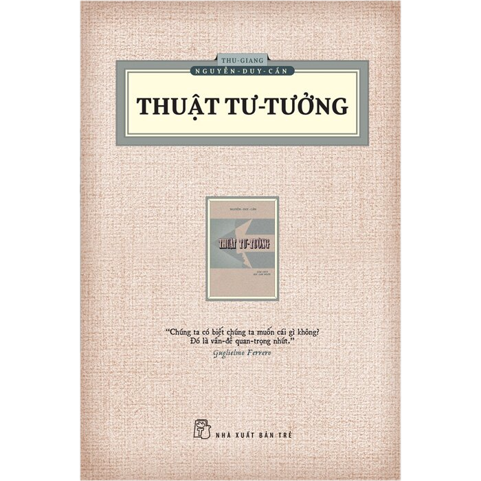

## Định nghĩa

**Tư tưởng** là những **ý niệm, quan niệm và cách nhìn tương đối có hệ thống của con người về một vấn đề, về xã hội, về con người hoặc về thế giới**, từ đó định hướng cách người đó suy nghĩ, đánh giá và hành động.

Nói đơn giản hơn:

> **Suy nghĩ** là cái đang diễn ra trong đầu bạn.  
> **Ý nghĩ** là một nội dung cụ thể bạn nghĩ ra.  
> **Tư tưởng** là một cách nhìn tương đối ổn định nằm phía sau nhiều suy nghĩ và hành động.

Ví dụ, bạn nghĩ:

> “Người có hiểu biết nên có trách nhiệm chia sẻ kiến thức cho người khác.”

Đó ban đầu có thể chỉ là **một ý nghĩ**. Nhưng nếu bạn tin rằng tri thức đi kèm trách nhiệm, thường xuyên đánh giá hành động của mình và người khác theo nguyên tắc đó, rồi đưa nó vào cách sống, thì nó đã trở thành một phần của **tư tưởng** của bạn.

### Từ nghĩa của chữ “tư tưởng”

Hai chữ Hán là **思想**:

- **思 — tư**: suy nghĩ, suy xét.
- **想 — tưởng**: nghĩ đến, hình dung, ý niệm trong tâm trí.

Nhưng **思想** trong cách dùng hiện đại không đơn giản chỉ có nghĩa “đang suy nghĩ”. Nó thường mang nghĩa rộng hơn: **hệ thống quan niệm hoặc nội dung tinh thần tương đối ổn định**.

Chẳng hạn ta nói:

- tư tưởng Nho gia
- tư tưởng Phật giáo
- tư tưởng Khai sáng
- tư tưởng chính trị
- tư tưởng đạo đức

Ta không nói đến một ý nghĩ đơn lẻ, mà đến **một cấu trúc các quan niệm có liên hệ với nhau**.

### Có thể hình dung theo các tầng

Một ví dụ:

> “Người kia thất hứa với tôi.”

Đây là một **nhận thức về sự kiện**.

Bạn nghĩ:

> “Thất hứa là hành vi không tốt.”

Đây là một **phán đoán**.

Bạn tin:

> “Con người phải giữ chữ tín, kể cả khi việc đó gây bất lợi cho bản thân.”

Đây đã gần với một **quan niệm/nguyên tắc**.

Nếu nguyên tắc đó kết nối với các quan niệm như:

> Con người phải chịu trách nhiệm về lời nói.  
> Danh dự quan trọng hơn lợi ích ngắn hạn.  
> Quan hệ giữa người với người phải dựa trên tín nghĩa.

thì toàn bộ mạng lưới ấy có thể gọi là một **tư tưởng về đạo đức và cách làm người**.

Do đó có thể biểu diễn:

**trải nghiệm → suy nghĩ → quan niệm → nguyên tắc → hệ thống tư tưởng → hành động**

Tất nhiên trong thực tế các tầng này tác động qua lại chứ không hoàn toàn tuyến tính.

### Tư tưởng khác triết học và hệ tư tưởng

Ba khái niệm này khá dễ lẫn:

| Khái niệm | Nghĩa |
|---|---|
| **Ý nghĩ** | Một nội dung cụ thể xuất hiện trong đầu |
| **Quan điểm** | Cách đánh giá một vấn đề cụ thể |
| **Tư tưởng** | Những quan niệm tương đối có hệ thống và có khả năng định hướng hành động |
| **Triết học** | Hoạt động/hệ thống tư duy nhằm tìm hiểu những vấn đề nền tảng như tồn tại, nhận thức, đạo đức, chân lý |
| **Hệ tư tưởng** | Một hệ thống tư tưởng tương đối hoàn chỉnh, thường liên quan đến xã hội, chính trị, giá trị và cách tổ chức đời sống |

Ví dụ, một người có thể có **tư tưởng về giáo dục** mà không hề xây dựng một triết học hoàn chỉnh.

Một triết gia như Khổng Tử lại có nhiều tư tưởng liên kết:

**nhân — lễ — nghĩa — trí — tín — quân tử — tu thân — trị quốc**

Khi nghiên cứu chúng như một chỉnh thể, ta nói đến **tư tưởng Khổng Tử** hoặc rộng hơn là **tư tưởng Nho gia**.

### Một điểm rất quan trọng

**Tư tưởng không chỉ là thứ người ta nói ra.**

Nó thường nằm sâu hơn lời nói và có thể được nhận ra qua:

- người đó coi điều gì là quan trọng;
- họ cho điều gì là đúng/sai;
- họ cho rằng con người “nên” sống thế nào;
- họ lý giải nguyên nhân của sự việc ra sao;
- khi hai giá trị xung đột, họ ưu tiên cái nào.

Chẳng hạn hai người đều nói:

> “Tôi coi trọng tự do.”

Nhưng một người hiểu tự do là:

> “Không ai được can thiệp vào lựa chọn của cá nhân.”

Người kia lại hiểu:

> “Con người chỉ thật sự tự do khi có khả năng tự làm chủ dục vọng của mình.”

Cùng một từ **tự do**, nhưng phía sau là **hai tư tưởng rất khác nhau về con người**.

Và đây cũng là lý do khi nghiên cứu **“tư tưởng của một thời đại”**, ta không chỉ đọc những câu người xưa viết, mà còn phải hỏi sâu hơn: **họ hiểu thế giới là gì, con người là gì, điều gì đáng sống, điều gì tạo nên một xã hội tốt, và vì sao họ tin như vậy.**

## Tư tưởng trong cuốn Thuật tư tưởng của Thu Giang - Nguyễn Duy Cần

Trong **_Thuật Tư Tưởng_ của Nguyễn Duy Cần**, “tư tưởng” được dùng theo nghĩa hẹp và mang tính **kỹ thuật của hoạt động tư duy** hơn so với cách hiểu rộng như “hệ thống quan niệm” được giải thích như trên.

Ông chủ yếu quan tâm đến **cách con người suy nghĩ cho đúng, rõ, có trật tự và không bị cảm xúc hay thành kiến dẫn dắt**. Vì vậy, “tư tưởng” trong ngữ cảnh của cuốn sách gần với **hoạt động của trí óc khi nhận xét, phân biệt, liên kết, suy luận và phán đoán về sự vật**.

Nói gọn:

> Trong *Thuật Tư Tưởng*, **tư tưởng không chỉ là “ý kiến mình tin”**, mà là **quá trình trí óc làm việc trên các ý niệm để đi đến một nhận thức hay phán đoán**.

Điểm này khiến cách dùng của Nguyễn Duy Cần khá gần với các khái niệm như **thinking / thought / reasoning** trong truyền thống logic và triết học phương Tây, hơn là nghĩa hiện đại của “tư tưởng” trong cụm như “tư tưởng Nho giáo” hay “tư tưởng chính trị”.

Ví dụ, khi ta thấy hai người tranh luận rồi lập tức kết luận:

> “Người A chắc chắn sai vì tôi không thích cách anh ta nói.”

Nguyễn Duy Cần sẽ quan tâm đến **cơ chế tư tưởng** ở đây: ta đã quan sát gì, ta đã thêm cảm tình hay ác cảm vào dữ kiện thế nào, phán đoán có vượt quá bằng chứng không, và suy luận có hợp lý không.

Do đó, mục tiêu của “thuật tư tưởng” có thể hiểu là **nghệ thuật/rèn luyện việc suy nghĩ**: biết phân tích vấn đề, định nghĩa khái niệm, phân biệt sự kiện với ý kiến, kiểm tra thành kiến, xem xét nhiều phía và tránh kết luận vội.

Có một phân biệt khá hữu ích:

| Cách dùng | “Tư tưởng” gần nghĩa với |
|---|---|
| “Tư tưởng Khổng Tử” | hệ thống quan niệm, học thuyết |
| “Tư tưởng chính trị” | hệ thống quan điểm |
| Nguyễn Duy Cần – *Thuật Tư Tưởng* | **sự suy nghĩ / hoạt động tư duy** |
| “Thuật tư tưởng” | **phương pháp suy nghĩ cho đúng** |

Vì vậy, nếu đọc nhan đề theo tiếng Việt hiện nay, **_Thuật Tư Tưởng_** dễ khiến ta tưởng là “nghệ thuật xây dựng một hệ tư tưởng”. Nhưng ý của cuốn sách gần hơn với:

> **“Nghệ thuật tư duy”**  
> hoặc  
> **“Phương pháp suy nghĩ”**.

Và đây cũng là lý do cuốn sách của Nguyễn Duy Cần thường đi vào những chuyện như **óc phê bình, thành kiến, óc quan sát, cách đặt vấn đề, cách đọc, cách xét đoán và cách suy luận**, chứ không nhằm trình bày một “hệ tư tưởng Nguyễn Duy Cần”.